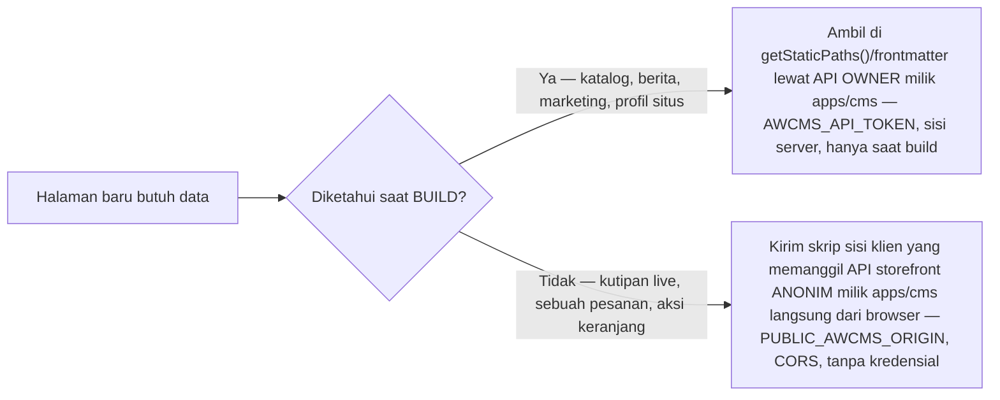

🇮🇩 Bahasa Indonesia · 🇬🇧 [English (source)](SKILL.md)

> Mirror terjemahan dari `SKILL.md`. Berkas yang dimuat oleh mekanisme skill (dicocokkan persis pada nama `SKILL.md`) adalah versi Inggris; berkas ini adalah salinan baca untuk pembaca Bahasa Indonesia, bukan berkas yang dimuat langsung.

# awcms-one — Menambah halaman storefront

Ikuti [`docs/arsitektur.md`](../../../docs/arsitektur.id.md), [`docs/routing.md`](../../../docs/routing.id.md), [ADR-0002](../../../docs/adr/0002-static-output-with-build-time-fetch-for-the-storefront.id.md), dan [ADR-0007](../../../docs/adr/0007-cart-and-checkout-stay-static-the-browser-calls-anonymous-commerce-endpoints.id.md) untuk penalaran lengkapnya; skill ini adalah panduan praktisnya.

## Satu aturan yang mengatur setiap halaman di aplikasi ini

**`apps/storefront` adalah `output: "static"`. Tidak ada halaman yang boleh menyetel `prerender = false`, sama sekali — bahkan halaman yang butuh data live.** Sebuah unit test (`apps/storefront/tests/checkout-guard-no-prerender.test.ts`) meng-grep setiap berkas di bawah `apps/storefront/src/pages` untuk string itu dan menggagalkan build jika menemukannya. Ada tepat dua cara sebuah halaman mendapat data, dan setiap halaman di aplikasi ini memakai salah satunya, tidak pernah cara ketiga:



Jika Anda mendapati diri ingin opsi ketiga — rute server-rendered, kredensial runtime di `apps/storefront/server/penyaji.mjs` — berhenti dan baca dulu tabel trade-off ADR-0007. Ide itu persis pernah diusulkan dan ditolak untuk keranjang/checkout.

## Menambah halaman build-time (kasus umum: katalog, berita, halaman statis)

1. Tambah berkas rute di bawah `apps/storefront/src/pages/` (routing berbasis-berkas Astro — `apps/storefront/src/pages/foo/[slug].astro` → `/foo/{slug}`). Daftarkan di `apps/storefront/src/config/routes.ts` jika rute itu ditautkan dari halaman lain.
2. Ambil datanya di frontmatter halaman atau `getStaticPaths()`, lewat fungsi di `apps/storefront/src/lib/awcms/` (mis. `catalog.ts`, `blog.ts`, `pemasaran.ts`) — jangan pernah `fetch()` mentah langsung di dalam halaman. Fungsi-fungsi ini memanggil API **owner** milik `apps/cms` (`AWCMS_API_TOKEN`, read-only, hanya saat build) dan di-memoize per build, sehingga beberapa halaman yang membaca resource sama tidak fetch ulang.
3. Jika halaman merender gambar yang origin-nya bukan `'self'`, atau butuh origin eksternal baru, cek bagian CSP di [`docs/arsitektur.md`](../../../docs/arsitektur.id.md) — `img-src` *diturunkan*, bukan dikonfigurasi; field gambar baru biasanya tidak butuh perubahan CSP sama sekali, karena `csp-asal-media.ts` mengumpulkan origin dari konten secara otomatis.
4. Jika halaman itu harus muncul di sitemap, daftarkan sumbernya: `registerSitemapSource(name, asyncFn)` di `apps/storefront/src/lib/sitemap-sources.ts` atau `sitemap-katalog.ts`.
5. Jika halaman itu transaksional/personal (halaman akun, halaman hasil pencarian, apa pun yang tidak boleh terindeks), tambahkan `<meta slot="head" name="robots" content="noindex, follow" />` lewat slot `head` milik `BaseLayout`, dan tambahkan ke daftar `Disallow` di `robots.txt.ts`.
6. Setiap string yang tampak ke pengguna adalah Bahasa Indonesia, tanpa syarat — tidak ada framework i18n di aplikasi ini (lihat [`docs/ui-ux.md`](../../../docs/ui-ux.id.md)).
7. Jaga kontrak landmark/skip-link: `BaseLayout` tidak merender `<h1>` — halaman Anda memiliki tepat satu. Setiap elemen interaktif adalah elemen HTML asli yang bisa di-focus — jangan pernah `<div>` dengan click handler.

## Menambah halaman atau skrip runtime (browser memanggil `apps/cms`)

Ini pola keranjang/checkout/pelacakan-pesanan/wishlist — pakai hanya saat data benar-benar tidak bisa diketahui saat build (keranjang milik seorang pembeli, sebuah pesanan spesifik).

1. Halaman itu sendiri tetap berkas `.astro` statis biasa dengan **tanpa** `prerender = false`. Semua perilaku runtime hidup di skrip sisi klien (`apps/storefront/src/scripts/`), dimuat sebagai modul eksternal biasa (`script-src 'self'` tidak punya `'unsafe-inline'` dan tidak akan pernah — setiap skrip adalah berkas asli, tidak pernah inline).
2. Panggil API **anonim** milik `apps/cms` lewat `apps/storefront/src/lib/toko-klien.ts` — satu fungsi per endpoint, setiap request `mode: "cors"` / `credentials: "omit"`, hanya header `Content-Type`. Jangan pernah panggil `fetch()` langsung ke `apps/cms` dari skrip baru; tambahkan fungsi ke `toko-klien.ts` sebagai gantinya, sehingga penanganan amplop-error (`TokoApiError`, error field-level `VALIDATION_ERROR`, `409 CART_CHANGED`, `429` dengan `Retry-After`) tetap di satu tempat.
3. `PUBLIC_AWCMS_ORIGIN` — dibaca lewat `requireAwcmsOrigin()` milik `apps/storefront/src/lib/awcms/toko-origin.ts` — adalah satu-satunya cara aplikasi ini tahu CMS mana yang dipanggil saat runtime. Ia divalidasi sekali, saat build, dari `apps/storefront/src/pages/csp.json.ts` (halaman yang selalu di-prerender tanpa syarat oleh setiap build), sehingga nilai yang hilang/salah bentuk menggagalkan **build**, bukan pemuatan halaman pembeli.
4. Sediakan tiga fallback, sama seperti setiap halaman runtime yang sudah ada: pesan `<noscript>`, fallback WhatsApp untuk kondisi JS-jalan-tapi-CMS-tak-terjangkau (`apps/storefront/src/lib/wa-fallback.ts`), dan `aria-live="polite"` pada region yang berubah (lihat [`docs/aksesibilitas.md`](../../../docs/aksesibilitas.id.md)).
5. Jangan pernah mempercayakan angka harga/stok saat build ke sebuah penulisan. Keranjang mengutip ulang secara live sebelum checkout justru karena alasan ini — angka milik halaman statis hanyalah tampilan, tidak pernah menjadi input ke sebuah pesanan.

## Memverifikasi perubahan Anda

```bash
# terminal 1
bun scripts/stub-awcms.mjs
# terminal 2, di dalam apps/storefront
AWCMS_API_URL=http://localhost:4310 AWCMS_API_TOKEN=stub-token \
  PUBLIC_AWCMS_ORIGIN=https://cms.example.com SITE_URL=http://localhost:4321 bun run build
```

`apps/storefront/scripts/stub-awcms.mjs` melayani setiap endpoint yang dipanggil aplikasi ini, termasuk mesin-status commerce-storefront (kutip → buat pesanan → lacak → konfirmasi pembayaran → batalkan) dari fixture di `tests/fixtures/awcms/`. Jika halaman Anda memanggil endpoint baru, perluas stub dan fixture-nya dalam perubahan yang sama — halaman yang satu-satunya bukti kebenarannya adalah "berhasil dikompilasi" belumlah terbukti.

```bash
bun run check         # astro check — error tipe
bun test               # dari root repo — setiap unit/build-smoke/route test storefront berjalan di sini
bun run test:e2e        # di dalam apps/storefront, hanya untuk perubahan keranjang/checkout/pelacakan yang nyata — Playwright, Chromium asli
```

`bun run audit:dokumen`/`audit:translation` (dari root) jika Anda menyentuh berkas `docs/**` dalam perubahan yang sama — lihat [`docs/pengujian.md`](../../../docs/pengujian.id.md) untuk apa yang sebenarnya dibuktikan tiap tingkat.
