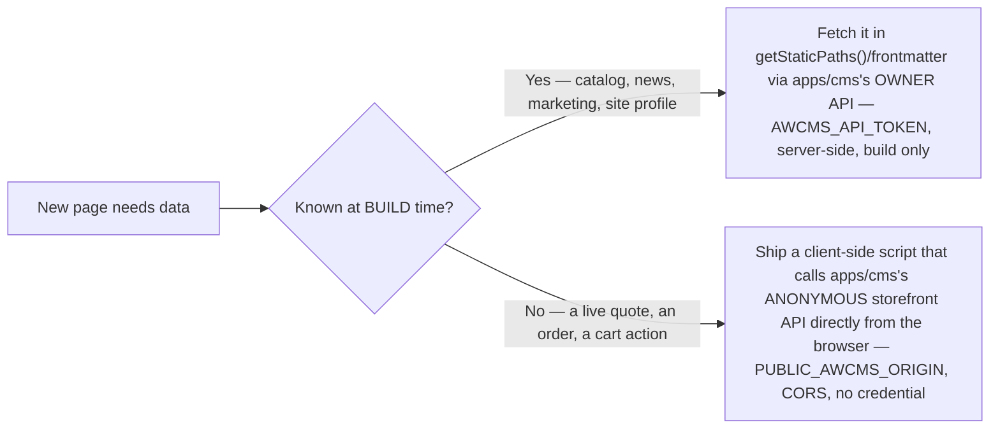

🇬🇧 English (source) · 🇮🇩 [Bahasa Indonesia](SKILL.id.md)

# awcms-one — Add a storefront page

Follow [`docs/arsitektur.md`](../../../docs/arsitektur.md), [`docs/routing.md`](../../../docs/routing.md), [ADR-0002](../../../docs/adr/0002-static-output-with-build-time-fetch-for-the-storefront.md), and [ADR-0007](../../../docs/adr/0007-cart-and-checkout-stay-static-the-browser-calls-anonymous-commerce-endpoints.md) for the full reasoning; this skill is the practical how-to.

## The one rule that governs every page in this app

**`apps/storefront` is `output: "static"`. No page may set `prerender = false`, ever — not even a page that needs live data.** A unit test (`apps/storefront/tests/checkout-guard-no-prerender.test.ts`) greps every file under `apps/storefront/src/pages` for the string and fails the build if it finds one. There are exactly two ways a page gets data, and every page in this app uses one or the other, never a third:



If you find yourself wanting a third option — a server-rendered route, a runtime credential in `apps/storefront/server/penyaji.mjs` — stop and read ADR-0007's trade-off table first. That exact idea was proposed and rejected for cart/checkout.

## Adding a build-time page (the common case: catalog, news, a static page)

1. Add the route file under `apps/storefront/src/pages/` (Astro file-based routing — `apps/storefront/src/pages/foo/[slug].astro` → `/foo/{slug}`). Register it in `apps/storefront/src/config/routes.ts` if the route is one other pages link to.
2. Fetch its data in the page's frontmatter or a `getStaticPaths()`, through a function in `apps/storefront/src/lib/awcms/` (e.g. `catalog.ts`, `blog.ts`, `pemasaran.ts`) — never a raw `fetch()` inline in a page. These functions call `apps/cms`'s **owner** API (`AWCMS_API_TOKEN`, read-only, build-time only) and are memoized per build, so multiple pages reading the same resource do not refetch it.
3. If the page renders an image whose origin isn't already `'self'`, or otherwise needs a new external origin, check [`docs/arsitektur.md`](../../../docs/arsitektur.md)'s CSP section — `img-src` is *derived*, not configured; a new image field usually needs no CSP change at all, because `csp-asal-media.ts` collects origins from content automatically.
4. If the page should appear in the sitemap, register a source: `registerSitemapSource(name, asyncFn)` in `apps/storefront/src/lib/sitemap-sources.ts` or `sitemap-katalog.ts`.
5. If the page is transactional/personal (an account page, a search results page, anything that should not be indexed), add `<meta slot="head" name="robots" content="noindex, follow" />` through `BaseLayout`'s `head` slot, and add it to `robots.txt.ts`'s `Disallow` list.
6. Every user-facing string is Indonesian, unconditionally — no i18n framework in this app (see [`docs/ui-ux.md`](../../../docs/ui-ux.md)).
7. Keep the landmark/skip-link contract: `BaseLayout` renders no `<h1>` — your page owns exactly one. Every interactive element is a real, focusable HTML element — never a `<div>` with a click handler.

## Adding a runtime (browser-calls-`apps/cms`) page or script

This is the cart/checkout/order-tracking/wishlist pattern — use it only when the data genuinely cannot be known at build time (an individual shopper's cart, a specific order).

1. The page itself is still a plain static `.astro` file with **no** `prerender = false`. All the runtime behaviour lives in a client-side script (`apps/storefront/src/scripts/`), loaded as an ordinary external module (`script-src 'self'` has no `'unsafe-inline'` and never will — every script is a real file, never inline).
2. Call `apps/cms`'s **anonymous** API through `apps/storefront/src/lib/toko-klien.ts` — one function per endpoint, every request `mode: "cors"` / `credentials: "omit"`, only a `Content-Type` header. Never call `fetch()` against `apps/cms` directly from a new script; add a function to `toko-klien.ts` instead, so the error-envelope handling (`TokoApiError`, field-level `VALIDATION_ERROR`, `409 CART_CHANGED`, `429` with `Retry-After`) stays in one place.
3. `PUBLIC_AWCMS_ORIGIN` — read through `apps/storefront/src/lib/awcms/toko-origin.ts`'s `requireAwcmsOrigin()` — is the only way this app knows which CMS to call at runtime. It is validated once, at build time, from `apps/storefront/src/pages/csp.json.ts` (a page every build unconditionally prerenders), so a missing/malformed value fails the **build**, not a shopper's page load.
4. Provide three fallbacks, matching every existing runtime page: a `<noscript>` message, a JS-ran-but-CMS-unreachable WhatsApp fallback (`apps/storefront/src/lib/wa-fallback.ts`), and `aria-live="polite"` on the region that updates (see [`docs/aksesibilitas.md`](../../../docs/aksesibilitas.md)).
5. Never trust a build-time price/stock number into a write. The cart re-quotes live before checkout for exactly this reason — a static page's own numbers are a display, never an input to an order.

## Three things increment 3 added that a new page must respect

1. **Media is resolved, never constructed.** A CMS field that carries an image is a bare id; resolve it with `resolveMedia` (`apps/storefront/src/lib/awcms/media.ts`) and render nothing when it does not resolve. Never build a URL from an id and an origin — [ADR-0011](../../../docs/adr/0011-storefront-media-resolves-through-the-media-objects-endpoint.md) exists because that guess was the obvious-looking wrong answer. If your page introduces a new image origin, it flows into the derived CSP automatically **only** because the page resolved it through that client; a hand-added origin in `csp.json.ts` is a smell.
2. **A client-side script is an external module, mounted once from a layout.** Inline `<script>` bodies never run under this app's CSP (`script-src 'self'`, no nonce on a static site). Put the code in `apps/storefront/src/scripts/`, `import` it from one `<script>` block in the layout that owns the surface, and make the markup work without it — the read-aloud player (`hidden` until proven supported) and the Daerah panel (fully rendered, only collapsed by script) are the two patterns to copy.
3. **A new page that is both a landing page and a parent of children needs no special handling — but know why.** Under `build.format: "file"` it is emitted as `name.html` beside `name/`, and `apps/storefront/server/penyaji.mjs` rewrites the shadowed path at startup ([issue #75](https://github.com/ahliweb/awcms-one/issues/75)). If you add such a page, add it to `apps/storefront/tests/penyaji-bayangan-build-smoke.test.ts`'s list rather than assuming the discovery covers it silently.

## Verifying your change

```bash
# terminal 1
bun scripts/stub-awcms.mjs
# terminal 2, inside apps/storefront
AWCMS_API_URL=http://localhost:4310 AWCMS_API_TOKEN=stub-token \
  PUBLIC_AWCMS_ORIGIN=https://cms.example.com SITE_URL=http://localhost:4321 bun run build
```

`apps/storefront/scripts/stub-awcms.mjs` serves every endpoint this app calls, including the storefront-commerce state machine (quote → create order → track → confirm payment → cancel) from fixtures under `tests/fixtures/awcms/`. If your page calls a new endpoint, extend the stub and its fixtures in the same change — a page whose only proof of correctness is "it compiled" is not proven.

```bash
bun run check         # astro check — type errors
bun test               # from the repo root — every storefront unit/build-smoke/route test runs here
bun run test:e2e        # inside apps/storefront, only for a real cart/checkout/tracking change — Playwright, real Chromium
```

`bun run audit:dokumen`/`audit:translation` (from the root) if you touched a `docs/**` file in the same change — see [`docs/pengujian.md`](../../../docs/pengujian.md) for what each tier actually proves.
