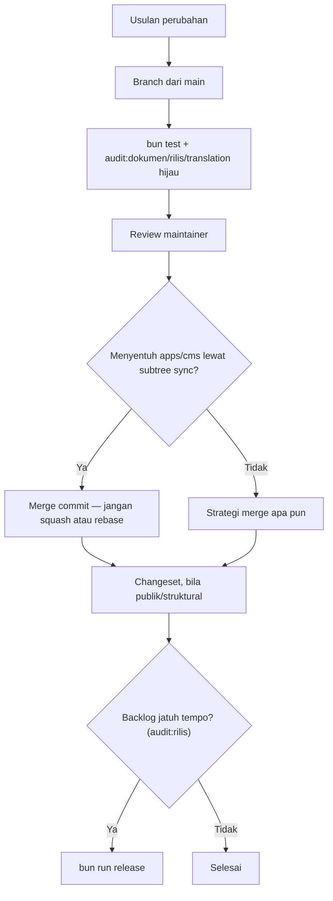

🇮🇩 Bahasa Indonesia · 🇬🇧 [English (source)](GOVERNANCE.md)

<!-- i18n-source-hash: sha256:98bcfa279aee1d9a865281821e40b7f8d1c931cbfc97c331e8761feb37bcca7c -->

# Governance

## Prinsip yang mengikat setiap keputusan

**Repo ini me-re-platform data toko komersial sungguhan dan, pada akhirnya, lalu lintas produksinya.** Cacat di sini bukan sesuatu yang abstrak: skema sumbernya berasal dari basis data MySQL produksi yang melayani pesanan sungguhan, dan tujuannya adalah platform berbasis PostgreSQL yang kelak akan menanggung transaksi sungguhan. Setiap keputusan dinilai terhadap itu.

Konsekuensinya:

- Aturan baru membawa pemeriksanya sendiri bila memungkinkan. Aturan yang hanya ditulis adalah aturan yang akan luntur, dan yang paling berbahaya adalah yang tampak terjaga padahal tidak.
- Re-platform berarti mengekspresikan ulang, bukan menebak. Keputusan skema yang tidak bisa dilacak balik ke basis data `commerce_bj_mart` yang hidup adalah keputusan yang dibuat atas asumsi, di ranah yang asumsinya sebenarnya bisa diperiksa.
- Sebuah gerbang dilonggarkan hanya lewat keputusan yang disengaja dan tercatat — tidak pernah diam-diam, demi membuat CI hijau.

## Peran

| Peran | Wewenang |
| --- | --- |
| **Maintainer** | Menyetujui merge, memutuskan pertanyaan cakupan, menerbitkan rilis dan tag |
| **Kontributor** | Mengusulkan perubahan pada kode atau dokumentasi repo ini, beserta alasannya dan (bila memungkinkan) pemeriksanya |
| **Penerjemah** | Mengisi dan menyunting cermin Indonesia dokumen governance |
| **Agen AI** | Boleh melakukan apa pun yang diizinkan [`AGENTS.md`](AGENTS.md) |

Peran di dalam `apps/cms` untuk kemampuan generiknya sendiri — admission modul, kebijakan RBAC/ABAC — mengikuti governance `awcms` sendiri sebagaimana dibawa di `apps/cms/GOVERNANCE.md`; dokumen ini mengatur `awcms-one` sebagai repositori, bukan otoritas desain internal `awcms` sendiri.

## Mencatat sebuah keputusan

Repo ini belum punya log architecture-decision-record formal (`docs/adr/`) — [issue #7](https://github.com/ahliweb/awcms-one/issues/7) mencakup dokumentasi arsitektur dan referensi, dan mungkin akan memperkenalkannya. Sampai saat itu, keputusan yang mengubah struktur repo ini, model datanya, atau sebuah aturan di `AGENTS.md` dicatat di pull request yang membuatnya dan, bila perubahannya publik atau struktural, di changeset-nya (lihat [`.changesets/README.md`](.changesets/README.md)).

`bun run audit:dokumen` sudah membawa pemeriksaan yang dibutuhkan sebuah indeks `docs/adr/` — indeks dua arah yang lengkap, tanpa baris ganda, kesesuaian status, dan kutipan `ADR-NNNN` yang resolve — dan melewati dirinya sendiri sampai direktori itu ada, alih-alih ditambal belakangan di bawah tekanan yang sama yang biasanya membuat hal semacam ini setengah jadi.

Sebuah changeset saja cukup untuk perbaikan bug, perubahan gaya, komponen baru yang mengikuti kontrak yang sudah ada, atau pembaruan dependency rutin.

## Alur keputusan

## Perubahan yang tidak boleh dilakukan sendirian

Yang berikut selalu butuh keputusan maintainer yang tercatat, sekecil apa pun perubahannya tampak:

- Meng-merge PR `git subtree pull` dengan cara selain merge commit.
- Melonggarkan sebuah gerbang demi membuat CI hijau. Bila aturannya memang salah, ubah dengan sengaja, sertakan alasannya, dan catat kenapa di PR.
- Menyunting sumber `apps/cms` dengan cara yang besar kemungkinan akan bentrok dengan atau diam-diam ditimpa oleh `git subtree pull` berikutnya, alih-alih mengontribusikan perubahannya ke upstream lebih dulu.

## Rilis

Wewenang maintainer, dijalankan lewat `bun run release` (lihat [`tools/rilis.mjs`](tools/rilis.mjs)) begitu `bun run audit:rilis` menunjukkan backlog `.changesets/` yang menunggu sudah jatuh tempo. Apa arti `bump` tiap changeset dan format tag-nya: [`.changesets/README.md`](.changesets/README.md).
