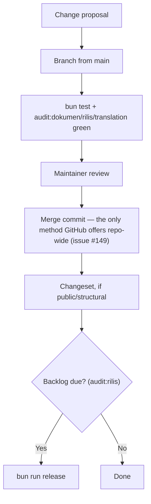

🇬🇧 English (source) · 🇮🇩 [Bahasa Indonesia](GOVERNANCE.id.md)

# Governance

## The principle that binds every decision

**This repo re-platforms a real commerce store's data and, eventually, its live traffic.** A defect here is not abstract: the source schema comes from a production MySQL database serving real orders, and the destination is a PostgreSQL-backed platform that will eventually carry real transactions. Every decision is judged against that.

What follows from it:

- A new rule brings its own checker where one is possible. A rule that is merely written is a rule that erodes, and the most dangerous version is one that looks guarded and is not.
- Re-platforming means re-expressing, not guessing. A schema decision that cannot be traced back to the live `commerce_bj_mart` database is a decision made on an assumption, in a domain where the assumption is checkable.
- A gate is loosened only by a deliberate, recorded decision — never quietly, to make CI green.

## Roles

| Role | Authority |
| --- | --- |
| **Maintainer** | Approves merges, settles scope questions, publishes releases and tags |
| **Contributor** | Proposes a change to this repo's code or documentation, with its reasoning and (where possible) its checker |
| **Translator** | Fills in and edits the Indonesian mirrors of the governance documents |
| **AI agent** | May do anything [`AGENTS.md`](AGENTS.md) permits |

Roles inside `apps/cms` for its own general-purpose capabilities — module admission, RBAC/ABAC policy — follow `awcms`'s own governance as carried in `apps/cms/GOVERNANCE.md`; this document governs `awcms-one` as a repository, not `awcms`'s own internal design authority.

## Recording a decision

This repo does not yet have a formal architecture-decision-record log (`docs/adr/`) — [issue #7](https://github.com/ahliweb/awcms-one/issues/7) covers architecture and reference documentation and may introduce one. Until then, a decision that changes this repo's structure, its data model, or a rule in `AGENTS.md` is recorded in the pull request that makes it and, where the change is public or structural, in its changeset (see [`.changesets/README.md`](.changesets/README.md)).

`bun run audit:dokumen` already carries the checks a `docs/adr/` index would need — a complete two-way index, no duplicate rows, status agreement, and `ADR-NNNN` citations that resolve — and self-skips until that directory exists, rather than being bolted on after the fact under the same pressure that tends to leave such things half-done.

A changeset alone is enough for a bug fix, a style change, a new component following an existing contract, or a routine dependency update.

## The decision flow

## Changes that may not be made alone

The following always need a recorded maintainer decision, however small the change looks:

- Merging a `git subtree pull` PR with anything other than a merge commit — since issue #149 this is also mechanically impossible repository-wide, not only a rule to follow.
- Loosening a gate to make CI green. If the rule really is wrong, change it deliberately, with its reasoning, and record why in the PR.
- Editing `apps/cms`'s source in a way that a future `git subtree pull` is likely to conflict with or silently overwrite, rather than contributing the change upstream first.

## Releases

A maintainer's authority, run through `bun run release` (see [`tools/rilis.mjs`](tools/rilis.mjs)) once `bun run audit:rilis` shows the waiting `.changesets/` backlog is due. What each changeset's `bump` means and the tag format: [`.changesets/README.md`](.changesets/README.md).
