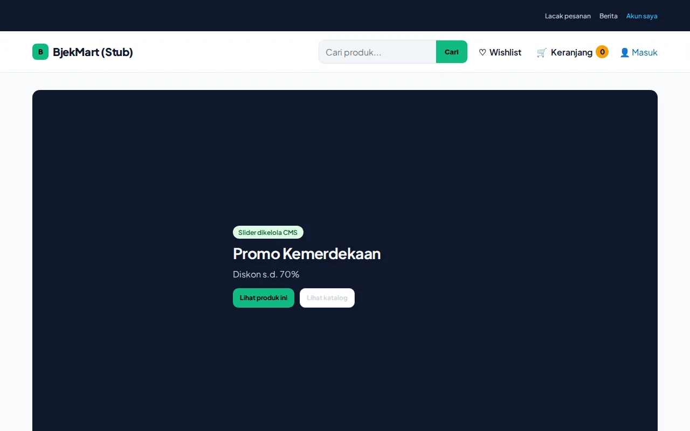
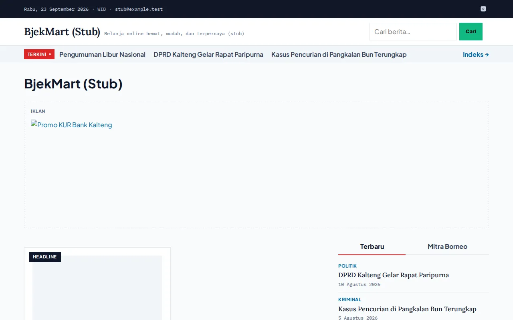
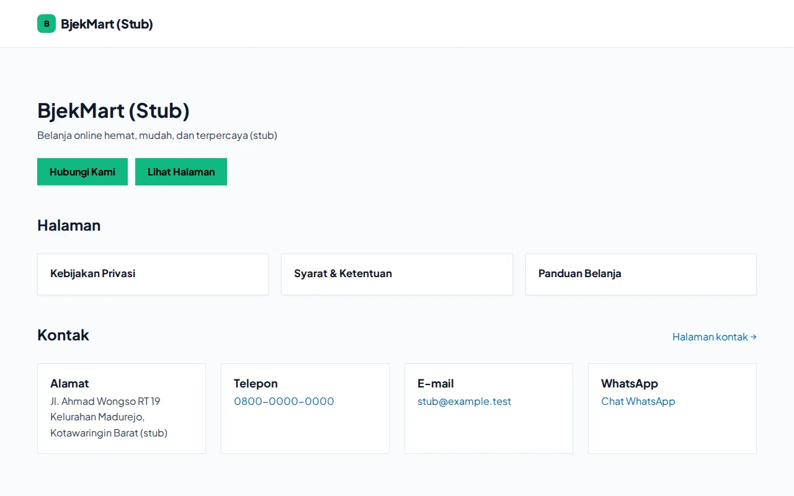

🇮🇩 Bahasa Indonesia · 🇬🇧 [English (source)](README.md)

<!-- i18n-source-hash: sha256:c6742bd2f3820b4e72d7f9eaa53f422ae1e6470262b176c917c11b97bb4fa3ba -->

[](https://github.com/ahliweb/awcms-one/actions/workflows/ci.yml) [](LICENSE) [](https://bun.sh)

# awcms-one

**awcms-one** adalah platform commerce-dan-berita berbasis Bun/Astro/PostgreSQL, dan sebuah [template GitHub](#gunakan-sebagai-template) yang menjadi titik awal aplikasi lain. Deployment hidupnya sendiri me-re-platform toko komersial borneojek-mart — PHP/Laravel/MySQL/React-Inertia — ke Bun, Astro, dan PostgreSQL di bawah row-level security, sebuah re-platform sungguhan, bukan refactor (tidak ada kode Laravel yang dibawa; skema sumber dibaca dari basis data MySQL `commerce_bj_mart` yang hidup dan diekspresikan ulang sebagai tabel modul AWCMS — lihat [issue #1](https://github.com/ahliweb/awcms-one/issues/1)).

## Tangkapan layar

Potongan above-the-fold dari halaman beranda, satu per profil build — tiga bentuk `SITE_PROFILE` yang sama seperti yang didokumentasikan lengkap di [`docs/template.md`](docs/template.id.md).

| `toko` — commerce + berita | `berita` — portal berita saja | `landing` — profil perusahaan |
| --- | --- | --- |
| [](docs/assets/readme-toko.webp) | [](docs/assets/readme-berita.webp) | [](docs/assets/readme-landing.webp) |

Setiap gambar disajikan dari `docs/assets/`, dikonversi ke WebP pada kualitas 80; ketiganya bersama-sama seberat sekitar 72 KB, jauh di bawah anggaran 600 KB dokumen ini untuk bobot gambar tambahan, dan dirender terhadap fixture CMS stub milik repo ini sendiri, bukan CMS yang sudah di-seed, sehingga konten dan brandingnya adalah placeholder — konten dan brand deployment sungguhan berasal dari CMS-nya sendiri. Diregenerasi dengan harness e2e `apps/storefront` sendiri (issue #183) — lihat [`docs/pengujian.md`](docs/pengujian.id.md#playwright-e2e-tingkat-keempat-perintahnya-sendiri-workflow-ci-nya-sendiri-issue-183) untuk pemanggilan `bun run screenshots:readme` yang persis dan perintah konversinya.

## Letak repo ini di keluarga AWCMS

| | |
| --- | --- |
| **Repo ini** | `ahliweb/awcms-one` — monorepo Bun: satu backend commerce/berita (`apps/cms`), satu storefront publik (`apps/storefront`), satu kontrak DTO bersama (`packages/kontrak`) |
| **Backend / system of record** | `apps/cms`, di repo ini — `ahliweb/awcms` disematkan utuh lewat `git subtree`, menjaga riwayat upstream tetap ada |
| **Repo model** | [`ahliweb/media-lenterakalteng`](https://github.com/ahliweb/media-lenterakalteng) — tata letak workspace, gerbang audit, konvensi changeset, dan struktur dokumen governance di repo ini diadaptasi darinya |

## Kenapa `apps/cms` menyematkan `awcms` utuh

Modul commerce yang dibutuhkan platform ini tidak bisa berdiri sendiri — ia bergantung pada infrastruktur bersama `awcms` yang tidak punya paket mandiri: `withTenant` (konteks tenant RLS), `authorizeInTransaction` (RBAC/ABAC), `appendDomainEvent` (outbox), `recordAuditEvent`, `_shared/module-contract` (`defineModule`), `getDatabaseClient`, runner migrasi SQL, dan `_shared/api-response`. Jadi `awcms` disematkan utuh, lewat `git subtree`, alih-alih dijadikan dependency sebagai paket — lihat [`AGENTS.md`](AGENTS.md#the-subtree-embed) untuk mekanika sinkronisasi dan satu aturan yang melindunginya.

## Gunakan sebagai template

`awcms-one` berjalan sebagai deployment referensi BjekMart **dan** sebagai template yang menjadi titik awal aplikasi lain: `SITE_PROFILE` saat build memilih halaman mana yang dikirim sebuah deployment, dan `bun run template:init` yang idempoten menulis ulang permukaan merek (nama, domain, warna, kontak) untuk repo yang dibuat lewat tombol **"Use this template"** milik GitHub.

1. Klik **"Use this template"** di `ahliweb/awcms-one` untuk membuat repo baru tanpa riwayat — bukan fork. Klon, lalu `bun install`.
2. Jalankan `bun run template:init`, menjawab prompt-nya (atau memberikan semua flag secara non-interaktif) — lihat [`docs/template.md`](docs/template.id.md#templateinit--referensi-cli) untuk referensi flag lengkap, termasuk `--profil`, warna, dan kolom kontak.
3. `cp .env.example .env` dan `cp apps/cms/.env.example apps/cms/.env`, mengisi apa yang belum diatur `template:init` (kredensial basis data, kunci provider mana pun — lihat [ADR-0017](docs/adr/0017-external-providers-are-commerce-owned-ports-with-env-credentials-and-token-addressed-webhooks.id.md)).
4. `bun run db:up` — PostgreSQL lokal lewat `docker compose`.
5. `bun run db:migrate:cms` — menjalankan rantai migrasi `apps/cms` sendiri.
6. `bun run db:seed:cms:profil <toko|berita|landing>` — konten contoh netral sesuai profil pilihan Anda.
7. `bun run dev` — menyalakan `apps/cms` dan `apps/storefront`, storefront dibangun dengan `SITE_PROFILE` dari langkah 2.
8. Deploy sesuai [`docs/deployment.md`](docs/deployment.id.md) — tidak ada yang berubah dari mekanisme itu hanya karena ini "repo turunan".

| Profil | Komposisi | Apa itu |
| --- | --- | --- |
| `toko` (default) | shared + toko + berita | Bentuk BjekMart hari ini — commerce dan berita bersama |
| `berita` | shared + berita | Portal berita saja, tanpa commerce |
| `landing` | shared saja | Profil perusahaan / situs landing — halaman, kontak, chrome SEO; tanpa commerce, tanpa berita |

Lihat [ADR-0018](docs/adr/0018-awcms-one-is-a-template-with-build-profiles-and-an-idempotent-init.id.md) untuk keputusan di balik mekanisme template dan [`docs/template.md`](docs/template.id.md) untuk panduan lengkapnya, referensi CLI `template:init`, matriks profil, dan set seed per profil.

## Dokumentasi

| Dokumen | Isi |
| --- | --- |
| [`docs/status.md`](docs/status.id.md) | Referensi keadaan-terkini: apa yang ada per permukaan, apa yang belum — mulai di sini untuk "apa yang sungguh ada hari ini" |
| [`AGENTS.md`](AGENTS.md) | Kontrak kerja repo ini — dibaca sebelum melakukan apa pun, manusia maupun agen |
| [`CONTRIBUTING.md`](CONTRIBUTING.md) | Penyiapan, alur kerja, konvensi branch/commit, Definition of Done |
| [`SECURITY.md`](SECURITY.md) | Cara melaporkan kerentanan, dan permukaan serangan repo ini hari ini |
| [`GOVERNANCE.md`](GOVERNANCE.md) | Peran, alur keputusan, rilis |
| [`CODE_OF_CONDUCT.md`](CODE_OF_CONDUCT.md) | Perilaku yang diharapkan |
| [`SUPPORT.md`](SUPPORT.md) | Ke mana pertanyaan atau laporan bug diarahkan |
| [`CHANGELOG.md`](CHANGELOG.md) | Riwayat rilis, dilipat dari changeset — riwayat per-increment yang tidak lagi dibawa README ini |
| [`.changesets/README.md`](.changesets/README.md) | Cara menulis catatan perubahan |
| [`knowledge/README.md`](knowledge/README.md) | Workflow graf pengetahuan Graphify + Obsidian yang terfederasi |
| [`docs/README.md`](docs/README.id.md) | Referensi arsitektur, skema, API, CMS, routing, SEO, aksesibilitas, responsif, UI/UX, pengujian, deployment, alur kerja, dan template, plus [`docs/adr/`](docs/adr/README.md) |

## Menjalankan secara lokal

```bash
cp .env.example .env
bun install
bun test               # rangkaian gerbang akar — lihat "Gerbang" di bawah
```

Repo ini **hanya-Bun**: Bun adalah runtime sekaligus package manager, versinya dipin di `packageManager`/`engines.bun`, dan `bun.lock` adalah satu-satunya lockfile.

| Perintah | Kegunaan |
| --- | --- |
| `bun install` | Meresolusi seluruh workspace |
| `bun test` | Rangkaian gerbang akar. `bunfig.toml` mengecualikan `apps/cms/**` — rangkaian itu ~500 berkas dan butuh PostgreSQL hidup; ia berjalan di bawah gerbangnya sendiri, `bun run check:cms` |
| `bun run check:lockfile` | Membuktikan `bun.lock` benar-benar milik `package.json` repo ini, untuk akar dan setiap anggota workspace |
| `bun run check:cms` | Rangkaian gerbang penuh `apps/cms` sendiri (53 langkah — lint, docs, inventaris, spec, gerbang, typecheck, tesnya sendiri, build-nya sendiri) |
| `bun run db:up` / `db:down` / `db:reset` | Menyalakan/mematikan/mereset `postgres:18.4` lokal sekali-pakai (`compose.yaml`) |
| `bun run db:migrate:cms` | Menjalankan migrasi `apps/cms` terhadap `DATABASE_URL` — lihat `apps/cms/.env.example` |
| `bun run db:seed:cms` | Men-seed tenant `borneojek-mart`, katalog, permukaan marketing, dan contoh pesanan lewat API publik `apps/cms` sendiri — lihat [`docs/deployment.md`](docs/deployment.id.md) |
| `bun run deploy:preflight` | Preflight produksi fail-closed — bentuk env build storefront, lalu mendelegasikan ke `commerce:deploy:preflight` milik `apps/cms` sendiri — lihat [`docs/deployment.md`](docs/deployment.id.md) dan ADR-0019 |
| `bun run release` | Memotong rilis bertag dari changeset yang menunggu — lihat [`CONTRIBUTING.md`](CONTRIBUTING.md) |
| `dev` / `build` / `check` / `serve` | Mendelegasikan ke `apps/storefront` — `bun run build` men-type-check, mengambil konten katalog/marketing/berita dari `apps/cms` saat build, dan memanggang output statis termasuk CSP turunan; `bun run serve` menjalankan `apps/storefront/server/penyaji.mjs` yang sudah di-build. Ketiga perintah saat-build ini menuruti `SITE_PROFILE` (default `toko`) — lihat [`docs/deployment.md`](docs/deployment.id.md) |
| `bun run template:init` | Inisialisasi merek/profil yang idempoten untuk repo turunan — lihat [`docs/template.md`](docs/template.id.md) |

## Arsitektur sekilas

```
apps/
├── cms/                     ahliweb/awcms, disematkan lewat git subtree dengan riwayat penuh —
│                             backend commerce/berita dan system of record, membawa satu modul
│                             commerce (katalog, marketing, pesanan, akun pelanggan, afiliasi,
│                             integrasi provider eksternal — lihat docs/status.md) plus API
│                             anonim dan ber-bearer /api/v1/commerce/storefront/* serta route
│                             intake webhook publik
└── storefront/              storefront Astro publik — output: "static" di seluruh bagian,
                              dibangun per SITE_PROFILE; keranjang/checkout dan permukaan akun
                              memanggil API storefront apps/cms langsung dari browser
                              (ADR-0007, ADR-0016)
packages/
├── config/                  preset tsconfig bersama
├── gerbang/                 gerbang audit workspace ini, sebagai paket
└── kontrak/                 kontrak DTO bertipe-saja yang diimpor apps/storefront dari apps/cms,
                              plus gerbang arah-impornya
tools/                       skrip lintas-workspace: rilis, pemeriksaan lockfile, stamp i18n docs,
                              update/combine/export graf pengetahuan, data seed, template:init
tests/                       tes gerbang tingkat akar (docs, changeset, toolchain, skrip,
                              arah impor)
docs/                        referensi arsitektur, skema, API, CMS, routing, SEO, aksesibilitas,
                              responsif, UI/UX, pengujian, deployment, alur kerja, dan
                              template, plus docs/adr/ dan docs/status.md
knowledge/                   workflow graf pengetahuan Graphify + Obsidian yang terfederasi
.claude/skills/               awcms-one-storefront, awcms-one-commerce, awcms-one-template —
                              panduan cara menambah halaman storefront, tabel/endpoint
                              commerce, atau memulai aplikasi baru dari template ini
.changesets/, .github/       tetap di akar repo — keputusan tentang repo secara keseluruhan
```

PostgreSQL hidup dan tersedia ada untuk pengembangan lokal dan CI (`compose.yaml`, `bun run db:up`/`db:migrate:cms`/`db:seed:cms`, job CI `check-cms`), dan topologi produksi nyata juga sudah ada (`compose.production.yaml`, `bun run deploy:preflight` yang fail-closed, ADR-0019) — lihat [`docs/deployment.md`](docs/deployment.id.md) untuk kedua urutannya, [`docs/arsitektur.md`](docs/arsitektur.id.md) untuk topologi lengkap dan desain trust-tier-nya, dan [`docs/status.md`](docs/status.id.md) untuk apa yang ada hari ini, per permukaan, dan apa yang belum.

## Gerbang

`bun test` plus empat skrip `audit:*` berjalan tanpa syarat di setiap push, tidak butuh build, jaringan, atau `apps/cms`. Job `Check` adalah **matriks atas tiga profil build** — `Check (toko)`, `Check (berita)`, `Check (landing)` — tiap kaki men-type-check dan menjalankan profile-smoke-test `apps/storefront` di bawah `SITE_PROFILE` masing-masing; tes akar dan skrip `audit:*` berjalan sekali, di kaki `toko`. Job CI kedua, `check-cms`, menjalankan rangkaian gerbang penuh `apps/cms` sendiri plus rangkaian integrasi ber-gerbang-DB-nya terhadap PostgreSQL hidup yang sekali-pakai — lihat [`docs/alur-kerja-pengembangan.md`](docs/alur-kerja-pengembangan.id.md). **`Check (toko)`, `Check (berita)`, `Check (landing)`, dan `check-cms` semuanya adalah status check wajib di `main`.** Sebuah workflow keempat, `.github/workflows/template-init-smoke.yml`, menjalankan matriks `bun run template:init` atas ketiga profil ke dalam salinan sementara repo, plus satu leg `root-suite` yang menjalankan suite tes derived-repository penuh sekali; **keempat leg-nya juga adalah status check wajib.**

| Gerbang | Yang ditangkapnya |
| --- | --- |
| `bun run audit:dokumen` | Tautan markdown mati; indeks ADR yang tidak lengkap di salah satu arah atau membawa baris duplikat; jalur berkas dalam backtick yang tidak ada di repo ini; kutipan `ADR-NNNN` yang tidak menuju ke mana pun; angka yang dieja yang tidak cocok dengan set yang diklaimnya dihitung |
| `bun run audit:rilis` | Backlog `.changesets/` yang menunggu melewati batasnya — 20 berkas atau 14 hari |
| `bun run audit:translation` | Cermin Indonesia (`<nama>.id.md`) yang hash sumber tercatatnya tidak lagi cocok dengan sumber Inggrisnya, atau dokumen governance tanpa cermin sama sekali |
| `bun run audit:graf` (alias: `knowledge:check`) | Korpus graf pengetahuan akar (`graphify-out/`) menggambarkan dirinya sendiri secara jujur, termasuk bahwa korpus tidak melenceng lebih dari `MAX_STALE_FILES` (40) berkas dari pohon yang digambarkannya — lihat [`knowledge/README.md`](knowledge/README.md) |
| `bun test` | Rangkaian tes gerbang akar — `tests/*.test.mjs` — plus tes unit/build-smoke/route milik `apps/storefront` sendiri |
| `check-cms` (job CI) | Rangkaian `bun run check` ~53 langkah `apps/cms` sendiri, lalu rangkaian `tests/integration/`-nya terhadap PostgreSQL hidup yang termigrasi sungguhan |

Empat workflow lagi berjalan di setiap push tapi **belum** menjadi status check wajib: `.github/workflows/codeql.yml` (analisis CodeQL `security-extended` milik GitHub, plus jadwal mingguan), `.github/workflows/e2e.yml` (Playwright — checkout, popup iklan, aksesibilitas axe-core, pemeriksaan responsif/overflow, dan tangkapan layar per profil, dimatriks atas tiga profil build), `.github/workflows/images.yml` (mempublikasikan image `runtime`/`jobs` milik `apps/cms` ke GHCR dengan SBOM dan provenance, pada tag versi atau dispatch), dan `.github/workflows/release.yml` (mempublikasikan GitHub Release dari bagian `CHANGELOG.md` sebuah tag versi yang di-push). Lihat komentar `template-init-smoke.yml` sendiri untuk jalur promosi yang diikuti sebuah workflow begitu ia sudah berjalan hijau untuk sementara waktu, dan [`docs/README.md`](docs/README.id.md) untuk indeks dokumentasi lengkap.

## Bahasa

Bahasa Inggris di jalur telanjang adalah sumber otoritatif; Bahasa Indonesia di `<nama>.id.md` adalah cerminnya, dan ia mencatat hash dari bahasa Inggris yang diterjemahkannya. `bun run audit:translation` gagal saat sebuah cermin menjadi basi. Cermin dokumen ini adalah [`README.id.md`](README.id.md).

Kode repo ini sendiri (`packages/gerbang/`, `tools/`, `tests/`) ditulis dalam bahasa Inggris sepenuhnya — identifier, komentar, maupun pesan gerbang. `apps/cms` membawa konvensinya sendiri yang terpisah sebagai kode `ahliweb/awcms` yang disematkan; repo ini tidak mengatur atau mengubahnya.

## Lisensi

[MIT](LICENSE) untuk kode di repo ini. `apps/cms` membawa lisensi dan notice hak cipta `ahliweb/awcms` sendiri sebagai bagian dari riwayat yang disematkan; lihat `LICENSE` workspace itu sendiri.
