🇮🇩 Bahasa Indonesia · 🇬🇧 [English (source)](README.md)

<!-- i18n-source-hash: sha256:8b1e61edd21a377b25fb516c3bb3354a0c19456d364dbd5b668a8f6fb565b713 -->

# AWCMS Project Skills

Skill Claude Code tingkat-proyek untuk AWCMS. Setiap skill meng-encode standar dari `docs/awcms/` sehingga coding agent menerapkannya secara konsisten. Skill dipanggil otomatis oleh model saat relevan, atau manual via `/<nama-skill>`.

> Baca [`../../AGENTS.md`](../../AGENTS.md) lebih dulu untuk aturan wajib & alur kerja.

> **DIGERBANGI sejak 4 Agustus 2026 — [ADR-0062](../../docs/adr/0062-skills-are-gated-against-the-code-they-describe.md).**
> `bun run skills:check` (bagian dari `bun run check`) menegakkan tiga hal, dan
> menyunting skill kini bisa memerahkan CI:
>
> 1. **Skill modul HIDUP menjelaskan kode HIDUP.** Kalau `awcms-<x>` subjeknya ada
>    di registry modul, setiap path `` `src/…` `` yang dikutipnya wajib ADA. Tidak
>    ada pengecualian untuk aturan ini.
> 2. **Setiap `ADR-NNNN` yang dikutip punya berkas** di `docs/adr/`.
> 3. **Skill untuk kode yang TIDAK ada wajib terdaftar** di `ASPIRATIONAL_SKILLS`
>    (`scripts/skills-check.ts`) dengan alasan: `target-spec`, `historical`, atau
>    `cross-cutting`.
> 4. **Setiap `bun run <target>` wajib ada** di `package.json` atau terdaftar di
>    [`scripts/README.md`](../../scripts/README.md) §Ditunda. §Ditunda memang
>    mengizinkan skill menyebut target acuan yang belum dibangun — aturan ini
>    hanya menangkap yang bukan keduanya.
>
> **Menulis path milik repo ARSIP?** Tulis `` `awcms-mini:src/…` `` /
> `` `awcms-micro:src/…` ``, bukan `` `src/…` ``. Badan banyak skill di sini
> memuat spesifikasi mini apa adanya, dan menuliskan path sumber seolah path repo
> ini persis kesalahan yang digerbangi.

> **ADR-0055 (2 Agustus 2026) MENCABUT alur mini-first.** `awcms-mini`/`awcms-micro`
> adalah **ARSIP**: boleh dibaca sebagai sejarah/spesifikasi, tidak menerima
> perubahan, dan **bukan sumber pekerjaan terjadwal**. Skill yang badannya berbunyi
> "port dari mini" adalah catatan historis — kemampuan yang diinginkan **dibangun di
> repo ini** dengan ADR admission-nya sendiri. `awcms-port-from-mini` dipertahankan
> sebagai catatan BAGAIMANA port dulu dikerjakan, bukan sebagai perintah kerja.

> **Asal & status (diperbarui 2026-08-08).** Skill-skill ini **dahulu** diadaptasi
> dari repo acuan [`ahliweb/awcms-mini`](https://github.com/ahliweb/awcms-mini)
> dan [`awcms-micro`](https://github.com/ahliweb/awcms-micro) — provenance, bukan
> jalur kerja: program penyerapan itu ditutup ADR-0055 (lihat paragraf di atas).
> Keluarga hari ini dua repo, `awcms` + [`awcms-astro`](https://github.com/ahliweb/awcms-astro)
> (halaman publik + permukaan admin USER, ADR-0070). **KOREKSI:** versi sebelumnya menyatakan
> implementasi ini "baru fondasi Sprint 1–2" dengan empat modul — itu **sudah
> lama tidak benar**. Repo ini punya **24 modul terdaftar** dan `sql/001`–`sql/152`;
> lihat [`docs/ARCHITECTURE.md`](../../docs/ARCHITECTURE.md) untuk daftar nyata.
> Skill yang badannya masih menandai dirinya "BACAAN SAJA" tetap begitu — itu
> per-skill, bukan pernyataan tentang repo secara keseluruhan.

> **Verifikasi command sebelum menjalankannya.** `package.json` kini punya **87
> script** (diperiksa 5 Agustus 2026), termasuk yang dulu ditandai belum ada:
> `openapi:bundle`, `data-lifecycle:*`, `reporting:*`,
> `db:work-class:generate`/`db:work-class:check`, dan — **koreksi 4 Agustus
> 2026** — `repo:inventory:generate`/`repo:inventory:check`, yang catatan
> sebelumnya masih menyebut "benar-benar tidak ada". Keduanya mendarat di #374
> bersama generator `awcms/repo-inventory.md`.
>
> Yang masih benar-benar tidak ada: `i18n:*`, dan `extension:check` (yang
> terakhir **DIHAPUS** oleh ADR-0034, bukan tertunda — jangan merujuknya).
>
> Tetap cek `package.json` sebelum mengeksekusi command dari sebuah skill;
> daftar ini bergerak tiap kali modul baru mendarat, dan **paragraf ini bukan
> yang digerbangi** — `skills:check` (ADR-0062) menegakkan `SKILL.md`, bukan
> berkas ini.

## Katalog

| Skill                                        | Kapan dipakai                                                                                                                                                                      | Sumber docs                                 |
| -------------------------------------------- | ---------------------------------------------------------------------------------------------------------------------------------------------------------------------------------- | ------------------------------------------- |
| `awcms-implement-issue`                      | Orkestrator: kerjakan satu issue/sprint atomic end-to-end                                                                                                                          | 06, 11, 12                                  |
| `awcms-new-module`                           | Scaffold modul baru di `src/modules/`                                                                                                                                              | 10, 11                                      |
| `awcms-port-from-mini`                       | **HISTORIS** — alur mini-first dicabut ADR-0055; catatan bagaimana port dulu dikerjakan (rename prefix, konsolidasi migrasi, DoD), bukan perintah kerja                            | alur-pengembangan-mini-first.md             |
| `awcms-module-management`                    | Kelola/konsumsi sistem Module Management (registry, lifecycle, settings, health)                                                                                                   | module-management/README.md                 |
| `awcms-new-migration`                        | Buat/ubah migration SQL (tabel, index, RLS)                                                                                                                                        | 04, 10                                      |
| `awcms-new-endpoint`                         | Tambah/ubah endpoint REST + OpenAPI                                                                                                                                                | 05, 10                                      |
| `awcms-new-event`                            | Tambah/ubah domain event + AsyncAPI                                                                                                                                                | 05                                          |
| `awcms-idempotency`                          | Mutation high-risk anti double-submit                                                                                                                                              | 10                                          |
| `awcms-abac-guard`                           | Kontrol akses default-deny + RLS                                                                                                                                                   | 03, 10                                      |
| `awcms-audit-log`                            | Audit aksi high-risk + redaction                                                                                                                                                   | 03, 10                                      |
| `awcms-observability`                        | Correlation ID otomatis, retensi/purge audit log, extension point log/audit                                                                                                        | 10, 16, 20                                  |
| `awcms-new-migration` + `awcms-new-endpoint` | Soft delete/restore/purge resource deletable                                                                                                                                       | 04, 05, 10, 16                              |
| `awcms-sensitive-data`                       | Normalize/hash/mask identifier sensitif                                                                                                                                            | 04                                          |
| `awcms-sync-hmac`                            | Sync push/pull bertanda HMAC + anti-replay                                                                                                                                         | 08, 10                                      |
| `awcms-security-review`                      | Review keamanan modul                                                                                                                                                              | 12, 13                                      |
| `awcms-codeql-triage`                        | Triase & perbaiki temuan CodeQL code scanning (termasuk katalog false-positive)                                                                                                    | 20                                          |
| `awcms-pr-review`                            | Review pull request terhadap DoD                                                                                                                                                   | 09, 10, 12                                  |
| `awcms-testing`                              | Tulis test berlapis (unit→security)                                                                                                                                                | 07                                          |
| `awcms-browser-test`                         | E2E browser sungguhan (Playwright + Bun) — puncak piramida testing                                                                                                                 | 07, browser-test/SKILL.md                   |
| `awcms-production-preflight`                 | Preflight & go-live readiness                                                                                                                                                      | 07, 12                                      |
| `awcms-deploy`                               | Pilih & jalankan profil deployment (LAN-first vs registry/Coolify)                                                                                                                 | 18, deploy-coolify.md                       |
| `awcms-ui-screen`                            | Implementasi layar/komponen UI sesuai design system                                                                                                                                | 14, 15                                      |
| `awcms-wizard-form`                          | Form multi-step (reusable wizard pattern)                                                                                                                                          | wizard-form-pattern.md                      |
| `awcms-form-drafts`                          | Server-side draft persistence (resume lintas sesi/perangkat)                                                                                                                       | form-drafts/README.md                       |
| `awcms-email`                                | Kirim email transaksional (provider-neutral, template management, outbox)                                                                                                          | email/README.md                             |
| `awcms-i18n`                                 | String UI `.po` gettext & konten multi-bahasa                                                                                                                                      | 14, 04, 19                                  |
| `awcms-release`                              | Rilis versi via Changesets (bump, CHANGELOG, tag)                                                                                                                                  | 09                                          |
| `awcms-legacy-migration`                     | Migrasi data legacy aman (dry-run, backfill)                                                                                                                                       | 07, 06                                      |
| `awcms-blog-content`                         | Kerjakan bagian mana pun epic blog_content (Issue #537-#543)                                                                                                                       | blog-content/README.md                      |
| `awcms-tenant-domain-routing`                | Kerjakan bagian mana pun epic online public routing & tenant domain (Issue #556-#567)                                                                                              | tenant-domain-routing/SKILL.md              |
| `awcms-auth-online-hardening`                | Alasan desain pengerasan auth online (Turnstile/MFA/OIDC/admin policy UI). Kapabilitasnya SUDAH ADA (#184/#185/#186/#274); path & nomor issue di badannya milik micro — baca §Peta | auth-online-hardening/SKILL.md              |
| `awcms-visitor-analytics`                    | Kerjakan bagian mana pun epic visitor analytics (Issue #617-#624)                                                                                                                  | visitor-analytics/SKILL.md                  |
| `awcms-jualanku-porting`                     | **RENCANA** — porting Jualanku.info (ADR-0045): merchant = business scope, BFF, 5 bounded context. Belum ada kode                                                                  | docs/awcms/jualanku/                        |
| `awcms-news-portal`                          | **HISTORIS** — modul dilebur ke `blog_content` (ADR-0044/#300); spesifikasi pra-merge, pakai `awcms-blog-content`                                                                  | news-portal/SKILL.md                        |
| `awcms-idn-admin-regions`                    | Kerjakan bagian mana pun epic master data wilayah administratif Indonesia (Issue #655-#664)                                                                                        | idn-admin-regions/SKILL.md                  |
| `awcms-social-publishing`                    | Kerjakan bagian mana pun epic social_publishing auto-posting outbox foundation (Issue #643-#647)                                                                                   | social-publishing/SKILL.md                  |
| `awcms-data-lifecycle`                       | Daftarkan tabel bervolume tinggi ke registry retensi/partisi/arsip/legal hold/purge (Issue #745)                                                                                   | data-lifecycle/README.md, data-lifecycle.md |
| `awcms-media-library`                        | Kelola/konsumsi modul media_library — registry objek media per-tenant, presigned R2 upload/finalize, reconcile, enforcement (ADR-0036)                                             | media-library/SKILL.md, ADR-0036            |
| `awcms-seo-distribution`                     | Kelola/konsumsi modul seo_distribution — metadata SEO terpusat, rute discovery publik (robots/sitemap/feed), tata kelola redirect + telemetri 404 (ADR-0038/0039)                  | seo-distribution/SKILL.md, ADR-0038/0039    |
| `awcms-site-search`                          | Kelola/konsumsi modul site_search — indeks FTS lintas-konten, seam `searchSources`, query/suggest publik, admin index/settings/diagnostics (ADR-0040)                              | site-search/SKILL.md, ADR-0040              |
| `awcms-comments`                             | Kelola/konsumsi modul comments — komentar moderation-first, seam `commentableResources`, permukaan tulis PUBLIK tak-terautentikasi, antrean moderasi admin (ADR-0041)              | comments/SKILL.md, ADR-0041                 |
| `awcms-erp-extension-readiness`              | BACAAN SAJA / HISTORIS (ADR-0034) — kontrak kesiapan ekstensi ERP base & jalur turunan DIHAPUS; ERP kini modul `domain` langsung di `src/modules/` (pakai `awcms-new-module`)      | erp-extension-readiness/SKILL.md (historis) |
| `awcms-document-infrastructure`              | Kerjakan bagian mana pun modul document_infrastructure — registry dokumen generik, versioning, classification, numbering (Issue #751)                                              | document-infrastructure/SKILL.md            |
| `awcms-integration-hub`                      | Kerjakan bagian mana pun modul integration_hub — inbound webhook, outbound subscription, adapter health, SSRF guard (Issue #754)                                                   | integration-hub/SKILL.md                    |
| `awcms-workflow-approval`                    | Kerjakan bagian mana pun modul workflow_approval — graph engine, quorum, delegation, escalation (Issue 11.1, evolved #747)                                                         | workflow-approval/SKILL.md                  |
| `awcms-profile-identity`                     | Kerjakan bagian mana pun modul profile_identity — party CRUD, dedup, merge workflow, cross-tenant guard (Issue 2.2, dilengkapi #748)                                               | profile-identity/SKILL.md                   |
| `awcms-tenant-admin`                         | Kelola/konsumsi modul tenant_admin — office directory CRUD, soft delete/restore, tenant settings, setup-wizard bootstrap                                                           | tenant-admin/SKILL.md                       |
| `awcms-reporting`                            | Kerjakan/konsumsi modul reporting — report view, projection registry/rebuild/reconcile/export, TOCTOU rebuild-lock (Issue #151)                                                    | reporting/SKILL.md                          |
| `awcms-theming`                              | Kelola/konsumsi modul theming — presentasi tenant-selectable, lifecycle draft→validate→preview→publish→rollback/retire, security spine validasi CSS by-rejection (ADR-0034 Fase 3) | theming/README.md, ADR-0034                 |

## Katalog peningkatan (improvement/hardening)

Skill di bawah bersifat **peningkatan** — menilai & menaikkan mutu artefak yang sudah ada, bukan membangunnya dari nol. Pakai setelah fitur jalan, saat audit, atau menjelang go-live.

| Skill                      | Kapan dipakai                                                                               | Sumber docs                          |
| -------------------------- | ------------------------------------------------------------------------------------------- | ------------------------------------ |
| `awcms-ux-review`          | Audit & naikkan mutu UI/UX yang sudah ada (usability, a11y AA, i18n)                        | 14, 15, 19                           |
| `awcms-performance`        | Tuning performa aplikasi & database (query, index, pagination, pool)                        | 16, 07                               |
| `awcms-edge-cache`         | Lapisan cache tepi Varnish auto-aktivasi: permukaan cacheable, surrogate key, antrean purge | ADR-0042, edge-cache-architecture.md |
| `awcms-integration`        | Kerasan backend & integrasi eksternal (outbox, retry, webhook, kontrak)                     | 16, 05, 10                           |
| `awcms-security-hardening` | Audit keamanan berbasis standar (OWASP Top 10, ASVS, ISO 27001)                             | 20, 10, 13                           |

## Katalog maintenance/tooling

Skill di bawah bukan build fitur maupun audit — murni menjaga artefak
mekanis (docs snapshot, dsb.) tetap sinkron dengan state eksternal.

| Skill                   | Kapan dipakai                                                                                                  | Sumber docs                    |
| ----------------------- | -------------------------------------------------------------------------------------------------------------- | ------------------------------ |
| `awcms-github-snapshot` | **Hanya spesifikasi target** — `docs/awcms/github/` tidak ada di sini; query `gh` langsung untuk state tracker | awcms-github-snapshot/SKILL.md |
| `awcms-repo-inventory`  | Regenerate `docs/awcms/repo-inventory.md` setelah menambah modul/migration/tabel/test/route                    | repo-inventory/SKILL.md        |

## Peta pemakaian

```mermaid
flowchart TD
  II[awcms-implement-issue] --> NM[awcms-new-module]
  NM --> MM[awcms-module-management]
  MM --> ABAC
  II --> MIG[awcms-new-migration]
  II --> EP[awcms-new-endpoint]
  II --> EV[awcms-new-event]
  II --> TST[awcms-testing]
  TST --> BRT[awcms-browser-test]
  EP --> ABAC[awcms-abac-guard]
  EP --> IDEM[awcms-idempotency]
  ABAC --> AUD[awcms-audit-log]
  AUD --> OBS[awcms-observability]
  EP --> OBS
  EP --> SD[awcms-sensitive-data]
  EV --> SYNC[awcms-sync-hmac]
  II --> UI[awcms-ui-screen]
  UI --> I18N[awcms-i18n]
  UI --> WIZ[awcms-wizard-form]
  WIZ --> IDEM
  WIZ --> I18N
  WIZ --> DRAFT[awcms-form-drafts]
  DRAFT --> IDEM
  DRAFT --> ABAC
  II --> LEG[awcms-legacy-migration]
  II --> BLOG[awcms-blog-content]
  BLOG --> EP
  BLOG --> MIG
  II --> TDR[awcms-tenant-domain-routing]
  TDR --> EP
  TDR --> MIG
  TDR --> NM
  TDR --> BLOG
  TDR --> MM[awcms-module-management]
  II --> AOH[awcms-auth-online-hardening]
  AOH --> EP
  AOH --> IDEM
  AOH --> ABAC
  AOH --> AUD
  AOH --> SD
  II --> VA[awcms-visitor-analytics]
  VA --> MIG
  VA --> NM
  VA --> EP
  VA --> UI
  VA --> SD
  II --> PR[awcms-pr-review]
  PR --> SEC[awcms-security-review]
  PR --> CQ[awcms-codeql-triage]
  SEC --> PF[awcms-production-preflight]
  PF --> DEP[awcms-deploy]
  DEP --> REL[awcms-release]

  UI --> UXR[awcms-ux-review]
  EP --> PERF[awcms-performance]
  PERF --> EDGE[awcms-edge-cache]
  EDGE --> DEP
  EP --> INT[awcms-integration]
  INT --> OBS
  SEC --> HARD[awcms-security-hardening]
  HARD --> OBS
  PERF --> PF
  HARD --> PF
  EP --> EMAIL[awcms-email]
  EMAIL --> INT
  EMAIL --> SD
  II --> DL[awcms-data-lifecycle]
  DL --> MIG
  DL --> NM
  DL --> EP
  DL --> ABAC
  DL --> AUD
  DL --> IDEM
  II --> ERPX[awcms-erp-extension-readiness]
  ERPX --> IDEM
  ERPX --> EV
  II --> DOCI[awcms-document-infrastructure]
  DOCI --> MIG
  DOCI --> EP
  DOCI --> ABAC
  DOCI --> AUD
  DOCI --> IDEM
  II --> IH[awcms-integration-hub]
  IH --> MIG
  IH --> EP
  IH --> ABAC
  IH --> AUD
  IH --> INT
  II --> WF[awcms-workflow-approval]
  WF --> MIG
  WF --> EP
  WF --> ABAC
  WF --> AUD
  WF --> IDEM
  WF --> EV
  II --> PI[awcms-profile-identity]
  PI --> MIG
  PI --> EP
  PI --> ABAC
  PI --> AUD
  PI --> SD
```

## Subagents (`.claude/agents/`)

Selain skill, tersedia **subagent** untuk delegasi kerja penuh:

| Agent                    | Peran                                               | Tools     |
| ------------------------ | --------------------------------------------------- | --------- |
| `awcms-coder`            | Implementasi issue end-to-end (Prompt Induk doc 12) | Semua     |
| `awcms-reviewer`         | Review PR/diff terhadap DoD (read-only)             | Read-only |
| `awcms-security-auditor` | Audit keamanan modul, verdict go-live (read-only)   | Read-only |

Pola pakai: `awcms-coder` mengerjakan issue → `awcms-reviewer` mereview → modul sensitif diaudit `awcms-security-auditor`.

## Konvensi

- Nama skill: `awcms-<area>`; folder `<nama>/SKILL.md`.
- Frontmatter `description` memuat pemicu (kapan dipakai) agar model memilih dengan tepat.
- Skill merujuk ke `docs/awcms/*` sebagai sumber kebenaran, bukan menduplikasi seluruh isinya.
