🇬🇧 English (source) · 🇮🇩 [Bahasa Indonesia](README.id.md)

# AWCMS Project Skills

Project-level Claude Code skills for AWCMS. Each skill encodes the standards from `docs/awcms/` so that coding agents apply them consistently. Skills are invoked automatically by the model when relevant, or manually via `/<skill-name>`.

> Read [`../../AGENTS.md`](../../AGENTS.md) first for the mandatory rules & workflow.

> **GATED since 4 August 2026 — [ADR-0062](../../docs/adr/0062-skills-are-gated-against-the-code-they-describe.md).**
> `bun run skills:check` (part of `bun run check`) enforces three things, and
> editing a skill can now turn CI red:
>
> 1. **A LIVE module skill describes LIVE code.** If `awcms-<x>`'s subject exists
>    in the module registry, every `` `src/…` `` path it quotes must EXIST. There is
>    no exception to this rule.
> 2. **Every quoted `ADR-NNNN` has a file** under `docs/adr/`.
> 3. **A skill for code that does NOT exist must be registered** in `ASPIRATIONAL_SKILLS`
>    (`scripts/skills-check.ts`) with a reason: `target-spec`, `historical`, or
>    `cross-cutting`.
> 4. **Every `bun run <target>` must exist** in `package.json` or be registered in
>    [`scripts/README.md`](../../scripts/README.md) §Deferred. §Deferred does
>    allow a skill to name a reference target that has not been built yet — this rule
>    only catches the ones that are neither.
>
> **Writing a path that belongs to an ARCHIVE repo?** Write `` `awcms-mini:src/…` `` /
> `` `awcms-micro:src/…` ``, not `` `src/…` ``. The bodies of many skills here
> carry the mini specification verbatim, and writing the source path as if it were a path in
> this repo is exactly the mistake that is gated.

> **ADR-0055 (2 August 2026) REVOKES the mini-first flow.** `awcms-mini`/`awcms-micro`
> are **ARCHIVES**: they may be read as history/specification, they receive no
> changes, and they are **not a source of scheduled work**. A skill whose body reads
> "port from mini" is a historical note — the desired capability is **built in
> this repo** with its own admission ADR. `awcms-port-from-mini` is kept
> as a record of HOW ports used to be done, not as a work order.

> **Provenance & status (updated 2026-08-08).** These skills were **once** adapted
> from the reference repos [`ahliweb/awcms-mini`](https://github.com/ahliweb/awcms-mini)
> and [`awcms-micro`](https://github.com/ahliweb/awcms-micro) — provenance, not a
> working path: that absorption programme was closed by ADR-0055 (see the paragraph above).
> The family today is two repos, `awcms` + [`awcms-astro`](https://github.com/ahliweb/awcms-astro)
> (public pages + the USER admin surface, ADR-0070). **CORRECTION:** the previous version claimed this
> implementation was "only the Sprint 1–2 foundation" with four modules — that has **not
> been true for a long time**. This repo has **24 registered modules** and `sql/001`–`sql/152`;
> see [`docs/ARCHITECTURE.md`](../../docs/ARCHITECTURE.md) for the real list.
> A skill whose body still marks itself "READ-ONLY" stays that way — that is
> per-skill, not a statement about the repo as a whole.

> **Verify a command before running it.** `package.json` now has **87
> scripts** (checked 5 August 2026), including ones that used to be marked as missing:
> `openapi:bundle`, `data-lifecycle:*`, `reporting:*`,
> `db:work-class:generate`/`db:work-class:check`, and — **correction of 4 August
> 2026** — `repo:inventory:generate`/`repo:inventory:check`, which the earlier
> note still described as "genuinely absent". Both landed in #374
> together with the `awcms/repo-inventory.md` generator.
>
> What is still genuinely absent: `i18n:*`, and `extension:check` (the
> latter was **REMOVED** by ADR-0034, not deferred — do not reference it).

> Still check `package.json` before executing a command from a skill;
> this list moves every time a new module lands, and **this paragraph is not
> what is gated** — `skills:check` (ADR-0062) enforces `SKILL.md`, not this
> file.

## Catalog

| Skill                                        | When to use                                                                                                                                                                                              | Docs source                                   |
| -------------------------------------------- | -------------------------------------------------------------------------------------------------------------------------------------------------------------------------------------------------------- | --------------------------------------------- |
| `awcms-implement-issue`                      | Orchestrator: work one issue/sprint atomically end-to-end                                                                                                                                                | 06, 11, 12                                    |
| `awcms-new-module`                           | Scaffold a new module in `src/modules/`                                                                                                                                                                  | 10, 11                                        |
| `awcms-port-from-mini`                       | **HISTORICAL** — the mini-first flow was revoked by ADR-0055; a record of how ports used to be done (prefix rename, migration consolidation, DoD), not a work order                                      | alur-pengembangan-mini-first.md               |
| `awcms-module-management`                    | Manage/consume the Module Management system (registry, lifecycle, settings, health)                                                                                                                      | module-management/README.md                   |
| `awcms-new-migration`                        | Create/change a SQL migration (tables, indexes, RLS)                                                                                                                                                     | 04, 10                                        |
| `awcms-new-endpoint`                         | Add/change a REST endpoint + OpenAPI                                                                                                                                                                     | 05, 10                                        |
| `awcms-new-event`                            | Add/change a domain event + AsyncAPI                                                                                                                                                                     | 05                                            |
| `awcms-idempotency`                          | High-risk mutations, anti double-submit                                                                                                                                                                  | 10                                            |
| `awcms-abac-guard`                           | Default-deny access control + RLS                                                                                                                                                                        | 03, 10                                        |
| `awcms-audit-log`                            | Audit high-risk actions + redaction                                                                                                                                                                      | 03, 10                                        |
| `awcms-observability`                        | Automatic correlation ID, audit log retention/purge, log/audit extension points                                                                                                                          | 10, 16, 20                                    |
| `awcms-new-migration` + `awcms-new-endpoint` | Soft delete/restore/purge for a deletable resource                                                                                                                                                       | 04, 05, 10, 16                                |
| `awcms-sensitive-data`                       | Normalize/hash/mask sensitive identifiers                                                                                                                                                                | 04                                            |
| `awcms-sync-hmac`                            | HMAC-signed sync push/pull + anti-replay                                                                                                                                                                 | 08, 10                                        |
| `awcms-security-review`                      | Module security review                                                                                                                                                                                   | 12, 13                                        |
| `awcms-codeql-triage`                        | Triage & fix CodeQL code scanning findings (including the false-positive catalog)                                                                                                                        | 20                                            |
| `awcms-pr-review`                            | Review a pull request against the DoD                                                                                                                                                                    | 09, 10, 12                                    |
| `awcms-testing`                              | Write layered tests (unit→security)                                                                                                                                                                      | 07                                            |
| `awcms-browser-test`                         | Real browser E2E (Playwright + Bun) — the top of the testing pyramid                                                                                                                                     | 07, browser-test/SKILL.md                     |
| `awcms-production-preflight`                 | Preflight & go-live readiness                                                                                                                                                                            | 07, 12                                        |
| `awcms-deploy`                               | Choose & run a deployment profile (LAN-first vs registry/Coolify)                                                                                                                                        | 18, deploy-coolify.md                         |
| `awcms-ui-screen`                            | Implement a UI screen/component per the design system                                                                                                                                                    | 14, 15                                        |
| `awcms-wizard-form`                          | Multi-step forms (reusable wizard pattern)                                                                                                                                                               | wizard-form-pattern.md                        |
| `awcms-form-drafts`                          | Server-side draft persistence (resume across sessions/devices)                                                                                                                                           | form-drafts/README.md                         |
| `awcms-email`                                | Send transactional email (provider-neutral, template management, outbox)                                                                                                                                 | email/README.md                               |
| `awcms-i18n`                                 | `.po` gettext UI strings & multi-language content                                                                                                                                                        | 14, 04, 19                                    |
| `awcms-release`                              | Release a version via Changesets (bump, CHANGELOG, tag)                                                                                                                                                  | 09                                            |
| `awcms-legacy-migration`                     | Safe legacy data migration (dry-run, backfill)                                                                                                                                                           | 07, 06                                        |
| `awcms-blog-content`                         | Work any part of the blog_content epic (Issue #537-#543)                                                                                                                                                 | blog-content/README.md                        |
| `awcms-tenant-domain-routing`                | Work any part of the online public routing & tenant domain epic (Issue #556-#567)                                                                                                                        | tenant-domain-routing/SKILL.md                |
| `awcms-auth-online-hardening`                | Design rationale for online auth hardening (Turnstile/MFA/OIDC/admin policy UI). The capabilities ALREADY EXIST (#184/#185/#186/#274); the paths & issue numbers in its body belong to micro — read §Map | auth-online-hardening/SKILL.md                |
| `awcms-visitor-analytics`                    | Work any part of the visitor analytics epic (Issue #617-#624)                                                                                                                                            | visitor-analytics/SKILL.md                    |
| `awcms-jualanku-porting`                     | **PLAN** — porting Jualanku.info (ADR-0045): merchant = business scope, BFF, 5 bounded contexts. No code yet                                                                                             | docs/awcms/jualanku/                          |
| `awcms-news-portal`                          | **HISTORICAL** — the module was merged into `blog_content` (ADR-0044/#300); pre-merge specification, use `awcms-blog-content`                                                                            | news-portal/SKILL.md                          |
| `awcms-idn-admin-regions`                    | Work any part of the Indonesian administrative region master data epic (Issue #655-#664)                                                                                                                 | idn-admin-regions/SKILL.md                    |
| `awcms-social-publishing`                    | Work any part of the social_publishing auto-posting outbox foundation epic (Issue #643-#647)                                                                                                             | social-publishing/SKILL.md                    |
| `awcms-data-lifecycle`                       | Register a high-volume table into the retention/partition/archive/legal hold/purge registry (Issue #745)                                                                                                 | data-lifecycle/README.md, data-lifecycle.md   |
| `awcms-media-library`                        | Manage/consume the media_library module — per-tenant media object registry, presigned R2 upload/finalize, reconcile, enforcement (ADR-0036)                                                              | media-library/SKILL.md, ADR-0036              |
| `awcms-seo-distribution`                     | Manage/consume the seo_distribution module — centralised SEO metadata, public discovery routes (robots/sitemap/feed), redirect governance + 404 telemetry (ADR-0038/0039)                                | seo-distribution/SKILL.md, ADR-0038/0039      |
| `awcms-site-search`                          | Manage/consume the site_search module — cross-content FTS index, the `searchSources` seam, public query/suggest, admin index/settings/diagnostics (ADR-0040)                                             | site-search/SKILL.md, ADR-0040                |
| `awcms-comments`                             | Manage/consume the comments module — moderation-first comments, the `commentableResources` seam, an unauthenticated PUBLIC write surface, admin moderation queue (ADR-0041)                              | comments/SKILL.md, ADR-0041                   |
| `awcms-erp-extension-readiness`              | READ-ONLY / HISTORICAL (ADR-0034) — the base ERP extension readiness contract & the derived pathway were REMOVED; ERP is now a `domain` module directly in `src/modules/` (use `awcms-new-module`)       | erp-extension-readiness/SKILL.md (historical) |
| `awcms-document-infrastructure`              | Work any part of the document_infrastructure module — generic document registry, versioning, classification, numbering (Issue #751)                                                                      | document-infrastructure/SKILL.md              |
| `awcms-integration-hub`                      | Work any part of the integration_hub module — inbound webhooks, outbound subscriptions, adapter health, SSRF guard (Issue #754)                                                                          | integration-hub/SKILL.md                      |
| `awcms-workflow-approval`                    | Work any part of the workflow_approval module — graph engine, quorum, delegation, escalation (Issue 11.1, evolved #747)                                                                                  | workflow-approval/SKILL.md                    |
| `awcms-profile-identity`                     | Work any part of the profile_identity module — party CRUD, dedup, merge workflow, cross-tenant guard (Issue 2.2, completed by #748)                                                                      | profile-identity/SKILL.md                     |
| `awcms-tenant-admin`                         | Manage/consume the tenant_admin module — office directory CRUD, soft delete/restore, tenant settings, setup-wizard bootstrap                                                                             | tenant-admin/SKILL.md                         |
| `awcms-reporting`                            | Work/consume the reporting module — report views, projection registry/rebuild/reconcile/export, TOCTOU rebuild-lock (Issue #151)                                                                         | reporting/SKILL.md                            |
| `awcms-theming`                              | Manage/consume the theming module — tenant-selectable presentation, draft→validate→preview→publish→rollback/retire lifecycle, the CSS validation-by-rejection security spine (ADR-0034 Phase 3)          | theming/README.md, ADR-0034                   |

## Improvement/hardening catalog

The skills below are **improvement** skills — they assess & raise the quality of artifacts that already exist, rather than building them from scratch. Use them after a feature works, during an audit, or ahead of go-live.

| Skill                      | When to use                                                                               | Docs source                          |
| -------------------------- | ----------------------------------------------------------------------------------------- | ------------------------------------ |
| `awcms-ux-review`          | Audit & raise the quality of existing UI/UX (usability, a11y AA, i18n)                    | 14, 15, 19                           |
| `awcms-performance`        | Application & database performance tuning (query, index, pagination, pool)                | 16, 07                               |
| `awcms-edge-cache`         | Auto-activating Varnish edge cache layer: cacheable surfaces, surrogate keys, purge queue | ADR-0042, edge-cache-architecture.md |
| `awcms-integration`        | Backend & external integration hardening (outbox, retry, webhook, contracts)              | 16, 05, 10                           |
| `awcms-security-hardening` | Standards-based security audit (OWASP Top 10, ASVS, ISO 27001)                            | 20, 10, 13                           |

## Maintenance/tooling catalog

The skills below are neither feature building nor audit — they purely keep
mechanical artifacts (docs snapshots, etc.) in sync with external state.

| Skill                   | When to use                                                                                            | Docs source                    |
| ----------------------- | ------------------------------------------------------------------------------------------------------ | ------------------------------ |
| `awcms-github-snapshot` | **Target spec only** — `docs/awcms/github/` does not exist here; query `gh` directly for tracker state | awcms-github-snapshot/SKILL.md |
| `awcms-repo-inventory`  | Regenerate `docs/awcms/repo-inventory.md` after adding a module/migration/table/test/route             | repo-inventory/SKILL.md        |

## Usage map

```mermaid
flowchart TD
  II[awcms-implement-issue] --> NM[awcms-new-module]
  NM --> MM[awcms-module-management]
  MM --> ABAC
  II --> MIG[awcms-new-migration]
  II --> EP[awcms-new-endpoint]
  II --> EV[awcms-new-event]
  II --> TST[awcms-testing]
  TST --> BRT[awcms-browser-test]
  EP --> ABAC[awcms-abac-guard]
  EP --> IDEM[awcms-idempotency]
  ABAC --> AUD[awcms-audit-log]
  AUD --> OBS[awcms-observability]
  EP --> OBS
  EP --> SD[awcms-sensitive-data]
  EV --> SYNC[awcms-sync-hmac]
  II --> UI[awcms-ui-screen]
  UI --> I18N[awcms-i18n]
  UI --> WIZ[awcms-wizard-form]
  WIZ --> IDEM
  WIZ --> I18N
  WIZ --> DRAFT[awcms-form-drafts]
  DRAFT --> IDEM
  DRAFT --> ABAC
  II --> LEG[awcms-legacy-migration]
  II --> BLOG[awcms-blog-content]
  BLOG --> EP
  BLOG --> MIG
  II --> TDR[awcms-tenant-domain-routing]
  TDR --> EP
  TDR --> MIG
  TDR --> NM
  TDR --> BLOG
  TDR --> MM[awcms-module-management]
  II --> AOH[awcms-auth-online-hardening]
  AOH --> EP
  AOH --> IDEM
  AOH --> ABAC
  AOH --> AUD
  AOH --> SD
  II --> VA[awcms-visitor-analytics]
  VA --> MIG
  VA --> NM
  VA --> EP
  VA --> UI
  VA --> SD
  II --> PR[awcms-pr-review]
  PR --> SEC[awcms-security-review]
  PR --> CQ[awcms-codeql-triage]
  SEC --> PF[awcms-production-preflight]
  PF --> DEP[awcms-deploy]
  DEP --> REL[awcms-release]

  UI --> UXR[awcms-ux-review]
  EP --> PERF[awcms-performance]
  PERF --> EDGE[awcms-edge-cache]
  EDGE --> DEP
  EP --> INT[awcms-integration]
  INT --> OBS
  SEC --> HARD[awcms-security-hardening]
  HARD --> OBS
  PERF --> PF
  HARD --> PF
  EP --> EMAIL[awcms-email]
  EMAIL --> INT
  EMAIL --> SD
  II --> DL[awcms-data-lifecycle]
  DL --> MIG
  DL --> NM
  DL --> EP
  DL --> ABAC
  DL --> AUD
  DL --> IDEM
  II --> ERPX[awcms-erp-extension-readiness]
  ERPX --> IDEM
  ERPX --> EV
  II --> DOCI[awcms-document-infrastructure]
  DOCI --> MIG
  DOCI --> EP
  DOCI --> ABAC
  DOCI --> AUD
  DOCI --> IDEM
  II --> IH[awcms-integration-hub]
  IH --> MIG
  IH --> EP
  IH --> ABAC
  IH --> AUD
  IH --> INT
  II --> WF[awcms-workflow-approval]
  WF --> MIG
  WF --> EP
  WF --> ABAC
  WF --> AUD
  WF --> IDEM
  WF --> EV
  II --> PI[awcms-profile-identity]
  PI --> MIG
  PI --> EP
  PI --> ABAC
  PI --> AUD
  PI --> SD
```

## Subagents (`.claude/agents/`)

Besides skills, **subagents** are available for delegating full pieces of work:

| Agent                    | Role                                                   | Tools     |
| ------------------------ | ------------------------------------------------------ | --------- |
| `awcms-coder`            | End-to-end issue implementation (Master Prompt doc 12) | All       |
| `awcms-reviewer`         | Review a PR/diff against the DoD (read-only)           | Read-only |
| `awcms-security-auditor` | Module security audit, go-live verdict (read-only)     | Read-only |

Usage pattern: `awcms-coder` works the issue → `awcms-reviewer` reviews it → sensitive modules are audited by `awcms-security-auditor`.

## Conventions

- Skill name: `awcms-<area>`; folder `<name>/SKILL.md`.
- The frontmatter `description` carries the trigger (when to use it) so the model picks correctly.
- Skills reference `docs/awcms/*` as the source of truth rather than duplicating all of its contents.
