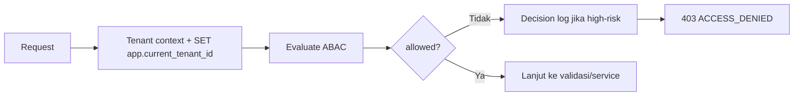

🇮🇩 Bahasa Indonesia · 🇬🇧 [English (source)](SKILL.md)

<!-- i18n-source-hash: sha256:a61b007be1e90bf668ee851ae117997ae061a6fd8c3b929981ccf9b3d6d90cfb -->

# AWCMS — ABAC Guard & Tenant Isolation

Ikuti `docs/awcms/03_srs_detail_per_modul.md`, `docs/awcms/10_template_kode_coding_standard.md`, dan **`docs/awcms/17_default_seed_rbac_abac.md`** (matriks role→permission & default ABAC policy). Mekanisme RLS/tenant context konkret: `docs/awcms/16_backend_data_access_integration.md`.

## ATURAN PERTAMA — satu chokepoint, `authorizeInTransaction`

**Setiap keputusan otorisasi untuk permission tenant WAJIB lewat
`authorizeInTransaction`** (`src/modules/identity-access/application/access-guard.ts`),
atau lewat `defineTenantRoute` yang memanggilnya. Jangan menyusun jalur sendiri
dari `resolveTenantContext` + `fetchGrantedPermissionKeys` + aturan domain.

Alasannya bukan kerapian. Chokepoint itu adalah SATU-SATUNYA tempat berikut ini
dievaluasi, dan jalur buatan sendiri melewatkan **semuanya** tanpa satu pun
error:

| Lapisan                                    | Kalau dilewati                                           |
| ------------------------------------------ | -------------------------------------------------------- |
| `evaluateAccess` — evaluator ABAC DSL      | **policy `deny` eksplisit milik tenant tidak dihormati** |
| `isPlatformScopedPermissionKey` (ADR-0053) | aksi lintas-tenant tak digerbangi                        |
| `resolveBusinessScopeFacts` (ADR-0060)     | cakupan bisnis tak ikut memutuskan                       |
| `isHighRiskAction` + SoD (#181)            | konflik segregation-of-duties tak diperiksa              |

Aturan kepemilikan domain (mis. `evaluatePostUpdateAccess`) TIDAK berjalan di
luar chokepoint: ia dievaluasi **lebih dulu**, lalu hasilnya DISERAHKAN ke dalam
`authorizeInTransaction` sebagai `ownershipGrant` yang **MELEBARKAN** himpunan
permission (ADR-0063) — lihat §`ownershipGrant` di bawah. Jangan menulis pola
"chokepoint dulu, aturan kepemilikan sesudah di luar chokepoint" — itu versi
lama yang sudah dicabut.

> **Ini bukan aturan hipotetis.** Asesmen 4 Agustus 2026
> ([`docs/awcms/repo-assessment-2026-08-04.md`](../../../docs/awcms/repo-assessment-2026-08-04.md) §2)
> menemukan `POST /api/v1/blog/posts/{id}/submit-review` menegakkan permission
> yang SAMA dengan `PATCH /{id}` tanpa memanggil chokepoint sama sekali —
> sehingga policy ABAC dihormati di satu rute dan diabaikan di rute lain.
> `access:permissions:enforcement:check` tidak menangkapnya: ia bertanya "apakah
> permission ini punya penegak", bukan "apakah SETIAP situs penegakan memakai
> chokepoint".

### Aturan kepemilikan? Pakai `ownershipGrant`, jangan keluar dari chokepoint

Kalau akses diberikan pada sumbu yang katalog permission TIDAK bisa ekspresikan
— "penulis boleh menyunting kontennya sendiri yang belum terbit meski tak
memegang permission-nya" — jangan memutuskan di luar chokepoint. Serahkan
sebagai basis grant ([ADR-0063](../../../docs/adr/0063-ownership-grants-run-through-the-authorization-chokepoint.md)):

```ts
const ownership = evaluatePostUpdateAccess(context, roleKeys, { ... });

const auth = await authorizeInTransaction(tx, tenantId, tokenHash, now, GUARD, {
  ownershipGrant: {
    granted: ownership.allowed,
    reason: "author of an unpublished post"
  }
});
```

Ia **MELEBARKAN** himpunan permission yang dievaluasi, bukan memotong keputusan:
tenant isolation, ABAC `deny`, business-scope dan SoD semuanya tetap bisa
menolak. Kredensial mesin dikecualikan. Decision log menandainya
`ownership_grant:<reason>` supaya allow kepemilikan tak terbaca seperti allow
RBAC.

**JANGAN** menulis `if (ownership.granted) return allowed` di guard — itu
memotong keempat lapisan, lolos setiap test perilaku, dan digerbangi kontrak
teks-sumber.

Dua pengecualian sah, keduanya terdaftar di `access:chokepoint:check`:
**pra-autentikasi** (`auth/login.ts#POST` — belum ada subjek) dan **introspeksi
diri** (`access/evaluate.ts#POST` — memanggil `evaluateAccess` langsung, jadi
ABAC diterapkan bukan dilewati).

Digerbangi `bun run access:chokepoint:check` — di-iris **per HANDLER**, karena
`blog/posts/[id].ts` pernah memanggil chokepoint di `GET`/`DELETE` sementara
`PATCH` di berkas yang sama tidak, dan pembacaan per-berkas menyebutnya patuh.

## Prinsip

1. **Default deny** — tidak ada policy yang mengizinkan = tolak.
2. **Deny overrides allow** — satu deny mengalahkan semua allow.
3. **RLS tetap wajib** walau ABAC sudah cek (defense in depth).
4. Akses ditolak yang high-risk → catat di decision log.
5. UI hiding **bukan** kontrol utama; backend tetap validasi.
6. Archive/restore/purge soft delete default deny sampai permission eksplisit tersedia.

## Bentuk request/decision

```ts
type AccessRequest = {
  moduleKey: string;
  activityCode: string;
  action:
    | "read"
    | "create"
    | "update"
    | "delete"
    | "post"
    | "cancel"
    | "approve"
    | "export"
    | "send"
    | "configure"
    | "analyze"
    | "assign"
    | "restore"
    | "purge"
    | "retry"
    | "sync"
    | "enable"
    | "disable"
    | "check"
    | "publish"
    | "schedule"
    | "archive"
    | "verify"
    | "set_primary" // Issue #562 (tenant_domain) — see access-control.ts's own comment for why neither is in HIGH_RISK_ACTIONS
    | "connect"
    | "disconnect" // Issue #643 (social_publishing) — unlike verify/set_primary, BOTH are in HIGH_RISK_ACTIONS (write a credential-bearing token_reference)
    | "preview" // Issue #641 (blog_content) — read-only (internal-links preview), not in HIGH_RISK_ACTIONS
    // Platform-evolution epic #738 additions (identity-access/domain/access-control.ts:73-188):
    | "release" // #745 data_lifecycle: legal_hold.release — HIGH_RISK
    | "replay" // #742 domain_event_runtime: deliveries.replay — not high-risk (idempotent by event ID)
    | "manage" // #742 domain_event_runtime: consumers.manage (pause/resume) — not high-risk
    | "revoke" // #746 identity-access: business-scope/SoD-exception revoke — HIGH_RISK
    | "override" // #746 identity-access: reserved for future conflict-override hook — HIGH_RISK
    | "reject" // #746 identity-access: reject a SoD conflict exception request — not high-risk (safe outcome)
    | "retire" // #747 workflow_approval: voluntary definition retirement — HIGH_RISK
    | "reassign" // #747 workflow_approval: reassign a pending task's open seats — HIGH_RISK
    | "force_decide" // #747 workflow_approval: force-approve/reject bypassing quorum — HIGH_RISK
    | "merge" // #748 profile_identity: profile_merge.merge (execute approved merge) — HIGH_RISK
    | "commit" // #750 reference_data imports.commit / #751 document_infrastructure number-sequence commit — HIGH_RISK
    | "rollback" // #750 reference_data: imports.rollback — HIGH_RISK
    | "void" // #751 document_infrastructure: irreversible-by-default document void — HIGH_RISK
    | "reclassify" // #751 document_infrastructure: change document classification/confidentiality — HIGH_RISK
    | "reserve" // #751 document_infrastructure: document number sequence reservation — HIGH_RISK
    | "rebuild"; // #753 reporting: trigger/resume a full projection rebuild — HIGH_RISK
  resourceType?: string;
  resourceId?: string;
  resourceAttributes?: Record<string, unknown>;
  environmentAttributes?: Record<string, unknown>;
};
type AccessDecision = {
  allowed: boolean;
  reason: string;
  decisionId?: string;
  matchedPolicy?: string;
};
```

## Prosedur



## Aturan implementasi

- **Guard HANYA pada `action` yang DI-SEED di `awcms_permissions`.** Katalog
  permission disemai lewat migrasi `sql/*` (mis. `sql/005` untuk `access_control`
  = `read`/`assign`/`configure`, `office_management` = `read`/`create`/`update`).
  Owner role di-grant SELURUH baris `awcms_permissions` saat bootstrap
  (`platform-bootstrap.ts` `SELECT id FROM awcms_permissions`), dan jalur e2e =
  migrasi → `POST /setup/initialize` TANPA module permission-sync di antaranya.
  Jadi guard pada `action` yang tidak ter-seed **men-DENY bahkan owner (403)** —
  dan ini LATENT: e2e admin env-gated sering ter-skip di CI kosong → hijau
  padahal rusak. Sebelum menulis guard baru: pakai action yang sudah ter-seed
  untuk aktivitas itu (mis. administrasi role/policy → `configure`, assign role →
  `assign`), ATAU tambah action lewat **migrasi seed baru** (`INSERT ... ON
CONFLICT DO NOTHING`; migrasi terapan immutable — jangan edit `sql/005`).
  Deklarasi di `module.ts` `permissions[]` **tidak cukup** — itu bukan baris
  katalog DB saat bootstrap (Issue #171). Cocokkan gate UI SSR dengan action
  guard endpoint yang sama.
- Set tenant context di **awal** transaction: `SET app.current_tenant_id = ...`.
- Query tenant-scoped **wajib** filter `tenant_id` (jangan hanya andalkan RLS).
- **Role sistem (`is_system`) itu invarian:** tolak soft-delete, grant/revoke
  permission, dan assign/unassign role sistem via API (mirror `softDeleteRole`),
  dan jangan biarkan admin dinonaktifkan sampai tak ada admin aktif tersisa —
  jika tidak, holder permission terdelegasi bisa eskalasi/mengunci tenant
  (Issue #171 review).
- Query resource soft-deletable default `deleted_at IS NULL`; `includeDeleted`, `restore`, dan `purge` wajib ABAC eksplisit.
- Contoh batas peran: operator ditolak akses pajak/export/assign role; cross-tenant selalu blocked.
- `tenantUserId`/`identityId` berasal dari auth middleware, **bukan** header public mentah.
- **Layar admin write-form** memakai `sendJson`/`lockElement`
  (`src/lib/ui/admin-form-client.ts`, skill `awcms-ui-screen`) untuk
  memanggil endpoint mutation — pastikan gate/permission yang dicek untuk
  menampilkan tombol/form itu adalah `action` yang SAMA dan SUDAH ter-seed
  di `awcms_permissions` (aturan di atas), bukan action yang "kelihatan
  benar" tapi belum ter-seed — kalau salah, tombolnya tampil tapi request-nya
  403 bahkan untuk owner.

## Verifikasi (test)

- default deny; deny overrides allow; cashier limit; tax officer access; cross-tenant blocked; archive/restore denied tanpa permission; decision log tercatat.
