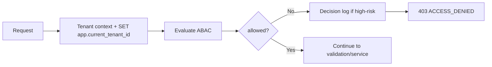

🇬🇧 English (source) · 🇮🇩 [Bahasa Indonesia](SKILL.id.md)

# AWCMS — ABAC Guard & Tenant Isolation

Follow `docs/awcms/03_srs_detail_per_modul.md`, `docs/awcms/10_template_kode_coding_standard.md`, and **`docs/awcms/17_default_seed_rbac_abac.md`** (the role→permission matrix & default ABAC policies). The concrete RLS/tenant-context mechanism: `docs/awcms/16_backend_data_access_integration.md`.

## FIRST RULE — one chokepoint, `authorizeInTransaction`

**Every authorization decision for a tenant permission MUST go through
`authorizeInTransaction`** (`src/modules/identity-access/application/access-guard.ts`),
or through `defineTenantRoute` which calls it. Do not assemble your own path out
of `resolveTenantContext` + `fetchGrantedPermissionKeys` + domain rules.

The reason is not tidiness. That chokepoint is the ONLY place the following are
evaluated, and a home-made path skips **all of them** without a single error:

| Layer                                      | If it is bypassed                                       |
| ------------------------------------------ | ------------------------------------------------------- |
| `evaluateAccess` — the ABAC DSL evaluator  | **the tenant's explicit `deny` policy is not honoured** |
| `isPlatformScopedPermissionKey` (ADR-0053) | cross-tenant actions are not gated                      |
| `resolveBusinessScopeFacts` (ADR-0060)     | business scope does not take part in the decision       |
| `isHighRiskAction` + SoD (#181)            | segregation-of-duties conflicts are not checked         |

Domain ownership rules (e.g. `evaluatePostUpdateAccess`) do NOT run outside the
chokepoint: they are evaluated **first**, and their result is HANDED INTO
`authorizeInTransaction` as an `ownershipGrant` that **WIDENS** the permission
set (ADR-0063) — see §`ownershipGrant` below. Do not write the pattern
"chokepoint first, ownership rule afterwards outside the chokepoint" — that is
the old version and it has been revoked.

> **This is not a hypothetical rule.** The 4 August 2026 assessment
> ([`docs/awcms/repo-assessment-2026-08-04.md`](../../../docs/awcms/repo-assessment-2026-08-04.md) §2)
> found that `POST /api/v1/blog/posts/{id}/submit-review` enforced the SAME
> permission as `PATCH /{id}` without calling the chokepoint at all — so an ABAC
> policy was honoured on one route and ignored on another.
> `access:permissions:enforcement:check` did not catch it: it asks "does this
> permission have an enforcer", not "does EVERY enforcement site use the
> chokepoint".

### An ownership rule? Use `ownershipGrant`, do not leave the chokepoint

If access is granted along an axis the permission catalog CANNOT express — "an
author may edit their own unpublished content even without holding the
permission" — do not decide outside the chokepoint. Hand it in as a grant basis
([ADR-0063](../../../docs/adr/0063-ownership-grants-run-through-the-authorization-chokepoint.md)):

```ts
const ownership = evaluatePostUpdateAccess(context, roleKeys, { ... });

const auth = await authorizeInTransaction(tx, tenantId, tokenHash, now, GUARD, {
  ownershipGrant: {
    granted: ownership.allowed,
    reason: "author of an unpublished post"
  }
});
```

It **WIDENS** the permission set being evaluated, it does not short-circuit the
decision: tenant isolation, ABAC `deny`, business scope and SoD can all still
deny. Machine credentials are excluded. The decision log marks it
`ownership_grant:<reason>` so an ownership allow does not read like an RBAC
allow.

**DO NOT** write `if (ownership.granted) return allowed` in a guard — that
short-circuits all four layers, passes every behavioural test, and is gated by a
source-text contract.

Two legitimate exceptions, both registered in `access:chokepoint:check`:
**pre-authentication** (`auth/login.ts#POST` — there is no subject yet) and
**self-introspection** (`access/evaluate.ts#POST` — it calls `evaluateAccess`
directly, so ABAC is applied, not skipped).

Gated by `bun run access:chokepoint:check` — sliced **per HANDLER**, because
`blog/posts/[id].ts` once called the chokepoint in `GET`/`DELETE` while `PATCH`
in the same file did not, and a per-file reading called it compliant.

## Principles

1. **Default deny** — no policy that allows = reject.
2. **Deny overrides allow** — a single deny beats every allow.
3. **RLS is still mandatory** even when ABAC has already checked (defense in depth).
4. A denied high-risk access → record it in the decision log.
5. UI hiding is **not** the primary control; the backend still validates.
6. Archive/restore/purge of a soft delete is default deny until an explicit permission exists.

## Request/decision shape

```ts
type AccessRequest = {
  moduleKey: string;
  activityCode: string;
  action:
    | "read"
    | "create"
    | "update"
    | "delete"
    | "post"
    | "cancel"
    | "approve"
    | "export"
    | "send"
    | "configure"
    | "analyze"
    | "assign"
    | "restore"
    | "purge"
    | "retry"
    | "sync"
    | "enable"
    | "disable"
    | "check"
    | "publish"
    | "schedule"
    | "archive"
    | "verify"
    | "set_primary" // Issue #562 (tenant_domain) — see access-control.ts's own comment for why neither is in HIGH_RISK_ACTIONS
    | "connect"
    | "disconnect" // Issue #643 (social_publishing) — unlike verify/set_primary, BOTH are in HIGH_RISK_ACTIONS (write a credential-bearing token_reference)
    | "preview" // Issue #641 (blog_content) — read-only (internal-links preview), not in HIGH_RISK_ACTIONS
    // Platform-evolution epic #738 additions (identity-access/domain/access-control.ts:73-188):
    | "release" // #745 data_lifecycle: legal_hold.release — HIGH_RISK
    | "replay" // #742 domain_event_runtime: deliveries.replay — not high-risk (idempotent by event ID)
    | "manage" // #742 domain_event_runtime: consumers.manage (pause/resume) — not high-risk
    | "revoke" // #746 identity-access: business-scope/SoD-exception revoke — HIGH_RISK
    | "override" // #746 identity-access: reserved for future conflict-override hook — HIGH_RISK
    | "reject" // #746 identity-access: reject a SoD conflict exception request — not high-risk (safe outcome)
    | "retire" // #747 workflow_approval: voluntary definition retirement — HIGH_RISK
    | "reassign" // #747 workflow_approval: reassign a pending task's open seats — HIGH_RISK
    | "force_decide" // #747 workflow_approval: force-approve/reject bypassing quorum — HIGH_RISK
    | "merge" // #748 profile_identity: profile_merge.merge (execute approved merge) — HIGH_RISK
    | "commit" // #750 reference_data imports.commit / #751 document_infrastructure number-sequence commit — HIGH_RISK
    | "rollback" // #750 reference_data: imports.rollback — HIGH_RISK
    | "void" // #751 document_infrastructure: irreversible-by-default document void — HIGH_RISK
    | "reclassify" // #751 document_infrastructure: change document classification/confidentiality — HIGH_RISK
    | "reserve" // #751 document_infrastructure: document number sequence reservation — HIGH_RISK
    | "rebuild"; // #753 reporting: trigger/resume a full projection rebuild — HIGH_RISK
  resourceType?: string;
  resourceId?: string;
  resourceAttributes?: Record<string, unknown>;
  environmentAttributes?: Record<string, unknown>;
};
type AccessDecision = {
  allowed: boolean;
  reason: string;
  decisionId?: string;
  matchedPolicy?: string;
};
```

## Procedure



## Implementation rules

- **Guard ONLY on an `action` that is SEEDED in `awcms_permissions`.** The
  permission catalog is seeded through `sql/*` migrations (e.g. `sql/005` for
  `access_control` = `read`/`assign`/`configure`, `office_management` =
  `read`/`create`/`update`). The owner role is granted EVERY `awcms_permissions`
  row at bootstrap (`platform-bootstrap.ts` `SELECT id FROM awcms_permissions`),
  and the e2e path is migration → `POST /setup/initialize` WITHOUT a module
  permission-sync in between. So a guard on an unseeded `action` **DENIES even
  the owner (403)** — and this is LATENT: the env-gated admin e2e is often
  skipped in an empty CI → green while broken. Before writing a new guard: use
  an action already seeded for that activity (e.g. role/policy administration →
  `configure`, assigning a role → `assign`), OR add the action through a **new
  seed migration** (`INSERT ... ON CONFLICT DO NOTHING`; an applied migration is
  immutable — do not edit `sql/005`). Declaring it in `module.ts`
  `permissions[]` is **not enough** — that is not a DB catalog row at bootstrap
  (Issue #171). Match the SSR UI gate to the same guard action as the endpoint.
- Set the tenant context at the **start** of the transaction: `SET app.current_tenant_id = ...`.
- A tenant-scoped query **must** filter on `tenant_id` (do not rely on RLS alone).
- **A system role (`is_system`) is invariant:** reject soft-delete, permission
  grant/revoke, and assign/unassign of a system role via the API (mirroring
  `softDeleteRole`), and do not allow an admin to be deactivated down to no
  active admin remaining — otherwise a holder of a delegated permission can
  escalate/lock out the tenant (Issue #171 review).
- A query on a soft-deletable resource defaults to `deleted_at IS NULL`; `includeDeleted`, `restore`, and `purge` require explicit ABAC.
- Example role boundaries: an operator is denied tax/export/role-assign access; cross-tenant is always blocked.
- `tenantUserId`/`identityId` come from the auth middleware, **not** from a raw public header.
- **Admin write-form screens** use `sendJson`/`lockElement`
  (`src/lib/ui/admin-form-client.ts`, skill `awcms-ui-screen`) to call the
  mutation endpoint — make sure the gate/permission checked in order to show
  that button/form is the SAME `action` and is ALREADY seeded in
  `awcms_permissions` (the rule above), not an action that "looks right" but is
  not seeded — get it wrong and the button shows while the request 403s even for
  the owner.

## Verification (tests)

- default deny; deny overrides allow; cashier limit; tax officer access; cross-tenant blocked; archive/restore denied without permission; decision log recorded.
