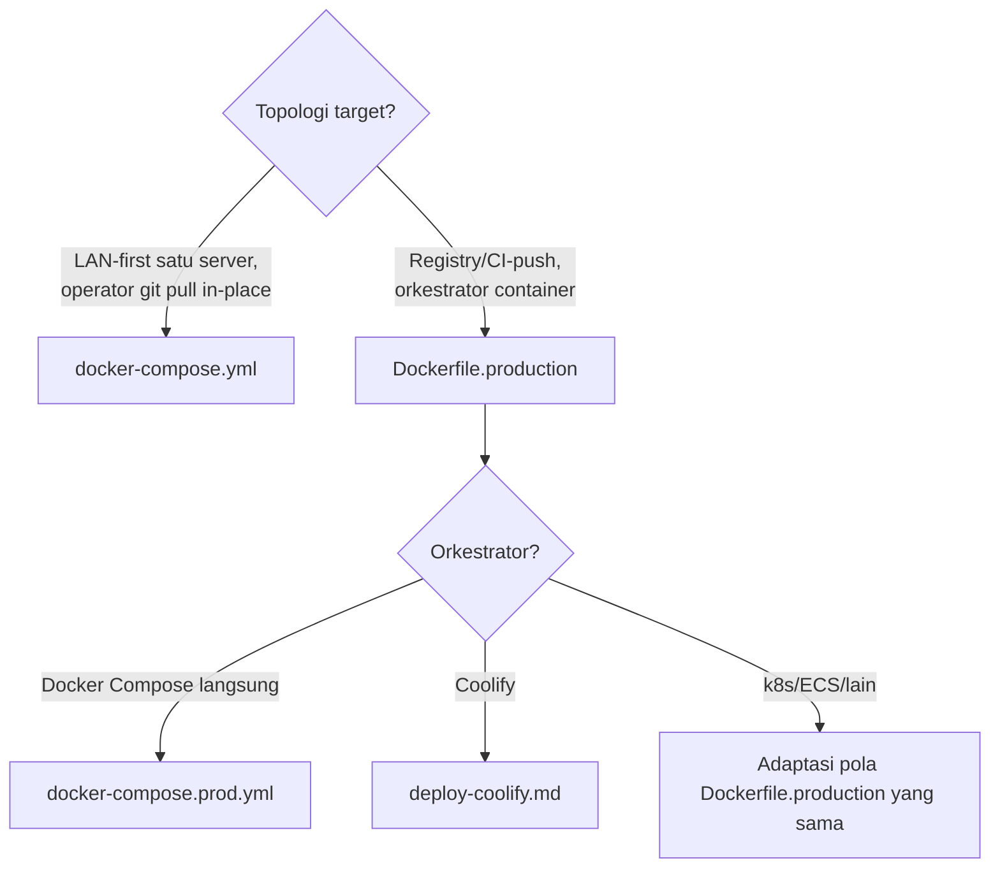

🇮🇩 Bahasa Indonesia · 🇬🇧 [English (source)](SKILL.md)

<!-- i18n-source-hash: sha256:bab2d2f8266eb555b7187cbd7f4637993f8670626cf0c20335675361b6629ff4 -->

# AWCMS — Deployment Profile & Execution

Ikuti `docs/awcms/deployment-profiles.md` (peta profil ke berkas
`deploy/*`) dan `docs/awcms/deploy-coolify.md` (khusus Coolify).

> **Tiga profil, bukan empat.** `development`, `production`, `offline-lan`.
> `staging` DIHAPUS dari kosakata profil deployment (ADR-0083 sebagaimana
> diamandemen) — bukan "ada tapi tak dipakai di sini". Jangan menuliskannya di
> `deploymentProfiles` modul, di `APP_ENV`, atau di dokumen baru. Kontrak
> isolasi yang dulu melekat padanya TIDAK hilang: ia kini aturan untuk
> **environment kedua apa pun** yang seseorang dirikan di samping produksinya
> (database sendiri, role/password sendiri, secret sendiri, integrasi keluar
> mati, tanpa tulis ke bucket media produksi, provider DNS `manual`, token purge
> per-environment) — tertulis di `docs/awcms/environments.md` §Kontrak isolasi
> environment kedua.

## Pilih jalur



`docker-compose.yml` tetap jalur yang **direkomendasikan** untuk
LAN-first/offline satu server — jangan beralih ke `Dockerfile.production`
kecuali orkestrator memang mengharapkan image siap-pakai (build-saat-startup
tidak diinginkan). Untuk registry-based via Compose (bukan Coolify/k8s),
pakai `docker-compose.prod.yml` (Issue #682) — standalone, bukan override
`docker-compose.yml`.

**Container hardening (Issue #682, berlaku di kedua compose file)**:
`db`/`pgbouncer` tidak publish port host secara default (salin
`docker-compose.override.yml.example` untuk akses lokal opsional);
`cap_drop: [ALL]` di semua service (`db` dapat `cap_add` minimal untuk
entrypoint-nya sendiri); image Bun/Postgres/PgBouncer dipin ke versi
eksplisit, bukan tag mengambang; healthcheck di `db`/`app` (`migrate`
one-shot dan `pgbouncer` opsional sengaja tanpa healthcheck — lihat
komentar masing-masing service);
`docker-compose.prod.yml`'s `app` jalan `read_only: true` (image
registry-based tidak pernah menulis ke filesystem-nya sendiri saat
runtime). PgBouncer's `deploy/pgbouncer/pgbouncer.ini.example` memakai
`auth_type = scram-sha-256` (bukan `md5`) — lihat berkas itu untuk
perintah generate `userlist.txt` dari `pg_authid`. CI
(`.github/workflows/ci.yml`) menjalankan `docker compose config -q` untuk
kedua compose file di setiap PR — jangan biarkan salah satu file punya
syntax error/env var yang tidak resolve sampai lolos ke deploy.

## Dua hal yang TIDAK dijaga gerbang mana pun — periksa dengan mata

Keduanya ditemukan asesmen 4 Agustus 2026 (§9.1 dan §9.3) dan keduanya adalah
kesalahan konfigurasi yang melapor sukses:

1. ~~`AUTH_COOKIE_SECURE` gagal-terbuka saat tidak diset.~~ **DITUTUP 4 Agustus
   2026** — `config:validate` kini menuntutnya bernilai persis `"true"` di
   produksi (sebelumnya hanya menolak `"false"`, sehingga variabel yang **hilang**
   lolos dan cookie sesi terkirim tanpa `Secure`). Tetap setel eksplisit
   `AUTH_COOKIE_SECURE=true` untuk tiap profil online, dan **verifikasi dengan
   `curl -I`** bahwa `Set-Cookie` login membawa `Secure` — validator memeriksa
   konfigurasi, bukan respons.
2. **Kompresi datang dari lapisan LUAR, dan repo ini tak memeriksanya.** Repo
   tidak mengompresi apa pun (nol di aplikasi, nol `do_gzip` di
   `infra/varnish/default.vcl`, nol middleware `compress` Traefik). Deployment
   `ahlikoding.com` tetap mengompresi karena **Cloudflare** ada di depan —
   topologi ter-deploy adalah `Cloudflare (proxied) -> Traefik :443 -> varnish
-> app`, tertulis di [`environments.md`](../../../docs/awcms/environments.md)
   §Cache tepi. **Deployment template ini di luar CDN pengompresi tidak mendapat
   kompresi sama sekali, dan tak ada gerbang yang mengatakannya** — verifikasi
   sendiri dengan `curl -sSI -H 'Accept-Encoding: gzip' <host>/api/v1/health`
   dan cari `content-encoding`. Bila harus menambahkannya, **pilih satu tempat**;
   dua lapisan yang sama-sama mengompresi menghasilkan `Content-Encoding` ganda.
3. **Antrean purge tidak menjangkau Cloudflare.** `EDGE_CACHE_PURGE_ENDPOINT`
   menunjuk Varnish; tak ada pemanggilan API zona CF di mana pun. Menerbitkan
   konten karena itu meng-invalidasi Varnish sementara CF tetap menyajikan salinan
   lamanya sampai `s-maxage` habis (`EDGE_CACHE_MAX_TTL_SECONDS`, bawaan 300 detik).
   Berbatas dan bukan kebocoran — tetapi uji penerimaan `X-Cache` di
   `environments.md` mengukur Varnish, jadi jeda ini tak akan terlihat di sana.
   Untuk menguji tier yang benar, baca `cf-cache-status` dan `age`.

## Command inti (semua profil)

```bash
bun run config:validate   # wajib pertama — konfigurasi valid sebelum apa pun
bun run db:migrate        # migrasi sebagai role privileged, sebelum container app pertama
bun run security:readiness # gate go-live NYATA — exit non-zero bila ada `critical`
bun run db:pool:health    # pool sehat terhadap DB target
```

> **`bun run production:preflight` TIDAK ADA di repo ini.** Versi skill ini
> sebelumnya mencantumkannya sebagai perintah inti; ia gagal dengan
> `error: Script not found`. Orkestrator itu terdaftar sebagai target DITUNDA
> di `scripts/README.md` §Ditunda — jalankan langkah-langkahnya sendiri
> (perintah di atas, plus `bun run check` yang sudah memuat test + build).

> **Image runtime TIDAK BISA menjalankan job apa pun — rebuild image job tiap
> deploy.** `Dockerfile.production`'s stage `runtime` hanya menyalin `dist/`,
> `node_modules/`, `package.json`. Ke-29 job yang didaftarkan modul berbentuk
> `bun run <target>` dan **semuanya** keluar `error: Script not found` di sana;
> tidak ada penjadwal in-process sebagai jalur kedua. Deployment yang berjalan
> memakai image kedua `awcms-jobs:<versi>` (dibangun dari `scripts/` + `src/` +
> `sql/`) yang dipanggil `/home/admin1/awcms-jobs/run-job.sh <target>` dari
> cron. **Coolify MENGHAPUS image itu tiap kali app di-deploy** (prune image
> yang tak dipakai container mana pun) — karena itu `run-job.sh` membangunnya
> ulang sendiri saat hilang (~55 detik). Yang TIDAK otomatis: konteks build
> `/home/admin1/awcms-jobs/` adalah SNAPSHOT sumber, jadi **segarkan tiap
> rilis** — auto-rebuild memperbaiki penghapusan, bukan keusangan, dan versi
> job yang tertinggal akan menjalankan kode LAMA terhadap skema BARU tanpa
> suara. Detail + utang yang tersisa: `docs/PROJECT_STATE.md` §4.

> **Whitelist env `run-job.sh` adalah allowlist, bukan passthrough — family env var `<PREFIX>_*`
> baru butuh entri sendiri atau job diam-diam jalan tanpa konfigurasi.** Ditemukan langsung di
> produksi: `EDGE_CACHE_MODE`/`EDGE_CACHE_PURGE_ENDPOINT`/`EDGE_CACHE_PURGE_TOKEN` semuanya sudah
> diset benar di container app, tapi `edge-cache:purge` melaporkan `mode=off
endpointConfigured=false` saat dijalankan lewat `run-job.sh` — whitelist `grep -E`
> (`^(DATABASE_URL|...|CLOUDFLARE_)`) memang tak pernah mencantumkan `EDGE_CACHE_`. Tak ada error,
> tak ada log yang mengarah ke situ — pesan sukses yang TERLIHAT seperti konfigurasi
> (`skipped — mode=off`) terbaca sebagai "memang sengaja dimatikan", bukan "salah konfigurasi".
> Periksa whitelist ini duluan setiap kali sebuah job berperilaku seolah seluruh family env var yang
> jelas seharusnya ia lihat malah unset.

> **`edge-cache:purge` sama sekali tak terlihat oleh `jobs:crontab:generate`/`jobs:crontab:check` —
> ia satu-satunya entri `DOCUMENTED_EXCEPTIONS` di `scripts/module-job-registry-check.ts`**, karena
> ia infrastruktur di `src/lib/edge-cache/` tanpa modul pemilik (ADR-0043) untuk menampung
> descriptor. Artinya tak ada apa pun di crontab hasil generate atau gate check-nya yang akan pernah
> menangkap job ini tidak terjadwal — terverifikasi di deployment nyata di mana job ini diam-diam
> sama sekali tak punya runner yang bekerja. Jadwalnya (setiap 10-30 detik, sesuai header skrip-nya
> sendiri + `docs/awcms/deployment-profiles.md`) harus dijaga manual, di luar `ops/awcms-jobs.crontab`,
> sebagai beberapa baris cron `* * * * *`/`sleep N &&` yang di-stagger — aman menjalankan instance
> yang overlap (claim-lease per-row, `FOR UPDATE SKIP LOCKED`), jadi tanpa wrapper `flock`, berbeda
> dari setiap job hasil generate di atasnya.

**Setelah deploy rilis yang menambah modul/permission BARU, jalankan
backfill permission:**

```bash
bun run identity-access:permissions:backfill
```

Seed permission di migration hanya menjangkau tenant yang dibuat
**SESUDAHNYA**. Tenant yang sudah ada tidak pernah menerima grant untuk
permission baru, jadi owner-nya mendapat **403 senyap** di modul yang
tampak "sudah terpasang" — bukan error yang mengarahkan ke sebabnya.
Ini terbukti nyata di v7.0.0 (9 grant per tenant). Rilis yang menambah
permission WAJIB menjalankan langkah ini, dan memverifikasinya dengan
membuka layar yang bersangkutan sebagai owner, bukan dengan membaca log.

## Checklist per topologi

**LAN-first (`docker-compose.yml`)**: `export APP_UID=$(id -u) APP_GID=$(id -g)`
sebelum `docker compose up --build` (wajib — tanpanya container jadi root
dan menulis `node_modules/`/`dist/` sebagai root di bind mount host);
health check `curl http://localhost:4321/api/v1/health`.

**Registry-based/Coolify (`Dockerfile.production`)**: migration one-shot
**terpisah** (image tidak menjalankannya — role runtime least-privilege
tidak punya hak DDL); role app selalu `awcms_app` atau setara, tidak
pernah superuser; database tidak perlu public port bila app+DB satu
internal network; secret selalu via env var/orkestrator, tidak pernah
dibakar ke image (`.dockerignore` mengecualikan `.env`).

**Multi-aplikasi dalam satu VPS/Coolify**: setiap aplikasi wajib
domain/secret/database (atau minimal schema+role) terpisah — jangan reuse
`AUTH_IP_HASH_SECRET`/HMAC/kredensial R2 antar aplikasi; lihat
`deploy-coolify.md` §Opsi PostgreSQL untuk perbandingan satu cluster vs
satu container per aplikasi vs managed database eksternal.

## Model tiga-peran basis data (wajib di semua profil)

Migrasi = role privileged (DDL/GRANT). Runtime app = `awcms_app`
least-privilege, `FORCE ROW LEVEL SECURITY` ditegakkan untuknya. Jangan
pernah menjalankan aplikasi sebagai superuser/owner — `bun run
security:readiness` memblokir go-live bila terdeteksi.

**Status konkret di repo ini** (jangan asumsikan lebih dari ini):

- Role `awcms_app` dibuat `sql/019_awcms_db_role_separation.sql` (Issue
  #141); `awcms_worker` dan `awcms_setup` dibuat
  `sql/022_awcms_db_worker_setup_roles.sql` (Issue #163). **KOREKSI:** versi
  skill ini sebelumnya menyatakan `awcms_worker`/`awcms_setup` "tidak ada" dan
  bahwa mengarahkan `WORKER_DATABASE_URL` ke sana menghasilkan
  `permission denied`. Itu sudah lama tidak benar — jangan menolak memisahkan
  role atas dasar itu.
- Ketiganya dibuat **`NOLOGIN` dan tanpa password** — sengaja, karena password
  itu secret dan secret tidak boleh masuk berkas migrasi. Migrasi selesai
  bersih tetapi **belum satu pun role bisa dipakai**. Deployment yang
  mengaktifkannya:

  ```sql
  ALTER ROLE awcms_app    LOGIN PASSWORD '<secret>';
  ALTER ROLE awcms_worker LOGIN PASSWORD '<secret>';
  ALTER ROLE awcms_setup  LOGIN PASSWORD '<secret>';
  GRANT CONNECT ON DATABASE <db> TO awcms_app, awcms_worker, awcms_setup;
  ```

- Lalu arahkan `DATABASE_URL`→`awcms_app`, `WORKER_DATABASE_URL`→`awcms_worker`,
  `SETUP_DATABASE_URL`→`awcms_setup`. Dua yang terakhir **fallback ke
  `DATABASE_URL`** bila kosong (opt-in, tidak breaking).

> **Jebakan yang benar-benar terjadi (staging 2026-07-25).** Platform PaaS
> (Coolify, dan sebagian besar image `postgres:*`) membuat `POSTGRES_USER`
> sebagai **superuser**. Bila `DATABASE_URL` runtime dibiarkan menunjuk user
> itu — bentuk paling wajar setelah provisioning otomatis — aplikasi berjalan
> sebagai superuser dan **setiap policy `*_tenant_isolation` inert meski
> `FORCE`**: superuser melewati RLS tanpa syarat. Deployment tampak sehat,
> migrasi hijau, health 200, dan isolasi tenant tidak ada sama sekali.
> Verifikasi dengan koneksi nyata, bukan asumsi:
>
> ```sql
> SELECT rolname, rolsuper, rolbypassrls FROM pg_roles WHERE rolname LIKE 'awcms%';
> ```
>
> Role runtime harus `rolsuper=f` **dan** `rolbypassrls=f`.

## Credential otomasi (agent-cred)

Kalau langkah deploy ini butuh token API Coolify/Cloudflare atau kredensial
server secara interaktif (dijalankan agent/operator dalam satu sesi kerja,
bukan job cron), ambil lewat `agent-cred get <service> <field>` (isi dulu
dengan `agent-cred set <service>` bila belum ada) — jangan `read -s` ad-hoc
atau credential inline baru, termasuk untuk `ALTER ROLE ... PASSWORD` di
atas: generate & simpan dulu via `agent-cred set postgres`. TTL cache 3 jam.
Detail: repo `personal-coding:docs/sop-agent-cred-credential-cache.md`.
Job cron/systemd tetap pakai env var/secret file seperti biasa.

## Rollback

Image immutable (Pola registry) → redeploy tag sebelumnya. **Migration
caution**: rollback image tidak membatalkan migrasi skema yang sudah
diterapkan — uji migrasi backward-compatible (expand-first) sebelum
deploy, atau siapkan restore dari backup (`deploy/backup/restore-postgres.sh`)
sebagai jalur rollback skema.

> **Jangan berasumsi ada backup untuk di-restore.** Pada deployment Coolify
> yang berjalan hari ini, tabel `scheduled_database_backups` **KOSONG** —
> nol backup terjadwal. "Siapkan restore dari backup" di atas hanya nyata
> bila kamu **mengambil `pg_dump` sendiri SEBELUM menjalankan migrasi
> produksi**. Verifikasi keberadaan backup, jangan menyimpulkannya dari
> adanya skrip restore.

## Output

Laporan: profil dipilih + alasan, checklist yang terpenuhi, health check
hasil, dan (bila registry-based) rencana rollback singkat.
