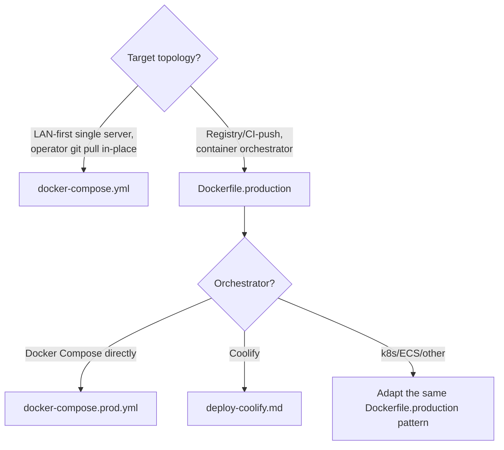

🇬🇧 English (source) · 🇮🇩 [Bahasa Indonesia](SKILL.id.md)

# AWCMS — Deployment Profile & Execution

Follow `docs/awcms/deployment-profiles.md` (map of profiles to `deploy/*`
files) and `docs/awcms/deploy-coolify.md` (Coolify-specific).

> **Three profiles, not four.** `development`, `production`, `offline-lan`.
> `staging` was REMOVED from the deployment profile vocabulary (ADR-0083 as
> amended) — not "exists but unused here". Do not write it in a module's
> `deploymentProfiles`, in `APP_ENV`, or in new documents. The isolation
> contract that used to attach to it is NOT gone: it is now the rule for
> **any second environment** someone stands up alongside their production
> (its own database, its own role/password, its own secrets, outbound
> integrations off, no writes to the production media bucket, DNS provider
> `manual`, per-environment purge token) — written in
> `docs/awcms/environments.md` §Second-environment isolation contract.

## Choose the path



`docker-compose.yml` remains the **recommended** path for LAN-first/offline
single server — do not switch to `Dockerfile.production` unless the
orchestrator genuinely expects a ready-made image (build-at-startup is
undesirable). For registry-based via Compose (not Coolify/k8s), use
`docker-compose.prod.yml` (Issue #682) — standalone, not an override of
`docker-compose.yml`.

**Container hardening (Issue #682, applies to both compose files)**:
`db`/`pgbouncer` do not publish host ports by default (copy
`docker-compose.override.yml.example` for optional local access);
`cap_drop: [ALL]` on every service (`db` gets a minimal `cap_add` for its
own entrypoint); Bun/Postgres/PgBouncer images are pinned to explicit
versions, not floating tags; healthchecks on `db`/`app` (the `migrate`
one-shot and the optional `pgbouncer` deliberately have no healthcheck —
see the comments on each service);
`docker-compose.prod.yml`'s `app` runs `read_only: true` (a registry-based
image never writes to its own filesystem at runtime). PgBouncer's
`deploy/pgbouncer/pgbouncer.ini.example` uses `auth_type = scram-sha-256`
(not `md5`) — see that file for the command to generate `userlist.txt` from
`pg_authid`. CI (`.github/workflows/ci.yml`) runs `docker compose config -q`
for both compose files on every PR — do not let either file carry a syntax
error/unresolved env var all the way to a deploy.

## Two things NO gate guards — check them with your eyes

Both were found by the 4 August 2026 assessment (§9.1 and §9.3) and both are
misconfigurations that report success:

1. ~~`AUTH_COOKIE_SECURE` fails open when unset.~~ **CLOSED 4 August
   2026** — `config:validate` now demands it be exactly `"true"` in
   production (previously it only rejected `"false"`, so a **missing**
   variable slipped through and session cookies were sent without `Secure`).
   Still set `AUTH_COOKIE_SECURE=true` explicitly for every online profile, and
   **verify with `curl -I`** that the login `Set-Cookie` carries `Secure` — the
   validator checks configuration, not responses.
2. **Compression comes from an OUTER layer, and this repo does not check it.**
   The repo compresses nothing (zero in the application, zero `do_gzip` in
   `infra/varnish/default.vcl`, zero Traefik `compress` middleware). The
   `ahlikoding.com` deployment still compresses because **Cloudflare** sits in
   front — the deployed topology is `Cloudflare (proxied) -> Traefik :443 -> varnish
-> app`, written in [`environments.md`](../../../docs/awcms/environments.md)
   §Edge cache. **A deployment of this template outside a compressing CDN gets no
   compression at all, and no gate says so** — verify it yourself with
   `curl -sSI -H 'Accept-Encoding: gzip' <host>/api/v1/health` and look for
   `content-encoding`. If you must add it, **pick one place**; two layers both
   compressing produce a doubled `Content-Encoding`.
3. **The purge queue does not reach Cloudflare.** `EDGE_CACHE_PURGE_ENDPOINT`
   points at Varnish; there is no CF zone API call anywhere. Publishing content
   therefore invalidates Varnish while CF keeps serving its old copy until
   `s-maxage` expires (`EDGE_CACHE_MAX_TTL_SECONDS`, default 300 seconds).
   Bounded, and not a leak — but the `X-Cache` acceptance test in
   `environments.md` measures Varnish, so this lag will not show up there.
   To test the right tier, read `cf-cache-status` and `age`.

## Core commands (all profiles)

```bash
bun run config:validate   # mandatory first — valid configuration before anything else
bun run db:migrate        # migrate as the privileged role, before the first app container
bun run security:readiness # the REAL go-live gate — exits non-zero if anything is `critical`
bun run db:pool:health    # pool healthy against the target DB
```

> **`bun run production:preflight` DOES NOT EXIST in this repo.** An earlier
> version of this skill listed it as a core command; it fails with
> `error: Script not found`. That orchestrator is listed as a DEFERRED target
> in `scripts/README.md` §Deferred — run its steps yourself (the commands
> above, plus `bun run check` which already covers test + build).

> **The runtime image CANNOT run any job — rebuild the job image on every
> deploy.** `Dockerfile.production`'s `runtime` stage only copies `dist/`,
> `node_modules/`, `package.json`. All 29 jobs registered by modules take the
> form `bun run <target>` and **every one of them** exits with
> `error: Script not found` there; there is no in-process scheduler as a second
> path. The running deployment uses a second image `awcms-jobs:<version>`
> (built from `scripts/` + `src/` + `sql/`) invoked by
> `/home/admin1/awcms-jobs/run-job.sh <target>` from cron. **Coolify DELETES
> that image every time the app is deployed** (it prunes images not used by any
> container) — which is why `run-job.sh` rebuilds it itself when missing
> (~55 seconds). What is NOT automatic: the build context
> `/home/admin1/awcms-jobs/` is a SNAPSHOT of the source, so **refresh it every
> release** — the auto-rebuild fixes deletion, not staleness, and a job version
> left behind will run OLD code against a NEW schema silently. Details +
> remaining debt: `docs/PROJECT_STATE.md` §4.

> **`run-job.sh`'s env whitelist is an allowlist, not a passthrough — a new `<PREFIX>_*` env var
> family needs its own entry or the job silently runs unconfigured.** Found live: `EDGE_CACHE_MODE`/
> `EDGE_CACHE_PURGE_ENDPOINT`/`EDGE_CACHE_PURGE_TOKEN` were all set correctly on the app container,
> but `edge-cache:purge` reported `mode=off endpointConfigured=false` when run via `run-job.sh` —
> the `grep -E` whitelist (`^(DATABASE_URL|...|CLOUDFLARE_)`) simply never listed `EDGE_CACHE_`. No
> error, no log line hinting at it — a config-looking success message (`skipped — mode=off`) that
> reads as "correctly disabled" rather than "misconfigured". Check this whitelist first whenever a
> job behaves as if a whole env-var family it clearly should see is unset.

> **`edge-cache:purge` is invisible to `jobs:crontab:generate`/`jobs:crontab:check` entirely — it is
> the one `DOCUMENTED_EXCEPTIONS` entry in `scripts/module-job-registry-check.ts`**, since it's
> infrastructure under `src/lib/edge-cache/` with no owning module (ADR-0043) to carry a descriptor.
> That means nothing in the generated crontab or its check gate will ever catch this job being
> unscheduled — verified on a real deployment where it had silently had no working runner at all.
> Its schedule (every 10-30s, per its own script header + `docs/awcms/deployment-profiles.md`) has
> to be maintained by hand, outside `ops/awcms-jobs.crontab`, as a small set of staggered
> `* * * * *`/`sleep N &&` cron lines — it's safe to run overlapping instances (per-row claim-lease,
> `FOR UPDATE SKIP LOCKED`), so no `flock` wrapper, unlike every generated job above it.

**After deploying a release that adds NEW modules/permissions, run the
permission backfill:**

```bash
bun run identity-access:permissions:backfill
```

The permission seed in a migration only reaches tenants created
**AFTERWARDS**. Existing tenants never receive grants for the new
permissions, so their owners get a **silent 403** in a module that looks
"already installed" — not an error that points at the cause.
This proved real in v7.0.0 (9 grants per tenant). A release that adds
permissions MUST run this step, and verify it by opening the relevant screen
as an owner, not by reading logs.

## Checklist per topology

**LAN-first (`docker-compose.yml`)**: `export APP_UID=$(id -u) APP_GID=$(id -g)`
before `docker compose up --build` (mandatory — without it the container runs as
root and writes `node_modules/`/`dist/` as root into the host bind mount);
health check `curl http://localhost:4321/api/v1/health`.

**Registry-based/Coolify (`Dockerfile.production`)**: migration is a **separate**
one-shot (the image does not run it — the least-privilege runtime role
has no DDL rights); the app role is always `awcms_app` or equivalent, never
a superuser; the database needs no public port when app+DB share one
internal network; secrets always via env var/orchestrator, never
baked into the image (`.dockerignore` excludes `.env`).

**Multiple applications on one VPS/Coolify**: every application must have a
separate domain/secret/database (or at minimum schema+role) — do not reuse
`AUTH_IP_HASH_SECRET`/HMAC/R2 credentials across applications; see
`deploy-coolify.md` §PostgreSQL options for a comparison of one cluster vs
one container per application vs an external managed database.

## Three-role database model (mandatory in all profiles)

Migration = privileged role (DDL/GRANT). App runtime = least-privilege
`awcms_app`, with `FORCE ROW LEVEL SECURITY` enforced for it. Never
run the application as superuser/owner — `bun run
security:readiness` blocks go-live if it detects that.

**Concrete status in this repo** (do not assume more than this):

- Role `awcms_app` is created by `sql/019_awcms_db_role_separation.sql` (Issue
  #141); `awcms_worker` and `awcms_setup` are created by
  `sql/022_awcms_db_worker_setup_roles.sql` (Issue #163). **CORRECTION:** an
  earlier version of this skill stated that `awcms_worker`/`awcms_setup` "do not
  exist" and that pointing `WORKER_DATABASE_URL` at them produced
  `permission denied`. That has long been untrue — do not refuse to separate
  roles on those grounds.
- All three are created **`NOLOGIN` and without a password** — deliberately,
  because a password is a secret and secrets must not go into a migration file.
  The migration completes cleanly but **not one of the roles is usable yet**.
  The deployment activates them:

  ```sql
  ALTER ROLE awcms_app    LOGIN PASSWORD '<secret>';
  ALTER ROLE awcms_worker LOGIN PASSWORD '<secret>';
  ALTER ROLE awcms_setup  LOGIN PASSWORD '<secret>';
  GRANT CONNECT ON DATABASE <db> TO awcms_app, awcms_worker, awcms_setup;
  ```

- Then point `DATABASE_URL`→`awcms_app`, `WORKER_DATABASE_URL`→`awcms_worker`,
  `SETUP_DATABASE_URL`→`awcms_setup`. The last two **fall back to
  `DATABASE_URL`** when empty (opt-in, not breaking).

> **A trap that actually happened (staging 2026-07-25).** PaaS platforms
> (Coolify, and most `postgres:*` images) create `POSTGRES_USER` as a
> **superuser**. If the runtime `DATABASE_URL` is left pointing at that user —
> the most natural shape after automatic provisioning — the application runs
> as a superuser and **every `*_tenant_isolation` policy is inert even with
> `FORCE`**: a superuser bypasses RLS unconditionally. The deployment looks
> healthy, migrations are green, health returns 200, and tenant isolation is
> entirely absent.
> Verify with a real connection, not an assumption:
>
> ```sql
> SELECT rolname, rolsuper, rolbypassrls FROM pg_roles WHERE rolname LIKE 'awcms%';
> ```
>
> The runtime role must be `rolsuper=f` **and** `rolbypassrls=f`.

## Automation credentials (agent-cred)

If this deploy step needs a Coolify/Cloudflare API token or server credentials
interactively (run by an agent/operator within one working session, not a cron
job), fetch it via `agent-cred get <service> <field>` (populate it first with
`agent-cred set <service>` if absent) — not an ad-hoc `read -s` or a new inline
credential, including for the `ALTER ROLE ... PASSWORD` above: generate and store
it first via `agent-cred set postgres`. Cache TTL is 3 hours.
Details: repo `personal-coding:docs/sop-agent-cred-credential-cache.md`.
Cron/systemd jobs keep using env vars/secret files as usual.

## Rollback

Immutable image (registry pattern) → redeploy the previous tag. **Migration
caution**: rolling back the image does not undo schema migrations that were
already applied — test that migrations are backward-compatible (expand-first)
before deploying, or prepare a restore from backup
(`deploy/backup/restore-postgres.sh`) as the schema rollback path.

> **Do not assume there is a backup to restore.** On the Coolify deployment
> running today, the `scheduled_database_backups` table is **EMPTY** —
> zero scheduled backups. "Prepare a restore from backup" above is only real
> if you **take a `pg_dump` yourself BEFORE running the production
> migration**. Verify that a backup exists; do not infer it from the
> existence of a restore script.

## Output

Report: chosen profile + reason, checklist items satisfied, health check
results, and (if registry-based) a short rollback plan.
