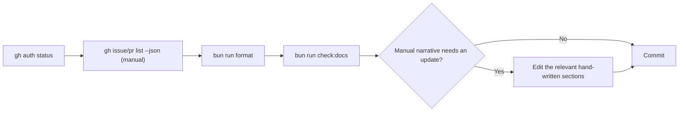

🇬🇧 English (source) · 🇮🇩 [Bahasa Indonesia](SKILL.id.md)

# AWCMS — GitHub Snapshot Refresh

> **This skill describes something that is not here.** `docs/awcms/github/`
> has never been committed in this repo (`git log -- docs/awcms/github`
> returns nothing) and `scripts/github-snapshot-refresh.ts` does not exist.
> `docs/awcms/README.md` says the same thing in one line: the snapshot "has
> not been adapted yet". Everything below is the awcms-mini design, kept as
> the specification a snapshot here would have to meet — **do not report its
> file names, counts or refresh steps as this repo's state.**
>
> To answer a question about the tracker RIGHT NOW, call `gh` and read the
> answer; do not look for a file. The §"Before refreshing" check below is
> still worth doing on its own merits — it catches issues left open by a PR
> body with no `Closes` keyword, which has happened twice here.

<!-- aspirational:mulai -->

The snapshot is a factual copy of GitHub state (issues, labels, milestones,
security alerts) — not the planned backlog (that stays
`docs/awcms/06_github_issues_detail.md`).

## Before refreshing: check for issues whose PR merged but which never closed

**Recurring, has already happened twice** (epic `blog_content` #537-#540;
epic online public tenant routing #556-#560): PRs in this repo sometimes
do not include the `Closes #NNN` keyword in their body, so merging the PR
does **not** automatically close the related issue — the issue is left
`open` on GitHub even though the code is already live on `main`.
`gh issue list --state open` alone is **not enough** to know the real
backlog (see memory `pr-body-missing-closes-keyword`). Before running the
refresh:

```bash
gh issue list --state open --limit 50 --json number,title
gh pr list --state merged --limit 30 --json number,title,mergedAt
```

Match each open issue against the title of a PR that mentions that issue
number (the title pattern in this repo: `... (Issue #NNN)`). For every
match whose PR already has `mergedAt` filled in, close the issue manually
with a comment naming the PR that closed it, and only then move on to the
refresh command below — do not let the refresh run with an open-issue
count that is already wrong.

## Command

```bash
gh auth status
# There is NO `bun run` target for this — the refresh is done MANUALLY with `gh`
# (see the commands below), and the result is written into docs/awcms/github/.
```

`scripts/github-snapshot-refresh.ts` (Issue #464) regenerates the
mechanical parts through the `gh` CLI (it never reads/stores a token
itself):

- **Metadata tables** (snapshot timestamp, issue/label/milestone counts,
  latest CodeQL run, alert count) in `README.md`, `issues-open-001.md`,
  `issues-closed-001.md`, `labels-milestones.md`, `security.md` —
  replaced wholesale, line by line.
- **The two growing issue-list tables** (open issues; closed issues after
  doc06, `>= #433`) are fully regenerated between the markers
  `<!-- github-snapshot:NAME:start/end -->`.

## What the script does NOT touch (stays manual)

- Hand-written narrative (the "### ... completed" sections in `README.md`).
- The historical original 38-issue doc06 table in `issues-closed-001.md`.
- The detailed label/milestone classification tables in `labels-milestones.md`.
- The "State summary at snapshot time" table in `README.md` (the
  prose-heavy Notes column) — update it manually when the OPEN/CLOSED
  count changes.

Review these sections manually after running the script whenever there
are new issues/labels/milestones that need narrative context.

**Note (Issue #475):** if the latest CodeQL run for `main` is still
`in_progress`/`queued` (e.g. you just pushed/merged), the "Latest CodeQL
run" line in `security.md` is **deliberately not updated** — the script
prints a warning to the console and leaves the old value, rather than
guessing an unfinished run's status as `Failure`. Re-run the script a few
minutes later if that line needs the latest value.

## Flow



## Output

A summary: which files were updated, the new open/closed/label/milestone
numbers, and the list of manual sections that need review (if there are
new issues/labels since the last snapshot).

<!-- aspirational:selesai -->

## What to do here instead

Query the tracker directly and report the answer — there is no file to
regenerate, so nothing to commit:

```bash
gh auth status
gh issue list --state open --limit 50 --json number,title,labels,milestone
gh pr list --state merged --limit 30 --json number,title,mergedAt
gh api repos/ahliweb/awcms/code-scanning/alerts --paginate | head
```

Adopting a committed snapshot here would be a real change with a real cost
(a generator, a freshness gate, and a bilingual mirror per file under
[ADR-0097](../../../docs/adr/0097-english-is-the-source-language.md)),
so it needs a decision, not an assumption that it already happened.
