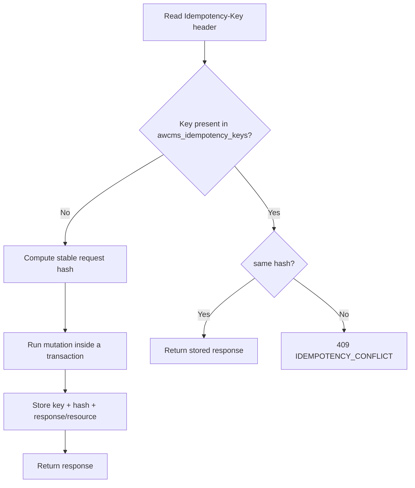

🇬🇧 English (source) · 🇮🇩 [Bahasa Indonesia](SKILL.id.md)

# AWCMS — Idempotent High-Risk Mutation

Follow `docs/awcms/10_template_kode_coding_standard.md`.

## Flow



## Rules

1. The `Idempotency-Key` header is **mandatory**; if empty → `400 IDEMPOTENCY_REQUIRED`.
2. Stable request hash from a normalized body (consistent field ordering).
3. Same key + same hash → replay the stored response (safe).
4. Same key + different hash → `409 IDEMPOTENCY_CONFLICT`.
5. Store the resulting status/resource of the mutation in `awcms_idempotency_keys`.
6. Combine with a stock lock (`SELECT ... FOR UPDATE`) & the transaction wrapper.
7. Deadlock retry must be safe because of idempotency.
8. Key retention: 7–30 days.
9. **The hash MUST be bound to the resource identity** — see §"Bind the hash to the resource id" below, this is not optional and has caused real bugs repeatedly.

## CRITICAL — bind the request hash to the resource id (Issue #750, #795 — recurring 4x)

`computeRequestHash(payload: unknown)` (`src/modules/_shared/idempotency.ts:36`) **enforces nothing by itself** — it is just a SHA-256 of the JSON body with its keys already sorted. It does NOT know which resource is being mutated. The store key in `awcms_idempotency_keys` is `(tenant_id, request_scope, idempotency_key)`, and that `request_scope` is **shared across every resource of the same type within one tenant** (not per-resource) — so if `computeRequestHash` is hashed from the raw `body` only (or from an empty body `{}` for `restore`/`cancel`/`commit` endpoints that have no other fields), then the same `Idempotency-Key` reused by a client for TWO different resources on the same endpoint type will replay the first resource's response for a request that was supposed to mutate the second resource — **a silent no-op that looks like success (200 with resource A's body), while resource B was never mutated.**

This bug class has appeared 4 times in this repo: Issue #750 (reference-data, PR #783, 3 rounds of fixes), then Issue #795 found the same pattern STILL unfixed in other modules (document-infrastructure PR #798, business-scope/organization-structure PR #801, identity-access/data-lifecycle/reports in other PRs) via an exhaustive `grep -rn "computeRequestHash(" src/pages/api/` — the first audit, which only targeted the endpoints that "looked obvious" (empty body), missed `PATCH`/other action endpoints whose body DOES exist but does not include the `id` from the path param.

### The CORRECT pattern

Always include the resource identity (usually `id`/`[key]`/`relationId` from the path param) AND an explicit literal `action` string in the hashed payload — do not just hash the raw `body`, and do not hash `{}` for an endpoint whose path already carries the id:

```ts
// src/pages/api/v1/tenant/domains/[id]/set-primary.ts:68 — empty body, id from the path
const requestHash = computeRequestHash({ domainId, action: "set_primary" });

// src/pages/api/v1/data-lifecycle/legal-holds/[id]/release.ts:69-73 — the body EXISTS but
// does not carry the id itself, so the id from the path must be added manually
const requestHash = computeRequestHash({
  ...body,
  id: holdId,
  action: "release"
});
```

Rule of thumb: if the endpoint has a `[id]`/`[key]`/`[relationId]` path param, that path param **must** go into the hashed object (spread the body first, then override/add `id`, so that an `id` field in the body — if any — does not silently win). The literal `action` must be present so that two different endpoints on the same resource (e.g. `restore` vs `delete`) do not collide even when their bodies happen to be identical (`{}`).

### Verification checklist before the PR

- Grep the **whole assigned tree**, not just the list of endpoints that "look suspicious": `grep -rn "computeRequestHash(" src/pages/api/v1/<module>/`. Do not trust a named endpoint list as complete — Issue #795 itself needed an independent re-grep because the first pass only targeted 7 of the 11 vulnerable endpoints.
- For every hit: does the hashed payload already include the resource id from the path AND the literal `action`? Pure create endpoints (no pre-existing resource to bind to, e.g. `POST /documents`) are NOT vulnerable — no `id` needed.
- Index-level endpoints that identify the resource through a combination of fields ALREADY present in the raw body (e.g. `scopeType`+`scopeId`+`sequenceKey` on `sequences/revise`) need no change — but verify this explicitly per endpoint, do not assume.
- Adversarial test: two different resources, the SAME `Idempotency-Key` reused on both in sequence → the second request must genuinely mutate the second resource (not replay the first resource's response). Real example: `tests/integration/document-infrastructure.integration.test.ts`.

See `src/modules/document-infrastructure/README.md` §"Catatan idempotency-key resource binding" for a full worked example across 11 endpoints of one module.

## Endpoints that require idempotency

POS posting, cancel/return, `profiles/resolve|links|merge-requests`, warehouse transfer approve/ship/receive, cycle-count, stock-adjustment, VAT invoice generate, Coretax batch, receipt send, sync push, workflow decision, blog post lifecycle actions (`blog_post_publish`/`_schedule`/`_archive`/`_restore`/`_purge`, `blog_revision_restore` — Issue #538/#541), `POST /api/v1/email/announcements` (Issue #497). This list grows with every new module — check the relevant module skill (e.g. `awcms-blog-content`, `awcms-email`) for the latest idempotency-gated endpoints, do not assume the list above is complete.

## Verification (tests)

- Same key + same request → one resource, consistent response.
- Same key + different request → `409`.
- Parallel double submit → no duplicate.
- Rollback on error → no partial state.
- Parallel double submit with **exactly the same** Idempotency-Key + same payload (a client network retry) → **both** requests 200 with an identical response (replay), not one of them 409 — rule 3 above ("same hash → replay") still holds even for the loser of the race. Parallel double submit with the same key but a **different payload** → one winner (200), one clean `409 IDEMPOTENCY_CONFLICT` (not a raw constraint error/500), per rule 4. This is enforced once in a shared helper, not per-endpoint: `saveIdempotencyRecord` (`src/modules/_shared/idempotency.ts`) does `INSERT ... ON CONFLICT DO NOTHING RETURNING id`; if it loses, it re-`SELECT`s the winning row (guaranteed already committed — `ON CONFLICT` only triggers against an already-committed row) and compares its `request_hash` with ours before throwing `IdempotencyRaceLostError` (carrying `replay` if the hash matches, `null` if it differs). `withTenant` (`src/lib/database/tenant-context.ts`) catches it in one place, rolls back the loser's transaction, logs `idempotency.race_lost` (the key is SHA-256 hashed, not raw — doc 10 masking), then replays the winner's response or returns 409 — automatically applying to every consumer of the `awcms_idempotency_keys` table without changing each route. Example tests: `tests/integration/tenant-domain-api.integration.test.ts`'s "set-primary under concurrent SAME Idempotency-Key + SAME payload" (replay, exactly one audit event + one idempotency key row) and "verify under concurrent SAME Idempotency-Key + DIFFERENT payload" (clean 409, where a different domain is used precisely to avoid the unrelated primary-dedup index race of `set-primary` itself).
