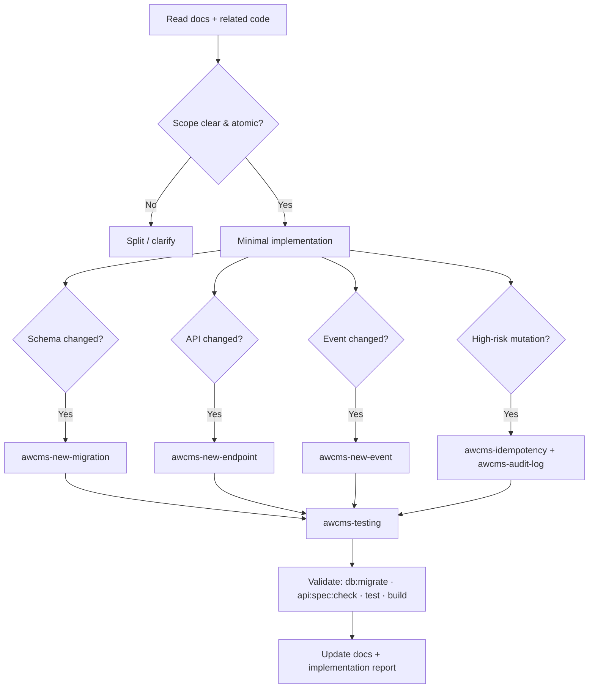

🇬🇧 English (source) · 🇮🇩 [Bahasa Indonesia](SKILL.id.md)

# AWCMS — Implement Issue / Sprint (Atomic)

Orchestrator skill for executing one AWCMS unit of work end-to-end under the contract in `AGENTS.md` and `docs/awcms/12_generator_prompt.md`.

## Required reading (MUST happen before editing)

1. `AGENTS.md` — mandatory rules & guardrails.
2. `docs/awcms/06_github_issues_detail.md` — issue detail.
3. `docs/awcms/11_implementation_blueprint.md` — target folders/files for the sprint.
4. The module, SQL, OpenAPI, AsyncAPI, and docs related to the scope.

## Procedure



## Atomicity rules

- Work only the issue's scope; **do not** touch unrelated files.
- Tenant-scoped data: tenant context + `awcms-abac-guard` + RLS.
- Sensitive data: `awcms-sensitive-data`.
- High-risk action: `awcms-audit-log`; high-risk mutation: `awcms-idempotency`.
- Deletable resource: soft delete + restore/purge policy; do not delete posted/append-only entities.
- External providers go through the outbox/queue, **not** inside a DB transaction.
- Backend/tooling must be Bun-only. Do not add Node.js/npm/npx/pnpm/yarn or a Node.js server adapter unless Bun does not yet support that capability, the maintainer has given explicit permission, and the exception is recorded in the docs/audit.

## Mandatory validation

```bash
bun run db:migrate
bun run api:spec:check
bun test
bun run build
```

## Definition of Done

Follow the DoD checklist in `AGENTS.md`. Close with an **implementation report**:

```text
Summary:
Files changed:
Commands run:
Test results:
Security notes:
Documentation updates:
Remaining limitations:
Next recommended step:
```

## Related skills

`awcms-new-module`, `awcms-new-migration`, `awcms-new-endpoint`, `awcms-new-event`, `awcms-idempotency`, `awcms-abac-guard`, `awcms-audit-log`, `awcms-sensitive-data`, `awcms-testing`, `awcms-security-review`, `awcms-pr-review`.
