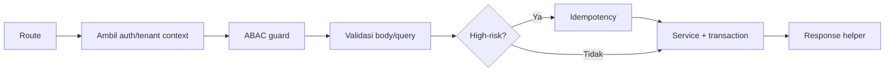

🇮🇩 Bahasa Indonesia · 🇬🇧 [English (source)](SKILL.md)

<!-- i18n-source-hash: sha256:7e79bf1b4b5d3b00f33b633a92a162beb375e7e35d60150091d914d97bff810f -->

# AWCMS — New / Changed API Endpoint

Ikuti `docs/awcms/05_openapi_asyncapi_detail.md` dan `docs/awcms/10_template_kode_coding_standard.md`. Integrasi frontend: `docs/awcms/15_frontend_architecture_integration.md`; akses data/RLS: `docs/awcms/16_backend_data_access_integration.md`.

## Urutan handler (route tipis)



## Pembukaan rute: `defineTenantRoute` WAJIB untuk rute baru

Rute tenant-scoped **tidak lagi** menulis sendiri
`resolveAuthInputs → cek tenant/token → getDatabaseClient → hashSessionToken →
withTenant → authorizeInTransaction → auth.denied`. Semua itu hidup satu kali di
`src/modules/_shared/tenant-route.ts`.

```ts
export const GET = defineTenantRoute({
  workClass: "reporting", // WAJIB — tanpa default, lihat di bawah
  authorize: { moduleKey: "reporting", activityCode: "dashboard", action: "read" },
  prepare: async ({ request, url }) => {
    // body/query/cursor — SEBELUM koneksi diambil, jadi request cacat
    // tidak memakan slot pool. Kembalikan `Response` untuk short-circuit.
  },
  handler: async ({ tx, auth, tenantId, prepared }) => ok(...)
});
```

- **`workClass` wajib, tanpa default.** 176 dari 204 berkas rute lama tidak
  meneruskannya, jadi berbagi budget pool dengan login karena kelalaian, bukan
  keputusan. Menegaskan ulang `"interactive"` jawaban yang sah.
- **Bentuk callback `authorize`:** tulis `prepare` SEBELUM `authorize` di object
  literal. TypeScript menyimpulkan `TPrepared` menurut urutan sumber; `authorize`
  duluan mem-pin-nya ke `undefined` dan errornya menyesatkan.
- **Gate `bun run api:tenant-route:check`** menolak rute BARU yang membuka
  transaksi tenant sendiri. Ia memindai **dua** root sejak Issue #424:
  `src/pages/api` (`.ts`) dan `src/pages/admin` (`.astro`). `NOT_YET_MIGRATED`
  memuat 236 berkas — rute API lama plus **32 layar admin** (PROJECT_STATE §4
  R3). Daftar itu **hanya boleh menyusut**; entri basi juga menggagalkan gate.
  **Jangan pernah menambah baris ke daftar itu.**
- Migrasi rute lama: satu modul per PR, tanpa perubahan perilaku, hapus barisnya
  dari daftar.
- **Layar admin belum bisa dimigrasi:** helper `defineAdminScreen` belum ada (ia
  Gelombang 1 dari #423). Sampai ia mendarat, jangan menambah layar `/admin/*`
  yang membuka transaksinya sendiri — gate akan menolaknya, dan itu disengaja.

## Aturan

1. Route hanya orkestrasi; business logic di service, query di repository.
2. Base path `/api/v1`. Auth wajib kecuali endpoint public eksplisit.
3. Tenant-scoped → wajib header `X-AWCMS-Tenant-ID` + tenant context + RLS.
   **Rute publik tenant-scoped** (tanpa sesi/header — mis. halaman blog publik, RSS, sitemap) resolve tenant lewat segmen path `tenantCode` (`/<prefix>/{tenantCode}/...`), **bukan** subdomain — lihat ADR-0009 (`docs/adr/0009-public-tenant-scoped-routes.md`) untuk alasan lengkap (subdomain butuh wildcard DNS/TLS, bertentangan dengan topologi LAN-first default). Contoh nyata sudah ada di base ini: rute publik `blog_content` (`src/pages/blog/[tenantCode]/**`, Issue #540) adalah konsumen pertama, `site_search` dan route discovery `seo_distribution` menyusul. Sebagian rute discovery `seo_distribution` sudah host-resolved (bukan path) — ikuti modulnya, jangan generalisasi satu pola ke semuanya.
4. Cek akses dengan `awcms-abac-guard` (default deny).
5. Validasi semua input (UUID, enum, length, numeric range, unknown field).
   Baca body lewat `readJsonBody`/`readTextBody`/`readFormBody`
   (`src/lib/security/request-body-limit.ts`, Issue #686) —
   **jangan pernah** panggil `request.json()`/`.text()`/`.formData()`
   langsung, endpoint ini menegakkan batas ukuran body level aplikasi
   (bukan hanya reverse-proxy). Pola drop-in:
   ```ts
   const bodyRead = await readJsonBody<XBody>(
     request /* , "large" bila konten berat */
   );
   if (bodyRead.tooLarge) return bodyTooLargeResponse(bodyRead.limitBytes);
   const validation = validateXInput(bodyRead.value); // sama seperti sebelumnya
   ```
   Tier `default` (128 KiB) untuk mayoritas endpoint; `large` (5 MiB)
   hanya untuk endpoint konten-berat (HTML/rich content, batch sync).
   Jangan menambah tier baru tanpa memperbarui plafon keras
   `BODY_SIZE_HARD_CEILING_BYTES`, lalu jalankan ulang
   `tests/request-body-limit-coverage.test.ts` — sapuan yang membuktikan
   tidak ada route membaca body tanpa plafon. Perhatikan yang TIDAK
   diasersikannya: tidak ada test yang memaku nilai
   `BODY_SIZE_HARD_CEILING_BYTES` itu sendiri, jadi mengubahnya tidak
   menggagalkan apa pun.
6. Mutation high-risk → `awcms-idempotency` (`Idempotency-Key`).
7. Data sensitif keluar lewat mapper (`awcms-sensitive-data`); jangan return row mentah.
8. DELETE resource deletable berarti soft delete; restore/purge butuh ABAC, audit, OpenAPI, dan idempotency bila high-risk.
9. **Update OpenAPI** — sejak Issue #182 (epic #177, ADR-0026) `openapi/awcms-public-api.openapi.yaml` adalah artefak GENERATED, jangan diedit langsung. Edit fragment sumbernya: `openapi/modules/<module-key>.openapi.yaml` (path/operation/schema milik modul itu — satu berkas = satu modul) atau `openapi/awcms-public-api.src.yaml` (info/servers/tags/security/securitySchemes/parameters/responses/schema yang genuinely dipakai 2+ modul). **Tag operasi WAJIB ada di katalog `tags:` root** — generator referensi mengelompokkan menurut tag yang DIDEKLARASIKAN, jadi tag tak-terdeklarasi membuat endpoint Anda hilang dari `docs/awcms/api-reference.md` tanpa error apa pun (pernah terjadi pada 55 operasi milik empat modul; PR #308). Lalu jalankan `bun run openapi:bundle` (regenerate bundle) dan `bun run api:docs:generate` (regenerate `docs/awcms/api-reference.md`), lalu validasi dengan `bun run api:spec:check` (route parity, operationId unik, path parameter, standard error schema `ApiError`, security metadata + allow-list `security: []`, bundle freshness, **katalog tag dua arah**, **kepemilikan fragment dua arah** — `openApiPath` menunjuk fragment modul sendiri yang benar-benar ada, bukan bundel) dan `bun run api:docs:check`. Commit fragment sumber, bundle, DAN referensi Markdown hasil regenerate dalam PR yang sama — lihat `openapi/README.md`. Modul turunan menyumbang fragment lewat seam `buildBundledDocument({ extraFragmentFiles })` tanpa mengedit fragment base (`docs/awcms/api-contribution-guide.md`).
10. Endpoint publik/mahal (tanpa auth, atau operasi berat) → rate limiting sumber, **dua tingkat** di `src/lib/security/rate-limit.ts` (reuse — jangan bikin limiter baru): `checkSharedRateLimit` (berbagi lewat Redis, lintas-instans — wajib untuk permukaan auth dan apa pun yang butuh konsistensi lintas-replika, ADR-0066) dan `checkRateLimit` (in-process, per-instans) untuk permukaan lain. Lihat `awcms-integration`.
11. **Cache tepi (ADR-0042) — dua kewajiban berlawanan arah, keduanya senyap bila dilewatkan.** Lihat skill `awcms-edge-cache`.
    - Endpoint **mutasi** pada modul yang punya permukaan ter-cache: enqueue purge di dalam transaksi yang sama (`enqueueModuleContentPurge`, `src/lib/edge-cache/content-purge.ts`). Melewatkannya = konten basi tersaji sampai TTL habis, tanpa satu pun test yang merah.
    - Endpoint **baca publik** yang ingin di-cache: daftarkan permukaannya di `src/lib/edge-cache/surface-registry.ts`. Lapisan ini **default-deny** — rute yang tidak terdaftar tidak akan pernah di-cache, yang aman tetapi diam. Jangan mendaftarkan permukaan yang belum bisa memenuhi syaratnya (mis. belum bisa me-resolve tenant): deklarasi mati lebih buruk daripada tidak mendeklarasikan. Gate `bun run edge-cache:surfaces:check` menegakkan daftar probe `MUST_NEVER_MATCH`.
12. **Sebelum MENGUBAH endpoint yang sudah ada, cek apakah path-nya beku di `scripts/api-consumer-contract.ts`** (`CONSUMED_PATHS` — benar-benar dipanggil `awcms-astro`; `COMMITTED_PATHS` — dijanjikan lewat ADR). Mengubah bentuknya memerahkan `bun run api:consumer-contract:check` dan merusak build `awcms-astro`; **regenerasi kontrak bukan langkah rutin** — ia berarti konsumennya harus ikut berubah (ADR-0065/ADR-0068).

## Response helper

Sukses `{ success:true, data, meta }`; error `{ success:false, error:{ code, message, details }, meta }`. Gunakan `ok()`, `created()`, dan `fail()` (`src/modules/_shared/api-response.ts`): `created()` mengembalikan status 201 dan adalah helper yang benar untuk POST yang membuat resource baru; `ok()` (200) untuk read/update. Contoh endpoint create yang sudah benar: `POST /api/v1/abac/policies`, `POST /api/v1/roles`, dan `POST /api/v1/offices` (`src/pages/api/v1/{abac/policies,roles,offices}/index.ts`) semuanya memanggil `created(...)`. `meta.correlationId` **otomatis** terisi oleh middleware sejak Issue #447 untuk setiap response JSON `/api/*` — jangan set `correlationId` di dalam `error`, dan jangan wiring manual `meta.correlationId` kecuali butuh nilai eksplisit lebih awal (baca `context.locals.correlationId`, jangan generate UUID baru), lihat `awcms-observability`.

## Error code standar

`VALIDATION_ERROR`(400), `AUTH_REQUIRED`(401), `TOKEN_EXPIRED`(401), `ACCESS_DENIED`(403), `TENANT_REQUIRED`(400), `RESOURCE_NOT_FOUND`(404), `RESOURCE_DELETED`(410), `IDEMPOTENCY_REQUIRED`(400), `IDEMPOTENCY_CONFLICT`(409), `WORKFLOW_APPROVAL_REQUIRED`(409), `STOCK_NOT_AVAILABLE`(409), `SYNC_CONFLICT`(409), `PAYLOAD_TOO_LARGE`(413), `DATABASE_BUSY`(503), `PROVIDER_ERROR`(502), `INTERNAL_ERROR`(500). Jangan expose stack trace.

## Header standar

`Authorization`, `X-AWCMS-Tenant-ID`, `Idempotency-Key`, `X-Correlation-ID`, `Accept-Language`; sync: `X-AWCMS-Node-ID`, `X-AWCMS-Timestamp`, `X-AWCMS-Signature`.

## Verifikasi

```bash
bun run openapi:bundle
bun run api:spec:check
bun test
```

(`api:contract:test` sempat direncanakan di blueprint awal, doc 11 — belum pernah dibangun; `bun test` mencakup unit+integration termasuk kontrak API hari ini, lihat `awcms-testing`.)

Endpoint mutation high-risk (post, cancel, resolve, link, merge, delete/restore/purge master data, transfer approve/ship/receive, cycle-count, adjustment, vat generate, coretax batch, receipt send, sync push, workflow decision) **wajib** idempotency.
