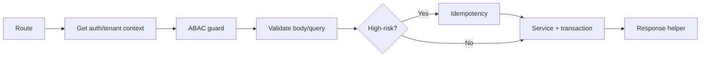

🇬🇧 English (source) · 🇮🇩 [Bahasa Indonesia](SKILL.id.md)

# AWCMS — New / Changed API Endpoint

Follow `docs/awcms/05_openapi_asyncapi_detail.md` and `docs/awcms/10_template_kode_coding_standard.md`. Frontend integration: `docs/awcms/15_frontend_architecture_integration.md`; data access/RLS: `docs/awcms/16_backend_data_access_integration.md`.

## Handler order (thin route)



## Opening a route: `defineTenantRoute` is MANDATORY for new routes

Tenant-scoped routes **no longer** write their own
`resolveAuthInputs → check tenant/token → getDatabaseClient → hashSessionToken →
withTenant → authorizeInTransaction → auth.denied`. All of that lives once in
`src/modules/_shared/tenant-route.ts`.

```ts
export const GET = defineTenantRoute({
  workClass: "reporting", // MANDATORY — no default, see below
  authorize: { moduleKey: "reporting", activityCode: "dashboard", action: "read" },
  prepare: async ({ request, url }) => {
    // body/query/cursor — BEFORE a connection is taken, so a malformed request
    // does not consume a pool slot. Return a `Response` to short-circuit.
  },
  handler: async ({ tx, auth, tenantId, prepared }) => ok(...)
});
```

- **`workClass` is mandatory, with no default.** 176 out of 204 old route files do not
  pass it, so they share the pool budget with login out of negligence, not
  a decision. Restating `"interactive"` is a legitimate answer.
- **Shape of the `authorize` callback:** write `prepare` BEFORE `authorize` in the object
  literal. TypeScript infers `TPrepared` in source order; `authorize` coming
  first pins it to `undefined` and the error message is misleading.
- **The gate `bun run api:tenant-route:check`** rejects NEW routes that open their own
  tenant transaction. It scans **two** roots since Issue #424:
  `src/pages/api` (`.ts`) and `src/pages/admin` (`.astro`). `NOT_YET_MIGRATED`
  contains 236 files — the old API routes plus **32 admin screens** (PROJECT_STATE §4
  R3). That list **may only shrink**; stale entries also fail the gate.
  **NEVER add a line to that list.**
- Migrating an old route: one module per PR, no behaviour change, remove its line
  from the list.
- **Admin screens cannot be migrated yet:** the `defineAdminScreen` helper does not exist yet (it is
  Wave 1 of #423). Until it lands, do not add an `/admin/*` screen
  that opens its own transaction — the gate will reject it, and that is deliberate.

## Rules

1. The route only orchestrates; business logic lives in the service, queries in the repository.
2. Base path `/api/v1`. Auth is mandatory except for an explicitly public endpoint.
3. Tenant-scoped → the `X-AWCMS-Tenant-ID` header + tenant context + RLS are mandatory.
   **Public tenant-scoped routes** (no session/header — e.g. public blog pages, RSS, sitemap) resolve the tenant through the `tenantCode` path segment (`/<prefix>/{tenantCode}/...`), **not** a subdomain — see ADR-0009 (`docs/adr/0009-public-tenant-scoped-routes.md`) for the full reasoning (subdomains need wildcard DNS/TLS, which conflicts with the default LAN-first topology). Real examples already exist in this base: the `blog_content` public routes (`src/pages/blog/[tenantCode]/**`, Issue #540) are the first consumer, with `site_search` and the `seo_distribution` discovery routes following. Some `seo_distribution` discovery routes are already host-resolved (not path) — follow the module, do not generalise one pattern to everything.
4. Check access with `awcms-abac-guard` (default deny).
5. Validate every input (UUID, enum, length, numeric range, unknown field).
   Read the body through `readJsonBody`/`readTextBody`/`readFormBody`
   (`src/lib/security/request-body-limit.ts`, Issue #686) —
   **never** call `request.json()`/`.text()`/`.formData()`
   directly, these endpoints enforce an application-level body size limit
   (not just a reverse-proxy one). Drop-in pattern:
   ```ts
   const bodyRead = await readJsonBody<XBody>(
     request /* , "large" if the content is heavy */
   );
   if (bodyRead.tooLarge) return bodyTooLargeResponse(bodyRead.limitBytes);
   const validation = validateXInput(bodyRead.value); // same as before
   ```
   The `default` tier (128 KiB) for the majority of endpoints; `large` (5 MiB)
   only for content-heavy endpoints (HTML/rich content, batch sync).
   Do not add a new tier without updating the hard ceiling
   `BODY_SIZE_HARD_CEILING_BYTES`, and re-run
   `tests/request-body-limit-coverage.test.ts` — the sweep that proves no
   route reads a body without a ceiling. Note what it does NOT assert: no
   test pins the value of `BODY_SIZE_HARD_CEILING_BYTES` itself, so a change
   to it fails nothing.
6. High-risk mutation → `awcms-idempotency` (`Idempotency-Key`).
7. Sensitive data leaves through a mapper (`awcms-sensitive-data`); do not return raw rows.
8. DELETE on a deletable resource means soft delete; restore/purge need ABAC, audit, OpenAPI, and idempotency when high-risk.
9. **Update OpenAPI** — since Issue #182 (epic #177, ADR-0026) `openapi/awcms-public-api.openapi.yaml` is a GENERATED artifact, do not edit it directly. Edit its source fragment: `openapi/modules/<module-key>.openapi.yaml` (the paths/operations/schemas belonging to that module — one file = one module) or `openapi/awcms-public-api.src.yaml` (info/servers/tags/security/securitySchemes/parameters/responses/schemas genuinely used by 2+ modules). **An operation's tag MUST exist in the root `tags:` catalogue** — the reference generator groups by DECLARED tags, so an undeclared tag makes your endpoint disappear from `docs/awcms/api-reference.md` without any error at all (this happened to 55 operations across four modules; PR #308). Then run `bun run openapi:bundle` (regenerate the bundle) and `bun run api:docs:generate` (regenerate `docs/awcms/api-reference.md`), then validate with `bun run api:spec:check` (route parity, unique operationId, path parameters, the standard `ApiError` error schema, security metadata + the `security: []` allow-list, bundle freshness, **two-way tag catalogue**, **two-way fragment ownership** — `openApiPath` points at the module's own fragment which really exists, not at the bundle) and `bun run api:docs:check`. Commit the source fragment, the bundle, AND the regenerated Markdown reference in the same PR — see `openapi/README.md`. Derived modules contribute a fragment through the `buildBundledDocument({ extraFragmentFiles })` seam without editing base fragments (`docs/awcms/api-contribution-guide.md`).
10. Public/expensive endpoints (no auth, or a heavy operation) → source rate limiting, **two tiers** in `src/lib/security/rate-limit.ts` (reuse — do not build a new limiter): `checkSharedRateLimit` (shared through Redis, cross-instance — mandatory for auth surfaces and anything that needs cross-replica consistency, ADR-0066) and `checkRateLimit` (in-process, per-instance) for other surfaces. See `awcms-integration`.
11. **Edge cache (ADR-0042) — two obligations pointing in opposite directions, both silent if skipped.** See the `awcms-edge-cache` skill.
    - **Mutation** endpoints on a module that has cached surfaces: enqueue the purge inside the same transaction (`enqueueModuleContentPurge`, `src/lib/edge-cache/content-purge.ts`). Skipping it = stale content served until the TTL expires, without a single red test.
    - **Public read** endpoints that want to be cached: register their surface in `src/lib/edge-cache/surface-registry.ts`. This layer is **default-deny** — an unregistered route will never be cached, which is safe but silent. Do not register a surface that cannot yet meet its requirements (e.g. cannot resolve the tenant yet): a dead declaration is worse than no declaration. The gate `bun run edge-cache:surfaces:check` enforces the `MUST_NEVER_MATCH` probe list.
12. **Before CHANGING an existing endpoint, check whether its path is frozen in `scripts/api-consumer-contract.ts`** (`CONSUMED_PATHS` — actually called by `awcms-astro`; `COMMITTED_PATHS` — promised through an ADR). Changing its shape turns `bun run api:consumer-contract:check` red and breaks the `awcms-astro` build; **regenerating the contract is not a routine step** — it means the consumer has to change too (ADR-0065/ADR-0068).

## Response helper

Success `{ success:true, data, meta }`; error `{ success:false, error:{ code, message, details }, meta }`. Use `ok()`, `created()`, and `fail()` (`src/modules/_shared/api-response.ts`): `created()` returns status 201 and is the correct helper for a POST that creates a new resource; `ok()` (200) for read/update. Correct create endpoints that already exist: `POST /api/v1/abac/policies`, `POST /api/v1/roles`, and `POST /api/v1/offices` (`src/pages/api/v1/{abac/policies,roles,offices}/index.ts`) all call `created(...)`. `meta.correlationId` is filled in **automatically** by the middleware since Issue #447 for every `/api/*` JSON response — do not set `correlationId` inside `error`, and do not wire `meta.correlationId` by hand unless you need an explicit value earlier (read `context.locals.correlationId`, do not generate a new UUID), see `awcms-observability`.

## Standard error codes

`VALIDATION_ERROR`(400), `AUTH_REQUIRED`(401), `TOKEN_EXPIRED`(401), `ACCESS_DENIED`(403), `TENANT_REQUIRED`(400), `RESOURCE_NOT_FOUND`(404), `RESOURCE_DELETED`(410), `IDEMPOTENCY_REQUIRED`(400), `IDEMPOTENCY_CONFLICT`(409), `WORKFLOW_APPROVAL_REQUIRED`(409), `STOCK_NOT_AVAILABLE`(409), `SYNC_CONFLICT`(409), `PAYLOAD_TOO_LARGE`(413), `DATABASE_BUSY`(503), `PROVIDER_ERROR`(502), `INTERNAL_ERROR`(500). Do not expose stack traces.

## Standard headers

`Authorization`, `X-AWCMS-Tenant-ID`, `Idempotency-Key`, `X-Correlation-ID`, `Accept-Language`; sync: `X-AWCMS-Node-ID`, `X-AWCMS-Timestamp`, `X-AWCMS-Signature`.

## Verification

```bash
bun run openapi:bundle
bun run api:spec:check
bun test
```

(`api:contract:test` was once planned in the original blueprint, doc 11 — it was never built; `bun test` covers unit+integration including today's API contracts, see `awcms-testing`.)

High-risk mutation endpoints (post, cancel, resolve, link, merge, delete/restore/purge master data, transfer approve/ship/receive, cycle-count, adjustment, vat generate, coretax batch, receipt send, sync push, workflow decision) **must** have idempotency.
