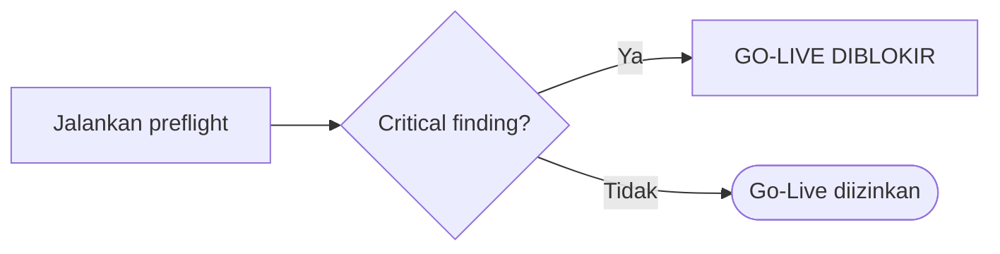

🇮🇩 Bahasa Indonesia · 🇬🇧 [English (source)](SKILL.md)

<!-- i18n-source-hash: sha256:071278e83987add19e80ec794bc142d591b2ede2374f909541527fecc021ae6c -->

# AWCMS — Production Preflight & Go-Live

Ikuti `docs/awcms/07_sprint_testing_production_readiness.md` dan `docs/awcms/12_generator_prompt.md`.

## Command preflight

```bash
bun install
bun run config:validate     # aturan env + aturan silang produksi
bun run check               # rantai lengkap: lint, docs, kontrak, typecheck, test, build
bun run db:pool:health      # terhadap DB target
bun run security:readiness  # GATE go-live — exit non-zero bila ada `critical`
```

> **`bun run production:preflight` TIDAK ADA — jangan menjalankannya.** Ia
> gagal dengan `error: Script not found`. Orkestrator ber-stage yang
> dijelaskan doc 07 §Preflight tidak pernah diimplementasikan di repo ini
> (doc 07 sendiri mengatakannya, dan `scripts/README.md` §Ditunda
> mendaftarkannya sebagai target tertunda) — begitu pula stage
> `database:capacity`-nya. Perintah di atas adalah langkah-langkah NYATA
> yang menggantikannya; `security:readiness` adalah satu-satunya yang
> benar-benar memblokir go-live dengan exit code.

> **KOREKSI 4 Agustus 2026 — dua klaim di paragraf ini tidak berlaku di repo
> ini.** Registry config yang dulu disebut di sini (di bawah src/lib/config/)
> **tidak ada** — direktori itu sendiri tidak ada — dan `config:docs:check` bukan
> target di `package.json`. Keduanya artefak `awcms-mini` yang ikut terbawa. Yang
> NYATA di sini: `scripts/validate-env.ts` (`bun run config:validate`) memegang
> aturan env beserta aturan silang produksi, dan
> `bun run config:env:coverage:check` — bagian dari rantai `bun run check` —
> menjaga tiap variabel yang dibaca kode tetap terdaftar.
>
> **Kenapa klaim itu bertahan berbulan-bulan, dan ini berlaku untuk setiap
> skill:** path-nya **terpotong baris** oleh pembungkusan markdown, dan
> ekstraktor `bun run skills:check` hanya melihat path berbacktick **satu
> baris** — jadi gerbangnya tak pernah melihatnya. (Dibuktikan saat koreksi ini
> ditulis: menyatukannya kembali ke satu baris langsung memerahkan gerbang.
> Karena itu path di atas ditulis **tanpa backtick** — gerbang tidak punya cara
> membedakan "path ini ada" dari "path ini TIDAK ada", dan menandainya sebagai
> klaim akan salah.) Teks aslinya dipertahankan di bawah sebagai catatan sejarah.
>
> _"Sejak Issue #689 (epic #679), `config:validate`'s CLI report menambahkan satu
> seksi baru di akhir output — deprecation notices (informational, tidak pernah
> menggagalkan check ini), didorong oleh registry config's field `deprecated`."_

**`AUTH_COOKIE_SECURE` kini benar-benar dijaga preflight** (4 Agustus 2026):
aturan produksinya menuntut nilai persis `"true"`. Sebelumnya ia hanya menolak
string literal `"false"`, sehingga variabel yang **tidak diset** — keadaan
bawaannya — menghasilkan cookie sesi tanpa `Secure` dengan preflight melaporkan
bersih. Tetap **verifikasi respons**, bukan hanya konfigurasi: `curl -I` pada
login produksi harus menunjukkan `Set-Cookie … Secure`. Validator memeriksa apa
yang dikonfigurasi; hanya respons yang membuktikan apa yang dikirim.

Kompresi respons dan tier cache di ATAS aplikasi (Cloudflare di depan
Traefik/Varnish) tidak diperiksa preflight mana pun — lihat skill `awcms-deploy`
(temuan C3/C14 di dokumen standar performa & keamanan).

<!-- aspirational:mulai -->

### Orkestrator ber-stage — TARGET, bukan sesuatu yang bisa dijalankan

Seluruh sub-bagian ini menggambarkan orkestrator yang dispesifikasikan doc 07
§Preflight. **Tidak satu pun dari ini ada di repo ini.** Ia disimpan karena
itulah bentuk yang akan diambil bila dibangun, dan karena semantik flag di
bawah adalah alasan bukti backup penting sama sekali.

Desainnya: SATU perintah **read-only** yang menjalankan seluruh urutan —
`config:validate` → `security:readiness` → `database:capacity` (kalkulator
kapasitas koneksi lintas-instance, murni aritmatika config, tanpa koneksi
database sama sekali; lihat `database-capacity-runbook.md`) →
`db:connectivity` → `api:spec:check` → `modules:compose:check` → `test` →
`build` → `db:pool:health` → `migration:plan` (dry-run: daftar migrasi
pending TANPA menjalankannya). Tidak ada stage yang menulis ke database;
menerapkan migrasi adalah langkah terpisah yang di-flag eksplisit
(`--apply-migrations --backup-verified --acknowledge-target=<nilai>`, ketiganya
wajib bersamaan, dengan `--acknowledge-target` harus sama dengan `APP_ENV`
sebagai penangkap typo), berjalan hanya setelah semua stage read-only lulus.

<!-- aspirational:selesai -->

### Menerapkan migrasi di REPO INI (langkah terpisah, wajib eksplisit)

Tidak ada orkestrator yang menggerbangi ini, jadi urutannya Anda sendiri yang
memegang: jalankan lima perintah di §Perintah preflight, pastikan
`bun run security:readiness` keluar dengan kode nol, ambil dan **uji-restore**
backup (§Backup & restore di bawah), baru kemudian jalankan
`bun run db:migrate` terhadap URL produksi. `db:migrate` adalah mekanisme
sesungguhnya dan ia menerapkan migrasi seketika — tidak ada yang memeriksa
lebih dulu bahwa langkah-langkah sebelumnya lulus.

Prosedur lengkap (rehearsal, bukti backup, apply, rollback):
`docs/awcms/production-preflight-runbook.md`. Tahap rehearsal-nya hanya
berlaku bagi instalasi yang memang mendirikan environment kedua — repo ini
tidak, dan tidak ada profil untuk itu: `staging` dihapus dari kosakata profil
deployment
([ADR-0083](../../../docs/adr/0083-this-template-deploys-to-one-environment.md)
sebagaimana diamandemen; tersisa `development`/`production`/`offline-lan`).
Tanpa environment pendahulu, bukti backup yang sudah diuji-restore berhenti
menjadi atestasi seremonial: ia satu-satunya yang berdiri di depan migrasi
produksi.

## Checklist go-live

**Application:** build pass · migration pass · OpenAPI valid · setup wizard locked · role default ada · ABAC default deny tested · RLS tested · soft delete default filter tested · logging aktif.

**Database:** versi sesuai target · PostgreSQL tidak public · least-privilege user · backup aktif · restore tested · index utama ada · partial index soft delete ada bila relevan · pool sehat · slow query monitoring.

**Security:** no hardcoded secret · `.env` aman & tidak dikomit · password hash modern · login lockout · RLS aktif · ABAC aktif · audit aktif · restore/purge berizin dan diaudit · tax data masked · CRM opt-out respected · AI read-only · sync HMAC bila hybrid · error tanpa stack trace · **no critical finding**.

**Privacy / hak subjek data (ADR-0094):** `bun run subject-data:coverage:check` 0 tabel berutang · `bun run subject-data:registry:check` hijau · permission ekspor dan penghapusan terpisah, dan **tidak ada satu principal pun memegang `subject_erasure.create` DAN `.approve`** (konflik SoD `critical` — periksa di tenant produksi, bukan hanya di kode) · `awcms_subject_requests` tidak punya DELETE untuk `awcms_app` (`REVOKE` eksplisit `sql/125`, terdaftar di `RETIRED_TENANT_TABLE_PRIVILEGES`).

**Permission tenant lama:** setelah rilis yang menambah permission baru, `bun run identity-access:permissions:backfill` sudah dijalankan dan diverifikasi dengan membuka layar terkait sebagai owner tenant LAMA — seed migration hanya menjangkau tenant yang dibuat sesudahnya, dan kegagalannya berupa 403 senyap.

**Runtime platform:** backend, script, test, migration, build, dan preflight berjalan dengan Bun. Tidak ada `node`, `npm`, `npx`, `pnpm`, `yarn`, adapter server Node.js, atau dependency yang memaksa runtime Node.js kecuali pengecualian tertulis sudah disetujui dan dicatat di docs/audit.

## Gate



## Backup & restore (wajib teruji)

Ada dua skrip dan hanya itu: `deploy/backup/backup-postgres.sh` dan
`deploy/backup/restore-postgres.sh`.

> **JANGAN set `BACKUP_ENCRYPTION_KEY_FILE` atau `BACKUP_HMAC_KEY_FILE`.**
> Enkripsi at-rest dan penandatanganan manifest **tidak diimplementasikan**.
> `backup-postgres.sh` menulis dump `--format=custom` polos plus sidecar
> sha256, dan ia **menolak jalan** — memang disengaja — bila salah satu
> variabel itu di-set, alih-alih membiarkan Anda mengira dump-nya terenkripsi.
> Lindungi dump dengan permission filesystem dan salinan off-host. Tidak ada
> `deploy/backup/README.md`, tidak ada `offsite-copy.sh`, tidak ada
> `restore-drill.sh`; versi terdahulu skill ini dan
> `docs/awcms/production-preflight-runbook.md` §Stage 2 menyebut keempatnya
> seolah-olah sudah ada.

```bash
DATABASE_URL="$DATABASE_URL" \
BACKUP_DIR=/var/backups/awcms \
./deploy/backup/backup-postgres.sh

DATABASE_URL="$DATABASE_URL" \
./deploy/backup/restore-postgres.sh /var/backups/awcms/awcms_YYYYMMDD_HHMMSS.dump
```

(Me-restore ke database sekali-pakai `awcms_restore_test` secara bawaan —
tidak pernah ke database hidup; `RESTORE_SCRATCH_DB` mengganti nama scratch
itu. Target pemulihan sungguhan wajib dinamai dan diakui secara eksplisit.)

Validasi restore dilakukan manual: baris tenant/user/transaksi terbaca ·
login test · report smoke test. Tidak ada yang mengotomasi drill atau
menghasilkan laporan RTO/RPO, jadi jadwalkan sendiri, terpisah dari backup
harian.

Bukti backup untuk migrasi produksi WAJIB berupa uji-restore nyata dari dua
skrip ini, bukan sekadar backup yang "ada" — lihat
`docs/awcms/production-preflight-runbook.md`'s §Backup evidence untuk
urutannya (dump → restore-test → catat evidence).

## Output

Laporan production readiness: status tiap gate, temuan (severity), rollback plan, keputusan go/no-go. Critical control fail **memblokir** go-live.

Laporan itu Anda susun sendiri dari output perintah-perintah di §Perintah
preflight — tidak ada verdict teragregasi dan tidak ada artefak terstruktur
`--json-output` untuk diarsipkan, karena tidak ada orkestrator yang
menghasilkannya. `bun run security:readiness` satu-satunya langkah yang kode
keluarnya membawa keputusan go/no-go.
