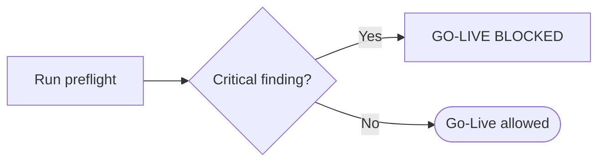

🇬🇧 English (source) · 🇮🇩 [Bahasa Indonesia](SKILL.id.md)

# AWCMS — Production Preflight & Go-Live

Follow `docs/awcms/07_sprint_testing_production_readiness.md` and `docs/awcms/12_generator_prompt.md`.

## Preflight commands

```bash
bun install
bun run config:validate     # env rules + production cross-rules
bun run check               # the full chain: lint, docs, contracts, typecheck, test, build
bun run db:pool:health      # against the target DB
bun run security:readiness  # go-live GATE — exits non-zero if there is a `critical`
```

> **`bun run production:preflight` DOES NOT EXIST — do not run it.** It
> fails with `error: Script not found`. The staged orchestrator
> described in doc 07 §Preflight was never implemented in this repo
> (doc 07 says so itself, and `scripts/README.md` §Deferred
> lists it as a deferred target) — and so was its
> `database:capacity` stage. The commands above are the REAL steps
> that replace it; `security:readiness` is the only one that
> actually blocks go-live with an exit code.

> **CORRECTION 4 August 2026 — two claims in this paragraph do not hold in this
> repo.** The config registry that used to be named here (under src/lib/config/)
> **does not exist** — that directory itself does not exist — and `config:docs:check` is not
> a target in `package.json`. Both are `awcms-mini` artifacts that were carried along. What is
> REAL here: `scripts/validate-env.ts` (`bun run config:validate`) holds
> the env rules together with the production cross-rules, and
> `bun run config:env:coverage:check` — part of the `bun run check` chain —
> keeps every variable the code reads registered.
>
> **Why that claim survived for months, and this applies to every
> skill:** the path was **broken across lines** by markdown wrapping, and
> the `bun run skills:check` extractor only looks at backticked paths on a **single
> line** — so the gate never saw it. (Proven while this correction was
> being written: joining it back onto one line immediately turned the gate red.
> That is why the path above is written **without backticks** — the gate has no way
> to tell "this path exists" from "this path DOES NOT exist", and flagging it as a
> claim would be wrong.) The original text is kept below as a historical note.
>
> _"Since Issue #689 (epic #679), `config:validate`'s CLI report adds one
> new section at the end of its output — deprecation notices (informational, never
> failing this check), driven by the config registry's `deprecated` field."_

**`AUTH_COOKIE_SECURE` is now genuinely guarded by preflight** (4 August 2026):
its production rule demands exactly the value `"true"`. Previously it only rejected
the literal string `"false"`, so a variable that was **not set** — its
default state — produced session cookies without `Secure` while preflight reported
clean. Still **verify the response**, not just the configuration: `curl -I` against
the production login must show `Set-Cookie … Secure`. The validator checks what
is configured; only the response proves what is sent.

Response compression and cache tiers ABOVE the application (Cloudflare in front of
Traefik/Varnish) are not checked by any preflight — see the `awcms-deploy` skill
(findings C3/C14 in the performance & security standards document).

<!-- aspirational:mulai -->

### The staged orchestrator — a TARGET, not something you can run

Everything in this sub-section describes the orchestrator doc 07 §Preflight
specifies. **None of it exists in this repo.** It is kept because it is the
shape a build would take, and because the flag semantics below are the reason
`--backup-verified` matters at all.

The design: ONE **read-only** command running the whole sequence —
`config:validate` → `security:readiness` → `database:capacity` (a
cross-instance connection capacity calculator, pure config arithmetic, no
database connection at all; see `database-capacity-runbook.md`) →
`db:connectivity` → `api:spec:check` → `modules:compose:check` → `test` →
`build` → `db:pool:health` → `migration:plan` (dry-run: lists pending
migrations WITHOUT running them). No stage writes to the database; applying
migrations is a separate, explicitly flagged step
(`--apply-migrations --backup-verified --acknowledge-target=<value>`, all
three mandatory together, with `--acknowledge-target` required to equal
`APP_ENV` as a typo catcher), running only after every read-only stage passes.

<!-- aspirational:selesai -->

### Applying migrations in THIS repo (a separate step, must be explicit)

There is no orchestrator to gate this, so the sequencing is yours to hold:
run the five commands under §Preflight commands, confirm
`bun run security:readiness` exits zero, take and **restore-test** a backup
(§Backup & restore below), and only then run `bun run db:migrate` against the
production URL. `db:migrate` is the real mechanism and it applies migrations
immediately — nothing checks first that the preceding steps passed.

The full procedure (rehearsal, backup evidence, apply, rollback):
`docs/awcms/production-preflight-runbook.md`. Its rehearsal stage only applies
to installations that do stand up a second environment — this repo does not,
and there is no profile for it: `staging` was removed from the deployment
profile vocabulary
([ADR-0083](../../../docs/adr/0083-this-template-deploys-to-one-environment.md)
as amended; `development`/`production`/`offline-lan` remain).
Without a preceding environment, restore-tested backup evidence stops being a
ceremonial attestation: it is the only thing standing in front of a production
migration.

## Go-live checklist

**Application:** build pass · migration pass · OpenAPI valid · setup wizard locked · default roles present · ABAC default deny tested · RLS tested · soft delete default filter tested · logging active.

**Database:** version matches the target · PostgreSQL not public · least-privilege user · backup active · restore tested · main indexes present · partial soft-delete index present where relevant · pool healthy · slow query monitoring.

**Security:** no hardcoded secret · `.env` safe & not committed · modern password hash · login lockout · RLS active · ABAC active · audit active · restore/purge authorized and audited · tax data masked · CRM opt-out respected · AI read-only · sync HMAC if hybrid · errors without stack traces · **no critical finding**.

**Privacy / data subject rights (ADR-0094):** `bun run subject-data:coverage:check` 0 tables in debt · `bun run subject-data:registry:check` green · export and erasure permissions separated, and **no single principal holds both `subject_erasure.create` AND `.approve`** (a `critical` SoD conflict — check in the production tenant, not only in the code) · `awcms_subject_requests` has no DELETE for `awcms_app` (an explicit `REVOKE` in `sql/125`, listed in `RETIRED_TENANT_TABLE_PRIVILEGES`).

**Permissions on older tenants:** after a release that adds new permissions, `bun run identity-access:permissions:backfill` has been run and verified by opening the relevant screen as the owner of an OLD tenant — the seed migration only reaches tenants created after it, and its failure mode is a silent 403.

**Runtime platform:** backend, scripts, tests, migrations, build, and preflight all run on Bun. No `node`, `npm`, `npx`, `pnpm`, `yarn`, Node.js server adapter, or dependency that forces the Node.js runtime, unless a written exception has been approved and recorded in the docs/audit.

## Gate



## Backup & restore (must be tested)

Five scripts exist under `deploy/backup/`, all real
([ADR-0123](../../../docs/adr/0123-backup-encryption-manifest-authentication.md)):
`backup-postgres.sh`, `restore-postgres.sh`, `manifest.sh`,
`offsite-copy.sh`, `restore-drill.sh` — see `deploy/backup/README.md` for the
full operator guide, including key generation.

Plain mode (unchanged, offline/LAN default):

```bash
DATABASE_URL="$DATABASE_URL" \
BACKUP_DIR=/var/backups/awcms \
./deploy/backup/backup-postgres.sh

DATABASE_URL="$DATABASE_URL" \
./deploy/backup/restore-postgres.sh /var/backups/awcms/awcms_YYYYMMDD_HHMMSS.dump
```

Encrypted + authenticated mode (recommended wherever a secret-management
story exists — set `BACKUP_AGE_RECIPIENTS_FILE`/`BACKUP_HMAC_KEY_FILE`
together at backup time, `RESTORE_AGE_IDENTITY_FILE`/`BACKUP_HMAC_KEY_FILE`
together at restore time; setting only one of a pair fails closed):

```bash
DATABASE_URL="$DATABASE_URL" \
BACKUP_DIR=/var/backups/awcms \
BACKUP_AGE_RECIPIENTS_FILE=/etc/awcms-backup/age-recipients.txt \
BACKUP_HMAC_KEY_FILE=/etc/awcms-backup/hmac.key \
./deploy/backup/backup-postgres.sh
```

(Restores into the disposable `awcms_restore_test` database by default —
never the live one; `RESTORE_SCRATCH_DB` overrides the scratch name. A real
recovery target has to be named and acknowledged explicitly.)

Restore validation: tenant rows readable, `FORCE ROW LEVEL SECURITY` count

> 0, migration ledger non-empty — asserted automatically by
> `restore-postgres.sh`; report/login smoke tests are still manual.
> `deploy/backup/restore-drill.sh` automates picking the newest eligible
> backup and running the drill unattended, appending RTO/RPO evidence to
> `restore-drill-evidence.jsonl` — schedule it (or use
> `deploy/cron/awcms.crontab`'s existing weekly entry) separately from the
> daily backup.

Backup evidence for a production migration MUST be a real restore test from
these scripts, not merely a backup that "exists" — see
`docs/awcms/production-preflight-runbook.md`'s §Stage 2 for the
sequence (dump → restore-test → record evidence).

## Output

A production readiness report: the status of each gate, findings (severity), rollback plan, go/no-go decision. A critical control failure **blocks** go-live.

You assemble that report yourself from the output of the commands under
§Preflight commands — there is no aggregated verdict and no structured
`--json-output` artefact to archive, because there is no orchestrator to
produce one. `bun run security:readiness` is the only step whose exit code
carries a go/no-go decision.
