🇮🇩 Bahasa Indonesia · 🇬🇧 [English (source)](SKILL.md)

<!-- i18n-source-hash: sha256:93448a661254d3de5f9c5b88fbf8696984ca4a5b8740ea166e82f85b895ad441 -->

# AWCMS — Release (Changesets)

Ikuti `docs/awcms/09_roadmap_repository_commit.md` §Versioning dan `.changeset/README.md`. Sejak Issue #692 (epic #679, platform-hardening), langkah dari "push tag" sampai "GitHub Release + image + SBOM + signature + provenance" **sudah otomatis** lewat `.github/workflows/release.yml` — lihat [`docs/awcms/release-process.md`](../../../docs/awcms/release-process.md) untuk detail lengkap (SBOM tool, keyless signing, attestation, environment approval, dry-run/rehearsal, verifikasi konsumen, rollback/yank). Skill ini tetap mendokumentasikan langkah lokal (changeset → version bump → tag) yang masih manual.

## Alur rilis

```mermaid
flowchart LR
  A[changeset:status<br/>cek pending] --> B[Validasi lokal:<br/>bun run check]
  B --> C[changeset:version<br/>bump + CHANGELOG]
  C --> D[Review diff CHANGELOG<br/>+ package.json]
  D --> E[Commit chore release vX.Y.Z<br/>+ push main]
  E --> F[git tag -a vX.Y.Z →<br/>release:verify → push tag]
  F --> G[release.yml: validate job<br/>+ build job SBOM x2]
  G --> H[release environment<br/>approval gate]
  H --> I[sign-attest-publish job:<br/>cosign sign + attest + publish]
```



## Prosedur

1. `bun run changeset:status` — pastikan ada changeset pending dan tingkat bump sesuai SemVer (MAJOR breaking / MINOR fitur / PATCH fix). Bila kosong tapi ada perubahan perilaku → minta changeset dulu, jangan rilis. Setiap PR yang membutuhkan changeset sudah ditegakkan otomatis oleh `.github/workflows/changesets.yml` (`bun run changesets:policy:check`) — pending changeset di titik ini seharusnya sudah lengkap, bukan ditemukan baru saat rilis.
2. Validasi lokal: `bun run check` (lint, docs, contracts, typecheck, test, build — `release.yml`'s `validate` job re-runs persis perintah yang sama, lihat `release-process.md` §validate job). Untuk rilis production tambah `bun run security:readiness` terhadap DB target (exit non-zero bila ada `critical` gagal — gate doc 07 yang NYATA ada di sini; daftar checknya `runSecurityReadinessChecks()` di `scripts/security-readiness.ts`, jumlahnya tumbuh dari rilis ke rilis). Orkestrator `production:preflight` yang dirujuk doc 07 **belum diimplementasikan di repo ini** — ia terdaftar sebagai target ditunda di `scripts/README.md` §Ditunda; jangan menjalankannya sebagai langkah rilis, ia akan gagal karena scriptnya tidak ada.
3. `bun run changeset:version` — konsumsi changeset → bump `package.json` + entri `CHANGELOG.md`.
4. Review diff; pastikan versi cocok peta doc 09 (0.1.0 Foundation … 1.0.0 production MVP).
5. Commit: `chore(release): vX.Y.Z` (sertakan CHANGELOG + package.json + penghapusan file changeset), push ke `main`.
6. Buat tag rilis **manual** — repo ini TIDAK punya script `changeset:tag`, dan `changeset tag` (bawaan Changesets) tidak menghasilkan tag `vX.Y.Z` yang dipakai repo ini (untuk paket `access: restricted` bernama `awcms` ia diam/format `awcms@X.Y.Z`, bukan `vX.Y.Z`). Script npm yang ADA hanya `changeset`, `changeset:version`, `changeset:status` (lihat `package.json`). Prosedur benar:
   ```bash
   git tag -a vX.Y.Z -m "vX.Y.Z"                 # tag anotasi di commit rilis
   RELEASE_VERIFY_TAG=vX.Y.Z bun run release:verify   # gate lokal: tag↔package.json↔CHANGELOG↔0 changeset pending
   git push origin vX.Y.Z                        # push HANYA tag rilis (hindari `--tags` yang mendorong semua tag lokal)
   ```
   Push tag ini **memicu** `.github/workflows/release.yml`: guard ancestor-of-`main`, `bun run release:verify` (versi/CHANGELOG/changeset tersisa harus konsisten — `release.yml` mengambil tag dari `github.ref_name`, lokal dari `RELEASE_VERIFY_TAG` atau `git describe --exact-match`), full quality gate, lalu — setelah disetujui lewat `release` environment (lihat doc `release-process.md` §Environment approval) — build image, dua SBOM CycloneDX (source + image), checksums, `cosign sign` keyless, `actions/attest-build-provenance`/`actions/attest`, push `ghcr.io/ahliweb/awcms`, dan `gh release create` dengan asset terlampir.
7. **Jangan** lagi menjalankan `gh release create` manual — itu sekarang bagian dari `release.yml`; menjalankannya manual sebelum workflow selesai akan bentrok dengan asset yang coba di-attach otomatis.

## Aturan

- Jangan rilis dari branch selain `main` (atau `release/vX.Y.Z` sesuai doc 09) — `release.yml` menolak tag yang bukan ancestor `origin/main`.
- Jangan edit CHANGELOG entri lama; koreksi lewat entri baru.
- Pra-1.0.0: minor boleh memuat penyesuaian belum stabil; tetap catat breaking di ringkasan changeset.
- Tag `vX.Y.Z` harus menunjuk commit rilis, bukan commit sesudahnya — `bun run release:verify` menolak bila `package.json`/CHANGELOG tidak cocok dengan tag.
- Sebelum tag rilis production pertama, jalankan rehearsal (`gh workflow run release.yml --ref main`) minimal sekali dan pastikan reviewer benar-benar approve gerbang environment `release` — lihat doc `release-process.md` §Dry-run/rehearsal.

## Verifikasi

- `git tag --points-at HEAD` menunjukkan tag baru; CHANGELOG punya seksi versi; `package.json` versi sama dengan tag.
- Setelah `release.yml` selesai: `gh attestation verify oci://ghcr.io/ahliweb/awcms:X.Y.Z --owner ahliweb` dan `cosign verify ...` (perintah lengkap di `release-process.md` §Verification) — tidak butuh akses repo secret. **Tag image tanpa awalan `v`**: `release.yml` memakai `${GITHUB_REF_NAME#v}`, jadi tag Git `v7.0.1` → image `ghcr.io/ahliweb/awcms:7.0.1`; `…:v7.0.1` tidak pernah ada di registry.
