🇬🇧 English (source) · 🇮🇩 [Bahasa Indonesia](SKILL.id.md)

# AWCMS — Release (Changesets)

Follow `docs/awcms/09_roadmap_repository_commit.md` §Versioning and `.changeset/README.md`. Since Issue #692 (epic #679, platform-hardening), the steps from "push tag" through "GitHub Release + image + SBOM + signature + provenance" are **already automated** via `.github/workflows/release.yml` — see [`docs/awcms/release-process.md`](../../../docs/awcms/release-process.md) for the full detail (SBOM tool, keyless signing, attestation, environment approval, dry-run/rehearsal, consumer verification, rollback/yank). This skill still documents the local steps (changeset → version bump → tag) that remain manual.

## Release flow

```mermaid
flowchart LR
  A[changeset:status<br/>check pending] --> B[Local validation:<br/>bun run check]
  B --> C[changeset:version<br/>bump + CHANGELOG]
  C --> D[Review CHANGELOG diff<br/>+ package.json]
  D --> E[Commit chore release vX.Y.Z<br/>+ push main]
  E --> F[git tag -a vX.Y.Z →<br/>release:verify → push tag]
  F --> G[release.yml: validate job<br/>+ build job SBOM x2]
  G --> H[release environment<br/>approval gate]
  H --> I[sign-attest-publish job:<br/>cosign sign + attest + publish]
```



## Procedure

1. `bun run changeset:status` — make sure there is a pending changeset and that the bump level matches SemVer (MAJOR breaking / MINOR feature / PATCH fix). If it is empty but there are behavioural changes → ask for a changeset first, do not release. Every PR that requires a changeset is already enforced automatically by `.github/workflows/changesets.yml` (`bun run changesets:policy:check`) — the pending changesets at this point should already be complete, not discovered fresh at release time.
2. Local validation: `bun run check` (lint, docs, contracts, typecheck, test, build — `release.yml`'s `validate` job re-runs exactly the same commands, see `release-process.md` §validate job). For a production release also add `bun run security:readiness` against the target DB (exits non-zero if any `critical` check fails — the doc 07 gate that REALLY exists here; its check list is `runSecurityReadinessChecks()` in `scripts/security-readiness.ts`, and it grows from release to release). The `production:preflight` orchestrator that doc 07 refers to **is not implemented in this repo** — it is listed as a deferred target in `scripts/README.md` §Deferred; do not run it as a release step, it will fail because the script does not exist.
3. `bun run changeset:version` — consume the changesets → bump `package.json` + `CHANGELOG.md` entries.
4. Review the diff; make sure the version matches the doc 09 map (0.1.0 Foundation … 1.0.0 production MVP).
5. Commit: `chore(release): vX.Y.Z` (include CHANGELOG + package.json + deletion of the changeset files), push to `main`.
6. Create the release tag **manually** — this repo does NOT have a `changeset:tag` script, and `changeset tag` (the Changesets built-in) does not produce the `vX.Y.Z` tag this repo uses (for the `access: restricted` package named `awcms` it stays silent/formats as `awcms@X.Y.Z`, not `vX.Y.Z`). The npm scripts that DO exist are only `changeset`, `changeset:version`, `changeset:status` (see `package.json`). The correct procedure:
   ```bash
   git tag -a vX.Y.Z -m "vX.Y.Z"                 # annotated tag on the release commit
   RELEASE_VERIFY_TAG=vX.Y.Z bun run release:verify   # local gate: tag↔package.json↔CHANGELOG↔0 pending changesets
   git push origin vX.Y.Z                        # push ONLY the release tag (avoid `--tags`, which pushes every local tag)
   ```
   Pushing this tag **triggers** `.github/workflows/release.yml`: ancestor-of-`main` guard, `bun run release:verify` (version/CHANGELOG/remaining changesets must be consistent — `release.yml` takes the tag from `github.ref_name`, locally it comes from `RELEASE_VERIFY_TAG` or `git describe --exact-match`), the full quality gate, then — once approved through the `release` environment (see doc `release-process.md` §Environment approval) — image build, two CycloneDX SBOMs (source + image), checksums, keyless `cosign sign`, `actions/attest-build-provenance`/`actions/attest`, push to `ghcr.io/ahliweb/awcms`, and `gh release create` with the assets attached.
7. **Do not** run `gh release create` manually any more — that is now part of `release.yml`; running it manually before the workflow finishes will collide with the assets it tries to attach automatically.

## Rules

- Do not release from a branch other than `main` (or `release/vX.Y.Z` per doc 09) — `release.yml` rejects a tag that is not an ancestor of `origin/main`.
- Do not edit old CHANGELOG entries; correct them through a new entry.
- Pre-1.0.0: a minor may carry not-yet-stable adjustments; still record breaking changes in the changeset summary.
- The `vX.Y.Z` tag must point at the release commit, not at a commit after it — `bun run release:verify` rejects it when `package.json`/CHANGELOG do not match the tag.
- Before the first production release tag, run a rehearsal (`gh workflow run release.yml --ref main`) at least once and make sure a reviewer really approves the `release` environment gate — see doc `release-process.md` §Dry-run/rehearsal.

## Verification

- `git tag --points-at HEAD` shows the new tag; the CHANGELOG has a section for the version; `package.json` version equals the tag.
- After `release.yml` finishes: `gh attestation verify oci://ghcr.io/ahliweb/awcms:X.Y.Z --owner ahliweb` and `cosign verify ...` (full commands in `release-process.md` §Verification) — no repo secret access needed. **Image tags have no `v` prefix**: `release.yml` uses `${GITHUB_REF_NAME#v}`, so the Git tag `v7.0.1` → image `ghcr.io/ahliweb/awcms:7.0.1`; `…:v7.0.1` never exists in the registry.
