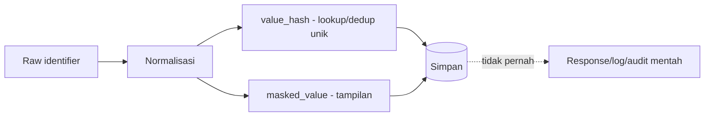

🇮🇩 Bahasa Indonesia · 🇬🇧 [English (source)](SKILL.md)

<!-- i18n-source-hash: sha256:1759a7ba251aec9174cf7f91f7b4a067f1eabeb1a5e87178e8d79576613f4012 -->

# AWCMS — Sensitive Data Handling

Ikuti `docs/awcms/04_erd_data_dictionary.md` (klasifikasi & masking).

## Pipeline identifier

## Aturan

1. Simpan `normalized_value`, `value_hash`, `masked_value`. Unik `(tenant_id, identifier_type, value_hash)`.
2. Response umum hanya tampilkan `masked_value`; nilai penuh hanya untuk role berwenang lewat `awcms-abac-guard`.
3. **Jangan** kirim raw value ke response/log/audit/event.
   **Satu pengecualian, dan ia BUKAN pelonggaran aturan ini:** ekspor hak
   subjek (ADR-0094) adalah pengungkapan yang SAH kepada orang yang datanya
   itu sendiri, digerbangi permission `data_lifecycle.subject_request.export`
   dan diaudit sebagai pengungkapan. Bahkan di sana kontrolnya tetap berlaku
   lewat `redactedColumns` pada descriptor `subjectData` — `awcms_profile_identifiers`
   meredaksi `normalized_value` (identifier terang) DAN `value_hash` (kunci
   lookup turunannya), karena mengembalikan salah satunya mengubah ekspor
   milik satu subjek menjadi oracle re-identifikasi bagi skema hashing yang
   dipakai SETIAP baris lain di tabel itu. Kalau menambah kolom sensitif ke
   tabel mana pun, tanyakan apakah ia harus masuk `redactedColumns`; gerbang
   `subject-data:registry:check` memverifikasi kolom yang kamu sebut memang
   ada, tapi tidak bisa menebak mana yang seharusnya kamu sebut.
4. Gunakan `normalizeIdentifier`/`hashIdentifier`/`maskIdentifier`
   (`src/modules/profile-identity/domain/identifier.ts`) untuk mengubah
   raw value → safe DTO — dipanggil langsung dari caller (mis.
   `identity-access/application/password-reset.ts`,
   `email/application/suppression-directory.ts`), **tidak** ada layer
   mapper terpisah (`infrastructure/mappers.ts` tidak pernah dibangun;
   sebagian besar modul bahkan tidak punya folder `infrastructure/`).
5. Receipt token: non-sequential, tidak mudah ditebak.
6. Password hanya hash modern; `password_hash` tidak pernah keluar.

## Klasifikasi

| Data                         | Level       | Kontrol                   |
| ---------------------------- | ----------- | ------------------------- |
| Password hash, API key/token | Critical    | Never expose / env only   |
| NPWP/NIK/NITKU               | High        | Mask + ABAC tax role      |
| Phone/WhatsApp/email         | High        | Mask + hash lookup        |
| Address                      | Medium/High | Need-to-know              |
| Tax invoice/XML              | High        | Tax role, audit, checksum |

## Verifikasi

- Response/log tidak memuat nilai sensitif penuh.
- Duplicate identifier tidak membuat profile baru (dedup via hash).
- Konsisten dengan redaction logger & `awcms-audit-log`.
- Kolom sensitif baru sudah dipertimbangkan terhadap `redactedColumns`
  descriptor `subjectData` modul pemiliknya (skill `awcms-data-lifecycle`
  §Hak subjek data), lalu `bun run subject-data:registry:check` hijau.
