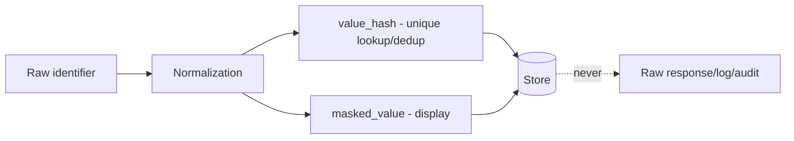

🇬🇧 English (source) · 🇮🇩 [Bahasa Indonesia](SKILL.id.md)

# AWCMS — Sensitive Data Handling

Follow `docs/awcms/04_erd_data_dictionary.md` (classification & masking).

## Identifier pipeline

## Rules

1. Store `normalized_value`, `value_hash`, `masked_value`. Unique on `(tenant_id, identifier_type, value_hash)`.
2. General responses only show `masked_value`; the full value only for authorized roles via `awcms-abac-guard`.
3. **Do not** send the raw value to a response/log/audit/event.
   **One exception, and it is NOT a loosening of this rule:** the subject
   rights export (ADR-0094) is a LEGITIMATE disclosure to the very person
   whose data it is, gated by the permission `data_lifecycle.subject_request.export`
   and audited as a disclosure. Even there the control still applies
   through `redactedColumns` on the `subjectData` descriptor — `awcms_profile_identifiers`
   redacts `normalized_value` (the identifier in clear) AND `value_hash` (its
   derived lookup key), because returning either one turns one subject's
   export into a re-identification oracle for the hashing scheme used by
   EVERY other row in that table. If you add a sensitive column to any
   table, ask whether it must go into `redactedColumns`; the
   `subject-data:registry:check` gate verifies that the columns you name really
   exist, but it cannot guess which ones you should have named.
4. Use `normalizeIdentifier`/`hashIdentifier`/`maskIdentifier`
   (`src/modules/profile-identity/domain/identifier.ts`) to turn a
   raw value → safe DTO — called directly from the caller (e.g.
   `identity-access/application/password-reset.ts`,
   `email/application/suppression-directory.ts`), there is **no** separate
   mapper layer (`infrastructure/mappers.ts` was never built;
   most modules do not even have an `infrastructure/` folder).
5. Receipt token: non-sequential, not easily guessable.
6. Passwords only as modern hashes; `password_hash` never goes out.

## Classification

| Data                         | Level       | Control                   |
| ---------------------------- | ----------- | ------------------------- |
| Password hash, API key/token | Critical    | Never expose / env only   |
| NPWP/NIK/NITKU               | High        | Mask + ABAC tax role      |
| Phone/WhatsApp/email         | High        | Mask + hash lookup        |
| Address                      | Medium/High | Need-to-know              |
| Tax invoice/XML              | High        | Tax role, audit, checksum |

## Verification

- Responses/logs contain no full sensitive values.
- A duplicate identifier does not create a new profile (dedup via hash).
- Consistent with the redaction logger & `awcms-audit-log`.
- Any new sensitive column has been weighed against the `redactedColumns`
  of the owning module's `subjectData` descriptor (skill `awcms-data-lifecycle`
  §Data subject rights), then `bun run subject-data:registry:check` is green.
