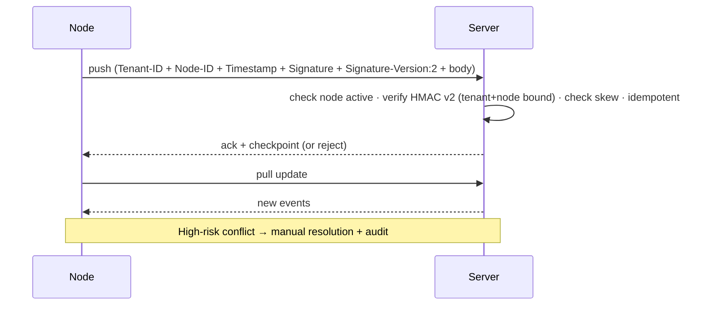

🇬🇧 English (source) · 🇮🇩 [Bahasa Indonesia](SKILL.id.md)

# AWCMS — Sync HMAC & Offline Sync

Follow `docs/awcms/08_sop_operasional_user_guide.md` and `docs/awcms/10_template_kode_coding_standard.md`.

## Versioned signature (fix for GHSA-c972-3q5p-g3h4)

The old cross-tenant hole (tenant & node **outside** the signature material)
has been closed with a **versioned** signature scheme. Use **v2** for all new
code & nodes.

### v2 — canonical (MUST for new code)

```text
signature = HMAC-SHA256(secret, "v2:<tenantId>:<nodeCode>:<timestamp>:<body>")
```

- Tenant and node are **inside** the material → a signature made for tenant A
  is no longer valid when the `X-AWCMS-Tenant-ID` header is swapped to tenant B.
- The node **must** send the header `X-AWCMS-Signature-Version: 2`.
- Field constraints so the material is unambiguous: `tenantId` = UUID; `nodeCode` &
  `timestamp` come from HTTP headers (must not contain CR/LF); `body` is the last
  field, so a `:` inside it cannot shift the boundary of a preceding field.
- **L1 enforcement (delimiter hardening, GHSA-c972):** `tenantId` = UUID is
  **enforced** at the v2 boundary, not merely assumed. `nodeCode` may
  contain `:` (schema `node_code text`), so without the UUID requirement the
  tenant/node boundary is ambiguous — `(tenantId="A", nodeCode="x:y")` and
  `(tenantId="A:x", nodeCode="y")` produce identical material. A UUID is 36 chars
  and always free of `:` → the boundary is unambiguous. `computeSyncSignatureV2` **throws**
  when `tenantId` is not a UUID; `verifySyncSignatureV2` is **fail-closed** (returns
  `false`). Only `tenantId` is constrained; `nodeCode` is untouched and **the v2
  material format DOES NOT change** → old v1/v2 nodes (whose tenant id is a UUID) are
  unaffected; mini/spec need no material-format change.
- The canonical implementation lives in the **awcms** repo (`domain/sync-hmac.ts`
  `computeSyncSignatureV2` / `verifySyncSignatureV2`).

### v1 — legacy, VULNERABLE (transition only)

```text
signature = HMAC-SHA256(secret, "<timestamp>.<body>")
```

- Used when the node does **not** send `X-AWCMS-Signature-Version`.
- Tenant & node are not bound → **it can still be forged across tenants**. It exists
  only so old nodes keep working during migration.
- Accepted **only** while the env `SYNC_HMAC_ALLOW_LEGACY` is not `false`
  (default: allow). The operator sets `SYNC_HMAC_ALLOW_LEGACY=false`
  once all nodes have moved to v2, to reject v1 entirely.
- **The hole is fully closed only when `SYNC_HMAC_ALLOW_LEGACY=false` AND every
  node uses v2.** Do not claim the advisory is closed before both conditions hold.

### Cross-repo coordination

v2 is canonical in **awcms** (this base), and since ADR-0055 no other family repo
carries a node implementation. The condition is therefore restated
against REAL deployments, not against archive repos: **every sync node that is
actually running** must use exactly the same v2 material before
`SYNC_HMAC_ALLOW_LEGACY=false` is switched on. (The previous wording hung this
switch on an update to **awcms-mini** — an archive repo that will never be
updated, so the condition could never be met and the v1 hole could never
be declared closed.) Ideally
continue on to **per-node secrets** (the advisory's 3rd suggestion) — out of scope for this patch.

## Node registration — default `inactive` + admin approval

`resolveOrRegisterSyncNode` INSERTs a first-contact node with
`status='inactive'` (not `active`). The node is quarantined until an admin approves it
via `PATCH /api/v1/sync/nodes/{id}` (`status: "active"`, guarded by
`sync_storage.node_management.update`, audited). This closes the "new node-id"
path — a forged request for another tenant lands on an inactive node and is rejected by
the `node.status !== "active"` gate. Nodes already `active` are unaffected.
(The `sql/010` column still defaults to `active` for historical rows; the INSERT in the
code that creates new rows is explicitly `inactive` — without editing an applied
migration.)

## Headers

`X-AWCMS-Tenant-ID`, `X-AWCMS-Node-ID`, `X-AWCMS-Timestamp`,
`X-AWCMS-Signature`, `X-AWCMS-Signature-Version` (`2` for v2).

## Validation rules

1. The signature **must** be present; reject if empty.
2. Timestamp valid; **max skew defaults to 300 seconds** (anti-replay).
3. **Timing-safe compare** for the signature (both versions).
4. v2: the material binds tenant+node — a tenant swap is automatically invalid.
5. v1 accepted only when `SYNC_HMAC_ALLOW_LEGACY` ≠ `false`.
6. **Inactive** nodes are rejected (`node.status !== "active"` → 403); a new node
   auto-registers as `inactive` and requires admin approval.
7. Duplicate events are idempotent (no double apply) — see `awcms-idempotency`.
8. A posted transaction is **immutable**; sync does not overwrite a posted transaction.
9. HMAC secret & R2 credentials come only from the **environment**.

## Flow



## R2 object queue (optional)

- Files are stored locally first, entering `awcms_object_sync_queue`.
- Uploaded when online; **checksums are verified**; retry is safe.

## Verification (tests)

- v2 tenant-swap is rejected (different material → different HMAC).
- v1 accepted when `SYNC_HMAC_ALLOW_LEGACY=true`, rejected when `false`.
- A node auto-registered as `inactive` → pull rejected; an `active` node still works.
- Valid HMAC accepted; invalid/expired rejected.
- Duplicate batch idempotent; checkpoint updated.
- Conflicts recorded immutably + audited.
