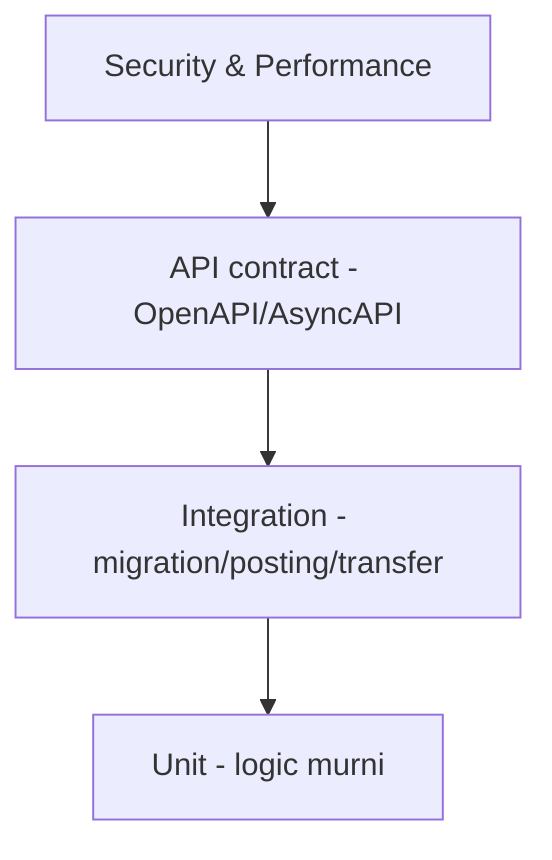

🇮🇩 Bahasa Indonesia · 🇬🇧 [English (source)](SKILL.md)

<!-- i18n-source-hash: sha256:ed6a213c7efb920106836b7c28f9ce597336600331f72dd4e4f8cdccbd16a4d3 -->

> **TITIK BUTA YANG WAJIB DIKETAHUI — `.astro` tidak diperiksa tipe sama
> sekali.** `bun run typecheck` adalah `tsc --noEmit`, dan `tsc` **tidak bisa
> mengurai `.astro`**: ia melewatinya diam-diam meskipun `tsconfig.json` menulis
> `"include": ["src/**/*"]`. `astro build` juga tidak memeriksa tipe, dan
> `@astrojs/check` tidak terpasang. Akibatnya **42 berkas / 22.328 baris**
> (seluruh 31 layar admin + login + halaman publik) hanya dijaga oleh test yang
> kamu tulis sendiri. Sejak ADR-0068 §C keadaan "nol typecheck `.astro`" ini
> tercatat sebagai divergence keluarga ber-`reviewDate` (TERBLOKIR:
> `@astrojs/check` menuntut TypeScript 6.x, repo di 7.0.2).
>
> Konsekuensi untuk cara menulis test:
>
> - **Layar `.astro` butuh contract test, bukan hanya "halamannya render".**
>   Pola yang sudah mapan di repo ini: `tests/admin-<modul>-page-contract.test.ts`
>   mengikat tiap permission yang halaman gerbangi ke yang route tegakkan DAN
>   descriptor deklarasikan — dua arah, dan **mutation-proven** (kembalikan cacat
>   aslinya, pastikan MERAH, baru revert).
> - **Kelas yang paling mungkin lolos:** `withTenant` (mengembalikan
>   `T | Response`) dipakai di tempat `withTenantOrThrow` (melempar) yang benar.
>   Halaman tetap ter-compile dan merender `Response` sebagai data. Hari ini
>   sebelas kemunculan `withTenant` di `.astro` seluruhnya ada di **komentar**,
>   jadi disiplin penulisnya benar — yang tidak ada adalah yang menjaganya tetap
>   begitu.
> - **Contract test layar dan gerbang cakupan permission menjawab dua pertanyaan
>   berbeda.** `access:permissions:enforcement:check` bertanya "apakah permission
>   ini punya penegak"; ia lulus untuk tombol Restore yang dirender pada baris
>   yang pasti 404 (PR #351). Tulis keduanya.

# AWCMS — Testing Strategy

Ikuti `docs/awcms/07_sprint_testing_production_readiness.md`. Jalankan dengan `bun test`.

## Piramida



## Target unit test

ABAC evaluator · profile resolver · soft delete/restore guard · product price selection · stock movement calc · checkout total · idempotency service · posting guard · VAT calc · warehouse transfer state machine · cycle count variance · HMAC signature · AI tool policy.

## Target integration test

Migration dari DB kosong · setup wizard · login owner/operator · product create/soft-delete/restore · opening stock · checkout/posting · stok berkurang · receipt PDF · sync outbox event · VAT draft · warehouse transfer · ABAC & RLS.

## API contract test

OpenAPI valid · success/error schema standar · tenant header ada · idempotency header ada · pagination konsisten · includeDeleted/restore/purge contract konsisten · sensitive data tidak tampil penuh.

## Security test

Tenant A tidak baca Tenant B · archive view butuh permission · operator tidak export Coretax · operator tidak assign role · customer hanya receipt miliknya · password/token/API key tidak di response/log · NPWP/NIK/phone/email masked · sync HMAC invalid ditolak · AI raw PII/SQL ditolak · **rute publik/tanpa-sesi tidak pernah membocorkan konten non-publik** (draft/review/scheduled-future/archived/private/unlisted/deleted) — reusable untuk modul apa pun yang punya split visibilitas publik vs privat (mis. `blog_content`, epic #536, Issue #540): sentralisasi satu predicate visibilitas dan tes predicate itu sendiri secara exhaustive, jangan andalkan filter query yang tersebar per-endpoint.

## Content sanitization test (modul dengan rich/structured content)

Untuk modul yang menyimpan konten terstruktur milik pengguna yang di-render ke HTML (mis. blog post body) — bukan sekadar string biasa: reject/strip `<script>`, inline `on*=` handler, `javascript:` URL, `<iframe>`/embed tak tepercaya saat validasi input **dan** saat render (dua lapis, jangan andalkan salah satu saja). Simpan JSON terstruktur (blok konten bertipe) sebagai sumber kebenaran, bukan HTML mentah dari klien.

## Performance target awal

Product search < 300ms · add item < 300ms · post transaksi < 1.5s · receipt PDF < 3s · sales daily report < 2s · pool acquire critical < 500ms · sync push small batch < 2s.

## Lokasi

Konvensi nyata repo ini (bukan sub-folder per domain): file **flat** langsung di `tests/`, satu file per area — `<area>.test.ts` (unit, tanpa DB) dan `tests/integration/<area>.integration.test.ts` (butuh `DATABASE_URL`, di-skip otomatis tanpanya — **jangan asumsikan `bun test` tanpa `DATABASE_URL` berarti semua test lulus**, integration test-nya cuma dilewati diam-diam). Contoh: `tests/access-control.test.ts`, `tests/module-management-tenant-lifecycle.test.ts`, `tests/integration/module-tenant-lifecycle.integration.test.ts`.

### Menjalankan suite DB-gated di lokal (sejak 2026-07-26)

Dev sudah setara produksi (migrasi penuh — 90 per 2026-08-05, `awcms_app`, RLS FORCE) — lihat
`docs/awcms/environments.md` §Development lokal. Tiga hal yang WAJIB diketahui
sebelum menjalankan:

1. **Keberadaan `.env` MENYALAKAN suite ini.** Bun memuat `.env` sendiri, jadi
   `env -u DATABASE_URL bun test` **tidak** menonaktifkannya — nilai dari
   `.env` mengisi lagi. Untuk mereproduksi job `quality` CI (yang jalan dengan
   `DATABASE_URL` kosong), pindahkan `.env` sementara.
2. **Harness butuh role PRIVILEGED, bukan `awcms_app`.** Ia `CREATE DATABASE`
   dan `ALTER ROLE`; dengan `awcms_app` hasilnya `permission denied to alter
role` (42501) — **bukan** skip, jadi mudah disalahartikan sebagai regresi.
   Override eksplisit menang atas `.env`, dan override **ketiga-tiganya**:
   ```bash
   OWNER='postgres://awcms:<pw>@localhost:5433/awcms'
   DATABASE_URL="$OWNER" SETUP_DATABASE_URL="$OWNER" WORKER_DATABASE_URL="$OWNER" \
     bun test tests/integration/
   ```
   Kalau `SETUP_DATABASE_URL` dibiarkan bocor dari `.env`, harness memeriksa
   klien app dan klien setup menunjuk database yang sama, gagal, lalu melapor
   `Connection closed` — pesan yang sama sekali tidak menunjuk penyebabnya.
3. **Dua suite DB-gated TIDAK boleh satu proses `bun test`** (tabrakan data —
   lihat komentar di `ci.yml`). Jalankan terpisah, persis seperti CI: harness
   (`tests/integration/`) lalu legacy ad-hoc (9 berkas `*-postgres.test.ts` dan
   kawan-kawan).

## Aturan

- Setiap fitur baru minimal punya unit test logic + satu integration/contract test.
- Test tenant-scoped memakai tenant context; jangan bergantung data global.
