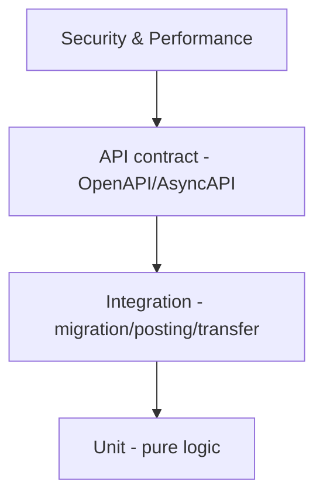

🇬🇧 English (source) · 🇮🇩 [Bahasa Indonesia](SKILL.id.md)

> **A BLIND SPOT YOU MUST KNOW ABOUT — `.astro` is not type-checked at all.**
> `bun run typecheck` is `tsc --noEmit`, and `tsc` **cannot parse `.astro`**: it
> skips those files silently even though `tsconfig.json` says
> `"include": ["src/**/*"]`. `astro build` does not type-check either, and
> `@astrojs/check` is not installed. As a result **42 files / 22,328 lines**
> (all 31 admin screens + login + the public pages) are guarded only by the
> tests you write yourself. Since ADR-0068 §C this "zero `.astro` typecheck"
> state is recorded as a family divergence with a `reviewDate` (BLOCKED:
> `@astrojs/check` demands TypeScript 6.x, the repo is on 7.0.2).
>
> Consequences for how you write tests:
>
> - **`.astro` screens need contract tests, not just "the page renders".** The
>   established pattern in this repo: `tests/admin-<module>-page-contract.test.ts`
>   binds every permission the page gates to the one the route enforces AND the
>   descriptor declares — both directions, and **mutation-proven** (put the
>   original defect back, confirm RED, then revert).
> - **The class most likely to slip through:** `withTenant` (which returns
>   `T | Response`) used where the correct call is `withTenantOrThrow` (which
>   throws). The page still compiles and renders the `Response` as data. Today
>   all eleven occurrences of `withTenant` in `.astro` are in **comments**, so
>   the authors' discipline is right — what is missing is whatever keeps it that
>   way.
> - **Screen contract tests and the permission coverage gate answer two
>   different questions.** `access:permissions:enforcement:check` asks "does this
>   permission have an enforcer"; it passes for a Restore button rendered on a
>   row that is guaranteed to 404 (PR #351). Write both.

# AWCMS — Testing Strategy

Follow `docs/awcms/07_sprint_testing_production_readiness.md`. Run with `bun test`.

## Pyramid



## Unit test targets

ABAC evaluator · profile resolver · soft delete/restore guard · product price selection · stock movement calc · checkout total · idempotency service · posting guard · VAT calc · warehouse transfer state machine · cycle count variance · HMAC signature · AI tool policy.

## Integration test targets

Migration from an empty DB · setup wizard · owner/operator login · product create/soft-delete/restore · opening stock · checkout/posting · stock decremented · receipt PDF · sync outbox event · VAT draft · warehouse transfer · ABAC & RLS.

## API contract test

OpenAPI valid · standard success/error schema · tenant header present · idempotency header present · consistent pagination · consistent includeDeleted/restore/purge contract · sensitive data never shown in full.

## Security test

Tenant A cannot read Tenant B · the archive view requires a permission · an operator cannot export Coretax · an operator cannot assign roles · a customer only sees their own receipt · password/token/API key never in a response/log · NPWP/NIK/phone/email masked · invalid sync HMAC rejected · AI raw PII/SQL rejected · **public/session-less routes never leak non-public content** (draft/review/scheduled-future/archived/private/unlisted/deleted) — reusable for any module with a public-vs-private visibility split (e.g. `blog_content`, epic #536, Issue #540): centralise a single visibility predicate and test that predicate itself exhaustively, do not rely on query filters scattered per endpoint.

## Content sanitization test (modules with rich/structured content)

For modules that store user-owned structured content rendered to HTML (e.g. a blog post body) — not merely plain strings: reject/strip `<script>`, inline `on*=` handlers, `javascript:` URLs, untrusted `<iframe>`/embeds at input validation **and** at render time (two layers, do not rely on either one alone). Store structured JSON (typed content blocks) as the source of truth, not raw HTML from the client.

## Initial performance targets

Product search < 300ms · add item < 300ms · post transaction < 1.5s · receipt PDF < 3s · sales daily report < 2s · pool acquire critical < 500ms · sync push small batch < 2s.

## Location

This repo's actual convention (not per-domain sub-folders): **flat** files directly under `tests/`, one file per area — `<area>.test.ts` (unit, no DB) and `tests/integration/<area>.integration.test.ts` (needs `DATABASE_URL`, skipped automatically without it — **do not assume that `bun test` without `DATABASE_URL` means all tests passed**, the integration tests were just silently skipped). Examples: `tests/access-control.test.ts`, `tests/module-management-tenant-lifecycle.test.ts`, `tests/integration/module-tenant-lifecycle.integration.test.ts`.

### Running the DB-gated suites locally (since 2026-07-26)

Dev is now on par with production (full migrations — 90 as of 2026-08-05,
`awcms_app`, RLS FORCE) — see `docs/awcms/environments.md` §Local development.
Three things you MUST know before running:

1. **The mere existence of `.env` TURNS THIS SUITE ON.** Bun loads `.env`
   itself, so `env -u DATABASE_URL bun test` does **not** disable it — the
   value from `.env` fills it back in. To reproduce the CI `quality` job (which
   runs with an empty `DATABASE_URL`), move `.env` aside temporarily.
2. **The harness needs a PRIVILEGED role, not `awcms_app`.** It does
   `CREATE DATABASE` and `ALTER ROLE`; with `awcms_app` the result is
   `permission denied to alter
role` (42501) — **not** a skip, so it is easy to misread as a regression.
   An explicit override wins over `.env`, and override **all three**:
   ```bash
   OWNER='postgres://awcms:<pw>@localhost:5433/awcms'
   DATABASE_URL="$OWNER" SETUP_DATABASE_URL="$OWNER" WORKER_DATABASE_URL="$OWNER" \
     bun test tests/integration/
   ```
   If `SETUP_DATABASE_URL` is left leaking in from `.env`, the harness checks
   that the app client and the setup client point at the same database, fails,
   and then reports `Connection closed` — a message that points at the cause
   not at all.
3. **The two DB-gated suites MUST NOT share one `bun test` process** (data
   collision — see the comment in `ci.yml`). Run them separately, exactly like
   CI: the harness (`tests/integration/`) and then the legacy ad-hoc ones
   (9 `*-postgres.test.ts` files and friends).

## Rules

- Every new feature has at minimum a logic unit test + one integration/contract test.
- Tenant-scoped tests use a tenant context; do not depend on global data.
