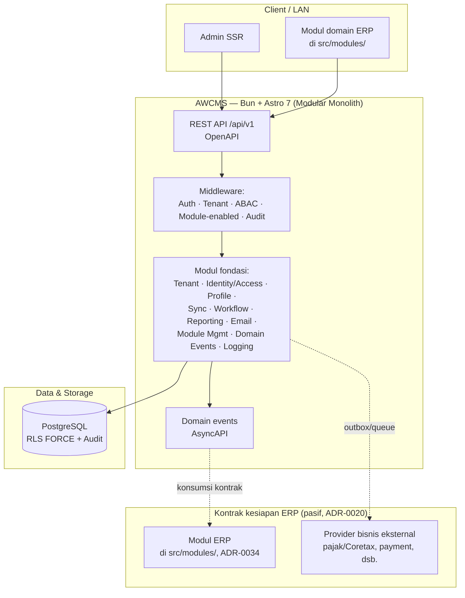
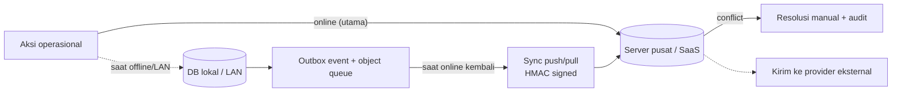
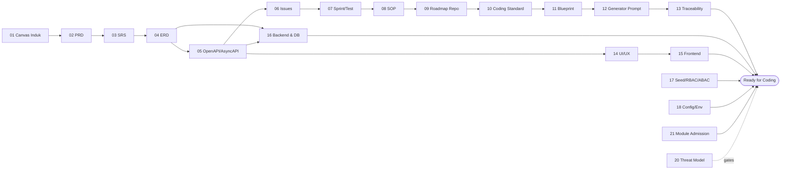

🇮🇩 Bahasa Indonesia · 🇬🇧 [English (source)](README.md)

<!-- i18n-source-hash: sha256:8cf68e9e6ac9f9074a740fc0e580197fba5541da534043a45ef9878be3d78caf -->

   

# AWCMS — Template ERP & Solusi Bisnis Online-First (Superset Keluarga AWCMS)

> **AWCMS adalah template lini ERP/back-office keluarga AWCMS — dipakai LANGSUNG**, dikembangkan dari basis teknis [awcms-mini](https://github.com/ahliweb/awcms-mini). Mode operasinya **hybrid online + offline dengan prioritas online-first** (online adalah jalur utama; offline/LAN adalah mode ketahanan), dan ia **siap ERP serta dibangun untuk SaaS terintegrasi**. Ia adalah template **superset** keluarga ([ADR-0035](docs/adr/0035-awcms-online-first-erp-saas-superset-repositioning.md), menyempurnakan [ADR-0034](docs/adr/0034-awcms-family-direct-use-templates-and-derived-pathway-removal.md)). **Keluarga hari ini dua repo:** repo ini, dan [`ahliweb/awcms-astro`](https://github.com/ahliweb/awcms-astro) yang memikul **halaman publik + permukaan admin USER** ([ADR-0070](docs/adr/0070-peran-keluarga-awcms-astro-memikul-publik-dan-admin-user.md)); `awcms-mini` dan `awcms-micro` **ARSIP, tidak dilanjutkan** ([ADR-0055](docs/adr/0055-development-confined-to-awcms-and-awcms-astro.md)). Base menyediakan **modul fondasi reusable + kontrak netral kesiapan ERP** ([ADR-0020](docs/adr/0020-erp-extension-readiness-contracts.md)); modul domain — ERP maupun website/konten — ditambahkan **langsung di `src/modules/`**, bukan repo turunan terpisah. Peta penyerapan awcms-micro (kini **catatan sejarah**, jalur port ditutup ADR-0055): [`docs/awcms/absorb-awcms-micro-roadmap.md`](docs/awcms/absorb-awcms-micro-roadmap.md). Lihat juga [`docs/awcms/erp-extension-contracts.md`](docs/awcms/erp-extension-contracts.md).

> **Status: fondasi aktif dikembangkan.** File kode legacy di repo ini sudah dihapus (lihat commit `chore(foundation): remove legacy repository files`) dan repo ini **dikembangkan ulang dari nol** di atas standar teknis modular monolith (Bun + Astro 7 + PostgreSQL/RLS). Dua puluh satu modul sudah live (daftar otoritatifnya adalah registry [`src/modules/index.ts`](src/modules/index.ts); lihat [`docs/ARCHITECTURE.md`](docs/ARCHITECTURE.md) untuk state kode saat ini) — sepuluh modul fondasi, sepuluh modul website/konten (`theming`, `media-library`, `blog-content`, `tenant-domain`, `visitor-analytics`, `data-lifecycle`, `seo-distribution`, `form-drafts`, `site-search`, `comments`), plus `idn-admin-regions` (master data wilayah administratif Indonesia, [ADR-0046](docs/adr/0046-idn-admin-regions-module-admission.md)) — sebagai **basis** pengembangan ERP, SaaS, dan website/e-commerce — bukan sekadar CMS/base generik, dan bukan pula sebuah ERP jadi.

## Daftar isi

- [Kenapa repo ini dibangun ulang](#kenapa-repo-ini-dibangun-ulang)
- [Arah pengembangan: basis teknologi awcms-mini, skop fondasi ERP](#arah-pengembangan-basis-teknologi-awcms-mini-skop-fondasi-erp)
- [Arsitektur tingkat tinggi](#arsitektur-tingkat-tinggi)
- [Prinsip hybrid online-first](#prinsip-hybrid-online-first)
- [Stack](#stack)
- [Prinsip utama](#prinsip-utama)
- [Paket dokumen](#paket-dokumen)
- [Untuk kontributor](#untuk-kontributor)
- [Status implementasi](#status-implementasi)
- [Keamanan](#keamanan)
- [Tata kelola & komunitas](#tata-kelola--komunitas)
- [Versioning](#versioning)
- [Lisensi](#lisensi)

## Kenapa repo ini dibangun ulang

Ringkasnya: repo lama berjalan di atas Node.js + Vite/React + Supabase, dan
seluruh komponennya dipindahkan bertahap ke runtime dan arsitektur baru
(ADR-013…023) sebelum berkas warisannya dihapus — bukan untuk memensiunkan repo
ini, melainkan untuk membersihkan lahan.

Rincian lengkapnya, termasuk daftar commit migrasi dan tabel perbandingan basis
teknologi sebelum/sesudah, ada di
[`docs/awcms/sejarah-repo.md`](docs/awcms/sejarah-repo.md). Ia dipindahkan ke
sana karena README seharusnya menjawab "ini apa, sekarang" — dan sejarah yang
menumpuk di depan pelan-pelan mengubur jawaban itu.

## Arah pengembangan: basis teknologi awcms-mini, skop fondasi ERP

Repo ini **mengadopsi stack dan standar teknis dari [awcms-mini](https://github.com/ahliweb/awcms-mini)** — _modular monolith standard_ AhliWeb — sebagai basis teknologi, lalu **dikembangkan** untuk skop ERP; klaster website/e-commerce awcms-micro **sudah diserap sejauh yang mendarat**, dan sisanya dibangun di sini lewat ADR admission-nya sendiri ([ADR-0055](docs/adr/0055-development-confined-to-awcms-and-awcms-astro.md) §1). **Keluarga yang dikembangkan hari ini adalah dua repo, dan hanya dua** ([ADR-0055](docs/adr/0055-development-confined-to-awcms-and-awcms-astro.md)): repo ini sebagai **system of record**, dan [`ahliweb/awcms-astro`](https://github.com/ahliweb/awcms-astro) sebagai **halaman publik + permukaan admin USER** ([ADR-0070](docs/adr/0070-peran-keluarga-awcms-astro-memikul-publik-dan-admin-user.md)) — pasangan yang menggantikan ketiga template lama sekaligus. `awcms-mini` dan `awcms-micro` **arsip**; posisi "tiga template sejajar" ([ADR-0034](docs/adr/0034-awcms-family-direct-use-templates-and-derived-pathway-removal.md)) sudah tidak berlaku, dan yang tersisa darinya adalah pencabutan jalur repo turunan; `awcms` adalah template lini ERP/back-office yang kini diposisikan **online-first hybrid, siap ERP + SaaS terintegrasi, dan superset keluarga** ([ADR-0035](docs/adr/0035-awcms-online-first-erp-saas-superset-repositioning.md)). Fokus repo ini adalah menyediakan **fondasi + kontrak kesiapan ERP + kapabilitas website/e-commerce lengkap** (sebagian berasal dari awcms-micro sebagai provenance; [`docs/awcms/absorb-awcms-micro-roadmap.md`](docs/awcms/absorb-awcms-micro-roadmap.md) dibaca sebagai daftar kebutuhan, bukan antrean port), dan modul domain ERP ditambahkan **langsung di `src/modules/`** saat template dipakai:

- **Modul fondasi reusable** — tenant, identity/access (RBAC/ABAC/RLS), central profile, sync/outbox, workflow, reporting, observability, dsb. — dipakai apa adanya oleh modul domain yang dibangun di atasnya.
- **Kontrak netral kesiapan ERP** — bentuk data pasif, capability port, dan skema payload event (business transaction, posting, period-lock, item/currency/UoM, inventory movement, reporting projection — [ADR-0020](docs/adr/0020-erp-extension-readiness-contracts.md)) yang **diimplementasikan/dikonsumsi oleh modul ERP yang ditambahkan langsung di `src/modules/`** (atau oleh template keluarga lain), bukan diisi logikanya oleh base itu sendiri.
- **Kerangka integrasi solusi bisnis** — pola outbox/queue offline-first-safe + provider adapter (mis. payment gateway, marketplace, pajak/Coretax, logistik) yang menjadi titik pasang bagi konektor domain yang dibangun di atas template ini.
- **Skala multi-tenant/multi-entitas** — RBAC/ABAC/RLS + batas tenant/legal-entity/organization-unit ([ADR-0013](docs/adr/0013-extension-layers-and-boundary-model.md)) yang dipakai ulang lintas modul domain.

Modul domain ERP sesungguhnya (finance/GL, inventory/warehouse, procurement, manufaktur, HR/payroll) dan vertikal bisnis (POS, portal sekolah, dsb.) **ditambahkan langsung di `src/modules/` template ini** saat dipakai ([ADR-0034](docs/adr/0034-awcms-family-direct-use-templates-and-derived-pathway-removal.md)) — bukan di repo turunan terpisah. (Panduan lama [`docs/awcms/derived-application-guide.md`](docs/awcms/derived-application-guide.md) kini **DEPRECATED**.)

Modul base reusable (Tenant, Identity, Profile, Access/RBAC-ABAC, Sync, Workflow, Reporting) dari awcms-mini dipakai apa adanya sebagai fondasi; modul domain ERP dan integrasi bisnis dikembangkan **langsung di atas fondasi tersebut, di `src/modules/` template ini** — bukan di repo turunan terpisah ([ADR-0034](docs/adr/0034-awcms-family-direct-use-templates-and-derived-pathway-removal.md), men-supersede ADR-0022).

## Arsitektur tingkat tinggi

Modul fondasi ini tidak mengimplementasikan logika ERP — ia hanya menyediakan kontrak netral (event, posting request/result, period-lock, dsb.) yang **dikonsumsi** oleh modul ERP yang ditambahkan langsung di `src/modules/`. Provider bisnis eksternal terhubung lewat **outbox/queue**, bukan jalur langsung transaksi, sehingga alur kritikal tetap berjalan saat koneksi eksternal bermasalah (ADR-0006).

## Prinsip hybrid online-first

Mode operasi `awcms` adalah **hybrid online + offline dengan prioritas online-first**: konektivitas online adalah jalur utama dan default deployment (multi-cabang tersinkron, portal publik, integrasi provider). Kapabilitas offline/LAN (outbox/sync HMAC, [ADR-0006](docs/adr/0006-offline-first-sync-outbox.md)) tetap ada dan didukung sebagai **mode ketahanan** saat koneksi terputus — bukan asumsi utama seperti pada `awcms-mini` yang offline-first. Alur data tetap idempotent & aman untuk direkonsiliasi saat kembali online:

## Stack

- Runtime: **Bun** ([ADR-0002](docs/adr/0002-bun-only-runtime.md) — Bun-only; Node.js hanya lewat pengecualian tertulis berizin maintainer)
- Web framework: **Astro 7** (SSR di atas Bun, `@astrojs/node` sebagai adapter)
- Database: **PostgreSQL** dengan **RLS FORCE** ([ADR-0003](docs/adr/0003-postgresql-rls-multi-tenant.md))
- Arsitektur: **Modular monolith, microservice-ready** ([ADR-0001](docs/adr/0001-rebuild-on-awcms-foundation-erp-scope.md))
- Mode operasi: **Hybrid online-first** — online jalur utama; offline/LAN mode ketahanan, sync outbox opsional ([ADR-0006](docs/adr/0006-offline-first-sync-outbox.md))
- Security baseline: **RBAC + ABAC default-deny + PostgreSQL RLS + Audit Log** ([ADR-0004](docs/adr/0004-rbac-abac-default-deny.md))
- Kontrak: **OpenAPI** + **AsyncAPI**, versi independen dari rilis paket ([ADR-0007](docs/adr/0007-openapi-asyncapi-contracts.md), [ADR-0008](docs/adr/0008-independent-contract-and-module-versioning.md))
- Model keluarga: **dua repo** — `awcms` (system of record, seluruh layar admin SISTEM) + `awcms-astro` (halaman publik + admin USER bila dinyatakan) ([ADR-0055](docs/adr/0055-development-confined-to-awcms-and-awcms-astro.md), [ADR-0070](docs/adr/0070-peran-keluarga-awcms-astro-memikul-publik-dan-admin-user.md)); **template dipakai-langsung, modul domain di `src/modules/`** ([ADR-0034](docs/adr/0034-awcms-family-direct-use-templates-and-derived-pathway-removal.md), men-supersede jalur turunan ADR-0013/0022); `awcms` = **online-first hybrid & superset** ([ADR-0035](docs/adr/0035-awcms-online-first-erp-saas-superset-repositioning.md)); boundary tenant/entitas & kriteria ekstraksi layanan tetap dari [ADR-0013](docs/adr/0013-extension-layers-and-boundary-model.md)

## Prinsip utama

1. Modul fondasi bersifat **reusable apa adanya** oleh setiap modul domain yang dibangun di atasnya — bukan ditulis ulang per pemakaian.
2. Kontrak kesiapan ERP bersifat **pasif dan netral** (bentuk data, capability port, skema event) — logika bisnis ERP sesungguhnya **tidak** hidup di base ini ([ADR-0020](docs/adr/0020-erp-extension-readiness-contracts.md)).
3. Multi-tenant wajib memakai `tenant_id`, **RLS FORCE**, tenant context, dan ABAC default-deny di setiap tabel/endpoint tenant-scoped.
4. Provider bisnis eksternal (pajak, payment, logistik, dsb.) tidak boleh menjadi dependency alur kritikal dan tidak boleh dipanggil di dalam DB transaction — selalu lewat outbox/queue.
5. Data sensitif (password, token sesi, identifier pribadi/bisnis) wajib di-hash/mask/redact — tidak pernah tersimpan/tercatat mentah.
6. Master/config yang bisa dihapus memakai **soft delete**; list default menyembunyikan `deleted_at`, restore harus berizin dan diaudit ([ADR-0005](docs/adr/0005-soft-delete-and-immutability.md)).
7. Dokumentasi, migration, kontrak API/event, test, dan skill agent mengikuti implementasi nyata — bukan sebaliknya.
8. Backend **Bun-only**; pengecualian Node.js hanya dengan izin maintainer + catatan docs.

## Paket dokumen

Paket dokumen master ada di [`docs/awcms/`](docs/awcms/README.md) — diadaptasi dari paket `docs/awcms-mini/` di repo [awcms-mini](https://github.com/ahliweb/awcms-mini), disesuaikan ke skop fondasi ERP yang lebih luas:

- **01–13** perencanaan → kontrak → eksekusi; **14–18** desain teknis; **19** glossary; **20** threat model & arsitektur keamanan; **21** tata kelola penerimaan modul (module admission governance).
- **Catatan penting:** banyak dokumen di paket ini memakai contoh domain ERP/retail sebagai **ilustrasi** — polanya reusable, entitas/endpoint/layarnya adalah contoh yang diganti/diperluas oleh modul domain di `src/modules/` sesuai kebutuhan domainnya. Lihat [`docs/awcms/README.md`](docs/awcms/README.md) untuk status penerjemahan dan catatan penting lainnya.
- **Keputusan arsitektural** dicatat di [`docs/adr/`](docs/adr/README.md) (`0000`–`0070` saat ini; `0000` adalah template).
- **State kode saat ini** (bukan rencana): [`docs/ARCHITECTURE.md`](docs/ARCHITECTURE.md).

## Untuk kontributor

1. Baca [`AGENTS.md`](AGENTS.md) — kontrak kerja teknis, aturan wajib, guardrail keamanan.
2. Baca [`CONTRIBUTING.md`](CONTRIBUTING.md) — alur kontribusi, setup, konvensi commit, Definition of Done.
3. Gunakan **skill proyek** di [`.claude/skills/`](.claude/skills/) agar standar diterapkan konsisten (satu skill per topik: migration, endpoint, ABAC guard, audit log, testing, dsb.).
4. Kerjakan **atomic** per issue; migration bila schema berubah, OpenAPI bila API berubah, AsyncAPI bila event berubah.
5. Validasi (`bun run check` — gate CI utama; rantai sub-check lengkap dan urutannya didokumentasikan di [`CONTRIBUTING.md`](CONTRIBUTING.md#validasi-sebelum-pr) dan `package.json`'s `check` script, jangan diduplikasi di sini agar tidak drift) sebelum PR. Untuk perubahan UI non-trivial, tambahkan/jalankan E2E browser sungguhan secara terpisah — `bun run test:e2e` (Playwright + Bun), butuh app+`DATABASE_URL` hidup.

## Status implementasi

Dua puluh satu modul sudah live di kode — daftar otoritatifnya adalah registry [`src/modules/index.ts`](src/modules/index.ts), detail per modul di [`docs/ARCHITECTURE.md`](docs/ARCHITECTURE.md), dan README masing-masing modul di `src/modules/*/README.md`. Fondasi: `logging` (audit trail), `tenant-admin`, `profile-identity`, `identity-access` (login, sesi, RBAC/ABAC, MFA/OIDC/SSO, business-scope, SoD, admin write CRUD — Issue #166/#171), `module-management` (enable/disable per tenant, ditegakkan di setiap request), `domain-event-runtime` (publisher event lintas modul), `sync-storage` (outbox/inbox HMAC-signed, conflict resolution, object queue R2), `workflow-approval`, `email` (dispatch + template), `reporting` (projection + export). Website/konten: `theming`, `media-library`, `blog-content` (menyerap `news-portal` — [ADR-0044](docs/adr/0044-merge-news-portal-into-blog-content.md)), `tenant-domain`, `visitor-analytics`, `data-lifecycle`, `seo-distribution`, `form-drafts`, `site-search`, `comments`. System: `idn-admin-regions` (master data wilayah administratif Indonesia ber-versi — [ADR-0046](docs/adr/0046-idn-admin-regions-module-admission.md)). Admin SSR shell (`/admin/*`) menyediakan layar read + write (create/edit/soft-delete/restore) untuk seluruh domain di atas. Kapabilitas website/e-commerce lain yang belum ada **dibangun di sini dengan ADR admission-nya sendiri**, bukan di-port dari repo arsip ([ADR-0055](docs/adr/0055-development-confined-to-awcms-and-awcms-astro.md)); [`docs/awcms/absorb-awcms-micro-roadmap.md`](docs/awcms/absorb-awcms-micro-roadmap.md) kini dibaca sebagai daftar kebutuhan, bukan antrean port.

Riwayat perubahan lengkap ada di [`CHANGELOG.md`](CHANGELOG.md); status issue/PR terkini di [GitHub Issues](https://github.com/ahliweb/awcms/issues) (kerja dilacak langsung sebagai issue GitHub, bukan backlog statis).

## Keamanan

- Kebijakan pelaporan kerentanan: [`SECURITY.md`](SECURITY.md) (gunakan private vulnerability reporting — **jangan** issue publik).
- Model ancaman & arsitektur keamanan: [`docs/awcms/20_threat_model_security_architecture.md`](docs/awcms/20_threat_model_security_architecture.md).
- Automasi: Dependabot, CodeQL, GitHub secret scanning + push protection, GitGuardian, CI hygiene (Bun-only + no-secret).

## Tata kelola & komunitas

| Dokumen                                    | Isi                                 |
| ------------------------------------------ | ----------------------------------- |
| [`CONTRIBUTING.md`](CONTRIBUTING.md)       | Cara berkontribusi                  |
| [`CODE_OF_CONDUCT.md`](CODE_OF_CONDUCT.md) | Standar perilaku komunitas          |
| [`GOVERNANCE.md`](GOVERNANCE.md)           | Peran, pengambilan keputusan, rilis |
| [`SUPPORT.md`](SUPPORT.md)                 | Kanal bantuan                       |
| [`SECURITY.md`](SECURITY.md)               | Kebijakan keamanan                  |
| [`docs/adr/`](docs/adr/README.md)          | Architecture Decision Records       |

## Versioning

**Semantic Versioning** + **[Changesets](.changeset/README.md)**; riwayat lengkap di [`CHANGELOG.md`](CHANGELOG.md). Setiap PR yang mengubah perilaku wajib menyertakan changeset (ditegakkan `bun run changesets:policy:check` di CI). Versi rilis saat ini `6.4.0`.

**Kebijakan penomoran versi (penting, baca sebelum membandingkan versi):**

- Versi rilis paket (`package.json`, README ini) memakai garis nomor major legacy yang disengaja — lompat langsung dari `0.2.0` ke `5.0.0` per keputusan maintainer, BUKAN hasil hitung SemVer otomatis, agar perbandingan versi lintas rebuild tidak pernah terlihat seperti downgrade dari tag legacy terakhir (`v4.6.0`). **`5.0.0` ke atas TIDAK backward-compatible dengan rilis legacy `v2.x`–`v4.x`** manapun — seluruh kode ditulis ulang dari nol di atas fondasi baru. Lihat [ADR-0024](docs/adr/0024-semver-numbering-continues-legacy-major-line.md).
- Versi **kontrak** (`info.version` OpenAPI/AsyncAPI) dan versi/status **module descriptor** (`src/modules/*/module.ts`) memakai kebijakan SemVer independen masing-masing, tidak mekanis terikat ke versi rilis paket. Lihat [ADR-0008](docs/adr/0008-independent-contract-and-module-versioning.md).

## Lisensi

Dilisensikan di bawah lisensi **MIT** — lihat [`LICENSE`](LICENSE). Audit standar pengembangan terakhir: [`docs/awcms/AUDIT_STANDAR_PENGEMBANGAN_2026-07-04.md`](docs/awcms/AUDIT_STANDAR_PENGEMBANGAN_2026-07-04.md).
