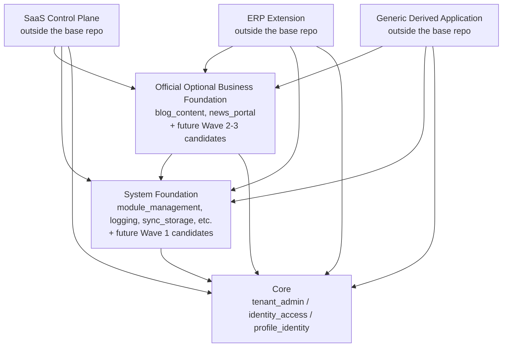

🇬🇧 English (source) · 🇮🇩 [Bahasa Indonesia](0013-extension-layers-and-boundary-model.id.md)

# ADR-0013 — Platform extension layers, tenant/business boundaries, and evidence-based criteria for service extraction

- **Status:** Accepted (the _Derived Application_ layer is superseded by [ADR-0034](0034-awcms-family-direct-use-templates-and-derived-pathway-removal.md); the tenant/entity boundary model & the evidence-based criteria for service extraction remain in force)
- **Date:** 2026-07-13
- **Decision maker:** @ahliweb
- **Related:** Issue #739 (epic #738 `platform-evolution`), Issue #680/#681/#696 (epic #679 `platform-hardening`), ADR-0001, ADR-0002, ADR-0003, ADR-0004, ADR-0005, ADR-0006, ADR-0011, ADR-0012, `docs/awcms/21_module_admission_governance.md`, `docs/awcms/derived-application-guide.md`, `docs/awcms/19_glossary_terminology.md`, `src/modules/module-management/domain/module-dependency-graph.ts`

## Context

AWCMS already has a trusted modular monolith (ADR-0001), a static registry (ADR-0012), whole-registry validation as a DAG (`validateModuleDependencyGraph`, Issue #680), capability port/adapter separation for cross-module collaboration (ADR-0011, Issue #681), and five module admission categories (Core/System/Official Optional Module/Derived Application/External Integration, `docs/awcms/21_module_admission_governance.md`, Issue #696). All of those mechanisms answer one question: **which new module may enter this base registry, and which category applies** — entirely inside a single repo.

Epic #738 raises the question one level above that, which has never been answered: how may **many independent derived repos** (a SaaS control plane, an ERP extension, and vertical derived applications such as POS/CRM/school portal) **compose** this base's capabilities without editing the base registry, without overwriting each other's data, and with a clear bar for when (if ever) a module deserves to be split out into its own service. The existing governance document (doc 21) explicitly names the "Derived Application" category as one big bucket "outside the base repo" — enough to admit a single module, but not enough to separate firmly: SaaS catalogue & billing services (which bill the **tenant** for using the platform) from the ERP item catalogue & general ledger (the tenant's **own internal** bookkeeping), or the tenant (a security/RLS isolation boundary) from legal entity/organization unit (business/accounting grouping inside one and the same tenant).

This issue is **docs-only, with no runtime behaviour change** — its purpose is purely to build the vocabulary and the binding dependency-direction rules before the other 16 issues in epic #738 are designed on top of them. Before writing this ADR, the following content was read and taken as ground truth (not assumed):

- `src/modules/_shared/module-contract.ts` — the `ModuleType` union today is only `"base" | "system" | "domain" | "integration" | "derived"`, **not changed** by this ADR.
- `src/modules/module-management/domain/module-dependency-graph.ts` — the registry-wide DAG validator (self-dependency, duplicate, missing dependency, cycle via Kahn's algorithm) that already runs as part of `bun run check` (`modules:dag:check`).
- `docs/awcms/21_module_admission_governance.md` — the five admission categories, the §3 decision tree, and the trusted static registry policy (§7); its §8 maps 14 modules to categories as things stood when Issue #696 was written — today's registry has already grown to **16 registered modules** (confirmed via `bun run modules:dag:check`), including two modules not yet reconciled into the §8 table (`idn_admin_regions`, `social_publishing`) — see §1 below.
- ADR-0011 — the capability port/adapter separation and the structural test `tests/unit/module-boundary.test.ts` that prevents direct cross-module imports.
- `docs/awcms/derived-application-guide.md` — the five illustrative derived applications that already exist (AWPOS, Satu Sehat Kobar, Sistem Manajemen Mutu Faskes, Smart School Portal, Sistem Pengaduan Publik) and the security checklist that is already mandatory for every derived domain module.

**An important reconciliation note.** The body of epic #738 includes an "Architecture placement" sketch that, informally, places `logging` and `module_management` under "Core". That **contradicts** the mapping already **Accepted** in ADR-0012/doc 21 §8 (Core today is only `tenant_admin`, `identity_access`, `profile_identity`; `logging` and `module_management` are **System**). The sketch in the issue body is contextual illustration from when the epic was proposed, not an ADR — this ADR explicitly **keeps** the binding ADR-0012/doc 21 mapping (no new admission decision reclassifies any module here; doc 21 §9 explicitly demands a separate proposal + ADR for that kind of category/structural change, consistent with the `docs/adr/README.md` rule that an already-Accepted ADR is never silently rewritten, only marked Superseded through a new ADR). See §1 below for the detail.

## Decision

### 1. Six target extension layers and how they relate to the ADR-0012 admission categories

We decide on six **extension layers** as architectural vocabulary on top of ADR-0012's five admission categories — not a replacement, but the naming used to reason about dependency direction **across repos/deployables**, something ADR-0012 deliberately does not cover (ADR-0012 is purely about admission **inside** this base registry).

| #   | Layer (this ADR)                          | = ADR-0012 §2 category                | Lives in this base repo? | Examples today                                                                                                                        | Future candidates (epic #738 Waves — **NOT designed/implemented by this ADR**)                                                          |
| --- | ----------------------------------------- | ------------------------------------- | ------------------------ | ------------------------------------------------------------------------------------------------------------------------------------- | --------------------------------------------------------------------------------------------------------------------------------------- |
| 1   | **Core**                                  | Core                                  | Yes, always active       | `tenant_admin`, `identity_access`, `profile_identity`                                                                                 | —                                                                                                                                       |
| 2   | **System Foundation**                     | System                                | Yes                      | `module_management`, `logging`, `sync_storage`, `email`, `form_drafts`, `tenant_domain`, `visitor_analytics`, `reporting`, `workflow` | `domain_event_runtime`, `data_lifecycle`, `integration_hub`, `extension_assembly` (epic #738 Wave 1 — each needs its own admission/ADR) |
| 3   | **Official Optional Business Foundation** | Official Optional Module              | Yes, opt-in per tenant   | `blog_content`, `news_portal`, `social_publishing`                                                                                    | `organization_structure`, `reference_data`, generic documents/managed-files, `case_management`, `data_exchange` (epic #738 Wave 2/3)    |
| 4   | **SaaS Control Plane**                    | (a new subset of) Derived Application | **Never**                | None yet — hypothetical, see §8                                                                                                       | Service catalogue, subscription billing, tenant entitlement                                                                             |
| 5   | **ERP Extension**                         | (a new subset of) Derived Application | **Never**                | None yet — hypothetical, see §8                                                                                                       | Item/product master, general ledger, AR/AP, inventory valuation, payroll, tax                                                           |
| 6   | **Derived Application (generic)**         | Derived Application                   | **Never**                | AWPOS (retail/POS), Smart School Portal, Satu Sehat Kobar, etc. (`derived-application-guide.md`)                                      | Any other business vertical                                                                                                             |

Layers 4 and 5 are a **new subdivision** of ADR-0012's "Derived Application" bucket — not an extra admission category (admission stays at ADR-0012's five categories; the doc 21 §3 decision tree does not change by a single node), but the naming the **data-ownership matrix** (§6) needs so that "SaaS service catalogue" and "ERP item catalogue" are never mixed into one table/schema. ADR-0012's "External Integration" category stays exactly as it is — it lives as a sub-component inside the System Foundation/Official Optional Business Foundation module that owns it (doc 21 §2), not as a layer of its own in the list of six above.

**Two modules newer than the doc 21 §8 mapping.** `social_publishing` (`type: "domain"` in its own `module.ts`) is already placed in the Official Optional Business Foundation row above — its mapping is unambiguous (doc 21 §2: `domain` → Official Optional Module). `idn_admin_regions` is **deliberately not** placed in any row: its own descriptor sets `type: "base"` (which literally maps to Core per doc 21 §2), but the comment in its own `module.ts` calls it "reusable reference/master data infrastructure every derived application can depend on" — conceptually far closer to the **`reference_data`** primitive candidate (Official Optional Business Foundation, a future candidate in the table above, see also Issue #750) than to the Core definition in doc 21 §4.1 ("the platform cannot boot/function without it" — clearly not true of a module still at `status: "experimental"` with no schema/API/UI). This ADR does **not** decide the final category of `idn_admin_regions` here — that is a reclassification needing its own admission decision (doc 21 §9) — but it records this conceptual overlap explicitly so that the implementer of `reference_data` (Issue #750) is not surprised to find `idn_admin_regions` already half-building the same primitive.

The dependency direction stays a **DAG**, consistent with `validateModuleDependencyGraph` (Issue #680) and the ADR-0012 §4.1/§4.2 required-dependency rule (System may depend on Core, never the reverse):

Arrows point **in the direction of the dependency** (A → B means "A depends on B"), identical to the `dependencies: string[]` convention in `module.ts`. There is no arrow from Core/System Foundation/Official Optional Business Foundation towards layers 4-6 — the base never knows anything at all about whichever SaaS Control Plane/ERP Extension/Derived Application runs on top of it (the same direction as doc 21 §4.1: "the dependency direction is always System/Optional → Core, never the reverse"). As long as every derived module lives in **one and the same monolith process** (today's pattern — a derived repo vendors/forks the base then registers its own domain modules in its own `src/modules/index.ts`, doc 21 §4.4), the graph above is literally the same `validateModuleDependencyGraph`, run over that combined registry. Once build-time assembly (a Wave 1 candidate, **not designed here**) or evidence-based service extraction (§7) actually exists, the same direction still holds but is enforced through versioned API/event contracts rather than a single compile-time registry.

### 2. Tenant vs legal entity vs organization unit

| Term                  | Definition                                                                                                                                                                                             | Which boundary                                                 | Implementation status                                                                                                                                                                                                                                                        |
| --------------------- | ------------------------------------------------------------------------------------------------------------------------------------------------------------------------------------------------------ | -------------------------------------------------------------- | ---------------------------------------------------------------------------------------------------------------------------------------------------------------------------------------------------------------------------------------------------------------------------- |
| **Tenant**            | The data isolation & platform subscription unit (`awcms_tenants`). One tenant = one RLS-isolated dataset.                                                                                              | **Security (RLS)** + subscription/billing (SaaS Control Plane) | Already exists (ADR-0003, migration 002).                                                                                                                                                                                                                                    |
| **Legal entity**      | A legal/business entity (e.g. one PT/CV) **inside** one tenant — a single tenant can have several legal entities (e.g. a business group whose several legal entities share one platform subscription). | Business/accounting (bookkeeping grouping)                     | **Does not exist yet** — the `organization_structure` primitive candidate (Official Optional Business Foundation, Wave 2, doc 21 §4.3).                                                                                                                                      |
| **Organization unit** | A business subdivision (department/branch/cost center) inside one legal entity (or directly inside the tenant when legal entity is not used) — for reporting/segregation-of-duties/workflow.           | Business/accounting/workflow                                   | **Does not exist yet** — the same primitive candidate, Wave 2. Different from `awcms_offices` (the physical location register that **does** already exist, doc 04) — an organization unit is an abstract business hierarchy, it may reference an office but need not be 1:1. |

**A rule that must never be loosened** (restating the epic #738 guardrail, not a new mechanism): the RLS predicate of a tenant-scoped table is **always and only** `tenant_id` (`docs/awcms/04_erd_data_dictionary.md` §RLS standard). When `legal_entity_id`/`organization_unit_id` are one day added as columns, both are ordinary foreign keys filtered at the **ABAC/application query** level, **never** a second RLS `USING (...)` predicate and never a replacement for `tenant_id`. Legal entity/organization unit cannot weaken tenant isolation — a user with access to legal entity A in tenant X never, through any mechanism in this layer, reads a row of tenant Y.

### 3. Service catalog/subscription billing (SaaS Control Plane) vs item/product catalog/general ledger (ERP Extension)

| Concept                                                                       | Owned by layer     | Answers the question                                                        | Must not be conflated with                                                     |
| ----------------------------------------------------------------------------- | ------------------ | --------------------------------------------------------------------------- | ------------------------------------------------------------------------------ |
| **Service catalog**                                                           | SaaS Control Plane | Which package/feature/tier the **platform operator** sells to a **tenant**. | The product/item catalogue a tenant sells to its own customers (ERP/vertical). |
| **Subscription billing** (subscription invoices, usage metering, entitlement) | SaaS Control Plane | How much this tenant is billed for using the platform.                      | The general ledger, AR/AP, or a tenant's operational books.                    |
| **Item/product master**                                                       | ERP Extension      | What the tenant **itself** sells/manages internally.                        | The SaaS Control Plane service catalog.                                        |
| **General ledger / AR / AP / inventory valuation / payroll / tax**            | ERP Extension      | The tenant's internal operational bookkeeping.                              | SaaS Control Plane subscription billing.                                       |

Both pairs above **must be kept explicitly separate** — a "subscription invoice" row (the SaaS Control Plane billing a tenant for using the platform) is never in the same table as a "sales invoice"/general ledger entry (the ERP Extension recording the tenant's own business transactions), even though both are "invoices" in everyday terms. If one day a tenant wants to record its own platform subscription cost as a line in its internal general ledger, that is **cross-owner collaboration** through event/API (§6), not a shared table.

### 4. Profile/party and business-role

- **Profile/party** — the canonical entity (person/organization) the platform knows about, **already owned by Core** (`profile_identity`, `awcms_profiles` + `awcms_profile_identifiers`/`_entity_links`). Any layer (the ERP Extension needs a vendor/customer master, the SaaS Control Plane needs a billing contact) **references the same profile** through `profile_entity_links`/a capability port — never builds its own duplicate person/organization registry. This is a direct application of the no-shared-table-write rule (§6): the only owner of the profile tables is `profile_identity`.
- **Business-role** — the functional capacity of a profile/party inside a legal entity/organization unit (e.g. "approver", "warehouse supervisor") for workflow/segregation-of-duties purposes — **different** from the RBAC **role** (`awcms_roles`, owned by `identity_access`, governing _system permissions_). Business-role is **not implemented yet** — an epic #738 Wave 2 candidate ("Business-scope assignments and segregation-of-duties hooks"), defined here purely as a conceptual boundary so that a later implementation does not overwrite/replace the existing meaning of the RBAC role.

### 5. Lifecycle dependency vs capability dependency — across repos

Doc 21 §5 already defines two independent graphs **inside a single repo**: lifecycle dependency (`ModuleDescriptor.dependencies`, always required, governing enable/disable ordering) and capability dependency (`ModuleDescriptor.capabilities.consumes`, ADR-0011, required/optional explicitly, a source-level relationship through port/adapter). We decide that the same definitions apply at the **coarse cross-repo/deployable grain**, without changing their meaning:

- **Cross-repo lifecycle dependency** = a derived application requires certain base modules to be **present and enabled** in the assembled combined binary. Today that means base modules vendored/forked into the derived repo's own `src/modules/index.ts` registry (the pattern already in use, doc 21 §4.4/`derived-application-guide.md`). The candidate deterministic replacement mechanism (**"deterministic build-time module assembly"**, epic #738 Wave 1) **does not exist and is not designed by this ADR** — this ADR only states that once that mechanism exists, it must still obey the §1 DAG direction and must never allow a derived application to edit the base registry directly (the non-negotiable epic #738 guardrail).
- **Cross-repo capability dependency** = a derived application calls a capability port/internal-public API exposed by a base module, with `optional`/required classified explicitly exactly as in ADR-0011 — the only difference being that the consumer adapter lives in the derived repo, not in another base module.

### 6. The data-ownership matrix and the "no shared-table write" rule

| Owner (layer/module)                                                                                                                                                        | Representative data owned                                                                                     | Integration mechanism allowed for OTHER owners to collaborate                                                                                                                                                                      |
| --------------------------------------------------------------------------------------------------------------------------------------------------------------------------- | ------------------------------------------------------------------------------------------------------------- | ---------------------------------------------------------------------------------------------------------------------------------------------------------------------------------------------------------------------------------- |
| **Core** (`tenant_admin`/`identity_access`/`profile_identity`)                                                                                                              | Tenants, offices, identities, sessions, roles/permissions, the canonical profile/party                        | Capability port, internal-public API contract (`/api/v1/...`), or versioned event — never a direct table read/write from another module.                                                                                           |
| **workflow** (System Foundation)                                                                                                                                            | Workflow definitions/instances/tasks/decisions                                                                | Capability port; events (`workflow.task.decided`, the existing AsyncAPI pattern).                                                                                                                                                  |
| **reporting** (System Foundation)                                                                                                                                           | Views/materialized views — **read-only projections**, not a source of truth                                   | Consume events/capability ports from the module that owns the data to build the projection; no other module writes to reporting tables.                                                                                            |
| **domain_event_runtime** (System Foundation, future candidate)                                                                                                              | Event envelope delivery status (outbox/inbox/dead-letter) — not business data                                 | The versioned event contract (AsyncAPI) is itself the mechanism.                                                                                                                                                                   |
| **data_lifecycle** (System Foundation, future candidate)                                                                                                                    | Retention/partition/archive/purge policies + their execution status                                           | Operates through the contract declared by the module that owns the data (per-table policy), never direct access to another module's schema without that contract.                                                                  |
| **integration_hub** (System Foundation, future candidate)                                                                                                                   | External system connection configuration, staging data-exchange envelopes                                     | Capability port/internal-public API; the final data stays owned by the business module that owns it, the integration hub only owns its staging envelope.                                                                           |
| **Official Optional Business Foundation** (`blog_content`, `news_portal`, candidates `organization_structure`/`reference_data`/documents/`case_management`/`data_exchange`) | Editorial content, organization structure/legal entity (candidate), reference codes, generic documents, cases | Capability port/API/event — a real example already running: `blog_content` ↔ `news_portal` (ADR-0011).                                                                                                                             |
| **SaaS Control Plane** (outside the base)                                                                                                                                   | Service catalog, subscription plans, subscription billing/invoices, tenant entitlement/usage metering         | Internal-public API contract or versioned event **only** (a deployable separate from the base) — reading Core identity/tenant through its own API/port, never a direct foreign key into the Core schema from another repo/process. |
| **ERP Extension** (outside the base)                                                                                                                                        | Item/product master, general ledger, AR/AP, inventory valuation, payroll, tax                                 | Same as above — never writes to SaaS Control Plane tables, or the reverse.                                                                                                                                                         |
| **Generic Derived Application** (outside the base)                                                                                                                          | Entirely domain-specific (POS transactions, health visit records, complaint dispositions, etc.)               | Same as above.                                                                                                                                                                                                                     |

**The "no shared-table write" rule is formalised explicitly**: only the `application`/`infrastructure` code of the module that OWNS a table may execute `INSERT`/`UPDATE`/`DELETE` against that table. Any other module/layer that needs to affect that data **must** go through a function exported by the owning module (within a single process — the pattern every base module already uses consistently today, enforced automatically for `blog_content`/`news_portal` by `tests/unit/module-boundary.test.ts`, ADR-0011) or through a capability port/API/event when the caller lives in a separate repo/process. **An honest limitation**: automated enforcement (a structural test) exists today only for the `blog_content`/`news_portal` pair inside this repo — there is no automated mechanism verifying this rule across repos (SaaS Control Plane/ERP Extension/Derived Application do not exist at all today); until there is one, cross-repo compliance rests on manual review + the admission checklist (doc 21 §9), recorded as a limitation, not claimed as machine-enforced.

### 7. Evidence-based criteria for service extraction (not a mandate)

The modular monolith (ADR-0001) remains the default deployable. A module is **only** worth proposing for extraction into a separate service when **all** of the following criteria have measured evidence, not opinion:

- A CPU/IO/concurrency profile that is **materially different** from the other modules in the same monolith (benchmark/observability evidence, not assumption).
- A security/process/network boundary genuinely **different** from the rest of the monolith.
- An independent deployment cadence **the business needs**, not a technical preference.
- A **clear** operational/on-call owner, different from the team that owns the monolith.
- Data ownership that is **genuinely separable** (already not violating the §6 no-shared-table-write rule) and a **stable** API/event contract.
- A real business-continuity need for failure isolation (one module failing must not bring the other down).

If the criteria above are met, extraction **still** requires the following prerequisites before cutover: a **backfill** of historical data, a **shadow read** (the new service is read in parallel without being the source of truth yet), an explicit **cutover** plan, a **rollback** plan, a **no-dual-write** guarantee (never two systems writing the same source of truth at the same time), and **observability evidence** (metrics/logs/traces) showing the new service is genuinely healthy before the old monolith is switched off for that domain.

**This is not a mandate.** Consistent with §Evidence-gated work not created yet in the body of epic #738: microservices, sharding, a tenant-safe distributed cache, and tenant placement/migration automation are **explicitly not built and not proposed by this ADR**. No module in this base registry meets the bar above today — this ADR only records the bar so that a future proposal (which needs its own separate ADR, with its own data-ownership/cutover/rollback/no-dual-write plan) has objective criteria to be rejected or accepted against, instead of being discussed from scratch every time it is raised.

### 8. Five example derived applications through the admission decision tree

Each example below is **illustrative**, following the `derived-application-guide.md` pattern — not a module added to this base. All five are run through the admission decision tree in `docs/awcms/21_module_admission_governance.md` §3 (Q5 → Q1 → Q2 → Q3 [→ Q4]), without duplicating the tree here:

| Example                                                                                                               | Q5 (runtime code exec?) | Q1 (required to boot?) | Q2 (reusable infrastructure?)                                                            | Q3 (generic for all derived apps?)                                                                 | §3 tree result             | Layer in this ADR                 | Data owned (not the base's)                                                                                                                                                         |
| --------------------------------------------------------------------------------------------------------------------- | ----------------------- | ---------------------- | ---------------------------------------------------------------------------------------- | -------------------------------------------------------------------------------------------------- | -------------------------- | --------------------------------- | ----------------------------------------------------------------------------------------------------------------------------------------------------------------------------------- |
| **AWPOS** (retail/POS — `derived-application-guide.md` example #1)                                                    | No                      | No                     | No                                                                                       | No (retail-specific)                                                                               | Not for the base → Derived | **Derived Application (generic)** | Products, POS transactions, stock, customers (`sales`, `inventory`, `tax-coretax`, `crm`)                                                                                           |
| **A standalone vertical CRM** (cross-channel customer engagement, outside AWPOS)                                      | No                      | No                     | No                                                                                       | No (specific to one vertical's sales/customer-relationship process)                                | Not for the base → Derived | **Derived Application (generic)** | CRM contacts, communication history, consent — reusing `profile_identity` (Core) for canonical identity and `email` (System Foundation) for delivery, not its own contact registry. |
| **An ERP extension** (general ledger + AR/AP + inventory valuation, separate from AWPOS's Coretax-ready VAT staging)  | No                      | No                     | No                                                                                       | No (specific to the tenant's bookkeeping)                                                          | Not for the base → Derived | **ERP Extension**                 | Item/product master, general ledger, AR/AP, inventory valuation — see §3 for the separation from the SaaS service catalog.                                                          |
| **A SaaS billing control-plane** (managing the service catalog & tenant subscription billing across many deployments) | No                      | No                     | No (not base infrastructure for every deployment — LAN-first must still work without it) | No (specific to the operator's SaaS business model, not something every derived application needs) | Not for the base → Derived | **SaaS Control Plane**            | Service catalog, subscription plans/invoices, tenant entitlement — see §3 for the separation from the ERP item catalog.                                                             |
| **Smart School Portal** (academics/attendance/grades — `derived-application-guide.md` example #4)                     | No                      | No                     | No                                                                                       | No (education-domain specific)                                                                     | Not for the base → Derived | **Derived Application (generic)** | Students, classes, timetables, grades (`academic`, `attendance`, `grading`, `parent-portal`)                                                                                        |

All five stop at the same node in the doc 21 §3 tree ("not for this base repo, direct it to a derived application") — the difference is purely **which layer** (§1) and **what data** (§6) they own once they are outside the base, which determines which integration rules apply when two derived repos (e.g. AWPOS + the same operator's SaaS billing control-plane) need to collaborate: always through API/event, never a shared table.

### 9. Non-negotiable guardrails (restated; nothing is loosened by this ADR)

- The modular monolith remains the default deployable — there is no microservices mandate (§7).
- No runtime plugin upload/marketplace/`eval`/foreign code execution (ADR-0012 §7, unchanged).
- A derived application must not edit the base registry directly once build-time assembly is available (§5) — that mechanism is itself future work, **not designed here**.
- The tenant remains the security boundary; legal entity/organization unit is never a substitute for tenant isolation (§2).
- Tenant-scoped tables keep `tenant_id` + `ENABLE`+`FORCE RLS` + a tenant-first index + ABAC default-deny + least-privilege DB roles — all of which is **already** running (ADR-0003/0004); this ADR only restates it, it adds no new mechanism.
- External provider calls stay optional, timeout-bounded, and outside the database transaction (AGENTS.md rule #11, unchanged by this ADR).
- The offline/LAN-first profile keeps working fully with online/provider capabilities switched off (unchanged).
- No shared-table write across module owners (§6).
- This ADR itself **adds no** Platform Masjid/Jualanku.info/POS/marketplace/finance-ledger/inventory-valuation/payroll/tax/other-vertical business logic to the base — all of it stays purely illustrative in §8 and in the derived documents that already exist.

## Consequences

- **Positive:** the other 16 issues in epic #738 (Waves 1-4) now have the same vocabulary and the same dependency direction to refer to, instead of every issue redefining "layer"/"boundary" for itself ad hoc.
- **Positive:** the explicit separation of service catalog/subscription billing (SaaS Control Plane) from item catalog/general ledger (ERP Extension) stops Wave 4 (the ERP extension + SaaS control-plane contracts) from repeating the mistake that once happened between `blog_content`/`news_portal` before ADR-0011 (an implicit cycle only visible through a static audit) — this time prevented at ADR level before the first line of code is written.
- **Positive:** the service-extraction bar (§7), explicitly "not a mandate", gives a ready-made answer whenever a microservice/sharding/distributed-cache proposal is raised before the evidence exists.
- **Negative/trade-off:** this ADR introduces new terms (legal entity, organization unit, business-role, service catalog, subscription billing, etc.) that have **no** implementation at all yet — there is a risk of the documentation "running ahead of" the code for a while until Wave 2/3 actually builds it; the mitigation is that every new table/term must go through the admission process (doc 21 §3/§9) and its own migration/ADR before it counts as real, exactly like every other base feature.
- **Negative/trade-off:** cross-repo "no-shared-table-write" enforcement (§6) is today purely documentation/manual review — there is no automated structural test like `tests/unit/module-boundary.test.ts` that can verify it across separate repos (it exists only for `blog_content`/`news_portal` inside the same repo). Recorded as a limitation, not claimed as machine-enforced.
- **Neutral:** no change to the `ModuleType` union, no module reclassified, no SQL migration, no new endpoint/event — purely an architecture document that becomes the mandatory reference for the next code issues in epic #738.

## Alternatives considered

- **Editing ADR-0012 directly instead of writing a new ADR** — rejected: ADR-0012 is already **Accepted** and deliberately limited to module admission inside a single repo (doc 21); the scope of the epic #738 question (many independent derived repos) is a different question that extends, rather than replaces, the ADR-0012 decision — two cross-referencing ADRs are more honest than rewriting a decision that has already been merged (the `docs/adr/README.md` rule: an ADR is not deleted/rewritten, only marked Superseded when it is genuinely replaced — this ADR does not supersede ADR-0012 at all).
- **Following the epic #738 body's "Architecture placement" sketch as-is** (placing `logging`/`module_management` in Core) — rejected: it directly contradicts the binding ADR-0012/doc 21 §8 mapping with no new admission decision; the epic sketch is treated as contextual illustration from when the epic was proposed, corrected in §1 of this ADR.
- **Designing/implementing the legal entity & organization unit tables now** — explicitly out of scope (issue #739 is docs-only; the epic #738 §Out of scope forbids any implementation in this issue) — defined as a conceptual boundary only, implementation waits for a separate Wave 2 admission/issue.
- **One flat "Derived Application" bucket with no separate SaaS Control Plane/ERP Extension** — rejected: the epic #738 acceptance criteria explicitly require the SaaS service catalog to be firmly separated from the ERP item/product master, and subscription billing to be firmly separated from the general ledger/AR-AP — a flat bucket cannot carry that distinction in the data-ownership matrix (§6).
- **Mandating microservice extraction for particular modules now** (e.g. the most I/O-heavy `sync_storage`/`reporting`) — explicitly rejected: it contradicts §Evidence-gated work not created yet in the body of epic #738; no module has measured evidence meeting the §7 criteria today.
