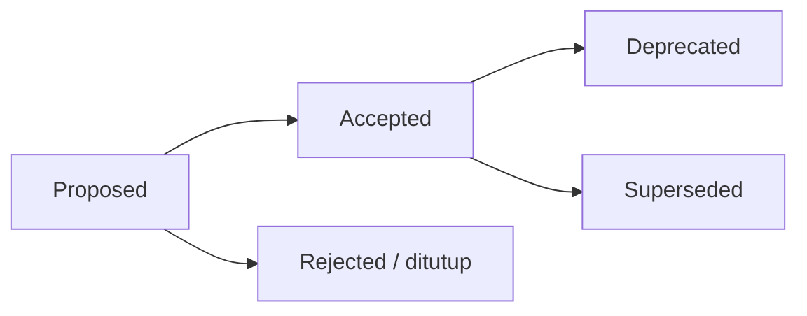

🇮🇩 Bahasa Indonesia · 🇬🇧 [English (source)](README.md)

<!-- i18n-source-hash: sha256:b2bd5eac8fecebda3a7889caa4a786c72d6ae406100e535ce11065c9bdf9416d -->

# Architecture Decision Records (ADR)

Folder ini menyimpan **catatan keputusan arsitektural** AWCMS — template lini ERP/back-office, kini **online-first hybrid & superset keluarga** (lihat [ADR-0034](0034-awcms-family-direct-use-templates-and-derived-pathway-removal.md) & [ADR-0035](0035-awcms-online-first-erp-saas-superset-repositioning.md)). Setiap keputusan penting (arsitektur, runtime, kontrak, keamanan, atau penyimpangan dari standar dasar) dicatat sebagai satu berkas ADR agar konteks dan alasannya awet.

## Keluarga hari ini: dua repo

Sejak [ADR-0055](0055-development-confined-to-awcms-and-awcms-astro.md) (2 Agustus 2026), pengembangan AWCMS berlangsung di **dua repositori, dan hanya dua**: repo ini sebagai **system of record** (seluruh permukaan otorisasi, API, dan layar admin **SISTEM**), dan [`ahliweb/awcms-astro`](https://github.com/ahliweb/awcms-astro) yang memikul **halaman publik sebagai fungsi utama** serta **permukaan admin USER bila sebuah situs menyatakannya** ([ADR-0070](0070-peran-keluarga-awcms-astro-memikul-publik-dan-admin-user.md)). Pasangan keduanya adalah **pengganti multiguna** dari ketiga template lama.

**`awcms-mini` dan `awcms-micro` adalah ARSIP** — tidak dilanjutkan, bukan standar, bukan sumber port ([ADR-0055](0055-development-confined-to-awcms-and-awcms-astro.md) §1, men-supersede [ADR-0047](0047-mini-micro-frozen-foundation-built-here.md)).

## Asal-usul: repo acuan awcms-mini (sejarah)

AWCMS **dahulu** dibangun ulang (lihat [ADR-0001](0001-rebuild-on-awcms-foundation-erp-scope.md)) di atas basis teknis modular monolith [`ahliweb/awcms-mini`](https://github.com/ahliweb/awcms-mini). Repo ini bersifat **standalone** — ia menanggung sendiri seluruh fondasi (tidak berbagi base terpisah), sehingga ADR fondasi (runtime, RLS, ABAC, offline-first, kontrak API/event, admission modul) **hidup lokal di folder ini** sebagai ADR-0002…0021, hasil adaptasi dari ADR acuan awcms-mini. ADR yang **spesifik untuk skop ERP & integrasi bisnis** ditambahkan di atas fondasi itu.

Kalimat di atas adalah **provenance**, dan itu benar selamanya. Yang sudah tidak berlaku adalah posisi "tiga template sejajar" yang sempat ditetapkan ADR-0034 — lihat §Keluarga hari ini.

> Catatan penomoran: ADR-0001 di repo ini adalah keputusan **rebuild**. Framing awalnya ("platform ERP", modul ERP di `src/modules/`) sempat **di-amend oleh [ADR-0022](0022-erp-modules-live-in-extension-repos.md)** (memindahkan modul ERP ke repo ekstensi terpisah), namun ADR-0022 kini **di-supersede oleh [ADR-0034](0034-awcms-family-direct-use-templates-and-derived-pathway-removal.md)**: modul domain — termasuk ERP — **boleh & seharusnya hidup langsung di `src/modules/`** template yang dipakai, bukan di repo turunan terpisah. (Posisi "tiga template dipakai-langsung" yang ADR-0034 tetapkan sudah tidak berlaku sejak ADR-0055 — lihat §Keluarga hari ini; yang tetap berlaku dari ADR-0034 adalah pencabutan jalur repo turunan.) Prinsip modular monolith yang mendasarinya diadopsi eksplisit oleh ADR-0001 dan dirinci oleh ADR fondasi 0002–0021 serta [`../ARCHITECTURE.md`](../ARCHITECTURE.md).

## Aturan

1. Satu keputusan = satu berkas `NNNN-judul-kebab.md` (nomor urut, nol di depan).
2. ADR **tidak dihapus**. Bila sebuah keputusan diganti, ADR lama ditandai `Status: Superseded by ADR-XXXX` dan ADR baru mereferensikannya.
3. Status yang valid: `Proposed`, `Accepted`, `Deprecated`, `Superseded`. `Accepted` boleh membawa kualifikasi `Accepted (belum diimplementasikan)` selama artefak yang dijanjikan ADR-nya (modul di `src/modules/` atau berkas kontrak `_shared`) belum ada di repo ini — `tests/adr-implementation-status.test.ts` menegakkannya dua arah: kualifikasi wajib ada selama artefaknya tidak ada, dan wajib dicabut (kembali `Accepted` polos) pada PR yang mendaratkan artefaknya.
4. Perubahan standar yang mengikat (lihat [`GOVERNANCE.md`](../../GOVERNANCE.md)) wajib punya ADR.
5. Gunakan template di [`0000-template.md`](0000-template.md).

## Alur

## Indeks

| ADR                                                                           | Judul                                                                                                                                                                                                                                                                                                                                                                                                                                                                                                                                                                                                                                                                                                                                                                                                                                                                                                                                                                                                                                                                                                                                   | Status                                                                                                              |
| ----------------------------------------------------------------------------- | --------------------------------------------------------------------------------------------------------------------------------------------------------------------------------------------------------------------------------------------------------------------------------------------------------------------------------------------------------------------------------------------------------------------------------------------------------------------------------------------------------------------------------------------------------------------------------------------------------------------------------------------------------------------------------------------------------------------------------------------------------------------------------------------------------------------------------------------------------------------------------------------------------------------------------------------------------------------------------------------------------------------------------------------------------------------------------------------------------------------------------------- | ------------------------------------------------------------------------------------------------------------------- |
| [0001](0001-rebuild-on-awcms-foundation-erp-scope.md)                         | Rebuild AWCMS sebagai platform ERP di atas standar modular monolith                                                                                                                                                                                                                                                                                                                                                                                                                                                                                                                                                                                                                                                                                                                                                                                                                                                                                                                                                                                                                                                                     | Accepted                                                                                                            |
| [0002](0002-bun-only-runtime.md)                                              | Runtime & tooling Bun-only                                                                                                                                                                                                                                                                                                                                                                                                                                                                                                                                                                                                                                                                                                                                                                                                                                                                                                                                                                                                                                                                                                              | Accepted                                                                                                            |
| [0003](0003-postgresql-rls-multi-tenant.md)                                   | PostgreSQL + RLS untuk isolasi multi-tenant                                                                                                                                                                                                                                                                                                                                                                                                                                                                                                                                                                                                                                                                                                                                                                                                                                                                                                                                                                                                                                                                                             | Accepted                                                                                                            |
| [0004](0004-rbac-abac-default-deny.md)                                        | RBAC + ABAC default-deny sebagai baseline akses                                                                                                                                                                                                                                                                                                                                                                                                                                                                                                                                                                                                                                                                                                                                                                                                                                                                                                                                                                                                                                                                                         | Accepted                                                                                                            |
| [0005](0005-soft-delete-and-immutability.md)                                  | Soft delete untuk master/config, immutability untuk data posted                                                                                                                                                                                                                                                                                                                                                                                                                                                                                                                                                                                                                                                                                                                                                                                                                                                                                                                                                                                                                                                                         | Accepted                                                                                                            |
| [0006](0006-offline-first-sync-outbox.md)                                     | Offline-first + transactional outbox + sync HMAC                                                                                                                                                                                                                                                                                                                                                                                                                                                                                                                                                                                                                                                                                                                                                                                                                                                                                                                                                                                                                                                                                        | Accepted                                                                                                            |
| [0007](0007-openapi-asyncapi-contracts.md)                                    | OpenAPI & AsyncAPI sebagai kontrak wajib                                                                                                                                                                                                                                                                                                                                                                                                                                                                                                                                                                                                                                                                                                                                                                                                                                                                                                                                                                                                                                                                                                | Accepted                                                                                                            |
| [0008](0008-independent-contract-and-module-versioning.md)                    | Versioning independen: package, kontrak API/event, module descriptor                                                                                                                                                                                                                                                                                                                                                                                                                                                                                                                                                                                                                                                                                                                                                                                                                                                                                                                                                                                                                                                                    | Accepted                                                                                                            |
| [0009](0009-public-tenant-scoped-routes.md)                                   | Resolusi tenant untuk rute publik (tanpa sesi)                                                                                                                                                                                                                                                                                                                                                                                                                                                                                                                                                                                                                                                                                                                                                                                                                                                                                                                                                                                                                                                                                          | Accepted                                                                                                            |
| [0010](0010-public-host-tenant-routing.md)                                    | Host/domain-based public tenant routing                                                                                                                                                                                                                                                                                                                                                                                                                                                                                                                                                                                                                                                                                                                                                                                                                                                                                                                                                                                                                                                                                                 | Accepted                                                                                                            |
| [0011](0011-capability-ports-for-cross-module-collaboration.md)               | Capability ports untuk kolaborasi lintas-modul                                                                                                                                                                                                                                                                                                                                                                                                                                                                                                                                                                                                                                                                                                                                                                                                                                                                                                                                                                                                                                                                                          | Accepted                                                                                                            |
| [0012](0012-module-admission-and-trusted-registry-boundary.md)                | Module admission categories & trusted static registry boundary                                                                                                                                                                                                                                                                                                                                                                                                                                                                                                                                                                                                                                                                                                                                                                                                                                                                                                                                                                                                                                                                          | Accepted                                                                                                            |
| [0013](0013-extension-layers-and-boundary-model.md)                           | Lapisan ekstensi platform, batas tenant/bisnis, kriteria ekstraksi layanan                                                                                                                                                                                                                                                                                                                                                                                                                                                                                                                                                                                                                                                                                                                                                                                                                                                                                                                                                                                                                                                              | Accepted (jalur turunan → [0034](0034-awcms-family-direct-use-templates-and-derived-pathway-removal.md))            |
| [0014](0014-deterministic-build-time-module-composition.md)                   | Komposisi modul deterministik build-time (registry base + aplikasi turunan)                                                                                                                                                                                                                                                                                                                                                                                                                                                                                                                                                                                                                                                                                                                                                                                                                                                                                                                                                                                                                                                             | Accepted (jalur turunan → [0034](0034-awcms-family-direct-use-templates-and-derived-pathway-removal.md))            |
| [0015](0015-derived-application-compatibility-manifest.md)                    | Derived-application compatibility manifest, test kit, semantic-version gates                                                                                                                                                                                                                                                                                                                                                                                                                                                                                                                                                                                                                                                                                                                                                                                                                                                                                                                                                                                                                                                            | Superseded → [0034](0034-awcms-family-direct-use-templates-and-derived-pathway-removal.md)                          |
| [0016](0016-organization-structure-module-admission.md)                       | Admission `organization_structure` (Official Optional Business Foundation)                                                                                                                                                                                                                                                                                                                                                                                                                                                                                                                                                                                                                                                                                                                                                                                                                                                                                                                                                                                                                                                              | Accepted (belum diimplementasikan)                                                                                  |
| [0017](0017-document-infrastructure-module-admission.md)                      | Admission `document_infrastructure` (Official Optional Business Foundation)                                                                                                                                                                                                                                                                                                                                                                                                                                                                                                                                                                                                                                                                                                                                                                                                                                                                                                                                                                                                                                                             | Accepted (belum diimplementasikan)                                                                                  |
| [0018](0018-data-exchange-module-admission.md)                                | Admission `data_exchange` (Official Optional Business Foundation)                                                                                                                                                                                                                                                                                                                                                                                                                                                                                                                                                                                                                                                                                                                                                                                                                                                                                                                                                                                                                                                                       | Accepted (belum diimplementasikan)                                                                                  |
| [0019](0019-integration-hub-module-admission.md)                              | Admission `integration_hub` (System Foundation)                                                                                                                                                                                                                                                                                                                                                                                                                                                                                                                                                                                                                                                                                                                                                                                                                                                                                                                                                                                                                                                                                         | Accepted (belum diimplementasikan)                                                                                  |
| [0020](0020-erp-extension-readiness-contracts.md)                             | Kontrak kesiapan ekstensi ERP (business transaction, posting, period-lock, item, projection)                                                                                                                                                                                                                                                                                                                                                                                                                                                                                                                                                                                                                                                                                                                                                                                                                                                                                                                                                                                                                                            | Accepted (belum diimplementasikan)                                                                                  |
| [0021](0021-reference-data-module-admission.md)                               | Admission `reference_data` (Official Optional Business Foundation)                                                                                                                                                                                                                                                                                                                                                                                                                                                                                                                                                                                                                                                                                                                                                                                                                                                                                                                                                                                                                                                                      | Accepted (belum diimplementasikan)                                                                                  |
| [0022](0022-erp-modules-live-in-extension-repos.md)                           | Modul domain ERP hidup di repo ekstensi, bukan di base (amandemen ADR-0001 poin 3)                                                                                                                                                                                                                                                                                                                                                                                                                                                                                                                                                                                                                                                                                                                                                                                                                                                                                                                                                                                                                                                      | Superseded → [0034](0034-awcms-family-direct-use-templates-and-derived-pathway-removal.md)                          |
| [0023](0023-bilingual-docs-indonesian-source-english-default.md)              | Dokumentasi dwibahasa: sumber Indonesia, Inggris default, digerbang staleness                                                                                                                                                                                                                                                                                                                                                                                                                                                                                                                                                                                                                                                                                                                                                                                                                                                                                                                                                                                                                                                           | Accepted                                                                                                            |
| [0024](0024-semver-numbering-continues-legacy-major-line.md)                  | Penomoran SemVer melanjutkan lini major legacy (lompat ke 5.0.0), bukan reset ke 1.0.0                                                                                                                                                                                                                                                                                                                                                                                                                                                                                                                                                                                                                                                                                                                                                                                                                                                                                                                                                                                                                                                  | Accepted                                                                                                            |
| [0025](0025-implement-deterministic-build-time-module-composition.md)         | Implementasi nyata komposisi modul deterministik build-time di awcms (adendum ADR-0014)                                                                                                                                                                                                                                                                                                                                                                                                                                                                                                                                                                                                                                                                                                                                                                                                                                                                                                                                                                                                                                                 | Accepted (jalur turunan → [0034](0034-awcms-family-direct-use-templates-and-derived-pathway-removal.md))            |
| [0026](0026-modular-openapi-ownership-and-composition.md)                     | Kontrak OpenAPI modular: kepemilikan per modul, bundle deterministik, kontribusi fragment turunan                                                                                                                                                                                                                                                                                                                                                                                                                                                                                                                                                                                                                                                                                                                                                                                                                                                                                                                                                                                                                                       | Accepted                                                                                                            |
| [0027](0027-mfa-totp-session-assurance-step-up.md)                            | MFA TOTP, recovery codes, session assurance (aal1/aal2), dan step-up                                                                                                                                                                                                                                                                                                                                                                                                                                                                                                                                                                                                                                                                                                                                                                                                                                                                                                                                                                                                                                                                    | Accepted                                                                                                            |
| [0028](0028-oidc-sso-tenant-aware-account-linking-break-glass.md)             | OIDC/SSO tenant-aware, account linking fail-closed, SSRF guard, dan break-glass                                                                                                                                                                                                                                                                                                                                                                                                                                                                                                                                                                                                                                                                                                                                                                                                                                                                                                                                                                                                                                                         | Accepted                                                                                                            |
| [0029](0029-deployment-profile-aware-turnstile-bot-protection.md)             | Cloudflare Turnstile bot protection sadar profil deployment (LAN/offline exempt)                                                                                                                                                                                                                                                                                                                                                                                                                                                                                                                                                                                                                                                                                                                                                                                                                                                                                                                                                                                                                                                        | Accepted                                                                                                            |
| [0030](0030-business-scope-hierarchy-generic-authorization-layer.md)          | Lapisan authorization generik business-scope hierarchy (multi-entity/unit)                                                                                                                                                                                                                                                                                                                                                                                                                                                                                                                                                                                                                                                                                                                                                                                                                                                                                                                                                                                                                                                              | Accepted                                                                                                            |
| [0031](0031-segregation-of-duties-conflict-enforcement.md)                    | Segregation of duties (SoD) generik, exception/override, conflict enforcement                                                                                                                                                                                                                                                                                                                                                                                                                                                                                                                                                                                                                                                                                                                                                                                                                                                                                                                                                                                                                                                           | Accepted                                                                                                            |
| [0032](0032-family-compatibility-manifest-and-ci-conformance.md)              | Compatibility manifest keluarga + CI conformance terhadap standar AWCMS-Mini. **Porosnya dicabut [ADR-0055](0055-development-confined-to-awcms-and-awcms-astro.md)**: manifes kini self-anchored (`standard: awcms`) dan menyatakan kontrak antara `awcms` dan `awcms-astro`; mekanismenya — pemeriksaan versi kontrak + `intentionalDivergences` ber-`reviewDate` — tetap dan justru bagian yang paling terpakai.                                                                                                                                                                                                                                                                                                                                                                                                                                                                                                                                                                                                                                                                                                                      | Accepted                                                                                                            |
| [0033](0033-abac-dynamic-policy-evaluator.md)                                 | Evaluator ABAC dinamis: DSL kondisi terbatas, precedence deny-overrides, cache tenant-keyed                                                                                                                                                                                                                                                                                                                                                                                                                                                                                                                                                                                                                                                                                                                                                                                                                                                                                                                                                                                                                                             | Accepted                                                                                                            |
| [0034](0034-awcms-family-direct-use-templates-and-derived-pathway-removal.md) | Keluarga AWCMS = template dipakai-langsung; jalur aplikasi-turunan dihapus; tidak membuat repo derivatif                                                                                                                                                                                                                                                                                                                                                                                                                                                                                                                                                                                                                                                                                                                                                                                                                                                                                                                                                                                                                                | Accepted                                                                                                            |
| [0035](0035-awcms-online-first-erp-saas-superset-repositioning.md)            | `awcms` = template online-first hybrid, siap ERP + SaaS terintegrasi, superset keluarga (menyerap awcms-micro)                                                                                                                                                                                                                                                                                                                                                                                                                                                                                                                                                                                                                                                                                                                                                                                                                                                                                                                                                                                                                          | Accepted (menyempurnakan positioning [0034](0034-awcms-family-direct-use-templates-and-derived-pathway-removal.md)) |
| [0036](0036-media-library-module-admission-ownership-inversion.md)            | Admission `media_library` lewat inversi kepemilikan (ekstraksi registry media dari `news_portal`); pensiun `news_media`; migrasi 052-054                                                                                                                                                                                                                                                                                                                                                                                                                                                                                                                                                                                                                                                                                                                                                                                                                                                                                                                                                                                                | Accepted (mengadaptasi awcms-micro ADR-0026)                                                                        |
| [0037](0037-data-lifecycle-module-admission.md)                               | Admission `data_lifecycle` (governance retensi + legal-hold, System Foundation); re-wire kopling legal-hold `visitor_analytics`/`logging`; migrasi 055-056                                                                                                                                                                                                                                                                                                                                                                                                                                                                                                                                                                                                                                                                                                                                                                                                                                                                                                                                                                              | Accepted (mengadaptasi awcms-micro Issue #745)                                                                      |
| [0038](0038-seo-distribution-module-admission-discovery-scope.md)             | Admission scope discovery `seo_distribution` (renderer SEO terpusat + sitemap/robots/RSS/Atom/JSON + config tenant; seam capability `seo_facts`); tata-kelola redirect + telemetri 404 ditunda; migrasi 057-059                                                                                                                                                                                                                                                                                                                                                                                                                                                                                                                                                                                                                                                                                                                                                                                                                                                                                                                         | Accepted (mengadaptasi awcms-micro ADR-0028)                                                                        |
| [0039](0039-seo-distribution-redirect-governance.md)                          | Scope tata-kelola redirect `seo_distribution` (aturan redirect exact-path + capture perubahan URL + telemetri 404, satu edit `src/middleware.ts` fail-open); host-based-only, legacy-blog inert, locale=null; migrasi 060-061                                                                                                                                                                                                                                                                                                                                                                                                                                                                                                                                                                                                                                                                                                                                                                                                                                                                                                           | Accepted (mengadaptasi awcms-micro ADR-0028 §8/ADR-0010)                                                            |
| [0040](0040-site-search-module-admission.md)                                  | Admission `site_search` (Official Optional Module): indeks PostgreSQL FTS lintas-konten + query/suggest publik host-resolved + admin index/settings/diagnostics; seam descriptor `searchSources` (MODULE_CONTRACT_VERSION 2.2.0), template URL `:tenantCode`, tanpa typeahead inline; migrasi 064-065                                                                                                                                                                                                                                                                                                                                                                                                                                                                                                                                                                                                                                                                                                                                                                                                                                   | Accepted (mengadaptasi awcms-micro ADR-0031)                                                                        |
| [0041](0041-comments-module-admission.md)                                     | Admission `comments` (Official Optional Module): komentar moderation-first di atas resource TERBIT; seam descriptor `commentableResources` (MODULE_CONTRACT_VERSION 2.3.0), template URL `:tenantCode`, nol `AccessAction` baru, simpan-teks-polos/escape-saat-render, respons publik seragam anti-oracle; migrasi 066-067                                                                                                                                                                                                                                                                                                                                                                                                                                                                                                                                                                                                                                                                                                                                                                                                              | Accepted (mengadaptasi awcms-micro ADR-0032)                                                                        |
| [0042](0042-varnish-edge-cache-auto-activation.md)                            | Lapisan cache tepi Varnish OPSIONAL (default mati, no-op saat mati) dengan aktivasi otomatis berbasis tekanan origin: allow-list surface fail-closed terpisah dari sinyal beban (tekanan hanya mengubah BERAPA LAMA, tak pernah APA), VCL default-deny + penandaan eksplisit setiap respons, invalidasi surrogate-key ber-anchor lewat antrean tahan-lama pola outbox; migrasi 068                                                                                                                                                                                                                                                                                                                                                                                                                                                                                                                                                                                                                                                                                                                                                      | Accepted (native awcms, bukan port)                                                                                 |
| [0043](0043-lib-boundary-and-module-presentation-layer.md)                    | Batas `src/lib` = infrastruktur teknis tanpa nama domain; kode presentasi/pengiriman modul pindah ke `src/modules/<m>/presentation/`. `modules:dag:check` diperluas: namespace `src/lib/<x>/` yang bertabrakan nama dengan `moduleKey` (persis atau lewat alias domain) GAGAL; satu pengecualian tercatat (`logging`). `tests/module-boundary.test.ts` diperluas ke `src/pages` memakai `api.routes` (#256)                                                                                                                                                                                                                                                                                                                                                                                                                                                                                                                                                                                                                                                                                                                             | Accepted (native awcms; awcms-micro ADR-0038 memutuskan hal sama di sana)                                           |
| [0044](0044-merge-news-portal-into-blog-content.md)                           | Lebur `news_portal` ke `blog_content` (modul konten tunggal, TANPA kehilangan fitur): `news_portal` (11 berkas, 3 tabel, nol capability, konsumen wajib `public_content`) dipensiunkan; nama tabel `awcms_news_portal_*` DIPERTAHANKAN mengikuti preseden ADR-0036; dua sistem iklan disatukan ke tabel ber-FK media terverifikasi setelah diperlebar dengan penargetan post/page (residu ingest dilaporkan, tak pernah hilang senyap); `awcms_news_portal_tenant_state` (inert, tanpa writer) di-DROP; permission di-seed DAN di-backfill untuk tenant lama; path API tidak di-rename di perubahan yang sama. Halaman publik pindah ke repo `ahliweb/awcms-astro`                                                                                                                                                                                                                                                                                                                                                                                                                                                                      | Accepted (native awcms; pasangan repo `ahliweb/awcms-astro`)                                                        |
| [0045](0045-jualanku-porting-awcms-system-of-record-astro-bff.md)             | Porting Jualanku.info: `awcms` sebagai system of record + admin internal, `awcms-astro` sebagai experience layer + satu-satunya BFF; static-by-default dengan rute on-demand (bukan "hybrid"); satu tenant penyelenggara dengan **merchant sebagai business scope** (mengisi resolver hierarki yang base-nya fail-closed) ditambah predikat kepemilikan di setiap query — bukan mengandalkan RLS tenant maupun atribut ABAC baru; lima bounded context `jualanku_*` (bukan tujuh); kontrak introspeksi sesi lintas-origin untuk portal; namespace public/portal/admin memanggil application service yang sama. Blueprint: [`../awcms/jualanku/`](../awcms/jualanku/README.md).                                                                                                                                                                                                                                                                                                                                                                                                                                                          | Accepted                                                                                                            |
| [0046](0046-idn-admin-regions-module-admission.md)                            | Admisi `idn_admin_regions` (Official Optional Module): master data wilayah administratif Indonesia (provinsi/kabupaten-kota/kecamatan/desa-kelurahan) sebagai reference data **GLOBAL ber-versi** — tanpa `tenant_id`/RLS karena barisnya identik untuk semua tenant, diganti registrasi wajib di `GLOBAL_TABLE_FORBIDDEN_PRIVILEGES` (privilege per role eksplisit, nol DELETE) sementara otorisasi tetap per-tenant default-deny; dataset upstream `cahyadsn/wilayah` (MIT) DI-VENDOR ke repo agar impor deterministik & offline, dengan nomor Kepmendagri direkam **per berkas** dari header masing-masing; impor = JOB (dry-run default, menolak hierarki parsial), aktivasi/rollback = aksi admin ter-audit dengan aturan satu-dataset-aktif ditegakkan partial unique index                                                                                                                                                                                                                                                                                                                                                       | Accepted                                                                                                            |
| [0047](0047-mini-micro-frozen-foundation-built-here.md)                       | `awcms-mini` dan `awcms-micro` dibekukan sebagai **referensi** (31 Juli 2026): boleh dibaca dan di-port KELUAR, tetapi tidak menerima perubahan. **Jalur port-keluar itu kemudian DITUTUP juga oleh ADR-0055: keduanya kini ARSIP.** Jalur **mini-first** di `AGENTS.md` karena itu DITANGGUHKAN, bukan dihapus — fitur fondasi dirintis langsung di sini, sebab pembekuan DITAMBAH mini-first membuat pekerjaan fondasi tidak punya tempat mendarat sama sekali. Terverifikasi langsung, bukan disimpulkan: `awcms-astro` tidak bisa menarik kontennya sendiri (`X-Tenant-Code` tidak pernah dibaca — awcms membaca `x-awcms-tenant-id`) dan tidak ada kredensial mesin di repo mana pun di keluarga ini, sehingga build feed dan kontrak introspeksi sesi ADR-0045 sama-sama buntu. Seluruh penjagaan yang dibawa mini-first secara implisit kini eksplisit: review keamanan auth/access, ADR, `family:conformance:check`. Setiap fitur yang mendarat selama pembekuan adalah divergence sengaja yang dicatat di `awcms-family-compatibility.yaml` saat ia mendarat. `0046` adalah celah yang dicadangkan (pekerjaan sedang berjalan) | Superseded by ADR-0055                                                                                              |
| [0048](0048-frontend-role-split-awcms-astro-internal-admin.md)                | Pembagian peran frontend: `awcms-astro` = halaman admin **owner/internal**, `awcms` = frontend **publik + admin publik (tenant)**. Melengkapi ADR-0047 (yang memusatkan pengembangan di dua repo tapi tak menyatakan layar mana milik siapa) dan mengoreksi premis "situs statis tanpa permukaan terautentikasi" untuk `awcms-astro`. Izin TIDAK ikut pindah: layar internal tetap memanggil `/api/v1/*` repo ini lewat BFF (ADR-0045) dan tetap melewati sesi + konteks tenant + ABAC default-deny; cache tepi tak pernah dibagi dengan permukaan admin. Mengikat layar BARU; pemilahan `/admin/*` yang sudah ada ditunda ke ADR tersendiri                                                                                                                                                                                                                                                                                                                                                                                                                                                                                            | Superseded by ADR-0051                                                                                              |
| [0049](0049-machine-credentials-and-session-introspection.md)                 | Kredensial mesin baca-saja + introspeksi sesi lintas-origin: bearer KEDUA yang bukan sesi manusia, terikat ke satu service account, dengan token yang **membawa tenant-nya sendiri** (klien build cukup satu env var) dan hash ber-ruang-nama `mc-sha256:` sehingga chokepoint bisa memilih tabel dari hash saja — tanpa mengubah tanda tangan di 183 rute. Ia MENGAUTENTIKASI, tidak pernah MENGOTORISASI: izin efektif = IRISAN dengan izin service account (menyempitkan, tak pernah melebarkan), dan setiap permintaannya ditolak kecuali action `read`, diputus SEBELUM izin dilihat — token bocor tak bisa mengubah apa pun walau akunnya `owner`. Kedaluwarsa wajib (maks 365 hari), pencabutan berlaku di permintaan berikutnya, decision log mencatat kredensial MANA yang bertindak. Plus `GET /api/v1/auth/session` (klaim aman saja, satu bentuk 401 untuk semua kegagalan). Fitur fondasi pertama yang dirintis langsung di sini di bawah ADR-0047, dicatat sebagai divergence saat mendarat                                                                                                                               | Accepted                                                                                                            |
| [0050](0050-bff-session-handoff-code.md)                                      | BFF `awcms-astro` memperoleh sesi manusia lewat **kode handoff sekali-pakai**, bukan dengan mem-proksi password. `awcms` tetap satu-satunya tempat kredensial diterima: pengguna login DI `awcms` (password, MFA, OIDC, Turnstile — tak satu pun diimplementasi ulang), lalu dialihkan balik membawa `code` berumur ≤60 detik yang ditukar BFF **server-ke-server**. Token sesi tak pernah sampai ke browser; introspeksi ADR-0049 jadi sumber kebenaran per permintaan (deaktivasi mencabut sesi seketika sejak #319), logout memanggil `awcms` LEBIH DAHULU. Proksi password ditolak terutama karena login di sini bukan satu langkah — mem-proksinya berarti menyalin alur MFA/OIDC/Turnstile ke repo kedua. Menjadi OIDC provider ditolak untuk satu klien tepercaya; kredensial mesin ditolak karena baca-saja dan menghapus atribusi per-pengguna                                                                                                                                                                                                                                                                                 | Accepted                                                                                                            |
| [0051](0051-admin-screens-consolidated-in-awcms.md)                           | Seluruh layar admin — tenant maupun owner/internal/platform — dibangun di `awcms` di bawah satu shell `/admin/*`. **Men-supersede ADR-0048**, yang hanya mengikat layar baru (sehingga `/admin/*` lama tetap bercampur) dan yang memindahkan LAYAR aktivasi dataset ke repo lain sementara PERMISSION-nya tetap di-seed ke role `owner` tiap tenant — jadi tidak pernah menahan risiko lintas-tenant yang menjadi alasannya. Sebagai gantinya risiko itu dipindahkan ke gerbang yang menegakkan: aksi lintas-tenant wajib punya gerbang platform-scoped dan tidak boleh masuk katalog yang di-seed ke role tenant. Peran `awcms-astro` sebagai experience layer + BFF (ADR-0045) tidak berubah. **Kemudian DIPERSEMPIT [ADR-0070](0070-peran-keluarga-awcms-astro-memikul-publik-dan-admin-user.md)**: "seluruh layar admin" dibaca "seluruh layar admin **SISTEM**", dan permukaan admin **USER** boleh di `awcms-astro` bila situsnya menyatakannya (`owner` ditolak gerbang di sana). Ketiga gerbang penggantinya tidak dilonggarkan sedikit pun.                                                                                    | Accepted (dipersempit [0070](0070-peran-keluarga-awcms-astro-memikul-publik-dan-admin-user.md))                     |
| [0052](0052-idn-region-dataset-lifecycle-is-an-operator-job.md)               | Aktivasi/rollback dataset wilayah menjadi **job operator**; endpoint HTTP-nya dihapus dan `dataset.configure`/`.restore` dicabut dari katalog (`sql/084`). Keduanya mengganti data yang dilayani ke SEMUA tenant, tetapi permission-nya ter-seed ke katalog global yang diberikan penuh ke role `owner` tiap tenant — sehingga owner tenant biasa berwenang atas data tenant lain. Kandidat "gerbangi dengan kredensial mesin" DITOLAK: kredensial mesin baca-saja (ADR-0049), jadi melebarkannya justru membuat token build yang bocor bisa mengganti dataset global. Mengikuti preseden ADR-0046 §5 (import sudah job-only). Biaya yang diterima: baris audit hilang, karena `awcms_audit_events` tenant-scoped sedangkan aksinya global.                                                                                                                                                                                                                                                                                                                                                                                             | Accepted                                                                                                            |
| [0053](0053-platform-scoped-permissions.md)                                   | Permission ber-**scope** `tenant`/`platform` (`sql/085`): aksi yang efeknya melintasi batas tenant tidak lagi bisa masuk grant borongan yang diterima owner tiap tenant baru, dan chokepoint menolaknya kecuali tenant yang bertindak ADALAH tenant platform (di-resolve `PLATFORM_TENANT_ID` → rantai tenant default publik). Menutup KELAS cacatnya, bukan instansnya: `bootstrapPlatformTenant` masih `SELECT id FROM awcms_permissions`, yang melahirkan cacat ADR-0052 dan akan mengulanginya pada aksi lintas-tenant berikutnya. Pemicu gerbang dibaca dari deklarasi KODE, bukan kolom DB — kalau keduanya dari DB, satu UPDATE mencabut gerbang sekaligus filternya tanpa satu pun cek merah. Mengembalikan endpoint activate/rollback + layar `/admin/idn-regions`; job operatornya tetap. Mode ketenanan `single`/`multi` DITURUNKAN dari jumlah tenant aktif, tidak pernah di-toggle.                                                                                                                                                                                                                                        | Accepted                                                                                                            |
| [0054](0054-tenant-provisioning.md)                                           | Provisioning tenant: `POST`/`GET /api/v1/tenants` + layar `/admin/tenants`, keduanya PLATFORM-scoped (`sql/086`). Sampai ADR ini tenant kedua TIDAK BISA DIBUAT sama sekali — `setup/initialize` meng-klaim singleton `awcms_setup_state` — sehingga mode `multi` ADR-0053 tak terjangkau dan gerbang platformnya belum pernah bertemu tenant kedua yang nyata. `createTenantWithOwner` DIEKSTRAK dan dipakai bersama wizard setup: itu kontrol keamanan, bukan kerapian, karena rutin provisioning yang ditulis mandiri akan membawa salinan `INSERT` grant yang sepanjang umur repo ini tidak punya `WHERE scope = 'tenant'`. `read` ikut platform-scoped karena direktori mendaftar SETIAP tenant. Duplikat `tenant_code` butuh pre-check DAN savepoint (23505 membatalkan transaksi). Password owner tidak pernah masuk hash idempotency yang disimpan.                                                                                                                                                                                                                                                                             | Accepted                                                                                                            |
| [0055](0055-development-confined-to-awcms-and-awcms-astro.md)                 | Pengembangan AWCMS hanya di `ahliweb/awcms` (system of record) dan `ahliweb/awcms-astro` (experience layer + BFF). **Men-supersede ADR-0047**, yang membekukan mini/micro sebagai referensi yang MASIH boleh di-port keluar — posisi setengah itu membuat dokumen dan gerbang harus terus memelihara hubungan dengan repo yang tidak bergerak: manifest menyatakan `standard: awcms-mini`, dan sembilan divergence terjadwal di-review ulang dengan `reviewDate` yang memerahkan CI saat lewat. mini/micro kini ARSIP: kemampuan yang diinginkan DIBANGUN di sini dengan ADR admission sendiri, bukan di-port. Manifest tetap ter-gate tapi self-anchored (23 pemeriksaan versi kontrak vs konstanta nyata tetap utuh); `intentionalDivergences` dikosongkan, isinya jadi catatan sejarah di `family-compatibility.md`. Kewajiban ADR-0047 §4 (catat divergence saat mendarat) dicabut — ADR-nya sendiri yang jadi catatan; penjagaan §3 lain TETAP.                                                                                                                                                                                    | Accepted                                                                                                            |

| [0056](0056-media-library-admin-surface.md) | Permukaan admin `media_library` dipecah tiga, karena "layarnya hilang" ternyata salah untuk modul ini: **lima dari sebelas permission tidak digerbangi apa pun** (`media.attach`/`.detach`/`.delete`/`.restore`/`.purge` — tak ada route, tak ada fungsi, tak ada job), **lima fungsi aplikasi yang memanggilnya nol**, dan **tidak ada fungsi daftar** sama sekali (`GET /api/v1/media/objects` menuntut `?ids=`, ia resolver batch untuk build `awcms-astro`). `attach`/`detach` DICABUT — usang sejak inversi ADR-0036, keterikatan media kini FK milik konsumen; `delete`/`restore`/`purge` DIBERI permukaan, karena keduanya lubang nyata: hari ini objek salah-unggah hanya hilang bila job rekonsiliasi kebetulan mengategorikannya begitu. `purge` memurnikan registry, BUKAN byte R2 — job tetap satu-satunya penulis bucket. Daftar mendapat rute sendiri, bukan mode-ganda pada `?ids=`, karena itu mengubah 400 hari ini menjadi dump seluruh registry. Layar `/admin/media` menyusul SETELAH ketiganya mendarat. | Accepted |
| [0057](0057-blog-page-lifecycle.md) | Page `blog_content` mendapat siklus hidup. Audit `pages.*` sebelum menulis layarnya menemukan pola ADR-0056, lebih tajam: **empat dari delapan permission ter-seed tidak digerbangi apa pun** (`pages.publish`/`.archive`/`.restore`/`.purge`), dan tak seperti `media_library`, fungsi aplikasinya bukan sekadar tanpa pemanggil — ia **tidak ada**. Akibatnya fungsional, bukan kosmetik: `createBlogPage` menulis literal `'draft'`, `updateBlogPage` tak pernah menyentuh `status`, dan job penerbitan terjadwal hanya membaca `awcms_blog_posts`, jadi **tidak ada jalur kode yang bisa menerbitkan page** — itulah sebabnya cabang page pada pencarian publik, yang disaring `status = 'published'`, selalu mengembalikan nol baris di atas index yang dibuat persis untuk query itu. Keempat permission DIBERI permukaan alih-alih dicabut: mencabut `pages.publish` berarti memberkati cacat itu sebagai desain. Siklus hidupnya sengaja LEBIH SEMPIT dari post — tanpa `review`, tanpa `scheduled`, karena `sql/036` tak men-seed `pages.schedule` — dan `purge` MELAPORKAN alih-alih menolak: draf pertama membuatnya 409 selama ada ad placement menargetkan page itu, dan membaca `ad-placement-reference-validation.ts` membantahnya — modul itu sudah memutuskan target yang hilang belakangan "is not an error and never becomes one", query render tak pernah mencocokkan placement milik page yang tak dirender, dan soft delete hari ini punya efek yang sama persis. Responsnya justru membawa jumlah placement yang jadi inert, karena baris yang diam-diam mati adalah persis "menghilang tanpa catatan" yang ADR-0044 §4 tolak. **Nol migrasi**: kolom, CHECK, index, dan baris katalog semuanya sudah ada. Permukaan dulu, `/admin/blog/pages` menyusul — plus gate untuk KELASNYA: tiap permission terdeklarasi wajib punya call site `authorizeInTransaction` atau terdaftar sebagai pengecualian ber-alasan. | Accepted |
| [0058](0058-unenforced-permissions-disposition.md) | Empat permission terdeklarasi tanpa penegak diputuskan sekaligus: **dua diberi permukaan, dua dicabut**. Gerbang ADR-0057 §F yang menemukannya, dan skor pertamanya sendiri memuat **dua tuduhan palsu** — `visitor_analytics.settings.read`/`.update` tergerbangi penuh oleh `analytics/settings.ts`, tapi scanner membaca konstanta seluruh repo sebagai satu namespace datar dan `MODULE_KEY` terikat di lima berkas ke empat nilai, sehingga guard-nya tak terlihat; keduanya sempat ditulis sebagai KEPUTUSAN ber-alasan yang rutenya bantah baris demi baris (diperbaiki PR #359, resolusi file-first). Karena itu keempat sisanya diverifikasi ulang ke kode, dan ternyata **bukan satu kelas**: `profile_identity.profile_management.restore` dan `comments.moderation.delete` punya seluruh mesinnya kecuali permukaan — yang pertama meninggalkan `softDeleteParty` tanpa pasangan sehingga `restored_at`/`restored_by` (`sql/003`) tak pernah bisa terisi; yang kedua punya transisi `delete`→`deleted` yang legal dari keempat status non-terminal dan antrean admin yang bisa MEMFILTER `deleted`, tapi satu-satunya aktor yang bisa memproduksinya adalah PENULIS lewat `requestCommentDeletion`. Keduanya DIBERI permukaan, dan §B menyatakan terang bahwa `deleted` tetap terminal — moderator memperoleh satu aksi tak-terbalikkan, diterima karena keadaannya sudah tercapai lewat jalur penulis, tetap non-destruktif, dan tanpa itu tak ada jawaban in-band untuk konten yang harus ditarik permanen; `bulk-moderate` sengaja TIDAK ikut. Sebaliknya `blog_content.seo.configure` DICABUT sebagai sumbu otorisasi kedua untuk kolom yang `settings.configure` sudah kelola (`seoDefaultTitle`/`seoDefaultDescription`), dan `blog_content.posts.export` DICABUT karena nol mesin ekspor ada di mana pun — membangun fiturnya untuk membenarkan baris katalog adalah ekor menggerakkan anjing. Satu migrasi tunggal untuk kedua pencabutan (grant dulu, lalu katalog — FK), tanpa rollback. Urutannya mengikat: permukaan dulu, pencabutan terakhir, karena gerbangnya menandai pengecualian yang sudah punya penegak sebagai stale. Setelah keempatnya mendarat daftar pengecualian **kosong**. | Accepted |
| [0059](0059-host-resolved-public-content-routes.md) | Keluarga rute konten publik host-resolved mendarat di **`/news/**`**, empat rute (indeks, detail post, kategori, tag), dan permintaan backlog `/blog/{slug}` dijawab dengan penolakan beserta buktinya. Dua temuan menggerakkannya. Pertama, cacat yang tercatat — "setiap `<loc>` sitemap 404 untuk tenant host-resolved" — **salah**: `discovery-providers.ts` sudah men-scope adapter ke `/blog/{tenantCode}` sejak #223, diverifikasi dengan `git log -S`, dan default `/blog` yang dituduh itu nol pemanggil di `src/`. Kedua, gap yang sebenarnya: deployment host-resolved **tidak punya rute konten sama sekali**, jadi tenant berdomain sendiri menerbitkan URL yang membawa pengenal yang justru dihapus domain itu. `/blog/{slug}` tak bisa jadi bentuknya: diprobe langsung di repo ini, Astro memperingatkan rute itu "is defined in both" berkas dan **tetap sukses build**, satu diam-diam menaungi yang lain ("a hard error in following versions"), sedangkan menyelesaikannya di runtime membuat slug post bisa menaungi URL daftar tenant lain. Setting `publicBasePath` versi arsip juga tidak diadopsi — ia memindahkan tautan tanpa memindahkan rute, yakni pabrik URL 404 per-tenant. Gerbangnya (`withHostResolvedBlogTenant`) sebentuk dengan `site_search`/`comments`, ber-padding latensi; saklar baru `publicRouteMode` simetris dengan `legacyTenantRouteEnabled`; dan `seo_distribution` kini **memilih** base path dari keluarga yang benar-benar melayani, serta **tidak menyumbang provider sama sekali** bila tenant mematikan keduanya — sitemap kosong, bukan sitemap berisi 404, mutation-proven. Nol migrasi, nol permission, nol perubahan OpenAPI; `/news/**` sengaja belum jadi surface cache tepi (kunci per-host dulu). | Superseded by [0071](0071-kosakata-url-publik-dibelah-blog-di-sini-news-di-awcms-astro.md) |
| [0060](0060-business-scope-hierarchy-provided-by-tenant-admin.md) | `tenant_admin` menjadi penyedia `business_scope_hierarchy`, dan itu menutup sebuah endpoint yang **jalur suksesnya tak pernah bisa dicapai**. `POST /api/v1/identity/business-scope/assignments` ter-guard, ter-audit, ber-RLS, dievaluasi SoD — dan menolak SETIAP input di SETIAP deployment: composition root-nya menyuntikkan adapter NO-OP yang me-resolve semua scope ke `resolved: false`, sedangkan scope type cadangan `tenant` ditolak validator sebagai tak-bisa-di-assign (#180 F2). NO-OP itu benar saat ditulis — ia menunggu aplikasi TURUNAN menyuntikkan resolvernya — lalu ADR-0034 menghapus jalur turunan dan ADR-0055 mengunci pengembangan ke repo ini, sehingga penantiannya jadi penolakan permanen; `providedBy`-nya bahkan menamai `organization_structure`, modul yang ADR-0016 `Accepted` tanpa satu baris kode pun. Base sudah punya hierarki nyata yang sudah dikeraskan: `awcms_offices` dengan `parent_office_id`, FORCE RLS (`sql/017`), dan FK komposit anti-lintas-tenant (`sql/020`). Adapter barunya me-resolve scope type `office` saja; hanya baris HIDUP (bukan soft-deleted, bukan `inactive`, milik tenant sendiri) yang resolve, dan baris mati dilewati di mana pun dalam rantai sehingga tak ada cakupan yang dipinjam lewat resource yang dimatikan tenant-nya. **Setiap batas MENOLAK, tidak memotong** — siklus, kedalaman, jumlah — karena daftar terpotong tetap mengklaim `resolved: true`. Ditambah satu pengerasan di jalur baca: sentinel `tenant` hanya mencetak fakta mencakup-segalanya bila `scope_id` menamai tenant itu sendiri. Adapter NO-OP dihapus (nol pemanggil), nol migrasi, nol permission baru. | Accepted |
| [0061](0061-host-resolved-public-surfaces-are-edge-cacheable.md) | Permukaan publik host-resolved boleh di-cache di tepi, lewat rute yang **mempublikasikan tenant yang sudah mereka resolusi** — dan itu menutup sesuatu yang lebih besar dari "satu keluarga rute belum di-cache": **sumber tenant nomor satu ADR-0042 §8 tidak pernah punya penulis**. `locals.edgeCacheTenantId` dideklarasikan di `src/env.d.ts`, dibaca `src/middleware.ts`, dan didahulukan `resolveEdgeCacheTenantId` di atas segalanya — sementara nol rute pernah meng-assign-nya, sehingga cabang prioritas-pertama itu tak bisa dieksekusi sejak ADR-0042 mendarat. Akibatnya persis terbalik dari arah ADR-0059: cache tepi mempercepat `/blog/{tenantCode}/**` (bentuk warisan) dan **tidak menyentuh satu pun** permukaan yang me-resolve tenant dari request. §A menyambungkan keluarga `/news/**` (tiga entri registry mencerminkan TTL dan alasan pasangan `blog-*`-nya, dimiliki `blog_content` yang purge modulnya sudah terpasang); §B — enam rute discovery root, kandidat cache terbaik di repo ini — menyusul, karena `serveDiscovery` belum menerima `locals` dan `seo_distribution` belum punya call site purge yang akan dituntut `findOwnersWithoutPurges` begitu ia memiliki surface. Dua hal yang tidak terbaca dari kode dan karenanya jadi isi ADR ini. Pertama, prasyarat "VCL mem-hash `Host`" ternyata **dua** properti: `hash_data(req.http.host)` ADA, tetapi sub itu juga harus TIDAK `return (lookup)` — sub kustom yang `return` mengakhiri rantai sehingga `vcl_hash` milik `builtin.vcl` (yang mem-hash `req.url`) tak pernah jalan dan seluruh path pada satu host runtuh ke SATU entri; menambahkan baris itu terbaca seperti melengkapi subroutine. Kedua, **kapan** rute mempublikasikan tenant adalah pertanyaan disclosure, bukan gaya: 404 boleh di-cache, jadi publikasi sebelum cabang "post/term tidak ada" membuat 404 resource-hilang ber-`Surrogate-Control` sementara 404 host-tak-dikenal ber-`private, no-store` — menjawab "apakah hostname ini memetakan ke tenant hidup?" dari SATU permintaan, lewat kanal kedua atas pertanyaan yang `padUnresolvedHostRouteLatency` justru dibangun untuk menutup, dan salahnya berupa satu baris beberapa baris terlalu tinggi yang tetap meng-compile dan lolos setiap test fungsional. Aturan "publikasikan hanya pada jalur yang menyajikan" karena itu dijaga contract test atas teks sumber, mutation-proven. Fallback "tebak dari header `Host`" tetap DITOLAK (larangan ADR-0042 §8). Nol migrasi, nol permission, nol perubahan OpenAPI. | Accepted |
| [0062](0062-skills-are-gated-against-the-code-they-describe.md) | `.claude/skills/` masuk `bun run check` lewat `skills:check`, mencabut pengecualian lama yang ADR-0055 sudah hapus alasannya. Angka yang memaksanya: **sebelas ADR berurutan (0051–0061) mendarat tanpa SATU pun skill menyebutnya** — bukan sebagian, nol; **empat skill untuk modul HIDUP** menunjuk `src/lib/<modul>/…` untuk berkas yang sudah pindah ke `src/modules/<modul>/presentation/…`; beberapa mengumumkan layar admin "TIDAK di-port" berbulan-bulan setelah layarnya mendarat; dan enam masih mengajarkan alur mini-first dua hari setelah ADR-0055 mencabutnya. Kenapa ini lebih berbahaya dari dokumen basi: **skill DIIKUTI**, dan arah menuanya terbalik — "modul ini belum ada di repo ini" mulai BENAR, lalu modulnya dibangun, dan kalimatnya menua jadi kebohongan percaya diri yang menyuruh agen membangun ulang yang sudah ada atau mengambilnya dari arsip yang tidak bergerak. Gerbangnya tidak membaca maksud (prosa tak bisa digerbangi) dan bertumpu pada registry modul: (1) skill modul HIDUP wajib menunjuk path `src/…` yang ADA, **tanpa daftar pengecualian** karena skill untuk kode rilis tak punya alasan menyebut berkas yang tidak ada; (2) tiap `ADR-NNNN` yang dikutip wajib punya berkas; (3) skill untuk kode yang TIDAK ada wajib terdaftar di `ASPIRATIONAL_SKILLS` sebagai `target-spec`/`historical`/`cross-cutting` **beserta alasannya**. Daftarnya per-SKILL bukan per-PATH: daftar path tumbuh tiap kali spesifikasi target disunting lalu berhenti dibaca, daftar skill hanya berubah saat sebuah skill berubah SIFAT. Entri MATI ikut gagal — dan cara ia mati adalah yang benar-benar akan terjadi: modulnya DIBANGUN, aturan 1 mengambil alih, entrinya berhenti berarti apa pun sambil tetap terbaca sebagai keputusan (tiga entri sudah mati saat ditulis dan langsung dihapus). Sengaja TIDAK menuntut tiap ADR dirujuk suatu skill — itu akan menghasilkan rujukan seremonial demi menghijaukan CI, bentuk "upacara yang terlihat seperti cakupan" yang `edge-cache:surfaces:check` sudah tolak. `docs/awcms/` tetap di luar gerbang. Nol migrasi, nol permission, nol perubahan runtime. | Accepted |
| [0063](0063-ownership-grants-run-through-the-authorization-chokepoint.md) | Grant berbasis KEPEMILIKAN dialirkan LEWAT `authorizeInTransaction`, bukan menggantikannya. Tiga handler (`PATCH /blog/posts/{id}`, `POST /blog/posts/{id}/submit-review`, `PATCH /blog/pages/{id}`) memutuskan permission sendiri dari `fetchGrantedPermissionKeys` + aturan domain, sehingga **evaluator ABAC, gerbang platform-scope (ADR-0053), business-scope facts (ADR-0060) dan SoD (#181) dilewati** — akibat konkretnya, policy ABAC `deny` milik tenant dihormati di sebagian rute dan diabaikan di ketiganya, tanpa error/test/gerbang merah. Ketiganya BUKAN kelalaian: mereka menegakkan aturan produk #538 bahwa penulis boleh menyunting kontennya sendiri yang belum terbit MESKI tak memegang permission-nya — sumbu otorisasi yang katalog permission tak bisa ekspresikan — sedangkan chokepoint mengembalikan `denied` SEBELUM aturan domain dikonsultasi, jadi "panggil saja chokepoint" akan MENGHAPUS jalur penulis (regresi fungsional yang terlihat seperti pengetatan keamanan). Solusinya `ownershipGrant` yang **MELEBARKAN** himpunan permission yang dievaluasi, bukan memotong keputusan: tenant isolation, ABAC deny, business-scope dan SoD semuanya tetap bisa menolak; kredensial mesin dikecualikan (ADR-0049 §3 — token build yang diarahkan ke akun penulis tak boleh mewarisi kepemilikannya); decision log menandai `ownership_grant:<reason>` karena tanpa itu barisnya terbaca identik dengan allow RBAC. Gerbang `access:chokepoint:check` di-iris **per HANDLER**, dan itu keputusan yang menanggung beban: asesmen yang memicu ADR ini menyimpulkan pola yang salah justru karena membaca per-BERKAS — `blog/posts/[id].ts` memanggil chokepoint di `GET` dan `DELETE` sementara `PATCH` di berkas yang sama tidak, dan pembacaan per-berkas menggabungkannya jadi "patuh". Pengecualian berkunci `<berkas>#<METHOD>` supaya tak melebar ke handler tetangga; dua entri (`auth/login.ts#POST` pra-autentikasi, `access/evaluate.ts#POST` introspeksi diri yang justru MEMANGGIL `evaluateAccess`); entri MATI ikut gagal. Satu klaim di test ADR ini sendiri juga terbukti SALAH lewat mutasi — keamanannya BUKAN dari urutan ABAC-sebelum-RBAC (deny mengembalikan hasil di kedua urutan), melainkan dari TIDAK MEMOTONG, dan itu kini ditegakkan sebagai kontrak atas teks sumber guard karena implementasi salahnya satu baris dan lolos setiap test perilaku evaluator. Nol migrasi, nol permission, nol perubahan OpenAPI. | Accepted |
| [0064](0064-foreign-key-columns-must-be-index-reachable.md) | Kolom foreign key wajib TERJANGKAU index, dan ini gerbang PERFORMA pertama repo ini — asesmen 4 Agustus 2026 mengukur **nol dari 28 gerbang** menyentuh performa, sehingga FK tanpa index atau query N+1 mendarat dengan CI hijau penuh dan muncul berbulan-bulan kemudian sebagai "layar admin jadi lambat". Postgres meng-index sisi REFERENCED sebuah FK otomatis dan sisi REFERENCING **tidak sama sekali**, jadi kolom FK telanjang membayar dua kali: setiap `DELETE`/`UPDATE` induk sequential-scan tabel anak untuk menegakkan constraint, dan join induk→anak juga tak punya index. Diukur: **182 kolom FK, 14 tak terjangkau**, satu tabel (`awcms_blog_ads`) tanpa index apa pun di luar primary key. Aturan literalnya ("kolom FK wajib MEMIMPIN index", karena Postgres hanya bisa pakai PREFIX B-tree) melanggar **40 dari 182** — dan empat puluh migrasi pada hari sebuah gerbang mendarat bukan gerbang, melainkan daftar pengecualian yang menunggu ditulis, kelas kegagalan yang repo ini sudah catat tiga kali. Jadi aturannya SADAR-TENANT: terjangkau = memimpin index ATAU kolom kedua setelah `tenant_id`, karena setiap query ber-scope tenant membawa `tenant_id` (RLS `FORCE` menjaminnya) sehingga composite `(tenant_id, fk)` MEMANG index yang dipakai join itu. Residual dinyatakan terang: composite itu TIDAK membantu penegakan constraint saat baris INDUK dihapus (butuh lookup telanjang, akan scan) — diterima karena penghapusan induk administratif dan jarang sementara biaya tulis 26 index dibayar tiap insert selamanya. Relaksasinya berbatas dan diuji dua arah: kolom kedua setelah selain `tenant_id` TIDAK terjangkau, kolom KETIGA setelah `tenant_id` juga tidak — tanpa batas itu aturannya menerima composite apa pun dan menemukan nol. `sql/090` mengindeks ketiga belas sisanya (additif, `IF NOT EXISTS`, nol data dipindah). Satu pengecualian ber-alasan nyata: `awcms_setup_state.tenant_id`, singleton keras (`id boolean PRIMARY KEY` + `CHECK (id)`) yang berisi tepat satu baris. Entri pengecualian MATI ikut gagal. Nol permission, nol OpenAPI, nol perubahan runtime. | Accepted |
| [0065](0065-awcms-astro-consumer-contract-is-frozen.md) | Irisan API yang `ahliweb/awcms-astro` benar-benar panggil DIBEKUKAN dan digerbangi di repo ini (`bun run api:consumer-contract:check`). Snapshot beku yang ada adalah monolit PRA-migrasi #182 dan mengerjakan tugasnya dengan baik — tetapi **setiap permukaan yang repo sebelah panggil mendarat SESUDAHNYA** (`/auth/session` + `/access/machine-credentials` ADR-0049, `/media/objects` #318, `/media/public-origin` #370, traversal cursor `/blog/posts` #317); pencarian keempatnya di berkas snapshot mengembalikan NOL. Akibatnya mengubah bentuk respons salah satunya HIJAU di CI sini dan merusak build repo sebelah — kegagalan yang muncul di tempat orang yang menyebabkannya tidak melihat. Snapshot KEDUA, bukan memperluas yang pertama: keduanya menjawab pertanyaan berbeda, dan yang pra-migrasi harus tetap beku pada momennya sendiri agar terus menjawab pertanyaannya. **Closure `$ref` adalah intinya** — membekukan enam objek path saja nyaris tak berguna karena sebuah path hanya beberapa baris yang mem-`$ref` schema, dan kerusakan yang menarik terjadi di SCHEMA (field diganti nama, tipe dipersempit, nullable dicabut), jadi gerbang menelusuri setiap `$ref` terjangkau: 6 path + 16 komponen. Dibuktikan mutasi: mengganti nama `publicUrl` di dalam komponen `ResolvedMediaReference` memerahkan gerbang, menambah field opsional di komponen yang sama lolos. Aturannya subset ADITIF bukan kesetaraan; `CONSUMER_PATHS` diturunkan dengan mem-grep repo sebelah bukan dari ingatan; regenerasi adalah tindakan SENGAJA yang berarti konsumennya harus ikut berubah (dinyatakan di header fixture DAN di pesan kegagalan, karena pembacanya sedang di repo yang salah untuk menyadarinya sendiri); path konsumen yang hilang MELEMPAR alih-alih menyusutkan kontrak diam-diam. Yang TIDAK dijamin dinyatakan terang: ini kontrak SKEMA bukan perilaku — perubahan makna dengan bentuk sama tidak tertangkap. Nol migrasi, nol permission, nol perubahan runtime. | Accepted |
| [0066](0066-shared-rate-limiting-and-full-auth-surface-coverage.md) | Rate limit menjadi properti DEPLOYMENT, bukan properti satu proses. `rate-limit.ts` menghitung di `Map` dalam-proses (berkasnya sendiri mencatatnya), sehingga dengan **N** replika batas efektif jadi **N × batas terkonfigurasi** — anti-brute-force melemah persis sebanding jumlah replika, jadi deployment yang paling butuh perlindungan justru paling lemah. `checkSharedRateLimit` menghitung di Redis (yang SUDAH ada di repo) dengan **nomor window sebagai bagian dari KUNCI, bukan timestamp tersimpan** — itu yang membuatnya benar di tempat `Map` tidak: dua instans sepakat TANPA read-modify-write, jadi tak ada balapan untuk dimenangkan; `PEXPIRE` hanya pada hit pertama karena menyetel ulang tiap hit akan menggeser window dan membiarkan penyerang stabil menahan kunci hidup tanpa batas. Tanpa Redis ia jatuh ke `Map` — bukan kompromi, karena deployment satu-instans tak punya apa pun untuk dibagi. **GAGAL-TERBUKA saat Redis mati, dan itu kebalikan postur default repo ini**, jadi dinyatakan keras: rate limiter adalah perkakas KETERSEDIAAN di jalur autentikasi, dan gagal-tertutup mengubah gangguan Redis jadi "tidak ada yang bisa login" — penolakan layanan total atas control plane yang BISA DIPICU PENYERANG. Yang menjaganya jujur: ia bukan satu-satunya kontrol — lockout per-identitas ditegakkan di PostgreSQL secara atomik dan tak terpengaruh Redis, jadi limiter ini backstop ber-scope SUMBER (penangkap perotasi `loginIdentifier`), bukan garis terakhir; timeout 250 ms; `security:readiness` melaporkan Redis mati sehingga degradasi terlihat. Cakupan naik dari delapan ke **sebelas** permukaan — `session-handoff/issue`, `session-handoff/redeem`, dan `sso/{providerKey}/callback` sebelumnya tak punya limiter sama sekali (kelengkapan, bukan lubang: masing-masing punya mitigasi lain, tapi ASVS V11.2 menuntut anti-automation di SELURUH permukaan auth), dijaga test yang juga menegakkan tak ada rute memakai limiter per-instans langsung. Tetap fixed-window (bukan sliding/token-bucket): ia mengizinkan lonjakan 2× di perbatasan, diterima karena yang benar-benar mengikat brute-force adalah lockout per-identitas di DB. Mutation-proven dua arah: gagal-tertutup dan TTL-tiap-hit masing-masing memerahkan satu test. Nol migrasi, nol permission, nol OpenAPI. | Accepted |
| [0067](0067-core-web-vitals-collection.md) | **`Proposed` — bagian RUM menunggu keputusan pemilik produk; Opsi D (pengukuran LAB) diambil dan mendarat 2026-08-05.** Satu-satunya dari tujuh rekomendasi asesmen 4 Agustus 2026 yang TIDAK didaratkan seluruhnya, dengan sengaja: ia bukan memperbaiki cacat melainkan **menambah pengumpulan data tentang pengunjung nyata**, dan itu bertabrakan dengan postur yang modul tujuannya sudah nyatakan. Yang benar-benar hilang nyata: repo melayani HTML (`/news/**`, `/blog/{tenantCode}/**`, 31 layar admin) dan **LCP/INP/CLS tidak pernah diukur di mana pun**, sehingga seluruh investasi cache tepi (ADR-0042/0061, 11 surface) terbukti ke BEBAN ORIGIN dan tak pernah ke PENGALAMAN PENGGUNA — kita tahu query berkurang, kita tak tahu halamannya terasa lebih cepat. Tetapi `visitor_analytics` mendeklarasikan diri privacy-first bukan sebagai slogan: `purgeVisitorAnalyticsData` DELETE/UPDATE-to-null TANPA langkah arsip, dengan alasan tertulis bahwa detail pengunjung mentah sengaja tak disimpan lebih lama dari perlu — dan sampel Core Web Vitals adalah telemetri per-kunjungan, persis kelas data itu. Tiga opsi dengan trade-off sebenarnya: (A) tidak mengumpulkan — sah, dan lebih baik dicatat sebagai keputusan daripada dibiarkan jadi celah terbuka; (B) **agregat-saja** (direkomendasikan bila diambil) — server meng-agregasi di titik masuk ke bucket per-(tenant, rute-ter-normalisasi, hari) menyimpan hitungan + p75, TIDAK PERNAH baris mentah, sehingga `purge` tak punya apa-apa untuk dihapus dan janji privasi modul tak berubah; harganya tak bisa drill ke satu kunjungan lambat, diterima karena itu pekerjaan APM bukan CMS dan justru drill-down itulah yang menuntut data mentah; (C) baris mentah + retensi — DITOLAK dalam draf ini karena membalik keputusan eksplisit modul demi kemampuan yang tak ada kebutuhan tercatat menuntutnya. Yang tidak direkomendasikan dalam keadaan apa pun: menambahkannya sebagai "cuma tabel lagi" tanpa keputusan eksplisit, karena pembalikan postur privasi harus terlihat. Adendum 2026-08-05: **Opsi D (LAB) mendarat** — `tests/e2e/cwv-lab.e2e.ts` mengukur LCP+CLS `/login` di job CI `e2e-smoke` (gerbang env `E2E_CWV_LAB`, skip dinyatakan eksplisit, bukan lolos senyap); angkanya angka LAB satu mesin = detektor regresi, BUKAN p75 lapangan, dan INP tidak diklaim — keputusan RUM tetap terbuka. | Proposed |
| [0068](0068-family-standards-posture-editions-and-recorded-divergences.md) | Postur standar keluarga: **edisi standar di-pin oleh repo ini**, dan tiga selisih nyata dengan `awcms-astro` akhirnya DICATAT. Pemicunya keputusan yatim: `awcms-astro` ADR-0028 menyatakan tertulis bahwa ia menyamakan edisi OWASP dengan repo ini dan **tidak akan mendahuluinya** — sementara keputusan yang ia ikuti tidak pernah ada, karena pin OWASP Top 10 2021 / ASVS 4.0.3 datang lewat skill `awcms-security-hardening` (ditulis saat itu edisi terbaru) lalu diikuti karena sudah tertulis. Satu repo menunggu sinyal dari repo lain yang tidak tahu bahwa ia memegangnya. §A menuliskan pin itu beserta tanggal tinjau, dan menyatakan bahwa **menaikkan edisi adalah pekerjaan tingkat keluarga** yang memetakan ulang seluruh matriks §3-§7 `standar-performa-dan-keamanan.md` DAN mewajibkan repo sebelah diberi tahu dalam napas yang sama — jadi ia butuh ADR-nya sendiri, bukan penyuntingan tabel. §B mengisi `intentionalDivergences` yang sejak ADR-0055 kosong, dengan tiga entri ber-`reviewDate` yang gerbang `family:conformance:check` sudah tahu cara merahkan saat kedaluwarsa: (1) **HSTS** — repo ini kirim `includeSubDomains`, `awcms-astro` tidak, dan KEDUANYA benar (satu deployment yang operatornya tahu subdomainnya vs TEMPLATE yang berjalan di domain organisasi yang hampir pasti punya layanan lain di subdomain lain, tempat direktif itu memaksa semuanya HTTPS-saja setahun di browser tiap pengunjung dan biayanya ditanggung pihak yang tak ikut memutuskan); (2) **`.astro` tak diperiksa tipe** — 42 berkas / 22.328 baris, dan penyebabnya BUKAN disiplin melainkan toolchain: `@astrojs/check` menuntut API programatik TypeScript 6.x, repo ini di 7.0.2 yang tidak menyediakannya (diverifikasi dengan MEMASANG dan MENJALANKANNYA, bukan membaca), sementara `awcms-astro` di `^6.0.3` — menurunkan TypeScript demi satu pemeriksa akan meregresi toolchain di bawah 33 gerbang dan ~156.000 baris yang `tsc --noEmit` jaga bersih hari ini; (3) **pin edisi OWASP** itu sendiri. §C menyatakan `.astro` tetap tak-terperiksa sebagai **utang bertanggal**, bukan janji: yang ditunggu eksternal, jadi tanggalnya adalah kapan kita memeriksa ulang. Mitigasinya eksplisit — `awcms-testing` dan `awcms-pr-review` memuat instruksi membaca tipe `.astro` dengan mata beserta kelas cacat yang paling mungkin lolos (`withTenant`, yang mengembalikan `T | Response`, dipakai di tempat `withTenantOrThrow`). Nol perubahan header, nol perubahan toolchain, nol pemetaan ulang matriks: ADR ini MENAMAI keadaan, ia tidak mengubahnya. | Accepted |

| [0069](0069-cross-origin-isolation-divergence-with-awcms-astro.md) | Selisih COOP/CORP dengan `awcms-astro` DICATAT sebagai divergence keluarga keempat. Penutupan celah C2 (commit `769292d7`) membuat repo ini mengirim `Cross-Origin-Opener-Policy` dan `Cross-Origin-Resource-Policy` `same-origin` tanpa syarat pada setiap respons; `awcms-astro` tidak mengirim keduanya, dan itu BUKAN kelalaian — CORP ditolak eksplisit di sana ("memblokir situs lain menyematkan gambar dari situs ini adalah keputusan yang bukan milik sebuah TEMPLATE", daftar kontrol-ditolak ADR-0028 repo itu), dan COOP tidak punya permukaan untuk dipagari karena repo itu tidak punya sesi. Selisihnya jadi disengaja dan terdokumentasi DI KEDUA SISI (PR #40 repo sana sudah mengoreksi tabel headernya lebih dulu) — tetapi belum tercatat di satu-satunya tempat yang punya tanggal tinjau dan gerbang kedaluwarsa. Yang membuatnya layak dicatat: arah selisih ini KEBALIKAN dari semua selisih sebelumnya (repo ini yang di depan, template yang memilih tertinggal), persis bentuk yang paling mungkin "diperbaiki" ke arah paritas oleh orang tanpa konteks (celah C15). Entri `coop-corp-cross-origin-isolation` masuk `intentionalDivergences` ber-`reviewDate` 2027-02-04 — satu kohort dengan tiga entri ADR-0068 supaya seluruh postur keluarga kembali ke meja pada tanggal yang sama. Arah paritas TIDAK diubah: situs turunan template yang membutuhkan COOP/CORP memutuskannya lewat ADR di repo situsnya, bukan dengan menyalin nilai repo ini ke template. Nol perubahan kode, nol perubahan header — ADR ini menamai keadaan yang sudah benar di kedua sisi. | Accepted |
| [0070](0070-peran-keluarga-awcms-astro-memikul-publik-dan-admin-user.md) | Peran keluarga dinyatakan ulang: `awcms-astro` memikul **halaman publik sebagai fungsi utama** DAN **permukaan admin USER** bila situsnya menyatakannya. **MEMPERSEMPIT ADR-0051** — tidak men-supersede-nya. Pemicunya ADR-0034 di `awcms-astro` (8 Agustus 2026), yang menuliskan ketegangannya dengan repo ini secara terbuka lalu menutupnya dengan permintaan yang tidak bisa dipenuhi dari sana: catat selisih ini sebagai divergence keluarga, karena "repo ini tidak bisa menulisnya sendiri". Sumbu pembagian layar bergeser dari AUDIENS (tenant vs owner/internal/platform — kalimat ADR-0051 yang tidak pernah menyebut "admin USER" karena pada 1 Agustus pertanyaannya belum ada) menjadi APA YANG DIKELOLA: admin **SISTEM** (modul, peran, tenant, jejak audit, apa pun lintas-tenant) tetap di sini di bawah satu shell `/admin/*`; admin **USER** (seseorang mengerjakan bagiannya sendiri di SATU situs — menulis artikel, mengajukan tinjauan, profilnya sendiri) boleh di `awcms-astro`, dan hanya bila situs itu menyatakannya lewat `permukaanAdmin`. `owner` **ditolak gerbang** di sana, dan **tidak ada kemampuan yang hanya ada di sana** — setiap fitur USER wajib juga bisa dikelola dari `/admin/*` di sini, jadi urutan kerjanya `awcms` dulu, selalu. Yang membuat penyempitan ini murah adalah kalimat ADR-0051 sendiri: yang menahan aksi lintas-tenant adalah gerbang otorisasi, bukan alamat repo tempat tombolnya digambar — jadi **ketiga gerbang pengganti ADR-0051 dikutip utuh dan TIDAK dilonggarkan sedikit pun**, sementara temuan terbukanya untuk `idn_admin_regions.dataset.configure`/`.restore` sudah DITUTUP ADR-0052 (`sql/084`) lalu ADR-0053 (`sql/085`, scope `platform`). ADR-0050 (serah-terima sesi) akhirnya punya audiens yang DINYATAKAN NAMANYA — USER, tidak pernah `owner` — setelah ADR-0051 menyisakannya dengan motivasi berkurang; ADR-0065 sengaja TIDAK diperluas, bukan karena mekanismenya tak ada (`COMMITTED_PATHS` justru membekukan permukaan yang belum dipanggil) melainkan karena permukaan admin USER belum punya bentuk yang bisa dijanjikan. Entri `admin-user-surface-in-awcms-astro` masuk `intentionalDivergences` ber-`reviewDate` 2027-02-04, sekohort dengan empat entri lain; yang ditinjau bukan apakah admin USER boleh di sana melainkan apakah BATASNYA masih di tempat yang sama. Nol perubahan kode berjalan, nol izin berpindah. | Accepted |
| [0071](0071-kosakata-url-publik-dibelah-blog-di-sini-news-di-awcms-astro.md) | Kosakata URL publik keluarga DIBELAH, satu keluarga rute per repo dan tidak pernah keduanya di satu repo: **`/blog/{tenantCode}/**` di `awcms`** (path-scoped, ADR-0009) dan **`/news/**` di `awcms-astro`** (sebuah tab bernama `news` yang menyatakan `urutanSeksi: "terbaru"`, ADR-0033 repo sana). **MEN-SUPERSEDE ADR-0059**, yang mendaratkan `/news/**` di sini — alamatnya yang dicabut, bukan kemampuannya. Pemicunya: ADR-0070 menyatakan `awcms-astro` memikul halaman publik sebagai fungsi utama tetapi §Konsekuensi-nya masih menyebut `/news/**` sebagai permukaan repo ini, sehingga kedua repo boleh melayani berita publik pada dua alamat dari satu sumber konten — dua jawaban untuk satu pertanyaan yang ditanyakan setiap kali sebuah deployment dibangun. Yang dibelah adalah **URL, bukan kepemilikan konten**: keduanya dilayani modul `blog_content` yang sama, dan `awcms-astro` membacanya lewat `GET /api/v1/blog/posts` yang sudah dibekukan ADR-0065 — jadi aturan cermin ADR-0070 §4 (tidak ada kemampuan yang hanya ada di sana) terpenuhi tanpa pekerjaan tambahan. Dua keputusan ADR-0059 dinyatakan ULANG supaya tidak ikut gugur bersama supersede-nya: invarian §C (tenant yang mematikan permukaan publiknya mendapat sitemap KOSONG, bukan sitemap berisi tautan yang pasti 404) dan penolakan §E mendeklarasikan surface cache tepi host-resolved sebelum kunci per-host diverifikasi di VCL. Premis ADR-0061 §A ikut gugur ke arah yang menguntungkan: `/blog/{tenantCode}` bukan lagi "bentuk warisan yang di-cache sementara bentuk maju tidak" melainkan kosakata permanen yang path-scoped, jadi sudah bisa di-cache hari ini; ADR-0061 diberi banner, tidak di-supersede. **§4 BELUM DILAKSANAKAN**: empat rute masih ada di `src/pages/news/` dan `publicRouteMode` masih `domain_default` (menyala secara bawaan), jadi ada jendela nyata antara aturan dan kodenya. Jendela itu DIGERBANGI `tests/url-vocabulary-split.test.ts` dua arah — rute ada → ADR wajib berkata BELUM; rute hilang → wajib berkata SUDAH, pada PR yang sama. Kualifikasi `Accepted (belum diimplementasikan)` tidak bisa dipakai: gerbangnya mengikat kualifikasi pada KEBERADAAN artefak, dan ADR ini menjanjikan sebuah PENGHAPUSAN. PR implementasinya wajib membawa 301 `/news/**` → `/blog/{tenantCode}/**` (bukan 404) dan mematikan auto-redirect legacy `/blog/{tenantCode}` → `/news`, yang arahnya terbalik di bawah aturan ini. Nol perubahan kode pada PR aturan ini. | Accepted |

| [0072](0072-decision-log-retention-and-projection-authority.md) | `awcms_abac_decision_logs` — tabel tanpa batas terbesar di repo, satu baris untuk SETIAP keputusan otorisasi (±8,6 juta baris/hari @100 rps), nol retensi sejak `sql/005` — akhirnya mendapat batas, DAN sengketa yang lahir bersamanya diselesaikan di dokumen yang sama. Ia tumbuh sebanding dengan LALU LINTAS bukan data pelanggan: tenant yang tidak menambah satu pun konten tetap menambah baris tiap kali stafnya membuka layar. Job purge-nya, kalau ditulis hari ini, akan menghapus NOL baris — `sql/022` memberi `awcms_worker` hanya `SELECT`, jadi purge berjalan, melapor sukses, dan tak menghapus apa pun; kegagalan yang berbunyi seperti "tidak ada yang perlu dihapus". `sql/091` memberi `DELETE`. Sengketanya: `reporting` memakai tabel ini sebagai sumber cursor proyeksi `access_audit_summary` dan deskripsinya berbunyi "append-only — never updated/deleted, the ideal cursor_table source" — klaim yang DIBATALKAN retensi, dengan akibat bukan kosmetik. Penghitung INKREMENTAL tak terpengaruh purge; REBUILD menghitung ulang dari baris yang MASIH ADA. Setelah purge pertama operator yang menekan rebuild diam-diam MENGHANCURKAN hitungan historis dan menggantinya dengan yang lebih kecil, tanpa satu pun error. Keputusannya: keduanya diberi NAMA dan CAKUPAN — inkremental otoritatif untuk sepanjang-masa, rebuild otoritatif untuk "sejak horizon retensi" — dan pernyataan itu ditulis di deskripsi proyeksi tempat implementor membacanya, dijaga test dua arah (§E). Jendela 365 hari BUKAN 90: angkanya bukan preferensi penyimpanan melainkan horizon di mana proyeksi itu masih bisa di-rebuild, jadi 90 akan memilih angka yang MENYEMBUNYIKAN koplingnya. Satu klaim rancangan awal ternyata salah dan tidak jadi ditulis: usulan index `(tenant_id, created_at)` MENAIK ditolak karena btree PostgreSQL bisa dipindai MUNDUR, sehingga index `DESC` dari `sql/005` sudah melayani scan ASC purge tanpa sort — index kedua hanya menambah beban tulis pada tabel yang paling sering ditulis di repo, membeli nol. Alasannya ditulis di header `sql/091` supaya usulan itu tidak lahir kembali. Retensi belum berlaku sampai `bun run data-lifecycle:archive-purge` dijadwalkan; deskriptor tanpa jadwal adalah niat, bukan retensi. | Accepted |
| [0073](0073-suspension-is-a-service-state-not-a-login-state.md) | `awcms_tenants.status` menerima `'suspended'` sejak `sql/002` dan **tidak pernah ditegakkan di luar login** — enum yang hidup 92 migrasi tanpa satu pun gerbang keberatan. Asimetrinya mengarah ke sisi yang salah: situs publik tenant MATI SEKETIKA, sementara sesi admin yang sudah terbit tetap penuh akses sampai kedaluwarsa sendiri, dan machine credential (umur sampai 365 hari, jalurnya tak pernah menyentuh `awcms_tenants`) TIDAK TERSENTUH. Pelanggan yang ditangguhkan kehilangan hal yang dilihat pengunjungnya dan mempertahankan hal yang bisa mengubah datanya; untuk penangguhan karena penyalahgunaan atau perintah hukum, itu bukan penangguhan. Ditegakkan di chokepoint untuk sesi DAN machine credential (`403 TENANT_SUSPENDED`), diputuskan SEBELUM permission dicari — alasan yang sama dipakai penolakan read-only machine credential tepat di bawahnya. Tanpa sapuan pencabutan: pemeriksaannya pada TENANT bukan pada kredensial, jadi sapuan sekali-jalan yang bisa dilewati kredensial terbitan berikutnya tidak diperlukan. `inactive` diperlakukan sama dengan `suspended` — menegakkan satu dan melayani satu lagi memperkenalkan ulang asimetri yang sama dalam bentuk lebih kecil. Shell admin ikut diblokir di `resolveSsrContext`, SATU baris yang mencakup ke-32 layar karena middleware merutekan tiap `/admin/*` melaluinya; batasnya jujur: semua-atau-tidak, dan ketika layar penagihan tiba di Gelombang 5 cabang itu harus menumbuhkan allow-list yang sama. Allow-list berbasis PERMISSION KEY dan dideklarasikan di KODE (mengizinkan `read` akan membuka sebagian besar produk; dan penangguhan yang bisa dibatalkan satu baris UPDATE bukan penangguhan) — melebarkannya butuh ADR. Tenant PLATFORM dikecualikan DUA lapis, dan lapis pertamanya menuntut resolver baru: `resolvePlatformTenant` sengaja menuntut `status = 'active'`, jadi platform tenant yang ter-suspend akan membuatnya `null`, pengecualiannya false, dan operatornya ditolak SETIAP aksi termasuk yang mengangkat penangguhan itu — `resolvePlatformTenantIdIgnoringStatus` menjawab pertanyaan berbeda ("siapa pemegang otoritas platform") dan tidak memberi apa pun. Lapis kedua: endpoint `suspend` menolak dengan `409 PLATFORM_TENANT_PROTECTED`, pesan yang bisa dipahami alih-alih pintu terkunci. `disable` dan `restore` adalah DUA permission, keduanya `scope: platform` — saat insiden Anda ingin orang yang bisa mengembalikan pelanggan tanpa bisa memutus pelanggan. Tombolnya belum ada; kedua kunci masuk `NOT_YET_SCREENED` yang hanya boleh menyusut. | Accepted |
| [0074](0074-push-delivery-is-a-second-outbox.md) | Push notification mendapat outbox KEDUA, bukan consumer domain-event. `awcms_domain_events` sudah punya dispatcher, DLQ, dan replay, jadi menggantungkan push padanya adalah langkah pertama yang wajar bagi siapa pun — dan salah: `dispatch-domain-events.ts` menyatakan di header-nya bahwa CLAIM + handler + FINALIZE berjalan dalam SATU transaksi, sengaja, dan memanggil handler di dalamnya, sementara ADR-0006 melarang panggilan jaringan di dalam transaksi. `broker-adapter-port.ts` sudah menuliskan konsekuensinya ("would need the lease-based shape back") dan ia sendiri KODE MATI: nol pemanggil di seluruh repo. Yang membuatnya layak ADR: **tidak ada gerbang yang akan menangkapnya** — consumer FCM yang didaftarkan dengan cara paling wajar akan menahan koneksi pool selama round-trip ke Google sambil memegang row lock, mengubah tiap kegagalan jaringan menjadi rollback sehingga event yang SUDAH terkirim dikirim ulang, dengan 37 gerbang hijau. Jadi: modul `push_delivery`, pola lease yang sudah terbukti 3× (`email-dispatch`/`object-dispatch`/`purge-queue`), `sql/093` tiga tabel. Empat keputusan ikut: endpoint/token diperlakukan sebagai KREDENSIAL (disiplin tiga kolom `endpoint`/`_hash`/`_masked`, kolom mentah disebut di satu berkas saja — dan tak akan pernah bisa menumpang domain event karena `envelope.ts` menolak key ber-substring `token`); `subscriptionGone` adalah cabang hasil TERSENDIRI, bukan `retryable: false`, kalau tidak endpoint nisan memungut satu kegagalan permanen per pesan selamanya; retensi `delegated` bukan `generic`, karena `HighVolumeTableDescriptor` tak punya predikat status sehingga executor generik akan menghapus baris yang masih MENUNGGU dikirim dan lenyapnya terlihat persis seperti housekeeping berhasil; `targetPath` hanya path same-origin divalidasi SEBELUM baris ditulis (baris antrean ber-URL absolut = open-redirect tersimpan dengan notifikasi sistem sebagai kendaraan, membawa nama dan ikon origin sendiri). **FCM Web DITOLAK dan angkanya ditulis** supaya tak diusulkan ulang: 45.041 B vs plafon 21.000 B per berkas, total 185.049 B vs 180.000 B, dan CSP repo ini mengunci nol origin pihak ketiga (ADR-0029) — sementara Web Push/VAPID memberi hasil sama dengan nol byte SDK dan nol origin baru. Mendarat INERT: tanpa `PUSH_ENABLED=true` dispatcher tak mengklaim satu baris pun. | Accepted |
| [0075](0075-sse-reauthorizes-every-tick.md) | Koneksi SSE MENG-OTORISASI ULANG setiap tick. `defineTenantRoute` mengembalikan koneksi ke pool dan melepas slot work-class SEBELUM byte pertama sampai ke klien — benar dan hemat untuk request JSON, dan untuk koneksi tiga puluh menit ia mengubah keputusan sesaat menjadi IZIN BERDIRI: peran yang dicabut di menit kedua tetap dilayani sampai klien memutus sendiri. Itu persis postur yang baru saja dihapus #450 dari 32 layar admin. Yang membuatnya layak ADR: default-nya DIAM — tak ada gerbang yang bisa melihat "keputusan ini berumur 30 menit", karena `access:chokepoint:check` menghitung handler yang memutuskan, bukan berapa lama keputusannya dipakai. Keputusan: tiap tick membuka transaksinya sendiri, memanggil `authorizeInTransaction` lagi, dan membaca hanya setelah ia mengizinkan; deny bersifat terminal, tak pernah di-retry, dan membawa nama event BERBEDA dari penolakan basis data (memberi tahu klien bahwa aksesnya dicabut padahal pool sekadar sibuk adalah kebohongan ke arah yang diselidiki sebagai bug perizinan, dan sekaligus menyuruh klien yang taat untuk tidak pernah reconnect atas gangguan sementara). DITOLAK: TTL koneksi pendek + reconnect — ia memindahkan pertanyaannya, membiarkan pencabutan terlambat sebesar TTL, dan menukar satu angka yang harus dijaga dengan dua. Empat konsekuensi mengikat implementasinya: byte pertama ditulis SEGERA dengan alasannya di sebelahnya (Astro memanggil `writeHead()` tanpa `flushHeaders()` dan Bun menahan header sampai `write()` pertama — terukur +3013 ms vs +1 ms, sehingga `EventSource.onopen` tak pernah menyala); `tx` tak pernah masuk closure stream; loop-nya tinggal di `_shared`, bukan di `src/pages/api`; dan fan-out multi-instance adalah polling per-koneksi, ditulis alih-alih didiamkan, berikut jebakan bahwa `RedisClient` Bun yang sudah subscribe memblokir hampir semua perintah lain. | Accepted |
| [0076](0076-infrastructure-tables-may-hold-lifecycle-descriptors.md) | Tabel milik INFRASTRUKTUR boleh memegang deskriptor retensi, dan **klasifikator kepemilikan-tulis** yang memutuskan siapa boleh. `ownerModuleKey` wajib sama dengan key modul yang mendeklarasikan — aturan yang benar, dan tidak dilonggarkan di sini. Yang tak diantisipasinya: tabel yang TIDAK punya modul pemilik sama sekali. `awcms_edge_cache_purges` hidup di `src/lib/edge-cache/` yang SENGAJA bukan modul, jadi ia duduk di `TABLES_PREDATING_THE_RULE` bukan karena belum sempat melainkan karena kontraknya tidak bisa menyatakannya — dan ledger itu tak bisa membedakan tabel yang BELUM dideskripsikan dari yang TIDAK BISA, sehingga hitungan utangnya berhenti bisa dibaca. Satu koreksi terhadap premis issue-nya: retensinya BUKAN tidak ada — `bun run edge-cache:purge` sudah memangkas baris `done` di atas tujuh hari sejak ADR-0042; yang hilang adalah kemampuan MENYATAKANNYA, persis bentuk `executionMode: "delegated"` yang satu-satunya penghalangnya adalah kata _module_. Keputusan: registry KEDUA ber-`ownerPath`, bukan `ownerModuleKey` yang dibuat opsional — melonggarkan field-nya akan membuat deskriptor modul yang LUPA menyebut pemilik berhenti menjadi kesalahan dan mulai berarti "infrastruktur", yakni kesalahan ketik yang menjadi klaim kepemilikan. Wajib `delegated`: engine generik menghapus ATAS NAMA modul pemilik, dan tabel ini tak punya. Yang menahannya jadi tempat parkir bukan paragraf melainkan `ownerOfFile()` — fungsi yang sama yang dipakai `modules:table-writes:check` — sehingga deskriptor infrastruktur untuk tabel yang penulisnya modul, untuk tabel yang tak ditulis siapa pun, dan untuk key ber-namespace modul terdaftar semuanya ditolak; gerbangnya karena itu berhenti murni, harga yang dibayar sadar. Dua perubahan perilaku ikut mendarat karena tanpanya deskriptornya tidak benar: baris `failed` dibatasi 180 hari (alasan aslinya membatasi umur BERGUNAnya, bukan memperpanjangnya tanpa akhir), dan purge-nya menghormati legal hold lewat port yang sama dengan tujuh adopter lain — tanpa itu `legalHold.applicable: true` cuma deklarasi tanpa penegak. | Accepted |
| [0077](0077-one-outbox-sync-pull-reads-domain-events.md) | **Satu outbox.** `awcms_sync_outbox` lahir di `sql/010` dan TIDAK PERNAH ditulis apa pun — bukan kode, bukan trigger, bukan migrasi — sehingga `POST /api/v1/sync/pull`, satu-satunya pembacanya, tak pernah bisa mengembalikan apa pun selain daftar kosong. Pertanyaannya bukan "bagaimana mengisinya" melainkan APAKAH IA PERLU ADA, mengingat `awcms_domain_events` sudah menjadi outbox transaksional repo ini lengkap dengan dispatcher, DLQ, dan replay. Jawabannya tidak: tabelnya di-DROP (`sql/099`) dan endpoint-nya membaca `awcms_domain_events`. Replikasi menjadi properti EVENT TYPE lewat allow-list `SYNC_REPLICABLE_EVENT_TYPES`, yang mendarat KOSONG — jadi perilaku tak berubah (`200` dengan daftar kosong), yang berubah adalah KENAPA ia kosong: dari "tak ada jalur" menjadi "ada kebijakan, tertulis di satu tempat". Allow-list itu kosong karena mekanismenya BELUM BENAR, dan menemukan itu hasil paling berharga dari issue-nya: (1) VISIBILITAS COMMIT — `event_sequence` diberikan saat INSERT tetapi terlihat saat COMMIT, jadi dua transaksi bisnis yang tumpang tindih bisa commit tidak berurutan dan pembaca ber-cursor akan melihat 101, memajukan checkpoint, lalu TAK PERNAH melihat 100; dorman di tabel lama karena nol penulis, NYATA di `awcms_domain_events` yang ditulis tujuh call site produksi. (2) PROYEKSI PAYLOAD — node ber-HMAC bukan sesi, dan `redactEventPayloadForResponse` tak bisa dipakai ulang karena ia menutupi `email`/`phone`/`nik`/`npwp`, persis field yang perlu direplikasi. Repo ini sudah punya jawaban benar untuk (1) dan bukan cursor: `appendDomainEvent` menulis baris `awcms_domain_event_deliveries` per consumer DI TRANSAKSI YANG SAMA, sehingga tak ada cursor untuk dilompati. Dikerjakan SEKARANG karena `last_pull_sequence` tiap node terbukti bernilai 0 — query lama tak pernah bisa memajukannya — sehingga perpindahan sumber cursor gratis hari ini dan tidak lagi gratis setelah ada produsen. Migrasinya MENOLAK alih-alih menghancurkan: menghitung baris lebih dulu dan `RAISE EXCEPTION` bila menemukan satu pun. | Accepted |
| [0078](0078-a-grant-carries-its-own-scope.md) | **Sebuah grant membawa scope-nya sendiri.** Hari ini grant adalah `awcms_access_assignments (tenant_user_id, role_id)` dan menjawab satu pertanyaan: apakah orang ini memegang peran itu DI MANA PUN dalam tenant. Tabel baru `awcms_access_policies` (`sql/102`) menjawab yang lebih sempit — peran ini PADA SCOPE INI — dan `fetchGrantedPermissionKeys` membaca KEDUA bentuk lewat `UNION ALL`. Dengan tabel barunya kosong hasilnya IDENTIK dengan sebelumnya, dan itulah properti yang menyangga seluruh perubahan. Tabel BARU, bukan kolom tambahan, karena tiga hal: `UNIQUE (tenant_id, tenant_user_id, role_id)` justru yang harus MATI (satu peran di tiga scope = tiga baris) dan mencabut indeks unik dari tabel otorisasi hidup di migrasi yang sama dengan yang melebarkan maknanya salah ke arah MEMBOLEHKAN tanpa satu pun gerbang memerah; memperluas `awcms_business_scope_assignments` di tempat menulis ulang dua pembaca SoD di PR yang sama sehingga tak satu pun bisa dibalik sendirian; dan tabel ketiga memungkinkan expand/migrate/contract TANPA dual-write. `subject_type` sengaja hanya menerima `'tenant_user'` — `'user_group'` tiba bersama tabel grupnya, karena CHECK yang memuat nilai yang tak bisa diproduksi apa pun terbaca sebagai kapabilitas yang sudah ada (disiplin yang sama dipakai `sql/100` untuk `origin_auth`). Tipe kembalian `fetchGrantedPermissionKeys` BELUM berubah menjadi `{ keys, scopes }` seperti rencana: field yang tak dibaca apa pun adalah bau kapabilitas-tak-terpakai yang persis dihapus ADR-0077, dan ia akan mengaduk sebelas call site di PR yang paling tak mampu menanggungnya. NAMANYA tidak boleh berubah — `access-chokepoint-check.ts` mengunci sinyalnya pada literal itu, sehingga rename meninggalkan gerbangnya HIJAU sambil melaporkan nol handler yang memutuskan. Penanggalan efektif dievaluasi di BASIS DATA, bukan terhadap jam yang dikirim pemanggil: grant yang kedaluwarsa menurut gagasan aplikasi tentang waktu bisa diperpanjang oleh bug aplikasi. | Accepted |
| [0079](0079-the-legacy-grant-table-becomes-read-only-history.md) | **Tabel grant lama menjadi sejarah read-only, dan semua pembacanya dijadikan satu.** `sql/103` menyalin setiap baris `awcms_access_assignments` ke `awcms_access_policies` dengan `id` DIPERTAHANKAN (rujukan audit menamai grant lewat id-nya), lalu mencabut `INSERT`/`UPDATE`/`DELETE` dari `awcms_app`. `UNION ALL` ADR-0078 runtuh menjadi satu sumber DI PERUBAHAN YANG SAMA, dan itu bukan kerapian: baris lama DIPERTAHANKAN sebagai sejarah, dan baris dipertahankan yang masih dihitung adalah grant yang tak bisa dicabut siapa pun — pencabutan kini memindahkan Policy ke `revoked`, sementara `DELETE` yang dulu menghapus kembarannya sudah tidak diizinkan. Yang sebenarnya ditemukan lebih besar dari rencananya: sejak PR 3.2 memindahkan setiap PENULIS, **LIMA pembaca tetap membaca tabel yang tak ditulis siapa pun** — `GET /api/v1/auth/session` melaporkan owner tanpa peran, `/admin/users` menampilkan semua orang tanpa peran, `subject.roles` kosong sehingga kebijakan **DENY menjadi INERT (pelebaran)**, SoD berhenti melihat grant RBAC biasa, dan guard `last_admin_blocked` menyimpulkan tenant tak punya administrator sehingga **owner terakhir bisa dinonaktifkan** (tenant terkunci, tanpa pemulihan in-app). 38 gerbang hijau selama itu, karena setiap test meng-assert satu pembaca terhadap dirinya sendiri; tak ada yang menulis grant lewat penulis sungguhan lalu BERTANYA kepada para pembacanya. Maka perbaikannya menghapus kemungkinannya: `activeRoleGrants` (`grant-source.ts`) adalah satu-satunya definisi, disisipkan sebagai subquery — **fragmen, bukan VIEW**, karena view tanpa `security_invoker` berjalan sebagai pemiliknya dan MELEWATI FORCE RLS sementara setiap test RLS tetap hijau. `awcms_business_scope_assignments` sengaja TIDAK ikut dipensiunkan: `role_id`-nya tidak memberi permission key apa pun hari ini, jadi memindahkannya akan memberi setiap subjek ber-scope peran itu di SELURUH tenant selama scope belum dikualifikasi (PR 3.4). Ikut ketahuan: `awcms_setup` tak pernah diberi privilege pada tabel Policy, jadi setup wizard gagal `permission denied` sejak PR 3.2 — tanpa satu gerbang pun bisa melihatnya, karena `checkWorkerSetupRoleGrants` memeriksa grant COCOK dengan matriksnya dan kedua sisi masih setuju satu sama lain. | Accepted |
| [0080](0080-a-scoped-grant-covers-only-what-its-role-confers.md) | **Sebuah grant ber-scope hanya mencakup apa yang diberikan perannya.** `BusinessScopeFact` mendapat `permissionKeys?`, dan predikat cakupan `evaluateAccess` mendapat satu klausa: fakta yang TAHU permission apa yang dicakupnya tidak boleh mencakup yang lain. Seluruh argumen keamanannya muat di empat baris — `scopeFactQualifies` tidak punya cabang yang menghasilkan cakupan, jadi **tidak ada input, dalam urutan apa pun, yang bisa mengubah deny menjadi allow lewatnya**; sisanya dibuktikan sebagai PROPERTI atas korpus (6 bentuk fakta × 5 himpunan relasi × 2 aksi × 4 himpunan kunci), plus assertion bahwa korpusnya tidak hampa karena klausa yang tak melakukan apa-apa memuaskan properti itu dengan sempurna. Klausanya **PERTAMA, sebelum `tenantWide`**: fakta tenant-wide mencakup setiap scope, jadi meletakkannya sesudah berarti fakta tenant-wide yang membawa kunci akan mencakup permission yang tidak diberikan perannya. Grant tenant-wide **tidak melahirkan fakta sama sekali** — ia adalah KETIADAAN pengurungan scope, bukan pengurungan ke scope bernama "tenant", dan melahirkan fakta `tenantWide` darinya akan memberikan jawaban gerbang #180 kepada setiap pemegang peran apa pun. Kill switch `SCOPE_NARROWING_ENABLED` adalah konstanta **build-time**, bukan env var: dua instance satu deployment bisa berbeda pendapat soal env var, dan aturan otorisasi yang jawabannya bergantung pada socket mana yang menerima request bukan aturan; kedua keadaannya diuji, sehingga keadaan mati bukan keadaan yang belum pernah dijalankan. **Batas yang wajib dibaca sebelum permukaan penulisnya dibangun:** kualifikasi scope hanya sekuat rute yang MENYATAKAN required scope — `fetchGrantedPermissionKeys` tetap mengembalikan kunci dari semua grant (harus, karena gerbang RBAC berjalan lebih dulu), jadi pada rute yang tak menyatakan scope sebuah grant ber-scope memberi permission itu di seluruh tenant. Inert hari ini karena nol penulis, dan PR penulisnya tidak boleh mendarat tanpa menjawabnya. | Accepted |
| [0081](0081-a-user-group-is-a-subject-that-grants-roles.md) | **Sebuah grup pengguna adalah SUBJEK, dan ia memberi PERAN.** `awcms_user_groups` + `awcms_user_group_members` (`sql/104`), dan `awcms_access_policies.subject_type` kini menerima `'user_group'` dengan kolom subjek ber-XOR — grup memegang grant persis seperti orang memegangnya. **Mode kegagalan senyap yang ditolak desain ini:** grup yang memberi permission KEY langsung akan membuat subjek memegang kuncinya sementara `subject.roles` KOSONG, sehingga kebijakan tenant `subject.roles in ["editor"]` diam-diam berhenti cocok — `allow` yang berhenti cocok itu penyempitan (aman), tetapi **`deny` yang berhenti cocok itu INERT, yaitu pelebaran**, dan SoD ikut buta karena faktanya dikunci pada grant peran. Karena grant mendarat di tabel Policy, keanggotaan menjangkau setiap pembaca lewat SATU cabang di `activeRoleGrants` — itulah imbalan ADR-0079, yang tanpanya PR ini harus menyentuh tujuh pembaca. Gerbang `access:sod-fact-parity:check` yang diminta rencana **tidak dibangun, dan itu bukan pemotongan**: para pembaca tak lagi menyebut tabel grant sama sekali, jadi "merujuk konstanta yang sama" adalah pemeriksaan yang LEBIH LEMAH dari "memakai fragmen yang sama" yang sudah berlaku. `external_id` (bukan `group_code`) adalah kunci sinkron karena rename di IdP tak boleh meng-orphan grup; SCIM **tidak dibangun**, hanya penolakannya (`409 GROUP_EXTERNALLY_MANAGED`), dan `source` tak pernah diterima dari request. Memberi grup sebuah PERAN memakai `access_control.assign`, bukan permission grup: membaliknya adalah eskalasi tanpa nama — administrator grup yang bisa memberi peran ke grupnya sendiri bisa memberi `owner` ke grup yang ia anggotai. Tak ada `delete`: memensiunkan grup adalah tiga keputusan (grant-nya, keanggotaannya, `external_id` yang besok disodorkan lagi). Mencabut `NOT NULL` dari `tenant_user_id` aman DI SINI justru karena ia DIGANTI CHECK yang lebih ketat di blok yang sama — berbeda dari pencabutan indeks unik yang ADR-0078 tolak, yang salah ke arah membolehkan; dan indeks unik parsialnya wajib dapat saudara, karena `NULL <> NULL` membuat yang lama berhenti membatasi apa pun. | Accepted |
| [0082](0082-an-invitation-carries-its-own-policy.md) | **Sebuah undangan membawa Policy-nya sendiri.** `awcms_invitations` + `awcms_invitation_policies` (`sql/106`, permission `sql/107`) — undangan menyebut alamat dan membawa peran yang akan dipegang orang itu, dan peran itu **inert sampai diterima**: penerimaan memanggil `grantRolePolicy`, penulis yang sama dengan setiap grant lain, sehingga `activeRoleGrants` tidak pernah perlu tahu tabel ini ada (kalau ia tahu, itu jalur grant KEDUA yang ADR-0079 runtuhkan). **Mengundang dan MEMBERI PERAN tetap dua otoritas** — undangan ber-peran menuntut `invitations.create` DAN `access_control.assign`, pengulangan pemisahan ADR-0081 dengan taruhan lebih tinggi: grant kepada grup menjangkau yang bergabung nanti, grant lewat undangan menjangkau orang yang **belum ada** — tak ada baris untuk di-review, tak ada nama untuk dikenali, dan penerimanya memilih sendiri kapan grant itu hidup. Penolakan `is_system` diperiksa **dua kali** (saat dibuat dan saat diterima), karena sebuah peran bisa berubah di antara kedua momen itu. **Kolom scope ADA tapi DIPATOK** `CHECK (scope_type = 'tenant' AND scope_id = tenant_id)`: itulah jawaban atas batas yang ADR-0080 tulis sendiri — PR yang menambahkan penulis grant ber-scope tak boleh mendarat tanpa menjawabnya, dan ini menjawabnya dengan **menolak menjadi penulis itu**, sambil menyisakan pelebaran nanti sebagai satu `DROP`/`ADD CONSTRAINT` (bentuk ADR-0078). Menghilangkan kolomnya juga dipertimbangkan dan ditolak: argumen "kolom yang diabaikan penulis berbohong" benar untuk kolom TAK-dibatasi, dan CHECK menghapusnya. `skip_email_confirmation` digerbangi permission ber-`scope: 'platform'` — satu-satunya milik modul ini — kecuali alamatnya sudah memegang identitas aktif di tenant ini (bukti yang sama, sudah diberikan); tanpa gerbang itu admin tenant mana pun bisa mencetak akun tak terverifikasi untuk alamat perusahaan lain, dan setelah Gelombang 7 objek itu adalah principal GLOBAL. Resend **MEROTASI** token (tanpa rotasi, "kirim ulang" adalah permukaan perbanyakan token) dan digerbangi `create`, bukan action tersendiri; batas 5 kali hidup di CHECK basis data. Kedaluwarsa dijawab **404, bukan 410** — 410 memberi tahu pemegang token bahwa token itu pernah sah. Tak ada `update` dan tak ada `delete`. | Accepted |
| [0083](0083-this-template-deploys-to-one-environment.md) | **Template ini men-deploy ke SATU environment, dan akarnya berhenti menjadi 404.** Repo ini punya tepat satu deployment hidup — **production di `awcms.ahlikoding.com`** — dan tidak punya staging miliknya sendiri. Alasannya bukan penghematan melainkan apa repo ini: sebuah **template**, yang deployment hidupnya ada untuk **menunjukkan dan memvalidasi template**, bukan melayani bisnis. Maka yang akan "di-stage" adalah templatenya sendiri — dan template divalidasi oleh **rantai 39 gerbang plus suite integrasi ber-Postgres di CI**, bukan oleh salinan kedua yang berjalan. Staging di sini bukan jaring pengaman, melainkan **environment kedua yang harus dirawat**: satu set secret lagi, satu database lagi yang butuh backup, satu antrean migrasi lagi, satu domain lagi, satu tempat lagi yang bisa diam-diam basi. **`staging` DIHAPUS SELURUHNYA dari `ModuleDeploymentProfile`** — union di `src/modules/_shared/module-contract.ts` menjadi `development | production | offline-lan`, dan itu **amandemen atas ADR ini sendiri**, ditulis sebelum ia di-commit dan dirilis: versi pertamanya MEMPERTAHANKAN `staging` dengan alasan bahwa menghapusnya mencabut kapabilitas dari setiap pemakai template demi menyederhanakan satu deployment demonstrasi. Pemilik repo membatalkan posisi itu, dan alasan yang di-override **tetap tertulis** (§"Posisi yang di-override") karena ADR di sini bernilai justru ketika alternatif yang ditolak beserta argumennya ikut tersimpan — pembalikan yang menghapus jejaknya memaksa orang berikutnya menurunkan ulang dari nol, dan biasanya ia menurunkan yang berbeda. **Yang menentukan pembalikannya:** sebuah nama di union tipe BUKAN kapabilitas — `ModuleDeploymentProfile` dibandingkan sebagai string biasa oleh `module-composition.ts`, dan komentar di berkas kontraknya sendiri sudah mengakui sinkronisasi daftar itu "kewajiban dokumentasi, bukan ditegakkan compile-time" — sementara **template yang membawa profil yang deployment acuannya sendiri tidak pakai adalah profil yang tidak pernah dijalankan siapa pun, dan profil deployment yang tak pernah dijalankan itu KLAIM, bukan kapabilitas**: tak ada deployment yang membuktikan prosedurnya masih benar, tak ada gerbang yang memerah ketika ia membusuk. **Yang TIDAK ikut hilang:** instalasi turunan yang menginginkan tingkat pra-produksi memakai `development` atau menegakkan deployment `production` KEDUA (yang justru harus memakai konfigurasi produksi, bukan yang lebih longgar karena namanya lain), dan kontrak isolasi yang dulu diarsipkan di bawah nama "staging" — database + role `awcms_app` sendiri, secret sendiri, integrasi keluar mati (`R2_ENABLED=false`, `EMAIL_ENABLED=false`, sync nonaktif), `NEWS_PORTAL_PROFILE` **dihapus** bukan diisi nilai lain, DNS `manual`, token purge cache tepi berbeda, password owner tak pernah sama — tetap hidup di `docs/awcms/environments.md` + `docs/awcms/deployment-profiles.md`, kini berlaku untuk **environment kedua apa pun**: dipindahkan, bukan dihapus, dan pemindahan itu syarat keputusan ini. Yang sebenarnya dikoreksi bukan preferensi arsitektural: per 11 Agustus 2026 baris aplikasi produksi (`got4etcblum9kowdv4mrixqo`) **tidak ada** di tabel `applications` Coolify (bukan soft-delete), tidak ada database produksi di `standalone_postgresqls`, dan `awcms-staging-varnish` memasang rule Traefik yang mencocokkan domain produksi juga — sehingga **domain produksi dilayani deployment staging di atas database staging**. Topologi dua-environment sudah berhenti berlaku sementara dokumen terus menjelaskan dunia yang tidak ada; ADR ini membuat keduanya sepakat **dengan memilih satu**, bukan dengan membangun kembali yang kedua. Pelajaran operasional yang menyesatkan berjam-jam ikut dicatat: **respons 200 di domain produksi bukan bukti produksi hidup** — verifikasi ke `applications`/`standalone_postgresqls`, bukan ke `curl`. Biayanya dibayar terbuka: tak ada lagi latihan pra-produksi untuk migrasi, digantikan suite integrasi CI di atas Postgres nyata plus backup yang **sudah diverifikasi bisa di-restore**. ADR ini juga **MENGUBAH** konsekuensi "`/` adalah 404" yang ADR-0071 terima: premis terbukanya adalah `awcms-astro` yang memikul akar domain, dan itu tidak benar untuk host deployment template ini sendiri — pintu depan yang menjawab 404 kepada siapa pun yang mengetik nama domainnya adalah cacat, bukan keputusan. `src/pages/index.astro` kini melayani **halaman landing informasional**: nol data tenant, nol skrip klien, nol enumerasi; catch-all `[...path].ts` tak berubah dan setiap path tak-dikenal tetap 404 bersih. **DITOLAK:** membangun ulang produksi terpisah plus staging (memulihkan biaya yang tidak dibeli siapa pun, hanya karena dokumen lama menjanjikannya); **mempertahankan `staging` di `ModuleDeploymentProfile` sebagai "kapabilitas template"** — posisi versi pertama ADR ini, di-override: nama profil yang tak pernah dijalankan tidak menawarkan apa pun yang tidak bisa ditulis sendiri oleh instalasi yang benar-benar membutuhkannya, sementara biayanya dibayar terus oleh setiap pembaca yang mengira ia terjaga; membiarkan domain produksi dilayani `APP_ENV=staging` (**nama environment yang berhenti berarti apa pun lebih buruk daripada nama yang hilang** — pembaca `APP_ENV` berikutnya akan salah dengan percaya diri); menjadikan landing sebagai halaman tenant ber-tema (mengikat pintu depan pada theming dan resolusi tenant, menjadikan 404 sebagai mode kegagalan pertama justru di permukaan yang ADR ini ada untuk memperbaikinya); meredirect `/` ke `/login` (menyodorkan formulir kredensial kepada orang yang belum tahu AWCMS itu apa). | Accepted |
| [0084](0084-an-entitlement-refuses-it-never-grants.md) | **Sebuah entitlement MENOLAK, ia tidak pernah memberi.** Gelombang 5 PR 5.1 dari #423 mendaratkan lima tabel (`sql/109`) plus satu cabang penolakan di `authorizeInTransaction`: `403 ENTITLEMENT_REQUIRED`, `matchedPolicy: "entitlement_required"`, diputuskan **setelah** `module_disabled` dan **di atas** `fetchGrantedPermissionKeys`. Lapisan entitlement hanya bisa mengatakan TIDAK — setiap fungsi keputusan yang diekspor bertipe `EntitlementDenial | null`, dan properti itu **diperiksa mesin** oleh gerbang baru `access:entitlement:deny-only:check` (rantai 39 → 40), bukan diserahkan pada review. Alasannya sudah tertulis sebagai penolakan di PROJECT_STATE §4: `subject.entitlements` ditolak sebagai atribut ABAC, karena tenant yang bisa menulis `allow when subject.entitlements contains X` membuat penurunan plan menolak lewat jalur kode lain dengan sentinel lain — dua jawaban untuk satu pertanyaan. Mutasi yang merusak properti ini satu baris dan terbaca seperti kerapian (`if (facts.held) return { allowed: true }`), nol test perilaku memerah, dan yang lahir darinya adalah **jalur grant kedua** tempat tenant diotorisasi oleh tagihan alih-alih oleh peran — persis kelas yang ADR-0063 catat. Karena itu gerbangnya lahir dengan **probe SINTETIS**: empat sumber cacat-dengan-sengaja yang wajib ditolak detektornya, sebab (pelajaran Gelombang 1) cek yang hanya dibuktikan oleh "ia tidak menemukan apa-apa" tidak dibuktikan oleh apa pun. **Gelombang ini mendarat INERT dan itu DIBUKTIKAN**: nol modul mendeklarasikan `requiresEntitlement`, dan `resolveModuleAvailability` pada jalur null mengeluarkan **pernyataan SQL yang SAMA** seperti sebelumnya — dibandingkan teksnya di test, bukan diklaim. Urutannya: **di atas pembacaan grant** karena plan wall yang bisa dilangkahi satu baris grant bukan plan wall (aturan lintas-gelombang 1, ditegakkan di level SOURCE oleh `tests/guard-structural-gate-order.test.ts` karena klaim "X sebelum Y" bisa dipuaskan susunan yang benar DAN yang termutasi); **setelah `module_disabled`** karena itu keputusan produk — tenant yang mematikan modulnya sendiri berhak diberi tahu itu, bukan ditawari upgrade. **Tiga pengecualian keras:** tenant platform (langganan lewat tempo tak boleh mengunci operator keluar dari control plane tempat langganan diperbaiki — sumbu ini sengaja TIDAK fail-closed), modul `isCore` (plan wall di depan `module_management` adalah kontrol yang mematikan obatnya sendiri; deklarasinya tidak dihormati DAN memerahkan `modules:compose:check`, karena deklarasi yang diabaikan runtime lebih buruk daripada tidak ada), dan deskriptor tanpa deklarasi. **Katalog plan GLOBAL dan tak bisa ditulis saat request** — ketiga verba tulis dilarang di `GLOBAL_TABLE_FORBIDDEN_PRIVILEGES`: tidak ada `tenant_id` di sana untuk dipolisikan policy, jadi jalur request yang memegang INSERT pada `awcms_plan_entitlements` bisa memberi dirinya fitur apa pun dan tak satu pun policy RLS keberatan. Biayanya dinyatakan: membuat/mengubah harga plan adalah MIGRASI, dan `/admin/subscriptions` bisa menugaskan tenant ke plan tanpa pernah mengubah isi plan. **Dua tabel tenant, bukan satu**, supaya grandfathering tak bisa dibedakan dari membayar — penurunan plan tidak boleh diam-diam mencabut janji yang tak tercatat; unionnya di-resolve saat request, tidak dimaterialisasi (cache membeli kebasian tanpa menghemat round trip, dan jendelanya persis saat orang masih menjangkau apa yang berhenti ia bayar). `past_due` dan `grace` MASIH melayani — memutus pada tagihan pertama yang terlewat membuat anak tangga tengah jadi dekorasi. **DITOLAK:** `subject.entitlements`/`env.planTier` sebagai atribut ABAC; materialisasi entitlement efektif; riwayat langganan sebagai tabel (tabel tak-terbatas menyamar sebagai konfigurasi — riwayatnya adalah audit event); katalog plan yang bisa ditulis saat request; `requiresEntitlement` sebagai array kondisi (bahasa kebijakan di jalur deny adalah cara gerbang deny-only menumbuhkan allow tak sengaja); fail-closed pada sumbu tenant platform; dan deskriptor `dataLifecycle` untuk kelimanya (purge berbasis umur menghapus entitlement HIDUP — itu bukan retensi, itu gangguan layanan). | Accepted |
| [0085](0085-one-human-one-credential-many-tenants.md) | **Satu manusia, satu kredensial, banyak tenant.** Gelombang 7 PR 7.1 dari #423, dan prasyarat penutupan #430. `awcms_principals` — GLOBAL, tanpa RLS, satu baris per manusia, ber-kunci alamat email ter-normalisasi. `awcms_identities` mempertahankan setiap baris, setiap `id`, dan **kedelapan foreign key masuknya persis di tempatnya**; ia hanya mendapat satu kolom `principal_id` nullable. Ini **penurunan MAKNA, bukan pemindahan data** — `resolveTenantContext` dan `authorizeInTransaction` tidak pernah tahu principal itu ada. Kalimat yang membuat ketiadaan RLS bisa dipertahankan, dan ia wajib verbatim: **principal adalah fakta AUTENTIKASI, tidak pernah fakta OTORISASI** — memegangnya tidak memberi apa pun, dan setiap permission tetap di-resolve lewat `awcms_tenant_users` di bawah FORCE RLS. `awcms_permissions` adalah preseden tabel global, tetapi ia katalog yang tidak memberi apa pun hanya karena ada; tabel kredensial bukan itu, jadi **empat kontrol menggantikan RLS** dan keempatnya DITEGAKKAN: (1) hak dipersempit — `REVOKE ALL` lalu `SELECT, INSERT, UPDATE`, **tidak pernah DELETE**, karena principal adalah sandaran login seorang manusia di seluruh tenant sekaligus dan pemulihan dari baris yang salah terhapus adalah RESTORE bukan INSERT; (2) invarian bentuk-baca lewat gerbang baru `identity:principal-access:check` (rantai 40 → 41) — **RLS membatasi BARIS yang boleh dilihat query, gerbang ini membatasi CALL SITE yang boleh mengeluarkan query sama sekali**: hanya berkas dalam allow-list boleh menyebutnya dan setiap query wajib berkunci `id =` atau `email_normalized =`, tak pernah scan tak-berbatas, `LIKE`, `LIMIT`, atau `OFFSET`, karena tabel kredensial yang bisa dipindai adalah endpoint enumerasi yang tinggal satu refactor lagi dan tak ada policy RLS untuk memotong hasilnya; (3) `password_hash` tak pernah meninggalkan modul store — dijaga TIPE (`PrincipalIdentity` tidak memuat field-nya sama sekali) sehingga cara biasa memakai modul itu juga cara yang aman, dan tepat SATU fungsi diekspor yang mengembalikannya; (4) batas otorisasi tidak bergerak, di-assert dengan menolak setiap nama tabel otorisasi di dalam store. **Backfill-nya aman karena tidak memindahkan satu rahasia pun**: `password_hash` dibiarkan NULL, dan kredensial DIPROMOSIKAN saat login sukses pertama (PR 7.2) — sampai itu terjadi principal adalah cangkang kosong, sehingga backfill yang salah tidak bisa mengunci siapa pun karena baris identitas masih satu-satunya kredensial yang berlaku. **Migrasi MENOLAK berjalan pada basis data yang bertabrakan**: `A@x.com` dan `a@x.com` sah hari ini dan satu principal sesudahnya, dan menggabungkannya adalah percakapan dengan pelanggan, bukan patch — `sql/112` `RAISE EXCEPTION`, dan menabraknya di jendela deploy berarti `bun run identity:principals:preflight` (#440) tidak dijalankan. Satu detail urutan dicatat karena kegagalannya senyap: toggle `NO FORCE` **wajib mendahului** cek tabrakan, sebab hitungan lintas-tenant sebelum toggle melihat nol baris dan **selalu lulus**. **DITOLAK:** memindahkan `password_hash` di dalam migrasi (mode gagalnya "kredensial di dua tempat"); `principal_id NOT NULL` (identitas dari penulis yang belum diajari harus terlihat tak-tertaut, bukan menjadi 500); normalisasi yang lebih pintar — pembuangan titik, `+tag`, Unicode folding (masing-masing menggabungkan alamat yang di sebagian penyedia adalah orang berbeda, dan penggabungan tak bisa dibatalkan seperti laporan tabrakan bisa); DELETE untuk `awcms_app`; hak apa pun untuk `awcms_worker`; dan menempatkan pembacaan principal di luar modul store "karena praktis". **#430 belum ditutup PR ini** — penghitung lockout masih per-`(tenant, email)`; PR 7.2 yang memindahkannya. | Accepted |
| [0086](0086-the-lockout-counter-is-global.md) | **Penghitung lockout menjadi GLOBAL — dan ini yang MENUTUP #430.** Gelombang 7 PR 7.2. `awcms_identities.failed_login_count`/`locked_until` berhenti memutuskan apa pun; penghitungnya pindah ke `awcms_principals`, yang punya tepat satu baris per manusia dan **tidak punya kolom tenant untuk dirotasi**. Properti yang sebenarnya menutup temuan itu bisa dinyatakan satu kalimat: **baris yang di-increment jalur login wajib dipilih oleh sesuatu yang tidak bisa divariasikan penyerang** — `awcms_identities` UNIQUE pada `(tenant_id, login_identifier)` sehingga satu manusia di N tenant punya N penghitung, dan nilai tenant bukan rahasia karena `/login` menerbitkan pemilihnya. **Test regresinya berbasis SOURCE, dan itu keputusan**: test perilaku menuntut basis data yang tidak dimiliki suite default, dan lebih buruk — ia LULUS DENGAN ALASAN YANG SALAH begitu penghitungnya diam-diam jatuh kembali ke identitas, sebab lima kegagalan dalam satu tenant tetap mengunci dan kasus rotasinya justru yang tak seorang pun menulis; dibuktikan dengan MENGEMBALIKAN cacat #430 yang asli, yang memerahkannya. **Yang paling mudah salah, dan sudah pernah menggigit repo ini: memindahkan PENULIS tanpa PEMBACANYA.** Lockout global dengan reset per-tenant bukan setengah perbaikan melainkan **lebih buruk dari yang digantikannya** — penyerang yang mengunci sebuah alamat dari semua tenant tidak bisa dibatalkan oleh tautan reset yang baru dikirim ke korban. Lima jalur karena itu ikut pindah DI PR YANG SAMA (login sukses, reset password, ganti password, **SSO callback**, **verifikasi enrolment MFA**), dan **dua yang terakhir ditemukan dengan grep, bukan penalaran**: keduanya sebelumnya hanya membersihkan salinan tenant-scoped, sehingga orang yang terkunci akan masuk lewat IdP dengan sukses DAN TETAP TERKUNCI di jalur password. **Trade-off yang diambil sadar:** penghitung global memberi penyerang kemampuan mengunci korban dari semua tenant sekaligus — issue-nya menuntut trade-off itu diambil BERSAMA tuas pemulihannya, jadi kelimanya mendarat bersama, dan reset lewat surat kini bekerja lintas tenant sekaligus (pemulihan yang lebih baik dari sebelumnya). **Migrasi tidak boleh melemahkan kontrol yang dipindahkannya:** backfill mengambil `MAX(failed_login_count)`/`MAX(locked_until)`, karena mengambil `0` akan MELEPASKAN setiap lockout yang sedang berlaku pada saat deploy — `MAX` satu-satunya agregat yang tidak bisa melemahkannya. Kolom identitas dibiarkan terisi sebagai sejarah (preseden ADR-0079). **DITOLAK sebagai mitigasi sementara:** penghitung global berbasis Redis (fail-open justru saat dibutuhkan) dan fungsi `SECURITY DEFINER` lintas-tenant (membawa DoS yang sama tanpa satu pun tuas pemulihannya). | Accepted |
| [0087](0087-mfa-moves-to-the-principal.md) | **MFA pindah ke principal, dan satu admin tenant kini menjangkau KELUAR tenantnya.** Gelombang 7 PR 7.3, `sql/114`. Faktor dan recovery code berhenti menjadi milik identitas per-tenant dan menjadi milik MANUSIA: `awcms_principal_mfa_factors` / `awcms_principal_mfa_recovery_codes`, GLOBAL tanpa RLS, ber-kunci `principal_id`, berdiri di atas empat kontrol pengganti ADR-0085 yang dipakai ulang tanpa pelonggaran. **Enkripsinya tidak berubah** — konstruksi, kunci, dan format ciphertext `sql/024` dipakai apa adanya; yang pindah KEPEMILIKAN, bukan kriptografi. **Yang sengaja TIDAK ikut pindah:** `awcms_mfa_challenges` (satu percobaan login di satu tenant — global akan membuat challenge tenant A bisa ditukar menjadi sesi di tenant B, persis serangan yang PR 7.4 harus larang) dan `awcms_tenant_mfa_policies` (keputusan produk sebuah tenant — global akan memberi satu tenant kuasa atas postur keamanan tenant lain). _Faktornya milik manusia; kewajibannya milik tenant._ **Konsekuensi yang dinyatakan, bukan disembunyikan:** reset administratif oleh admin tenant A kini menonaktifkan authenticator yang dipakai orang itu di tenant B — satu-satunya tempat di repo ini tempat tindakan admin tenant mengubah state yang disandari tenant lain. **Rencananya meminta baris audit di SETIAP tenant terjangkau, dan PENOLAKANNYA adalah temuan**: `awcms_identities` FORCE RLS, jadi `WHERE principal_id = … AND tenant_id <> …` mengembalikan nol baris selamanya (kode yang mengenumerasi tenant terjangkau akan hijau dan buta), dan `awcms_audit_events` menolak INSERT ber-`tenant_id` lain — sehingga kewajiban itu hanya bisa dipenuhi lewat `SECURITY DEFINER` atau toggle `NO FORCE` saat request. **Dan seandainya bisa pun, ia tidak seharusnya**: daftar tenant lain tempat sebuah alamat punya identitas adalah ORACLE keanggotaan lintas-tenant yang diserahkan kepada pemegang `mfa_admin.reset`. Penggantinya `crossTenantReach: true` pada baris audit `critical` tenant yang bertindak plus `disabled_by_tenant_id` pada baris global — menyatakan BAHWA ia menjangkau keluar, tidak pernah ke mana. **Lockout per-faktor ikut menjadi global**, diambil bersama ketiga tuas pemulihannya di PR yang sama (recovery code, disable mandiri + enroll ulang, reset administratif), sehingga pemulihannya justru lebih baik dari sebelumnya. **Backfill mempertahankan authenticator yang benar-benar dipegang orangnya**: `ORDER BY last_used_step DESC, activated_at DESC` — nomor langkah TOTP sebanding lintas faktor, jadi yang tertinggi menunjuk aplikasi di ponsel yang masih dipegang; "enrolment terbaru" akan memilih perangkat yang sudah diganti dan mengunci orangnya. **Ia TIDAK menolak jalan pada tabrakan** (berbeda dari `sql/112`): dua faktor di dua tenant adalah satu orang dalam keadaan yang dibuat produk ini sendiri, jadi memblokir deploy karenanya adalah gerbang yang salah sasaran — `bun run identity:mfa-collisions:preflight` melaporkan setiap manusia terdampak SEBELUM jendela deploy sebagai gantinya. Tabel lama dipertahankan terisi sebagai sejarah dan diturunkan ke `SELECT` (`RETIRED_TENANT_TABLE_PRIVILEGES`). **DITOLAK:** banyak faktor aktif per principal (satu tebakan diuji terhadap N secret, lockout tersebar di N baris), migrasi yang menolak jalan pada tabrakan, memindahkan challenge atau policy, baris audit di setiap tenant terjangkau, dan menonaktifkan faktor yang kalah tanpa preflight. | Accepted |
| [0088](0088-tenant-selection-and-switching.md) | **Memilih tenant, dan berpindah antar tenant, tanpa pernah bisa mengotorisasi.** Gelombang 7 PR 7.4, `sql/115` — PR terakhir gelombang ini. Login tanpa `x-awcms-tenant-id` berhenti menjadi `400 TENANT_REQUIRED` dan menjadi **`409 MEMBERSHIP_SELECTION_REQUIRED`** ber-**token seleksi** (≤120 detik, sekali pakai), ditukar di `POST /auth/session/tenant` menjadi sesi pada tenant yang **DISEBUT PEMANGGIL**; `POST /auth/session/switch` memindahkan sesi hidup. **Invarian seluruh program: token seleksi TIDAK BOLEH PERNAH mengautentikasi `authorizeInTransaction`** — ditegakkan persis seperti ADR-0049 memisahkan kredensial mesin, lewat namespace hash (`pt-sha256:`) yang diperiksa sebagai PERNYATAAN PERTAMA di gerbang, mengembalikan 401 keras tanpa satu baris decision log; ditolak di sana alih-alih dibiarkan gagal di hilir, karena "tak ada baris sesi yang cocok" adalah kebetulan penyimpanan dan ini tidak boleh bergantung pada penyimpanan. **`409` TIDAK membawa daftar keanggotaan, dan itu keputusan, bukan penghematan.** Rencana (dan komentar index PR 7.1 sendiri) mengasumsikan `awcms_identities (principal_id)` bisa menjawab "setiap keanggotaan manusia ini" — DIUKUR terhadap basis data nyata, ia mengembalikan 1 baris di dalam konteks tenant dan **0 tanpa konteks**, karena tabel itu FORCE RLS. Kelas temuan yang sama dengan baris audit lintas-tenant yang ditolak ADR-0087, dua PR berturut-turut. Proyeksi keanggotaan global MEMANG akan membuat picker mungkin dan **DITOLAK**: ia harfiah direktori keanggotaan lintas-tenant yang ADR-0087 tolak dalam wujud lain, ia menciptakan kewajiban penulis baru yang kegagalannya berarti tenant hilang dari picker selamanya dan senyap, dan ia menambah tabel global keempat. Pemanggil menyebut tenantnya sendiri — permukaan admin sudah host-resolved (ADR-0059) dan setiap klien API sudah mengirim header itu. **Token seleksi hidup sebagai dua kolom di `awcms_principals`, bukan tabel kelima**: satu baris per PERCOBAAN login tanpa-tenant akan tumbuh mengikuti trafik dan menuntut deskriptor retensi, job purge, hak `DELETE` worker, dan entri gerbang — semuanya untuk baris berumur 120 detik. Satu token hidup per manusia; menerbitkan yang baru menimpa yang lama (preseden `deletePendingFactors`). **Menukar token adalah login yang SETENGAH SELESAI, bukan penyerahan kunci**: `evaluateTenantEntry` menerapkan ulang serviceability (ADR-0073), keanggotaan, kebijakan auth tenant tujuan, dan terutama **kebijakan MFA tenant tujuan** — melewatkan yang terakhir membuat perpindahan tenant menjadi bypass MFA ke dalam tenant yang justru mewajibkannya, dan sejak ADR-0087 faktornya milik manusia sehingga tidak membebani pengguna jujur. **Assurance tidak ikut berpindah**: sesi hasil switch lahir `aal1` meski asalnya `aal2`, kalau tidak step-up tenant A memuaskan tuntutan tenant B. **Aturan non-switchable**: sesi ber-`origin_auth` `sso` atau `handoff` tidak boleh berpindah — kalau tidak, administrator IdP tenant B meng-assert `alice@corp.com`, menerima sesi B yang sah, lalu berpindah ke tenant A: pengambilalihan lintas-tenant lengkap yang tak satu langkah pun melanggar aturan. Sesi hasil perpindahan membawa nilai `origin_auth` keempat `switch`, yang `sql/100` cadangkan dan sengaja tidak tambahkan sampai ada yang bisa memproduksinya. **DITOLAK:** daftar keanggotaan, tabel token tersendiri, membawa `aal2` menyeberang tenant, mengizinkan sesi SSO berpindah, token seleksi berumur panjang atau bisa dipakai ulang, dan menerima token seleksi sebagai bearer biasa. | Accepted |
| [0089](0089-a-partner-is-an-ordinary-tenant.md) | **Partner adalah tenant biasa: jangkauan adalah DATA, bukan permission.** Gelombang 8 PR 8.1, `sql/116` — PR pertama gelombang terakhir. `ModulePermissionScope` tetap `tenant | platform`; **tidak ada nilai `partner`, sekarang maupun nanti**, dan penolakannya kini digerbangi alih-alih sekadar dicatat. Kalimat yang wajib bertahan verbatim karena orang berikutnya akan mengusulkannya lagi: **`scope` mengatur siapa yang boleh MEMEGANG sebuah permission; kemitraan mengatur OBJEK MANA yang disentuhnya.** Menyatukannya menghasilkan permission yang dipegang dengan benar dan **dijalankan terhadap tenant yang salah** — dan tidak satu pun policy RLS akan keberatan, karena aktornya memang terautentikasi secara sah di suatu tempat. **Dua pertanyaan yang berbeda, dua mekanisme yang berbeda:** siapa yang boleh MENJADI partner dijawab permission ber-`scope: "platform"` yang sudah ada (ADR-0053, dua mekanisme independen), tenant mana yang DIJANGKAU dijawab sebaris data di tenant target. Tidak ada aktor yang bisa melakukan keduanya. **Sisi mana yang memiliki tiap baris adalah pertanyaan pertama, dan rencana gelombang ini hanya menjawabnya untuk tabel grant.** Di bawah FORCE RLS sebuah baris hanya punya SATU `tenant_id` yang policy-nya kenali, jadi relasi antar-tenant harus memilih sisi. `awcms_partner_managed_tenants` memilih tenant **TARGET**: pelanggan wajib bisa melihat dan mencabut setiap jangkauan ke tenantnya tanpa meminta izin siapa pun; pandangan partner adalah kenyamanan, dilayani fungsi `SECURITY DEFINER` sempit **saat PR 8.4 memberinya pemanggil**, bukan sebelumnya. `awcms_partners` memilih tenant **PLATFORM**, dan itu **DIPAKSA, bukan dipilih**: bentuk yang wajar dibayangkan lebih dulu — satu baris di tenant partner sendiri — tidak bisa ditulis siapa pun, karena tenant platform tidak dapat menyisipkan baris ber-`tenant_id` tenant lain dan satu-satunya sisa jalur adalah pendaftaran-mandiri kemitraan komersial. Barisnya MENYEBUT tenant lain, bentuk `awcms_tenant_status_transitions` (`sql/092`). **FK menegakkan apa yang `SELECT` tidak boleh melihat**: pemeriksaan foreign key MELEWATI RLS, jadi pelanggan bisa menamai partner yang barisnya tak akan pernah bisa ia baca — basis data menolak tenant yang bukan partner terdaftar tanpa memberi siapa pun daftar partner. Bahwa FK melewati RLS biasanya BAHAYA di repo ini (#149 menuntut FK komposit karenanya); di sini justru itu yang diinginkan, dan perbedaannya ditulis supaya tidak "diperbaiki". **Pelanggan yang memulai, selalu** — tidak ada satu pun penulisan lintas-tenant di model ini; arah sebaliknya, bila kelak dibutuhkan, sudah punya bentuknya di ADR-0082 (token yang menyeberang, bukan pembacaan). `status` **dipatok satu nilai** oleh CHECK, preseden `awcms_invitation_policies.scope_type`: partner yang bisa di-suspend sebelum ada yang MEMBACA suspensi adalah kontrol yang terbaca sebagai ditegakkan padahal tidak. Keduanya mendarat **inert** — `activeRoleGrants` (ADR-0079) tidak membacanya dan tidak boleh diajari, keduanya bukan `GRANT_TABLES`, dan pembacanya di PR 8.4 hanya boleh MENYEMPITKAN. **DITOLAK:** nilai `partner` pada `ModulePermissionScope`, tabel partner GLOBAL tanpa RLS (direktori setiap kemitraan komersial, terbaca setiap tenant — dan tabel global kelima), pemetaan yang ditulis dua kali, penulisan yang dimulai partner, denormalisasi nama partner, fungsi `SECURITY DEFINER` sebelum ada pemanggilnya, dan atribut ABAC `subject.partnerId`. | Accepted |
| [0090](0090-delegated-access-prints-a-real-tenant-user.md) | **Akses terdelegasi mencetak tenant user SUNGGUHAN.** Gelombang 8 PR 8.2, `sql/117`. Grant yang ditebus tidak menghasilkan aktor jenis baru — ia menghasilkan baris `awcms_tenant_users` biasa di tenant target, terikat role **pilihan pelanggan**, dengan tanggal mati. Itulah seluruh idenya: **RLS, decision log, audit, SoD, dan business-scope facts bekerja tanpa satu pun perubahan**, karena aktornya memang benar-benar tenant user di sana; alternatifnya menuntut setiap pembaca otorisasi belajar bentuk kedua, dan yang lupa belajar gagal TERBUKA. Yang menyeberangi batas antar-organisasi adalah **kode penebusan berumur pendek** (`awcmsd_…`, hash `dg-sha256:`), preseden ADR-0050 — bukan kredensial hidup dan bukan pembacaan lintas-tenant. **Rencana meminta role `support` yang ditanam platform, dan itu DITOLAK.** Role di repo ini adalah baris per-tenant; menanamnya menuntut seed migration PLUS backfill (seed hanya menjangkau tenant yang dibuat sesudahnya — tenant lama diam-diam 403), tetapi keberatan sebenarnya bukan mekanis: ia membuat **platform memutuskan apa yang boleh disentuh partner di dalam tenant orang lain**, membatalkan ADR-0089 dari sisi lain. Pelanggan memilih role yang sudah ada, dan `materializeMembership` (ADR-0082) menolak role `is_system` sehingga `owner` bukan pilihan. **Satu hal yang pilihan role TIDAK bisa batasi:** otoritas access-control. Aktor terdelegasi yang boleh memberi role menciptakan kuasa yang **hidup melewati grantnya sendiri** — cabut grantnya, matikan tenant usernya, dan baris yang ia berikan kepada orang lain tetap ada: pencabutan berhenti menjadi pencabutan, tanpa satu langkah pun yang melanggar aturan. Chokepoint karena itu menolak deny-only di atas `fetchGrantedPermissionKeys`: **di `identity_access`, aktor terdelegasi hanya MEMBACA** — satu kalimat, bukan daftar aksi yang akan menua diam-diam setiap kali modul itu menumbuhkan aktivitas baru. **`principal_kind` ada di `awcms_tenant_users`, bukan di sesi**, karena dua jalur sampai ke chokepoint (sesi dan tenant-user langsung) dan menyandarkannya pada `origin_auth` akan meninggalkan jalur kedua TIDAK TERGERBANGI — kelas "penulis pindah, pembacanya tidak" yang menghasilkan ADR-0079. Kolomnya ada di baris yang kedua jalur sudah SELECT, jadi gerbangnya gratis; ia write-once, jadi tidak ada kewajiban penulis kedua yang bisa hanyut. Kode penebusan bergabung dengan token seleksi ADR-0088 sebagai bearer kedua yang gerbangnya **tolak di pernyataan pertama**, karena seseorang akan menempelkannya ke header `Authorization`. Pencabutan dan kedaluwarsa mematikan keanggotaan **dan** sesinya di transaksi yang sama; sesi `delegated` tidak boleh berpindah tenant, dan aturan non-switchable berhenti dieja inline menjadi `NON_SWITCHABLE_ORIGIN_AUTH`. TTL dibatasi 30 hari di aplikasi dan 31 di basis data — selisihnya ada karena `created_at` DEFAULT `now()` adalah instant MULAI TRANSAKSI, dan karena TTL-nya terbatas, deskriptor retensi 365 hari aman memakai `generic`: tidak ada grant hidup yang cukup tua untuk dijangkau sapuan. **DITOLAK:** role `support` yang ditanam platform, aktor partner yang bukan tenant user, menyalin hash kredensial principal ke kolom per-tenant, menurunkan alamat manusia dari string yang dipasok tenant target, memakai `setTenantUserStatus` (aturan "admin sistem terakhir"-nya adalah kontrol untuk ANGGOTA dan salah di sini), membiarkan sesi terdelegasi berpindah, dan daftar aksi terlarang alih-alih satu kalimat tentang satu modul. **KOREKSI PR 8.4 (`sql/120`):** FK grant→kemitraan `sql/117` membuat PEMUTUSAN kemitraan mustahil begitu satu grant pernah ada — grant yang dicabut tetap mereferensinya, dan ia catatan retensi 365 hari. Grant adalah SEJARAH, kemitraan adalah keadaan sekarang; FK-nya pindah ke registri, dan invarian "tidak ada grant tanpa kemitraan hidup" tetap di basis data saat PENULISAN lewat `INSERT … SELECT … WHERE EXISTS`. Ditemukan E2E, bukan review. | Accepted |
| [0091](0091-two-sided-attribution.md) | **Atribusi dua sisi, dan catatan kelahiran yang akhirnya bisa ditulis.** Gelombang 8 PR 8.3, `sql/118`. Keputusan ADR-0090 yang membuat segalanya bekerja tanpa perubahan — aktor terdelegasi adalah tenant user SUNGGUHAN — juga membuat catatannya **tidak bisa dibedakan**: `actor_tenant_user_id` menunjuk keanggotaan yang sempurna biasa, dan pertanyaan "apa saja yang dilakukan vendor kami di dalam sistem kami" tidak punya query. Tiga kolom menutupnya: `awcms_audit_events.actor_tenant_id`, `awcms_audit_events.delegated_grant_id`, `awcms_abac_decision_logs.delegated_grant_id`. **NULL berarti "dari dalam", bukan "tidak diketahui"** — menulis `actor_tenant_id` pada setiap baris akan menduplikasi `tenant_id` pada 99,9% baris, dan kolom yang hampir selalu sama dengan tetangganya berhenti dibaca, yang justru saat itulah baris tempat ia berbeda lewat tanpa terlihat. Bentuknya sudah dipakai `awcms_tenant_status_transitions.actor_tenant_id` (`sql/092`) sejak ADR-0054. **Tidak ada backfill**: baris lama ditulis sebelum akses terdelegasi ada, jadi NULL memang benar, dan mengisinya akan menghapus perbedaan yang menjadi guna kolom ini. FK grant **KOMPOSIT** karena FK sederhana melewati RLS dan akan menerima id grant milik tenant lain (bentuk yang sama dituntut #149). **Decision log sengaja TIDAK mendapat `actor_tenant_id`** — ia ditulis pada jalur panas setiap request atas tabel terbesar di repo ini (ADR-0072), dan tenant asal bisa diturunkan lewat satu join yang hanya dijalankan investigasi; alasan yang sama membuat index-nya parsial. **Grant id diresolusi query KEDUA, bukan join** ke query autentikasi: join akan membuat setiap request biasa membayar index probe demi request yang jarang. Resolusinya fail-quiet, dan itu aman justru karena id grant adalah **atribusi, bukan input otorisasi** — yang hilang bila ia tidak ketemu adalah satu kolom audit, tidak pernah sebuah keputusan. **Tindak lanjut terbuka ADR-0054 DITUTUP.** "Tenant yang dibuat tidak melihat catatan kelahirannya sendiri" terbuka karena TAMPAK mustahil, dan tampak mustahil karena alasan yang benar — `awcms_audit_events` FORCE RLS, dinding yang sama menjatuhkan rencana ADR-0087 dan ADR-0088. Yang membuatnya bisa: `createTenantWithOwner` **sudah berdiri di dalam konteks tenant baru** (ia `SET LOCAL` di awal dan memulihkan di akhir), jadi barisnya ditulis dari DALAM, di jendela yang sudah ada, tanpa penulisan lintas-tenant. Yang membedakan kasus ini dari tiga PR sebelumnya bukan aturan baru melainkan DI MANA kodenya kebetulan berdiri — dan itu sebabnya ia masuk ADR, bukan commit diam-diam. `actor_tenant_user_id` operator sengaja tidak ikut menyeberang: ia uuid buram yang pelanggan tidak bisa resolusi sekaligus identifier yang diserahkan ke pihak ketiga. **DITOLAK:** backfill, `actor_tenant_id` pada decision log, index penuh atas kolom yang hampir selalu NULL, join tabel grant ke query autentikasi, membawa id tenant user platform ke log pelanggan, dan menjadikan id grant input otorisasi. | Accepted |
| [0092](0092-machine-credentials-may-write.md) | **Kredensial mesin boleh MENULIS, dan plafonnya tetap di kode.** Gelombang 8 PR 8.5, `sql/121` — PR terakhir program #423. Aksi yang boleh ditulis sebuah kredensial adalah `MACHINE_CREDENTIAL_WRITE_ALLOWED_ACTIONS` ∩ `allowed_write_actions`, dan **urutan itu bukan gaya penulisan**: kalau daftar aksinya menjadi kolom MURNI, satu restore backup, satu INSERT tangan, atau satu jalur provisioning yang kehilangan `WHERE` bisa mencetak kredensial tulis se-katalog — dengan SETIAP GERBANG HIJAU, karena tidak satu pun gerbang membaca isi baris. Plafonnya tinggal di tempat yang hanya berubah lewat commit yang di-review; kolomnya penyempit, bukan sumber kebenaran. **Isinya `create` dan `update`, dan sifatnya DIHITUNG bukan dinyatakan:** `WRITE_ALLOWED ∩ HIGH_RISK_ACTIONS = ∅` diuji dari konstanta hidup, karena daftar literal "yang high-risk" akan menyimpang diam-diam pada hari seseorang menambah aksi high-risk baru. Menambah anggota adalah ADR — setiap penambahan adalah kelas baru hal yang bisa dilakukan token curian, dan ia tak terlihat di diff endpoint yang tiba-tiba menerimanya. **Ketiadaan IP adalah DENY**, dan itu bagian yang paling mudah dilupakan: tanpanya setiap rute yang belum meneruskan alamat pemanggil diam-diam mematikan kondisinya — kontrol yang terbaca sebagai ditegakkan dan tidak. Gagal tertutup membuat rute seperti itu menjawab 403, laporan bug alih-alih pelanggaran. `defineTenantRoute` mengisinya di KEDUA jalurnya, termasuk SSE (diresolusi sekali saat stream dibuka: satu koneksi panjang, satu peer). Parser CIDR-nya tanpa dependensi dan **menyempit saat ragu** — CIDR rusak tidak cocok apa pun alih-alih cocok segalanya, dan arah itu diuji. **30 hari, bukan 365** — kredensial tulis bisa mengubah data, dan waktu sampai kebocorannya disadari diukur dalam minggu; CHECK basis datanya 31 hari karena `created_at` DEFAULT `now()` adalah instant MULAI TRANSAKSI. **Dua sentinel, dan yang lama VERBATIM:** `machine_credential_readonly` ada di sejarah decision log dan di ADR-0049, jadi mendaur ulangnya akan menulis ulang masa lalu bagi konsumen log; kelas tulis mendapat `machine_credential_write_forbidden`. Setiap kredensial yang ada TETAP baca-saja, tanpa backfill. **DITOLAK:** daftar aksi sebagai kolom murni, daftar literal aksi high-risk di test, kondisi IP fail-open, parser CIDR yang melebar saat ragu, mendaur ulang sentinel lama, dan umur setahun untuk kredensial tulis. | Accepted |
| [0093](0093-a-suspended-partner-stops-reaching-in.md) | **Partner yang di-suspend BERHENTI menjangkau, dan grant-nya tetap ada.** Issue #543, `sql/124`. `sql/116` menulis syaratnya sendiri — pelebaran CHECK `status` mendarat di PR yang SAMA dengan pembacanya, atau tidak sama sekali — jadi pertanyaannya bukan "tambah kolom" melainkan **apa arti partner tersuspensi**, dan itu tiga keputusan. **(1) Suspensi MENGHENTIKAN jangkauan yang sedang berjalan**, bukan hanya menolak keterlibatan baru: preseden menunjuk dua arah, dan ADR-0084 (entitlement MENOLAK, tak pernah mencabut) adalah gerbang KOMERSIAL sementara ini tindakan terhadap pihak yang jangkauannya justru ingin dihentikan — kelas ADR-0073, yang sudah mencatat kegagalannya ("pelanggan kehilangan apa yang dilihat pengunjungnya dan tetap memegang apa yang bisa mengubah datanya"). Karena itu penegakannya di **chokepoint, bukan job**: job meninggalkan jendela. **(2) Grant yang hidup TIDAK ikut mati** — `sql/120` sengaja membuatnya hidup lebih lama dari kemitraannya, karena "siapa yang pernah bisa melihat data kami, dan sampai kapan" harus tetap terjawab SESUDAH vendornya diberhentikan. Suspensi membuatnya **tidak berlaku, bukan tidak ada**: keberlakuan DIHITUNG per-request, jadi tidak ada dua tempat yang bisa menyimpang dan memulihkan partner memulihkan jangkauannya tanpa ada yang menulis ulang apa pun. **(3) Sesi terdelegasi yang berjalan ikut berhenti**, konsekuensi langsung dari (1). **Chokepoint TIDAK BISA membaca registri secara langsung** — `awcms_partners` milik tenant PLATFORM dan ber-FORCE RLS sementara chokepoint berjalan di tenant PELANGGAN, jebakan yang sudah memakan ADR-0087 dan ADR-0088 — jadi ia lewat fungsi SECURITY DEFINER sempit yang mengembalikan **teks, bukan baris**, dengan keempat pengaman `sql/048` dan pemilik memberless yang sama dari `sql/119`. **`NULL` berarti MENOLAK**, dan itu gratis justru karena FK `sql/120` membuatnya tak terjangkau. Tiga pembaca: chokepoint, penyewaan kemitraan, dan predikat DI DALAM INSERT grant — di dalam statement, karena pemeriksaan TypeScript yang mendahului INSERT adalah TOCTOU. **DITOLAK:** menyamakan suspensi partner dengan suspensi tenant partner (terlalu tumpul — tenant partner bisa pelanggan berbayar atas haknya sendiri), denormalisasi status ke baris pelanggan (menuntut job, membawa balik jendelanya), mencabut FORCE RLS dari registri, dan `status` bebas-teks. | Accepted |
| [0094](0094-a-data-subject-is-answered-per-tenant.md) | **Seorang subjek data dijawab PER TENANT, dan tiap tabel menjawab sendiri.** Issue #542, dari `privacy-analysis.md` §4 yang menempatkan ekspor dan penghapusan per-subjek di kolom **celah**. Subjek menyebar ke sembilan modul dengan pemilik tabel berbeda, jadi daftar tabel tulis-tangan di satu modul akan menyimpang DIAM-DIAM pada modul berikutnya — cacat yang persis melahirkan `data-lifecycle:table-coverage:check` (#437). Bentuknya karena itu sama: **tiap tabel menjawab pertanyaannya sendiri, dan sebuah gerbang membuat "tidak menjawab" mustahil.** **(1) Subjeknya TENANT USER, bukan `awcms_principals` yang global.** Ini pertanyaan pertama Definition of Ready dan repo sudah membayarnya dua kali — ADR-0087 dan ADR-0088 sama-sama merencanakan pembacaan lintas-tenant yang FORCE RLS larang. Dan RLS di sini bukan hambatan yang harus disiasati: tiap tenant adalah PENGENDALI terpisah, dan satu pengendali tidak boleh menyerahkan data yang dipegang pengendali lain. Konsekuensinya dinyatakan terus terang: tidak ada satu tombol "lupakan saya di mana-mana", dan tidak boleh ada yang berpura-pura ada. **(2) Penghapusan MENGANONIMKAN secara default.** Baris audit yang merujuk aktor adalah FK, dan menghapusnya menghapus bukti bahwa sesuatu terjadi — termasuk bukti bahwa penghapusannya sendiri terjadi. Kosakatanya dipakai ulang dari `LifecycleDeletionMode`, ditambah `retain_under_obligation`: "hapus segalanya" bukan yang dikatakan hukum, dan deskriptor yang berpura-pura begitu berbohong pada operator yang memercayainya. Arah kesalahannya asimetris — menganonimkan yang boleh dihapus meninggalkan baris tanpa orang; menghapus yang seharusnya dianonimkan menghancurkan jejak yang tak bisa dipulihkan. **(3) Ekspor dan penghapusan DUA otoritas.** Ekspor adalah pengungkapan — siapa pun yang bisa mengekspor subjek mana pun bisa mengeksfiltrasi seluruh basis pengguna satu permintaan pada satu waktu — dan diaudit sebagai pengungkapan. Penghapusan high-risk, beralasan, `critical`, dan maker/checker lewat registry SoD yang baru mendapat inbox-nya di #545. **Yang mendarat adalah FONDASINYA:** `SubjectDataDescriptor`, gerbang `subject-data:coverage:check` dengan ledger hanya-menyusut, deskriptor gelombang pertama, dan perencana murni. Endpoint TIDAK, dan urutannya bukan kenyamanan: endpoint yang mendarat lebih dulu akan mengekspor tabel yang kebetulan diingat penulisnya dan diam untuk sisanya — laporan lengkap yang tidak lengkap lebih buruk daripada tidak ada laporan, karena ia ditandatangani. **DITOLAK:** satu endpoint yang tahu segalanya, subjek = principal dijawab lintas tenant, `hard_delete` sebagai default, satu izin untuk ekspor dan penghapusan, dan menunggu sampai semuanya siap. | Accepted |
| [0095](0095-the-interface-speaks-the-readers-language.md) | **Antarmuka berbicara dalam bahasa PEMBACANYA, dan katalognya ikut masuk ke `dist/`.** Permintaan produk (admin harus terbaca dalam Bahasa Indonesia dan Inggris) atas repo yang menargetkan pasar Indonesia namun mengirim literal Inggris di keempat puluh layar admin, dengan `LocaleBadge` sebagai lencana MATI yang komentarnya sendiri menyatakan sebabnya. Admisi lewat ADR-0055 §3: DIBANGUN di sini, bukan di-port dari arsip. Tiga hal tak bisa disimpulkan dari kode dan ketiganya salah kalau ditebak. **(1) Preferensi bahasa milik PRINCIPAL, bukan identitas per-tenant** — tabel global `awcms_principal_preferences` (`sql/128`) meniru bentuk `awcms_principal_mfa_factors` (ADR-0087) persis. Kenyamanan bukan argumen yang memutuskan; **ADR-0088** yang memutuskan: layar pemilihan tenant dirender SAAT BELUM ADA TENANT, jadi preferensi ber-`tenant_id` secara struktural tak terbaca di sana dan layar pertama seorang pengguna Indonesia akan selamanya Inggris. Peringatan ADR-0094 soal pembacaan lintas-tenant DIBACA dan tidak berlaku: yang dilarang FORCE RLS adalah tabel BER-`tenant_id` untuk tenant lain, dan tabel ini tak punya kolom itu — sama seperti `awcms_permissions`. `DELETE` ditahan permanen (reset = tulis `NULL`), dan ia TIDAK ditambahkan ke `identity:principal-access:check` karena gerbang itu menjaga hash kata sandi dan daftar siapa-punya-faktor-kedua, bukan sebuah pilihan bahasa. **(2) `msgid` ADALAH teks sumber Inggris**, bukan kunci ciptaan (`admin.nav.posts`): label sidebar dirender dari `ModuleDescriptor.navigation[].label` di 24 modul, jadi skema kunci menuntut tiap deskriptor tumbuh field baru dan tiap gerbang yang memvalidasi bentuknya ikut berubah — sementara `t(entry.label)` menerjemahkan tanpa satu deskriptor berubah, dan string tak-tertranslasi menurun ke Inggris yang BENAR alih-alih ke kunci yang bocor ke layar. Ekspresi `Plural-Forms` dari `.po` TIDAK dievaluasi (ekspresi C di dalam berkas data); pemilih jamak ada di kode dan headernya dibaca untuk DIVERIFIKASI. **(3) Katalog DI-KOMPILASI ke modul TS yang ikut ter-bundle** — `Dockerfile.production` hanya menyalin `dist/`, dan membaca `locales/` saat request adalah PERSIS cacat 29 job yang keluar `Script not found`, satu subsistem ke samping dan lebih senyap: hijau di dev, dan di produksi tiap layar mendadak Inggris tanpa satu error. **(4) Satu gerbang `i18n:catalog:check`** menolak katalog basi (kompilasi ulang, bandingkan byte — inilah yang membuat `.generated` sebuah FAKTA), `msgid` yang dipakai kode tapi tak dideklarasikan, `nplurals` yang tak cocok, dan entri kosong/`fuzzy` di atas ledger yang hanya boleh MENYUSUT. **(5) Urutan resolusi:** cookie override, preferensi principal, `awcms_tenants.default_locale` (kolom yang SUDAH ADA — ini pembaca keduanya), `Accept-Language`, `en`. **Bahaya cache tepi dinyatakan di muka:** satu URL publik yang badannya berubah menurut cookie akan membuat Varnish menyajikan halaman Indonesia kepada pembaca Inggris, jadi ADR ini TIDAK melokalkan satu pun surface publik — `/admin` `private, no-store` oleh konstruksi ADR-0042. **DITOLAK:** preferensi per-identitas, kunci katalog ciptaan, evaluasi `Plural-Forms`, pembacaan `.po` saat runtime, dan melokalkan permukaan publik sebelum kunci cache membawa locale. | Accepted |
| [0096](0096-your-own-account-is-not-an-administrative-surface.md) | **Akun ANDA SENDIRI bukan permukaan administratif.** Permintaan produk "manajemen profil pengguna" menemukan bukan fitur yang kurang melainkan **fitur yang sudah ada seluruhnya di backend dan tak punya satu pun permukaan**: tujuh belas endpoint self-service (`password/change`, `sessions` + `revoke-all`, MFA TOTP enroll/verify/disable, recovery codes, `sso/{provider}/link|unlink`, `auth/me`) dan **NOL** berkas di `src/pages` atau `src/components` yang memanggil satu pun — semuanya hanya bisa dijangkau `curl`. Halamannya bukan bagian yang sulit; yang sulit satu kalimat: **apa yang boleh diubah seseorang tentang dirinya sendiri tanpa izin apa pun.** **(1) Subjek yang MENJADI pemanggil tidak butuh izin**, dan rute self-service dikenali dari sifat STRUKTURAL bukan niat: ia tidak menerima parameter yang bisa menunjuk orang lain. Menciptakan izin untuknya bukan sekadar berlebihan melainkan MERUSAK — ADR-0058 §E: aksi yang tak di-seed menolak semua orang termasuk pemilik tenant, sementara kodenya terbaca seolah dijaga benar. **(2) Rute self-service TERPISAH dari rute administratif yang sepadan**, bukan pelonggaran atasnya: menambahkan cabang "…atau ini milikmu" ke `PATCH /api/v1/profiles/{id}` memasukkan pemeriksaan kepemilikan ke permukaan administratif — bentuk yang persis digantikan ADR-0063 — dan sekali sebuah endpoint punya dua mode otorisasi, pembacanya harus membuktikan cabang mana yang berlaku sebelum bisa menyatakan apa pun tentang keamanannya. Rute terpisah membuat pertanyaannya HILANG: yang satu tidak menerima id sama sekali. **(3) Self-service menulis SEDIKIT dan daftarnya BEKU** — `display_name`, locale, tema, kata sandi (dengan yang lama), faktor MFA, sesi, tautan SSO. TIDAK: `legal_name` (`verification_status` ada justru karena nama legal dinyatakan lalu DIPERIKSA), `status`, `verification_status`, `risk_level`, dan identifier (mengganti alamat login adalah PEMULIHAN AKUN — butuh pembuktian kepemilikan alamat baru — dinyatakan sebagai celah yang disadari, bukan didiamkan). **(4) Halamannya CORE, bukan milik modul:** `sidebar-menu.ts` sudah menulis alasannya sebelum halamannya ada ("pages this base does not have … they arrive if and when their pages do"), dan tiap entri `identity_access` adalah layar administratif ber-`requiredPermission` sementara ini tidak punya satu pun. Menutup gap yang `admin:screen-coverage:check` **tidak bisa lihat**: gerbang itu bertanya apakah tiap IZIN diklaim sebuah layar, dan rute-rute ini sengaja tak berizin — sehingga permukaan-nol-nya tak pernah memerahkan apa pun. | Accepted |
| [0097](0097-english-is-the-source-language.md) | **Inggris adalah bahasa sumber; Indonesia cerminannya.** ADR-0023 sudah memutuskan `<nama>.md` adalah yang didapat pembaca secara default — lalu menerapkannya pada **tiga** dokumen dan menulis lepas sisanya sebagai "backlog terpisah yang belum dijadwalkan". Backlog itu tak pernah dijadwalkan, jadi dari **260** dokumen dalam cakupan **empat** mengikuti konvensinya dan **253 adalah prosa Indonesia di path bare yang dijanjikan konvensi itu berbahasa Inggris**: setiap ADR, `PROJECT_STATE.md`, seluruh 55 skill, setiap README modul. Yang berubah di sini adalah ARAHNYA, dan itulah paruh yang mahal. Mempertahankan Indonesia sebagai otoritatif menaruh penanda staleness di sisi Inggris yang di-generate, sehingga tiap suntingan sumber membuat Inggrisnya basi — dan Inggris itulah yang dilihat sebagian besar pembaca dan **semua agen coding**. Menaruh sumber di bahasa yang lebih sedikit dibaca berarti **salinan yang benar-benar dibaca orang adalah salinan yang boleh melenceng**, dan repo ini sudah membayarnya: sebuah skill menyatakan satu role database tidak ada padahal ada. Maka penandanya pindah ke cerminan `.id.md` dan mencatat hash Inggrisnya; banner-nya ditulis ulang di kedua sisi, karena banner yang menyebut Indonesia "(sumber)" mengirim penyunting berikutnya menyunting berkas yang salah; `DOCS_AWAITING_MIRROR` menamai seluruh **253** dokumen tertunggak sebagai ledger yang **hanya boleh menyusut**, menolak entri yang cerminannya sudah ada, dan tak menerima penambahan; dan **cakupan serta kesegaran tetap dua pemeriksaan terpisah**, sebab dokumen tanpa cerminan tak punya pasangan untuk menjadi basi dan menggabungkannya melahirkan gerbang yang hijau sementara korpusnya belum diterjemahkan. Artefak ter-generate (`api-reference.md` dari field `description` OpenAPI, `repo-inventory.md`, `agent-memory.md`) dikecualikan dari pencerminan tangan — membuatnya Inggris adalah perubahan pada generator atau spec-nya. | Accepted |

| [0098](0098-the-cache-key-carries-the-locale-in-the-path.id.md) | **Kunci cache membawa locale, dan ia membawanya di PATH.** ADR-0095 memberi setiap request `locals.locale` lalu **tidak melokalkan satu pun permukaan publik**, karena `vcl_hash` hanya mem-hash `(host, url)`: satu URL publik yang badannya bervariasi menurut cookie adalah mesin salah-saji yang menyerahkan halaman Indonesia kepada pembaca Inggris. Tiga mekanisme bisa memperbaikinya dan dua di antaranya salah. `Vary: Cookie` melipatgandakan objek cache menurut banyaknya **string cookie berbeda** — id sesi, id analitik, token CSRF — sehingga hampir tiap pembaca mendapat salinan pribadi halaman publik, hit rate runtuh, dan header pembawa kredensial masuk ke kunci cache. `Vary: Accept-Language` yang dinormalisasi di VCL membatasi fan-out pada dua tetapi **tak bisa melihat pilihan eksplisit pembacanya**, jadi orang yang mengklik saklar Indonesia di peramban Inggris mendapat bahasa Inggris selamanya dan saklar yang sudah dua kali dirusak lalu diperbaiki repo ini menjadi dekoratif. Maka locale masuk ke path: `/en/blog/acme` dan `/id/blog/acme` sudah menjadi objek berbeda di bawah kunci yang ada, `vcl_hash` tidak disentuh, **tidak ada `Vary` yang ditambahkan pada respons publik cacheable mana pun** (dan larangan itu ditegakkan `edge-cache:surfaces:check`, bukan sekadar didokumentasikan), dan pemilihannya lewat **redirect 307** ber-`private, no-store` sehingga cookie dihormati tanpa pernah mencapai cache. Path telanjang menjadi alias permanen alih-alih badan cacheable kedua, yang juga akhirnya membuat `hreflang` bisa dinyatakan — `src/middleware.ts` hari ini meneruskan `locale: null` ke resolusi redirect dengan komentar bahwa itu penolakan sengaja sambil menunggu ADR ini. | Accepted (not yet implemented) |
| [0099](0099-changing-the-login-address-is-account-recovery.id.md) | **Mengubah alamat login adalah pemulihan akun, dan dibangun seperti itu.** ADR-0096 mengecualikannya dari layar akun dengan sengaja, dan alasannya menentukan desainnya: **alamat login ADALAH akun itu** — ia tujuan reset kata sandi, jadi siapa pun yang menguasainya bisa mengambil akun tanpa tahu kata sandinya. Itu menjadikannya tindakan swalayan berisiko paling tinggi di produk ini, di atas penggantian kata sandi di sebelahnya, karena mengganti kata sandi dengan sesi curian mengunci pemiliknya keluar secara _terlihat_ sedangkan mengganti alamat menguncinya secara _senyap_ sambil menyerahkan kanal pemulihan. Maka kedua alamat dibuktikan, secara berbeda: yang **baru** lewat token sekali pakai, berumur pendek, di-hash, dan **terikat** yang dikirim ke sana (tak-terikat berarti kredensial pembawa untuk "arahkan ulang akun ini"), dan yang **lama** tidak diminta membuktikan apa pun — ia diberi tahu seketika dengan tautan batal yang berlaku **lebih lama** daripada jendela konfirmasi, sehingga pemiliknya tak harus menyadarinya tepat waktu, cukup menyadarinya. Otentikasi ulang yang segar (kata sandi, plus `aal2` bila ada faktor) diwajibkan karena sesi saja bukan wewenang untuk memindahkan kanal pemulihan; konfirmasi mencabut setiap sesi lain **dan setiap token reset yang beredar**; keunikan diperiksa saat konfirmasi alih-alih saat permintaan agar formulirnya bukan orakel keberadaan akun; dan sengaja **tidak ada saudara administratifnya**, karena mengubah alamat masuk orang lain adalah pengambilalihan akun dengan izin yang menempel. | Accepted (not yet implemented) |
| [0100](0100-portable-text-is-the-canonical-body-format.id.md) | **Portable Text adalah format badan yang kanonik, dan kosakatanya tetap TERTUTUP.** Sebuah paragraf dulu `{ type: "paragraph", text: string }` — satu string, tanpa cara menebalkan sebuah kata, memiringkan sebuah frasa, atau menautkan di dalam kalimat. Bukan "belum ada editornya": **tidak ada tempatnya di DATA**, sehingga setiap artikel yang pernah disimpan CMS ini adalah prosa tanpa gaya. Perbaikan yang tampak jelas — mengizinkan HTML di `text` — justru satu hal yang TIDAK BOLEH terjadi: `content-validation.ts` MENOLAK `<script>/<iframe>/<embed>/<object>`/handler inline/`javascript:` alih-alih menyanitasi, dan union `ContentBlock` yang tertutup itulah yang membuat "tidak ada field tempat markup sembarang bisa hidup" menjadi benar. Jadi Portable Text mendarat dengan kosakata **TERTUTUP**: setiap tipe node, style, jenis list, dekorator dan anotasi dienumerasi dan dilas ke union-nya lewat asersi tingkat-tipe, apa pun selainnya ditolak saat TULIS alih-alih sekadar tidak dirender. `content_text` menjadi TURUNAN dari server (hari ini ia divalidasi terpisah dari badannya, sehingga pemanggil bisa mengirim teks pencarian tentang subjek lain dan indeksnya percaya) — yang membuat perubahan API-nya **breaking**. Dan `content_json.blocks` tetap ditulis sebagai PROYEKSI turunan yang lossy, karena `awcms-astro` membacanya, mengembalikan `""` untuk non-array alih-alih gagal, dan menyimpan sidecar tak berhubungan di `contentJson.awcmsAstro`: membuangnya akan merender setiap artikel di situs itu KOSONG **dengan build hijau**, dan mengganti envelope-nya akan menghapus sidecar itu. Tak satu pun dari kedua kegagalan itu mengumumkan dirinya. | Accepted |
| [0101](0101-client-asset-budget-splits-by-audience.id.md) | **Anggaran aset klien dipisah menurut audiens.** `build:asset-budget:check` menggerbangi satu angka — total byte `dist/client` — terhadap plafon yang premisnya tertulis di pesan kegagalannya sendiri: gejala yang ia cegah datang sebagai "halaman publik terasa lambat". Atribusi dari manifest rute SSR Astro menunjukkan angka itu sama sekali tidak bisa melihat berat pembaca. Halaman konten publik memuat **nol** aset `_astro` — halaman itu rute `.ts` yang memancarkan shell-nya sendiri — sehingga berat pembaca hanyalah 21.415 B, **11% dari total 186.689 B yang didominasi admin**. Diverifikasi dengan menanam regresinya: **pertumbuhan pembaca +5.000 B mencapai 191.689 B dan LOLOS dari plafon 192.000 B**, padahal itu kenaikan 23% atas apa yang diunduh pengunjung sebuah artikel. Maka satu anggaran menjadi dua — `READER_BUDGET_BYTES` 24.000 dan `APP_BUDGET_BYTES` 172.000 — dan tidak ada permukaan yang bisa memakai jatah permukaan lain. Klasifikasi diturunkan di mana struktur memungkinkan (`_astro/*` adalah `app`, tanpa daftar yang dirawat) dan dideklarasikan di mana tidak (`public/`), dengan registri ditegakkan **dua arah**: berkas tak-dideklarasikan menggagalkan, dan deklarasi yang menyebut berkas yang tidak dipancarkan build juga menggagalkan. Aturan kedua itu ada karena `security-headers.ts` menyatakan "`public/` holds exactly two files" padahal isinya tiga. | Accepted |
| [0102](0102-tenant-site-identity-is-its-own-module.id.md) | **Identitas situs tenant menjadi modulnya sendiri, dan pembacaannya menggabungkan.** Sebuah tenant tidak dapat menyatakan siapa dirinya — tidak ada logo, favicon, alamat redaksi, nomor kontak, keterangan hak cipta, atau tautan sosial di mana pun, sehingga footer, kepala halaman, halaman kontak, dan node JSON-LD `Organization` semuanya harus MENG-HARD-CODE penerbitnya di source frontend, melanggar PRD §25 dan membuat tenant kedua mustahil tanpa fork. Gerbang reuse dijalankan lebih dulu: `theming` ditolak langsung (nilainya JUSTRU pada ketatnya validator tata bahasa CSS, dan alamat redaksi bukan token desain), `blog_content.settings` karena identitas bukan konten, dan `awcms_seo_tenant_settings` — kandidat sesungguhnya, yang sudah memuat separuh daftarnya — atas dasar PIAGAM: setiap field berbau-identitas di sana adalah KELUARAN SEO (`og:site_name`, node JSON-LD `Organization`, `og:image` cadangan) yang dikonsumsi perender meta tag dan diatur oleh pemilik dampak indeks. Yang diminta PRD §25 adalah CANGKANG SITUS, diatur pengelola ruang redaksi, dan ADR-0053 sudah menetapkan bahwa memisahkan kewenangan itu penting. Maka `site_profile` memiliki cangkang, tidak ada yang diduplikasi antar kedua tabel, dan biaya yang seharusnya ditanggung modul kedua — "konsumen harus tahu mana yang ditanya" — dibayar di sisi BACA: `GET /api/v1/site-profile/composed` mengembalikan kedua paruh dalam satu jawaban, sehingga klien build tidak pernah tahu pemisahan itu ada. URL tautan sosial DITOLAK alih-alih disanitasi kecuali http(s) absolut, karena ia dirender sebagai `<a href>` di setiap halaman publik; logo dan favicon adalah id objek media, bukan URL, sehingga enforcement managed-media tetap menggerbangi byte-nya. | Accepted |
| [0103](0103-newsletter-is-its-own-module.id.md) | **Daftar pelanggan menjadi modulnya sendiri, dan endpoint publiknya tidak memberi tahu siapa pun apa pun.** Modul `email` sudah bisa MENGIRIM — template, outbox ber-lease, retry, circuit breaker, penekanan per-alamat — dan tidak ada daftar yang bisa DIMASUKI pembaca: tanpa tabel subscriber, tanpa endpoint yang bisa di-POST siapa pun, tanpa double opt-in, tanpa unsubscribe, tanpa layar admin. Portal legacy memilikinya dan sudah live, jadi memigrasikan tenant kedua tanpa ini adalah REGRESI fungsional. Gerbang reuse menolak `email` atas dasar yang menarik: ia menjawab "boleh tidak alamat ini ditulisi, dan apakah pesannya sampai" — OPERASIONAL — sementara langganan menjawab "apakah seseorang memintanya, kapan, dan bisakah ia membuktikan ia berhenti" — PERSETUJUAN, yang catatannya harus bertahan terlepas dari apakah ada pesan yang pernah dikirim. Menggabungkannya akan membuat `awcms_email_suppressions` berarti sekaligus "ini bounce" (boleh dibersihkan operator) dan "orang ini menarik persetujuan" (tidak boleh). Empat status, dan yang keempat bukan yang ketiga: berlangganan ulang diizinkan dari `unsubscribed` dan TIDAK dari `suppressed`. `consent_at` ditulis ketika tautan konfirmasi DIIKUTI, tidak pernah saat pengiriman. Kedua token disimpan TER-HASH karena keduanya kredensial pembawa, dan token unsubscribe STABIL sepanjang umur baris karena ia dicetak di footer setiap pesan yang akan diterima pelanggan. Ketiga endpoint publik menjawab body netral yang SAMA untuk setiap hasil — respons yang membedakan mengubahnya menjadi cara bertanya apakah orang tertentu berlangganan ruang redaksi tertentu. Unsubscribe menerima token dan TIDAK LEBIH (PRD §30), dan menyimpan barisnya, karena "orang ini meminta berhenti pada tanggal ini" adalah yang menjawab keluhan di kemudian hari. | Accepted |
| [0104](0104-the-build-reads-the-taxonomy-and-owns-its-own-archive-urls.id.md) | **Build statis membaca taksonominya, dan memiliki URL arsipnya sendiri.** `awcms-astro` tidak punya arsip kategori maupun arsip tag — sebuah artikel termasuk tab yang dikonfigurasi di source repo itu, dan tidak ada yang mengagregasi "semua yang berada di Politik" (Issue #597 butir 1). Sampai bulan ini ia memang tidak bisa dibangun: feed build mengembalikan setiap kolom post KECUALI `termIds` (#649), dan `GET /api/v1/blog/terms` mengembalikan seratus pertama menurut abjad tanpa cursor dan tanpa isyarat bahwa masih ada lagi — yang untuk kosakata tag di atas 23.906 artikel berarti situs yang membangun seratus halaman arsip dari ribuan dan tampak sehat (#647). Dengan keduanya diperbaiki, permukaan keempat masuk ke kontrak konsumen ADR-0065, dan ini mencatat apa yang tinggal di sisi mana. **Permukaannya `GET /api/v1/blog/terms` admin yang sudah ada, bukan yang anonim baru** — postur ADR-0102, di mana "baca publik" berarti PEMBANGUN situs publik dapat membacanya; konsekuensinya, dinyatakan di sini alih-alih ditemukan di log build, adalah role kredensial build butuh `blog_content.taxonomies.read`, celah seed permission yang sama seperti `site_profile.profile.read`. **Kontrak membekukan TRAVERSAL-nya, tidak pernah list default** — membekukan list abjad akan menjadikan "mengembalikan sebagian term" sebagai perilaku terjamin. **Bentuk URL arsip milik KONSUMEN:** `awcms` menyajikan miliknya sendiri di `/blog/{tenantCode}/category/{slug}` (ADR-0009) dan TIDAK mendapat template URL arsip per-tenant, karena itu akan menaruh keputusannya di repo yang tidak menyajikan halamannya, dan perselisihan pertama merusak tautan dari pihak yang tidak bisa melihatnya. Satu konsekuensi disebut alih-alih dibiarkan ditemukan — penautan tag internal (#641) menulis ulang badan artikel dengan URL tag berbentuk `awcms` dan tidak menjangkau `awcms-astro` hari ini hanya karena repo itu merender badan artikel sendiri dari `bodyPortableText`. **403/404 memperingatkan dan membangun tanpa arsip; selain itu melempar** — dengan satu perbedaan dari ADR-0102 yang layak disebut: kosakata KOSONG adalah keadaan yang sah, jadi `catch` menyeluruh akan menjadikan "CMS Anda mati" dan "redaksi ini tidak memakai kategori" peristiwa yang sama. **DITOLAK:** endpoint term anonim baru, menanamkan name/slug tiap term di setiap post (salinan kosakata per-baris yang bisa berselisih dengan dirinya sendiri setelah penggantian nama, di 23.906 baris), dan template URL arsip yang dimiliki `awcms`. | Accepted |
| [0105](0105-navigation-is-cms-data-and-the-localised-tab-bar-stays.id.md) | **Navigasi dan widget adalah data CMS, dan bilah tab yang terlokalkan tetap tinggal.** `blog_content` sudah memegang menu (`key` stabil, pohon item `post`/`page`/`url` terurut) dan widget (posisi, judul, badan teks biasa, flag aktif) sejak Issue #542, lengkap dengan layar admin — dan **tidak ada yang merender keduanya**: navigasi `awcms-astro` adalah daftar tab yang ditulis di source repo itu, dan widget tidak muncul di mana pun (Issue #597 butir 6). Issue #652 menyingkirkan penghalang pertama dengan memberi kedua respons list sebuah skema sungguhan; yang tersisa adalah keputusan, dan bagian menariknya bukan "baca menunya". **Langkah paling wajar — mengganti `siteConfig.tabs` dengan menu CMS — DITOLAK**, karena ia hanya gagal di bahasa kedua: bilah tab merender lewat katalog PO, dan komentar `site.ts` sendiri mencatat bahwa versi lama yang ditulis di kode membuat navigasi utama menjadi "satu-satunya bagian antarmuka yang tidak pernah diterjemahkan — di sebuah template yang seluruh maksudnya multibahasa". **Item menu `awcms` membawa SATU label**; tidak ada label per-locale di skemanya, jadi navigasi primer yang digerakkan CMS akan memperkenalkan kembali cacat itu lewat sebuah fitur. Tab juga load-bearing di luar label (struktur rute, `urutanSeksi`, seksi sebuah artikel) dan sebuah menu bukan satu pun dari itu. Maka bilah tab tetap tinggal, menu CMS dirender sebagai wilayah SEKUNDER (footer, tempat tidak ada yang terlokalkan tergusur), dan widget dirender di posisi yang dinyatakannya — keduanya aditif, sehingga tenant yang tidak mengonfigurasi keduanya mendapat situs yang ia punya hari ini. `url` dipakai apa adanya; `post` diresolusi lewat feed yang sudah dipegang build (tanpa permintaan tambahan); **`page` DIBUANG dengan peringatan yang menyebut itemnya**, karena konsumen ini tidak punya konsep page dan tautan mati yang terbit adalah masalah pembaca sementara peringatannya sampai ke editor yang bisa memperbaikinya. Target `post` yang tidak meresolusi juga normal, bukan error — `awcms` sengaja tidak memeriksa `targetId` saat tulis. `bodyText` di-ESCAPE: jalur tulis menolak markup, dan memberikannya saat render membuat penolakan itu sekadar hiasan. **Dinyatakan alih-alih diakali:** label menu tidak dapat dilokalkan, sehingga navigasi sekunder tampil dalam bahasa apa pun yang diketik editor; label per-locale adalah migrasi plus layar admin plus jalur tulis dan menjadi keputusannya sendiri. | Accepted |
| [0106](0106-domain-verification-proves-control-of-the-zone.id.md) | **Verifikasi domain membuktikan penguasaan zona, dan tantangannya kita yang mencetak.** `POST /api/v1/tenant/domains/{id}/verify` tidak memverifikasi apa pun: ia membaca baris, memeriksa `verification_method IS NOT NULL`, lalu menyetel `status = 'active'` — tanpa lookup DNS, tanpa pengambilan berkas, tanpa perbandingan token di mana pun pada jalur rute itu. Domain `active` memberi makan `resolvePublicTenantByHost`, daftar-izin redirect dan host kanonik, sehingga administrator tenant bisa menambahkan hostname, mem-PATCH `verificationMethod: "manual"`, memanggil verify, dan membuat deployment ini menjawab untuk hostname itu sebagai tenant tersebut. **Membuat perbandingannya nyata baru setengah perbaikan:** API juga menerima NAMA dan NILAI record dari pemanggil, dan pemeriksaan terhadap nama pilihan pemanggil dan nilai pilihan pemanggil tidak membuktikan apa pun — ia bisa diarahkan ke record yang sudah ada di zona yang tak dikuasai siapa pun. Maka kedua bagiannya dicetak server (`_awcms-verify.<host>`, 32 bita acak per baris) dan mengirim salah satunya DITOLAK dengan 400 yang menyebut nama field-nya, bukan diabaikan. **Satu metode bertahan, dan itulah yang terimplementasi:** `manual` adalah pemeriksaan lama itu sendiri; `file` berarti server ini mengambil URL pilihan pemanggil, yaitu SSRF yang memakai lencana verifikasi; `dns_cname` butuh target platform yang tidak ada. **`manual` dihapus, bukan diturunkan menjadi atestasi operator** — permission ber-scope platform hanya boleh dijalankan tenant platform, dan RLS berarti ia tak bisa melihat baris tenant lain, jadi mempertahankan bypass itu berarti membangun permukaan lintas-tenant, jenis paling berbahaya yang dimiliki basis kode ini. Lookup-nya berjalan DI LUAR setiap transaksi (ADR-0006) di antara dua transaksi tenant, yang kedua mengotorisasi ulang (ADR-0063) dan membawa nilai terbukti ke klausa `WHERE`-nya sehingga tantangan yang sudah diganti tak bisa diuangkan. **Tidak ada bukan berarti tidak terjangkau:** NXDOMAIN adalah fakta tentang domain yang diklaim, SERVFAIL fakta tentang resolver kita — hanya yang kedua memberi makan circuit breaker atau membiarkan statusnya utuh, yaitu aturan temuan D6 yang diterapkan di tempat salah menerapkannya gagal ke dua arah sekaligus. Kegagalan mencatat `failed` agar "belum ada yang memeriksa" dan "kami memeriksa dan tidak ada" tetap bisa dibedakan, sekaligus agar `failed` tetap terjangkau. Baris pra-ADR dicetak secara malas pada verify pertama alih-alih lewat migrasi ber-DML pada tabel FORCE RLS. | Accepted |
| [0107](0107-a-readers-browser-may-search-and-the-origin-names-the-tenant.id.md) | **Peramban pembaca boleh mencari, dan `Origin` yang menyebut tenant-nya.** `site_search` sudah lengkap berbulan-bulan — pengindeksan `tsvector` berbobot, pengurutan `ts_rank`, snippet ter-escape, paginasi keyset, facet tipe konten (#632), facet term (#633), typeahead trigram berbatas — dan **tidak ada pembaca yang bisa menjangkaunya**, karena permukaan pembaca adalah build STATIS `awcms-astro` di origin-nya sendiri dan Issue #597 butir 3 tetap terhalang pada "CORS, `connect-src`, dan sebuah ADR". Separuh CORS-nya ternyata masalah yang lebih kecil. `withSiteSearchTenant` meresolusi tenant dari HOST permintaan, jadi pembaca di `https://news.example` yang memanggil `https://cms.example` diresolusi lewat rantai fallback terdokumentasi (`PUBLIC_DEFAULT_TENANT_ID` -> `PUBLIC_DEFAULT_TENANT_CODE` -> `awcms_setup_state`) dan mendarat di **tenant bawaan** deployment — benar pada kotak LAN satu-tenant, dan pada deployment bersama berarti situs satu tenant menampilkan artikel tenant LAIN sebagai hasilnya sendiri, dengan 200, daftar terisi, dan tidak ada yang melaporkan masalah. Jadi keputusannya bukan "tambahkan header", melainkan tenant sebuah permintaan lintas-origin itu APA: **`Origin`-nya, terhadap `awcms_tenant_domains`, dan tidak ada yang lain** — tanpa default env, tanpa default setup-state. Itu menutup kebocoran secara KONSTRUKSI alih-alih lewat header, dan itu penting karena desain hanya-header meninggalkan konten tenant bawaan di badan respons bagi apa pun yang bukan peramban (`curl`, perayap, proxy). `Origin` aman dijadikan sumber resolusi justru karena peramban yang menyetelnya dan halaman tidak bisa memalsukannya, dan predikat pembandingnya — domain `active` milik tenant `active` — sama dengan yang memutuskan apakah deployment ini menjawab untuk hostname itu sama sekali, jadi **mendaftarkan dan memverifikasi domain ITULAH opt-in-nya** dan ADR-0106-lah yang membuatnya bermakna. `Allow-Credentials` TIDAK ADA (pencarian tak butuh cookie, dan ketiadaannya yang menjaga ini tak pernah menjadi jalur confused-deputy), sengaja **tidak ada handler `OPTIONS`** (`GET` dengan header safelisted saja adalah permintaan sederhana; menjawab preflight diam-diam menjadikannya API lintas-origin serbaguna), penolakannya identik bita-per-bita dengan "tanpa hasil" dan membayar pad latensi yang sama sementara counter sisi-server (`origin_refused` vs `disabled`) menjaga operator tetap bisa membedakannya, dan `Vary: Origin` dipasang di setiap jawaban termasuk 429 yang dikembalikan limiter sebelum origin pernah diklasifikasikan. Parser `Origin` PINDAH ke `lib/security/request-origin.ts` alih-alih disalin — dua salinan parser keamanan yang dikeraskan adalah susunan di mana yang tak dikeraskan itulah yang ditemukan penyerang. **DITOLAK:** `?tenantCode=` eksplisit (bentuk beacon, yang batasannya tidak berlaku di sini), `*`, allow-list env terpisah yang bisa berselisih dengan tabel domain, dan BFF yang belum ada. | Accepted |
| [0108](0108-what-an-export-withholds-and-what-an-erasure-destroys-are-different-questions.id.md) | **Apa yang DITAHAN sebuah ekspor dan apa yang DIHANCURKAN sebuah penghapusan adalah dua pertanyaan berbeda.** `SubjectDataDescriptor` punya SATU daftar kolom — `redactedColumns`, didokumentasikan sebagai apa yang tak boleh dibawa ekspor portabilitas — dan eksekutor penghapusan memakai daftar yang sama sebagai himpunan kolom yang ditimpa. Untuk sembilan tabel yang kedua jawabannya berimpit (`password_hash`, `token_hash`) itu bekerja sempurna, dan itulah sebabnya tak ada yang tampak salah. Untuk tabel yang memuat identitas orangnya sendiri kedua jawaban itu BERLAWANAN, dan satu daftar memaksa penulisnya memilih yang keliru: `awcms_profiles.display_name`/`legal_name` harus DIEKSPOR (permintaan akses subjek justru sebagian besar tentang itu) DAN DIHANCURKAN — jadi mendeklarasikannya berarti menahan nama subjek dari ekspornya sendiri, dan deskriptornya dengan tepat tidak mendeklarasikan apa pun sementara komentarnya menyebut keduanya "SALINAN detail pribadi yang tinggal di sini" yang dibiarkan berdiri oleh pemutusan. Penghapusannya pun membiarkannya berdiri. Sama untuk `awcms_identities.login_identifier` (hanya `password_hash` yang ditulis), `awcms_registration_requests` (tak menamai apa pun, menulis TIDAK APA-APA), `awcms_invitations` (komentarnya membela dua kolom yang tak pernah dijangkau kodenya), `awcms_comments_comments.author_display_name`, dan `awcms_visitor_sessions.login_identifier_snapshot` yang rasionalnya harfiah berbunyi "penghapusan harus menjangkau dan membersihkannya". **Diverifikasi terhadap Postgres nyata: setelah penghapusan selesai, `SELECT login_identifier` masih mengembalikan `subject@example.test`.** Tiga konsekuensi membuatnya lebih buruk dari sekadar daftar kolom tertinggal: **~90 deskriptor menjawab `severed_with_subject_row`** dengan premis bahwa menganonimkan `awcms_identities` membuat stempel mereka tidak menunjuk siapa pun — stempel yang menunjuk baris yang masih membawa alamat login menunjuk seseorang; kolom yang tak muat sentinel DILEWATI diam-diam ke daftar `skippedColumns` yang tak diasersikan apa pun (`ip_address`, `geo`); dan penghapusan bisa GAGAL TOTAL, karena subjek dengan dua baris di bawah index unique (dua undangan pending, dua pengenal, dua alamat ter-suppress) menulis ulang keduanya menjadi `[erased]` yang sama dan menabrak 23505 di tengah transaksi dengan permintaan yang telanjur diklaim. Maka dua pertanyaan mendapat dua deklarasi: `redactedColumns` (bolehkah subjek diberi ini?) dan `anonymizedColumns` (haruskah penghapusan menghancurkan ini?). **Gerbangnya yang menjadi inti, bukan dua belas suntingannya** — `subject-data:registry:check` menolak `anonymize` yang tak menamai kolom dan tak punya kolom subjek jsonb-array, menolak nama kolom yang tak dimiliki tabelnya, dan menolak `severed_with_subject_row` ketika jangkar pemutusannya sendiri tak menganonimkan apa pun. Keunikan DITURUNKAN dari `pg_index`, tak pernah dideklarasikan (salinan skema yang dipelihara tangan gagal sebagai 23505 di penghapusan yang sudah diklaim); `jsonb` dikosongkan, kolom nullable bertipe lain di-NULL-kan, dan uji integrasi menegaskan `skippedColumns` KOSONG sehingga kolom tak-tertulis berikutnya menggagalkan tes alih-alih dilaporkan kepada siapa-siapa. `awcms_tenant_users` berganti jawaban menjadi `severed_with_subject_row`, yang memang selalu digambarkan rasionalnya sendiri. | Accepted |
| [0109](0109-a-byline-is-opted-into-and-it-is-not-your-account-name.id.md) | **Byline itu DIPILIH sendiri, dan ia bukan nama akun Anda.** `awcms_blog_posts.author_tenant_user_id` sudah mencatat penulis setiap artikel sejak `sql/035` dan **tidak ada apa pun di sisi publik yang pernah meresolusinya** — `structured-data-rendering.ts` menyebut alasannya di komentarnya sendiri: memancarkan identitas editor perorangan akan menjadi "permukaan PII baru", jadi `author` di JSON-LD adalah ORGANISASI. Itu tepat untuk #649 dan ia meninggalkan platform berita yang artikelnya diatribusikan kepada masthead dan tidak pernah kepada wartawannya (Issue #597 butir 4). Perbaikan yang terlihat jelas — menerbitkan `awcms_profiles.display_name` — cukup satu baris tanpa migrasi, dan ia DITOLAK: ia mengubah setiap nama akun internal menjadi data publik begitu artikel terbit, untuk setiap penulis, tanpa ada yang memilihnya, dan di ruang redaksi byline sering BUKAN nama akun (nama pena, bentuk berinisial, nama dalam aksara lain). Opt-in juga membuat mode kegagalannya jinak — "byline saya hilang" terlihat oleh penulisnya dan bisa ia perbaiki, sedangkan "nama seorang staf ada di internet" tidak bisa dibatalkan. Maka: kolom `public_byline_name` terpisah dan nullable, di mana **`NULL` (setiap baris yang sudah ada) berarti atribusi tingkat-organisasi yang sudah dikirim ADR-0102**, dan tidak ada apa pun pada artikel mana pun yang berubah sampai seseorang mengisinya. Ia tinggal di `awcms_tenant_users`, bukan di profil, karena `awcms_profiles` memuat setiap pihak yang dikenal tenant — byline pada catatan pelanggan tidak bermakna — dan karena itu membuatnya **per-tenant**, tepat untuk principal yang menulis di dua ruang redaksi dengan dua nama. Ditulis hanya lewat `PATCH /api/v1/auth/profile` (ADR-0096: tanpa id, jadi tidak ada yang bisa diarahkan ke tempat lain) dengan **sengaja tanpa saudara administratif** — editor yang bisa menyetel byline orang lain bisa menerbitkan artikel atas nama rekannya — dan tiga keadaan body-nya berbeda: absen berarti tidak berubah, `null`/`""` menghapusnya, string menyetelnya (absen tidak boleh berarti "hapus", atau menyimpan display name akan menghapus byline setiap kali). Node `Person` di JSON-LD membawa nama dan TIDAK LEBIH: tanpa `url`, tanpa `sameAs`, tanpa pengenal, karena profil bertaut adalah direktori staf yang tak diminta siapa pun dan tak bisa ditarik orangnya artikel per artikel. Feed `?view=full` meresolusi byline seluruh halaman dalam SATU query batch berdampingan dengan lookup term dan institusi — penalaran "satu query tambahan tiap post" dari #649 dengan kesimpulan yang dikoreksi — dan uji integrasinya menegakkan plafon query atas 32 post yang GAGAL ketika lookup-nya dibuat per-post. `awcms_tenant_users` mendapat kolom pribadi pertamanya, jadi deskriptor subject-data-nya kembali ke `anonymize` yang menamai persis kolom itu (ADR-0108): byline yang selamat dari penghapusan akan meninggalkan nama orang itu di bawah setiap artikel yang ia tulis. **DITOLAK:** display name, kolom `byline` teks bebas pada post (nama di baris artikel yang tidak dijangkau penghapusan berkunci tautan-penulis — bisa ditinjau ulang, dengan jawaban itu ditulis lebih dulu), dan override per-post. | Accepted |
| [0110](0110-a-video-embed-origin-is-an-operators-decision.id.md) | **Origin embed video adalah keputusan OPERATOR, bukan keputusan tenant.** `video-news-block-renderer.ts` sudah membangun iframe `youtube-nocookie.com` yang benar dan privacy-enhanced sejak Issue #639 — markup tetap, provider dan id divalidasi saat tulis, tanpa jalur yang merender HTML kiriman pemanggil — dan **setiap iframe itu selalu diblokir peramban**, karena CSP repo ini tidak memasukkan origin pihak ketiga mana pun. Header renderer itu sendiri menyatakan akibatnya ("degradasi senyap dan aman — tidak ada video, tidak ada galat konsol yang dilihat pengguna, tidak ada XSS") dan menyebut perbaikan yang ditunggunya: "flag opt-in di masa depan yang meniru pola Turnstile". Yang dialami editor adalah area kosong tanpa apa pun yang menjelaskannya. Maka `BLOG_VIDEO_EMBED_ENABLED=true` menambahkan tepat satu origin ke `frame-src` dan tidak lebih; bila tidak diset, kebijakannya sama persis bita demi bita, dan kedua sakelarnya independen (salah satu, keduanya, tidak sama sekali). **Muatan keamanan keputusan ini ada pada yang DITOLAKNYA:** menurunkan allow-list dari "apakah tenant ini mengaktifkan blok `video_news`" akan menjadikan header per-RESPONS yang berlaku se-deployment sebagai fungsi DATA satu tenant — satu tenant yang mengaktifkan video membuka origin itu untuk setiap tenant yang berbagi deployment, dan jaminan yang bisa dibalik satu baris di tenant orang lain bukanlah jaminan. Ia juga TIDAK digerbangi profil keamanan online seperti Turnstile, dan alasannya dinyatakan alih-alih diwarisi: Turnstile melakukan panggilan keluar ke Cloudflare dan tak bermakna tanpanya, sedangkan embed video tidak melakukan panggilan sisi-server sama sekali — gerbang kedua hanya akan menghalangi operator melihat pratinjau halaman saat pengembangan. HANYA `frame-src`, tidak pernah `script-src`: embed-nya iframe, dan melebarkan direktif yang jelas lebih berbahaya tidak membeli apa pun. Origin-nya punya SATU definisi (`lib/security/video-embed.ts`), yang basis embed-nya diimpor renderer, karena dua salinan adalah susunan di mana kebijakan dan markup menyimpang dan sebuah iframe diblokir kebijakan yang mengaku mengizinkannya. `frame-ancestors 'none'` dan `X-Frame-Options: DENY` tidak disentuh — membuka `frame-src` menyatakan apa yang boleh DISEMATKAN halaman ini, bukan siapa yang boleh menyematkan halaman ini. **Dinyatakan alih-alih dihaluskan:** deployment yang menyalakannya memberi tahu YouTube halaman mana yang dibuka pembaca; `youtube-nocookie` membatasi apa yang disimpan sebelum pemutaran, bukan apa yang diminta. | Accepted |
| [0111](0111-a-tenants-exact-redirect-beats-a-retired-family-rewrite.id.md) | **Redirect eksak milik tenant MENGALAHKAN rewrite keluarga `/news` yang dipensiunkan.** `resolvePublicRedirect` mengonsultasikan rewrite pemensiunan keluarga `/news/**` SEBELUM aturan eksak-path yang ditulis tenant dan langsung mengembalikan hasilnya. Di luar keluarga itu urutannya tak teramati (`parseRetiredNewsPath` mengembalikan `null` untuk setiap jalur lain); di dalamnya, urutan itu menentukan segalanya — dan diam-diam mengalahkan Issue #599 sepenuhnya. Arsip yang dipindahkan punya 23.906 URL terindeks berbentuk `/news/{id_ber}_{slug}.html`; `blog:legacy:redirects:import` menurunkan satu aturan eksak per artikel terbit, `isRedirectEligiblePath` menerima jalur itu, jadi seluruh 23.906 aturan tertulis dan duduk di tabel tampak benar — dan **tak satu pun bisa menyala**, karena rewrite mengklaim jalurnya lebih dulu dan menjawab dengan 301 ke `/blog/{tenantCode}/{id_ber}_{slug}.html`, yang tidak dimiliki post mana pun (id legacy dan akhiran `.html` milik bentuk yang DITINGGALKAN). Setiap URL itu akan mengarah ke 404: persis keadaan yang dilarang Definition of Done issue tersebut, dihasilkan kode yang ditulis untuk memenuhinya. **Tidak ada yang menangkapnya karena presedensinya hanya ada sebagai urutan dua `await` di dalam blok `try`** — bentuk yang tak terjangkau tanpa basis data, jadi tak seorang pun menulis tes murahnya, dan kedua strategi milik concern berbeda sehingga tes masing-masing modul tak punya alasan melihat yang lain; keduanya tetap hijau sementara masing-masing benar tentang separuhnya sendiri. Maka: YANG PALING SPESIFIK MENANG — aturan tenant menyebut satu jalur dan ditulis dengan sengaja, rewrite keluarga adalah substitusi prefix borongan yang menggantikan rute yang sudah tidak ada, dan rewrite itu menjadi fallback alih-alih dilemahkan (untuk URL yang menjadi alasan keberadaannya, tidak ada yang berubah). Keputusannya pindah ke `domain/redirect-precedence.ts` sebagai `chooseRedirectOutcome` murni, yang merupakan separuh pemikul beban alih-alih kerapian, dan `tests/redirect-precedence.test.ts` meng-assert terhadap SUMBER service bahwa ia dipanggil dan bahwa tidak ada `return retired` dini yang merayap kembali ke atasnya. Fallback mengembalikan `passthrough` MILIK strategi 2, karena nilai itu membawa konteks penangkapan 404 dan yang kosong akan diam-diam memensiunkan telemetri not-found keluarga `/news`. Permintaan yang dijawab aturan tenant kini melakukan SATU transaksi lebih sedikit. | Accepted |
| [0112](0112-astro-frontmatter-is-type-checked-by-extraction.id.md) | **Frontmatter `.astro` ditype-check lewat EKSTRAKSI, karena `astro check` tak bisa jalan di sini.** `tsc` tak bisa mem-parse `.astro`, dan `@astrojs/check@0.9.10` menolak mentah-mentah di TypeScript 7 — _"does not expose the programmatic API that `astro check` relies on"_, diverifikasi dengan MEMASANG dan MENJALANKANNYA, bukan membaca rentang peer. Tidak ada versi yang memperbaikinya, dan turun ke 6.x akan meregresi kompiler di bawah ~156.000 baris dan 33 gerbang demi satu pemeriksa. Jadi **61 berkas (~34.760 baris) tidak diperiksa apa pun**, tercatat sebagai selisih ADR-0068 §C yang mitigasinya adalah reviewer membaca diff `.astro` DENGAN MATA. **Mitigasi itu GAGAL, dan buktinya sebuah layar yang tak pernah merender:** `/admin/seo` menghitung `showRedirectActions` sebagai pernyataan KETIGA-nya dari tiga `const` yang dideklarasikan 130 baris di bawahnya — temporal dead zone, sehingga komponennya melempar `ReferenceError: Cannot access 'canUpdateRedirect' before initialization` dan menjawab 404 di setiap permintaan, setelah lolos review, `bun run check`, build dan CI. Chunk produksi terkompilasi mempertahankan urutannya, jadi ini nyata, bukan teoretis — dan layar operator yang selalu 404 adalah kegagalan yang paling sulit disadari repo ini, karena tak ada yang mem-poll-nya dan deskriptornya mendaftarkannya di sidebar. Perbaikannya adalah teknik yang sudah dipakai `check:astro-scripts:check` untuk blok `<script>` (#552): ekstrak tiap frontmatter ke `*.astro-frontmatter-check.ts` BERSEBELAHAN (direktori sama — impornya relatif, dan pohon tercermin akan menuntut setiap specifier ditulis ulang, transformasi yang bisa salah sendiri), jalankan `tsc`, hapus di `finally`. Empat shim membuat blok terekstrak kompilasi dan **masing-masing melepaskan sesuatu**: `declare module "*.astro"` (`Props` komponen tak diperiksa di call site), `declare const Astro` (`Astro.props` jadi record generik; `App.Locals` tetap berlaku sehingga `locals.ssrContext`/`locals.locale` TETAP diperiksa), `export {}` ditambahkan (tanpanya frontmatter tanpa impor adalah SCRIPT yang `const` tingkat-atasnya jadi GLOBAL — dua komponen di sini sama-sama mendeklarasikan `ariaLabel`), dan `noUnusedLocals` dimatikan hanya untuk proyek ini (TEMPLATE mengonsumsi hampir setiap binding, jadi 658 diagnostik palsu mengubur sinyalnya). Bersama-sama: **920 diagnostik mentah turun menjadi 6 yang nyata.** Shim-nya DIKECUALIKAN dari `tsconfig.json` root dan tidak membawa `import`/`export` tingkat atas — `.d.ts` dengan salah satunya adalah modul, dan `declare module "*.astro"` di dalam modul dibaca sebagai augmentation alih-alih wildcard, yang berharga 53 TS2307 palsu saat ini dibangun dan kini dijaga tes. Selisihnya DIPERSEMPIT, bukan dihapus: ia hanya mencakup props komponen. | Accepted |
| [0113](0113-a-legacy-rubrik-pair-flattens-to-its-rubrik.id.md) | **Satu pasangan rubrik legacy diratakan ke rubriknya, dan ~~URL pencarian legacy mempertahankan kueri-nya~~ (paruh kedua judul ini DICABUT — keluarga URL itu tak pernah ada; lihat di bawah).** Issue #711 menahan tiga bentuk URL SeputarBorneo yang tak bisa dipetakan, dan menyebut dua pemblokir. **Yang pertama TIDAK ADA:** daftar rubrik dikira hilang karena `seputa58_sbb.sql` di salinan kerja berukuran 0 byte — memang benar, dan memang bukan di situ datanya, sebab `docker-compose.yml` me-mount berkas itu hanya sebagai seed initdb sementara datadir-nya adalah volume bernama `seputarborneocom_db_data` (411 MB), dan skrip initdb hanya jalan terhadap datadir KOSONG. Tidak ada pula tabel rubrik, karena `jenis_rubrik`/`kategori` adalah KOLOM pada `berita_red`: **25.029 artikel, 47 × 46, 102 pasangan hidup.** Pemblokir kedua nyata dan itulah ADR ini — kosakata tujuannya milik `ahliweb/awcms-astro` (ADR-0045/0070), yang merender SATU tingkat kategori sedangkan arsip legacy punya dua. **Keputusan: bentuk 2 dan 3 keduanya 301 ke `/kategori/{jenis_rubrik}`, membuang `kt`.** Meratakan menyasar rute yang sudah dimiliki `awcms-astro` (tanpa rute baru di sana, tanpa permukaan list-API baru di sini, tanpa langkah kontrak keempat), tetap satu hop, dan mendaratkan pembaca di daftar yang LEBIH LUAS alih-alih yang salah — properti yang hilang pada alternatifnya: kategori+tag membuang AND-nya sehingga `/hukum/pidana.html` menampilkan artikel `pidana` dari SEMUA rubrik; slug komposit per pasangan menciptakan kosakata beranggota 102 yang tak pernah dipilih editor; rute bersarang `/kategori/[slug]/[sub]` adalah opsi termahal di daftar, dibeli demi penghalusan yang belum terbukti dibutuhkan. **DIAMANDEMEN DUA KALI, dan kedua amandemennya ada di dalam berkasnya.** (1) Bagian normalisasinya menyebut `seo_title()`, yang didefinisikan sembilan kali di pohon PHP legacy dan dipanggil NOL kali — segmen URL-nya adalah NILAI KOLOM mentah, jadi peringatan runtuhnya `MITRA BORNEO`/`MITRA-BORNEO` juga salah dan keduanya tidak ditautkan dari mana pun. (2) **Keputusan bentuk-4 DICABUT: keluarga URL itu tak pernah ada.** Catch-all dua-segmen adalah baris 6 `.htaccess` dan `cari_berita` baris 7, dan bahasa bentuk 4 adalah SUBSET ketat dari bahasa catch-all — sehingga baris 7 tak pernah tercapai, di SETIAP commit yang pernah menyentuh berkas itu. Ini soal URUTAN aturan, bukan flag `[L]`: pada baris 7, URL-nya sudah menjadi `/rubriks/?news=cari_berita&kt=…`. Di-brute-force atas 3.375 path kandidat (0 kecocokan, dengan self-test yang menemukan counterexample saat bentuk 4 sengaja dilebarkan), dikonfirmasi hidup, dan dikonfirmasi terhadap korpus Wayback ter-commit `data/seputarborneo-legacy/wayback-cdx-2026-08-26.txt` — **5.170** URL terarsip (ADR-nya semula menyebut 5.174, diukur sebelum tarikannya di-commit; kesimpulannya TIDAK berubah) yang NOL di antaranya `/cari_berita/*.html`. `/cari_berita/X.html` tetap menyajikan 200 — sebagai URL BENTUK-3 — dan TIDAK BOLEH menjadi redirect `/cari?q=`. Satu kendala mekanis tersisa: garis miring akhir tidak disimpan. **Provenance term MELARUT alih-alih dibangun:** bentuk 2/3 menjadi aturan path-eksak → path-eksak yang tak pernah mencari baris term, jadi baik `legacy_source_id` pada `awcms_blog_terms` maupun `--term-map` tulis-tangan tidak dibutuhkan — yang penting karena `sql/147` baru saja menghapus pasangan `awcms_blog_pages.legacy_source_*` yang ditambahkan atas penalaran sama dan tak pernah dikawatkan ke pembaca. **KESEPULUH** kategori tujuan WAJIB sudah ada di tenant sebelum cutover, atau setiap aturan 301 ke 404 — kegagalan ADR-0111 satu langkah bergeser. (Baris ini semula berbunyi "47-atau-kurang"; 47 adalah batas ATAS `jenis_rubrik` di bawah kolasi case-insensitive, tak pernah daftar periksa go-live, dan peta yang dibangun punya 10 tujuan.) **Siapa yang mengeksekusi 301 ini diselesaikan [ADR-0114](0114-the-edge-owns-the-legacy-301s-and-an-article-is-found-by-its-id.id.md), bukan di sini** — klaim ADR ini bahwa "`awcms-astro` tidak butuh perubahan" itu SALAH. | Accepted |
| [0114](0114-the-edge-owns-the-legacy-301s-and-an-article-is-found-by-its-id.id.md) | **Tepi yang memikul 301 legacy, dan artikel legacy dicari lewat ID-nya.** Tiga lapis bisa memikul 301 cutover SeputarBorneo — tepi (Coolify/Varnish), `ahliweb/awcms-astro`, dan repo ini — dan tak satu dokumen pun menyebut yang mana, karena repo inilah yang punya tabel redirect. **Lapis yang diasumsikan semua orang TIDAK berada di jalur permintaan.** `awcms_seo_redirects` diterapkan di tepat SATU call site, `src/middleware.ts:341`, yang berjalan DI SINI; aturan rubrik ADR-0113 (**63** atas 68 entri ter-commit; 62 atas 67 saat ADR-nya ditulis) menyasar `/kategori/**`, yang disajikan `awcms-astro` — `output: "static"`, tanpa berkas middleware sama sekali, tanpa kunci `redirects:`, dan entrypoint produksi `server/penyaji.mjs` yang memuat NOL kemunculan `301` maupun `Location`. Bukan diperdebatkan, tetapi DIJALANKAN: seluruh 67 entri yang di-commit PADA SAAT ITU diputar ulang terhadap server hasil build repo itu dan mengembalikan **404 dengan NOL header `Location`** (yang ke-68 ditambahkan belakangan dan BELUM diputar ulang), dan `grep -rn seputarborneo` atas seluruh `src/`+`docs/`-nya mengembalikan nihil. **Keputusan 1: TEPI yang mengeksekusi 301 legacy** — satu-satunya lapis yang bisa meruntuhkan `http→https` + `www→apex` + `legacy→baru` menjadi SATU hop, sebagaimana dituntut PRD §9.2 dan yang tak bisa disampaikan aplikasi mana pun, karena aplikasi baru melihat permintaan setelah tepi bertindak atas skema dan host. **Keputusan 2: URL artikel resolve pada DIGIT TERDEPAN-nya** terhadap `awcms_blog_posts.legacy_source_id`, tidak pernah pada slug turunan judul — sebab template artikel yang sudah dikirim mencocoki **0 dari 25.029** URL: setiap judul legacy memuat spasi, jadi setiap segmen membawa `_`, yang dilarang regex slug **INLINE** importer legacy di `legacy-import-record.ts` — BUKAN `SLUG_PATTERN` bersama di `slug-policy.ts`, yang const PRIVAT di balik `isValidSlug` dan tak pernah dipanggil importer itu; melonggarkan YANG ITU melebarkan slug setiap tenant sementara importer-nya tetap menolak seluruh 25.029 baris — dan pencocokannya dengan KESAMAAN, sehingga tidak ada slug lolos-validator yang bisa sama dengan segmen terindeks (dari 2.301 URL `/news/*` terarsip dalam korpus ter-commit, 2.224 memakai bentuk underscore dan **NOL** memakai bentuk hyphen; ADR-nya semula menyebut "2.297 dari 2.297" dan kesimpulannya TIDAK berubah). Lebih buruk daripada meleset: `/news/**` yang tak cocok jatuh ke `resolveRetiredNewsRedirect` dan 301 ke `/blog/{code}/{id}_{Raw_Slug}.html` — persis `CUTOVER_VERDICT_REASON.target_missing` dengan kata-katanya sendiri. Kekeliruan penalarannya dinamai supaya berhenti terulang: **"id-nya adalah digit terdepan" itu benar tentang router LEGACY dan tidak berkata apa pun tentang awcms, yang kunci aturannya string EKSAK.** Berkunci-ID kebal terhadap pergeseran judul dan terhadap kedua encoding historis, ia satu bentuk aturan alih-alih ~33.779 baris, dan memberi id tak dikenal sebuah 404 SEJATI. **`awcms_seo_redirects` dan `--path-template` BUKAN mekanisme cutover ini** — keduanya benar, ter-test, dan dikonsultasikan middleware yang tak pernah dicapai permintaan-permintaan ini. Yang diserahkan di sini adalah artefak ter-generate beserta provenance-nya; mengawatkannya ke Varnish/Coolify adalah langkah operasional yang TIDAK BISA ditutup repo ini. Ditolak: `awcms-astro` memikul redirect-nya (tabel build-time di entrypoint yang tak punya kode redirect, tarian kontrak lintas-repo tiga langkah per perubahan, dan tetap bukan satu hop — plus kunci `redirects:` Astro di bawah `output: "static"` memancarkan **HTML meta-refresh, BUKAN 301**); dan repo ini memikulnya (bekerja sebagaimana dibangun, tetapi memaksa seluruh 63 tujuan menjadi `/blog/{tenantCode}/category/{slug}`, paruh yang SALAH dari kosakata terbelah ADR-0071). | Accepted |
| [0115](0115-the-migrated-archive-lands-on-one-origin-and-the-importer-must-say-where.id.md) | **Arsip yang dimigrasikan mendarat di SATU origin, dan importer WAJIB menyebut ke mana tiap artikel pergi.** ADR-0114 mengunci artikel legacy pada digit terdepannya dan menyerahkan 301-nya ke tepi, lalu membiarkan TUJUAN tabel id→path tak dinyatakan — sementara satu-satunya penurunan artikel di repo ini meng-hardcode `/blog/{tenantCode}/{slug}`, sehingga kedua paruh ter-commit dari satu cutover menunjuk **dua origin berbeda**. Di bawahnya ada yang lebih buruk: `importLegacyBlogPost` menulis `content_json` sebagai `{ blocks: [] }` yang di-hardcode, di bawah docblock yang mengklaim itu "proyeksi lossy yang sama dengan yang dihasilkan setiap jalur tulis lain" — dan **komentar bukan panggilan**: kedua directory authoring memanggil `withProjectedBlocks`, berkas ini tidak memanggil apa pun. Satu literal itu menentukan dua hal di `awcms-astro`: `renderContentBlocks` membaca `blocks` (jadi setiap artikel hasil impor adalah halaman kosong) dan `getArticles` hanya menyimpan post ketika `readBlock(post).kategori === tab` (jadi **tidak ada halaman yang dibangun sama sekali**, dan arsip kategori pun tidak). Terukur terhadap adapter sungguhan repo itu: post dengan sidecar membangun 1 artikel, post seperti yang ditulis importer ini membangun **0**, di setiap tab — jadi 63 aturan rubrik ADR-0113 dan peta artikel ADR-0114 sama-sama akan me-301 ke halaman yang tak pernah dibangkitkan. Tak ada gerbang di sini yang bisa melihatnya, karena `/blog/{code}/{slug}` merender dari `body_portable_text` dan tampak sempurna. Maka: kedua paruh mendarat di `awcms-astro` pada `/{section}/{slug}/`; importer menulis proyeksi turunan DAN `awcmsAstro.kategori` dari `--section-map` yang baru; section DIDEKLARASIKAN alih-alih diturunkan, karena section adalah slug tab di konfigurasi repositori lain yang tak bisa diperiksa apa pun di sini; peta yang tak diberikan memperingatkan, dan baris yang tak bisa ditempatkannya ditolak. | Accepted |
| [0116](0116-the-legacy-site-is-a-feature-reference-not-a-migration-source.id.md) | **Situs legacy adalah RUJUKAN FITUR, bukan sumber migrasi.** Kedua issue cutover terbuka berdiri di atas satu premis — PRD §41 _"yang dipindahkan adalah 23.906 artikel yang sudah diindeks mesin pencari selama bertahun-tahun"_ — dan pada 26 Agustus 2026 pemilik produk mencabutnya: tidak semua artikel perlu dimigrasikan, dan situsnya adalah rujukan untuk FITUR-nya. Akibat yang memikul beban adalah kewajiban 301-nya, bukan impornya: **301 adalah JANJI bahwa kontennya pindah**, jadi ia tak bisa diterbitkan untuk konten yang tidak pindah. ADR-0113 sudah menolak pertukaran itu persis untuk URL pencarian legacy (_"mengarahkannya ke artikel mana pun adalah 301 yang berbohong"_); diterapkan konsisten ia memberi aturannya — **URL tak bisa dibawa tanpa membawa kontennya**, dan status jujur artikel yang sengaja tak diimpor adalah 410, tak pernah 301 ke indeks kategori, yang akan menjadi ladang soft-404 sebesar 25.029 URL yang dibangun perkakas yang justru ditulis untuk membuat redirect berbohong itu sulit. Kapabilitasnya TETAP dan tak butuh perubahan: `listLegacyRedirectMappings` menurunkan petanya dari baris WHERE `legacy_source_id IS NOT NULL`, sehingga impor parsial tak bisa menghasilkan aturan menggantung — secara konstruksi, bukan disiplin. ADR-0113/0114/0115 DIAMANDEMEN, bukan disuperseded: mekanikanya tetap berdiri, dan hanya klausa DoD warisan bahwa SETIAP URL legacy wajib resolve dalam satu hop yang dicabut. Nol perubahan perilaku, nol perubahan gerbang, nol perubahan test; kewajibannya juga dipikul berminggu-minggu di atas dua angka artikel berbeda (23.906 vs 25.029 milik basis data) yang tak pernah didamaikan siapa pun. | Accepted |
| [0117](0117-latest-moves-only-after-the-approval-that-signs-it.id.md) | **`:latest` berpindah hanya setelah persetujuan yang menandatanganinya.** `release.yml` menggerbangi `sign-attest-publish` di belakang environment `release`, dan `release-process.md` membenarkan `build` dibiarkan tanpa gerbang karena ia "holds no signing/attestation credentials, [so] gating it behind approval would only add friction with no security benefit". Kalimat itu bernalar tentang **KREDENSIAL** dan benar soal itu — `id-token`/`attestations` bersifat per-job, jadi menjaga `anchore/sbom-action` pihak ketiga di luar job berprivilese adalah pengurungan yang nyata. Yang luput: `build` juga **MENERBITKAN** — daftar tag langkah push-nya memuat `${REPO}:latest`, sehingga "belum disetujui" tak pernah berarti "belum diterbitkan", hanya "belum ditandatangani". Bukan nyaris-luput — **empat release run MASIH menunggu di gerbang itu 13–17 hari** (`v8.0.0`, `v9.0.0`, `v9.1.0`, `v9.1.1`), masing-masing sudah mem-push image-nya dan memindahkan `:latest`. Diukur, bukan disimpulkan: `gh attestation verify` mengembalikan **exit 1 / HTTP 404** untuk `9.1.0` dan `9.1.1`, dan exit 0 untuk `9.1.2`/`10.0.2` — jadi pada jendela ketika masing-masing adalah yang terbaru, resep verifikasi milik repo ini sendiri akan GAGAL terhadap image yang justru disodorkan pipeline kepada konsumen. `v10.0.2` memperlihatkannya dari jarak dekat: `:latest` berpindah 09:45, persetujuan tiba 11j53m kemudian. **Tak ada yang melaporkannya karena cacatnya adalah URUTAN DUA JOB yang masing-masing benar** — tak ada artefak yang isinya salah, jadi tak ada gerbang berbasis sumber yang bisa membacanya; satu-satunya jejak tertulis adalah prosa di atas, dan komentar header workflow justru menguatkannya dengan mendaftar "image `:latest` moved, GitHub Release published" sebagai satu hasil atomik — yang dibuktikan keempat run itu BUKAN satu peristiwa. Maka: `build` hanya memancarkan `:${VERSION}`/`:sha-<12>` yang imutabel (tanpa gerbang, inert — tak ada yang menunjuk ke sana kecuali diminta dengan versi persis), dan job baru `promote-latest`, `needs: [build, sign-attest-publish]`, me-retag `:latest` untuk kedua repo. Ia job TERPISAH alih-alih langkah di dalam `sign-attest-publish` justru karena alasan keberadaan job itu — menambahkan `docker/setup-buildx-action` ke job berprivilese akan membelanjakan properti pengurungan yang sedang dipertahankan — dan tak mendeklarasikan `environment:` sendiri, sebab `needs` pada job ber-gerbang sudah menggerbanginya dan prompt kedua adalah friksi tanpa keputusan kedua. Retag adalah operasi REGISTRY — GET manifest-nya, PUT byte yang sama sebagai `latest` — karena isi identik byte-per-byte menghasilkan hash identik; satu langkah verifikasi membacanya ulang dan menggagalkan job kecuali ia menunjuk digest tertandatangani, karena ADR yang propertinya hanya diasersi dalam prosa adalah bentuk yang MELAHIRKAN cacat ini. **DIAMANDEMEN sesudah run nyata pertama:** butir 4 semula menetapkan `docker buildx imagetools create`, yang TIDAK BISA melakukannya — ia selalu memancarkan manifest list BARU yang membungkus sumbernya, sehingga `v10.0.3` menaruh `:latest` pada index hasil serialisasi ulang `sha256:5dde705e…` sementara manifest tertandatangani adalah `sha256:d5423378…`, dan karena attestation terikat pada DIGEST, `gh attestation verify oci://…:latest` mengembalikan exit 1 sedangkan `:10.0.3` exit 0. Mekanisme yang dipilih untuk menjamin properti itu justru mematahkannya pada run pertamanya, dan langkah verifikasi yang "jelas-jelas mubazir" itulah satu-satunya sebab ia tertangkap di rilis yang melahirkannya, bukan oleh konsumen. Promosi berjalan SETELAH `gh release create`, bukan sebelum: langkah release-notes adalah yang benar-benar pernah gagal di sini (`v7.0.0`, body 186.449 karakter), dan pengulangannya meninggalkan `:latest` pada rilis sebelumnya alih-alih pada versi yang tak punya Release yang menjelaskannya. Jalur gladi tak berubah dan kini ditegakkan oleh `if:` pada satu job utuh. **Yang eksplisit TIDAK dikerjakan:** keempat run tertahan tidak diperbaiki — run yang dipicu push tag mengeksekusi workflow sebagaimana adanya pada tag itu. | Accepted |
| [0118](0118-the-newsletter-endpoints-answer-a-browser-on-another-origin.id.md) | **Endpoint buletin menjawab peramban di origin lain, dan menyelesaikan tenant milik origin itu.** Empat penghalang terukur, tiap satunya menutupi yang berikutnya: tanpa `OPTIONS` sehingga preflight yang dipaksa kontrak JSON tidak pernah dijawab; tanpa `Access-Control-Allow-Origin` sehingga jawabannya tidak terbaca; tenant diselesaikan dari HOST — yang adalah CMS ini — sehingga langganan dari sebuah situs akan mendarat di daftar milik orang lain di balik 200; dan tautan konfirmasi dibangun di origin ini, tempat `/newsletter/confirm` tidak ada, sehingga `consent_at` tidak pernah bisa ditulis sama sekali. Mengikuti ADR-0107 alih-alih membuat kebijakan lintas-origin kedua; izinnya tanpa kredensial, berbeda dari beacon. | Diterima |
| [0119](0119-the-latest-badge-is-decided-not-inherited.id.md) | **Badge "Latest" DIPUTUSKAN, bukan diwariskan.** ADR-0117 menghentikan tag kontainer `:latest` bergerak sebelum approval yang menandatanganinya, dan berhasil; ia tidak mempertimbangkan "latest" LAIN di workflow yang sama. `gh release create` dipanggil tanpa flag `--latest`, jadi ia mewarisi default GitHub — dan default itu mengandaikan rilis selalu bergerak MAJU, andaian yang dilanggar repo ini secara sengaja, sebab gerbang approval `release` bisa menahan sebuah run berhari-hari. Pada 28 Agustus 2026 menyetujui tiga run terparkir yang tersisa (`v8.1.0`, menunggu sejak 11 Agustus, plus `v10.0.0`/`v10.0.1`) memberi image terbitnya atestasi yang belum dimilikinya DAN memindahkan badge dari `v10.0.4` ke versi yang sudah digantikan empat rilis — yang akan dipilih apa pun yang mengikuti `/releases/latest`. Perpindahan itu diprediksi TIDAK akan terjadi, di atas bukti yang tampak kokoh: empat backfill malam sebelumnya meninggalkan `v10.0.4` tetap terlaporkan sebagai latest. Kesimpulan itu salah — keempatnya MEREBUT badge, lalu `v10.0.3`/`v10.0.4` yang terbit sejam kemudian merebutnya kembali. **State akhir tak bisa menjawab pertanyaan tentang urutan**; dua peristiwa yang saling meniadakan tampak seperti satu peristiwa yang tak pernah terjadi, sekelas dengan cacat ADR-0117 sendiri. Jadi: flag-nya selalu dioper dan selalu dihitung; Latest hanya bila tak ada rilis terbit dengan versi lebih tinggi (draft dan pre-release dikecualikan sebab GitHub tak pernah mem-badge keduanya; tag di luar `vX.Y.Z` diabaikan di kedua sisi sebab repo ini memikul tag lama tanpa prefix); perbandingannya fungsi MURNI ber-tes alih-alih shell di dalam blok `run:`, sebab logika tak-teruji di jalur rilis adalah cara cacat ini tiba; jembatan I/O-nya gagal-TERTUTUP ke `false`, asimetris dengan sengaja (salah `false` terlihat dan satu `gh release edit` dari selesai, salah `true` memindahkan badge dan tak ada yang melaporkannya); badge-nya DIBACA ULANG sesudah penerbitan dan job gagal bila berbeda, yaitu pelajaran amandemen ADR-0117 diterapkan lebih dulu; dan `release.yml` diasersi oleh tes yang menyusun ulang setiap pemanggilan `gh release create` nyata, mengecualikan komentar — workflow itu membicarakan perintahnya dalam prosa dua kali. **Sengaja tidak dikerjakan:** tiga rilis yang disetujui tetap memegang Release dan atestasinya, tak ada yang mencegah penerbitan di luar urutan (itu gerbang approval bekerja sebagaimana dipilih), dan `make_latest: legacy` ditolak sebab ia akan benar di sini secara kebetulan dan salah pertama kali patch di lini lama terbit sesudah major yang lebih baru. | Accepted |
| [0120](0120-the-admin-redesign-splits-one-hue-into-three-roles.id.md) | **Redesign admin membelah satu hue menjadi tiga peran, dan menggerbangi pembelahannya.** Sebuah kanvas desain (shell + sepuluh layar) diadopsi ke seluruh 48 layar admin, dan tiga hal di dalamnya bukan pekerjaan biasa. **(1)** Pasangan status kanvas — `--color-X` sebagai teks di atas `--color-X-soft` — mengukur 4,48 / 4,07 / 4,50 / 4,17 / 4,65:1 di tema terang: tiga dari lima gagal 4,5:1 yang dijanjikan dokumen 14 §Aksesibilitas, dan yang keempat tanpa sisa ruang. Itu kali KETIGA dan KEEMPAT kelas cacat ini ditemukan di sini (putih-di-atas-primary 3,68:1 pada Issue #434; varian info `StatusBadge` pada PR #720, di berkas yang komentarnya sendiri menjelaskan aturan yang dilanggarnya), jadi keluarga `-on-soft` bergabung dengan `-strong`: satu hue, tiga nilai, masing-masing dinamai menurut latar yang memuatnya. **(2)** `--color-border` mengukur 1,29:1 terhadap permukaannya — WCAG 1.4.11 menuntut 3:1 untuk batas yang mengidentifikasi kontrol, dan isian input hanya berbeda 1,03:1 dari kartunya, jadi garis itu satu-satunya yang menempatkan field. `--color-border-strong` ditambahkan untuk kontrol dan `--color-border` sengaja tetap hairline, sebab 1.4.11 mengatur kontrol, bukan pemisah dekoratif. **(3)** `ModuleDescriptor.navigation[].icon` sudah dideklarasikan, divalidasi, dan diteruskan melewati dua lapis tipe sementara tak ada modul yang mengisinya dan tak ada yang merendernya; kini ia hidup, dengan tabel default berkunci `labelKey` yang bisa ditimpa nilai deskriptor sendiri. Prosa empat kali gagal menghentikan kelas cacat ini, jadi pengukurannya dijadikan gerbang: `design:token-contrast:check` menegakkan 25 pasangan di kedua tema dan menolak notasi warna yang tak bisa diurainya — dan versi pertamanya sendiri hijau karena alasan salah, mencocokkan `:root[data-theme="dark"]` di dalam KOMENTAR header `tokens.css` sehingga tema gelap diam-diam mewarisi seluruh nilai terang. Juga: shell memiliki judul halaman (45 layar berhenti merender `<h1>` kedua, 20 di antaranya literal Inggris di sebelah yang tertranslasi), typeface di-host sendiri sebab `default-src 'self'` memblokir Google Fonts sepenuhnya, dan font mendapat anggaran aset KETIGA alih-alih perubahan langkah 104 KB di dalam plafon yang dibangun untuk menangkap yang 600 B. **Sengaja tidak diadopsi:** PENGALIH tenant kanvas (satu identitas terikat satu tenant, jadi chevron-nya akan menjadi afordans palsu yang sudah ditolak `TenantBadge`) dan klaster akun dua barisnya (`SsrContext` tidak membawa nama tampilan maupun email, dan chrome tidak sepadan dengan query ketiga per render). | Accepted |
| [0121](0121-tenant-route-authorize-any-of-array-form.id.md) | **`authorize` mendapat bentuk array any-of, tetap di dalam chokepoint.** Meng-extend ADR-0063 dengan bentuk ketiga untuk `TenantRouteConfig["authorize"]`, dipicu PR #797/#794 `PATCH /api/v1/media/objects/{id}`, yang tak punya satu permission yang sama untuk semua bentuk body yang diterimanya. Versi PERTAMA PR itu memilih permission dengan FUNGSI dari body, yang kebetulan cocok dengan carve-out `heldPrepareRefusal` (di-scope berdasarkan nama ke dua rute lain): body tak valid membuat rute mengembalikan `400` yang ditahannya untuk setiap pemanggil — termasuk yang tanpa permission — sebelum `authorizeInTransaction` pernah berjalan, tanpa baris decision-log, ditangkap `tests/e2e/api-authorization-first.e2e.ts` dan review keamanan langsung. Perbaikannya, dan subjek ADR ini, adalah bentuk KETIGA — `readonly AccessRequest[]` — meniru guard any-of `loadAdminScreen` (`selectEntryOutcome`): diizinkan begitu pemanggil memegang setidaknya satu permission terdaftar, setiap kandidat dievaluasi lewat chokepoint sungguhan hingga allow pertama (bukan semua kandidat, berbeda dari saudaranya — rute tak punya bacaan per-panel yang harus diisi), array kosong menolak (diverifikasi unit test, meski hanya invarian runtime — sistem tipe tak melarangnya), dan `typeof` array adalah `"object"`, jadi tak pernah cocok dengan pengecekan `"function"` milik carve-out itu, karena konstruksi. Nol migrasi, nol perubahan permission, nol perubahan OpenAPI. | Accepted |

ADR spesifik skop fondasi ERP & integrasi bisnis ditambahkan mulai nomor berikutnya seiring keputusan diambil.
