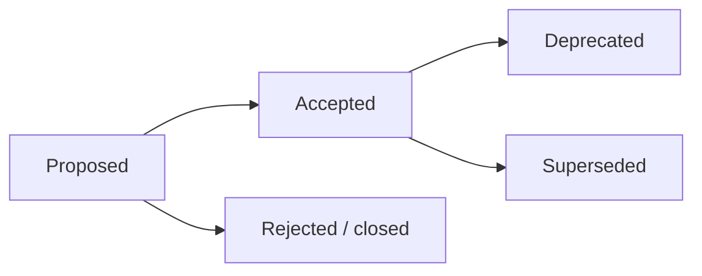

🇬🇧 English (source) · 🇮🇩 [Bahasa Indonesia](README.id.md)

# Architecture Decision Records (ADR)

This folder holds AWCMS's **architectural decision records** — the ERP/back-office lineage template, now the **online-first hybrid family superset** (see [ADR-0034](0034-awcms-family-direct-use-templates-and-derived-pathway-removal.md) & [ADR-0035](0035-awcms-online-first-erp-saas-superset-repositioning.md)). Every significant decision (architecture, runtime, contracts, security, or a deviation from the baseline standard) is recorded as one ADR file so the context and reasoning survive.

## The family today: two repos

As of [ADR-0055](0055-development-confined-to-awcms-and-awcms-astro.md) (2 August 2026), AWCMS development happens in **two repositories, and only two**: this repo as the **system of record** (every authorization surface, every API, and every **SYSTEM** admin screen), and [`ahliweb/awcms-astro`](https://github.com/ahliweb/awcms-astro), which carries **public pages as its primary function** plus a **USER admin surface when a site declares one** ([ADR-0070](0070-peran-keluarga-awcms-astro-memikul-publik-dan-admin-user.md)). Together the pair is the **multi-purpose replacement** for all three of the old templates.

**`awcms-mini` and `awcms-micro` are ARCHIVES** — discontinued, not a standard, not a port source ([ADR-0055](0055-development-confined-to-awcms-and-awcms-astro.md) §1, superseding [ADR-0047](0047-mini-micro-frozen-foundation-built-here.md)).

## Origin: the awcms-mini reference repo (history)

AWCMS **was** rebuilt (see [ADR-0001](0001-rebuild-on-awcms-foundation-erp-scope.md)) on the technical foundation of the modular monolith [`ahliweb/awcms-mini`](https://github.com/ahliweb/awcms-mini). This repo is **standalone** — it carries its entire foundation itself (it does not share a separate base), so foundation ADRs (runtime, RLS, ABAC, offline-first, API/event contracts, module admission) **live locally in this folder** as ADR-0002…0021, adapted from awcms-mini's reference ADRs. ADRs **specific to the ERP & business-integration scope** are added on top of that foundation.

The paragraph above is **provenance**, and it stays true forever. What no longer holds is the "three sibling templates" position ADR-0034 once set — see §The family today.

> Numbering note: ADR-0001 in this repo is the **rebuild** decision. Its original framing ("ERP platform", ERP modules in `src/modules/`) was briefly **amended by [ADR-0022](0022-erp-modules-live-in-extension-repos.md)** (moving ERP modules to a separate extension repo), but ADR-0022 is now **superseded by [ADR-0034](0034-awcms-family-direct-use-templates-and-derived-pathway-removal.md)**: domain modules — ERP included — **may and should live directly in the used template's `src/modules/`**, not in a separate derived repo. (The "three direct-use templates" position ADR-0034 set no longer holds as of ADR-0055 — see §The family today; what still holds from ADR-0034 is the removal of the derived-repo pathway.) The modular-monolith principles it establishes are adopted explicitly by ADR-0001 and detailed by foundation ADRs 0002–0021 plus [`../ARCHITECTURE.md`](../ARCHITECTURE.md).

## Rules

1. One decision = one `NNNN-kebab-title.md` file (sequential number, zero-padded).
2. ADRs are **never deleted**. When a decision is replaced, the old ADR is marked `Status: Superseded by ADR-XXXX` and the new ADR references it.
3. Valid statuses: `Proposed`, `Accepted`, `Deprecated`, `Superseded`. `Accepted` may carry the qualifier `Accepted (belum diimplementasikan)` ("accepted, not yet implemented") for as long as the artifacts the ADR promises (a module under `src/modules/` or a `_shared` contract file) do not exist in this repo — `tests/adr-implementation-status.test.ts` enforces it in both directions: the qualifier is mandatory while the artifacts are absent, and must be dropped (back to plain `Accepted`) in the PR that lands them.
4. Changes to binding standards (see [`GOVERNANCE.md`](../../GOVERNANCE.md)) require an ADR.
5. Use the template at [`0000-template.md`](0000-template.md).

## Flow

## Index

| ADR                                                                           | Title                                                                                                                                                                                                                                                                                                                                                                                                                                                                                                                                                                                                                                                                                                                                                                                                                                                                                                                                                                                                                                              | Status                                                                                                       |
| ----------------------------------------------------------------------------- | -------------------------------------------------------------------------------------------------------------------------------------------------------------------------------------------------------------------------------------------------------------------------------------------------------------------------------------------------------------------------------------------------------------------------------------------------------------------------------------------------------------------------------------------------------------------------------------------------------------------------------------------------------------------------------------------------------------------------------------------------------------------------------------------------------------------------------------------------------------------------------------------------------------------------------------------------------------------------------------------------------------------------------------------------- | ------------------------------------------------------------------------------------------------------------ |
| [0001](0001-rebuild-on-awcms-foundation-erp-scope.md)                         | Rebuild AWCMS as an ERP platform on a modular-monolith standard                                                                                                                                                                                                                                                                                                                                                                                                                                                                                                                                                                                                                                                                                                                                                                                                                                                                                                                                                                                    | Accepted                                                                                                     |
| [0002](0002-bun-only-runtime.md)                                              | Bun-only runtime & tooling                                                                                                                                                                                                                                                                                                                                                                                                                                                                                                                                                                                                                                                                                                                                                                                                                                                                                                                                                                                                                         | Accepted                                                                                                     |
| [0003](0003-postgresql-rls-multi-tenant.md)                                   | PostgreSQL + RLS for multi-tenant isolation                                                                                                                                                                                                                                                                                                                                                                                                                                                                                                                                                                                                                                                                                                                                                                                                                                                                                                                                                                                                        | Accepted                                                                                                     |
| [0004](0004-rbac-abac-default-deny.md)                                        | RBAC + ABAC default-deny as the access baseline                                                                                                                                                                                                                                                                                                                                                                                                                                                                                                                                                                                                                                                                                                                                                                                                                                                                                                                                                                                                    | Accepted                                                                                                     |
| [0005](0005-soft-delete-and-immutability.md)                                  | Soft delete for master/config, immutability for posted data                                                                                                                                                                                                                                                                                                                                                                                                                                                                                                                                                                                                                                                                                                                                                                                                                                                                                                                                                                                        | Accepted                                                                                                     |
| [0006](0006-offline-first-sync-outbox.md)                                     | Offline-first + transactional outbox + HMAC sync                                                                                                                                                                                                                                                                                                                                                                                                                                                                                                                                                                                                                                                                                                                                                                                                                                                                                                                                                                                                   | Accepted                                                                                                     |
| [0007](0007-openapi-asyncapi-contracts.md)                                    | OpenAPI & AsyncAPI as mandatory contracts                                                                                                                                                                                                                                                                                                                                                                                                                                                                                                                                                                                                                                                                                                                                                                                                                                                                                                                                                                                                          | Accepted                                                                                                     |
| [0008](0008-independent-contract-and-module-versioning.md)                    | Independent versioning: package, API/event contracts, module descriptor                                                                                                                                                                                                                                                                                                                                                                                                                                                                                                                                                                                                                                                                                                                                                                                                                                                                                                                                                                            | Accepted                                                                                                     |
| [0009](0009-public-tenant-scoped-routes.md)                                   | Tenant resolution for public routes (sessionless)                                                                                                                                                                                                                                                                                                                                                                                                                                                                                                                                                                                                                                                                                                                                                                                                                                                                                                                                                                                                  | Accepted                                                                                                     |
| [0010](0010-public-host-tenant-routing.md)                                    | Host/domain-based public tenant routing                                                                                                                                                                                                                                                                                                                                                                                                                                                                                                                                                                                                                                                                                                                                                                                                                                                                                                                                                                                                            | Accepted                                                                                                     |
| [0011](0011-capability-ports-for-cross-module-collaboration.md)               | Capability ports for cross-module collaboration                                                                                                                                                                                                                                                                                                                                                                                                                                                                                                                                                                                                                                                                                                                                                                                                                                                                                                                                                                                                    | Accepted                                                                                                     |
| [0012](0012-module-admission-and-trusted-registry-boundary.md)                | Module admission categories & trusted static registry boundary                                                                                                                                                                                                                                                                                                                                                                                                                                                                                                                                                                                                                                                                                                                                                                                                                                                                                                                                                                                     | Accepted                                                                                                     |
| [0013](0013-extension-layers-and-boundary-model.md)                           | Extension layers, tenant/business boundaries, service-extraction criteria                                                                                                                                                                                                                                                                                                                                                                                                                                                                                                                                                                                                                                                                                                                                                                                                                                                                                                                                                                          | Accepted (derived pathway → [0034](0034-awcms-family-direct-use-templates-and-derived-pathway-removal.md))   |
| [0014](0014-deterministic-build-time-module-composition.md)                   | Deterministic build-time module composition (base registry + derived apps)                                                                                                                                                                                                                                                                                                                                                                                                                                                                                                                                                                                                                                                                                                                                                                                                                                                                                                                                                                         | Accepted (derived pathway → [0034](0034-awcms-family-direct-use-templates-and-derived-pathway-removal.md))   |
| [0015](0015-derived-application-compatibility-manifest.md)                    | Derived-application compatibility manifest, test kit, semantic-version gates                                                                                                                                                                                                                                                                                                                                                                                                                                                                                                                                                                                                                                                                                                                                                                                                                                                                                                                                                                       | Superseded → [0034](0034-awcms-family-direct-use-templates-and-derived-pathway-removal.md)                   |
| [0016](0016-organization-structure-module-admission.md)                       | Admission of `organization_structure` (Official Optional Business Foundation)                                                                                                                                                                                                                                                                                                                                                                                                                                                                                                                                                                                                                                                                                                                                                                                                                                                                                                                                                                      | Accepted (not yet implemented)                                                                               |
| [0017](0017-document-infrastructure-module-admission.md)                      | Admission of `document_infrastructure` (Official Optional Business Foundation)                                                                                                                                                                                                                                                                                                                                                                                                                                                                                                                                                                                                                                                                                                                                                                                                                                                                                                                                                                     | Accepted (not yet implemented)                                                                               |
| [0018](0018-data-exchange-module-admission.md)                                | Admission of `data_exchange` (Official Optional Business Foundation)                                                                                                                                                                                                                                                                                                                                                                                                                                                                                                                                                                                                                                                                                                                                                                                                                                                                                                                                                                               | Accepted (not yet implemented)                                                                               |
| [0019](0019-integration-hub-module-admission.md)                              | Admission of `integration_hub` (System Foundation)                                                                                                                                                                                                                                                                                                                                                                                                                                                                                                                                                                                                                                                                                                                                                                                                                                                                                                                                                                                                 | Accepted (not yet implemented)                                                                               |
| [0020](0020-erp-extension-readiness-contracts.md)                             | ERP extension readiness contracts (business transaction, posting, period-lock, item, projection)                                                                                                                                                                                                                                                                                                                                                                                                                                                                                                                                                                                                                                                                                                                                                                                                                                                                                                                                                   | Accepted (not yet implemented)                                                                               |
| [0021](0021-reference-data-module-admission.md)                               | Admission of `reference_data` (Official Optional Business Foundation)                                                                                                                                                                                                                                                                                                                                                                                                                                                                                                                                                                                                                                                                                                                                                                                                                                                                                                                                                                              | Accepted (not yet implemented)                                                                               |
| [0022](0022-erp-modules-live-in-extension-repos.md)                           | ERP domain modules live in extension repos, not the base (amends ADR-0001 point 3)                                                                                                                                                                                                                                                                                                                                                                                                                                                                                                                                                                                                                                                                                                                                                                                                                                                                                                                                                                 | Superseded → [0034](0034-awcms-family-direct-use-templates-and-derived-pathway-removal.md)                   |
| [0023](0023-bilingual-docs-indonesian-source-english-default.md)              | Bilingual docs: Indonesian source, English default, staleness-gated                                                                                                                                                                                                                                                                                                                                                                                                                                                                                                                                                                                                                                                                                                                                                                                                                                                                                                                                                                                | Accepted                                                                                                     |
| [0024](0024-semver-numbering-continues-legacy-major-line.md)                  | SemVer numbering continues the legacy major line (jump to 5.0.0), not a reset to 1.0.0                                                                                                                                                                                                                                                                                                                                                                                                                                                                                                                                                                                                                                                                                                                                                                                                                                                                                                                                                             | Accepted                                                                                                     |
| [0025](0025-implement-deterministic-build-time-module-composition.md)         | Real implementation of deterministic build-time module composition in awcms (addendum to ADR-0014)                                                                                                                                                                                                                                                                                                                                                                                                                                                                                                                                                                                                                                                                                                                                                                                                                                                                                                                                                 | Accepted (derived pathway → [0034](0034-awcms-family-direct-use-templates-and-derived-pathway-removal.md))   |
| [0026](0026-modular-openapi-ownership-and-composition.md)                     | Modular OpenAPI contract: per-module ownership, deterministic bundle, derived-app fragment contribution                                                                                                                                                                                                                                                                                                                                                                                                                                                                                                                                                                                                                                                                                                                                                                                                                                                                                                                                            | Accepted                                                                                                     |
| [0027](0027-mfa-totp-session-assurance-step-up.md)                            | MFA TOTP, recovery codes, session assurance (aal1/aal2), and step-up                                                                                                                                                                                                                                                                                                                                                                                                                                                                                                                                                                                                                                                                                                                                                                                                                                                                                                                                                                               | Accepted                                                                                                     |
| [0028](0028-oidc-sso-tenant-aware-account-linking-break-glass.md)             | OIDC/SSO tenant-aware, fail-closed account linking, SSRF guard, and break-glass                                                                                                                                                                                                                                                                                                                                                                                                                                                                                                                                                                                                                                                                                                                                                                                                                                                                                                                                                                    | Accepted                                                                                                     |
| [0029](0029-deployment-profile-aware-turnstile-bot-protection.md)             | Deployment-profile-aware Cloudflare Turnstile bot protection (LAN/offline exempt)                                                                                                                                                                                                                                                                                                                                                                                                                                                                                                                                                                                                                                                                                                                                                                                                                                                                                                                                                                  | Accepted                                                                                                     |
| [0030](0030-business-scope-hierarchy-generic-authorization-layer.md)          | Generic business-scope hierarchy authorization layer (multi-entity/unit)                                                                                                                                                                                                                                                                                                                                                                                                                                                                                                                                                                                                                                                                                                                                                                                                                                                                                                                                                                           | Accepted                                                                                                     |
| [0031](0031-segregation-of-duties-conflict-enforcement.md)                    | Generic segregation of duties (SoD), exception/override, conflict enforcement                                                                                                                                                                                                                                                                                                                                                                                                                                                                                                                                                                                                                                                                                                                                                                                                                                                                                                                                                                      | Accepted                                                                                                     |
| [0032](0032-family-compatibility-manifest-and-ci-conformance.md)              | Family compatibility manifest + CI conformance to the AWCMS-Mini standard                                                                                                                                                                                                                                                                                                                                                                                                                                                                                                                                                                                                                                                                                                                                                                                                                                                                                                                                                                          | Accepted                                                                                                     |
| [0033](0033-abac-dynamic-policy-evaluator.md)                                 | Dynamic ABAC policy evaluator: bounded condition DSL, deny-overrides precedence, tenant-keyed cache                                                                                                                                                                                                                                                                                                                                                                                                                                                                                                                                                                                                                                                                                                                                                                                                                                                                                                                                                | Accepted                                                                                                     |
| [0034](0034-awcms-family-direct-use-templates-and-derived-pathway-removal.md) | AWCMS family = direct-use templates; derived-application pathway removed; no derivative repos                                                                                                                                                                                                                                                                                                                                                                                                                                                                                                                                                                                                                                                                                                                                                                                                                                                                                                                                                      | Accepted                                                                                                     |
| [0035](0035-awcms-online-first-erp-saas-superset-repositioning.md)            | `awcms` = online-first hybrid, ERP + integrated-SaaS ready, family superset (absorbs awcms-micro)                                                                                                                                                                                                                                                                                                                                                                                                                                                                                                                                                                                                                                                                                                                                                                                                                                                                                                                                                  | Accepted (refines [0034](0034-awcms-family-direct-use-templates-and-derived-pathway-removal.md) positioning) |
| [0036](0036-media-library-module-admission-ownership-inversion.md)            | Admit `media_library` via ownership inversion (extract media registry out of `news_portal`); retire `news_media`; migrations 052-054                                                                                                                                                                                                                                                                                                                                                                                                                                                                                                                                                                                                                                                                                                                                                                                                                                                                                                               | Accepted (adapts awcms-micro ADR-0026)                                                                       |
| [0037](0037-data-lifecycle-module-admission.md)                               | Admit `data_lifecycle` (retention governance + legal-hold, System Foundation); re-wire `visitor_analytics`/`logging` legal-hold coupling; migrations 055-056                                                                                                                                                                                                                                                                                                                                                                                                                                                                                                                                                                                                                                                                                                                                                                                                                                                                                       | Accepted (adapts awcms-micro Issue #745)                                                                     |
| [0038](0038-seo-distribution-module-admission-discovery-scope.md)             | Admit `seo_distribution` discovery scope (central SEO renderer + sitemap/robots/RSS/Atom/JSON + tenant config; `seo_facts` capability seam); redirect governance + 404 telemetry deferred; migrations 057-059                                                                                                                                                                                                                                                                                                                                                                                                                                                                                                                                                                                                                                                                                                                                                                                                                                      | Accepted (adapts awcms-micro ADR-0028)                                                                       |
| [0039](0039-seo-distribution-redirect-governance.md)                          | `seo_distribution` redirect-governance scope (exact-path redirect rules + URL-change capture + 404 telemetry, one fail-open `src/middleware.ts` edit); host-based-only, legacy-blog inert, locale=null; migrations 060-061                                                                                                                                                                                                                                                                                                                                                                                                                                                                                                                                                                                                                                                                                                                                                                                                                         | Accepted (adapts awcms-micro ADR-0028 §8/ADR-0010)                                                           |
| [0040](0040-site-search-module-admission.md)                                  | Admit `site_search` (Official Optional Module): cross-content PostgreSQL FTS index + public host-resolved query/suggest + admin index/settings/diagnostics; `searchSources` descriptor seam (MODULE_CONTRACT_VERSION 2.2.0), `:tenantCode` URL template, no inline typeahead; migrations 064-065                                                                                                                                                                                                                                                                                                                                                                                                                                                                                                                                                                                                                                                                                                                                                   | Accepted (adapts awcms-micro ADR-0031)                                                                       |
| [0041](0041-comments-module-admission.md)                                     | Admit `comments` (Official Optional Module): moderation-first commenting over PUBLISHED resources; `commentableResources` descriptor seam (MODULE_CONTRACT_VERSION 2.3.0), `:tenantCode` URL template, zero new `AccessAction`, store-plain-text/escape-on-render, uniform oracle-free public responses; migrations 066-067                                                                                                                                                                                                                                                                                                                                                                                                                                                                                                                                                                                                                                                                                                                        | Accepted (adapts awcms-micro ADR-0032)                                                                       |
| [0042](0042-varnish-edge-cache-auto-activation.md)                            | OPTIONAL Varnish edge-cache tier (off by default, no-op when off) with origin-pressure auto-activation: fail-closed surface allow-list kept separate from the load signal (pressure changes only HOW LONG, never WHAT), default-deny VCL plus explicit labelling of every response, anchored surrogate-key invalidation through an outbox-pattern durable queue; migration 068                                                                                                                                                                                                                                                                                                                                                                                                                                                                                                                                                                                                                                                                     | Accepted (awcms-native, not a port)                                                                          |
| [0043](0043-lib-boundary-and-module-presentation-layer.md)                    | `src/lib` boundary = technical infrastructure with no domain name; module presentation/delivery code moves to `src/modules/<m>/presentation/`. `modules:dag:check` extended: a `src/lib/<x>/` namespace colliding with a `moduleKey` (exactly or via a domain alias) FAILS; one recorded exception (`logging`). `tests/module-boundary.test.ts` extended to `src/pages` using `api.routes` (#256)                                                                                                                                                                                                                                                                                                                                                                                                                                                                                                                                                                                                                                                  | Accepted (awcms-native; awcms-micro ADR-0038 decides the same there)                                         |
| [0044](0044-merge-news-portal-into-blog-content.md)                           | Merge `news_portal` into `blog_content` (one content module, NO feature loss): `news_portal` (11 files, 3 tables, zero capabilities provided, required consumer of `public_content`) is retired; `awcms_news_portal_*` table names are KEPT per the ADR-0036 precedent; the two advertisement systems unify into the verified-media-FK table after it is widened with post/page targeting (ingest residue is reported, never silently dropped); `awcms_news_portal_tenant_state` (inert, no writer) is DROPPED; permissions are seeded AND backfilled for existing tenants; API paths are not renamed in the same change. The public site moves to `ahliweb/awcms-astro`                                                                                                                                                                                                                                                                                                                                                                           | Accepted (awcms-native; counterpart repo `ahliweb/awcms-astro`)                                              |
| [0045](0045-jualanku-porting-awcms-system-of-record-astro-bff.md)             | Jualanku.info porting: `awcms` as the system of record + internal admin, `awcms-astro` as the experience layer and the only BFF; static-by-default with on-demand routes (not "hybrid"); one operator tenant with **merchants modelled as business scopes** (filling the hierarchy resolver whose base implementation fails closed) plus an ownership predicate on every query — not tenant RLS and not a new ABAC attribute; five `jualanku_*` bounded contexts (not seven); a cross-origin session-introspection contract for the portals; public/portal/admin namespaces calling one application service. Blueprint: [`../awcms/jualanku/`](../awcms/jualanku/README.md).                                                                                                                                                                                                                                                                                                                                                                       | Accepted                                                                                                     |
| [0046](0046-idn-admin-regions-module-admission.md)                            | Admission of `idn_admin_regions` (Official Optional Module): Indonesia administrative region master data (province/regency-city/district/village) as **versioned GLOBAL reference data** — no `tenant_id`/RLS because the rows are identical for every tenant, replaced by mandatory registration in `GLOBAL_TABLE_FORBIDDEN_PRIVILEGES` (explicit per-role privileges, zero DELETE) while authorization stays per-tenant default-deny; the upstream `cahyadsn/wilayah` dataset (MIT) is VENDORED into the repo so imports are deterministic and offline, with the Kepmendagri decree recorded **per file** from each file's own header; import is a JOB (dry-run by default, refusing partial hierarchies), activation/rollback are audited admin actions with the single-active rule enforced by a partial unique index                                                                                                                                                                                                                          | Accepted                                                                                                     |
| [0047](0047-mini-micro-frozen-foundation-built-here.md)                       | `awcms-mini` and `awcms-micro` are frozen as **reference** (31 July 2026): they may be read and ported OUT, but receive no changes. **That port-out path was later CLOSED as well by ADR-0055: both are now ARCHIVES.** The **mini-first** pathway in `AGENTS.md` is therefore SUSPENDED, not deleted — foundation features are prototyped directly here, because a freeze PLUS mini-first leaves foundation work with nowhere to land at all. Verified live, not inferred: `awcms-astro` cannot fetch its own content (`X-Tenant-Code` is never read — awcms reads `x-awcms-tenant-id`) and no machine credential exists in any repo of the family, so the build feed and the ADR-0045 session-introspection contract were both deadlocked. Every safeguard mini-first carried implicitly stays explicit: security review for auth/access, ADR, `family:conformance:check`. Each feature landed during the freeze is a deliberate divergence recorded in `awcms-family-compatibility.yaml` as it lands. `0046` is a reserved gap (in-flight work) | Superseded by ADR-0055                                                                                       |
| [0048](0048-frontend-role-split-awcms-astro-internal-admin.md)                | Frontend role split: `awcms-astro` owns the **owner/internal** admin screens, `awcms` owns the **public frontend + public (tenant) admin**. Complements ADR-0047 (which centralised development on two repos without saying which screens belong where) and corrects the "static site with no authenticated surface" premise for `awcms-astro`. Permissions do NOT move with the screen: internal screens still call this repo's `/api/v1/*` through the BFF (ADR-0045) and still pass session + tenant context + default-deny ABAC; the edge cache is never shared with an admin surface. Binds NEW screens; splitting today's `/admin/*` is deferred to its own ADR                                                                                                                                                                                                                                                                                                                                                                              | Superseded by ADR-0051                                                                                       |
| [0049](0049-machine-credentials-and-session-introspection.md)                 | Read-only machine credentials + cross-origin session introspection: a SECOND kind of bearer that is not a human session, bound to one service account, with a token that **carries its own tenant** (a build needs one env var) and a `mc-sha256:`-namespaced hash so the guard chokepoint can pick the right table from the hash alone — with no signature change across 183 routes. It AUTHENTICATES, never AUTHORIZES: effective permissions are the INTERSECTION with the service account's (narrowing, never widening), and every request is refused unless the action is `read`, decided BEFORE permissions are consulted — a leaked token cannot mutate anything even if the account is an `owner`. Expiry is mandatory (max 365 days), revocation takes effect on the next request, and the decision log records WHICH credential acted. Plus `GET /api/v1/auth/session` (safe claims only, one 401 shape for every failure). The first foundation feature prototyped directly here under ADR-0047, recorded as a divergence as it landed  | Accepted                                                                                                     |
| [0050](0050-bff-session-handoff-code.md)                                      | The `awcms-astro` BFF obtains a human session through a **single-use handoff code**, not by proxying passwords. `awcms` stays the only place credentials are accepted: the user signs in AT `awcms` (password, MFA, OIDC, Turnstile — none of it reimplemented), then is redirected back with a ≤60-second `code` the BFF exchanges **server-to-server**. The session token never reaches the browser; ADR-0049 introspection is the per-request source of truth (deactivation revokes sessions immediately since #319) and logout calls `awcms` FIRST. Password proxying is rejected mainly because signing in here is not one step — proxying it means copying the MFA/OIDC/Turnstile flows into a second repo. Becoming an OIDC provider is rejected for a single trusted client; machine credentials are rejected as read-only and as erasing per-user attribution                                                                                                                                                                             | Accepted                                                                                                     |
| [0051](0051-admin-screens-consolidated-in-awcms.md)                           | Every admin screen — tenant as well as owner/internal/platform — is built in `awcms` under one `/admin/*` shell. **Supersedes ADR-0048**, which bound only new screens (leaving the existing `/admin/*` mixed) and which moved the dataset-activation SCREEN to another repo while its PERMISSION stayed seeded into every tenant's `owner` role — so it never held back the cross-tenant risk that justified it. That risk moves instead to a gate that does enforce: a cross-tenant action must have a platform-scoped gate and must not sit in the catalogue seeded to tenant roles. `awcms-astro`'s role as experience layer + BFF (ADR-0045) is unchanged. **Later NARROWED by [ADR-0070](0070-peran-keluarga-awcms-astro-memikul-publik-dan-admin-user.md)**: "every admin screen" reads "every **SYSTEM** admin screen", and a **USER** admin surface may live in `awcms-astro` when a site declares one (`owner` is refused by a gate there). None of its three replacement gates is loosened.                                             | Accepted (narrowed by [0070](0070-peran-keluarga-awcms-astro-memikul-publik-dan-admin-user.md))              |
| [0052](0052-idn-region-dataset-lifecycle-is-an-operator-job.md)               | Region-dataset activation/rollback become **operator jobs**; their HTTP endpoints are removed and `dataset.configure`/`.restore` are revoked from the catalogue (`sql/084`). Both swapped the data served to ALL tenants, yet their permissions were seeded into the global catalogue granted wholesale to every tenant's `owner` role — so an ordinary tenant owner held authority over other tenants' served data. The "gate them on machine credentials" candidate was REJECTED: machine credentials are read-only (ADR-0049), so widening them would let a leaked build token swap the global dataset. Follows the ADR-0046 §5 precedent (import was already job-only). Accepted cost: the audit row is lost, because `awcms_audit_events` is tenant-scoped while the action is global.                                                                                                                                                                                                                                                        | Accepted                                                                                                     |
| [0053](0053-platform-scoped-permissions.md)                                   | Permission **scope** `tenant`/`platform` (`sql/085`): an action whose effect crosses tenant boundaries can no longer enter the blanket grant every new tenant owner receives, and the chokepoint refuses it unless the acting tenant IS the platform tenant (resolved `PLATFORM_TENANT_ID` → the public default-tenant chain). Closes the CLASS rather than the instance: `bootstrapPlatformTenant` still reads `SELECT id FROM awcms_permissions`, which is what produced ADR-0052's defect and would reproduce it for the next cross-tenant action. The gate trigger is read from the CODE declaration, not the DB column — were both the DB, one UPDATE would remove the gate along with the filter and nothing would go red. Restores the activate/rollback endpoints + the `/admin/idn-regions` screen; the operator jobs remain. Tenancy mode `single`/`multi` is DERIVED from the active-tenant count, never toggled.                                                                                                                       | Accepted                                                                                                     |
| [0054](0054-tenant-provisioning.md)                                           | Tenant provisioning: `POST`/`GET /api/v1/tenants` plus the `/admin/tenants` screen, both PLATFORM-scoped (`sql/086`). Until this ADR a second tenant COULD NOT BE CREATED at all — `setup/initialize` claims the `awcms_setup_state` singleton — so ADR-0053's `multi` mode was unreachable and its platform gate had never met a real second tenant. `createTenantWithOwner` is EXTRACTED and shared with the setup wizard: that is a security control rather than tidiness, because an independently written provisioning routine would carry a copy of the grant `INSERT` that for most of this repo's life lacked `WHERE scope = 'tenant'`. `read` is platform-scoped too, because the directory lists EVERY tenant. A duplicate `tenant_code` needs both a pre-check AND a savepoint (23505 aborts the transaction). The owner password never enters the stored idempotency hash.                                                                                                                                                             | Accepted                                                                                                     |
| [0055](0055-development-confined-to-awcms-and-awcms-astro.md)                 | AWCMS development happens in `ahliweb/awcms` (system of record) and `ahliweb/awcms-astro` (experience layer + BFF), and nowhere else. **Supersedes ADR-0047**, which froze mini/micro as references that could STILL be ported out — a half position that kept documents and gates maintaining a relationship with a repo that does not move: the manifest declared `standard: awcms-mini`, and nine divergences were scheduled for re-review with `reviewDate`s that turn CI red on expiry. mini/micro are now ARCHIVES: wanted capabilities are BUILT here with their own admission ADR, not ported. The manifest stays gated but self-anchored (its 23 contract-version checks against real constants are untouched); `intentionalDivergences` is emptied and preserved as a historical record in `family-compatibility.md`. ADR-0047 §4 (record a divergence as it lands) is retired — the ADR itself is the record; the other §3 guardrails STAY.                                                                                             | Accepted                                                                                                     |

| [0056](0056-media-library-admin-surface.md) | The `media_library` admin surface splits three ways, because "the screen is missing" turns out to be wrong for this module: **five of its eleven permissions are gated by nothing** (`media.attach`/`.detach`/`.delete`/`.restore`/`.purge` — no route, no function, no job), **five application functions have zero callers**, and there is **no list function at all** (`GET /api/v1/media/objects` demands `?ids=`; it is a batch resolver for the `awcms-astro` build). `attach`/`detach` are REVOKED — obsolete since ADR-0036's inversion, media attachment now being the consumer's FK; `delete`/`restore`/`purge` GET a surface, because they are real holes: today a mis-uploaded object disappears only if the reconciliation job happens to categorise it so. `purge` clears the registry, NOT the R2 bytes — the job stays the bucket's only writer. The list gets its own route rather than a dual mode on `?ids=`, since that would turn today's 400 into a dump of the whole registry. The `/admin/media` screen follows AFTER all three land. | Accepted |
| [0057](0057-blog-page-lifecycle.md) | `blog_content` pages get a lifecycle. Auditing `pages.*` before writing its screen found ADR-0056's pattern, sharper: **four of eight seeded permissions are gated by nothing** (`pages.publish`/`.archive`/`.restore`/`.purge`), and unlike `media_library` the application functions do not merely lack callers — they **do not exist**. The consequence is functional, not cosmetic: `createBlogPage` writes a literal `'draft'`, `updateBlogPage` never touches `status`, and the scheduled-publish job only reads `awcms_blog_posts`, so **no code path can publish a page** — which is why the public search's page branch, filtered on `status = 'published'`, has always returned zero rows against an index built for exactly that query. The four permissions GET a surface rather than being revoked: revoking `pages.publish` would bless that defect as design. The lifecycle is deliberately NARROWER than posts' — no `review`, no `scheduled`, since `sql/036` seeded no `pages.schedule` — and `purge` REPORTS rather than refuses: a first draft had it 409 while an ad placement still targeted the page, which reading `ad-placement-reference-validation.ts` refuted — that module already decided a target deleted later "is not an error and never becomes one", the render query never matches a placement whose page is not being rendered, and today's soft delete has the identical effect. The response instead carries the count of placements left inert, since a row silently going dead is exactly the "vanishes with no record" ADR-0044 §4 refuses. **Zero migrations**: columns, CHECK, index and catalogue rows all already exist. Surface first, `/admin/blog/pages` after — plus a gate for the CLASS: every declared permission needs an `authorizeInTransaction` call site or a reasoned exception. | Accepted |
| [0058](0058-unenforced-permissions-disposition.md) | Four declared permissions with no enforcer are decided together: **two get a surface, two are revoked**. ADR-0057 §F's gate found them, and its own first score carried **two false accusations** — `visitor_analytics.settings.read`/`.update` are fully gated by `analytics/settings.ts`, but the scanner read the whole repo's constants as one flat namespace and `MODULE_KEY` is bound in five files to four values, so the guard was invisible; both were written up as reasoned DECISIONS that the route refutes line by line (fixed in PR #359, file-first resolution). The remaining four were therefore re-verified against the code, and they are **not one class**: `profile_identity.profile_management.restore` and `comments.moderation.delete` have all of their machinery except the surface — the first leaves `softDeleteParty` without a counterpart, so `restored_at`/`restored_by` (`sql/003`) can never be written; the second has a `delete`→`deleted` transition legal from all four non-terminal statuses and an admin queue that can FILTER `deleted`, yet the only actor who can produce one is the AUTHOR, via `requestCommentDeletion`. Both GET a surface, and §B states plainly that `deleted` stays terminal — moderators gain one irreversible action, accepted because the state is already reachable through the author path, remains non-destructive, and without it there is no in-band answer for content that must be pulled permanently; `bulk-moderate` deliberately does NOT get it. Conversely `blog_content.seo.configure` is REVOKED as a second authorisation axis over columns `settings.configure` already manages (`seoDefaultTitle`/`seoDefaultDescription`), and `blog_content.posts.export` is REVOKED because there is zero export machinery anywhere — building the feature to justify the catalogue row is the tail wagging the dog. One single migration for both revocations (grants first, then the catalogue — FK), with no rollback. The order binds: surfaces first, revocation last, because the gate flags an exception whose permission has gained an enforcer as stale. Once all four land the exception list is **empty**. | Accepted |
| [0059](0059-host-resolved-public-content-routes.md) | The host-resolved public content family lands at **`/news/**`**, four routes (index, post detail, category, tag), and the backlog entry that asked for `/blog/{slug}` is answered with a refusal plus evidence. Two findings drive it. First, the recorded defect — "every sitemap `<loc>` 404s for a host-resolved tenant" — is **false**: `discovery-providers.ts` has scoped the adapter to `/blog/{tenantCode}` since #223, verified with `git log -S`, and the `/blog` default it was blamed on has zero callers in `src/`. Second, the real gap is that host-resolved deployments have **no content route at all**, so a tenant on its own domain publishes URLs carrying the identifier that domain exists to remove. `/blog/{slug}` cannot be the shape: probed in this repo, Astro warns the route "is defined in both" files and **still builds**, one silently shadowing the other ("a hard error in following versions"), and resolving the ambiguity at runtime would let a post slug shadow another tenant's listing URL. The archived `publicBasePath` setting is not adopted either — it moves links without moving routes, which manufactures per-tenant URLs that 404. The gate (`withHostResolvedBlogTenant`) is the same shape as `site_search`/`comments`, latency-padded; the new `publicRouteMode` switch is symmetric with `legacyTenantRouteEnabled`; and `seo_distribution` now **chooses** its base path from whichever family actually serves, contributing **no provider at all** when a tenant switches both off — an empty sitemap rather than one full of certain 404s, mutation-proven. Zero migrations, zero permissions, zero OpenAPI change; `/news/**` is deliberately not yet a declared edge-cache surface (host keying first). | Superseded by [0071](0071-kosakata-url-publik-dibelah-blog-di-sini-news-di-awcms-astro.md) |
| [0060](0060-business-scope-hierarchy-provided-by-tenant-admin.md) | `tenant_admin` becomes the `business_scope_hierarchy` provider, closing an endpoint whose **success path was never reachable**. `POST /api/v1/identity/business-scope/assignments` is permission-gated, audited, RLS-protected and SoD-evaluated — and refused EVERY input in EVERY deployment: its composition root injected a NO-OP adapter resolving every scope to `resolved: false`, while the reserved `tenant` scope type is rejected by the validator as unassignable (#180 F2). The NO-OP was correct when written — it waited for a DERIVED application to inject a resolver — and then ADR-0034 deleted the derived pathway and ADR-0055 confined development here, so the wait became a permanent refusal; its `providedBy` even named `organization_structure`, a module ADR-0016 accepted and nobody ever wrote. The base already had a real, hardened hierarchy: `awcms_offices` with `parent_office_id`, FORCE RLS (`sql/017`) and a composite cross-tenant-proof FK (`sql/020`). The new adapter resolves the `office` scope type only; just LIVE rows resolve (not soft-deleted, not `inactive`, same tenant), and dead rows are skipped anywhere in the chain so no coverage is borrowed through a resource its tenant switched off. **Every bound REFUSES rather than truncates** — cycle, depth, count — because a truncated list still claims `resolved: true`. Plus one read-path hardening: the reserved `tenant` sentinel mints a covers-everything fact only when its `scope_id` names this tenant. The NO-OP adapter is deleted (zero callers), zero migrations, zero new permissions. | Accepted |
| [0061](0061-host-resolved-public-surfaces-are-edge-cacheable.md) | Host-resolved public surfaces become edge-cacheable, via routes that **publish the tenant they already resolved** — which closes something larger than "one route family is not cached yet": **ADR-0042 §8's first-choice tenant source never had a writer**. `locals.edgeCacheTenantId` is declared in `src/env.d.ts`, read by `src/middleware.ts`, and preferred above everything by `resolveEdgeCacheTenantId` — while zero routes ever assigned it, so that first-priority branch has been unreachable since ADR-0042 landed. The result is the exact inverse of ADR-0059's direction: edge caching accelerates `/blog/{tenantCode}/**` (the legacy shape) and touches **none** of the surfaces that resolve their tenant from the request. §A wires the `/news/**` family (three registry entries mirroring the TTLs and reasoning of their `blog-*` counterparts, owned by `blog_content`, whose module purge already covers them); §B — the six root discovery routes, the best caching target in this codebase — follows, because `serveDiscovery` does not yet receive `locals` and `seo_distribution` has no purge call site, which `findOwnersWithoutPurges` will demand of it the moment it owns a surface. Two things do not read from the code, and are therefore what this ADR is for. First, the "the VCL hashes `Host`" prerequisite is **two** properties: `hash_data(req.http.host)` IS there, but that subroutine must also NOT `return (lookup)` — a custom sub that returns ends the chain, so `builtin.vcl`'s `vcl_hash` (which hashes `req.url`) never runs and every path on one host collapses onto a SINGLE entry; adding that line reads like completing the subroutine. Second, **when** a route publishes its tenant is a disclosure question rather than a style one: 404 is a cacheable status, so publishing before the "no such post/term" branch annotates the missing-resource 404 with `Surrogate-Control` while the unknown-host 404 gets `private, no-store` — answering "does this hostname map to a live tenant?" from ONE request, through a second channel over the very question `padUnresolvedHostRouteLatency` was built to close, and the mistake is one line placed a few lines too high that still compiles and passes every functional test. The rule "publish only on the serving path" is therefore held by a source-text contract test, mutation-proven. The "guess from the `Host` header" fallback stays REFUSED (ADR-0042 §8's prohibition). Zero migrations, zero permissions, zero OpenAPI change. | Accepted |
| [0062](0062-skills-are-gated-against-the-code-they-describe.md) | `.claude/skills/` joins `bun run check` via `skills:check`, retiring an exemption whose justification ADR-0055 had already removed. The numbers that forced it: **eleven consecutive ADRs (0051–0061) landed with not ONE skill referencing any of them** — not some, zero; **four skills for LIVE modules** pointed at `src/lib/<module>/…` for files that had moved to `src/modules/<module>/presentation/…`; several announced admin screens as "not ported" months after those screens shipped; and six still taught the mini-first pathway two days after ADR-0055 retired it. Why this is worse than a stale doc: **skills are FOLLOWED**, and their decay runs backwards — "this module is not in this repo" starts out TRUE, then the module gets built, and the sentence ages into a confident falsehood telling an agent to rebuild what exists or to take it from an archive that does not move. The gate reads no intent (prose cannot be gated) and keys off the module registry: (1) a live module's skill must cite `src/…` paths that EXIST, with **no exception list**, because a skill for shipped code has no reason to name a file that is not there; (2) every cited `ADR-NNNN` must have a file; (3) a skill for code that does NOT exist must be listed in `ASPIRATIONAL_SKILLS` as `target-spec`/`historical`/`cross-cutting` **with its reason**. The list is per-SKILL rather than per-PATH: a path list grows with every edit to a target spec and stops being read, while a skill list changes only when a skill changes character. DEAD entries fail too — and the way they die is the one that will actually happen: the module gets BUILT, rule 1 takes over, and the entry silently stops meaning anything while still reading as a decision (three entries were already dead when written and were deleted on the spot). It deliberately does NOT require every ADR to be cited by some skill: that would produce ceremonial references added to turn CI green, the same "ceremony that looks like coverage" `edge-cache:surfaces:check` already refuses. `docs/awcms/` stays outside the gate. Zero migrations, zero permissions, zero runtime change. | Accepted |
| [0063](0063-ownership-grants-run-through-the-authorization-chokepoint.md) | OWNERSHIP-based grants flow THROUGH `authorizeInTransaction` rather than replacing it. Three handlers (`PATCH /blog/posts/{id}`, `POST /blog/posts/{id}/submit-review`, `PATCH /blog/pages/{id}`) decided permissions themselves from `fetchGrantedPermissionKeys` plus a domain rule, so **the ABAC evaluator, the platform-scope gate (ADR-0053), business-scope facts (ADR-0060) and SoD (#181) were all skipped** — concretely, a tenant's ABAC `deny` was honoured on some routes and ignored on these three, with no error, no failing test and no red gate. None of the three was sloppiness: they enforce the #538 product rule that an author may edit their own unpublished content EVEN WITHOUT holding the permission — an authorization axis the permission catalogue cannot express — while the chokepoint returns `denied` BEFORE any domain rule is consulted, so "just call the chokepoint" would DELETE the author path (a functional regression dressed as a security tightening). The answer is `ownershipGrant`, which **WIDENS** the permission set being evaluated instead of short-circuiting the decision: tenant isolation, an ABAC deny, business scope and SoD can all still refuse. Machine credentials are excluded (ADR-0049 §3 — a build token pointed at an author's account must not inherit that author's ownership), and the decision log labels ownership allows `ownership_grant:<reason>`, because without it the row reads exactly like an RBAC allow. The `access:chokepoint:check` gate slices **per HANDLER**, and that is the load-bearing decision: the assessment that prompted this ADR reached a wrong conclusion precisely by reading per-FILE — `blog/posts/[id].ts` calls the chokepoint in `GET` and `DELETE` while `PATCH` in the same file did not, and a file-level reading merges them into "compliant". Exemptions are keyed `<file>#<METHOD>` so one can never widen to a sibling handler; there are two (`auth/login.ts#POST` pre-authentication, `access/evaluate.ts#POST` self-introspection that actually CALLS `evaluateAccess`); dead entries fail too. One claim in this ADR's own test was likewise proven WRONG by mutation — the safety does NOT come from ABAC being matched before the RBAC key check (a deny returns in either order) but from NOT short-circuiting, which is now held as a contract over the guard's source text, because the wrong implementation is one line and passes every behavioural test of the evaluator. Zero migrations, zero permissions, zero OpenAPI change. | Accepted |
| [0064](0064-foreign-key-columns-must-be-index-reachable.md) | Foreign-key columns must be index-REACHABLE, and this is the repo's first PERFORMANCE gate — the 2026-08-04 assessment measured **zero of 28 gates** touching performance, so an unindexed FK or an N+1 lands with CI fully green and surfaces months later as "the admin screen got slow". Postgres indexes a foreign key's REFERENCED side automatically and its REFERENCING side **not at all**, so a bare FK column pays twice: every parent `DELETE`/`UPDATE` sequentially scans the child table to enforce the constraint, and the parent→child join has no index either. Measured: **182 FK columns, 14 unreachable**, with one table (`awcms_blog_ads`) carrying no index at all beyond its primary key. The literal rule ("the FK column must LEAD an index", since Postgres can only use a B-tree PREFIX) is violated by **40 of 182** — and forty migrations on the day a gate lands is not a gate but an exemption list waiting to be written, a failure class this repo has already recorded three times. So the rule is TENANT-AWARE: reachable = leads an index OR is the second column after `tenant_id`, because every tenant-scoped query carries `tenant_id` (RLS `FORCE` guarantees it), making a `(tenant_id, fk)` composite the index those joins actually use. The residual is stated rather than hidden: that composite does NOT help enforce the constraint when a PARENT row is deleted (that needs a bare lookup and will scan) — accepted because parent deletes here are administrative and rare while the write cost of 26 indexes is paid on every insert forever. The relaxation is bounded and tested in both directions: a second column after anything other than `tenant_id` is NOT reachable, and neither is the THIRD column after `tenant_id` — without that bound the rule would accept any composite and find nothing. `sql/090` indexes the remaining thirteen (additive, `IF NOT EXISTS`, no data moved). One exemption with a real reason: `awcms_setup_state.tenant_id`, a hard singleton (`id boolean PRIMARY KEY` + `CHECK (id)`) holding exactly one row. Dead exemption entries fail too. Zero permissions, zero OpenAPI, zero runtime change. | Accepted |
| [0065](0065-awcms-astro-consumer-contract-is-frozen.md) | The slice of this API that `ahliweb/awcms-astro` actually calls is FROZEN and gated here (`bun run api:consumer-contract:check`). The existing frozen snapshot is the pre-#182-migration monolith and does its own job well — but **every surface the other repo calls landed AFTER it** (`/auth/session` + `/access/machine-credentials` from ADR-0049, `/media/objects` #318, `/media/public-origin` #370, the `/blog/posts` cursor traversal #317); searching the snapshot for those four returns ZERO. So changing any of their response shapes is GREEN in this repo's CI and breaks the other repo's build — a failure that surfaces where the person who caused it is not looking. A SECOND snapshot rather than widening the first: they answer different questions, and the pre-migration one must stay frozen at its own moment to keep answering its. **The `$ref` closure is the point** — freezing six path objects alone would be near-useless, since a path is a few lines that `$ref` a schema and the interesting breakages happen in the SCHEMA (a renamed field, a narrowed type, a dropped nullable), so the gate walks every reachable `$ref`: 6 paths plus 16 components. Mutation-proven: renaming `publicUrl` inside the `ResolvedMediaReference` component turns it red, while adding an optional field to that same component passes. The rule is ADDITIVE-superset rather than equality; `CONSUMER_PATHS` was derived by grepping the other repo rather than from memory; regeneration is a DELIBERATE act meaning the consumer must change too (stated in the fixture header AND in the failure message, because whoever reads it is in the wrong repo to realise it themselves); and a missing consumer path THROWS rather than silently shrinking the contract. What it does NOT guarantee is stated plainly: this is a SCHEMA contract, not a behavioural one — a change of meaning with an unchanged shape is not caught. Zero migrations, zero permissions, zero runtime change. | Accepted |
| [0066](0066-shared-rate-limiting-and-full-auth-surface-coverage.md) | Rate limiting becomes a property of the DEPLOYMENT rather than of one process. `rate-limit.ts` counted in an in-process `Map` (the file said so itself), so with **N** replicas the effective limit became **N x** the configured one — anti-brute-force weakening in direct proportion to replica count, leaving the deployments that most need protection the weakest. `checkSharedRateLimit` counts in Redis (already present in the repo) with **the window number as part of the KEY rather than a stored timestamp** — which is what makes it correct where the `Map` is not: two instances agree WITHOUT a read-modify-write, so there is no race for anyone to win; `PEXPIRE` fires only on the first hit, because re-setting it every hit would slide the window and let a steady attacker hold the key alive indefinitely. With no Redis it falls back to the `Map` — not a compromise, since a single-instance deployment has nothing to share. **It FAILS OPEN when Redis is down, which is the opposite of this repo's default posture**, so it is stated loudly: a rate limiter is availability tooling on the authentication path, and failing closed would turn a Redis outage into "nobody can log in" — an attacker-triggerable denial of the entire control plane. What keeps that honest is that it is not the only control: the per-identity lockout is enforced in PostgreSQL, atomically, and is unaffected by a Redis outage, so this limiter is the SOURCE-scoped backstop (the thing that catches an attacker rotating `loginIdentifier`) rather than the last line; the command timeout is 250 ms; and `security:readiness` reports a configured-but-unreachable Redis so the degraded state is visible. Coverage rises from eight surfaces to **eleven** — `session-handoff/issue`, `session-handoff/redeem` and `sso/{providerKey}/callback` had no limiter at all (completeness rather than a hole, since each has other mitigations, but ASVS V11.2 wants anti-automation across the WHOLE auth surface), held by a test that also enforces that no route still uses the per-instance limiter directly. It stays fixed-window rather than sliding or token-bucket: that allows a 2x burst at a window boundary, accepted because the control that actually binds brute-force is the DB-enforced per-identity lockout. Mutation-proven both ways: failing closed, and re-setting the TTL every hit, each turn one test red. Zero migrations, zero permissions, zero OpenAPI change. | Accepted |
| [0067](0067-core-web-vitals-collection.md) | **`Proposed` — the RUM part awaits the product owner's decision; Option D (LAB measurement) was taken and landed 2026-08-05.** The only one of the 2026-08-04 assessment's seven recommendations deliberately NOT landed in full: it does not fix a defect, it **adds collection of data about real visitors**, and that collides with a posture the target module has already stated. The gap is real: this repo serves HTML (`/news/**`, `/blog/{tenantCode}/**`, 31 admin screens) and **LCP/INP/CLS are measured nowhere**, so the entire edge-cache investment (ADR-0042/0061, 11 surfaces) is proven against ORIGIN LOAD and never against USER EXPERIENCE — we know database queries dropped; we do not know whether the page feels faster. But `visitor_analytics` declares itself privacy-first and not as a slogan: `purgeVisitorAnalyticsData` does DELETE/UPDATE-to-null with NO archive step, on the written grounds that raw visitor detail is deliberately not retained longer than necessary — and a Core Web Vitals sample is per-visit telemetry, exactly that class of data. Three options with their real trade-offs: (A) do not collect — legitimate, and better recorded as a decision than left as an open gap; (B) **aggregate-only** (recommended if taken at all) — the server aggregates at the entry point into per-(tenant, normalised route, day) buckets holding counts plus p75, NEVER raw rows, so `purge` has nothing to delete and the module's privacy promise is unchanged; the price is no drill-down into a single slow visit, accepted because that is APM work rather than CMS work and it is precisely drill-down that requires retaining raw data; (C) raw rows plus retention — REJECTED in this draft, because it reverses the module's explicit decision for a capability no recorded need demands. Never recommended: adding it as "just another table" without an explicit decision, since reversing a privacy posture must be visible. Addendum 2026-08-05: **Option D (LAB) landed** — `tests/e2e/cwv-lab.e2e.ts` measures LCP+CLS of `/login` in the CI `e2e-smoke` job (env gate `E2E_CWV_LAB`, skip stated explicitly, never silently green); the numbers are single-machine LAB numbers = a regression detector, NOT field p75, and INP is not claimed — the RUM decision stays open. | Proposed |
| [0068](0068-family-standards-posture-editions-and-recorded-divergences.md) | Family standards posture: **standard editions are pinned by this repo**, and three real divergences from `awcms-astro` are finally RECORDED. The trigger was an orphaned decision: `awcms-astro` ADR-0028 states in writing that it matches this repo's OWASP editions and **will not move ahead of it** — while the decision it defers to had never been taken, because the OWASP Top 10 2021 / ASVS 4.0.3 pin arrived through the `awcms-security-hardening` skill (written when those were current) and was then followed because it was already written. One repo waiting on a signal the other did not know it held. §A writes that pin down with a review date, and states that **raising an edition is family-level work** that remaps the whole §3-§7 matrix in `standar-performa-dan-keamanan.md` AND obliges telling the neighbour in the same breath — so it needs its own ADR rather than an edit to a table. §B refills `intentionalDivergences`, empty since ADR-0055, with three `reviewDate`-carrying entries the `family:conformance:check` gate already knows how to turn red on expiry: (1) **HSTS** — this repo sends `includeSubDomains`, `awcms-astro` does not, and BOTH are correct (one deployment whose operator knows its subdomains, versus a TEMPLATE running on domains belonging to organisations that almost certainly serve other things on other subdomains, where the directive forces every one of them HTTPS-only for a year in every visitor's browser and the cost is borne by parties who never took part in the decision); (2) **`.astro` files are not type-checked** — 42 files / 22,328 lines, and the cause is NOT discipline but toolchain: `@astrojs/check` requires the TypeScript 6.x programmatic API and this repo is on 7.0.2, which does not ship it (verified by INSTALLING and RUNNING it, not by reading), while `awcms-astro` is on `^6.0.3` — downgrading TypeScript for one checker would regress the toolchain under 33 gates and ~156,000 lines that `tsc --noEmit` keeps clean today; (3) the **OWASP edition pin** itself. §C states that `.astro` stays unchecked as a **dated debt** rather than a promise: what is being waited on is external, so the date is when we re-examine. The mitigation is explicit — `awcms-testing` and `awcms-pr-review` both instruct reading `.astro` types by eye, naming the class most likely to slip (`withTenant`, which returns `T | Response`, used where `withTenantOrThrow` is meant). Zero header changes, zero toolchain changes, zero matrix remapping: this ADR NAMES the state; it does not change it. | Accepted |

| [0069](0069-cross-origin-isolation-divergence-with-awcms-astro.md) | The COOP/CORP difference with `awcms-astro` is RECORDED as the family's fourth divergence. Closing gap C2 (commit `769292d7`) made this repo send `Cross-Origin-Opener-Policy` and `Cross-Origin-Resource-Policy` `same-origin` unconditionally on every response; `awcms-astro` sends neither, and that is NOT an omission — CORP is explicitly rejected there ("blocking other sites from embedding this site's images is not a template's decision to make", that repo's ADR-0028 rejected-controls list), and COOP has no surface to protect because that repo has no session. The difference is deliberate and documented ON BOTH SIDES (their PR #40 corrected their header table first) — but it was recorded nowhere with a review date and an expiry gate. What makes it worth recording: this difference points the OPPOSITE way from every earlier one (this repo ahead, the template behind by choice), exactly the shape most likely to be "fixed" toward parity by someone without the context (gap C15). Entry `coop-corp-cross-origin-isolation` joins `intentionalDivergences` with `reviewDate` 2027-02-04 — the same cohort as ADR-0068's three entries, so the whole family posture returns to the table on one date. The parity direction is NOT changed: a derived site of the template that needs COOP/CORP decides that by ADR in its own repo, not by copying this repo's values into the template. Zero code changes, zero header changes — this ADR names a state that is already correct on both sides. | Accepted |
| [0070](0070-peran-keluarga-awcms-astro-memikul-publik-dan-admin-user.md) | Family roles restated: `awcms-astro` carries **public pages as its primary function** AND a **USER admin surface** when a site declares one. **NARROWS ADR-0051** — it does not supersede it. The trigger was `awcms-astro` ADR-0034 (8 August 2026), which states its tension with this repo openly and then closes with a request it cannot fulfil from there: record this difference as a family divergence, because "repo ini tidak bisa menulisnya sendiri". The axis for splitting screens moves from AUDIENCE (tenant vs owner/internal/platform — ADR-0051's wording never says "USER admin", because on 1 August the question did not exist yet) to WHAT IS MANAGED: **SYSTEM** admin (modules, roles, tenants, audit trail, anything cross-tenant) stays here under one `/admin/*` shell; **USER** admin (a person doing their own work on ONE site — writing a post, submitting it for review, their own profile) may live in `awcms-astro`, and only when that site declares it via `permukaanAdmin`. `owner` is **refused by a gate** there, and **nothing may exist only there** — every USER-facing capability must also be manageable from `/admin/*` here, so the work order is `awcms` first, always. What makes the narrowing cheap is ADR-0051's own sentence: what holds a cross-tenant action is the authorization gate, not the address of the repo the button is drawn in — so **all three of ADR-0051's replacement gates are quoted verbatim and NOT loosened at all**, while its open finding for `idn_admin_regions.dataset.configure`/`.restore` was already CLOSED by ADR-0052 (`sql/084`) and then ADR-0053 (`sql/085`, `platform` scope). ADR-0050 (session handoff) finally has a NAMED audience — USER, never `owner` — after ADR-0051 left it with reduced motivation; ADR-0065 is deliberately NOT extended, not because the mechanism is missing (`COMMITTED_PATHS` exists precisely to freeze an uncalled surface) but because the USER admin surface has no shape yet that could be promised. Entry `admin-user-surface-in-awcms-astro` joins `intentionalDivergences` with `reviewDate` 2027-02-04, in the same cohort as the other four; what gets reviewed is not whether USER admin belongs there but whether the BOUNDARY is still where it was put. Zero runtime code changes, zero permissions moved. | Accepted |
| [0071](0071-kosakata-url-publik-dibelah-blog-di-sini-news-di-awcms-astro.md) | The family's public URL vocabulary is SPLIT, one route family per repo and never both in one repo: **`/blog/{tenantCode}/**` in `awcms`** (path-scoped, ADR-0009) and **`/news/**` in `awcms-astro`** (a tab named `news` declaring `urutanSeksi: "terbaru"`, that repo's ADR-0033). **SUPERSEDES ADR-0059**, which landed `/news/**` here — what is revoked is the address, not the capability. The trigger: ADR-0070 states `awcms-astro` carries public pages as its primary function, yet its §Consequences still listed `/news/**` as this repo's surface, so both repos could serve public news at two addresses from one content source — two answers to a question asked every time a deployment is built. What is split is the **URL, not content ownership**: both are served by the same `blog_content` module, and `awcms-astro` reads it through `GET /api/v1/blog/posts`, already frozen by ADR-0065 — so ADR-0070 §4's mirror rule (nothing may exist only there) is satisfied with no extra work. Two ADR-0059 decisions are RESTATED so they do not lapse with the supersede: the §C invariant (a tenant that turns its public surface off gets an EMPTY sitemap, not one full of links that are certain to 404) and the §E refusal to declare a host-resolved edge-cache surface before per-host keying is verified in VCL. ADR-0061's §A premise also falls, in the useful direction: `/blog/{tenantCode}` is no longer "the legacy shape that gets cached while the forward shape does not" but the permanent vocabulary, and it is path-scoped, so it is already cacheable today; ADR-0061 gets a banner, not a supersede. **§4 NOT YET IMPLEMENTED**: the four routes still exist under `src/pages/news/` and `publicRouteMode` still defaults to `domain_default` (on by default), so there is a real window between the rule and the code. That window is GATED by `tests/url-vocabulary-split.test.ts` in both directions — routes present → the ADR must say BELUM; routes gone → it must say SUDAH, in the same PR. The `Accepted (belum diimplementasikan)` qualifier cannot be used: its gate binds the qualifier to the PRESENCE of artifacts, and this ADR promises a REMOVAL. The implementation PR must carry a 301 from `/news/**` to `/blog/{tenantCode}/**` (not a 404) and disable the legacy `/blog/{tenantCode}` → `/news` auto-redirect, whose direction is inverted under this rule. Zero code changes in the rule PR itself. | Accepted |

| [0072](0072-decision-log-retention-and-projection-authority.md) | `awcms_abac_decision_logs` — the largest unbounded table in the repo, one row for EVERY authorization decision (±8.6M rows/day at 100 rps), zero retention since `sql/005` — finally gets a bound, AND the dispute born with it is settled in the same document. It grows with TRAFFIC rather than customer data: a tenant that adds no content still adds rows every time its staff opens a screen. Its purge job, written today, would delete ZERO rows — `sql/022` grants `awcms_worker` only `SELECT`, so the purge runs, reports success, and deletes nothing; a failure that sounds like "nothing to delete". `sql/091` grants `DELETE`. The dispute: `reporting` uses this table as the cursor source of the `access_audit_summary` projection and its description reads "append-only — never updated/deleted, the ideal cursor_table source" — a claim retention FALSIFIES, with non-cosmetic consequences. The INCREMENTAL counters are unaffected by a purge; a REBUILD recomputes from SURVIVING rows. After the first purge, an operator pressing rebuild silently DESTROYS the historical count and replaces it with a smaller one, with no error anywhere. The decision: both are given a NAME and a SCOPE — incremental is authoritative for all-time, rebuild is authoritative for "since the retention horizon" — and that statement is written into the projection description where an implementor reads it, guarded by a two-way test (§E). The window is 365 days, NOT 90: the number is not a storage preference but the horizon over which that projection can still be rebuilt, so 90 would pick a number that HIDES the coupling. One claim in the original design turned out to be wrong and was not written: the proposed ASCENDING `(tenant_id, created_at)` index is rejected because a PostgreSQL btree is scannable BACKWARDS, so `sql/005`'s DESC index already serves the purge's ASC scan without a sort — a second index would only add write amplification to the most-written table in the repo, buying nothing. The reasoning lives in `sql/091`'s header so the proposal cannot be reborn. Retention does not apply until `bun run data-lifecycle:archive-purge` is scheduled; a descriptor without a schedule is intent, not retention. | Accepted |
| [0073](0073-suspension-is-a-service-state-not-a-login-state.md) | `awcms_tenants.status` has admitted `'suspended'` since `sql/002` and was **never enforced outside login** — an enum that lived through 92 migrations without a single gate objecting. The asymmetry pointed the wrong way: the tenant's public site died INSTANTLY, while already-issued admin sessions kept full access until they expired on their own, and machine credentials (up to 365 days, and their resolution path never touched `awcms_tenants`) were UNTOUCHED. A suspended customer lost what their visitors saw and kept what could change their data; for an abuse or legal-order suspension, that is not a suspension. Now enforced at the chokepoint for sessions AND machine credentials (`403 TENANT_SUSPENDED`), decided BEFORE permissions are looked up — the same reasoning as the machine-credential read-only refusal just below it. No revocation sweep: the check is on the TENANT, not the credential, so a one-shot sweep that a later-issued credential could slip past is unnecessary. `inactive` is treated like `suspended` — enforcing one while serving the other would reintroduce the same asymmetry, one status smaller. The admin shell is blocked in `resolveSsrContext`, ONE line covering all 32 screens because the middleware routes every `/admin/*` through it; the limit is stated honestly: it is all-or-nothing, and when the billing screen arrives in Wave 5 that branch must grow the same allow-list. The allow-list is keyed by PERMISSION KEY and declared in CODE (allowing `read` would open most of the product; and a suspension one `UPDATE` can undo is not a suspension) — widening it requires an ADR. The PLATFORM tenant is exempt in TWO layers, and the first needed a new resolver: `resolvePlatformTenant` deliberately requires `status = 'active'`, so a suspended platform tenant would resolve to `null`, the exemption would be false, and the operator would be refused EVERY action including the one that lifts it — `resolvePlatformTenantIdIgnoringStatus` answers a different question ("who holds platform authority") and grants nothing. Second layer: the `suspend` endpoint refuses with `409 PLATFORM_TENANT_PROTECTED`, a comprehensible message instead of a locked door. `disable` and `restore` are TWO permissions, both `scope: platform` — during an incident you want someone who can bring a customer back without being able to cut one off. The button does not exist yet; both keys join `NOT_YET_SCREENED`, which may only shrink. | Accepted |
| [0074](0074-push-delivery-is-a-second-outbox.md) | Push notification gets a SECOND outbox, not a domain-event consumer. `awcms_domain_events` already has a dispatcher, a DLQ, and replay, so hanging push off it is the reasonable first move for anyone — and it is wrong: `dispatch-domain-events.ts` states in its own header that CLAIM + handler + FINALIZE run in ONE transaction, deliberately, and calls the handler inside it, while ADR-0006 forbids network calls inside a transaction. `broker-adapter-port.ts` already wrote down the consequence ("would need the lease-based shape back") and is itself DEAD CODE: zero callers repo-wide. What makes it ADR-worthy: **no gate would catch it** — an FCM consumer registered the most reasonable way would hold a pool connection for the round-trip to Google while holding a row lock, turn every network failure into a rollback so an event that WAS delivered is delivered again, with all 37 gates green. So: a `push_delivery` module, the lease pattern already proven 3× here (`email-dispatch`/`object-dispatch`/`purge-queue`), `sql/093` with three tables. Four decisions ride along: endpoints/tokens are treated as CREDENTIALS (the three-column `endpoint`/`_hash`/`_masked` discipline, the raw column named in exactly one file — and they can never ride a domain event anyway, since `envelope.ts` rejects any key containing `token`); `subscriptionGone` is its OWN result branch rather than `retryable: false`, or a tombstone endpoint collects one permanent failure per message forever; retention is `delegated`, not `generic`, because `HighVolumeTableDescriptor` carries no status predicate, so the generic executor would delete rows still WAITING to be sent and the loss would look exactly like successful housekeeping; `targetPath` accepts only a same-origin path, validated BEFORE the row is written (a queue row carrying an absolute URL is a stored open-redirect with a system notification as its vehicle, arriving with this origin's own name and icon). **FCM Web is REJECTED and the numbers are recorded** so it is not re-proposed: 45,041 B against a 21,000 B per-file ceiling, 185,049 B total against 180,000 B, and this repo's CSP locks in zero third-party origins (ADR-0029) — while Web Push/VAPID gets the same result with zero SDK bytes and zero new origins. Lands INERT: without `PUSH_ENABLED=true` the dispatcher claims not one row. | Accepted |
| [0075](0075-sse-reauthorizes-every-tick.md) | An SSE connection RE-AUTHORIZES on every tick. `defineTenantRoute` returns the connection to the pool and releases the work-class slot BEFORE the first byte reaches the client — correct and thrifty for a JSON request, and for a thirty-minute stream it turns a momentary decision into a STANDING PERMISSION: a role revoked at minute two keeps serving until the client disconnects. That is the exact posture #450 just finished removing from 32 admin screens. What makes it ADR-worthy is that the default is SILENT: no gate can see "this decision is 30 minutes old" — `access:chokepoint:check` counts handlers that decide, not how long a decision is used — so an SSE route written correctly by every rule in the repo today still produces a standing permission and nothing says so. Decision: each tick opens its own transaction, runs `authorizeInTransaction` again, and reads only after it allows; a deny is terminal, never retried, and carries a DISTINCT event name from a database refusal (telling a client its access was revoked when the pool was merely busy is a lie in the direction that gets investigated as a permissions bug, and it also tells a well-behaved client never to reconnect over a transient outage). REJECTED alternative: short connection TTL + reconnect — it moves the question instead of answering it, leaves revocation up to a TTL late, and replaces one number to keep consistent with two. Four consequences bind the implementation: the first byte is written IMMEDIATELY with its reason next to it (Astro's `writeResponse` calls `writeHead()` without `flushHeaders()` and Bun holds headers until the first `write()` — measured at +3013 ms delayed vs +1 ms immediate, so `EventSource.onopen` never fires); `tx` never enters the stream closure; the loop lives in `_shared`, not in `src/pages/api`; and multi-instance fan-out is per-connection polling, written down rather than left silent, along with the trap that a subscribed Bun `RedisClient` blocks nearly every other command. | Accepted |
| [0076](0076-infrastructure-tables-may-hold-lifecycle-descriptors.md) | INFRASTRUCTURE-owned tables may hold retention descriptors, and the **write-ownership classifier** decides who may. `ownerModuleKey` must equal the declaring module's own key — a correct rule, and not loosened here. What it never anticipated: a table with NO owning module at all. `awcms_edge_cache_purges` lives in `src/lib/edge-cache/`, which is DELIBERATELY not a module, so it sat on `TABLES_PREDATING_THE_RULE` not because nobody got round to it but because the contract could not state it — and that ledger cannot tell a table that HAS NOT been described from one that CANNOT be, so its debt count stopped being readable. One correction to the issue's premise: the retention was NOT missing — `bun run edge-cache:purge` has pruned `done` rows past seven days since ADR-0042; what was missing was the ability to DECLARE it, which is exactly `executionMode: "delegated"`, blocked by the single word _module_. Decision: a SECOND registry keyed on `ownerPath`, rather than making `ownerModuleKey` optional — loosening the field would turn a module descriptor that FORGOT its owner from an error into a claim of infrastructure ownership, a typo becoming an ownership claim. `delegated` is mandatory: the generic engine purges ON BEHALF OF an owning module, and this table has none. What stops the registry becoming a parking lot is not a paragraph but `ownerOfFile()` — the same function `modules:table-writes:check` uses — so an infrastructure descriptor for a module-written table, for a table nothing writes, and for a key namespaced as a registered module are all refused; the gate therefore stops being pure, a price paid deliberately. Two behaviour changes land with it because the descriptor is untrue without them: `failed` rows are bounded at 180 days (the original reasoning bounds their USEFUL life rather than extending it indefinitely), and the purge honours legal hold through the same port the other seven adopters use — without which `legalHold.applicable: true` is a claim with no enforcer. | Accepted |
| [0077](0077-one-outbox-sync-pull-reads-domain-events.md) | **One outbox.** `awcms_sync_outbox` was created by `sql/010` and NEVER written by anything — no code, no trigger, no migration — so `POST /api/v1/sync/pull`, its only reader, could never return anything but an empty list. The question was not "how do we fill it" but WHETHER IT SHOULD EXIST, given `awcms_domain_events` is already this repo's transactional outbox complete with dispatcher, DLQ and replay. It should not: the table is DROPped (`sql/099`) and the endpoint reads `awcms_domain_events`. Replication becomes a property of the EVENT TYPE via the `SYNC_REPLICABLE_EVENT_TYPES` allow-list, which ships EMPTY — so behaviour is unchanged (`200` with an empty list) and what changed is WHY it is empty: from "no path exists" to "a policy exists, written in one place". That list is empty because the mechanism is NOT YET CORRECT, which is the most valuable thing the issue turned up: (1) COMMIT VISIBILITY — `event_sequence` is assigned at INSERT and visible at COMMIT, so two overlapping business transactions can commit out of order and a cursor reader will see 101, advance its checkpoint, and NEVER see 100; dormant on the old table (no writers), REAL on `awcms_domain_events` (seven production call sites). (2) PAYLOAD PROJECTION — a node is HMAC-authenticated, not a session, and `redactEventPayloadForResponse` cannot be reused because it masks `email`/`phone`/`nik`/`npwp`, exactly the fields a replica needs. The repo already solves (1) correctly, and not with a cursor: `appendDomainEvent` writes an `awcms_domain_event_deliveries` row per consumer IN THE SAME TRANSACTION, so there is no cursor to skip over. Done NOW because every node's `last_pull_sequence` is provably 0 — the old query could never advance it — making the cursor's source move free today and not free once a producer exists. The migration REFUSES rather than destroys: it counts rows first and `RAISE EXCEPTION`s if it finds any. | Accepted |
| [0078](0078-a-grant-carries-its-own-scope.md) | **A grant carries its own scope.** Today a grant is `awcms_access_assignments (tenant_user_id, role_id)` and answers one question: does this person hold this role ANYWHERE in the tenant. The new `awcms_access_policies` table (`sql/102`) answers a narrower one — this role AT THIS SCOPE — and `fetchGrantedPermissionKeys` reads BOTH shapes via `UNION ALL`. With the new table empty the result is IDENTICAL to before, and that property is what the whole change rests on. A NEW table rather than extra columns, for three reasons: `UNIQUE (tenant_id, tenant_user_id, role_id)` is precisely what has to DIE (one role at three scopes is three rows), and dropping a unique index from a live authorization table in the same migration that widens what the table means fails in the ALLOW direction with no gate going red; extending `awcms_business_scope_assignments` in place would rewrite the two SoD readers in the same PR so neither could be reverted alone; and a third table permits expand/migrate/contract with NO dual-write. `subject_type` deliberately accepts only `'tenant_user'` — `'user_group'` arrives with the group tables, because a CHECK listing a value nothing can produce reads as a shipped capability (the same discipline `sql/100` applied to `origin_auth`). `fetchGrantedPermissionKeys` does NOT yet return `{ keys, scopes }` as the plan had it: a field nothing reads is the unused-capability smell ADR-0077 removed, and it would churn eleven call sites in the PR least able to afford it. Its NAME must not change — `access-chokepoint-check.ts` keys its signal on that literal, so a rename leaves the gate GREEN while it reports zero deciding handlers. Effective dating is evaluated in the DATABASE, never against a caller-supplied clock: a grant that expires according to the application's idea of the time is one an application bug can extend. | Accepted |
| [0079](0079-the-legacy-grant-table-becomes-read-only-history.md) | **The legacy grant table becomes read-only history, and all its readers become one.** `sql/103` copies every `awcms_access_assignments` row into `awcms_access_policies` KEEPING its `id` (audit references name a grant by id), then revokes `INSERT`/`UPDATE`/`DELETE` from `awcms_app`. ADR-0078's `UNION ALL` collapses to a single source IN THE SAME CHANGE, and that is not tidiness: the legacy rows are RETAINED as history, and a retained row that still counted would be a grant nobody can revoke — revocation now transitions a Policy to `revoked`, while the `DELETE` that used to remove its twin is no longer permitted. What was actually found is bigger than the plan: since PR 3.2 moved every WRITER, **FIVE readers kept reading a table nothing writes** — `GET /api/v1/auth/session` reported the owner as holding no roles, `/admin/users` listed everyone with none, `subject.roles` went empty so a **DENY policy became INERT (a widening)**, SoD stopped seeing ordinary RBAC grants, and the `last_admin_blocked` guard concluded the tenant had no administrator so **the last owner could be deactivated** (tenant lockout, no in-app recovery). 38 gates were green throughout, because every test asserted one reader against itself; nobody wrote a grant through the real writer and then ASKED the readers. So the fix removes the possibility: `activeRoleGrants` (`grant-source.ts`) is the one definition, embedded as a subquery — **a fragment, not a VIEW**, because a view without `security_invoker` runs as its owner and BYPASSES FORCE RLS while every RLS test stays green. `awcms_business_scope_assignments` is deliberately NOT retired with it: its `role_id` grants no permission keys today, so moving those rows would hand every scope-assigned subject that role ACROSS THE WHOLE TENANT while scope is still unqualified (PR 3.4). Found along the way: `awcms_setup` was never granted privileges on the Policy tables, so the setup wizard has been failing `permission denied` since PR 3.2 — with no gate able to see it, because `checkWorkerSetupRoleGrants` asserts the grants MATCH their matrix and both sides still agreed with each other. | Accepted |
| [0080](0080-a-scoped-grant-covers-only-what-its-role-confers.md) | **A scoped grant covers only what its role confers.** `BusinessScopeFact` gains `permissionKeys?`, and `evaluateAccess`'s coverage predicate gains one clause: a fact that KNOWS which permissions it covers may not cover any other. The whole security argument fits in four lines — `scopeFactQualifies` has no branch that produces coverage, so **no input, in any order, can turn a deny into an allow through it**; the rest is proven as a PROPERTY over a corpus (6 fact shapes × 5 relation sets × 2 actions × 4 key sets), plus an assertion that the corpus is not vacuous, because a clause that did nothing would satisfy that property perfectly. The clause runs **FIRST, before `tenantWide`**: a tenant-wide fact covers every scope, so placing it after would let a tenant-wide fact carrying keys cover a permission its role does not confer. A tenant-wide grant mints **no fact at all** — it is the ABSENCE of a scope confinement, not a confinement to a scope called "tenant", and minting a `tenantWide` fact from one would hand the #180 guard's answer to everyone holding any role. The `SCOPE_NARROWING_ENABLED` kill switch is a **build-time** constant, not an env var: two instances of one deployment can disagree about an env var, and an authorization rule whose answer depends on which socket took the request is not a rule; both states are tested, so the disabled state is not an unexercised one. **A limit that must be read before the writing surface is built:** scope qualification is only as strong as the routes that DECLARE a required scope — `fetchGrantedPermissionKeys` still returns keys from every grant (it must, since the RBAC gate runs first), so on a route that declares no scope a scoped grant confers that permission tenant-wide. Inert today (zero writers), and the PR that adds the writer must not land without answering it. | Accepted |
| [0081](0081-a-user-group-is-a-subject-that-grants-roles.md) | **A user group is a SUBJECT, and it grants ROLES.** `awcms_user_groups` + `awcms_user_group_members` (`sql/104`), and `awcms_access_policies.subject_type` now accepts `'user_group'` with XOR'd subject columns — a group holds a grant exactly the way a person does. **The silent failure this design refuses:** a group conferring permission KEYS directly would leave the subject holding the keys while `subject.roles` stayed EMPTY, so a tenant's `subject.roles in ["editor"]` policy would quietly stop matching — an `allow` that stops matching narrows (safe), but a **`deny` that stops matching is INERT, which is a widening**, and SoD goes blind the same way because its facts are keyed off the role grant. Because the grant lands in the Policy table, membership reaches every reader through ONE branch in `activeRoleGrants` — the payoff of ADR-0079, without which this PR would have had to touch seven readers. The planned `access:sod-fact-parity:check` gate is **not built, and that is not a cut**: the readers no longer name a grant table at all, so "refers to the same constant" is a WEAKER check than the "uses the same fragment" already in force. `external_id` (not `group_code`) is the sync key because an IdP rename must not orphan a group; SCIM is **not built**, only its refusal (`409 GROUP_EXTERNALLY_MANAGED`), and `source` is never accepted from a request. Granting a group a ROLE uses `access_control.assign`, not a group permission: inverting that is an escalation path with no obvious name — a group administrator who could also grant roles to their own group could grant `owner` to a group they belong to. No `delete`: retiring a group is three decisions (its grants, its membership, an `external_id` the directory will present again). Dropping `NOT NULL` from `tenant_user_id` is safe HERE precisely because it is REPLACED by a stricter CHECK in the same block — unlike the unique-index drop ADR-0078 refused, which fails in the allow direction; and the partial unique index needs a sibling, because `NULL <> NULL` stops the old one constraining anything. | Accepted |
| [0082](0082-an-invitation-carries-its-own-policy.md) | **An invitation carries its own Policy.** `awcms_invitations` + `awcms_invitation_policies` (`sql/106`, permissions `sql/107`) — an invitation names an address and carries the roles that person will hold, and those roles are **inert until acceptance**: accepting calls `grantRolePolicy`, the same writer every other grant goes through, so `activeRoleGrants` never has to learn these tables exist (if it did, that would be the SECOND grant path ADR-0079 collapsed). **Inviting and GRANTING A ROLE stay two authorities** — an invitation naming roles demands `invitations.create` AND `access_control.assign`, ADR-0081's split repeated with higher stakes: a grant to a group reaches whoever joins later, while a grant carried by an invitation reaches someone who **does not exist yet** — no row to review, no name to recognise, and the recipient chooses when it becomes live. The `is_system` refusal is checked **twice** (at creation and again at acceptance), because a role can change between those two moments. **The scope columns EXIST but are PINNED** by `CHECK (scope_type = 'tenant' AND scope_id = tenant_id)`: that is the answer to the limit ADR-0080 wrote about itself — the PR adding a scoped-grant writer may not land without answering it — and this answers it by **refusing to be that writer**, while leaving the later widening as one `DROP`/`ADD CONSTRAINT` (ADR-0078's shape). Omitting the columns entirely was considered and rejected: the argument that "a column its writer ignores lies" is true of an UNCONSTRAINED column, and the CHECK removes it. `skip_email_confirmation` is gated on a `scope: 'platform'` permission — the only one this module declares — unless the address already holds an active identity in this tenant (the same proof, already given); without that gate any tenant admin could mint an unverified account for another company's address, and after Gelombang 7 that object is a GLOBAL principal. Resend **ROTATES** the token (without rotation, "resend" is a token-multiplication surface) and is gated on `create` rather than an action of its own; the ceiling of 5 lives in a database CHECK. Expiry answers **404, not 410** — 410 tells a token holder that the token was once valid. There is no `update` and no `delete`. | Accepted |
| [0083](0083-this-template-deploys-to-one-environment.md) | **This template deploys to ONE environment, and its root stops being a 404.** This repo has exactly one live deployment — **production at `awcms.ahlikoding.com`** — and no staging of its own. The reason is not thrift but what this repo IS: a **template**, whose live deployment exists to **demonstrate and validate the template**, not to serve a business. What would be "staged" is therefore the template itself — and a template is validated by the **39-gate chain plus the Postgres-backed integration suite in CI**, not by a second running copy. Staging here is not a safety net, it is a **second environment to maintain**: another set of secrets, another database needing backups, another migration queue, another domain, another place that can quietly go stale. **`staging` is REMOVED ENTIRELY from `ModuleDeploymentProfile`** — the union in `src/modules/_shared/module-contract.ts` becomes `development | production | offline-lan`, and that is an **amendment to this ADR itself**, written before it was committed or released: its first version KEPT `staging`, arguing that deleting it revokes a capability from every template user to simplify one demonstration deployment. The repo owner overrode that position, and the overridden reasoning **stays written down** (§"Posisi yang di-override") because ADRs here are valuable precisely when the rejected alternative and its argument survive with them — a reversal that erases its own trail forces the next person to re-derive the whole thing from zero, and they usually derive something different. **What settled it:** a name in a type union is NOT a capability — `ModuleDeploymentProfile` is compared as a plain string by `module-composition.ts`, and the contract file's own comment already concedes that keeping that list in sync with the profiles doc is "a documentation obligation, not compile-time-enforced" — whereas **a template carrying a profile its own reference deployment does not use is a profile nobody ever exercises, and an unexercised deployment profile is a CLAIM, not a capability**: no deployment proves the procedure still works, no gate goes red when it rots. **What is NOT lost with it:** downstream installations wanting a pre-production tier use `development` or stand up a SECOND `production` deployment (which must therefore use production configuration, not looser configuration justified by a different name), and the isolation contract once filed under the name "staging" — its own database and `awcms_app` role, its own secrets, outbound integrations off (`R2_ENABLED=false`, `EMAIL_ENABLED=false`, sync disabled), `NEWS_PORTAL_PROFILE` **removed** rather than set to another value, `manual` DNS provider, a different edge-cache purge token, an owner password that is never the same — still lives in `docs/awcms/environments.md` + `docs/awcms/deployment-profiles.md`, now applying to ANY second environment: moved, not deleted, and that move is a condition of this decision. What it actually corrects is not an architectural preference: as of 11 August 2026 the production application row (`got4etcblum9kowdv4mrixqo`) is **absent** from Coolify's `applications` table (not a soft delete), there is no production database in `standalone_postgresqls`, and `awcms-staging-varnish` carries a Traefik rule that also matches the production domain — so **the production domain is served by the staging deployment against the staging database**. The two-environment topology had stopped being true while the docs kept describing a world that did not exist; this ADR makes them agree **by choosing one**, not by rebuilding the second. The operational lesson that misled for hours is recorded with it: **a 200 on the production domain is not proof production is alive** — verify against `applications`/`standalone_postgresqls`, not against `curl`. The cost is paid out loud: there is no pre-production rehearsal for migrations any more, replaced by the CI integration suite on a real Postgres plus a backup **already verified restorable**. This ADR also **AMENDS** ADR-0071's accepted "`/` is a 404": its openly stated premise was that `awcms-astro` fronts the domain root, and that is not true of this template's own deployment host — a front door that answers 404 to anyone typing the domain name is a defect, not a decision. `src/pages/index.astro` now serves an **informational landing page**: no tenant data, no client script, no enumeration; the catch-all `[...path].ts` is unchanged and every unknown path still gets a clean 404. **REJECTED:** rebuilding a separate production plus staging (restoring a cost nobody was buying, purely because an old document promised it); **keeping `staging` in `ModuleDeploymentProfile` as a "template capability"** — the first version's position, overridden: a profile name nobody ever runs offers nothing an installation that genuinely needs it cannot write for itself, while its cost is paid over and over by every reader who assumes it is maintained; leaving the production domain served by `APP_ENV=staging` (**an environment name that stops meaning anything is worse than one that is missing** — the next reader of `APP_ENV` will be confidently wrong); making the landing page a themed tenant page (binding the front door to theming and tenant resolution, making 404 the first failure mode on the very surface this ADR exists to fix); redirecting `/` to `/login` (handing a credentials form to someone who does not yet know what AWCMS is). | Accepted |
| [0084](0084-an-entitlement-refuses-it-never-grants.md) | **An entitlement REFUSES; it never grants.** Wave 5 PR 5.1 of #423 lands five tables (`sql/109`) plus one refusal branch in `authorizeInTransaction`: `403 ENTITLEMENT_REQUIRED`, `matchedPolicy: "entitlement_required"`, decided **after** `module_disabled` and **above** `fetchGrantedPermissionKeys`. The entitlement layer can only ever say NO — every exported decision function is typed `EntitlementDenial | null`, and that property is **machine-checked** by the new `access:entitlement:deny-only:check` gate (chain 39 → 40) rather than left to review. The reasoning is already on record as a rejection in PROJECT_STATE §4: `subject.entitlements` was refused as an ABAC attribute, because a tenant able to write `allow when subject.entitlements contains X` makes a plan downgrade refuse through a different code path with a different sentinel — two answers to one question. The mutation that breaks the property is one line and reads like tidying (`if (facts.held) return { allowed: true }`), no behavioural test goes red, and what it creates is a **second grant path** where a tenant is authorized by billing instead of by a role — exactly the class ADR-0063 records. So the gate ships with **SYNTHETIC probes**: four deliberately defective sources its detector must reject, because (the Wave 1 lesson) a check proven only by "it found nothing" is proven by nothing. **This wave lands INERT, and that is PROVEN**: no module declares `requiresEntitlement`, and `resolveModuleAvailability` on the null path emits the **SAME SQL statement** as before — compared as text in a test, not claimed. The ordering: **above the grant read** because a plan wall a single grant row can step over is not a plan wall (cross-wave rule 1, enforced at SOURCE level by `tests/guard-structural-gate-order.test.ts`, since an "X before Y" claim is satisfied by the correct arrangement AND by a mutated one); **after `module_disabled`** because that is a product decision — a tenant that turned its own module off is owed that answer, not an upsell. **Three hard exemptions:** the platform tenant (a lapsed subscription must not lock the operator out of the control plane where subscriptions are fixed — this axis is deliberately NOT fail-closed), `isCore` modules (a plan wall in front of `module_management` is a control that bricks its own remedy; a declaration there is not honoured AND reddens `modules:compose:check`, because a declaration the runtime ignores is worse than none), and descriptors that declare nothing. **The plan catalogue is GLOBAL and unwritable at request time** — all three write verbs forbidden in `GLOBAL_TABLE_FORBIDDEN_PRIVILEGES`: there is no `tenant_id` there for a policy to police, so a request path holding INSERT on `awcms_plan_entitlements` could award itself any feature and no RLS policy would object. The cost is stated: creating or repricing a plan is a MIGRATION, and `/admin/subscriptions` can assign a tenant to a plan without ever changing what a plan contains. **Two tenant tables, not one**, so grandfathering cannot be mistaken for paying — a downgrade must not silently revoke an unrecorded promise; the union is resolved at request time, never materialized (a cache buys staleness while saving no round trip, and its window is exactly when someone still reaches what they stopped paying for). `past_due` and `grace` STILL serve — cutting at the first missed invoice makes the ladder's middle rungs decorative. **REJECTED:** `subject.entitlements`/`env.planTier` as ABAC attributes; materializing effective entitlements; a subscription history table (an unbounded table posing as configuration — its history is an audit event); a request-writable plan catalogue; `requiresEntitlement` as an array of conditions (a policy language on the deny path is how a deny-only gate grows an accidental allow); fail-closed on the platform-tenant axis; and `dataLifecycle` descriptors for all five (an age-based purge deletes LIVE entitlements — that is not retention, it is an outage). | Accepted |
| [0085](0085-one-human-one-credential-many-tenants.md) | **One human, one credential, many tenants.** Wave 7 PR 7.1 of #423, and the prerequisite for closing #430. `awcms_principals` — GLOBAL, no RLS, one row per human, keyed on the normalized email address. `awcms_identities` keeps every row, every `id`, and **all eight incoming foreign keys exactly where they are**; it gains one nullable `principal_id` column. This is a demotion of MEANING, not a data move — `resolveTenantContext` and `authorizeInTransaction` never learn principals exist. The sentence that makes the absence of RLS defensible, required verbatim: **a principal is an AUTHENTICATION fact, never an AUTHORIZATION fact** — holding one grants nothing, and every permission still resolves through `awcms_tenant_users` under FORCE RLS. `awcms_permissions` is the precedent for a global table, but it is a catalogue that grants nothing by existing; a credential table is not, so **four controls replace RLS** and all four are ENFORCED: (1) narrowed privileges — `REVOKE ALL` then `SELECT, INSERT, UPDATE`, **never DELETE**, because a principal is what a human's login depends on across every tenant at once and recovery from a wrongly deleted row is a RESTORE rather than an INSERT; (2) a read-shape invariant via the new `identity:principal-access:check` gate (chain 40 → 41) — **RLS bounds which ROWS a query may see; this bounds which CALL SITES may issue one at all**: only allow-listed files may name it and every query must be keyed on `id =` or `email_normalized =`, never an unbounded scan, `LIKE`, `LIMIT`, or `OFFSET`, because a scannable credential table is an enumeration endpoint one refactor away with no RLS policy to cut the result down; (3) `password_hash` never leaves the store module — enforced by TYPE (`PrincipalIdentity` does not carry the field at all), so the ordinary way to use the module is also the safe one, and exactly ONE exported function returns it; (4) the authorization boundary does not move, asserted by rejecting every authorization table name inside the store. **The backfill is safe because it moves no secret**: `password_hash` is left NULL and credentials are PROMOTED on first successful login (PR 7.2) — until then a principal is an empty shell, so a backfill that got something wrong cannot lock anyone out, because the identity row is still the only credential in play. **The migration REFUSES to run on a colliding database**: `A@x.com` and `a@x.com` are legal today and one principal afterwards, and merging them is a conversation with a customer rather than a patch — `sql/112` raises, and hitting that in a deploy window means `bun run identity:principals:preflight` (#440) was not run. One ordering detail is recorded because its failure is silent: the `NO FORCE` toggle **must precede** the collision check, since a cross-tenant count issued before it sees zero rows and **always passes**. **REJECTED:** moving `password_hash` inside the migration (its failure mode is "a credential in two places"); `principal_id NOT NULL` (an identity from a writer not yet taught about principals must be visibly unlinked, not a 500); cleverer normalization — dot-stripping, `+tag` removal, Unicode folding (each merges addresses that are genuinely different people at some providers, and a merge is unrecoverable in a way a collision report is not); DELETE for `awcms_app`; any privilege for `awcms_worker`; and putting principal reads outside the store module "because it was convenient". **#430 is NOT closed by this PR** — the lockout counter is still per-`(tenant, email)`; PR 7.2 moves it. | Accepted |
| [0086](0086-the-lockout-counter-is-global.md) | **The lockout counter becomes GLOBAL — and this is what CLOSES #430.** Wave 7 PR 7.2. `awcms_identities.failed_login_count`/`locked_until` stop deciding anything; the counter moves to `awcms_principals`, which has exactly one row per human and **no tenant column to rotate**. The property that actually closes the finding fits in one sentence: **the row the login path increments must be selected by something an attacker cannot vary** — `awcms_identities` is UNIQUE on `(tenant_id, login_identifier)`, so one human in N tenants has N counters, and tenant ids are not secret because `/login` publishes a picker. **The regression test is SOURCE-based, and that is a decision**: a behavioural test needs a database the default suite does not have, and worse, it PASSES FOR THE WRONG REASON the moment the counter silently falls back to the identity — five failures in one tenant still lock, and the rotation case is the one nobody writes; proven by RESTORING the original #430 defect, which reddens it. **The easiest thing to get wrong, and one this repo has already been bitten by: moving the WRITER without its READERS.** A global lockout with a per-tenant reset is not half a fix but **worse than what it replaced** — an attacker who locks an address out of every tenant could not be undone by the reset link the victim was just sent. Five paths therefore moved IN THE SAME PR (successful login, password reset, password change, **SSO callback**, **MFA enrolment verification**), and **the last two were found by grepping, not by reasoning**: both previously cleared only the tenant-scoped copy, so a locked-out person would sign in through their IdP successfully AND STAY LOCKED at the password path. **A deliberately accepted trade-off:** a global counter lets an attacker lock a victim out of every tenant at once — the issue requires that trade-off be taken TOGETHER with its recovery levers, so all five landed together, and reset-by-mail now works across every tenant at once (a better recovery than before). **The migration must not weaken the control it moves:** the backfill takes `MAX(failed_login_count)`/`MAX(locked_until)`, because taking `0` would RELEASE every in-force lockout at the moment of deploy — `MAX` is the only aggregate that cannot weaken it. The identity columns are left populated as history (the ADR-0079 precedent). **REJECTED as interim mitigations:** a Redis-backed global counter (fail-open exactly when it is needed) and a cross-tenant `SECURITY DEFINER` function (carries the same DoS with none of the recovery levers). | Accepted |
| [0087](0087-mfa-moves-to-the-principal.md) | **MFA moves to the principal, and one tenant admin now reaches OUTSIDE their tenant.** Wave 7 PR 7.3, `sql/114`. The factor and its recovery codes stop belonging to a tenant-scoped identity and belong to the HUMAN: `awcms_principal_mfa_factors` / `awcms_principal_mfa_recovery_codes`, GLOBAL and RLS-free, keyed on `principal_id`, standing on ADR-0085's four replacement controls reused without loosening. **The encryption does not change** — `sql/024`'s construction, key, and ciphertext format are reused byte-for-byte; this moves OWNERSHIP, not cryptography. **What deliberately does NOT move:** `awcms_mfa_challenges` (one login attempt at one tenant — global would let tenant A's challenge be exchanged for a session at tenant B, the exact attack PR 7.4 must forbid) and `awcms_tenant_mfa_policies` (a tenant's own product decision — global would hand one tenant authority over another's security posture). _The factor belongs to the human; the requirement belongs to the tenant._ **The consequence stated rather than hidden:** an administrative reset by tenant A now disables the authenticator that person uses in tenant B — the only place in the repo where a tenant admin's action changes state another tenant depends on. **The plan asked for an audit row in EVERY reached tenant, and REFUSING it is a finding**: `awcms_identities` is FORCE RLS, so `WHERE principal_id = … AND tenant_id <> …` returns zero rows forever (code that enumerates reached tenants would be green and blind), and `awcms_audit_events` refuses an INSERT carrying another tenant's id — so the obligation is only satisfiable via `SECURITY DEFINER` or a request-time `NO FORCE` toggle. **And even if it were possible it should not be**: the list of other tenants where an address holds an identity is a cross-tenant membership ORACLE handed to whoever holds `mfa_admin.reset`. It is replaced by `crossTenantReach: true` on the acting tenant's `critical` audit row plus `disabled_by_tenant_id` on the global row — stating THAT it reached out, never where. **Per-factor lockout goes global too**, taken with all three recovery levers in the same PR (recovery codes, self-service disable + re-enrol, administrative reset), so recovery is strictly better than before. **The backfill keeps the authenticator people actually hold**: `ORDER BY last_used_step DESC, activated_at DESC` — the TOTP step number is comparable across factors, so the highest identifies the app on the phone they still have; "newest enrolment" would pick a replaced device and lock them out. **It does NOT refuse on collision** (unlike `sql/112`): two factors in two tenants is one person in a state the product itself created, so blocking a deploy on it is a gate pointed at the wrong thing — `bun run identity:mfa-collisions:preflight` reports every affected human BEFORE the window instead. Legacy tables are kept populated as history and narrowed to `SELECT` (`RETIRED_TENANT_TABLE_PRIVILEGES`). **REJECTED:** many active factors per principal (one guess tested against N secrets, lockout scattered across N rows), a migration that aborts on collision, moving challenges or policies, audit rows in every reached tenant, and disabling losing factors with no preflight. | Accepted |
| [0088](0088-tenant-selection-and-switching.md) | **Choosing a tenant, and moving between them, without ever being able to authorize.** Wave 7 PR 7.4, `sql/115` — the last PR of the wave. Login with no `x-awcms-tenant-id` stops being `400 TENANT_REQUIRED` and becomes **`409 MEMBERSHIP_SELECTION_REQUIRED`** carrying a **selection token** (≤120s, single use), exchanged at `POST /auth/session/tenant` for a session in the tenant the CALLER names; `POST /auth/session/switch` moves a live session. **The invariant of the whole programme: a selection token must NEVER authenticate `authorizeInTransaction`** — enforced exactly as ADR-0049 separates machine credentials, by a hash namespace (`pt-sha256:`) checked as the FIRST statement of the guard, returning a hard 401 with zero decision-log rows; refused there rather than left to fail downstream, because "no session row matches" is an accident of storage and this must not depend on storage. **The 409 carries NO membership list, and that is a decision rather than a saving.** The plan (and PR 7.1's own index comment) assumed `awcms_identities (principal_id)` could answer "every membership of this human" — MEASURED against a real database, it returns 1 row inside a tenant context and **0 without one**, because that table is FORCE RLS. Same class of finding as ADR-0087's rejected cross-tenant audit rows, two PRs running. A global membership projection WOULD make a picker possible and is **rejected**: it is literally the cross-tenant membership directory ADR-0087 refused in another form, it creates a new writer obligation whose failure is a tenant silently missing from the picker forever, and it adds a fourth global table. The caller names its tenant instead — the admin surface is already host-resolved (ADR-0059) and every API client already sends the header. **The selection token lives as two columns on `awcms_principals`, not a fifth table**: one row per tenantless login ATTEMPT would grow with traffic and demand a retention descriptor, a purge job, a worker `DELETE` grant and a gate entry — all for rows that live 120 seconds. One live token per human; issuing a new one overwrites the old (the `deletePendingFactors` precedent). **Exchanging a token is a login that is half finished, not a key handover**: `evaluateTenantEntry` re-applies serviceability (ADR-0073), membership, the target tenant's auth policy, and above all the target tenant's **MFA policy** — skipping the last would make tenant switching an MFA bypass into precisely the tenants that require it, and since ADR-0087 the factor is the human's own so it costs an honest user nothing. **Assurance does not travel**: a switched session starts `aal1` even from `aal2`, or tenant A's step-up would satisfy tenant B. **Non-switchable rule**: sessions with `origin_auth` `sso` or `handoff` may not switch — otherwise tenant B's IdP administrator asserts `alice@corp.com`, receives a legitimate B session, and switches into tenant A, a complete cross-tenant takeover in which no single step breaks a rule. Switched sessions carry the fourth `origin_auth` value `switch`, which `sql/100` reserved and declined to add until something could produce it. **REJECTED:** the membership list, a dedicated token table, carrying `aal2` across tenants, letting SSO sessions switch, long-lived or reusable selection tokens, and accepting a selection token as an ordinary bearer. | Accepted |
| [0089](0089-a-partner-is-an-ordinary-tenant.md) | **A partner is an ordinary tenant: reach is DATA, not permission.** Wave 8 PR 8.1, `sql/116` — the first PR of the last wave. `ModulePermissionScope` stays `tenant | platform`; **there is no `partner` value, now or later**, and the refusal is now gated rather than merely recorded. The sentence that must survive verbatim, because the next person will propose it again: **`scope` governs who may HOLD a permission; partnership governs WHICH OBJECTS it touches.** Merging them yields a permission correctly held and **executed against the wrong tenant** — and no RLS policy objects, because the actor really is legitimately authenticated somewhere. **Two different questions, two different mechanisms:** who may BE a partner is answered by the existing `scope: "platform"` permission (ADR-0053, two independent mechanisms); which tenant is REACHED is answered by one row of data in the target tenant. No actor can do both. **Which side owns each row is the first question, and this wave's plan answered it only for the grant table.** Under FORCE RLS a row has exactly ONE `tenant_id` a policy recognises, so a relation between two tenants must pick a side. `awcms_partner_managed_tenants` picks the **TARGET**: a customer must be able to see and sever every reach into their own tenant without asking anyone; the partner's own view is a convenience, served by a narrow `SECURITY DEFINER` function **when PR 8.4 gives it a caller**, not before. `awcms_partners` picks the **PLATFORM** tenant, and that is **FORCED, not chosen**: the shape one imagines first — one row in the partner's own tenant — cannot be written by anybody, because the platform tenant cannot insert a row bearing another tenant's `tenant_id` and the only remaining path is self-registration of a commercial partnership. The row NAMES another tenant instead, the `awcms_tenant_status_transitions` shape (`sql/092`). **The FK enforces what `SELECT` must not see**: foreign-key checks BYPASS RLS, so a customer can name a partner whose row they will never be able to read — the database refuses any tenant that is not a registered partner, without handing anyone the partner directory. That FKs bypass RLS is normally a HAZARD here (#149 demanded composite FKs because of it); here it is exactly what is wanted, and the difference is written down so nobody "fixes" it. **The customer initiates, always** — there is not one cross-tenant write in this model; the reverse direction, if ever needed, already has its shape in ADR-0082 (a token crosses the boundary, not a read). `status` is **pinned to one value** by a CHECK, the `awcms_invitation_policies.scope_type` precedent: a suspendable partner shipped before anything READS suspension is a control that reads as enforced and is not. Both tables land **inert** — `activeRoleGrants` (ADR-0079) does not read them and must never be taught to, neither is a `GRANT_TABLE`, and PR 8.4's reader may only NARROW. **REJECTED:** a `partner` value on `ModulePermissionScope`, a GLOBAL RLS-free partner table (a directory of every commercial partnership, readable by every tenant — and a fifth global table), a mapping written on both sides, partner-initiated writes, denormalising the partner name, a `SECURITY DEFINER` function before it has a caller, and a `subject.partnerId` ABAC attribute. | Accepted |
| [0090](0090-delegated-access-prints-a-real-tenant-user.md) | **Delegated access prints a REAL tenant user.** Wave 8 PR 8.2, `sql/117`. A redeemed grant does not produce a new kind of actor — it produces an ordinary `awcms_tenant_users` row in the target tenant, bound to a role the **customer chose**, with an expiry date. That is the whole idea: **RLS, the decision log, audit, SoD and business-scope facts all work unchanged**, because the actor really is a tenant user there; the alternative makes every authorization reader learn a second shape, and the ones that forget fail OPEN. What crosses the boundary between two organisations is a **short-lived redemption code** (`awcmsd_…`, hashed `dg-sha256:`), the ADR-0050 precedent — never a live credential and never a cross-tenant read. **The plan asked for a platform-seeded `support` role, and it is REFUSED.** Roles here are per-tenant rows, so seeding one needs a migration PLUS a backfill (a seed only reaches tenants created after it — older tenants silently 403), but the real objection is not mechanical: it would let the **platform decide what a partner may touch inside someone else's tenant**, undoing ADR-0089 from the other side. The customer picks an existing role, and `materializeMembership` (ADR-0082) refuses `is_system` roles, so `owner` is not on the menu. **The one thing a role choice cannot bound:** access-control authority. A delegated actor who may grant roles creates authority that **outlives its own grant** — revoke the grant, deactivate its tenant user, and the row they handed somebody else is still there: revocation stops being revocation, with no single step breaking a rule. The chokepoint therefore refuses, deny-only, above `fetchGrantedPermissionKeys`: **in `identity_access`, a delegated actor only READS** — one sentence rather than an action list, because an action list ages silently every time that module grows a new activity. **`principal_kind` lives on `awcms_tenant_users`, not on the session**, because two paths reach the chokepoint (session and direct tenant-user) and anchoring on `origin_auth` would leave the second one UNGATED — the "the writer moved, the readers did not" class that produced ADR-0079. The column sits on the row both paths already SELECT, so the gate is free; it is write-once, so there is no second writer obligation to drift. The redemption code joins ADR-0088's selection token as the second bearer the guard **refuses in its first statement**, because somebody will paste one into an `Authorization` header. Revocation and expiry deactivate the membership **and** revoke its sessions in the same transaction; a `delegated` session may not switch tenants, and the non-switchable rule stops being spelled inline and becomes `NON_SWITCHABLE_ORIGIN_AUTH`. TTL is capped at 30 days in the application and 31 in the database — the gap exists because `created_at` DEFAULT `now()` is the TRANSACTION START — and because the TTL is capped, the 365-day retention descriptor can safely use `generic`: no live grant is ever old enough for the sweep to reach. **REJECTED:** a platform-seeded `support` role, a partner actor that is not a tenant user, copying the principal's credential hash into the per-tenant column, deriving the human's address from a string the target tenant supplied, using `setTenantUserStatus` (its "last system admin" rule is a control for MEMBERS and is wrong here), letting delegated sessions switch, and an action list instead of one sentence about one module. **CORRECTION IN PR 8.4 (`sql/120`):** `sql/117`'s grant→engagement FK made SEVERING a partnership impossible once any grant had ever existed — a revoked grant still references it, and it is a 365-day retention record. A grant is HISTORY, an engagement is the present; the FK moved to the registry, and "no grant without a live partnership" stays database-enforced at WRITE time via `INSERT … SELECT … WHERE EXISTS`. Found by E2E, not by review. | Accepted |
| [0091](0091-two-sided-attribution.md) | **Two-sided attribution, and a birth record that can finally be written.** Wave 8 PR 8.3, `sql/118`. The ADR-0090 decision that made everything work unchanged — a delegated actor is a REAL tenant user — also made its records **indistinguishable**: `actor_tenant_user_id` points at a perfectly ordinary membership, and "what did our vendor do inside our system" has no query. Three columns close it: `awcms_audit_events.actor_tenant_id`, `awcms_audit_events.delegated_grant_id`, `awcms_abac_decision_logs.delegated_grant_id`. **NULL means "one of ours", not "unknown"** — writing `actor_tenant_id` on every row would duplicate `tenant_id` on 99.9% of them, and a column that almost always equals its neighbour stops being read, which is exactly when the one row where it differs slips past. The shape is `awcms_tenant_status_transitions.actor_tenant_id` (`sql/092`), in use since ADR-0054. **No backfill**: existing rows were written before delegated access existed, so NULL is already correct, and filling it would erase the distinction the column exists for. The grant FK is **COMPOSITE**, because a simple FK bypasses RLS and would accept another tenant's grant id (the same demand produced #149's composite FKs). **The decision log deliberately does NOT get `actor_tenant_id`** — it is written on the hot path of every request, on the largest table in the repo (ADR-0072), and the origin tenant is derivable through one join that only an investigation runs; the same reasoning makes the indexes partial. **The grant id is resolved by a SECOND query, not a join** into the authentication query: a join would make every ordinary request pay an index probe for the sake of a rare one. The resolution is fail-quiet, and that is safe precisely because the grant id is **attribution, not an authorization input** — what a miss costs is one audit column, never a decision. **ADR-0054's open follow-up is CLOSED.** "The tenant that was created does not see its own birth record" stayed open because it LOOKED impossible, and it looked impossible for the right reason — `awcms_audit_events` is FORCE RLS, the same wall that felled ADR-0087's and ADR-0088's plans. What makes it possible: `createTenantWithOwner` is **already standing inside the new tenant's context** (it `SET LOCAL`s at the top and restores at the bottom), so the row is written from INSIDE, in a window that already existed, with no cross-tenant write. What separates this case from the three before it is not a new rule but WHERE the code happens to stand — which is why it is an ADR rather than a quiet commit. The operator's `actor_tenant_user_id` deliberately does not cross: it is an opaque uuid the customer cannot resolve and an identifier handed to a third party. **REJECTED:** a backfill, `actor_tenant_id` on the decision log, full indexes on almost-always-NULL columns, joining the grant table into the authentication query, carrying the platform's tenant-user id into a customer's log, and making the grant id an authorization input. | Accepted |
| [0092](0092-machine-credentials-may-write.md) | **Machine credentials may WRITE, and the ceiling stays in code.** Wave 8 PR 8.5, `sql/121` — the last PR of programme #423. What a credential may write is `MACHINE_CREDENTIAL_WRITE_ALLOWED_ACTIONS` ∩ `allowed_write_actions`, and **that order is not a style choice**: if the action list were a COLUMN alone, one restored backup, one hand-written INSERT, or one provisioning path that lost its `WHERE` could mint a credential that writes the whole catalogue — with EVERY GATE GREEN, because no gate reads row contents. The ceiling lives where only a reviewed commit changes it; the column narrows, it is not the source of truth. **It holds `create` and `update`, and the property is COMPUTED rather than asserted:** `WRITE_ALLOWED ∩ HIGH_RISK_ACTIONS = ∅` is tested from the LIVE constants, because a literal list of "the high-risk ones" would drift silently the day someone adds a new high-risk action. Adding a member is an ADR — each addition is a new class of thing a stolen token can do, and it is invisible in the diff of the endpoint that suddenly accepts it. **A missing IP is a DENY**, and that is the part easiest to leave out: without it, every route that has not been taught to pass the caller's address silently switches the condition off — a control that READS as enforced and is not. Failing closed makes such a route answer 403, a bug report rather than a breach. `defineTenantRoute` supplies it on BOTH its paths, including SSE (resolved once at stream open: one long connection, one peer). The CIDR parser is dependency-free and **narrows when in doubt** — a malformed CIDR matches nothing rather than everything, and that direction is tested. **30 days, not 365** — a write credential can change data, and the time until a leak is noticed is measured in weeks; the database CHECK is 31 because `created_at` DEFAULT `now()` is the TRANSACTION START. **Two sentinels, and the old one VERBATIM:** `machine_credential_readonly` is in decision-log history and in ADR-0049, so recycling it would rewrite the past for consumers of that log; the write class gets `machine_credential_write_forbidden`. Every existing credential stays read-only, with no backfill. **REJECTED:** the action list as a pure column, a literal high-risk list in the test, a fail-open IP condition, a CIDR parser that widens when in doubt, recycling the old sentinel, and a one-year lifetime for a write credential. | Accepted |
| [0093](0093-a-suspended-partner-stops-reaching-in.md) | **A suspended partner stops reaching in, and its grants stay.** Issue #543, `sql/124`. `sql/116` wrote its own condition — the `status` CHECK widens in the SAME PR as its reader, or not at all — so the question was never "add a column" but **what a suspended partner MEANS**, and that is three decisions. **(1) Suspension STOPS reach that is already running**, not merely refusing new engagements: precedent pointed both ways, and ADR-0084 (an entitlement REFUSES, it never revokes) is a COMMERCIAL gate, whereas this is an action against the party whose reach into customer data is exactly what one wants stopped — the ADR-0073 class, which already recorded the failure ("the customer lost what their visitors saw and kept what could change their data"). Enforcement is therefore at the **chokepoint, not a job**: a job leaves a window. **(2) Live grants do NOT die with it** — `sql/120` made a grant outlive its engagement deliberately, because "who could see our data, and until when" has to stay answerable AFTER the vendor is dismissed. Suspension makes a grant **ineffective, not absent**: effectiveness is COMPUTED per request, so there are no two copies to drift and reinstating restores reach without anybody rewriting a row. **(3) Running delegated sessions stop too**, a direct consequence of (1). **The chokepoint CANNOT read the registry directly** — `awcms_partners` belongs to the PLATFORM tenant and is FORCE-RLS while the chokepoint runs in the CUSTOMER's tenant, the trap that already ate ADR-0087 and ADR-0088 — so it goes through a narrow SECURITY DEFINER function returning **text, not a row**, with the four `sql/048` safeguards and the same memberless owner `sql/119` created. **`NULL` means REFUSE**, and that is free precisely because `sql/120`'s foreign key makes it unreachable. Three readers: the chokepoint, engaging a partner, and a predicate INSIDE the grant INSERT — in the statement, because a TypeScript check preceding an INSERT is a TOCTOU. **REJECTED:** equating partner suspension with suspending the partner's tenant (too blunt — a partner tenant may be a paying customer in its own right), denormalising the status onto customer-owned rows (needs a job, brings the window back), dropping FORCE RLS from the registry, and a free-text `status`. | Accepted |
| [0094](0094-a-data-subject-is-answered-per-tenant.md) | **A data subject is answered PER TENANT, and every table answers for itself.** Issue #542, from `privacy-analysis.md` §4, which puts per-subject export and erasure in the **gap** column. A subject spreads across nine modules with different table owners, so a hand-written table list in one module would drift SILENTLY on the next module to land — the defect class that produced `data-lifecycle:table-coverage:check` (#437). The shape is therefore the same: **each table answers its own question, and a gate makes "never answered" impossible.** **(1) The subject is a TENANT USER, not the global `awcms_principals`.** This is the first Definition-of-Ready question and the repo has paid it twice — ADR-0087 and ADR-0088 each planned a cross-tenant read that FORCE RLS forbids. And RLS here is not an obstacle to work around: each tenant is a separate CONTROLLER, and one controller must not hand over data another one holds. The consequence is stated plainly: there is no single "forget me everywhere" button, and nothing may pretend there is. **(2) Erasure ANONYMISES by default.** Audit rows referencing an actor are foreign keys, and deleting them destroys the evidence that something happened — including the evidence that the erasure itself happened. The vocabulary is reused from `LifecycleDeletionMode`, plus `retain_under_obligation`: "erase everything" is not what the law says, and a descriptor that pretends otherwise misleads the operator who trusts it. The error is asymmetric — anonymising a row that could have been deleted leaves a row with no person in it; deleting a row that should have been anonymised destroys an audit trail nothing can restore. **(3) Export and erasure are TWO authorities.** Export is disclosure — anyone who can export any subject can exfiltrate the whole user base one request at a time — and is audited as disclosure. Erasure is high-risk, reason-required, `critical`, and a maker/checker pair through the SoD registry that just got its inbox in #545. **What lands is the FOUNDATION:** `SubjectDataDescriptor`, the `subject-data:coverage:check` gate with a shrink-only ledger, a first wave of descriptors, and a pure planner. Endpoints do NOT, and the order is not convenience: an endpoint landing first would export the tables its author happened to remember and stay silent about the rest — a complete report that is incomplete is worse than no report, because it is signed. **REJECTED:** one endpoint that knows everything, subject-as-principal answered across tenants, `hard_delete` as the default, one permission for both export and erasure, and waiting until everything is ready. | Accepted |
| [0095](0095-the-interface-speaks-the-readers-language.md) | **The interface speaks its READER's language, and the catalog ships inside `dist/`.** A product request (the admin must be readable in Indonesian and English) against a repo that targets the Indonesian market yet sends English literals on all forty admin screens, with `LocaleBadge` a DEAD badge whose own comment states why. Admitted under ADR-0055 §3: BUILT here, not ported from the archive. Three things cannot be inferred from the code, and all three are wrong if guessed. **(1) The language preference belongs to the PRINCIPAL, not a per-tenant identity** — the global `awcms_principal_preferences` (`sql/128`) copies `awcms_principal_mfa_factors`' shape (ADR-0087) exactly. Convenience is not the deciding argument; **ADR-0088** is: the tenant-selection screen renders WHEN NO TENANT EXISTS, so a preference carrying `tenant_id` is structurally unreadable there and the first screen an Indonesian reader sees would be English forever. ADR-0094's warning about cross-tenant reads was READ and does not apply: what FORCE RLS forbids is a table WITH `tenant_id` for another tenant, and this table has no such column — exactly like `awcms_permissions`. `DELETE` is withheld permanently (reset = write `NULL`), and it is NOT added to `identity:principal-access:check` because that gate guards password hashes and the list of who holds a second factor, not a choice of language. **(2) The `msgid` IS the English source text**, not an invented key (`admin.nav.posts`): sidebar labels render from `ModuleDescriptor.navigation[].label` across 24 modules, so a key scheme would require every descriptor to grow a field and every gate validating that shape to change — whereas `t(entry.label)` translates with no descriptor changing at all, and an untranslated string degrades to CORRECT English rather than to a key leaking onto the screen. The `.po` header's `Plural-Forms` expression is NOT evaluated (a C expression inside a data file); the plural selector lives in code and the header is read to be VERIFIED. **(3) Catalogs are COMPILED into bundled TS modules** — `Dockerfile.production` copies only `dist/`, and reading `locales/` at request time is EXACTLY the defect of the 29 jobs that exited `Script not found`, one subsystem sideways and quieter: green in dev, and in production every screen suddenly English with not one error. **(4) One gate, `i18n:catalog:check`**, rejects a stale catalog (recompile, compare bytes — this is what makes `.generated` a FACT), a `msgid` the code uses but nothing declares, a mismatched `nplurals`, and empty/`fuzzy` entries above a ledger that may only SHRINK. **(5) Resolution order:** cookie override, principal preference, `awcms_tenants.default_locale` (a column that ALREADY existed — this is its second reader), `Accept-Language`, `en`. **The edge-cache hazard is stated up front:** one public URL whose body varies by cookie would have Varnish serve the Indonesian page to an English reader, so this ADR localises NO public surface — `/admin` is `private, no-store` by ADR-0042's construction. **REJECTED:** per-identity preferences, invented catalog keys, evaluating `Plural-Forms`, reading `.po` at runtime, and localising public surfaces before the cache key carries a locale. | Accepted |
| [0096](0096-your-own-account-is-not-an-administrative-surface.md) | **Your OWN account is not an administrative surface.** The product request for "user profile management" turned up not a missing feature but **a feature that already existed entirely in the backend with no surface at all**: seventeen self-service endpoints (`password/change`, `sessions` + `revoke-all`, MFA TOTP enroll/verify/disable, recovery codes, `sso/{provider}/link|unlink`, `auth/me`) and **ZERO** files under `src/pages` or `src/components` calling any of them — all reachable only with `curl`. The page is not the hard part; the hard part is one sentence: **what may a person change about themselves with no permission at all.** **(1) A subject who IS the caller needs no permission**, and a self-service route is identified by a STRUCTURAL property rather than intent: it accepts no parameter that could name somebody else. Inventing a permission is not merely redundant but DESTRUCTIVE — ADR-0058 §E: an action nothing seeds denies everyone including the tenant owner, while the code reads as correctly guarded. **(2) The self-service route is SEPARATE from its administrative counterpart**, not a relaxation of it: adding an "…or it's yours" branch to `PATCH /api/v1/profiles/{id}` puts an ownership check inside an administrative surface — the shape ADR-0063 replaced — and once an endpoint has two authorization modes, every reader must prove which branch applies before saying anything about its security. A separate route makes the question DISAPPEAR: this one accepts no id. **(3) Self-service writes LITTLE and the list is FROZEN** — `display_name`, locale, theme, password (with the old one), own MFA factor, own sessions, own SSO links. NOT: `legal_name` (`verification_status` exists precisely because a legal name is asserted and then CHECKED), `status`, `verification_status`, `risk_level`, or the identifiers (changing the sign-in address is ACCOUNT RECOVERY — it needs proof the new address is yours — stated as a known gap rather than left silent). **(4) The page is CORE, owned by no module:** `sidebar-menu.ts` had already written the reason before the page existed ("pages this base does not have … they arrive if and when their pages do"), and every `identity_access` entry is an administrative screen with a `requiredPermission` while this one has none. It closes a gap `admin:screen-coverage:check` **cannot see**: that gate asks whether every PERMISSION is claimed by a screen, and these routes are deliberately unpermissioned — so their zero-surface state never reddened anything. | Accepted |
| [0097](0097-english-is-the-source-language.md) | **English is the source language; Indonesian is the mirror.** ADR-0023 already decided `<name>.md` is what readers get by default — then adopted it for **three** documents and wrote the rest off as "a separate backlog, not scheduled by this ADR". That backlog was never scheduled, so of **260** documents in scope **four** follow the convention and **253 are Indonesian prose sitting at a bare path the convention promises is English**: every ADR, `PROJECT_STATE.md`, all 55 skills, every module README. What changes here is the DIRECTION, which was the half that cost something. Keeping Indonesian authoritative put the staleness marker on the generated English side, so every edit to a source made the English stale — and the English is what most readers and **all coding agents** see. Keeping the source in the language fewer readers use means **the copy people actually read is the copy allowed to drift**, which this repo has already paid for: a skill asserting a database role did not exist when it did. So the marker moves to the `.id.md` mirror and records the hash of the English; the banner is rewritten on both sides, because one naming Indonesian "(sumber)" sends the next editor to change the wrong file; `DOCS_AWAITING_MIRROR` names all **253** outstanding documents as a **shrink-only** ledger that rejects an entry whose mirror already exists and accepts no additions; and **coverage and currency stay separate checks**, since a document with no mirror has no pair to be stale and fusing them yields a gate that is green while the corpus is untranslated. Generated artefacts (`api-reference.md` from OpenAPI `description` fields, `repo-inventory.md`, `agent-memory.md`) are exempt from hand-mirroring — making those English is a change to the generator or the spec. | Accepted |

| [0098](0098-the-cache-key-carries-the-locale-in-the-path.md) | **The cache key carries the locale, and it carries it in the PATH.** ADR-0095 gave every request a `locals.locale` and then localised **no public surface at all**, because `vcl_hash` hashes only `(host, url)`: one public URL whose body varies by cookie is a cross-serving machine that hands the Indonesian page to an English reader, minutes later, on a page neither can re-render. Three mechanisms could fix that and two are wrong. `Vary: Cookie` multiplies cache objects by the number of **distinct cookie strings** — session ids, analytics ids, CSRF tokens — so nearly every reader gets a private copy of a public page, the hit rate collapses, and a credential-bearing header enters the cache key. `Vary: Accept-Language` normalised in VCL bounds the fan-out at two but **cannot see the reader's explicit choice**, so a person who clicked the Indonesian switch on an English browser gets English forever and the switch this repo already broke and fixed twice becomes decorative. So the locale goes in the path: `/en/blog/acme` and `/id/blog/acme` are already different objects under the key that exists, `vcl_hash` is not touched, **no `Vary` is added to any cacheable public response** (and that prohibition is enforced by `edge-cache:surfaces:check`, not merely documented), and selection happens by a `private, no-store` **307 redirect** so the cookie is honoured without ever reaching the cache. The bare path becomes a permanent alias rather than a second cacheable body, which is also what finally makes `hreflang` expressible — `src/middleware.ts` passes `locale: null` into redirect resolution today with a comment calling it a deliberate refusal pending this ADR. | Accepted (not yet implemented) |
| [0099](0099-changing-the-login-address-is-account-recovery.md) | **Changing the login address is account recovery, and is built like it.** ADR-0096 excluded it from the account screen on purpose, and the reason decides the design: **the login address IS the account** — it is where a password reset is sent, so whoever controls it can take the account without knowing the password. That makes this the highest-risk self-service action in the product, above the password change beside it, because changing a password with a stolen session locks the owner out _visibly_ while changing the address locks them out _silently_ and hands over the recovery channel. So both addresses are proven, differently: the **new** one by a single-use, short-lived, hashed, **bound** token emailed to it (unbound would be a bearer credential for "repoint this account"), and the **old** one is not asked to prove anything — it is notified immediately with a cancel link valid **longer** than the confirmation window, so the owner does not have to notice in time, only to notice at all. Fresh re-authentication (password, plus `aal2` where a factor exists) is required because a session alone is not authority to move the recovery channel; confirmation revokes every other session **and every outstanding reset token**; uniqueness is checked at confirmation rather than at request so the form is not an account-existence oracle; and there is deliberately **no administrative sibling**, because changing somebody else's sign-in address is account takeover with a permission attached. | Accepted (not yet implemented) |
| [0100](0100-portable-text-is-the-canonical-body-format.md) | **Portable Text is the canonical body format, and its vocabulary stays closed.** A paragraph was `{ type: "paragraph", text: string }` — one string, with no way to bold a word, italicise a phrase or link inside a sentence. Not "no editor for it": **no place for it in the data**, so every article this CMS has stored is unstyled prose. The obvious fix, allowing HTML in `text`, is the one thing that must not happen — `content-validation.ts` REJECTS `<script>/<iframe>/<embed>/<object>`/inline handlers/`javascript:` rather than sanitizing, and the closed `ContentBlock` union is what makes "there is no field where arbitrary markup could live" true. So Portable Text lands with a **CLOSED** vocabulary: every node type, style, list kind, decorator and annotation enumerated and welded to its union by a type-level assertion, anything else refused at WRITE time rather than merely unrendered. `content_text` becomes server-DERIVED (today it is validated independently of the body, so a caller can send search text about a different subject and the index believes it) — which makes the API change **breaking**. And `content_json.blocks` keeps being written as a lossy derived PROJECTION, because `awcms-astro` reads it, returns `""` for a non-array rather than failing, and stores an unrelated sidecar at `contentJson.awcmsAstro`: dropping it would render every article on that site blank **with a green build**, and replacing the envelope would delete the sidecar. Neither failure announces itself. | Accepted |
| [0101](0101-client-asset-budget-splits-by-audience.md) | **The client asset budget splits by audience.** `build:asset-budget:check` gated one number — the byte total of `dist/client` — against a ceiling whose stated premise is written into its own failure message: the symptom it prevents arrives as "the public pages feel slow". Attribution from Astro's SSR route manifest shows that number could not see reader weight at all. A public content page loads **zero** `_astro` assets — those pages are `.ts` routes emitting their own shell — so reader weight is 21,415 B, **11% of an admin-dominated 186,689 B total**. Verified by planting the regression: **+5,000 B of reader growth reached 191,689 B and PASSED the 192,000 B ceiling**, while being a 23% increase in what a visitor to an article downloads. So one budget becomes two — `READER_BUDGET_BYTES` 24,000 and `APP_BUDGET_BYTES` 172,000 — and neither surface can spend the other's allowance. Classification is derived where structure allows (`_astro/*` is `app`, no list to maintain) and declared where it does not (`public/`), with the registry enforced **both ways**: an undeclared file fails, and a declaration naming a file the build did not emit fails too. That second rule exists because `security-headers.ts` asserted "`public/` holds exactly two files" while it held three. | Accepted |
| [0102](0102-tenant-site-identity-is-its-own-module.md) | **Tenant site identity is its own module, and the read composes.** A tenant could not say who it is — no logo, favicon, editorial address, contact number, copyright line or social link existed anywhere, so a footer, masthead, contact page and `Organization` JSON-LD node all had to HARD-CODE the publisher in frontend source, violating PRD §25 and making a second tenant impossible without a fork. The reuse gate ran first: `theming` was rejected outright (its value IS the strictness of a CSS-grammar validator, and an editorial address is not a design token), `blog_content.settings` because identity is not content, and `awcms_seo_tenant_settings` — the real candidate, holding half the list already — on CHARTER: every identity-looking field there is an SEO OUTPUT (`og:site_name`, the JSON-LD `Organization` node, the fallback `og:image`) consumed by a meta-tag renderer and set by whoever owns index impact. What PRD §25 asks for is SITE CHROME, set by whoever runs the newsroom, and ADR-0053 already established that separating those authorities matters. So `site_profile` owns chrome, nothing is duplicated across the two tables, and the cost a second module would have had — "consumers must know which to ask" — is paid on the READ side instead: `GET /api/v1/site-profile/composed` returns both halves in one answer, so a build client never learns the split exists. Social link URLs are REFUSED rather than sanitized unless absolute http(s), because they render as `<a href>` on every public page; logo and favicon are media object ids, never URLs, so managed-media enforcement keeps governing the bytes. | Accepted |
| [0103](0103-newsletter-is-its-own-module.md) | **A subscriber list is its own module, and the public endpoint tells nobody anything.** The `email` module could already SEND — templates, outbox with lease claiming, retry, circuit breaker, per-address suppression — and there was no list a reader could JOIN: no subscriber table, no endpoint anyone could POST to, no double opt-in, no unsubscribe, no admin screen. The legacy portal has all of it and is live, so migrating a second tenant without this is a functional REGRESSION. The reuse gate rejected `email` on the interesting ground: it answers "may this address be written to, and did the message arrive" — OPERATIONAL — while a subscription answers "did a person ask for this, when, and can they prove they stopped" — CONSENT, whose record must survive independently of whether any message was ever sent. Folding them would make `awcms_email_suppressions` mean both "this bounced" (an operator may clear it) and "this person withdrew consent" (they must not). Four states, and the fourth is not the third: re-subscribing is allowed from `unsubscribed` and NOT from `suppressed`, so a single `inactive` would make that a matter of remembering rather than of the type. `consent_at` is written when the confirmation link is FOLLOWED, never at submission. Both tokens are stored HASHED because both are bearer credentials, and the unsubscribe token is STABLE for the row's lifetime because it is printed in the footer of every message the subscriber will ever receive. All three public endpoints answer the SAME neutral body for every outcome — a distinguishing response turns a public endpoint into a way to ask whether a named person subscribes to a particular newsroom, which for a news site in Central Kalimantan has consequences for the person being asked about. Unsubscribing takes the token and NOTHING else (PRD §30), and keeps the row, because "this person asked to stop on this date" is what answers a later complaint. | Accepted |
| [0104](0104-the-build-reads-the-taxonomy-and-owns-its-own-archive-urls.md) | **The static build reads the taxonomy, and owns its own archive URLs.** `awcms-astro` has no category archive and no tag archive — an article belongs to a tab configured in that repo's source, and nothing aggregates "everything filed under Politik" (Issue #597 item 1). Until this month it could not be built: the build feed returned every column of a post EXCEPT `termIds` (#649), and `GET /api/v1/blog/terms` returned the alphabetically-first hundred with no cursor and no signal that more existed — which for a tag vocabulary grown over 23,906 articles is a site that builds a hundred archive pages out of thousands and looks healthy (#647). With both fixed, a fourth surface enters the ADR-0065 consumer contract, and this records what stays on which side. **The surface is the existing admin `GET /api/v1/blog/terms`, not a new anonymous one** — ADR-0102's posture, where "public read" means the BUILDER of the public site can read it; the consequence, stated here rather than discovered in a build log, is that the build credential's role needs `blog_content.taxonomies.read`, the same permission-seed gap `site_profile.profile.read` hit. **The contract freezes the TRAVERSAL, never the default list** — freezing the alphabetical list would make "returns some of the terms" the guaranteed behaviour. **The archive URL shape belongs to the CONSUMER:** `awcms` serves its own at `/blog/{tenantCode}/category/{slug}` (ADR-0009) and gains NO per-tenant archive-URL template, because that would put the decision in the repo that does not serve the page, and the first disagreement breaks links from the side that cannot see them. One consequence is named rather than left to be found — internal tag linking (#641) rewrites bodies with `awcms`-shaped tag URLs and does not reach `awcms-astro` today only because that repo renders bodies itself from `bodyPortableText`. **403/404 warns and builds without archives; anything else throws** — with one difference from ADR-0102 worth naming: an EMPTY vocabulary is a legitimate state, so a blanket `catch` would make "your CMS is down" and "this newsroom uses no categories" the same event. **REJECTED:** a new anonymous terms endpoint, embedding each term's name/slug in every post (a per-row copy of the vocabulary that can disagree with itself after a rename, across 23,906 rows), and an archive-URL template owned by `awcms`. | Accepted |
| [0105](0105-navigation-is-cms-data-and-the-localised-tab-bar-stays.md) | **Navigation and widgets are CMS data, and the localised tab bar stays.** `blog_content` has held menus (stable `key`, sorted `post`/`page`/`url` item tree) and widgets (position, title, plain-text body, active flag) since Issue #542, with an admin screen for both — and **nothing renders either**: `awcms-astro`'s navigation is a tab list written in that repo's source, and widgets appear nowhere (Issue #597 item 6). Issue #652 cleared the first obstacle by giving both list responses an actual schema; what was left was a decision, and the interesting part is not "read the menus". **The obvious move — replace `siteConfig.tabs` with a CMS menu — is REFUSED**, because it only fails in the second language: the tab bar renders through the PO catalogue, and `site.ts`'s own comment records that an earlier hard-coded version made the main navigation "the one piece of interface that never translated — in a template whose whole point is being multilingual". **An `awcms` menu item carries ONE label**; there is no per-locale label in the schema, so a CMS-driven primary navigation would reintroduce that exact defect through a feature. Tabs are also load-bearing beyond labels (route structure, `urutanSeksi`, an article's section) and a menu is none of that. So the tab bar stays, the CMS menu renders as a SECONDARY region (the footer, where nothing localised is displaced), and widgets render in their declared positions — both additive, so a tenant configuring neither gets the site it has today. `url` is used as given; `post` resolves through the feed the build already holds (no extra request); **`page` is DROPPED with a warning naming the item**, because this consumer has no page concept and a published dead link is a reader's problem while the warning reaches the editor who can fix it. An unresolvable `post` target is likewise normal, not an error — `awcms` deliberately does not check `targetId` at write time. `bodyText` is ESCAPED: the write path refuses markup, and granting it at render time would make that refusal decorative. **Stated rather than worked around:** menu labels are not localisable, so the secondary navigation appears in whatever language the editor typed; a per-locale label is a migration plus an admin-screen plus a write-path change and belongs in its own decision. | Accepted |
| [0106](0106-domain-verification-proves-control-of-the-zone.md) | **Domain verification proves control of the zone, and the challenge is ours to mint.** `POST /api/v1/tenant/domains/{id}/verify` did not verify anything: it read the row, checked `verification_method IS NOT NULL`, and set `status = 'active'` — no DNS lookup, no file fetch, no token comparison anywhere on the route path. An `active` domain feeds `resolvePublicTenantByHost`, the redirect allow-list and the canonical host, so a tenant administrator could add a hostname, PATCH `verificationMethod: "manual"`, call verify, and have this deployment answer for that hostname as that tenant. **Making the comparison real is only half a fix:** the API also accepted the record NAME and VALUE from the caller, and a check against a caller-chosen name and a caller-chosen value proves nothing — it can be pointed at a record that already exists in a zone nobody controls. So both halves are server-minted (`_awcms-verify.<host>`, 32 random bytes per row) and supplying either is REFUSED with a 400 naming the field rather than ignored. **One method survives, and it is the implemented one:** `manual` was the old check; `file` means this server fetching a caller-chosen URL, which is SSRF wearing a verification badge; `dns_cname` needs a platform target that does not exist. **`manual` is removed rather than demoted to an operator attestation** — a platform-scoped permission may only be exercised by the platform tenant, and RLS means it cannot see another tenant's row, so preserving the bypass would mean building a cross-tenant surface, the most dangerous kind this codebase has. The lookup runs OUTSIDE every transaction (ADR-0006) between two tenant transactions, the second re-authorises (ADR-0063) and carries the proven value into its `WHERE` clause so a re-issued challenge cannot be cashed in. **Absent is not unavailable:** NXDOMAIN is a fact about the claimed domain, SERVFAIL is a fact about our resolver — only the second feeds the circuit breaker or leaves the status untouched, which is finding D6's rule applied where getting it wrong fails in both directions at once. A miss records `failed` so "nobody checked" and "we checked and it was not there" stay distinguishable, and so `failed` stays reachable. Pre-ADR rows are minted lazily on first verify rather than by a DML migration against a FORCE RLS table. | Accepted |
| [0107](0107-a-readers-browser-may-search-and-the-origin-names-the-tenant.md) | **A reader's browser may search, and the `Origin` names the tenant.** `site_search` has been complete for months — weighted `tsvector` indexing, `ts_rank` ordering, escaped snippets, keyset pagination, content-type facets (#632), term facets (#633), a bounded trigram typeahead — and **no reader can reach any of it**, because the reader surface is a STATIC `awcms-astro` build on its own origin and Issue #597 item 3 stayed blocked on "CORS, `connect-src`, and an ADR". The CORS half turns out to be the smaller problem. `withSiteSearchTenant` resolves the tenant from the request HOST, so a reader on `https://news.example` calling `https://cms.example` is resolved through the documented fallback chain (`PUBLIC_DEFAULT_TENANT_ID` -> `PUBLIC_DEFAULT_TENANT_CODE` -> `awcms_setup_state`) and lands on the deployment's **default tenant** — right on a single-tenant LAN box, and on a shared deployment one tenant's site displaying ANOTHER tenant's articles as its own results, with a 200, a populated list and nothing reporting a problem. So the decision is not "add headers", it is what a cross-origin request's tenant IS: **the `Origin`, against `awcms_tenant_domains`, and nothing else** — no env default, no setup-state default. That closes the leak by CONSTRUCTION rather than by a header, which matters because a header-only design leaves the default tenant's content in the response body for anything that is not a browser (`curl`, a crawler, a proxy). `Origin` is safe to resolve from precisely because a browser sets it and a page cannot forge it, and the predicate it is compared against — an `active` domain of an `active` tenant — is the same one that decides whether this deployment answers for that hostname at all, so **registering and verifying the domain IS the opt-in** and ADR-0106 is what makes it mean something. `Allow-Credentials` is ABSENT (search needs no cookie, and its absence is what keeps this from ever becoming a confused-deputy path), there is deliberately **no `OPTIONS` handler** (a `GET` with only safelisted headers is a simple request; answering preflights would quietly make this a general-purpose cross-origin API), the refusal is byte-identical to "no results" and pays the same latency pad while a server-side counter (`origin_refused` vs `disabled`) keeps the operator able to tell them apart, and `Vary: Origin` goes on every answer including the 429 the limiter returns before the origin is ever classified. The `Origin` parser MOVES to `lib/security/request-origin.ts` rather than being copied — two hardened copies of a security parser is the arrangement where the un-hardened one is what an attacker finds. **REJECTED:** an explicit `?tenantCode=` (the beacon's shape, whose constraint does not apply here), `*`, a separate env allow-list that can disagree with the domain table, and a BFF that does not exist. | Accepted |
| [0108](0108-what-an-export-withholds-and-what-an-erasure-destroys-are-different-questions.md) | **What an export withholds and what an erasure destroys are different questions.** `SubjectDataDescriptor` had ONE column list — `redactedColumns`, documented as what a portability export must never carry — and the erasure executor used that same list as the set of columns to overwrite. For the nine tables where both answers coincide (`password_hash`, `token_hash`) it worked perfectly, which is why nothing looked wrong. For the tables holding the person's own identity the two answers are OPPOSITE, and one list forced their authors to choose the wrong one: `awcms_profiles.display_name`/`legal_name` must be EXPORTED (a subject-access request is largely about them) and DESTROYED — so declaring them would have withheld the subject's own name from their own export, and the descriptor correctly declared nothing while its comment said these are "COPIES of personal detail living here" that severance "leaves standing". The erasure left them standing too. Same for `awcms_identities.login_identifier` (only `password_hash` was written), `awcms_registration_requests` (named nothing, wrote NOTHING), `awcms_invitations` (its comment argues for two columns the code never reached), `awcms_comments_comments.author_display_name`, and `awcms_visitor_sessions.login_identifier_snapshot` whose rationale literally says "erasure has to reach in and clear it". **Verified against real Postgres: after a completed erasure, `SELECT login_identifier` still returned `subject@example.test`.** Three consequences made it worse than a missing-columns list: **~90 descriptors answer `severed_with_subject_row`** on the premise that anonymising `awcms_identities` makes their stamps resolve to nobody — a stamp pointing at a row that still carries the login address resolves to somebody; a column no sentinel fits was SILENTLY skipped into a `skippedColumns` list nothing asserts on (`ip_address`, `geo`); and an erasure could ABORT outright, because a subject with two rows under a unique index (two pending invitations, two identifiers, two suppressed addresses) rewrote both to the same `[erased]` and hit a 23505 mid-transaction with the request already claimed. So the two questions get two declarations: `redactedColumns` (may the subject be handed this?) and `anonymizedColumns` (must the erasure destroy this?). **The gate is the point, not the twelve edits** — `subject-data:registry:check` refuses an `anonymize` that names no column and has no jsonb-array subject column, refuses a column name the table does not have, and refuses `severed_with_subject_row` when the severance anchor itself anonymises nothing. Uniqueness is DERIVED from `pg_index`, never declared (a hand-maintained copy of the schema fails as a 23505 in a claimed erasure); `jsonb` is emptied, a nullable column of any other type is NULLed, and the integration test asserts `skippedColumns` is EMPTY so the next unwritable column fails a test instead of being reported to nobody. `awcms_tenant_users` changes answer to `severed_with_subject_row`, which is what its own rationale always described. | Accepted |
| [0109](0109-a-byline-is-opted-into-and-it-is-not-your-account-name.md) | **A byline is opted into, and it is not your account name.** `awcms_blog_posts.author_tenant_user_id` has recorded who wrote every article since `sql/035` and **nothing public has ever resolved it** — `structured-data-rendering.ts` says why in its own comment: emitting an individual editor's identity would be "a new PII surface", so the JSON-LD `author` is the ORGANISATION. That was right for #649 and it leaves a news platform whose articles are attributed to a masthead and never to a journalist (Issue #597 item 4). The obvious fix — publish `awcms_profiles.display_name` — is one line and no migration, and it is REFUSED: it turns every internal account name into public data the moment an article publishes, for every author, with nobody having chosen it, and in a newsroom the byline is frequently NOT the account name (a pen name, an initialled form, a name in another script). Opt-in also makes the failure mode benign — "my byline is missing" is visible to the author and fixable by them, while "a staff member's name is on the internet" is not undoable. So: a separate nullable `public_byline_name`, where **`NULL` (every existing row) means the organisation-level attribution ADR-0102 already ships**, and nothing about any existing article changes until somebody fills it in. It lives on `awcms_tenant_users`, not on the profile, because `awcms_profiles` holds every party a tenant knows — a byline on a customer record is meaningless — and because that makes it **per-tenant**, right for a principal who writes for two newsrooms under two names. Written only through `PATCH /api/v1/auth/profile` (ADR-0096: no id, so nothing to point elsewhere) with **no administrative sibling on purpose** — an editor who could set somebody else's byline could publish an article under a colleague's name — and the three body states are distinct: absent leaves it, `null`/`""` clears it, a string sets it (absence cannot mean "clear", or saving a display name would delete the byline every time). The JSON-LD `Person` node carries the name and NOTHING else: no `url`, no `sameAs`, no identifier, because a linked profile is a staff directory nobody asked for and which the person cannot withdraw article by article. The `?view=full` feed resolves a whole page's bylines in ONE batched query beside the term and institution lookups — #649's "one extra query per post" reasoning with the conclusion corrected — and the integration test asserts a query ceiling over 32 posts that FAILS when the lookup is made per-post. `awcms_tenant_users` gains its first personal column, so its subject-data descriptor returns to `anonymize` naming exactly it (ADR-0108): a byline that survived an erasure would leave the person's name under every article they wrote. **REJECTED:** the display name, a free-text `byline` on the post (a name in the article row that an author-link erasure does not reach — revisitable, with that answer written first), and a per-post override. | Accepted |
| [0110](0110-a-video-embed-origin-is-an-operators-decision.md) | **A video-embed origin is an operator's decision, not a tenant's.** `video-news-block-renderer.ts` has built a correct privacy-enhanced `youtube-nocookie.com` iframe since Issue #639 — fixed markup, provider and id validated at write time, no path that renders caller-submitted HTML — and **every one of those iframes has been blocked by the browser**, because this repo's CSP allow-lists no third-party origin. The renderer's own header states the consequence ("a silent, safe degradation — no video shown, no console error users would see, no XSS") and names the fix it was waiting for: "a future opt-in flag mirroring Turnstile's pattern". What an editor experienced was a blank area with nothing explaining it. So `BLOG_VIDEO_EMBED_ENABLED=true` adds exactly one origin to `frame-src` and nothing else; unset, the policy is byte-for-byte what it was, and the two switches are independent (either, both, neither). **The security content of the decision is what it REFUSES:** deriving the allow-list from "has this tenant enabled the `video_news` block" would make a per-RESPONSE, deployment-wide header a function of one tenant's DATA — one tenant enabling video opens the origin for every tenant sharing the deployment, and a guarantee that can be flipped by a row in somebody else's tenant is not a guarantee. It is also NOT gated on the online security profile the way Turnstile is, and the reason is stated rather than inherited: Turnstile makes an outbound call to Cloudflare and is meaningless without one, while a video embed makes no server-side call at all — a second gate would only stop an operator previewing a page in development. `frame-src` ONLY, never `script-src`: the embed is an iframe, and widening the strictly more dangerous directive would buy nothing. The origin has ONE definition (`lib/security/video-embed.ts`), which the renderer imports its embed base from, because two copies is the arrangement where the policy and the markup drift and an iframe is blocked by a policy claiming to permit it. `frame-ancestors 'none'` and `X-Frame-Options: DENY` are untouched — opening `frame-src` says what this page may EMBED, not who may embed this page. **Stated rather than glossed:** a deployment that turns this on tells YouTube which of its pages a reader opened; `youtube-nocookie` limits what is stored before a play, not what is requested. | Accepted |
| [0111](0111-a-tenants-exact-redirect-beats-a-retired-family-rewrite.md) | **A tenant's exact redirect beats the retired-`/news` family rewrite.** `resolvePublicRedirect` consulted the retirement rewrite for the `/news/**` family BEFORE tenant-authored exact-path rules and returned on its hit. Outside that family the order is unobservable (`parseRetiredNewsPath` returns `null` for every other path); inside it, it decided everything — and it silently defeated Issue #599 in full. The archive being migrated has 23,906 indexed URLs shaped `/news/{id_ber}_{slug}.html`; `blog:legacy:redirects:import` derives one exact rule per published article, `isRedirectEligiblePath` accepts those paths, so all 23,906 rules were written and sat in the table looking correct — and **not one of them could ever fire**, because the rewrite claimed the path first and answered with a 301 to `/blog/{tenantCode}/{id_ber}_{slug}.html`, which no post has (the legacy id and the `.html` suffix belong to the shape being migrated FROM). Every one of those URLs would have redirected into a 404: the exact outcome that issue's Definition of Done exists to forbid, produced by the code written to satisfy it. **Nothing caught it because the precedence existed only as the order of two `await`s inside a `try` block** — a shape unreachable without a database, so nobody wrote the cheap test, and the two strategies belong to different concerns so neither module's suite had reason to look at the other; both stayed green while each was right about its own half. So: MOST SPECIFIC WINS — a tenant rule names one path and was written on purpose, the family rewrite is a blanket prefix substitution standing in for routes that no longer exist, and the rewrite becomes the fallback rather than being weakened (for the URLs it was built for, nothing changes). The decision moved into `domain/redirect-precedence.ts` as a pure `chooseRedirectOutcome`, which is the load-bearing half rather than tidying, and `tests/redirect-precedence.test.ts` asserts against the service SOURCE that it is called and that no early `return retired` has crept back above it. The fallback returns strategy 2's OWN `passthrough`, because that value carries the 404-capture context and an empty one would silently retire `/news`-family not-found telemetry. Requests answered by a tenant rule now do one FEWER transaction. | Accepted |
| [0112](0112-astro-frontmatter-is-type-checked-by-extraction.md) | **`.astro` frontmatter is type-checked by EXTRACTION, because `astro check` cannot run here.** `tsc` cannot parse `.astro`, and `@astrojs/check@0.9.10` refuses outright on TypeScript 7 — _"does not expose the programmatic API that `astro check` relies on"_, verified by installing and RUNNING it, not by reading a peer range. No version fixes it, and downgrading to 6.x would regress the compiler under ~156,000 lines and 33 gates to buy one checker. So **61 files (~34,760 lines) were checked by nothing**, recorded as an ADR-0068 §C divergence whose mitigation was that reviewers read `.astro` diffs by eye. **That mitigation failed, and the proof is a screen that never rendered:** `/admin/seo` computed `showRedirectActions` as its THIRD statement from three `const`s declared 130 lines further down — a temporal dead zone, so the component threw `ReferenceError: Cannot access 'canUpdateRedirect' before initialization` and answered 404 on every request, having passed review, `bun run check`, the build and CI. The compiled production chunk preserved the ordering, so this was live, not theoretical — and an always-404 operator screen is the failure this repo is least able to notice, since nothing polls it and its descriptor lists it in the sidebar. The fix is the technique `check:astro-scripts:check` already used for `<script>` blocks (#552): extract each frontmatter to a SIBLING `*.astro-frontmatter-check.ts` (same directory — the imports are relative, and a mirrored tree would need every specifier rewritten, a transformation that can itself be wrong), run `tsc`, delete in a `finally`. Four shims make an extracted block compile and **each gives something up**: `declare module "*.astro"` (component `Props` unchecked at call sites), `declare const Astro` (`Astro.props` becomes the generic record; `App.Locals` still applies so `locals.ssrContext`/`locals.locale` ARE checked), `export {}` appended (without it an import-free frontmatter is a SCRIPT whose top-level `const`s go GLOBAL — two components here both declare `ariaLabel`), and `noUnusedLocals` off for this project only (the TEMPLATE consumes nearly every binding, so 658 phantom diagnostics buried the signal). Together: **920 raw diagnostics down to the 6 that were real.** The shim is EXCLUDED from the root `tsconfig.json` and carries no top-level `import`/`export` — a `.d.ts` with either is a module, and `declare module "*.astro"` inside a module is read as augmentation rather than a wildcard, which cost 53 phantom TS2307s while this was being built and is now asserted against. The divergence is NARROWED, not removed: it covers component props only. | Accepted |
| [0113](0113-a-legacy-rubrik-pair-flattens-to-its-rubrik.md) | **A legacy rubrik pair flattens to its rubrik, and ~~a legacy search URL keeps its query~~ (the second half of this title is RETRACTED — that URL family has never existed; see below).** Issue #711 held the three SeputarBorneo URL shapes that could not be mapped, and named two blockers. **The first does not exist:** the rubrik list was believed missing because the working copy's `seputa58_sbb.sql` is 0 bytes — it is, and it is not where the data lives, since `docker-compose.yml` mounts that file only as an initdb seed while the datadir is the named volume `seputarborneocom_db_data` (411 MB), and an initdb script runs only against an EMPTY datadir. There is no rubrik table either, because `jenis_rubrik`/`kategori` are COLUMNS on `berita_red`: **25,029 articles, 47 × 46, 102 live pairs.** The second blocker was real and is this ADR — the destination vocabulary belongs to `ahliweb/awcms-astro` (ADR-0045/0070), which renders ONE category level where the legacy archive has two. **Decision: shapes 2 and 3 both 301 to `/kategori/{jenis_rubrik}`, dropping `kt`.** Flattening targets a route `awcms-astro` already has (no new route there, no new list-API surface here, no fourth contract step), stays at one hop, and lands a reader on a BROADER list rather than a wrong one — the property the alternatives lose: category+tag drops the AND, so `/hukum/pidana.html` would show `pidana` articles from every rubrik; a composite slug per pair invents a 102-entry vocabulary no editor chose; a nested `/kategori/[slug]/[sub]` route is the most expensive option on the list, bought for a refinement not shown to be needed. **AMENDED TWICE, and both amendments are in the file.** (1) The normalisation section named `seo_title()`, which is defined nine times in the legacy PHP tree and called ZERO times — the URL segment is the raw column value, so the `MITRA BORNEO`/`MITRA-BORNEO` collapse warning was wrong too and neither is linked from anywhere. (2) **The shape-4 decision is RETRACTED: that URL family has never existed.** The two-segment catch-all is `.htaccess` line 6 and `cari_berita` is line 7, and shape 4's language is a strict SUBSET of the catch-all's — so line 7 has never been reached, in any commit that ever touched the file. It is rule ORDER, not the `[L]` flag: by line 7 the URL is already `/rubriks/?news=cari_berita&kt=…`. Brute-forced over 3,375 candidate paths (0 matches, with a self-test that found a counterexample when shape 4 was artificially widened), confirmed live, and confirmed against the committed Wayback corpus `data/seputarborneo-legacy/wayback-cdx-2026-08-26.txt` — **5,170** archived URLs (the ADR first said 5,174, measured before the pull was committed; the conclusion is unchanged) of which zero are `/cari_berita/*.html`. `/cari_berita/X.html` still serves 200 — as a SHAPE-3 URL — and must never become a `/cari?q=` redirect. One mechanical constraint remains: a trailing slash is not stored. **Term provenance dissolves rather than being built:** shapes 2/3 become exact-path → exact-path rules that never look up a term row, so neither `legacy_source_id` on `awcms_blog_terms` nor a hand-written `--term-map` is needed — which matters because `sql/147` has just deleted the `awcms_blog_pages.legacy_source_*` pair added on the same reasoning and never wired to a reader. The **TEN** target categories MUST exist in the tenant before cutover, or every rule 301s into a 404 — ADR-0111's failure one step over. (This row said "47-or-fewer"; 47 was an upper bound on `jenis_rubrik` under a case-insensitive collation, never the go-live checklist, and the built map has 10 destinations.) **Who executes these 301s is settled by [ADR-0114](0114-the-edge-owns-the-legacy-301s-and-an-article-is-found-by-its-id.md), not here** — this ADR's claim that "`awcms-astro` needs no change" is false. | Accepted |
| [0114](0114-the-edge-owns-the-legacy-301s-and-an-article-is-found-by-its-id.md) | **The edge owns the legacy 301s, and a legacy article is found by its id.** Three layers could carry the SeputarBorneo cutover's 301s — the edge (Coolify/Varnish), `ahliweb/awcms-astro`, and this repo — and no document said which, because this repo is the one with a redirect table. **The layer everything assumed is not on the request path.** `awcms_seo_redirects` is applied at exactly ONE call site, `src/middleware.ts:341`, which runs HERE; ADR-0113's rubrik rules (**63** over 68 committed entries; 62 over 67 when the ADR was written) target `/kategori/**`, which is served by `awcms-astro` — `output: "static"`, no middleware file at all, no `redirects:` key, and a production entrypoint `server/penyaji.mjs` containing zero occurrences of `301` or `Location`. Not argued, executed: all 67 entries committed at that moment were replayed against that repo's real built server and returned **404 with zero `Location` headers** (the 68th was added afterwards and has NOT been replayed), and `grep -rn seputarborneo` over its whole `src/`+`docs/` returns nothing. **Decision 1: the EDGE executes the legacy 301s** — the only layer that can collapse `http→https` + `www→apex` + `legacy→new` into ONE hop, which PRD §9.2 requires and which no application can deliver, since an application only sees a request after the edge has already acted on scheme and host. **Decision 2: an article URL resolves on its LEADING DIGITS** against `awcms_blog_posts.legacy_source_id`, never on a title-derived slug — because the shipped article template matches **0 of 25,029** URLs: every legacy title contains a space, so every segment carries `_`, which the legacy importer's **inline** slug regex in `legacy-import-record.ts` forbids — NOT the shared `SLUG_PATTERN` in `slug-policy.ts`, which is a private const behind `isValidSlug` that the importer never calls, and relaxing THAT one widens every tenant's slugs while the importer still refuses all 25,029 rows — and matching is by equality, so no slug that passes the validator can ever equal the indexed segment (of the committed corpus's 2,301 archived `/news/*` URLs, 2,224 use the underscore form and **zero** use a hyphen form; the ADR first said "2,297 of 2,297" and the conclusion is unchanged). Worse than a miss: an unmatched `/news/**` falls through to `resolveRetiredNewsRedirect` and 301s into `/blog/{code}/{id}_{Raw_Slug}.html` — `CUTOVER_VERDICT_REASON.target_missing` in its own words. The inference error is named so it stops recurring: **"the id is the leading digits" is true of the LEGACY router and says nothing about awcms, whose rule keys are exact strings.** Id-keying is immune to title drift and to both historical encodings, is one rule shape instead of ~33,779 rows, and gives an unknown id a genuine 404. **`awcms_seo_redirects` and `--path-template` are NOT the mechanism for this cutover** — they are correct, tested, and consulted by a middleware these requests never reach. The deliverable here is a generated artefact plus provenance; wiring it into Varnish/Coolify is an operational step this repo cannot close. Rejected: `awcms-astro` carrying the redirects (a build-time table in an entrypoint with no redirect code, a three-step cross-repo contract dance per change, still not one hop — and Astro's `redirects:` key under `output: "static"` emits **meta-refresh HTML, not 301s**); and this repo carrying them (works as built, but forces all 63 targets to `/blog/{tenantCode}/category/{slug}`, the wrong half of ADR-0071's split vocabulary). | Accepted |
| [0115](0115-the-migrated-archive-lands-on-one-origin-and-the-importer-must-say-where.md) | **The migrated archive lands on ONE origin, and the importer has to say where each article goes.** ADR-0114 keyed a legacy article on its leading digits and gave the 301 to the edge, and left the id→path table's DESTINATION unstated — while the repo's only article derivation hard-codes `/blog/{tenantCode}/{slug}`, so the two committed halves of one cutover pointed at **two different origins**. Underneath that sat a worse one: `importLegacyBlogPost` wrote `content_json` as a hard-coded `{ blocks: [] }` under a docblock claiming it was "the same lossy projection every other write path produces", and **a comment is not a call** — the two authoring directories call `withProjectedBlocks`, this file called nothing. That one literal decides two things in `awcms-astro`: `renderContentBlocks` reads `blocks` (so every imported article is a blank page) and `getArticles` keeps a post only when `readBlock(post).kategori === tab` (so **no page is built at all**, and no category archive either). Measured against that repo's real adapter: a post with the sidecar builds 1 article, a post as this importer wrote it builds **0**, in every tab — so ADR-0113's 63 rubrik rules and ADR-0114's article map would both have 301'd into pages that were never generated. No gate here could see it, because `/blog/{code}/{slug}` renders from `body_portable_text` and looks perfect. So: both halves land on `awcms-astro` at `/{section}/{slug}/`; the importer writes the derived projection AND `awcmsAstro.kategori` from a new `--section-map`; the section is DECLARED rather than derived, because a section is a tab slug in another repository's config that nothing here can check; a missing map warns, and a row it cannot place is refused. | Accepted |
| [0116](0116-the-legacy-site-is-a-feature-reference-not-a-migration-source.md) | **The legacy site is a feature reference, not a migration source.** Both open cutover issues rested on one premise — PRD §41's _"yang dipindahkan adalah 23.906 artikel yang sudah diindeks mesin pencari selama bertahun-tahun"_ — and on 26 August 2026 the product owner withdrew it: not all articles need migrating, and the site is a reference for its FEATURES. The load-bearing consequence is the 301 obligation, not the import: **a 301 is a promise that the content moved**, so it cannot be issued for content that did not. ADR-0113 already refused exactly that trade for legacy search URLs (_"mengarahkannya ke artikel mana pun adalah 301 yang berbohong"_); applied consistently it gives the rule — **you cannot carry the URLs without carrying the content**, and a deliberately un-imported article's honest status is 410, never a 301 to a category index, which would be a 25,029-URL soft-404 farm built by tooling written to make lying redirects hard. The capability stays and needs no change: `listLegacyRedirectMappings` derives the map from rows WHERE `legacy_source_id IS NOT NULL`, so a partial import cannot produce a dangling rule — by construction, not by discipline. ADR-0113/0114/0115 are AMENDED, not superseded: their mechanics stand, and only the inherited DoD clause that EVERY legacy URL must resolve in one hop is withdrawn. Zero behaviour change, zero gate change, zero test change; the requirement was also carried for weeks on two different article counts (23,906 vs the database's 25,029) that nobody reconciled. | Accepted |
| [0117](0117-latest-moves-only-after-the-approval-that-signs-it.md) | **`:latest` moves only after the approval that signs it.** `release.yml` gates `sign-attest-publish` behind the `release` environment, and `release-process.md` justified leaving `build` ungated because it "holds no signing/attestation credentials, [so] gating it behind approval would only add friction with no security benefit". That sentence reasons about **credentials** and is right about them — `id-token`/`attestations` are job-scoped, so keeping the third-party `anchore/sbom-action` out of the privileged job is real containment. What it misses is that `build` also **publishes**: its push step's tag list included `${REPO}:latest`, so "unapproved" never meant "unpublished", only "unsigned". Not a near miss — **four release runs are STILL waiting at that gate 13–17 days on** (`v8.0.0`, `v9.0.0`, `v9.1.0`, `v9.1.1`), each having already pushed its image and moved `:latest`. Measured, not inferred: `gh attestation verify` returns **exit 1 / HTTP 404** for `9.1.0` and `9.1.1` and exit 0 for `9.1.2`/`10.0.2` — so for the windows in which each was newest, the repo's own documented verification recipe would have failed against the image the pipeline put in front of consumers. `v10.0.2` showed it at close range: `:latest` moved at 09:45, approval landed 11h53m later. **Nothing reported it because the defect is the ORDERING OF TWO JOBS, both individually correct** — no artefact's content is wrong, so no source gate can read it; the only written trace was the prose above, and the workflow's own header comment reinforced it by listing "image `:latest` moved, GitHub Release published" as one atomic outcome, which the four runs prove it is not. So: `build` emits only the immutable `:${VERSION}`/`:sha-<12>` (ungated, inert — nothing resolves to them unless asked by exact version), and a new `promote-latest` job, `needs: [build, sign-attest-publish]`, retags `:latest` for both repos. It is a SEPARATE job rather than steps inside `sign-attest-publish` for that job's own reason — adding `docker/setup-buildx-action` to the privileged job would spend the containment property being preserved — and declares no `environment:` of its own, since `needs` on the gated job already gates it and a second prompt is friction without a second decision. The retag is a REGISTRY operation — GET the manifest, PUT the same bytes as `latest` — because byte-identical content hashes identically; a verification step re-reads it and fails unless it resolves to the signed digest, because an ADR whose property is only asserted in prose is the shape that produced this. **AMENDED after the first live run:** point 4 originally specified `docker buildx imagetools create`, which CANNOT do this — it always emits a NEW manifest list wrapping its source, so `v10.0.3` put `:latest` on a re-serialised index `sha256:5dde705e…` while the signed manifest was `sha256:d5423378…`, and since an attestation is bound to a DIGEST, `gh attestation verify oci://…:latest` returned exit 1 while `:10.0.3` returned exit 0. The mechanism chosen to guarantee the property broke it on its first run, and the "obviously redundant" verification step is the only reason it was caught in the release that introduced it rather than by a consumer. Promotion runs AFTER `gh release create`, not before: the release-notes step is the one that has actually failed here (`v7.0.0`, 186,449-character body), and a repeat leaves `:latest` on the previous release rather than on a version with no Release describing it. The rehearsal path is unchanged and now enforced by `if:` on a whole job. **Explicitly not done:** the four stalled runs are not repaired — a tag-push run executes the workflow as of that tag. | Accepted |
| [0118](0118-the-newsletter-endpoints-answer-a-browser-on-another-origin.md) | **The newsletter endpoints answer a browser on another origin, and resolve that origin's tenant.** Four measured blockers, each hiding the next: no `OPTIONS` so the JSON contract's preflight was never answered; no `Access-Control-Allow-Origin` so the answer was unreadable; the tenant resolved from the HOST — which is this CMS — so a subscription from a site would have landed in somebody else's list behind a 200; and a confirmation link built on this origin, where `/newsletter/confirm` does not exist, so `consent_at` could never be written at all. Follows ADR-0107 rather than inventing a second cross-origin policy; the grant carries no credentials, unlike the beacon's. | Accepted |
| [0119](0119-the-latest-badge-is-decided-not-inherited.md) | **The "Latest" badge is decided, not inherited.** ADR-0117 stopped the container tag `:latest` moving before the approval that signs it, and succeeded; it did not consider the OTHER "latest" in the same workflow. `gh release create` was called with no `--latest` flag, so it inherited GitHub's default — and that default assumes releases only ever move FORWARD, an assumption this repo breaks by design, because the `release` approval gate can hold a run for days. On 28 August 2026 approving the three remaining parked runs (`v8.1.0`, waiting since 11 August, plus `v10.0.0`/`v10.0.1`) gave their published images the attestations they lacked AND moved the badge off `v10.0.4` onto a version four releases superseded — what anything following `/releases/latest` would then resolve. It was predicted NOT to happen, on evidence that looked solid: the previous evening's four backfills had left `v10.0.4` still reported as latest. That inference was wrong — those four DID take the badge, and `v10.0.3`/`v10.0.4` publishing an hour later took it back. **Final state cannot answer a question about ordering**; two events that cancel out look like one that never happened, which is the same class as ADR-0117's own defect. So: the flag is always passed and always computed; Latest only when no published release has a higher version (drafts and pre-releases excluded, since GitHub never badges either; non-`vX.Y.Z` tags ignored on both sides because this repo carries prefix-less legacy tags); the comparison is a PURE function with tests rather than shell in a `run:` block, because untested logic on the release path is how this arrived; the I/O bridge fails CLOSED to `false`, asymmetric on purpose (a wrong `false` is visible and one `gh release edit` from fixed, a wrong `true` moves the badge and nothing reports it); the badge is RE-READ after publishing and the job fails if it disagrees, which is ADR-0117's amendment lesson applied in advance; and `release.yml` is asserted by a test that reassembles every real `gh release create` invocation, excluding comments — the workflow discusses the command in prose twice. **Explicitly not done:** the three approved releases keep their Releases and attestations, nothing prevents out-of-order publication (that is the approval gate working as chosen), and `make_latest: legacy` is refused because it would be right here by accident and wrong the first time a patch on an older line ships after a newer major. | Accepted |
| [0120](0120-the-admin-redesign-splits-one-hue-into-three-roles.md) | **The admin redesign splits one hue into three roles, and gates the split.** A supplied design canvas (shell + ten screens) was adopted across all 48 admin screens, and three things in it were not ordinary work. **(1)** The canvas's status pairing — `--color-X` as text on `--color-X-soft` — measures 4.48 / 4.07 / 4.50 / 4.17 / 4.65:1 in the light theme: three of five fail the 4.5:1 that doc 14 §Aksesibilitas promises, and the fourth has no margin. That is the THIRD and FOURTH time this defect class has been found here (Issue #434's white-on-primary at 3.68:1; PR #720's `StatusBadge` info variant, in a file whose own comment described the rule it broke), so a `-on-soft` family joins `-strong`: one hue, three values, each named for the background it sits on. **(2)** `--color-border` measures 1.29:1 against its surface — WCAG 1.4.11 asks 3:1 for a boundary that identifies a control, and an input's fill differs from its card by 1.03:1, so that line is the only thing locating the field. `--color-border-strong` is added for controls and `--color-border` deliberately stays a hairline, because 1.4.11 governs controls and not decorative separators. **(3)** `ModuleDescriptor.navigation[].icon` had been declared, validated and threaded through two type layers while no module set it and nothing rendered it; it is live now, with a `labelKey`-keyed default table that a descriptor's own value overrides. Prose failed to stop this defect class four times, so the measurement is a gate: `design:token-contrast:check` asserts 25 pairs across both themes and refuses colour notations it cannot parse — and its own first version was green for the wrong reason, matching `:root[data-theme="dark"]` inside `tokens.css`'s header COMMENT so the dark theme silently inherited every light value. Also: the shell owns the page title (45 screens stopped rendering a second `<h1>`, 20 of which were untranslated English beside a translated one), the typeface is self-hosted because `default-src 'self'` blocks Google Fonts outright, and fonts get a THIRD asset budget rather than a 104 KB step change inside a ceiling built to catch 600 B ones. **Explicitly not adopted:** the canvas's tenant SWITCHER (one identity is scoped to one tenant, so the chevron would be the fake affordance `TenantBadge` already argues against) and its two-line account cluster (`SsrContext` carries neither a display name nor an email, and chrome does not justify a third query per render). | Accepted |
| [0121](0121-tenant-route-authorize-any-of-array-form.md) | **`authorize` gains an any-of array form, still inside the chokepoint.** Extends ADR-0063 with a third shape for `TenantRouteConfig["authorize"]`, prompted by PR #797/#794's `PATCH /api/v1/media/objects/{id}`, which has no single permission common to every body shape it accepts. That PR's FIRST cut picked the permission with a FUNCTION of the body, which accidentally matched the `heldPrepareRefusal` carve-out (scoped by name to two other routes): an invalid body made the route return its held `400` for every caller — zero-permission included — before `authorizeInTransaction` ever ran, no decision-log row written, caught by `tests/e2e/api-authorization-first.e2e.ts` and a live security review. The fix, and this ADR's subject, is a THIRD shape — `readonly AccessRequest[]` — mirroring `loadAdminScreen`'s any-of guard (`selectEntryOutcome`): allowed once the caller holds at least one listed permission, each candidate evaluated through the real chokepoint until the first allow (not every candidate, unlike its sibling — a route has no per-panel readout to fill), an empty array denies (verified by a unit test, though only a runtime invariant — the type system does not forbid one), and the array's `typeof` is `"object"`, so it never matches the carve-out's `"function"` check by construction. Zero migrations, zero permission changes, zero OpenAPI change. | Accepted |

ADRs specific to the ERP-foundation & business-integration scope are added starting at the next number as decisions are made.
