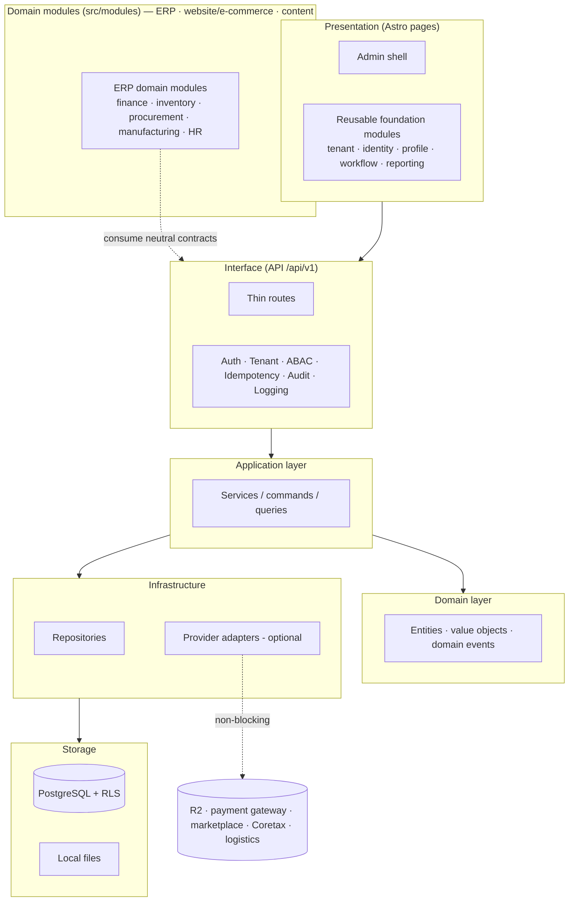
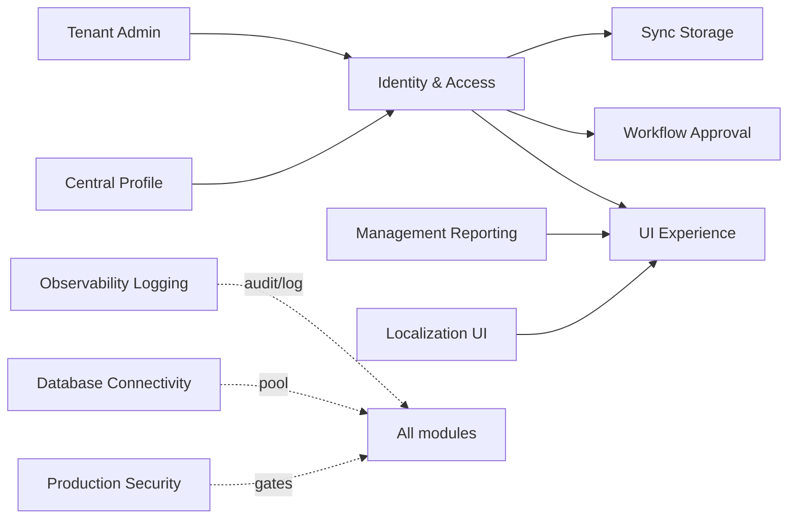
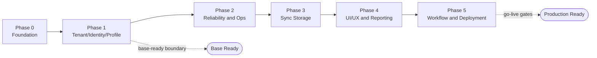

🇬🇧 English (source) · 🇮🇩 [Bahasa Indonesia](01_canvas_induk.id.md)

# Part 1 — Master Canvas of AWCMS Development Phases

> **Document status:** target/architecture plan; for actual code status see [`docs/ARCHITECTURE.md`](../ARCHITECTURE.md). This document describes the **base foundation + domain modules** of the `awcms` template, developed from the awcms-mini technical base. `awcms` is the **directly-used ERP/back-office template of the AWCMS family** ([ADR-0035](../adr/0035-awcms-online-first-erp-saas-superset-repositioning.md), [ADR-0034](../adr/0034-awcms-family-direct-use-templates-and-derived-pathway-removal.md)): domain modules (ERP, website/e-commerce, content) are added **directly in `src/modules/`** of this template — there is no separate extension/derived repo.

## Objective

Build the **AWCMS Modular Monolith** as a **directly-used ERP/back-office template of the AWCMS family** — secure, **hybrid online + offline with an online-first priority** (online = the main path; offline/LAN = a resilience mode), multi-tenant (RBAC/ABAC, audit, sync), and **ready for integrated ERP + SaaS** ([ADR-0035](../adr/0035-awcms-online-first-erp-saas-superset-repositioning.md)). `awcms` is the family's **superset** template: it **absorbs** the website/e-commerce module cluster, UI/UX, and auth hardening from awcms-micro straight into `src/modules/`. ERP domains and business solutions (finance/accounting, inventory/warehouse, procurement, manufacturing, HR/payroll) and business integrations (payment gateway, marketplace, tax/Coretax, logistics) are built **directly as `domain` modules in `src/modules/`** of this template ([ADR-0034](../adr/0034-awcms-family-direct-use-templates-and-derived-pathway-removal.md)) — not in a separate repo.

## Final stack (plan)

| Area             | Decision                                                                       |
| ---------------- | ------------------------------------------------------------------------------ |
| Runtime          | Bun                                                                            |
| Backend platform | Bun-only; Node.js only through a written exception                             |
| Web              | Astro 7                                                                        |
| Database         | PostgreSQL                                                                     |
| Architecture     | Modular monolith, microservice-ready                                           |
| Operating mode   | Hybrid online + offline, online-first priority (offline/LAN = resilience mode) |
| Sync             | Optional online sync                                                           |
| Storage          | Local file, optional Cloudflare R2                                             |
| Security         | RBAC + ABAC + PostgreSQL RLS + Audit Log                                       |
| API docs         | OpenAPI                                                                        |
| Event docs       | AsyncAPI                                                                       |

## Logical architecture (plan)



## Inter-module dependencies (base)



> Domain modules (ERP: finance/GL, inventory/warehouse, procurement, manufacturing, HR/payroll, payment gateway/marketplace/tax/logistics integrations; website/e-commerce; content) now **live directly in `src/modules/` of this template** as `domain`-typed modules ([ADR-0034](../adr/0034-awcms-family-direct-use-templates-and-derived-pathway-removal.md)/[ADR-0035](../adr/0035-awcms-online-first-erp-saas-superset-repositioning.md)), not in a separate extension repo.

> The technical design of the base implementation follows the pattern of the equivalent follow-on documents: UI/UX, frontend & integration (hybrid online-first), backend data access & database, seed/RBAC/ABAC, configuration/environment. Domain modules added directly in `src/modules/` follow the same document pattern inside this template.

## Design principles

1. The system must be able to run locally without internet.
2. Internet is only needed for sync, R2, or optional external integrations (payment gateway, marketplace, Coretax, logistics).
3. Modules (base as well as domain) must not depend on an external provider for their core operation.
4. Every transaction/document that has already been posted (journals, invoices, warehouse documents, etc.) must be immutable.
5. High-risk mutations must be idempotent.
6. The database must be tenant-aware.
7. Append-only data changes (stock, journal, movement) must be recorded as a movement/event, not an overwrite.
8. All sensitive access must pass through ABAC and audit.
9. Master/config/draft resources that can be deleted use soft delete; posted documents stay immutable.
10. Documents, code, migrations, OpenAPI, AsyncAPI, and SOPs must stay consistent.

## Main modules (base, reusable)

| Module                | Function                                           |
| --------------------- | -------------------------------------------------- |
| Tenant Admin          | Tenant, office, setup wizard                       |
| Identity & Access     | Login, tenant user, RBAC, ABAC, decision log       |
| Central Profile       | Centralised user/customer/supplier/contact profile |
| Sync Storage          | Sync node, outbox/inbox, conflict, R2 object queue |
| Localization UI       | i18n, locale, theme                                |
| UI Experience         | Admin shell, navigation registry, theme, i18n      |
| Observability Logging | Log, audit, security event, troubleshooting        |
| Database Connectivity | Pooling, queue, PgBouncer profile, health          |
| Workflow Approval     | Approval of high-risk actions                      |
| Management Reporting  | Generic dashboards and reports                     |
| Production Security   | Readiness, finding, go-live gates                  |

Domain modules (ERP: finance/GL, inventory/warehouse, procurement, manufacturing, HR/payroll, payment gateway/marketplace/tax-Coretax/logistics integrations; website/e-commerce; content) are **added directly in `src/modules/` of this template** as `domain`-typed modules ([ADR-0034](../adr/0034-awcms-family-direct-use-templates-and-derived-pathway-removal.md)/[ADR-0035](../adr/0035-awcms-online-first-erp-saas-superset-repositioning.md)), composed through the base module registry — there is no separate extension/derived repo. `awcms` is the **superset** template: awcms-micro's website/e-commerce cluster has already been absorbed as far as it landed, and the rest is **built here** through its own admission ADR ([ADR-0055](../adr/0055-development-confined-to-awcms-and-awcms-astro.md) §1). `awcms-mini` and `awcms-micro` are **archives** — both may be read as historical reference, not as living family templates.

## Development phases (base, plan)



### Phase 0 — Foundation

- Repository skeleton.
- Module contract.
- SQL migration runner.
- OpenAPI/AsyncAPI baseline.
- Docker Compose PostgreSQL.
- Health endpoint.

### Phase 1 — Tenant, Identity, Profile

- Tenant and office.
- Setup wizard.
- Owner/admin login.
- Central profile.
- Profile resolver.
- RBAC and ABAC.

### Phase 2 — Reliability and Operations

- Structured logging.
- Audit trail.
- Database pooling.
- Backpressure.
- Backup/restore SOP.

### Phase 3 — Sync Storage

- Offline sync outbox/inbox.
- Conflict resolution.
- R2 object queue.

### Phase 4 — UI/UX and Reporting

- Admin shell.
- Navigation registry.
- Generic management reporting views.

### Phase 5 — Workflow, Security, Deployment

- Workflow approval.
- Security readiness.
- Go-live gates.
- Deployment profile.
- Handover.

Once the base foundation is mature, domain modules (ERP: finance, inventory, procurement, manufacturing, HR/payroll; website/e-commerce; content) and business integration modules are added **directly in `src/modules/` of this template** as `domain`-typed modules ([ADR-0034](../adr/0034-awcms-family-direct-use-templates-and-derived-pathway-removal.md)/[ADR-0035](../adr/0035-awcms-online-first-erp-saas-superset-repositioning.md)) — each with its own development phases, following the base module pattern.

## Base-ready boundary (target)

The AWCMS base will be considered ready to use (to start adding ERP domain modules directly in `src/modules/`) when:

- Tenant setup succeeds.
- Owner/admin login works.
- Basic roles and ABAC default deny work.
- The central profile resolver works.
- High-risk audit log is available.
- Deleted master data is not physically lost and can be restored by an authorized role.
- Backup/restore is tested.

## Production-ready boundary (target)

Production-ready when:

- Base ready is complete.
- RLS tested.
- ABAC tested.
- High-risk audit active.
- Soft delete, restore, and purge policy tested for deletable resources.
- No critical security finding.
- Backup restore pass.
- Pool health OK.
- Basic concurrency/load test OK (high-risk mutations idempotent under parallel load).
- SOP and handover complete.

## Next action

Start the implementation from:

```text
Issue 0.1 — Initialize AWCMS Modular Monolith Repository Structure
```
