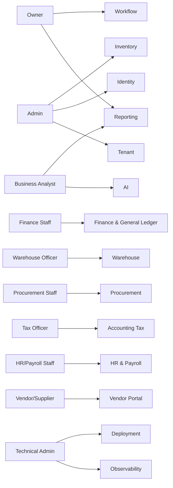
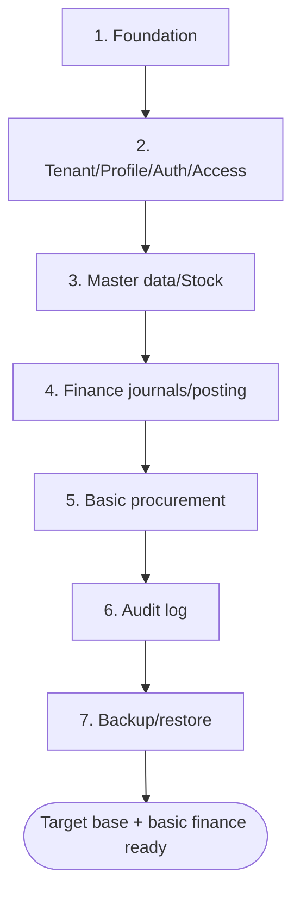

🇬🇧 English (source) · 🇮🇩 [Bahasa Indonesia](02_prd_detail_per_modul.id.md)

# Part 2 — Detailed PRD Per Module

> **Document status:** product target/plan, not implementation status. No ERP module has been implemented in this repo yet — this document lays out the product requirements that **will** be built incrementally on top of the modular monolith base (see `01_canvas_induk.md`).

> **Domain example (illustrative).** This document uses the ERP domain (finance/accounting, inventory/warehouse, procurement, manufacturing, HR/payroll) as a running example. Its **patterns & standards** are reusable for the AWCMS base; the **entities, endpoints, screens, and domain terms** (product, warehouse, tax, procurement, payroll, etc.) are an initial illustration that will be refined as the modules get built. See [the document package README](README.md) §Reusable vs ERP domain.

## PRD purpose

This document describes the AWCMS product requirements from the business, user, feature, priority, and acceptance-criteria angles, per module.

## Persona-to-module map

## Main personas

| Persona           | Needs                                                                  |
| ----------------- | ---------------------------------------------------------------------- |
| Owner             | Business performance monitoring, cash, stock, approvals, reports, risk |
| Admin             | Tenant setup, users, master data, configuration                        |
| Finance Staff     | Journals, AP/AR, reconciliation, financial reports                     |
| Warehouse Officer | Transfers, receiving, cycle count, bin/lot stock                       |
| Procurement Staff | Purchase requests, purchase orders, goods receipt, vendors             |
| Tax Officer       | Tax profile, tax invoices, Coretax batch export                        |
| HR/Payroll Staff  | Employee data, attendance, salary components, payroll run              |
| Business Analyst  | Aggregate reports and safe AI insight                                  |
| Vendor/Supplier   | Seeing PO, invoice, and payment status                                 |
| Technical Admin   | Deployment, backup, restore, troubleshooting                           |

## Module 1 — Tenant Admin

### Problem

AWCMS must support tenants, business entities, branches, offices, warehouses, and physical locations.

### Scope

- Tenant master.
- Office/branch/warehouse/plant.
- Physical location.
- Initial setup wizard.
- Setup lock.

### Acceptance criteria

- The first tenant can be created.
- The first owner can be created.
- The first office can be created.
- Setup cannot be run again once locked.
- An inactive tenant cannot carry out transactions.
- Offices/locations that are no longer used can be archived via soft delete without deleting transaction history.

## Module 2 — Identity & Access

### Problem

Every user must have a login and access rights matching their job.

### Scope

- Identity login.
- Tenant user membership.
- Role.
- Permission.
- ABAC policy.
- Access decision log.

### Acceptance criteria

- Owner/admin/operator can log in.
- ABAC default deny.
- Deny overrides allow.
- Warehouse staff cannot access sensitive payroll/tax data.
- Access denied is recorded.

## Module 3 — Central Profile

### Problem

User, employee, customer, supplier/vendor, and tax party data must not be duplicated.

### Scope

- Person/organization profile.
- Email, phone, WhatsApp, NPWP, NIK identifiers.
- Masked value.
- Entity link.
- Dedup/merge request.

### Acceptance criteria

- A vendor/supplier can be resolved from email/NPWP.
- A duplicate identifier does not create a new profile.
- A profile can be linked to a user/employee/vendor/tax party.
- A high-risk merge requires approval.
- Inactive profiles/contacts can be archived; sensitive identifiers stay masked and are not physically deleted before retention.

## Module 4 — Master Data & Inventory

### Problem

The ERP modules (procurement, manufacturing, warehouse) need consistent item/product masters, units, prices, stock, and movements.

### Scope

- Category.
- Brand/vendor.
- Unit.
- Item/product (raw material, finished goods, services).
- Item price/cost.
- Stock balance.
- Stock movement.

### Acceptance criteria

- An item can be created.
- Item code is unique per tenant.
- Barcode is unique when filled in.
- An inactive item cannot be used in new transactions.
- Stock movements are append-only.
- Item/category/brand/unit can be archived via soft delete if not currently used by an active transaction.

## Module 5 — Finance & General Ledger

### Problem

The business needs journal recording, AP/AR, and period closing that are accurate and not doubled.

### Scope

- Chart of account.
- General journal and automatic journals from other modules.
- Account payable (AP) and account receivable (AR).
- Journal posting.
- Idempotency.
- Period closing.
- Financial document (invoice, payment voucher).

### Acceptance criteria

- Finance staff can create a manual journal.
- Total debit/credit is validated server-side (balance check).
- Posting locks the period according to policy.
- A double submit does not create a duplicate journal.
- An unbalanced total produces a validation error.
- A posted journal is immutable.
- A draft journal can be cancelled/archived; a posted journal must NOT be soft-deleted — correct it with a reversing entry.

## Module 6 — Shared Stock Routing (Multi-entity)

### Problem

Several tenants/business entities can share stock at the same physical location (e.g. a business group with a shared warehouse), with transactions routed to a specific entity.

### Scope

- Stock pool.
- Stock pool member.
- Item mapping between entities.
- Routing rule.
- Routing decision.
- Settlement guardrail.

### Acceptance criteria

- A stock pool has tenant/entity members.
- A routing rule picks the entity based on conditions.
- The legal basis is recorded.
- Routing decisions are audited.
- Old rules are archived via soft delete so routing history stays auditable.

## Module 7 — Warehouse Management

### Problem

Multiple warehouses (including raw-material and finished-goods warehouses in manufacturing) require warehouse, zone, bin, lot, serial, transfer, in-transit, and cycle count.

### Scope

- Warehouse.
- Zone.
- Bin.
- Bin balance.
- Lot/batch/expiry.
- Serial.
- Transfer order.
- Shipment/receipt.
- Cycle count.
- Stock adjustment request.

### Acceptance criteria

- A warehouse is created from an office.
- Bin code is unique per warehouse.
- Inter-warehouse transfers can be shipped/received.
- Partial receipt is supported.
- Damaged/expired goods go into quarantine.
- A cycle count produces a variance and an adjustment request.
- Zone/bin masters can be archived via soft delete if they hold no active stock; movements stay append-only.

## Module 8 — Accounting Tax/Coretax

### Problem

AWCMS must be ready for Indonesian tax and Coretax without assuming an official upload API exists.

### Scope

- Tax profile.
- NITKU/ID TKU.
- Party tax profile (vendor, customer, employee for PPh).
- Product/item tax profile.
- VAT invoice staging.
- XML-ready Coretax batch.
- Checksum and approval.

### Acceptance criteria

- NPWP/NIK/NITKU are masked.
- A VAT invoice can be generated from a posted sales/purchase transaction.
- Missing tax data is detected.
- A Coretax batch requires approval when the policy is active.
- Old tax profiles are archived via soft delete; exported invoices and batches stay immutable.

## Module 9 — Procurement & Vendor Management

### Problem

The business needs a structured goods/services procurement flow, from request through receipt and payment to the vendor.

### Scope

- Purchase request.
- Purchase order.
- Vendor/supplier master.
- Goods receipt.
- Vendor invoice matching.
- PO status notification (email/WhatsApp) to the vendor.
- Vendor portal.

### Acceptance criteria

- A purchase request can be submitted and approved via workflow.
- A purchase order is created from an approved purchase request.
- A goods receipt must not exceed the PO quantity without approval.
- Vendor invoices are matched (three-way match: PO, receipt, invoice).
- A vendor only sees its own POs/invoices in the portal.
- Draft vendors/PRs/POs can be cancelled/archived; a PO that has been partially received must NOT be soft-deleted.

## Module 10 — Sync Storage

### Problem

Offline nodes (branch/plant/warehouse) need to sync to the central server when online.

### Scope

- Sync node.
- Outbox/inbox.
- Push/pull.
- HMAC signature.
- Checkpoint.
- Conflict.
- Object queue/R2.

### Acceptance criteria

- Push/pull are signed.
- A duplicate batch is not applied twice.
- Conflicts are recorded immutably.
- File checksums are verified.

## Module 11 — AI Business Analyst

### Problem

Owners need fast business insight (cash, stock, procurement, payroll cost) without opening sensitive raw data.

### Scope

- Safe aggregate views.
- Read-only tools.
- Tool policy.
- Tool call audit.
- Optional external AI provider adapter.

### Acceptance criteria

- The AI cannot run raw SQL.
- The AI cannot mutate.
- The AI does not expose PII/raw payroll data.
- Every tool call is audited.

## Module 12 — UI Experience

### Scope

- Admin shell.
- Per-module operational screens (finance, warehouse, procurement) fullscreen/keyboard-first.
- Vendor/employee self-service portal.
- Light/dark/system theme.
- Initial ID/EN locales.
- Role-aware navigation.

### Acceptance criteria

- The admin sees a dashboard.
- Operational staff can work keyboard-first for high-volume transactions.
- The vendor/employee portal is mobile-friendly.
- The UI has loading/empty/error states.

## Module 13 — Observability, Pooling, Workflow, Security

### Scope

- Structured log.
- Audit log.
- DB pool.
- Backpressure.
- Workflow approval.
- Production security readiness.
- Go-live gates.

### Acceptance criteria

- A correlation ID is available.
- Secrets are redacted.
- Pool health can be checked.
- High-risk actions require approval.
- A critical security finding blocks go-live.

## Further ERP modules (planned, not fully detailed yet)

The following modules are part of the AWCMS business scope but are not detailed per-PRD in this document revision; they will be added as a separate part once the roadmap priority reaches them:

- **Manufacturing** — bill of material, work order, production tracking, raw-material consumption.
- **HR & Payroll** — employee data, attendance, salary components, payroll run, payslips.
- **External integrations** — payment gateway, marketplace, logistics/shipping.

## Initial priority target (roadmap, not an implemented MVP)

1. Foundation.
2. Tenant/profile/auth/access.
3. Master data/stock.
4. Finance journals/posting.
5. Basic procurement.
6. Audit log.
7. Backup/restore.

## Out of scope for the initial stage

- Payment gateway.
- Native mobile app.
- Advanced BI.
- Direct Coretax upload.
- AI mutation.
- Microservice split.
- Full manufacturing and HR/payroll (to follow once the base + finance/procurement/inventory are stable).
