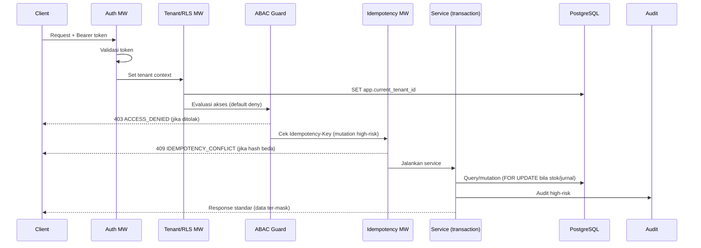
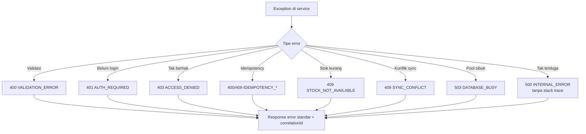

🇮🇩 Bahasa Indonesia · 🇬🇧 [English (source)](03_srs_detail_per_modul.md)

<!-- i18n-source-hash: sha256:fd9018f24acdb75abab7d6c9d27789c5f69aee82732ca5a036af6f99a06bd648 -->

# Bagian 3 — SRS Detail Per Modul

> **Status dokumen:** target/rencana teknis, bukan status implementasi. Belum ada modul ERP yang diimplementasikan di repo ini — dokumen ini menjabarkan kebutuhan teknis yang **akan** dipenuhi modul saat dibangun di atas base modular monolith (lihat `01_canvas_induk.md`).

> **Contoh domain (ilustratif).** Dokumen ini memakai domain ERP (keuangan/akuntansi, inventori/gudang, procurement, manufaktur, HR/payroll) sebagai contoh berjalan. **Pola & standar**-nya reusable untuk base AWCMS; **entitas, endpoint, layar, dan istilah domain** adalah ilustrasi yang akan disempurnakan seiring modul dibangun. Lihat [README paket dokumen](README.md) §Reusable vs domain ERP.

## Tujuan SRS

Dokumen ini menjabarkan kebutuhan teknis AWCMS per modul, mencakup functional requirement, non-functional requirement, validation, audit, security, dan integration point.

## Pipeline request lintas modul

## Requirement umum lintas modul

### Multi-tenant

- Semua tabel tenant-scoped wajib memiliki `tenant_id`.
- Semua query tenant-scoped wajib memfilter tenant aktif.
- RLS wajib aktif pada tabel tenant-scoped.
- Tenant context wajib diset dalam transaction.

### Security

- Auth wajib kecuali endpoint public eksplisit.
- ABAC default deny.
- Data sensitif wajib dimasking.
- Error response tidak boleh expose stack trace.
- Provider secret hanya dari environment.

### Transaction safety

- Mutation high-risk wajib `Idempotency-Key`.
- Transaksi finance/procurement/gudang wajib atomic.
- Stock row/bin balance/saldo akun yang berubah wajib dikunci.
- Posted financial document (jurnal, invoice) immutable.
- Movement stok dan jurnal append-only.

### Soft delete

- Resource master/config/draft yang deletable wajib memakai soft delete: isi `deleted_at`, `deleted_by`, dan `delete_reason`; jangan `DELETE` fisik pada jalur operasional normal.
- Query list/detail default wajib `deleted_at IS NULL`; include archived/deleted hanya lewat permission eksplisit dan parameter API terdokumentasi.
- Restore dan purge adalah aksi high-risk: butuh ABAC, audit, dan idempotency bila endpoint mutation dapat diulang.
- Posted jurnal, posted stock movement, audit log, security event, sync conflict, VAT invoice exported/accepted, dan Coretax batch exported tidak boleh di-soft-delete; koreksi lewat reversal/cancel/return/adjustment atau status lifecycle.
- Soft-deleted record tetap tenant-scoped, tetap terkena RLS, dan tetap masuk retention/legal hold.

### Audit

Audit wajib untuk:

- Login failed/success.
- Access assignment.
- Profile merge.
- Perubahan harga/cost item.
- Soft delete, restore, dan purge resource tenant-scoped.
- Jurnal posted/reversal.
- Purchase order approve/cancel.
- Stock adjustment.
- Warehouse transfer.
- Coretax export.
- Sync conflict resolution.
- AI tool call.
- Security readiness decision.

## 1. Tenant Admin

### Functional requirement

- Sistem dapat membuat tenant pertama melalui setup wizard.
- Sistem dapat membuat office dengan tipe `head_office`, `branch`, `store`, `warehouse`, `factory`, `other`.
- Sistem dapat mengunci setup setelah selesai.
- Sistem dapat menonaktifkan tenant/office.

### Validation

- `tenant_code` unik.
- `office_code` unik per tenant.
- Setup initialize ditolak jika setup locked.

### Security

- Endpoint setup hanya public sebelum setup locked.
- Setelah locked, setup initialize ditolak.
- Tenant inactive tidak dapat dipakai transaksi.

## 2. Identity & Access

### Functional requirement

- User dapat login.
- User terkait ke tenant melalui `tenant_user`.
- Role dapat diassign.
- ABAC mengevaluasi action berdasarkan module, activity, resource, context, dan environment.

### Validation

- Password wajib memenuhi policy.
- Login identifier unik.
- Tenant user inactive ditolak.

### Security

- Password disimpan dalam hash modern.
- Failed login dicatat.
- Default deny.
- Deny overrides allow.

## 3. Central Profile

### Functional requirement

- Membuat profile person/organization.
- Menambahkan identifier.
- Resolve profile berdasarkan email/phone/WhatsApp/NPWP/NIK/vendor code.
- Link profile ke entity lintas modul (karyawan, vendor, customer, tax party).
- Merge profile melalui workflow.

### Validation

- Identifier dinormalisasi.
- Identifier hash unik per tenant/type.
- Profile merge tidak boleh source = target.

### Security

- Identifier sensitif dimasking.
- Raw value tidak tampil ke response umum.
- Merge high-risk diaudit dan membutuhkan approval.

## 4. Master Data & Inventory

### Functional requirement

- CRUD item/produk (bahan baku, barang jadi, jasa).
- Item search by kode, barcode, nama.
- Harga/cost aktif berdasarkan periode.
- Stok per office/gudang.
- Stock movement append-only.

### Validation

- Kode item unik per tenant.
- Barcode unik jika ada.
- Quantity tidak boleh negatif kecuali movement delta yang valid.
- Item inactive tidak boleh dipakai transaksi baru.

### Security

- Price/cost update butuh permission.
- Adjustment stok butuh reason dan audit.

## 5. Finance & General Ledger

### Functional requirement

- Membuat jurnal manual dan otomatis dari modul lain.
- Menambahkan/mengubah/menghapus baris jurnal draft.
- Menghitung total debit/kredit server-side.
- Posting jurnal.
- Membuat financial document, lines, audit, domain event.

### Validation

- Jurnal status harus `draft` sebelum posting.
- Total debit harus sama dengan total kredit.
- Periode akuntansi harus terbuka.
- Idempotency key wajib untuk posting.

### Security

- Staf keuangan hanya akses entitas/office sesuai ABAC.
- Perubahan chart of account mengikuti permission.
- Error validasi user-friendly.
- Provider eksternal tidak dipanggil dalam DB transaction.

## 6. Shared Stock Routing

### Functional requirement

- Membuat stock pool.
- Menambahkan member tenant/entitas.
- Mapping item antar tenant/entitas.
- Routing transaksi berdasarkan rule.
- Mencatat routing decision.

### Validation

- Rule harus punya legal basis.
- Effective date valid.
- Target tenant harus member pool.

### Security

- Routing rule create/approve butuh permission.
- Routing decision diaudit.

## 7. Warehouse Management

### Functional requirement

- Warehouse dari office.
- Zone dan bin.
- Bin balance.
- Lot/batch/serial/expired.
- Transfer order, shipment, receipt.
- In-transit balance.
- Cycle count.
- Stock adjustment request.

### Validation

- Source dan destination warehouse tidak boleh sama.
- Ship tidak boleh melebihi approved quantity.
- Receive tidak boleh melebihi shipped quantity.
- Expired/damaged masuk quarantine.

### Security

- Warehouse scope via ABAC.
- Adjustment membutuhkan reason.
- High-risk adjustment membutuhkan approval.

## 8. Accounting Tax/Coretax

### Functional requirement

- Tax profile tenant.
- Tax business unit/NITKU.
- Party tax profile (vendor/customer/karyawan).
- Product/item tax profile.
- Generate VAT invoice dari transaksi posted.
- Validate VAT invoice.
- Coretax XML batch export.

### Validation

- Missing NPWP/NITKU/product tax profile menghasilkan error validasi.
- VAT invoice exported/accepted locked.
- Batch export menyimpan checksum.

### Security

- Tax data dimasking untuk non-tax role.
- Export membutuhkan audit dan approval jika policy aktif.

## 9. Procurement & Vendor Management

### Functional requirement

- Membuat purchase request.
- Approve/reject purchase request via workflow.
- Membuat purchase order dari purchase request disetujui.
- Mencatat goods receipt.
- Vendor invoice matching (three-way match).
- Vendor portal tokenized.

### Validation

- Purchase request status harus `approved` sebelum jadi PO.
- Goods receipt tidak boleh melebihi quantity PO.
- Idempotency key wajib untuk approve/PO create.

### Security

- Provider API key (notifikasi vendor) dari env.
- Data kontak vendor dimasking.
- Token vendor portal tidak sequential.

## 10. Sync Storage

### Functional requirement

- Register sync node.
- Push/pull event.
- Store checkpoint.
- Detect conflict.
- Resolve conflict manual.
- Upload object queue to R2 optional.

### Validation

- HMAC valid.
- Timestamp anti replay.
- Duplicate event idempotent.

### Security

- Node inactive ditolak.
- Posted transaction immutable.
- Conflict high-risk butuh audit.

## 11. AI Business Analyst

### Functional requirement

- Chat endpoint.
- Safe aggregate tools.
- Tool policy.
- Audit tool call.

### Security

- Read-only.
- No raw SQL.
- No mutation.
- No raw PII/tax/payroll identity.

## 12. UI Experience

### Functional requirement

- Admin dashboard.
- Layar operasional finance/gudang/procurement fullscreen.
- Vendor/employee self-service portal.
- Navigation role-aware.
- Dark/light/system theme.
- i18n minimal EN/ID (default **EN**), string UI via katalog `.po` gettext.

### Security

- UI hiding bukan kontrol utama.
- Backend tetap validasi permission.

## 13. Observability, Pooling, Workflow, Security

### Functional requirement

- Structured log.
- Audit log.
- Pool health.
- Backpressure.
- Workflow approval.
- Security readiness.
- Go-live gates.

### Security

- Redaction wajib.
- Critical security control fail memblokir go-live.

## Error code standar

| Code                   | HTTP | Arti                        |
| ---------------------- | ---: | --------------------------- |
| `VALIDATION_ERROR`     |  400 | Data tidak valid            |
| `AUTH_REQUIRED`        |  401 | Belum login                 |
| `ACCESS_DENIED`        |  403 | Tidak punya akses           |
| `TENANT_REQUIRED`      |  400 | Tenant wajib                |
| `RESOURCE_NOT_FOUND`   |  404 | Resource tidak ditemukan    |
| `IDEMPOTENCY_REQUIRED` |  400 | Idempotency key wajib       |
| `IDEMPOTENCY_CONFLICT` |  409 | Key dipakai request berbeda |
| `STOCK_NOT_AVAILABLE`  |  409 | Stok tidak cukup            |
| `SYNC_CONFLICT`        |  409 | Konflik sync                |
| `DATABASE_BUSY`        |  503 | Pool/DB sibuk               |
| `INTERNAL_ERROR`       |  500 | Kesalahan internal          |

## Testing requirement minimum

- Unit test untuk business logic.
- Integration test untuk migration, RLS, posting jurnal, warehouse transfer.
- API contract test untuk OpenAPI.
- AsyncAPI event validation.
- Security test untuk cross-tenant dan access denied.
- Performance test untuk transaksi concurrent dan DB pool.
