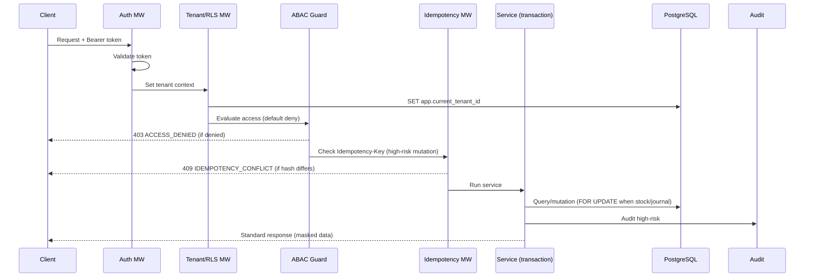
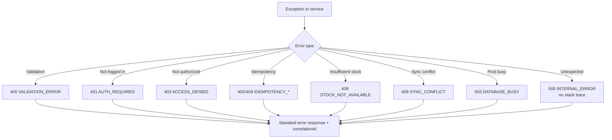

🇬🇧 English (source) · 🇮🇩 [Bahasa Indonesia](03_srs_detail_per_modul.id.md)

# Part 3 — Detailed SRS Per Module

> **Document status:** target/technical plan, not implementation status. No ERP module has been implemented in this repo yet — this document sets out the technical requirements the modules **will** satisfy once they are built on top of the modular monolith base (see `01_canvas_induk.md`).

> **Domain example (illustrative).** This document uses the ERP domain (finance/accounting, inventory/warehouse, procurement, manufacturing, HR/payroll) as a running example. The **patterns & standards** are reusable for the AWCMS base; the **entities, endpoints, screens, and domain terms** are illustrations that will be refined as the modules are built. See [documentation package README](README.md) §Reusable vs ERP domain.

## SRS purpose

This document sets out the technical requirements of AWCMS per module, covering functional requirements, non-functional requirements, validation, audit, security, and integration points.

## Cross-module request pipeline

## Cross-module general requirements

### Multi-tenant

- Every tenant-scoped table must have `tenant_id`.
- Every tenant-scoped query must filter by the active tenant.
- RLS must be active on tenant-scoped tables.
- The tenant context must be set inside the transaction.

### Security

- Auth is mandatory except on explicitly public endpoints.
- ABAC default deny.
- Sensitive data must be masked.
- Error responses must not expose a stack trace.
- Provider secrets come only from the environment.

### Transaction safety

- High-risk mutations require an `Idempotency-Key`.
- Finance/procurement/warehouse transactions must be atomic.
- A stock row/bin balance/account balance that changes must be locked.
- A posted financial document (journal, invoice) is immutable.
- Stock movements and journals are append-only.

### Soft delete

- Deletable master/config/draft resources must use soft delete: fill `deleted_at`, `deleted_by`, and `delete_reason`; do not do a physical `DELETE` on the normal operational path.
- Default list/detail queries must apply `deleted_at IS NULL`; including archived/deleted rows happens only through an explicit permission and a documented API parameter.
- Restore and purge are high-risk actions: they need ABAC, audit, and idempotency when the mutation endpoint can be repeated.
- Posted journals, posted stock movements, audit logs, security events, sync conflicts, exported/accepted VAT invoices, and exported Coretax batches must not be soft-deleted; correct them through reversal/cancel/return/adjustment or a lifecycle status.
- A soft-deleted record is still tenant-scoped, is still subject to RLS, and is still covered by retention/legal hold.

### Audit

Audit is mandatory for:

- Login failed/success.
- Access assignment.
- Profile merge.
- Item price/cost changes.
- Soft delete, restore, and purge of a tenant-scoped resource.
- Journal posted/reversal.
- Purchase order approve/cancel.
- Stock adjustment.
- Warehouse transfer.
- Coretax export.
- Sync conflict resolution.
- AI tool call.
- Security readiness decision.

## 1. Tenant Admin

### Functional requirement

- The system can create the first tenant through the setup wizard.
- The system can create an office of type `head_office`, `branch`, `store`, `warehouse`, `factory`, `other`.
- The system can lock setup once it is finished.
- The system can deactivate a tenant/office.

### Validation

- `tenant_code` is unique.
- `office_code` is unique per tenant.
- Setup initialize is rejected when setup is locked.

### Security

- The setup endpoint is public only before setup is locked.
- After it is locked, setup initialize is rejected.
- An inactive tenant cannot be used for transactions.

## 2. Identity & Access

### Functional requirement

- A user can log in.
- A user is linked to a tenant through `tenant_user`.
- Roles can be assigned.
- ABAC evaluates an action based on module, activity, resource, context, and environment.

### Validation

- Passwords must satisfy the policy.
- The login identifier is unique.
- An inactive tenant user is rejected.

### Security

- Passwords are stored in a modern hash.
- Failed logins are recorded.
- Default deny.
- Deny overrides allow.

## 3. Central Profile

### Functional requirement

- Create a person/organization profile.
- Add an identifier.
- Resolve a profile by email/phone/WhatsApp/NPWP/NIK/vendor code.
- Link a profile to an entity across modules (employee, vendor, customer, tax party).
- Merge profiles through a workflow.

### Validation

- Identifiers are normalized.
- The identifier hash is unique per tenant/type.
- A profile merge must not have source = target.

### Security

- Sensitive identifiers are masked.
- Raw values do not appear in general responses.
- A high-risk merge is audited and requires approval.

## 4. Master Data & Inventory

### Functional requirement

- CRUD for items/products (raw materials, finished goods, services).
- Item search by code, barcode, name.
- Active price/cost by period.
- Stock per office/warehouse.
- Append-only stock movements.

### Validation

- The item code is unique per tenant.
- The barcode is unique when present.
- Quantity must not be negative except for a valid movement delta.
- An inactive item must not be used in new transactions.

### Security

- Price/cost updates need a permission.
- Stock adjustments need a reason and an audit.

## 5. Finance & General Ledger

### Functional requirement

- Create manual journals and automatic journals from other modules.
- Add/change/remove draft journal lines.
- Compute total debit/credit server-side.
- Post a journal.
- Create the financial document, lines, audit, domain event.

### Validation

- The journal status must be `draft` before posting.
- Total debit must equal total credit.
- The accounting period must be open.
- An idempotency key is mandatory for posting.

### Security

- Finance staff only access the entities/offices allowed by ABAC.
- Chart of account changes follow the permission.
- Validation errors are user-friendly.
- External providers are not called inside a DB transaction.

## 6. Shared Stock Routing

### Functional requirement

- Create a stock pool.
- Add tenant/entity members.
- Map items between tenants/entities.
- Route transactions based on rules.
- Record the routing decision.

### Validation

- A rule must have a legal basis.
- The effective date is valid.
- The target tenant must be a member of the pool.

### Security

- Routing rule create/approve needs a permission.
- Routing decisions are audited.

## 7. Warehouse Management

### Functional requirement

- Warehouse from an office.
- Zone and bin.
- Bin balance.
- Lot/batch/serial/expiry.
- Transfer order, shipment, receipt.
- In-transit balance.
- Cycle count.
- Stock adjustment request.

### Validation

- The source and destination warehouse must not be the same.
- Ship must not exceed the approved quantity.
- Receive must not exceed the shipped quantity.
- Expired/damaged goods go into quarantine.

### Security

- Warehouse scope via ABAC.
- Adjustments require a reason.
- High-risk adjustments require approval.

## 8. Accounting Tax/Coretax

### Functional requirement

- Tenant tax profile.
- Tax business unit/NITKU.
- Party tax profile (vendor/customer/employee).
- Product/item tax profile.
- Generate a VAT invoice from a posted transaction.
- Validate a VAT invoice.
- Coretax XML batch export.

### Validation

- A missing NPWP/NITKU/product tax profile produces a validation error.
- An exported/accepted VAT invoice is locked.
- Batch export stores a checksum.

### Security

- Tax data is masked for non-tax roles.
- Export requires audit and approval when the policy is active.

## 9. Procurement & Vendor Management

### Functional requirement

- Create a purchase request.
- Approve/reject a purchase request via a workflow.
- Create a purchase order from an approved purchase request.
- Record a goods receipt.
- Vendor invoice matching (three-way match).
- Tokenized vendor portal.

### Validation

- The purchase request status must be `approved` before it becomes a PO.
- A goods receipt must not exceed the PO quantity.
- An idempotency key is mandatory for approve/PO create.

### Security

- The provider API key (vendor notification) comes from env.
- Vendor contact data is masked.
- Vendor portal tokens are not sequential.

## 10. Sync Storage

### Functional requirement

- Register a sync node.
- Push/pull events.
- Store a checkpoint.
- Detect conflicts.
- Resolve conflicts manually.
- Optionally upload the object queue to R2.

### Validation

- The HMAC is valid.
- Timestamp anti-replay.
- Duplicate events are idempotent.

### Security

- An inactive node is rejected.
- A posted transaction is immutable.
- A high-risk conflict needs an audit.

## 11. AI Business Analyst

### Functional requirement

- Chat endpoint.
- Safe aggregate tools.
- Tool policy.
- Audit tool calls.

### Security

- Read-only.
- No raw SQL.
- No mutation.
- No raw PII/tax/payroll identity.

## 12. UI Experience

### Functional requirement

- Admin dashboard.
- Fullscreen finance/warehouse/procurement operational screens.
- Vendor/employee self-service portal.
- Role-aware navigation.
- Dark/light/system theme.
- i18n minimum EN/ID (default **EN**), UI strings via the gettext `.po` catalogue.

### Security

- UI hiding is not the primary control.
- The backend still validates the permission.

## 13. Observability, Pooling, Workflow, Security

### Functional requirement

- Structured log.
- Audit log.
- Pool health.
- Backpressure.
- Workflow approval.
- Security readiness.
- Go-live gates.

### Security

- Redaction is mandatory.
- A failing critical security control blocks go-live.

## Standard error codes

| Code                   | HTTP | Meaning                         |
| ---------------------- | ---: | ------------------------------- |
| `VALIDATION_ERROR`     |  400 | Data is not valid               |
| `AUTH_REQUIRED`        |  401 | Not logged in                   |
| `ACCESS_DENIED`        |  403 | No access                       |
| `TENANT_REQUIRED`      |  400 | Tenant is mandatory             |
| `RESOURCE_NOT_FOUND`   |  404 | Resource not found              |
| `IDEMPOTENCY_REQUIRED` |  400 | Idempotency key is mandatory    |
| `IDEMPOTENCY_CONFLICT` |  409 | Key used by a different request |
| `STOCK_NOT_AVAILABLE`  |  409 | Not enough stock                |
| `SYNC_CONFLICT`        |  409 | Sync conflict                   |
| `DATABASE_BUSY`        |  503 | Pool/DB busy                    |
| `INTERNAL_ERROR`       |  500 | Internal error                  |

## Minimum testing requirement

- Unit tests for business logic.
- Integration tests for migration, RLS, journal posting, warehouse transfer.
- API contract tests for OpenAPI.
- AsyncAPI event validation.
- Security tests for cross-tenant and access denied.
- Performance tests for concurrent transactions and the DB pool.
