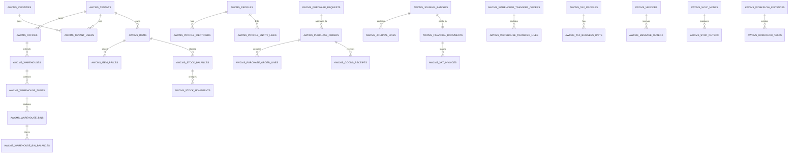
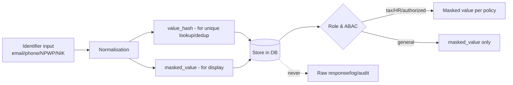

🇬🇧 English (source) · 🇮🇩 [Bahasa Indonesia](04_erd_data_dictionary.id.md)

# Part 4 — ERD and Detailed Data Dictionary

> **Document status:** target/planned database schema, not implementation status. No ERP module migration has been run in this repo yet — this document lays out the **planned** schema baseline, following the modular-monolith base pattern already proven on the previous base.

> **Domain example (illustrative).** This document uses the ERP domain (finance/accounting, inventory/warehouse, procurement, manufacturing, HR/payroll) as a running example. Its **patterns & standards** are reusable for the AWCMS base; the **entities, tables, and domain terms** are an initial illustration that will be refined as modules are built. See the [document package README](README.md) §Reusable vs ERP domain.

## Purpose

This document is the AWCMS database baseline: conceptual ERD, table ownership, a concise data dictionary, indexes, RLS, data classification, migration order, and retention — as a design target before implementation starts.

## Database principles

1. Every tenant-scoped table must have `tenant_id`.
2. Primary keys use UUID.
3. Timestamps use `timestamptz`.
4. Monetary/quantity values use `numeric`, not floating point.
5. Posted journals and posted stock movements are append-only.
6. Corrections use reversal/return/adjustment.
7. Child FKs must be indexed.
8. Tenant-scoped tables must have RLS.
9. Sensitive data is masked, and hashed for lookup/dedup where relevant.
10. Migrations must be sequential and audit-ready.
11. Deletable resources use soft delete; physical delete is only for authorized retention/legal purge.

## Main conceptual ERD (plan)



## Global column standard

| Column            | Type        | Function                                      |
| ----------------- | ----------- | --------------------------------------------- |
| `id`              | uuid        | Primary key                                   |
| `tenant_id`       | uuid        | Tenant isolation                              |
| `code`            | text        | Business code                                 |
| `status`          | text        | Lifecycle status                              |
| `created_at`      | timestamptz | Creation time                                 |
| `updated_at`      | timestamptz | Update time                                   |
| `created_by`      | uuid        | Creating actor                                |
| `updated_by`      | uuid        | Updating actor                                |
| `deleted_at`      | timestamptz | Soft delete where relevant                    |
| `deleted_by`      | uuid        | Actor who archived/soft-deleted               |
| `delete_reason`   | text        | Reason for soft delete/purge                  |
| `restored_at`     | timestamptz | Restore time if the resource supports restore |
| `restored_by`     | uuid        | Restoring actor                               |
| `sync_version`    | bigint      | Version for sync                              |
| `origin_node_id`  | uuid        | Origin offline/sync node                      |
| `idempotency_key` | text        | Mutation idempotency                          |

## Table ownership matrix (plan)

| Module                | Main tables (plan)                                                                                                                                                                                                   |
| --------------------- | -------------------------------------------------------------------------------------------------------------------------------------------------------------------------------------------------------------------- |
| Foundation            | `awcms_modules`, `awcms_schema_migrations`, `awcms_system_events`                                                                                                                                                    |
| Tenant Admin          | `awcms_tenants`, `awcms_offices`, `awcms_physical_locations`, `awcms_tenant_settings`                                                                                                                                |
| Profile Identity      | `awcms_profiles`, `awcms_profile_identifiers`, `awcms_profile_channels`, `awcms_profile_addresses`, `awcms_profile_entity_links`, `awcms_profile_merge_requests`                                                     |
| Identity Access       | `awcms_identities`, `awcms_tenant_users`, `awcms_sessions`, `awcms_password_reset_tokens`, `awcms_roles`, `awcms_permissions`, `awcms_abac_policies`, `awcms_abac_decision_logs`                                     |
| Master Data Inventory | `awcms_items`, `awcms_item_categories`, `awcms_units`, `awcms_item_prices`, `awcms_stock_balances`, `awcms_stock_movements`                                                                                          |
| Finance & GL          | `awcms_chart_of_accounts`, `awcms_journal_batches`, `awcms_journal_lines`, `awcms_financial_documents`, `awcms_idempotency_keys`                                                                                     |
| Shared Stock Routing  | `awcms_stock_pools`, `awcms_stock_pool_members`, `awcms_transaction_routing_rules`, `awcms_transaction_routing_decisions`                                                                                            |
| Warehouse             | `awcms_warehouses`, `awcms_warehouse_zones`, `awcms_warehouse_bins`, `awcms_inventory_lots`, `awcms_inventory_serials`, `awcms_warehouse_bin_balances`, `awcms_warehouse_transfer_orders`, `awcms_cycle_count_plans` |
| Accounting Tax        | `awcms_tax_profiles`, `awcms_tax_business_units`, `awcms_party_tax_profiles`, `awcms_product_tax_profiles`, `awcms_vat_invoices`, `awcms_coretax_batches`                                                            |
| Procurement           | `awcms_vendors`, `awcms_purchase_requests`, `awcms_purchase_orders`, `awcms_purchase_order_lines`, `awcms_goods_receipts`, `awcms_message_outbox`, `awcms_message_attempts`                                          |
| Sync Storage          | `awcms_sync_nodes`, `awcms_sync_outbox`, `awcms_sync_inbox`, `awcms_sync_conflicts`, `awcms_object_sync_queue`                                                                                                       |
| Email (base)          | `awcms_email_templates`, `awcms_email_messages`, `awcms_email_delivery_attempts`, `awcms_email_suppression_list`                                                                                                     |
| AI Analyst            | `awcms_ai_sessions`, `awcms_ai_messages`, `awcms_ai_tool_calls`, `awcms_ai_tool_policies`                                                                                                                            |
| Logging               | `awcms_log_events`, `awcms_audit_events`, `awcms_security_events`                                                                                                                                                    |
| Workflow              | `awcms_workflow_definitions`, `awcms_workflow_instances`, `awcms_workflow_tasks`, `awcms_workflow_decisions`                                                                                                         |
| Reporting             | report views/materialized views                                                                                                                                                                                      |
| Production Security   | `awcms_security_controls`, `awcms_security_readiness_assessments`, `awcms_security_findings`, `awcms_go_live_gates`                                                                                                  |
| Module Management     | `awcms_modules` (extended), `awcms_tenant_modules`, `awcms_module_dependencies`, `awcms_module_settings`, `awcms_module_navigation`, `awcms_module_jobs`, `awcms_module_health_checks`                               |
| Data Lifecycle        | `awcms_data_lifecycle_legal_holds`, `awcms_data_lifecycle_cursors`, `awcms_data_lifecycle_archive_manifests`, `awcms_data_lifecycle_runs`                                                                            |

Follow-on modules such as Manufacturing and HR/Payroll do not yet have a final table ownership matrix — it will be added when those modules are designed in detail (following the same `awcms_<domain>_<entity>` naming pattern).

## Concise per-module data dictionary (plan)

### `awcms_tenants`

| Column           | Type | Description               |
| ---------------- | ---- | ------------------------- |
| `id`             | uuid | PK                        |
| `tenant_code`    | text | Globally unique           |
| `tenant_name`    | text | Operational name          |
| `legal_name`     | text | Legal name                |
| `status`         | text | active/inactive/suspended |
| `default_locale` | text | en/id/ms/ar               |
| `default_theme`  | text | light/dark/system         |

Index: unique `tenant_code`.

`default_locale` — the tenant's default locale (minimum **en**, **id**), target default `'en'`. Effective locale = per-user preference (when present) → the tenant's `default_locale`.

### `awcms_offices`

| Column             | Type | Description                                      |
| ------------------ | ---- | ------------------------------------------------ |
| `tenant_id`        | uuid | Tenant scope                                     |
| `office_code`      | text | Unique per tenant                                |
| `office_name`      | text | Office/store/warehouse/factory name              |
| `office_type`      | text | head_office/branch/store/warehouse/factory/other |
| `parent_office_id` | uuid | Hierarchy                                        |
| `status`           | text | active/inactive                                  |

Index: `(tenant_id, office_code)`, `(tenant_id, office_type)`.

### `awcms_profiles`

Canonical profile for user/employee/vendor/customer/contact.

Important columns: `tenant_id`, `profile_type`, `display_name`, `legal_name`, `status`, `verification_status`, `risk_level`, `merged_into_profile_id`.

### `awcms_profile_identifiers`

Sensitive identifiers such as email, phone, WhatsApp, NPWP, NIK.

Important columns: `identifier_type`, `normalized_value`, `value_hash`, `masked_value`, `is_primary`, `verification_status`.

Constraint: unique `(tenant_id, identifier_type, value_hash)`.

### `awcms_principals`

**Implemented** (`sql/112`, [ADR-0085](../adr/0085-one-human-one-credential-many-tenants.md)). One row per **human**, keyed by a normalized email address. **GLOBAL — no `tenant_id`, no RLS**; what replaces RLS is four enforced controls (DB privileges narrowed with no `DELETE`, read-shape invariants via `bun run identity:principal-access:check`, `password_hash` never leaving the store module, and an authorization boundary that does not move). The sentence that makes the absence of RLS defensible: **a principal is an AUTHENTICATION fact, never an AUTHORIZATION fact** — holding one grants nothing, and every permission is still resolved through `awcms_tenant_users` under FORCE RLS.

Important columns: `email_normalized` (unique), `password_hash`, `failed_login_count`, `locked_until`.

### `awcms_principal_mfa_factors`

**Implemented** (`sql/114`, [ADR-0087](../adr/0087-mfa-moves-to-the-principal.md)). MFA factors belong to the **human**, not to a per-tenant identity: one enrolment authenticates every tenant they belong to. **GLOBAL — no `tenant_id`, no RLS**, standing on the same four substitute controls as `awcms_principals`. Secret encryption is unchanged from `sql/024`.

Important columns: `principal_id`, `factor_type`, `secret_ciphertext`, `status` (`pending`/`active`/`disabled`), `last_used_step` (the replay guard, and also the backfill selector), `failed_verify_count`, `locked_until`, `disabled_by_tenant_id`.

Constraint: partial unique `(principal_id, factor_type) WHERE status <> 'disabled'` — **one live factor per human**. Loosening it means one code guess is tested against N secrets at once and `failed_verify_count` is spread across N rows.

`disabled_by_tenant_id` records the tenant that **ordered** the administrative reset (NULL for a self-service `disable`). It exists because ADR-0087 refuses to write an audit row into every reachable tenant: FORCE RLS makes an `INSERT` carrying another `tenant_id` policy-rejected, and enumerating reachable tenants is a **cross-tenant membership oracle**. No FK — it names a tenant whose row owner may no longer belong to it, and a cascade must not rewrite MFA history.

### `awcms_principal_mfa_recovery_codes`

**Implemented** (`sql/114`, ADR-0087). Single-use backup codes belonging to the principal, the same sha256 construction as `sql/024`. Important columns: `principal_id`, `factor_id` (cascades from the factor), `code_hash`, `used_at`.

Constraint: unique `(principal_id, code_hash)` — **not** a global `code_hash`, because a 40-bit collision between two unrelated humans would surface as 23505 → 500, and that error is itself a faint cross-account signal.

### `awcms_identity_mfa_factors` / `awcms_identity_mfa_recovery_codes`

**SUPERSEDED** by the two tables above (`sql/114`, ADR-0087). Kept **populated as history** following the ADR-0079 precedent, and `awcms_app` privileges are downgraded to `SELECT` only (`RETIRED_TENANT_TABLE_PRIVILEGES`). That privilege downgrade is what makes the supersession real: an old factor table that is still WRITABLE is a second place to enroll a factor, and one human with two second factors of which only one is checked at login is worse than either table alone.

`awcms_mfa_challenges` and `awcms_tenant_mfa_policies` did **not** move and remain tenant-scoped under FORCE RLS: a challenge is one login attempt in one tenant (making it global would let it be exchanged for a session in another tenant), and a policy is one tenant's product decision (making it global would give one tenant power over another tenant's security posture).

### `awcms_identities`

Login identity **per tenant** (unique on `(tenant_id, login_identifier)`).

Important columns: `profile_id`, `login_identifier`, `password_hash`, `status`, `principal_id` (nullable), `last_login_at`.

Note: `password_hash` never leaves in a response/API/log.

**`failed_login_count` and `locked_until` in this table are HISTORY, not controls** — since `sql/113` ([ADR-0086](../adr/0086-the-lockout-counter-is-global.md)) they stopped deciding anything and the effective lockout counter lives in `awcms_principals`. The columns are left populated following the ADR-0079 precedent. Reading them to make a login decision would bring back defect #430: one human belonging to N tenants gets N counters again, and a tenant's value is not a secret.

### `awcms_password_reset_tokens`

Single-use password reset tokens. Important columns: `identity_id`, `token_hash` (unique — only the hash is stored), `expires_at`, `used_at` (single-use). RLS FORCE. A new request marks previously outstanding tokens as `used_at = now()` (superseded) before creating a new one.

### `awcms_items`

Item/product master (raw materials, finished goods, services).

Important columns: `tenant_id`, `sku`, `barcode`, `item_name`, `category_id`, `base_unit_id`, `tracking_type`, `status`.

Constraint: unique `(tenant_id, sku)`, unique `(tenant_id, barcode)` when barcode is not null.

### `awcms_stock_balances`

Stock balance per office/warehouse.

Important columns: `tenant_id`, `item_id`, `office_id`, `quantity_on_hand`, `quantity_reserved`, `quantity_available`.

Constraint: unique `(tenant_id, item_id, office_id)`.

### `awcms_stock_movements`

Append-only stock movements.

Important columns: `item_id`, `office_id`, `movement_type`, `quantity_delta`, `reference_module`, `reference_type`, `reference_id`, `posted_at`.

### `awcms_journal_batches`

Draft/posted journal batches.

Important columns: `tenant_id`, `office_id`, `period_id`, `status`, `total_debit`, `total_credit`, `posted_at`.

### `awcms_financial_documents`

Immutable posted financial documents (invoice, payment voucher).

Important columns: `source_journal_batch_id`, `document_no`, `office_id`, `party_profile_id`, `status`, `gross_total`, `tax_total`, `net_total`, `posted_at`.

Constraint: unique `(tenant_id, document_no)`.

### `awcms_warehouse_bin_balances`

Detailed stock balance per bin/lot/serial.

Important columns: `warehouse_id`, `zone_id`, `bin_id`, `item_id`, `lot_id`, `serial_id`, `quantity_on_hand`, `quantity_reserved`, `quantity_available`.

### `awcms_vat_invoices`

VAT invoice staging.

Important columns: `financial_document_id`, `tax_profile_id`, `tax_business_unit_id`, `invoice_no`, `status`, `dpp_total`, `vat_total`, `luxury_tax_total`.

### `awcms_purchase_orders`

Purchase order to a vendor.

Important columns: `vendor_profile_id`, `source_purchase_request_id`, `office_id`, `status`, `gross_total`, `tax_total`, `net_total`, `approved_at`.

### `awcms_message_outbox`

Vendor/employee notification queue (WhatsApp/email).

Important columns: `contact_id`, `channel_type`, `provider_code`, `message_type`, `payload_json`, `status`, `next_retry_at`.

### Email (base, generic)

Reusable base infrastructure for password reset, system announcements, and workflow notifications — different from `awcms_message_outbox` above (a procurement/HR domain example). RLS FORCE on all four tables; only `email_templates` is soft-deletable, the other three are based on status transitions + physical purge.

- **`awcms_email_templates`** — `template_key` (format `area.name`, e.g. `auth.password_reset`), `subject_template`/`text_body_template`/`html_body_template` as **per-locale jsonb** (`{"en": "...", "id": "..."}`), `is_active`. Unique `(tenant_id, template_key)` WHERE `deleted_at IS NULL`.
- **`awcms_email_messages`** — the outbox, one row = one delivery unit to one address. `category`, `template_key` (denormalized, not an FK), `to_address`/`to_address_hash`/`to_address_masked`, `variables` (jsonb, for re-rendering by the dispatcher — not a stored rendered body), `variables_hash`, `status` (`queued → sending → sent | failed → retry_wait → cancelled | suppressed`), `retry_count`, `next_attempt_at`.
- **`awcms_email_delivery_attempts`** — per-message attempt history (`message_id` FK), `outcome` (`success`/`failure`), `provider_response_snippet` (already redacted before insert).
- **`awcms_email_suppression_list`** — bounce/complaint/manual/unsubscribe block-list, lookup key `recipient_hash` (not the raw address).

### `awcms_sync_outbox`

Local events that need to be synchronised.

Important columns: `node_id`, `event_type`, `aggregate_type`, `aggregate_id`, `payload_json`, `status`.

### Module Management

A database-backed and tenant-aware module registry (an extension of `awcms_modules` since the foundation migration). The "registry" tables (dependencies/navigation/jobs/health-checks) are RLS-free — code-derived metadata, identical for every tenant; the two tenant-writable tables (`tenant_modules`/`module_settings`) are RLS FORCE.

- **`awcms_tenant_modules`** — per-tenant module enabled/disabled status. No row = enabled by default. Unique `(tenant_id, module_key)`. RLS FORCE.
- **`awcms_module_dependencies`** — the dependency graph between modules. Composite PK `(module_key, depends_on_module_key)`, a `CHECK` rejects self-dependency.
- **`awcms_module_settings`** — per-tenant non-secret settings override (`settings` jsonb, `schema_version`). Must not contain raw secrets/tokens — enforced in the application layer. Unique `(tenant_id, module_key)`. RLS FORCE.
- **`awcms_module_navigation`** — admin navigation entries per module (`label_key`, `path`, `sort_order`, `nav_group`, `required_permission`).
- **`awcms_module_jobs`** — registry of operational commands (documentation, not execution).
- **`awcms_module_health_checks`** — health check result history, instance-level. `status` (`healthy`/`degraded`/`failed`/`unknown`), `message` (redaction-ready).

Module lifecycle/config actions are recorded through the generic `awcms_audit_events` (`module_key = 'module_management'`), not a separate event table.

### Business scope (Issue #180, base, generic)

A **generic** organisational authorization layer owned by `identity_access` — it restricts access by organisational hierarchy without pulling real ERP domain entities into the base. `scope_type`/`scope_id` are **generic references** (text + uuid), **not** FKs to any organisation module's table: validity/ancestry is resolved in the application layer through the `BusinessScopeHierarchyPort` capability port supplied by the derived application (the base ships a no-op resolver → `resolved: false`). Both tables are RLS `ENABLE`+`FORCE`. See ADR-0030.

- **`awcms_business_scope_assignments`** — one row = one `tenant_user` granted a role/permission context bounded to one business scope. Columns: `tenant_user_id`, `role_id` (nullable), `scope_type` (snake_case, CHECK `^[a-z][a-z0-9_]*$`), `scope_id`, `effective_from`/`effective_to` (effective dating; `effective_to > effective_from`; a temporary assignment MUST have `effective_to`), `is_temporary`, `status` (`active`/`expired`/`revoked`), `revoked_at`/`revoked_by_tenant_user_id`/`revoke_reason` (kept consistent by a CHECK), `granted_by_tenant_user_id`, `approved_by_tenant_user_id`. **Composite FKs `(tenant_id, …)`** for subject/role/grantor/approver/revoker (targeting `UNIQUE (tenant_id, id)` on `awcms_tenant_users`/`awcms_roles`/this table itself) — PostgreSQL's RI check bypasses RLS, so a single-column FK can cross tenants (GHSA-r7cx-c4jh-cvvw); a composite forces the referenced row to sit in the same tenant. The authoritative "currently in force" gate is `now` vs the effective dating, not `status` (revocation/expiry take effect immediately). Never physically deleted — only status transitions.
- **`awcms_business_scope_assignment_events`** — **append-only** lifecycle history (`granted`/`revoked`/`expired`/`renewed`), composite FKs `(tenant_id, assignment_id)` + `(tenant_id, actor_tenant_user_id)`. Never UPDATEd/DELETEd.

The `identity-access:business-scope:expiry` job (worker, sql/027 grants `SELECT,UPDATE` on assignments + `INSERT` on events) flips `active` assignments whose `effective_to` has passed to `expired` + writes an event + an aggregate audit per tenant.

### Segregation of duties (Issue #181, base, generic)

A **generic** SoD restriction layer owned by `identity_access` (`sql/029`, RLS `ENABLE`+`FORCE`). The base does not hardcode domain rules: a `SoDRuleDescriptor` is declared in the derived module's `module.ts` (validated by `bun run identity-access:sod-registry:check`); the `rule_key` here refers to the **code** registry, not an FK to a table. See ADR-0031.

- **`awcms_sod_conflict_exceptions`** — a bounded-lifetime override (a sanctioned "administrative override") for a detected conflict. Columns: `rule_key` (CHECK `^[a-z][a-z0-9_]*\.[a-z][a-z0-9_]*$`), `subject_tenant_user_id`, `scope_type`/`scope_id` (both set = scope-specific, both null = blanket; CHECK), `justification`, `requested_by_tenant_user_id`, `approved_by_tenant_user_id` (nullable), `status` (`pending`/`approved`/`rejected`/`expired`/`revoked`), `effective_from`/`effective_to` (**`effective_to` NOT NULL** — no indefinite override; `effective_to > effective_from`). **Composite FKs `(tenant_id, …)`** for subject/requester/approver (the RI check bypasses RLS — GHSA-r7cx-c4jh-cvvw). The authoritative in-force gate is `effective_to` vs `now` (status is only a cache) → expired/revoked stop applying immediately. Self-approval (`approver == requester`) is rejected in the application layer (re-checked from the row). Partial index `WHERE status='approved'` for validity lookup + expiry sweep.
- **`awcms_sod_conflict_evaluations`** — the **append-only** SoD decision log (every `assignment_create`/`high_risk_decision` check, whatever the outcome). Columns: `rule_key`, `subject_tenant_user_id` (nullable), `trigger_context` (CHECK), `conflict_detected`, `resolved_via` (`none`/`exception`/`denied`, CHECK), `decision_reason`, `occurred_at`, `metadata`. A safe projection (no request/resource payload). Never UPDATEd/DELETEd.

The `identity-access:business-scope:expiry` job also flips `approved` `awcms_sod_conflict_exceptions` whose `effective_to` has passed to `expired` (sql/029 grants `SELECT,UPDATE` to the worker; a `critical` audit per row). SoD permission seeds are in `sql/030` (`business_scope_conflicts.read`, `business_scope_exceptions.read/create/approve/reject/revoke`).

## Multi-language content (translatable content)

Unlike **static UI strings** (labels/buttons/error messages) which use the gettext `.po` catalogue on the application side, **user-entered data** that needs to appear in multiple languages (e.g. item descriptions, vendor terms & conditions) is stored **in the database, one value per active language**.

Allowed patterns (choose per need, be consistent within a module):

- **Per-locale JSONB** — a `<field>_i18n jsonb` column holding `{ "en": "...", "id": "..." }` for every language the tenant has active. Suited to free-form fields that are rarely queried per language. Falls back to `default_locale` when the active locale's key is empty.
- **Separate translation table** — `<entity>_translations (entity_id, locale, field, value)` with unique `(entity_id, locale, field)`. Suited when content is queried/sorted/searched per language. Still tenant-scoped + RLS.
- **Row-per-locale + link group** — for entities that differ entirely per language and need to be independent rows with their own slug/status/lifecycle: a `locale` column on the main row, a slug unique per `(tenant_id, locale, slug)`, and an optional linking column (`translation_group_id uuid`, nullable) to group several locale-variant rows.

Rules:

- A value must be stored for every locale the tenant has active (minimum `en`+`id`); the presentation picks the active locale's value with a fallback to `default_locale`.
- It still follows tenant isolation RLS, soft delete (when the entity is soft-deletable), and masking when the field is sensitive.
- A locale value is not a secret; it is still validated & escaped at render time (anti-XSS, Astro auto-escaping).

## Soft delete standard

Soft delete is the default mechanism for tenant-scoped master/config/draft data that needs to be archivable without breaking historical references.

| Data category                                                                                                  | Policy                                                                                      |
| -------------------------------------------------------------------------------------------------------------- | ------------------------------------------------------------------------------------------- |
| Tenant/office/location, profile/contact/channel, item/category/brand/unit, warehouse zone/bin, rule/config     | Soft delete is supported when it does not violate an active business constraint             |
| Journal/PO/PR drafts                                                                                           | May be cancelled/soft-deleted according to lifecycle                                        |
| Posted journals, posted financial documents, posted stock movements, audit/security logs, exported tax batches | Must not be soft-deleted; use reversal/cancel/return/adjustment/status                      |
| Sensitive PII/tax/payroll data                                                                                 | Soft delete does not remove the masking obligation; purge/anonymize follows retention/legal |

Implementation rules:

- Minimum columns: `deleted_at`, `deleted_by`, `delete_reason`; add `restored_at`/`restored_by` when restore is supported.
- Default list/detail queries must add `deleted_at IS NULL`.
- The API may only show soft-deleted records when there is an explicit permission and a parameter such as `includeDeleted=true`.
- A unique business key that may be reused after deletion uses a partial unique index, e.g. `UNIQUE (tenant_id, sku) WHERE deleted_at IS NULL`.
- FKs from historical transactions still point at the soft-deleted record; the mapper shows an archived status without exposing sensitive data.
- Restore must validate partial unique index conflicts, lifecycle status, and ABAC.
- Purge is only for qualifying retention/legal hold, must be audited, and must not break important FKs.
- For sync, a soft delete is sent as a tombstone event; do not physically delete before every node has received the tombstone or retention is met.

## RLS standard

Every tenant-scoped table:

```sql
ALTER TABLE table_name ENABLE ROW LEVEL SECURITY;

CREATE POLICY table_name_tenant_isolation
  ON table_name
  USING (tenant_id = current_setting('app.current_tenant_id')::uuid);
```

RLS isolates tenants; the soft delete filter is still mandatory in the query/repository so archives do not leak into default list/detail results.

## Index standard

- `(tenant_id)` for every tenant-scoped table.
- `(tenant_id, created_at DESC)` for transactions/logs/events.
- `(tenant_id, status, created_at)` for workflow/outbox/task.
- `(tenant_id, deleted_at)` or a partial index `WHERE deleted_at IS NULL` for soft-deletable tables that are listed often.
- Child FK indexes.
- Search indexes for item/profile when the data is large.

## Sensitive data protection flow



## Sensitive data classification

| Data                   | Level       | Control                   |
| ---------------------- | ----------- | ------------------------- |
| Password hash          | Critical    | Never expose              |
| API key/provider token | Critical    | Env only                  |
| NPWP/NIK/NITKU         | High        | Mask, ABAC tax role       |
| Salary/payroll data    | Critical    | Mask, ABAC HR role        |
| Phone/WhatsApp/email   | High        | Mask/hash lookup          |
| Address                | Medium/High | Need-to-know              |
| Finance transactions   | Medium      | Tenant RLS, audit         |
| Tax invoice/XML        | High        | Tax role, audit, checksum |
| AI prompt/tool call    | Medium      | No raw PII                |

## Initial retention

| Data                                        | Retention                                                                                                                                                                                             |
| ------------------------------------------- | ----------------------------------------------------------------------------------------------------------------------------------------------------------------------------------------------------- |
| Idempotency key                             | 7–30 days                                                                                                                                                                                             |
| HTTP request log                            | 30–90 days                                                                                                                                                                                            |
| Security/audit log                          | 1–5 years as required                                                                                                                                                                                 |
| `awcms_audit_events`                        | Default 730 days (2 years), configured via `AUDIT_LOG_RETENTION_DAYS`; purged by an internal scheduled job, batched per tenant per pass, and the purge action itself is recorded as a new audit event |
| Tax records                                 | Per regulation and SOP                                                                                                                                                                                |
| Vendor/HR notification log                  | 1 year                                                                                                                                                                                                |
| `awcms_email_messages`/`_delivery_attempts` | Candidate for physical purge once a terminal status passes the retention window, mirroring the `awcms_audit_events` pattern                                                                           |
| AI session                                  | 90–365 days                                                                                                                                                                                           |
| Sync conflict                               | Resolved + 1 year                                                                                                                                                                                     |
| Journal/stock movement                      | Long-term/archive                                                                                                                                                                                     |

Note: detailed retention policies for the tables of the new ERP modules (finance, procurement, manufacturing, HR/payroll) will be set when those modules are designed, following the same generic `data_lifecycle` mechanism (legal hold, dry-run, archive-purge) already proven on the previous base.
