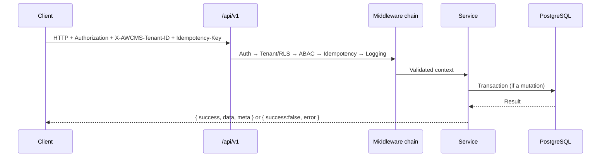
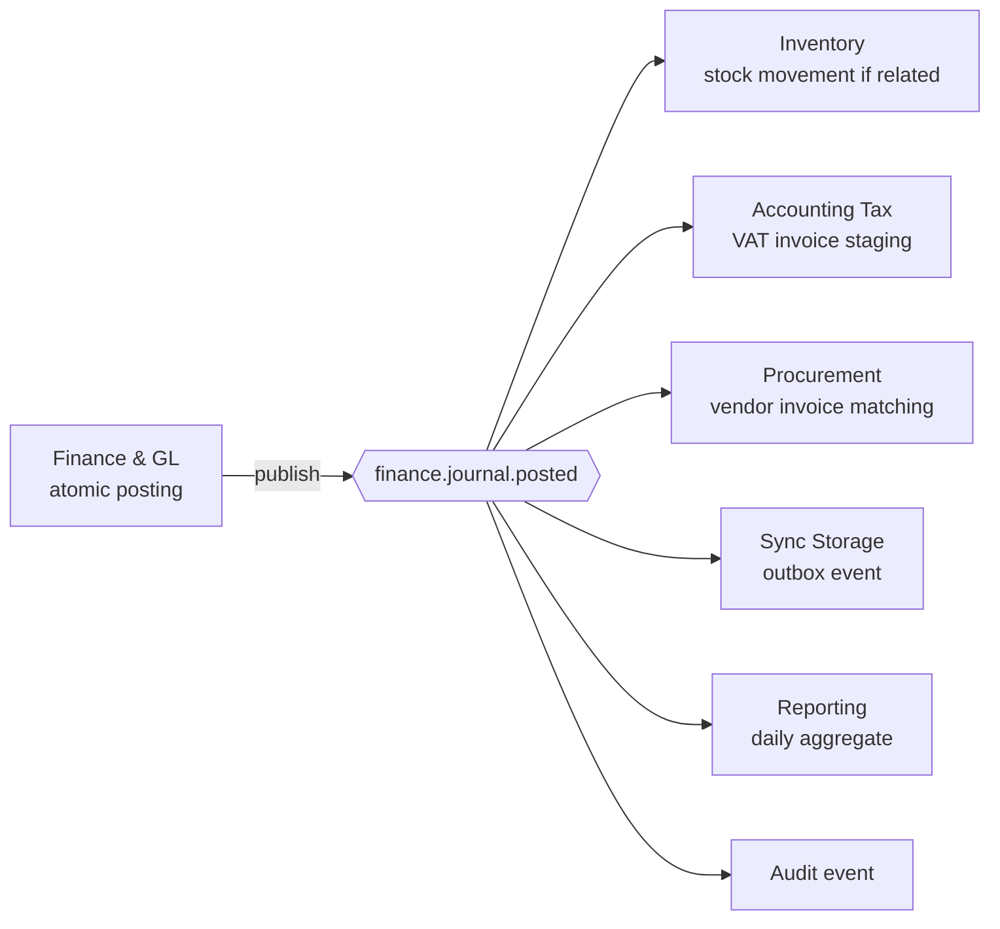

🇬🇧 English (source) · 🇮🇩 [Bahasa Indonesia](05_openapi_asyncapi_detail.id.md)

# Part 5 — OpenAPI and AsyncAPI Detail

> **Document status:** target/plan for the API and event contracts, not implementation status. No ERP module endpoint or event has been implemented in this repo yet — this document lays out the contract baseline that is **planned** to be built incrementally.

> **Domain example (illustrative).** This document uses the ERP domain (finance/accounting, inventory/warehouse, procurement, manufacturing, HR/payroll) as a running example. Its **patterns & standards** are reusable for the AWCMS base; the **entities, endpoints, and domain terms** are an initial illustration that will be refined as modules get built. See the [document package README](README.md) §Reusable vs ERP domain.

## Purpose

This document is the baseline for the AWCMS API and domain event contracts. Every new API must be updated in OpenAPI. Every new event must be updated in AsyncAPI.

## Contract version

The OpenAPI/AsyncAPI `info.version` is SemVer independent of the `package.json` release version — the full policy + bump rules will be recorded as a separate ADR in this repo (following the contract-versioning ADR pattern from the previous base). Validated automatically by `bun run api:spec:check` (must be shaped `X.Y.Z`).

## Standard API

Base path:

```text
/api/v1
```

Success response:

```json
{
  "success": true,
  "data": {},
  "meta": {
    "correlationId": "corr_...",
    "requestId": "req_..."
  }
}
```

Error response:

```json
{
  "success": false,
  "error": {
    "code": "VALIDATION_ERROR",
    "message": "Invalid data.",
    "details": [],
    "correlationId": "corr_..."
  }
}
```

## Standard headers

| Header                      |                    Required | Function                                                      |
| --------------------------- | --------------------------: | ------------------------------------------------------------- |
| `Authorization`             |       Yes except for public | Bearer token                                                  |
| `X-AWCMS-Tenant-ID`         |  Yes for tenant-scoped APIs | Active tenant                                                 |
| `Idempotency-Key`           | Yes for high-risk mutations | Anti duplicate mutation                                       |
| `X-Correlation-ID`          |                    Optional | Trace request                                                 |
| `X-Request-ID`              |                    Optional | Trace client request                                          |
| `Accept-Language`           |                    Optional | Locale                                                        |
| `X-AWCMS-Node-ID`           |                Yes for sync | Sync node                                                     |
| `X-AWCMS-Timestamp`         |         Yes for signed sync | Anti replay                                                   |
| `X-AWCMS-Signature`         |                Yes for sync | HMAC signature                                                |
| `X-AWCMS-Signature-Version` |   Recommended for sync (v2) | Signature schema version; `"2"` binds tenant+node (GHSA-c972) |

## Soft delete API standard

DELETE on a deletable tenant-scoped resource means **soft delete**, not physical delete. The endpoint must be documented in OpenAPI with the following behaviour:

| Pattern                                | Function                | Notes                                                                               |
| -------------------------------------- | ----------------------- | ----------------------------------------------------------------------------------- |
| `DELETE /<resources>/{id}`             | Soft delete resource    | Fill `deleted_at`, `deleted_by`, `delete_reason`; high-risk needs `Idempotency-Key` |
| `POST /<resources>/{id}/restore`       | Restore resource        | Validate unique key conflicts, lifecycle status, ABAC, and audit                    |
| `POST /<resources>/{id}/purge-request` | Request purge/anonymize | Retention/legal only; approval if the policy is active                              |
| `GET /<resources>?includeDeleted=true` | List including archive  | Permitted roles only; defaults to `false`                                           |

The default list/detail response does not show soft-deleted records. Detail of a soft-deleted record without permission returns `RESOURCE_NOT_FOUND`; with the archive permission it may return masked data with status `deleted`.

## Endpoints that require idempotency (planned)

- `POST /finance/journal-batches/{id}/post`
- `POST /finance/documents/{id}/cancel-request`
- `POST /profiles/resolve`
- `POST /profiles/{id}/links`
- `POST /profiles/merge-requests`
- `DELETE /profiles/{id}`
- `POST /profiles/{id}/restore`
- `DELETE /inventory/items/{id}`
- `POST /inventory/items/{id}/restore`
- `POST /warehouse-transfers`
- `POST /warehouse-transfers/{id}/approve`
- `POST /warehouse-transfers/{id}/ship`
- `POST /warehouse-transfers/{id}/receive`
- `POST /cycle-counts`
- `POST /stock-adjustment-requests`
- `POST /tax/vat-invoices/generate`
- `POST /tax/coretax/batches`
- `POST /procurement/purchase-orders`
- `POST /procurement/purchase-orders/{id}/approve`
- `POST /procurement/purchase-orders/{id}/receive`
- `POST /sync/push`
- `POST /workflow/tasks/{id}/decision`

## Error code standard

| Code                         | HTTP | Description                                                           |
| ---------------------------- | ---: | --------------------------------------------------------------------- |
| `VALIDATION_ERROR`           |  400 | Invalid data                                                          |
| `AUTH_REQUIRED`              |  401 | Not logged in                                                         |
| `TOKEN_EXPIRED`              |  401 | Token expired                                                         |
| `ACCESS_DENIED`              |  403 | No access                                                             |
| `TENANT_REQUIRED`            |  400 | Tenant required                                                       |
| `RESOURCE_NOT_FOUND`         |  404 | Resource not found                                                    |
| `RESOURCE_DELETED`           |  410 | Resource is already soft-deleted and needs restore/archive permission |
| `IDEMPOTENCY_REQUIRED`       |  400 | Idempotency header required                                           |
| `IDEMPOTENCY_CONFLICT`       |  409 | Key used by a different request                                       |
| `WORKFLOW_APPROVAL_REQUIRED` |  409 | Approval needed                                                       |
| `STOCK_NOT_AVAILABLE`        |  409 | Not enough stock                                                      |
| `SYNC_CONFLICT`              |  409 | Sync conflict                                                         |
| `PAYLOAD_TOO_LARGE`          |  413 | Request body exceeds the size limit                                   |
| `DATABASE_BUSY`              |  503 | Pool/DB busy                                                          |
| `PROVIDER_ERROR`             |  502 | External provider failed                                              |
| `INTERNAL_ERROR`             |  500 | Internal error                                                        |

## API endpoint summary per module (planned)

### Foundation

| Method | Endpoint  | Function     |
| ------ | --------- | ------------ |
| GET    | `/health` | Health check |

### Tenant Admin

| Method   | Endpoint                      | Function                   |
| -------- | ----------------------------- | -------------------------- |
| GET      | `/setup/status`               | Setup status               |
| POST     | `/setup/initialize`           | Set up the first tenant    |
| GET      | `/tenants/current`            | Active tenant              |
| GET/POST | `/offices`                    | List/create office         |
| PATCH    | `/offices/{officeId}`         | Update office              |
| DELETE   | `/offices/{officeId}`         | Soft delete office if safe |
| POST     | `/offices/{officeId}/restore` | Restore office             |

### Identity & Access

| Method | Endpoint                | Function             |
| ------ | ----------------------- | -------------------- |
| POST   | `/auth/login`           | Login                |
| POST   | `/auth/logout`          | Logout               |
| GET    | `/auth/me`              | Active user          |
| GET    | `/access/modules`       | Module/activity list |
| POST   | `/access/evaluate`      | ABAC evaluation      |
| POST   | `/access/assignments`   | Assign access        |
| GET    | `/access/decision-logs` | Decision log         |

### Profile Identity

| Method   | Endpoint                        | Function                           |
| -------- | ------------------------------- | ---------------------------------- |
| GET/POST | `/profiles`                     | List/create profile                |
| GET      | `/profiles/{profileId}`         | Profile detail                     |
| POST     | `/profiles/resolve`             | Resolve/create profile             |
| POST     | `/profiles/{profileId}/links`   | Link entity                        |
| GET      | `/profiles/dedup-candidates`    | Duplicate candidates               |
| POST     | `/profiles/merge-requests`      | Request merge                      |
| DELETE   | `/profiles/{profileId}`         | Soft delete profile/contact master |
| POST     | `/profiles/{profileId}/restore` | Restore profile                    |

### Master Data & Inventory

| Method    | Endpoint                               | Function           |
| --------- | -------------------------------------- | ------------------ |
| GET/POST  | `/inventory/items`                     | List/create item   |
| GET/PATCH | `/inventory/items/{itemId}`            | Item detail/update |
| DELETE    | `/inventory/items/{itemId}`            | Soft delete item   |
| POST      | `/inventory/items/{itemId}/restore`    | Restore item       |
| GET       | `/inventory/stock-balances`            | Stock              |
| GET       | `/inventory/stock-movements`           | Stock movements    |
| POST      | `/inventory/stock-adjustment-requests` | Request adjustment |
| GET       | `/inventory/lots`                      | Lot/batch          |

### Finance & General Ledger

| Method | Endpoint                                       | Function                  |
| ------ | ---------------------------------------------- | ------------------------- |
| POST   | `/finance/journal-batches`                     | Create draft journal      |
| GET    | `/finance/journal-batches/{id}`                | Journal detail            |
| POST   | `/finance/journal-batches/{id}/lines`          | Add journal line          |
| PATCH  | `/finance/journal-batches/{id}/lines/{lineId}` | Update journal line       |
| DELETE | `/finance/journal-batches/{id}/lines/{lineId}` | Delete journal line       |
| POST   | `/finance/journal-batches/{id}/post`           | Post journal              |
| GET    | `/finance/documents/{id}`                      | Financial document detail |
| POST   | `/finance/documents/{id}/cancel-request`       | Request cancel            |

### Warehouse Management

| Method   | Endpoint                                         | Function                               |
| -------- | ------------------------------------------------ | -------------------------------------- |
| GET/POST | `/warehouses`                                    | List/create warehouse                  |
| GET      | `/warehouses/{warehouseId}/stock`                | Warehouse stock                        |
| GET/POST | `/warehouses/{warehouseId}/bins`                 | Bin list/create                        |
| DELETE   | `/warehouses/{warehouseId}/bins/{binId}`         | Soft delete bin if the balance is zero |
| POST     | `/warehouses/{warehouseId}/bins/{binId}/restore` | Restore bin                            |
| POST     | `/warehouse-transfers`                           | Create transfer                        |
| POST     | `/warehouse-transfers/{id}/approve`              | Approve                                |
| POST     | `/warehouse-transfers/{id}/ship`                 | Ship                                   |
| POST     | `/warehouse-transfers/{id}/receive`              | Receive                                |
| POST     | `/cycle-counts`                                  | Create cycle count                     |

### Accounting Tax/Coretax

| Method   | Endpoint                          | Function             |
| -------- | --------------------------------- | -------------------- |
| GET/POST | `/tax/profiles`                   | Tax profile          |
| GET/POST | `/tax/business-units`             | NITKU/ID TKU         |
| GET/POST | `/tax/party-profiles`             | Party tax profile    |
| POST     | `/tax/vat-invoices/generate`      | Generate VAT invoice |
| GET      | `/tax/vat-invoices`               | List invoice         |
| POST     | `/tax/vat-invoices/{id}/validate` | Validate             |
| POST     | `/tax/coretax/batches`            | Coretax batch export |

### Procurement & Vendor Management

| Method   | Endpoint                                      | Function                      |
| -------- | --------------------------------------------- | ----------------------------- |
| GET/POST | `/procurement/vendors`                        | Vendor master                 |
| GET/POST | `/procurement/purchase-requests`              | Purchase request              |
| POST     | `/procurement/purchase-requests/{id}/approve` | Approve PR                    |
| GET/POST | `/procurement/purchase-orders`                | Purchase order                |
| POST     | `/procurement/purchase-orders/{id}/approve`   | Approve PO                    |
| POST     | `/procurement/purchase-orders/{id}/receive`   | Receive goods (goods receipt) |
| GET      | `/procurement/vendors/{id}/invoices`          | Vendor invoices               |
| DELETE   | `/procurement/vendors/{id}`                   | Soft delete vendor            |
| POST     | `/procurement/vendors/{id}/restore`           | Restore vendor                |
| POST     | `/webhooks/procurement/vendor-portal`         | Vendor portal webhook         |

### Sync Storage

| Method | Endpoint                       | Function              |
| ------ | ------------------------------ | --------------------- |
| POST   | `/sync/push`                   | Push event            |
| POST   | `/sync/pull`                   | Pull event            |
| GET    | `/sync/status`                 | Sync status           |
| GET    | `/sync/conflicts`              | List conflict         |
| POST   | `/sync/conflicts/{id}/resolve` | Resolve conflict      |
| POST   | `/sync/objects/presign`        | Object upload/presign |

### Module Management

Database-backed, tenant-aware module registry — generic infrastructure for managing every other registered module, not a domain-specific feature.

| Method | Endpoint                               | Function                                                   |
| ------ | -------------------------------------- | ---------------------------------------------------------- |
| GET    | `/modules`                             | Module catalogue (code + DB registry)                      |
| GET    | `/modules/{moduleKey}`                 | Detail of one module                                       |
| POST   | `/modules/sync`                        | Sync descriptor code → DB registry                         |
| GET    | `/modules/{moduleKey}/permissions`     | Permission sync status (synced/missing/orphaned)           |
| GET    | `/modules/{moduleKey}/jobs`            | Operational command registry (documentation, no execution) |
| GET    | `/modules/{moduleKey}/health`          | Quick health/readiness, read-only                          |
| POST   | `/modules/{moduleKey}/health/check`    | Trigger an explicit health check (+ provider check if any) |
| GET    | `/tenant/modules`                      | Module enable/disable status for the calling tenant        |
| POST   | `/tenant/modules/{moduleKey}/enable`   | Enable the module for the tenant                           |
| POST   | `/tenant/modules/{moduleKey}/disable`  | Disable the module for the tenant (needs `reason`)         |
| GET    | `/tenant/modules/{moduleKey}/settings` | Effective settings (default + tenant override)             |
| PATCH  | `/tenant/modules/{moduleKey}/settings` | Update the tenant settings override                        |

There is no new AsyncAPI event for this module — module lifecycle/config changes are recorded through the generic `awcms_audit_events`, not a separate domain event.

### AI, Reports, Logs, Workflow, Security

| Module   | Main endpoints                                                   |
| -------- | ---------------------------------------------------------------- |
| AI       | `POST /ai/business-analyst/chat`                                 |
| Reports  | `GET /reports/finance/daily`, `GET /reports/warehouse/dashboard` |
| Logs     | `GET /logs/recent`, `GET /logs/audit`, `GET /logs/security`      |
| DB Pool  | `GET /database/pool/health`                                      |
| Workflow | `GET /workflow/tasks`, `POST /workflow/tasks/{id}/decision`      |
| Security | `POST /security/go-live-gates/evaluate`                          |

Later modules (Manufacturing, HR & Payroll, payment gateway/marketplace/logistics integrations) do not yet have a final endpoint list — it will be added when those modules are designed in detail, following the same `/api/v1/<module>` base path pattern.

## API request cycle



## AsyncAPI event envelope

```json
{
  "eventId": "uuid",
  "eventType": "finance.journal.posted",
  "eventVersion": "1.0",
  "tenantId": "uuid",
  "nodeId": "uuid-node",
  "aggregateType": "journal_batch",
  "aggregateId": "uuid",
  "occurredAt": "2026-07-14T09:00:00+07:00",
  "actor": {
    "tenantUserId": "uuid",
    "profileId": "uuid"
  },
  "correlationId": "corr_001",
  "causationId": "event-before-id",
  "payload": {},
  "metadata": {
    "sourceModule": "finance_gl",
    "schemaVersion": "1.0"
  }
}
```

Soft delete events use the same envelope. Event naming pattern: `<module>.<resource>.soft_deleted`, `<module>.<resource>.restored`, and `<module>.<resource>.purge_requested` when the event needs to be synchronised or consumed by another module. The payload must not carry raw PII; use identifiers, status, and already-redacted audit metadata.

## Event fan-out — `finance.journal.posted`



## Main events (planned)

| Event                                 | Producer        | Consumer                                     |
| ------------------------------------- | --------------- | -------------------------------------------- |
| `tenant.created`                      | Tenant Admin    | Audit, reporting                             |
| `identity.login.succeeded`            | Identity        | Audit/security                               |
| `profile.created`                     | Profile         | Procurement, reporting                       |
| `inventory.item.created`              | Master Data     | Reporting, sync                              |
| `inventory.item.soft_deleted`         | Master Data     | Reporting, sync                              |
| `inventory.item.restored`             | Master Data     | Reporting, sync                              |
| `finance.journal.posted`              | Finance & GL    | Inventory, Tax, Procurement, Sync, Reporting |
| `finance.document.generated`          | Finance & GL    | Reporting, sync                              |
| `warehouse.transfer.shipped`          | Warehouse       | Inventory, Sync, Reporting                   |
| `warehouse.transfer.received`         | Warehouse       | Inventory, Sync, Reporting                   |
| `tax.vat_invoice.generated`           | Tax             | Reporting, audit                             |
| `tax.coretax.batch_exported`          | Tax             | Sync, audit                                  |
| `procurement.purchase_order.approved` | Procurement     | Reporting, audit                             |
| `procurement.goods_receipt.posted`    | Procurement     | Inventory, Reporting                         |
| `sync.conflict.detected`              | Sync            | Workflow, audit                              |
| `workflow.task.approved`              | Workflow        | Requesting module                            |
| `database.pool.saturated`             | DB Connectivity | Observability, security                      |
| `database.pool.rejected`              | DB Connectivity | Observability, security                      |
| `security.golive.blocked`             | Security        | Owner/admin                                  |

## Contract testing requirement

- Every endpoint has a success/error response schema.
- Tenant-scoped APIs must have the tenant header.
- High-risk mutations must have idempotency.
- Sensitive fields are not shown in full.
- The event envelope is complete.
- The event payload matches the schema.
- Events do not carry raw sensitive data.
