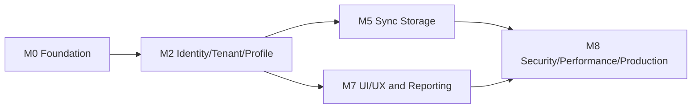
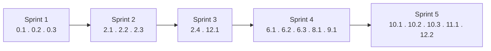

🇬🇧 English (source) · 🇮🇩 [Bahasa Indonesia](06_github_issues_detail.id.md)

# Part 6 — GitHub Issues Detail (Generic Base)

AWCMS is the **AWCMS-family ERP/back-office template that is used directly** — a reusable modular monolith base. The backlog in this document **focuses on the generic/foundation modules** that are part of AWCMS itself (Foundation, Tenant/Identity/Profile, Sync Storage, UI Experience, Management Reporting, Observability/Pooling/Security Readiness, Workflow Approval, Setup/Deployment). Domain modules (ERP: product catalogue, warehouse, tax/Coretax, accounting; website/e-commerce; content; CRM; AI business analyst; and the like) are added **directly in this template's `src/modules/`** ([ADR-0034](../adr/0034-awcms-family-direct-use-templates-and-derived-pathway-removal.md)/[ADR-0035](../adr/0035-awcms-online-first-erp-saas-superset-repositioning.md)) as `domain`-type modules — not in a separate derived application. See `docs/awcms/README.md`.

Epic numbers follow the original backlog history (the domain epics have been removed, so there are gaps in the numbering — this is deliberate, not a mistake, so that traceability to the GitHub issues already created stays valid).

## Recommended labels

```text
type:epic
type:feature
type:task
type:security
type:docs
type:test
priority:p0
priority:p1
priority:p2
area:architecture
area:database
area:api
area:frontend
area:security
area:auth
area:tenant
area:profile
area:sync
area:ui-ux
area:logging
area:deployment
area:reporting
status:ready
status:blocked
status:needs-review
```

## Milestone dependencies



## Recommended milestones

| Milestone                              | Focus                                                               |
| -------------------------------------- | ------------------------------------------------------------------- |
| M0 — Repository Foundation             | Skeleton, migration runner, OpenAPI/AsyncAPI, setup wizard          |
| M2 — Identity, Tenant, Profile         | Tenant, profile, auth, access                                       |
| M5 — Sync Storage                      | Offline sync outbox/inbox, conflict, R2 object queue                |
| M7 — UI/UX & Reporting                 | Admin shell, management reporting views                             |
| M8 — Security, Performance, Production | Logging, pooling, workflow approval, security readiness, deployment |

## Reference documents per epic

Besides docs 01–05, every epic must read the related technical design documents. Every epic is subject to the architectural decisions in [`../adr/`](../adr/README.md) and the threat model in doc 20.

| Epic                        | Main reference documents                                                 |
| --------------------------- | ------------------------------------------------------------------------ |
| 0 Foundation                | 09, 10, 11, 16 (migration runner, pool), 18 (env); ADR 0001–0002, 0007   |
| 2 Tenant/Identity/Profile   | 03, 04, 16 (RLS/SET LOCAL), **17 (seed/RBAC/ABAC)**; ADR 0003–0004       |
| 6 Sync Storage              | 03, 10 (HMAC), 15 (offline client), 16 (outbox); ADR 0006                |
| 8 UI Experience             | **14 (design system/screens)**, **15 (frontend/offline)**                |
| 9 Management Reporting      | 03, 05, 14 (dashboard UI)                                                |
| 10 Logging/Pooling/Security | **16 (pool/backpressure)**, 07, 03, **20 (threat model)**; ADR 0003–0005 |
| 11 Workflow Approval        | 03, 17 (self-approval policy); ADR 0004                                  |
| 12 Setup & Deployment       | **17 (seed wizard)**, **18 (env/topology)**, 07                          |

---

# EPIC 0 — Repository Foundation

## Issue 0.1 — Initialize AWCMS Modular Monolith Repository Structure

**Problem:** AWCMS needs a repository structure that is consistent, modular, and ready to be built out incrementally.

**Scope:** Create the `src/modules`, `_shared`, `src/lib`, `sql`, `scripts`, `openapi`, `asyncapi`, `docs`, `deploy`, `tests`, `fixtures` structure; create `package.json`, `astro.config.mjs`, `tsconfig.json`, `.gitignore`, `.env.example`, `README.md`; create the module contract, the module registry, the API response helper, and the health endpoint.

**Out of scope:** Migration runner details, login, and domain modules (catalogue, transactions, etc.) — domain modules are added directly in `src/modules/` following their own pattern, outside this foundation backlog.

**Acceptance criteria:** The structure exists, the build passes, the health endpoint exists, the README explains the stack, the shared convention for the soft-delete DTO/query helper is documented, and there are no secrets.

**Security notes:** `.env` ignored, `.env.example` placeholders, no hardcoded secret.

**Testing:** `bun install`, `bun run build`.

**Labels:** `type:task`, `priority:p0`, `area:architecture`.

## Issue 0.2 — Add SQL Migration Runner

**Problem:** Database changes must be controlled and sequential.

**Scope:** `scripts/db-migrate.ts`, `awcms_schema_migrations`, checksum, skipping already-applied migrations, the `db:migrate` command, a migration guide.

**Acceptance criteria:** Migrations run in order, do not double-run, an error stops the process, and the DB password does not leak.

**Testing:** `bun run db:migrate`, `bun run build`.

## Issue 0.3 — Add OpenAPI and AsyncAPI Baseline

**Scope:** OpenAPI master, shared schemas, security schemes, AsyncAPI event envelope, the `api:spec:check` script.

**Acceptance criteria:** The API spec is valid, the AsyncAPI is valid, the shared response schema exists, the soft delete/restore/purge pattern is documented, and the HMAC sync header is documented.

---

# EPIC 2 — Tenant, Identity, Profile

## Issue 2.1 — Add Tenant and Office Schema

**Scope:** `awcms_tenants`, `awcms_offices`, `awcms_tenant_settings`, `awcms_physical_locations`, RLS, unique tenant/office code, soft delete for office/location.

**Acceptance criteria:** Tenants and offices can be created, the office types are complete, duplicates are rejected, an inactive tenant is refused transactions, soft-deleted offices/locations do not appear in the default list, and restores are audited.

## Issue 2.2 — Add Central Profile Schema

**Scope:** `awcms_profiles`, identifiers, channels, addresses, entity links, audit logs, merge requests, soft delete/restore for the profile/contact master.

**Acceptance criteria:** A profile can link to another module's entity; identifiers are masked; the duplicate resolver works; a soft-deleted profile is not resolved for new transactions unless restored.

## Issue 2.3 — Add Identity Login and Tenant User Membership

**Scope:** Identity, password hash, tenant user, login/logout/me endpoints.

**Acceptance criteria:** Login succeeds/fails, an inactive tenant is rejected, the password is never shown.

## Issue 2.4 — Add RBAC and ABAC Access Control

**Scope:** Role, permission, activity registry, ABAC policy, assignment, decision log, evaluator.

**Acceptance criteria:** Default deny, deny overrides allow, an operator is denied access to modules that are not permitted, and the decision log is recorded.

---

# EPIC 6 — Offline Sync Storage

## Issue 6.1 — Add Sync Outbox and Inbox

**Scope:** Sync nodes, outbox, inbox, batches, checkpoints, signed push/pull.

**Acceptance criteria:** HMAC validation, duplicate batches are idempotent, checkpoints are updated.

## Issue 6.2 — Add Sync Conflict Tracking and Resolution

**Scope:** Conflict table, resolution API, conflict types.

**Acceptance criteria:** Manual conflicts are immutable, resolutions are audited.

## Issue 6.3 — Add R2 Object Sync Queue

**Scope:** R2 buckets, object queue, checksum, retry.

**Acceptance criteria:** Local files are queued, upload is optional, checksums are verified.

---

# EPIC 8 — UI Experience

## Issue 8.1 — Build Admin Layout Shell

**Scope:** Admin layout, sidebar, topbar, tenant switcher, sync indicator, theme.

---

# EPIC 9 — Management Reporting

## Issue 9.1 — Add Management Reporting Views

**Scope:** Tenant activity summary, access/audit summary, sync health, module usage dashboard (generic reporting views — domain modules add their own domain views in `src/modules/`).

---

# EPIC 10 — Logging, Pooling, Production Security

## Issue 10.1 — Add Structured Logging and Audit Trail

**Scope:** JSON logger, correlation ID, redaction, audit, log APIs.

**Additional acceptance criteria:** High-risk soft delete, restore, and purge are recorded in the audit with already-redacted attributes.

## Issue 10.2 — Add Database Connection Pooling and Backpressure

**Scope:** Pool config, work class queue, circuit breaker, health endpoint, PgBouncer example.

## Issue 10.3 — Add Production Security Readiness Checklist

**Scope:** Security controls, readiness assessment, evidence, findings, go-live gates, preflight scripts.

---

# EPIC 11 — Workflow Approval

## Issue 11.1 — Add Workflow Approval Engine

**Scope:** Definitions, steps, instances, tasks, decisions, decision API, self-approval guard.

---

# EPIC 12 — Setup Wizard & Deployment

## Issue 12.1 — Add Initial Setup Wizard API

**Scope:** Setup status, initialize tenant/owner/office/role/ABAC defaults, setup lock.

## Issue 12.2 — Add Offline/LAN Deployment Profile

**Scope:** Deployment profiles, systemd, Docker Compose, PgBouncer, backup cron, `.env.example`.

---

# Status: active backlog on GitHub

This document is the generic atomic issue template/backlog for the AWCMS base. The most recent live GitHub snapshot (2026-07-04) records **18 OPEN issues** from this backlog in `ahliweb/awcms`.

The `Issue X.Y` numbers in this document are an **internal traceability code**, not GitHub issue numbers. To find the GitHub issue number for an X.Y code, see the table in `github/issues-open-001.md` (does not exist yet — generated by the `awcms-github-snapshot` skill once it is run).

## Backlog change history (2026-07-04)

The initial backlog contained 38 issues, including POS/retail domain epics (Legacy Migration, POS MVP, Warehouse Management, CRM Receipt Delivery, Accounting & Coretax, and parts of UI/Reporting/AI) that **do not fit the context of AWCMS as a general development repository example**. Those 20 domain issues were closed (`not planned`) on GitHub with a note that their domain is now built as `domain`-type modules **directly in this template's `src/modules/`** ([ADR-0034](../adr/0034-awcms-family-direct-use-templates-and-derived-pathway-removal.md)/[ADR-0035](../adr/0035-awcms-online-first-erp-saas-superset-repositioning.md)), rather than having their history deleted. 2 issues (Admin shell, Management Reporting) had their wording generalised so they no longer carry domain terms (e.g. "Cashier", "Sales daily/stock/tax/warehouse dashboard"). Domain milestones and labels that became unused were cleaned up as well (see `github/README.md` §Genericization).

Initial status of the remaining issues:

1. Sprint 1 (Issue 0.1, 0.2, 0.3) labelled `status:ready`.
2. 15 other issues labelled `status:blocked` because they depend on milestones that are not finished yet (see §Milestone dependencies above).
3. Once an issue is done and merged, change the label of the issues whose dependency has just been satisfied from `status:blocked` to `status:ready` on GitHub.
4. Refresh the snapshot in `github/README.md`, `github/issues-open-NNN.md`, `github/issues-closed-NNN.md`, and `github/labels-milestones.md` every time a status/label/milestone changes.

### Sprint ordering correction (2026-07-05)

The initial sprint plan placed **Issue 12.1 (Setup Wizard API)** in Sprint 1, alongside 0.1–0.3. That was wrong: the setup wizard initialises the tenant, owner, office, role, permission, and ABAC defaults — data whose schema is only created by Issue 2.1 (tenant/office), 2.3 (identity/login), and 2.4 (RBAC/ABAC), all of them Sprint 2/3. The implementation audit of Issue 0.1–0.3 (`AUDIT_STANDAR_PENGEMBANGAN_2026-07-04.md`) found the database schema still empty (only `awcms_modules`/`awcms_schema_migrations`) when 12.1 was about to be worked on. **12.1 was moved to Sprint 3**, after 2.4, in the table and diagram below.

### Sprint ordering correction (2) — Sprint 4/5 swapped (2026-07-05)

The initial sprint plan (after correction #1) placed **10.1–10.3 (M8 — Security/Performance/Production) in Sprint 4**, before **6.1–6.3 (M5 — Sync Storage) and 8.1/9.1 (M7 — UI/UX & Reporting) in Sprint 5** — contradicting §Milestone dependencies above, which sets `M5 → M8` and `M7 → M8` (M8 needs M5 **and** M7 finished first, not the other way round). The initial Sprint 5 also wrongly mixed `11.1`/`12.2` (both milestone M8) in with M5/M7 issues. Found while closing Issue 12.1 and about to recommend the next step — the GitHub labels for `10.1`/`10.2`/`10.3`/`11.1`/`12.2` remained `status:blocked` (they were not mistakenly changed to `status:ready`). Fixed: **Sprint 4 = 6.1, 6.2, 6.3, 8.1, 9.1** (M5+M7, both only needing M2 which is already complete, may run in parallel); **Sprint 5 = 10.1, 10.2, 10.3, 11.1, 12.2** (M8, all of them).

To build a new domain module (ERP, website/e-commerce, content): add the domain module **directly in this template's `src/modules/`** ([ADR-0034](../adr/0034-awcms-family-direct-use-templates-and-derived-pathway-removal.md)/[ADR-0035](../adr/0035-awcms-online-first-erp-saas-superset-repositioning.md)) as a `domain`-type module, following the base module pattern — not as a derived application/separate repo.

The actual GitHub content snapshot is recorded in `github/README.md` (does not exist yet — see the note above). The snapshot is split into `issues-open-NNN.md` and `issues-closed-NNN.md` files, with a maximum of 100 issues per file. This document remains the atomic issue template/plan; the `github/` folder is the archive of GitHub state refreshed from `gh`.

# Recommended initial sprints



1. Sprint 1: 0.1, 0.2, 0.3.
2. Sprint 2: 2.1, 2.2, 2.3.
3. Sprint 3: 2.4, 12.1 (the setup wizard waits for tenant/identity/RBAC/ABAC from 2.1–2.4 — see §Sprint ordering correction).
4. Sprint 4: 6.1, 6.2, 6.3 (M5 — Sync Storage), 8.1, 9.1 (M7 — UI/UX & Reporting) — both depend only on M2 (complete), and may run in parallel.
5. Sprint 5: 10.1, 10.2, 10.3, 11.1, 12.2 (M8 — Security/Performance/Production — see §Sprint ordering correction (2) for why this was moved after Sprint 4, not before).

# Definition of Done

- Scope matches the issue.
- No unrelated changes.
- A migration if the schema changes.
- OpenAPI if the API changes.
- AsyncAPI if events change.
- Relevant tests.
- Docs updated.
- Security checklist passes.
- Soft delete policy passes for deletable resources; posted/append-only entities cannot be deleted.
- An implementation report is available.
