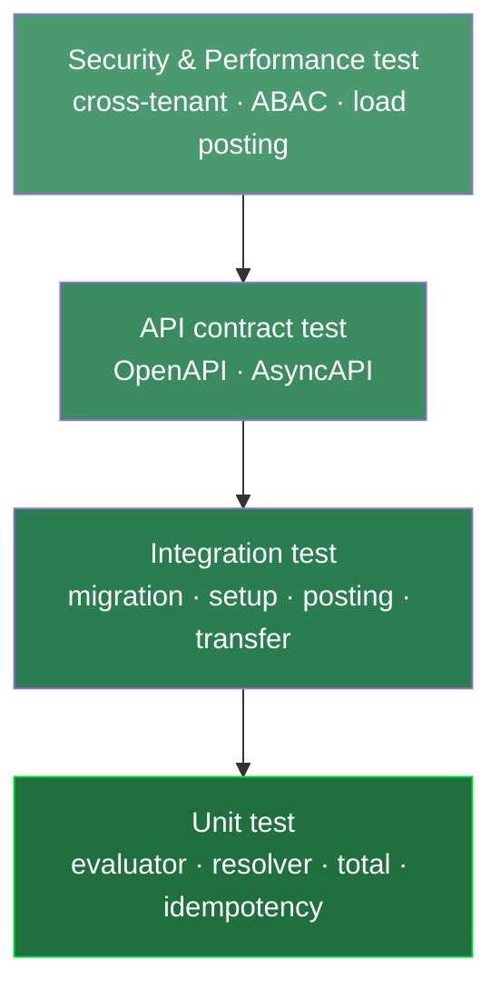
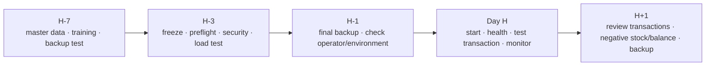

🇬🇧 English (source) · 🇮🇩 [Bahasa Indonesia](07_sprint_testing_production_readiness.id.md)

# Part 7 — Sprint Plan, Testing Checklist, and Production Readiness

> **Document status (AWCMS, foundation-rebuild stage).** AWCMS is still at
> the foundation stage (see [ADR-0001](../adr/0001-rebuild-on-awcms-foundation-erp-scope.md))
> — **no ERP module (finance, inventory, procurement, manufacturing,
> HR/payroll) has been implemented**. This document is adapted from the
> `awcms-mini` standards (the technical base that is already fully-implemented and verified
> live in its source repo). Here, any checklist/procedure/performance target that
> in the source is marked "already verified live"/"available" must be
> read as a **plan/target that will be executed once the relevant module
> exists** — not as a claim that AWCMS today already passes all of it. The parts that
> say something "is already running" refer to mechanisms owned by the
> `awcms-mini` base that AWCMS inherits, not to the ERP modules themselves.

> **Domain examples.** The source document (`awcms-mini`) uses the
> retail/POS domain as a generic illustration for any derived application. For
> AWCMS, the ERP domain (finance/accounting, inventory/warehouse, procurement,
> manufacturing, HR/payroll, and payment gateway/marketplace/
> Coretax/logistics integrations) is NO LONGER an illustration — it is the actual
> product scope (see ADR-0001). The **patterns & standards** below (sprint
> discipline, testing pyramid, migration checklist, production readiness
> gate, go-live plan) remain reusable from `awcms-mini`; the entities/module names
> below have been adapted to ERP.

## Purpose

This document sets out the sprint plan, testing strategy, migration checklist, production readiness, backup/restore SOP, and go-live checklist for AWCMS.

## Sprint principles

1. One sprint produces real progress.
2. All database changes go through a migration.
3. A new API updates OpenAPI.
4. A new event updates AsyncAPI.
5. High-risk mutations are idempotent.
6. High-risk actions are audit logged.
7. Soft delete for deletable resources; posted/append-only stays immutable.
8. Documentation matches the implementation.

## Sprint Plan 1–12 (target, ERP)

> The roadmap below is a **planning target**, not the current implementation status — Sprint 1 (Foundation) is the only sprint that overlaps with work already present in the repo (docs/ADR/governance).

```mermaid
gantt
  title AWCMS Sprint Roadmap (ERP target)
  dateFormat X
  axisFormat S%s
  section Foundation
  S1 Foundation            :s1, 0, 1
  section Core
  S2 Tenant/Identity/Profile :s2, after s1, 1
  S3 RBAC/ABAC/RLS         :s3, after s2, 1
  S4 Finance/Accounting Core :s4, after s3, 1
  S5 Inventory & Warehouse MVP :s5, after s4, 1
  section Reliability
  S6 Logging & Pooling     :s6, after s5, 1
  S7 Procurement & Vendor  :s7, after s6, 1
  S8 Offline Sync & R2     :s8, after s7, 1
  section Ext modules
  S9 Manufacturing         :s9, after s8, 1
  S10 HR/Payroll & Tax/Coretax :s10, after s9, 1
  S11 UI/Reporting/Integrations :s11, after s10, 1
  S12 Production Readiness  :s12, after s11, 1
```



| Sprint | Focus                          | Main output                                                          |
| -----: | ------------------------------ | -------------------------------------------------------------------- |
|      1 | Repository Foundation          | Skeleton, migration runner, OpenAPI/AsyncAPI, health                 |
|      2 | Tenant, Identity, Profile      | Tenant, office, setup, login, profile resolver                       |
|      3 | RBAC, ABAC, RLS                | Role, policy, evaluator, decision log                                |
|      4 | Finance/Accounting Core        | Chart of account, journal, ledger entry, posting                     |
|      5 | Inventory & Warehouse MVP      | Item master, stock balance, movement, warehouse/bin                  |
|      6 | Logging & Pooling              | Structured log, audit, DB pool, backpressure                         |
|      7 | Procurement & Vendor           | PO, vendor, goods receipt, approval workflow                         |
|      8 | Offline Sync & R2              | Sync push/pull, conflict, object queue                               |
|      9 | Manufacturing                  | BOM, work order, production posting                                  |
|     10 | HR/Payroll & Tax/Coretax       | Payroll run, salary components, tax profile, Coretax batch           |
|     11 | UI/UX, Reporting, Integrations | Admin UI, reports, payment gateway/marketplace/logistics integration |
|     12 | Production Readiness           | Workflow, security readiness, deployment, handover                   |

## Condensed sprint acceptance criteria

### Sprint 1

- `bun install` succeeds.
- `bun run build` succeeds.
- `bun run db:migrate` is available.
- `bun run api:spec:check` is available.
- `/api/v1/health` is active.
- No secret committed.

### Sprint 2

- Tenant, office, owner can be created.
- Owner login succeeds.
- Profile resolver runs.
- Identifiers are masked.
- Setup locked.

### Sprint 3

- Roles and permissions are available.
- ABAC default deny.
- Deny overrides allow.
- Decision log recorded.
- Cross-tenant access blocked.

### Sprint 4

- Chart of account CRUD runs.
- Account codes unique.
- Journal and ledger entry run.
- An inactive account cannot be used for posting.
- A soft-deleted account does not appear in the default list/search and cannot be used for posting.

### Sprint 5

- Item master, stock balance, and movement run.
- Stock movement posting is atomic.
- Idempotency with the same key is safe.
- Idempotency conflict 409.
- Stock lock and rollback tested.

### Sprint 6

- Correlation ID available.
- Logs redacted.
- Audit helper runs.
- Audit of soft delete/restore/purge runs.
- Pool health endpoint active.
- Pool saturation detected.

### Sprint 7

- PO and vendor CRUD run.
- Procurement approval workflow runs.
- Goods receipt runs.
- Idempotency on receipt posting.

### Sprint 8

- Sync HMAC valid.
- Push/pull events run.
- Duplicate events are safe.
- Conflicts recorded.
- Object checksum verified.

### Sprint 9

- BOM created.
- Work order created and posted.
- Raw material consumption and production output recorded as stock movements.

### Sprint 10

- Payroll run and salary components created.
- Tax profile and NITKU created.
- Coretax batch XML-ready and checksummed.
- Salary/tax data masked.

### Sprint 11

- Admin shell renders.
- Reports tenant-aware.
- Payment gateway/marketplace/logistics integration via the outbox.

### Sprint 12

- Workflow approve/reject.
- Security readiness pass.
- Go-live gate blocking on critical fail.
- Backup/restore SOP and deployment profile available.

## Testing Strategy



The pyramid: many unit tests at the base, few end-to-end at the top; security & performance tests stand guard.

> **Real browser E2E (Playwright + Bun).** The harness now **does exist**
> in this repo (Issue #166, ported from awcms-mini): `playwright.config.ts` +
> `tests/e2e/*.e2e.ts`, run via `bun run test:e2e` (→ `bun --bun
playwright test`, Bun-only), separate from `bun test`
> (unit/integration/API-contract) — see the `awcms-browser-test` skill. The first
> spec `not-found.e2e.ts` tests the catch-all 404 route
> (`src/pages/[...path].ts`, reusing `src/lib/html/error-responses.ts`):
> the browser opens an unknown path → gets a clean HTML 404 page without leaking
> internal detail (Issue #540). The admin `.astro` pages now **do exist**
> (Issue #166): `login.astro`, `admin/index.astro` (dashboard), and seven management
> screens — `offices`, `profiles`, `users`, `roles`, `abac-policies`,
> `modules`, `email-templates` — each SSR-read through the same application function
> as its JSON endpoint, ABAC-gated; `offices` & `profiles` also
> have a permission-gated **create form** (POST via cookie auth, CSP-safe external
> script). All of them use
> `AdminLayout` + the doc 14 design tokens (`src/styles/tokens.css`). The
> `login.e2e.ts` spec tests the render + CSP properties (external script, not inline —
> `default-src 'self'`), and `admin-offices.e2e.ts` tests the full
> authenticated flow (login → session cookie → `/admin` guard → rendering the table
> on every screen, including the masked login identifier on the users screen). It runs in
> CI through the `e2e-smoke` job (`.github/workflows/ci.yml`), which brings up
> `postgres:18.4`, runs `db:migrate`, then seeds one tenant+owner through
> `POST /api/v1/setup/initialize` (a real bootstrap) and hands
> its credentials to the spec via env.

> **Test runner.** The runner is **`bun test`** (`bun:test`), with files in
> `tests/`. The list of targets below is a **planning target for the ERP modules**,
> not today's implementation status — not a single ERP module
> (finance, inventory, procurement, manufacturing, HR/payroll) is
> running in the AWCMS repo yet.

> **There is no real domain module in AWCMS yet (unlike `awcms-mini`).**
> The source base (`awcms-mini`) has a `blog_content` module (CMS) that is
> fully running with a complete integration test suite as a real,
> non-illustrative example. AWCMS does not inherit that CMS module as part
> of its product scope — the first module that will be the "real, not
> illustrative example" in AWCMS is one of the core ERP modules (candidate: Finance/
> Accounting Core, Sprint 4). Until that module exists, every
> unit/integration/contract target below is a plan.

### Unit test targets

- ABAC evaluator.
- Profile resolver.
- Price/exchange-rate calculation.
- Stock movement calculation.
- Journal/ledger total calculation.
- Idempotency service.
- Transaction posting guard.
- VAT/PPh calculation.
- Procurement/manufacturing status machine.
- Payroll component calculation.
- HMAC signature.
- AI tool policy (if the AI analyst module is enabled).

### Integration test targets

- Migration from an empty database.
- Setup wizard.
- Owner/operator login.
- Chart of account & journal create.
- Opening stock/opening balance.
- Posting a financial transaction.
- Stock decreasing/increasing according to the movement.
- Payroll run posting.
- Sync outbox event.
- VAT/tax invoice draft.
- Procurement/manufacturing workflow.
- ABAC and RLS.

### API contract test

- OpenAPI valid.
- Standard success/error response.
- Tenant header present.
- Idempotency header present.
- Consistent pagination.
- Consistent `includeDeleted`/restore/purge contract for soft-deletable resources.
- Sensitive data never shown in full.

### Security test

- Tenant A cannot read Tenant B.
- A non-finance role cannot export Coretax/payroll.
- An operational role cannot assign roles.
- Another tenant's soft-deleted records stay invisible; the archive view requires a permission.
- Password/token/API key never end up in a response/log.
- NPWP/NIK/bank account/salary masked.
- An invalid sync HMAC is rejected.
- Raw PII/SQL for AI is rejected (if the AI analyst module is enabled).

### Initial performance test

| Area                                   |                 Initial target |
| -------------------------------------- | -----------------------------: |
| Item/product search                    |                       < 300 ms |
| Adding a transaction document row      |                       < 300 ms |
| Posting a normal financial transaction |                        < 1.5 s |
| Printing a document (invoice/slip)     |                          < 3 s |
| Daily financial report                 | < 2 s for small-to-medium data |
| Pool acquire critical                  |                < 500 ms normal |
| Sync push small batch                  |                          < 2 s |

> **Generic-based performance suite (inherited from `awcms-mini`) — not
> yet implemented in this repo.** `bun run performance:suite` and
> `bun run performance:query-plan:check` **do not exist** in `awcms`: there is
> no such key in `package.json`, and the repo does not have
> `src/lib/performance/`/`scripts/performance-suite.ts`. See
> [`performance-suite.md`](performance-suite.md) for the target architecture
> (multi-tenant fixtures, load/soak/saturation scenarios, query-plan
> regression budgets) which will be ported from the base once the relevant ERP module exists.
> The table above holds illustrative targets for the AWCMS ERP domain, not numbers
> already validated by a real suite.

## Migration checklist

### Before the migration

- A database backup has been made.
- The backup has been verified.
- The migration has been reviewed.
- The migration number is correct.
- No destructive SQL without a plan.
- Soft-delete tables have the correct column/index/partial unique where needed.
- RLS, indexes, constraints checked.
- A recovery plan is ready.

### During the migration

- Rehearse it first in a second environment — **if that installation actually has one**.
  This repo does not, and there is no profile for it: `staging` was removed from the
  deployment profile vocabulary
  ([ADR-0083](../adr/0083-this-template-deploys-to-one-environment.md)
  as amended; `development`/`production`/`offline-lan` remain).
  So what stands in front of its production migration is the "Backup
  verified" item above, and that item stops being a formality.
- Run them in order.
- Record start/end time.
- Stop on error.

### After the migration

- Important row counts checked.
- Constraints/indexes checked.
- RLS active.
- API smoke test.
- Login test.
- Domain transaction smoke test (e.g. journal/stock movement posting once the module exists).
- A fresh backup has been made.

The `bun run production:preflight` mechanism (inherited from the base) is
**read-only** (config/security/connectivity/spec/test/build/pool-health/
migration-plan — no stage writes). Applying the migration is a separate,
explicit step (`--apply-migrations --backup-verified
--acknowledge-target=<APP_ENV>`), which only runs if the preflight verdict is
`GO-LIVE DIIZINKAN`. **There is no code implementation for `production:preflight`
in this repo yet** (no such key in `package.json`, `scripts/production-preflight.ts`
does not exist) — the description above is an architecture target. The rehearsal
procedure (only for installations that do stand up a second environment) → backup
proof → apply → full rollback, plus the actual implementation status:
[`production-preflight-runbook.md`](production-preflight-runbook.md).

## Legacy migration checklist

- A legacy backup is available.
- Import into the `legacy` schema succeeded.
- Row counts computed.
- Table/field mapping available.
- Legacy passwords are not reused.
- Duplicate profile/master-data scan.
- Negative stock/balance scan.
- Dry-run without writing the final result.
- Errors/warnings recorded.

## Production readiness checklist

### Application

- Build pass.
- Migration pass (the `migration:plan` stage is clean, and the apply — a
  separate step, see §Migration checklist above — succeeded).
- API spec valid.
- Production preflight pass (`bun run production:preflight`, read-only;
  `APP_ENV=production` blocks go-live if `db:pool:health` is skipped) —
  **not yet implemented in this repo**, see
  [`production-preflight-runbook.md`](production-preflight-runbook.md).
- Setup wizard locked.
- Default roles available.
- ABAC default deny tested.
- RLS tested.
- Logging active.

### Database

- PostgreSQL version matches the target.
- PostgreSQL not public.
- Least privilege DB user.
- Backup active.
- Restore tested.
- Main indexes available.
- Soft-delete partial indexes available for frequently listed resources.
- Pool healthy.
- Slow query monitoring.

### Security

- No hardcoded secret.
- `.env` permissions safe.
- Modern password hash.
- Login lockout.
- RLS active.
- ABAC active.
- Audit log active.
- Soft delete/restore/purge audit active; purge constrained by retention/legal (see [`data-lifecycle.md`](data-lifecycle.md) — ERP financial/payroll retention is generally stricter than CMS content retention).
- Tax data masking.
- Payroll/HR data masking.
- AI read-only (if the AI analyst module is enabled).
- Sync HMAC if hybrid.
- Errors do not expose a stack trace.

## Condensed backup SOP

Example command (basic concept; the real implementation is inherited from the base
`deploy/backup/backup-postgres.sh`, hardened with encryption + a signed
manifest — see `deploy/backup/README.md` for the full command
and its security model; do not run the plain `pg_dump` below
directly against production):

```bash
pg_dump --format=custom --file=/backup/awcms_$(date +%Y%m%d_%H%M%S).dump "$DATABASE_URL"
```

Checklist:

- The backup file was created.
- The size is plausible.
- A checksum was made.
- Stored safely.
- Not public.
- Retention applied.
- Restore tested.

## Condensed restore SOP

Example command (basic concept; the real implementation is
`deploy/backup/restore-postgres.sh`, which verifies the manifest HMAC +
the dump checksum BEFORE any mutation — see `deploy/backup/README.md`):

```bash
createdb awcms_restore_test
pg_restore --dbname=awcms_restore_test --clean --if-exists /backup/awcms_YYYYMMDD_HHMMSS.dump
```

Validation:

- Tenants readable.
- Users readable.
- ERP master data/transactions readable (once the relevant module exists).
- Login test.
- Smoke test of the active modules.
- Report smoke test.

`deploy/backup/restore-drill.sh` automates the scheduled restore drill:
backup → restore into a disposable database → verify schema migration,
tenant isolation (RLS), and sample records → RTO/RPO report.

`bun run resilience:dr-drill` (see
[`resilience-dr-verification.md`](resilience-dr-verification.md)) — **there is no
code implementation for this tool in this repo yet**, it is an architecture
target inherited from the base — extends this into
controlled failure injection: PostgreSQL disconnect (client level), pool
saturation, worker interruption (a real SIGTERM), and partial provider
outage (SSO/email — R2 cross-verified), plus a `--full` tier that
runs the `restore-drill.sh` above. Its safety interlock refuses to
execute by default against production-like targets, with no possibility of
override for `APP_ENV=production`.

## Go-live plan



### H-7

- Finalise master data (accounts, items, vendors, employees) and users.
- Admin/operator training.
- Test backup restore.
- Test posting a transaction in the active domain.

### H-3

- Freeze large features.
- Production preflight.
- Security readiness.
- Pool load test.
- Review critical findings.
- Rollback plan.

### H-1

- Final backup.
- Final opening balances/stock.
- Check operator users.
- Check external integrations (payment gateway/marketplace/logistics/Coretax).
- Check the emergency SOP.

### Day H

- Start the application.
- Health check.
- Admin/operator login.
- Small test transaction.
- Test document printing (if any).
- Monitor logs/errors/pool.

### H+1

- Review the first day's transactions.
- Review negative stock/balances.
- Review failed integrations/outbox.
- Review sync conflicts.
- Backup after the first day.

## Definition of MVP Ready

- Tenant setup.
- Owner/operator login.
- Master data and opening balances/stock.
- Posting a core domain transaction (e.g. a journal or a stock movement).
- Idempotency running.
- Audit log.
- Backup/restore tested.

## Definition of Production Ready

- MVP complete.
- Security readiness pass.
- No critical findings.
- Pool health pass.
- RLS and ABAC tested.
- Active modules (finance/inventory/procurement/manufacturing/HR-payroll/integrations) tested according to the deployed scope.
- SOP and handover complete.
