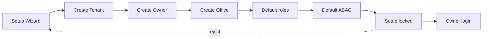
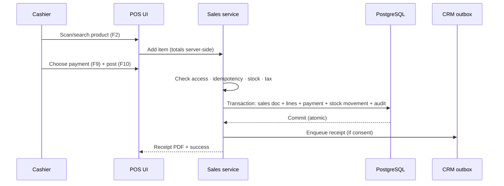
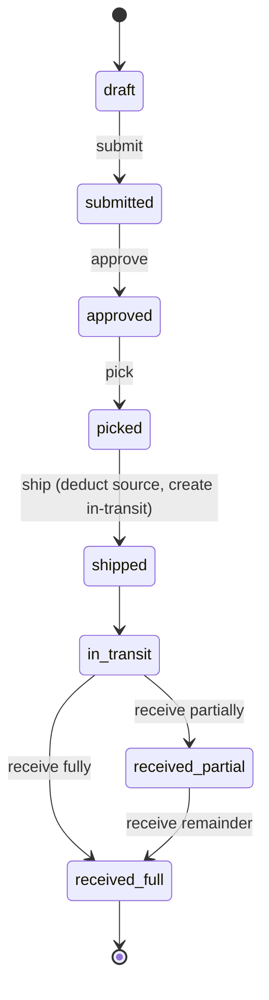
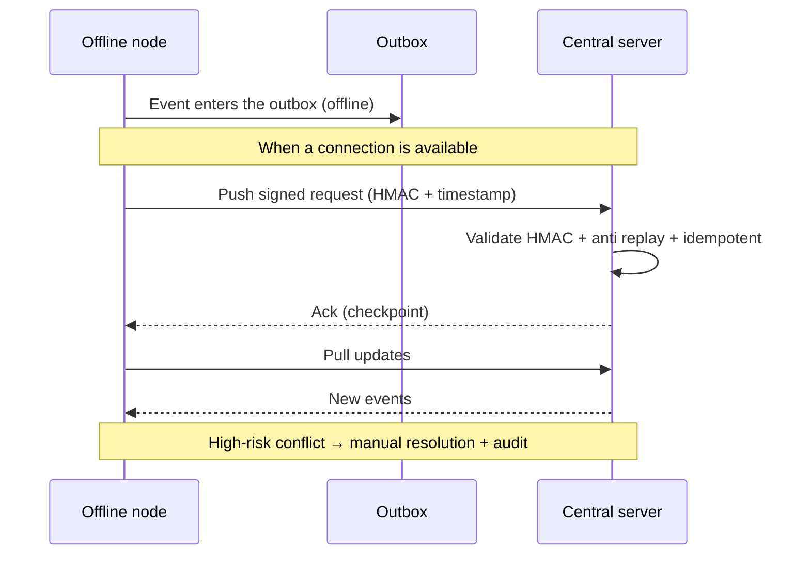
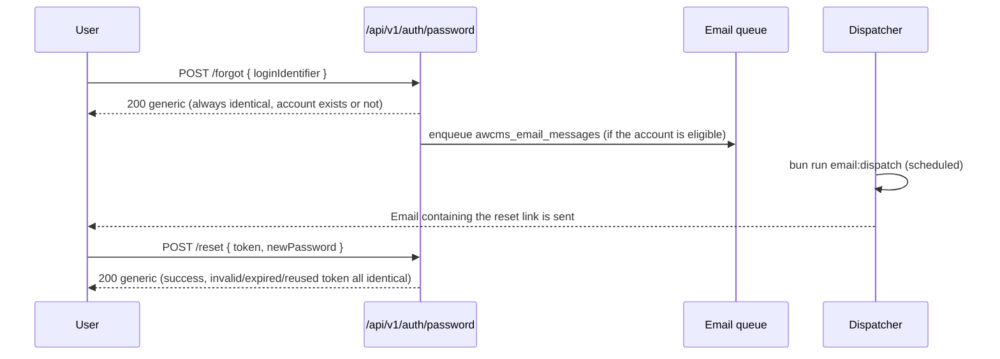

🇬🇧 English (source) · 🇮🇩 [Bahasa Indonesia](08_sop_operasional_user_guide.id.md)

# Part 8 — Operational SOP and User Guide

> **Example domain (illustrative).** This document uses an AWPOS-style retail/POS domain as a running example. Its **patterns & standards** are reusable for the AWCMS base; the **entities, endpoints, screens, and domain terms** (product, POS, warehouse, tax, CRM, AI, etc.) are illustrations that a derived application **replaces**. See the [document package README](README.md) §Reusable vs derived domain.

## Purpose

This document is the AWCMS operational guide for admins, owners, operators, warehouse staff, tax officers, CRM staff, customers, and technical admins.

## Operational principles

1. Every user uses their own account.
2. Accounts must not be shared.
3. Posted transactions are not edited directly.
4. Corrections go through cancel, return, reversal, or adjustment.
5. Important activity is recorded in the audit log.
6. High-risk activity requires approval.
7. Sensitive customer/tax data is masked according to role.
8. Deleting master data uses archive/soft delete; restore/purge is only for authorised roles.
9. Backups must be restore-tested.
10. POS can run offline.
11. Sync runs whenever a connection is available.

## SOP Initial installation

### Minimum prerequisites

| Component | Minimum             |
| --------- | ------------------- |
| CPU       | 2 cores             |
| RAM       | 4 GB                |
| Storage   | 80 GB SSD           |
| OS        | Linux Mint / Ubuntu |
| Database  | PostgreSQL          |
| Runtime   | Bun                 |

### Development/local steps

```bash
git clone <repo-awcms>
cd awcms
bun install
cp .env.example .env
docker compose up -d db
bun run db:migrate
bun run api:spec:check
bun run build
bun run dev
```

### Installation checklist

- Repository cloned successfully.
- Bun installed.
- PostgreSQL running.
- `DATABASE_URL` correct.
- `.env` not committed to Git.
- Migration succeeded.
- Build succeeded.
- Health endpoint up.
- Logs do not show secrets.

## SOP Initial Tenant Setup

Data to prepare:

- Tenant code.
- Tenant name.
- Legal name.
- Default language.
- Default theme.
- Owner name.
- Owner email.
- Owner password.
- Office code.
- Office name.
- Office type.

Flow:

```text
Setup Wizard → Tenant → Owner → Office → Role default → ABAC default → Setup locked → Owner login
```



Checklist:

- Tenant created.
- Owner created.
- Office created.
- Default roles created.
- Default ABAC created.
- Setup locked.
- Owner login succeeded.

## SOP Users, Roles, and Access

### Standard roles

| Role             | Function                                |
| ---------------- | --------------------------------------- |
| Owner            | Full access and primary approval        |
| Admin            | Manage system, products, users, reports |
| Cashier          | POS transactions                        |
| Manager          | Transaction/stock/operational approval  |
| Warehouse Staff  | Transfer, receiving, cycle count        |
| Inventory Staff  | Products, stock, limited adjustment     |
| Tax Officer      | Tax and Coretax                         |
| CRM Staff        | Contacts and receipt delivery           |
| Business Analyst | Aggregate reports and AI analyst        |
| Auditor          | Read-only audit trail                   |

### Add a user

1. Log in as owner/admin.
2. Open User & Access.
3. Add user.
4. Fill in name, email/username, phone number if needed, default office.
5. Choose a role.
6. Save.
7. The system creates the profile, identity, tenant user, assignment, audit log.

### Deactivate a user

1. Open the user detail.
2. Click deactivate.
3. Fill in the reason.
4. The system rejects that user's login.
5. Tokens can be revoked according to policy.
6. An audit log entry is recorded.

### Archive and restore master data

Use archive/soft delete for products, offices/locations, profiles/contacts, channels, or bins that are no longer in use. Do not physically delete day-to-day operational data.

1. Open the resource detail.
2. Choose archive/delete.
3. Fill in the reason.
4. The system hides the resource from the default list and from new transactions.
5. The system records `deleted_at`, actor, reason, and an audit log entry.
6. To restore, open the archive view, choose restore, and the system validates code/SKU/barcode conflicts and permissions.
7. Purge/anonymize is only done for retention/legal reasons by an authorised role, usually through approval.

Prohibited: do not archive posted transactions, posted stock movements, audit logs, security events, or exported tax batches; use cancel/return/reversal/adjustment/status lifecycle instead.

## SOP Central Profile

### Resolve a customer from POS

1. The cashier selects a customer.
2. Enter WhatsApp/email.
3. The system normalises the identifier.
4. If the profile exists, use the existing one.
5. If not, create a new profile.
6. The transaction uses `customer_profile_id`.

### Merge duplicate profiles

1. The admin opens Profile Governance.
2. Select the source and target profile.
3. Review identifiers/transactions/tax/CRM.
4. Create a merge request.
5. A supervisor approves.
6. Entity links are moved to the canonical profile.
7. The source becomes `merged`.
8. The audit entry is recorded.

Prohibited: do not merge just because the names look similar; do not merge tax-sensitive records without review.

## SOP Product Entry

Data to prepare:

- SKU.
- Barcode.
- Product name.
- Category.
- Brand.
- Base unit.
- Selling price.
- Tracking type: none/lot/serial/lot_serial.
- Status.
- Tax profile.

Steps:

1. Log in as admin/inventory.
2. Open Inventory → Products.
3. Add product.
4. Fill in the data.
5. Choose the tracking type.
6. Fill in the tax profile if needed.
7. Save.
8. The audit entry is recorded.

### Archive a product

- An archived product does not appear in the default search/list and cannot be sold.
- A product that has been used in a transaction still exists for receipt/report history.
- Restoring a product must check SKU/barcode conflicts and the tax profile.

## SOP Opening Stock Entry

### Without WMS

1. Open Inventory → Opening Stock.
2. Choose the office.
3. Choose the product.
4. Fill in the quantity.
5. Reason: implementation opening balance.
6. The system creates a stock balance and an `opening_balance` movement.

### With WMS/bins

1. Open Warehouse → Bin Balance.
2. Choose the warehouse, zone, bin.
3. Choose the product.
4. Choose the lot/serial if needed.
5. Fill in the quantity.
6. The system updates the bin balance and the stock summary.

## SOP Cashier Transactions

### Shortcuts

| Shortcut | Function                 |
| -------- | ------------------------ |
| F2       | Focus search/barcode     |
| F4       | Change quantity          |
| F6       | Discount, per permission |
| F8       | Hold transaction         |
| F9       | Payment                  |
| F10      | Post transaction         |
| Esc      | Close dialog             |

### Operational transaction flow



### Normal transaction

1. Log in as operator.
2. Open POS.
3. Make sure the tenant/office/operator is correct.
4. Scan/search the product.
5. Change the qty if needed.
6. Choose a customer if needed.
7. Choose the payment.
8. Enter the amount.
9. Post.
10. The system validates access, stock, totals, idempotency, tax.
11. The system creates the transaction, decrements stock, generates the receipt PDF.
12. Send the receipt if consent is active.

### If stock is insufficient

- Reduce the quantity.
- Remove the item.
- Contact admin/warehouse.
- Do not force negative stock without policy/approval.

## SOP Hold, Cancel, Return

### Hold

- Press F8.
- Add a note if needed.
- Checkout status `held`.
- Stock has not been decremented.

### Cancel a posted transaction

1. Open the transaction detail.
2. Request cancel.
3. Fill in the reason.
4. A workflow is created.
5. The manager/owner approves/rejects.
6. If approved, a reversal/cancel record is created and stock is corrected.

### Return

1. Find the original transaction.
2. Choose the items to return.
3. Fill in the quantity.
4. Choose the condition: good/damaged/expired/wrong item.
5. Choose the destination location/bin.
6. The system creates a return document and a `return_in` movement.

## SOP Warehouse Transfer

Statuses:

```text
draft → submitted → approved → picked → shipped → in_transit → received_partial/received_full
```



Steps:

1. Create a transfer from the source to the destination warehouse.
2. Add products, lot/bin, quantity.
3. Submit.
4. The approver reviews and approves.
5. Source staff ship.
6. The system decrements the source and creates in-transit.
7. The destination receives.
8. Good items go into a normal bin; damaged/expired go into quarantine.
9. The system increments destination stock and audits.

## SOP Cycle Count and Adjustment

1. Create a cycle count plan.
2. Choose warehouse/zone/bin/product.
3. Assign staff.
4. Staff enter the counted qty.
5. The system computes the variance.
6. The variance produces an adjustment request.
7. The manager approves/rejects.
8. If approved, an `adjustment` movement is created.

## SOP WhatsApp/Email Receipts

Prerequisites:

- The receipt PDF exists.
- The customer profile exists.
- The WhatsApp/email channel is valid.
- Consent is active.
- The provider is configured.
- If the provider needs a URL, the PDF is already online/on R2.

If it fails:

- Check the channel.
- Check consent.
- Check the PDF file/URL.
- Check the provider API key.
- Retry from the message outbox if warranted.

## SOP Customer Portal

Customers can:

- Open the receipt link.
- View the transaction summary.
- Download the PDF.
- Update WhatsApp/email consent.

If the link is invalid, show a simple message with no technical detail.

## SOP Offline-Online Sync



Flow:

1. The offline node creates an event.
2. The event enters the outbox.
3. When online, the node pushes a signed request.
4. The server validates the HMAC.
5. The server processes the event and acks.
6. The node updates the checkpoint.
7. The node pulls updates from the server.

High-risk conflicts are resolved manually with a reason and an audit entry.

Soft deletes are synchronised as tombstone events. An offline node must hide a resource once it has received a tombstone, but must not physically delete it before retention has been met.

## SOP Tax/Coretax

1. Set up the tenant tax profile.
2. Set up the office NITKU/ID TKU.
3. Set up the party tax profile.
4. Set up the product tax profile.
5. Generate a VAT invoice from posted sales.
6. Validate the invoice.
7. Create a Coretax batch.
8. Approval if the policy is active.
9. Generate the XML and checksum.
10. Audit the export.

Note: AWCMS is Coretax-ready/XML-ready; it does not assume an official upload API.

## SOP Email Module (base, epic #492)

Different from §SOP WhatsApp/Email Receipts above (the retail/POS example
domain "send the receipt", historical issue #390) — this section is the
generic base module (`src/modules/email/README.md`) for password reset,
system announcements, and workflow notifications. There is no dedicated
admin UI yet; this whole flow is API-only (`/api/v1/email/*`,
`/api/v1/auth/password/*`, `/api/v1/reports/email-health`).

### Password reset (end-user)



Operational note: the responses of `POST /forgot` and `POST /reset` are **always**
identical regardless of the internal outcome (anti-enumeration, Issue #496) — do
not conclude "the account does not exist" from the public response; use the audit
log (`password_reset_requested`/`_failed`/`_completed`) for internal diagnosis by
admin/support, not the public API response. A reset token is valid for
`AUTH_PASSWORD_RESET_TOKEN_TTL_MIN` minutes (default 30), is single-use, and the
identity's sessions are **fully revoked** after a successful reset.

### Sending an announcement/notification (admin)

1. (Optional) Preview first: `POST /api/v1/email/announcements/preview`
   with the same `templateKey`/`variables`/`target` — it returns
   `matchedCount` + a sample render, **never** the real recipient list,
   and writes nothing to the queue.
2. Send: `POST /api/v1/email/announcements` with the
   `Idempotency-Key` header (mandatory) — `target.type: "users"` for an
   explicit list (needs `email.notification.create`), `"role"`/`"tenant"`
   for bulk (needs the **additional** `email.announcement.create` — two-tier
   ABAC, Issue #497).
3. Every send is recorded in the audit trail (`announcement_sent`) with
   `targetType`/`templateKey`/`recipientCount`/`correlationId` —
   never the recipient list.

### Monitoring delivery and handling failures (admin/operator)

1. **Queue health**: `GET /api/v1/reports/email-health` —
   `queuedCount`/`retryWaitCount`/`failedCount`/`suppressedCount`,
   `isHealthy`. Run it periodically or after a provider incident.
2. **Detail of failed/pending messages**: `GET /api/v1/email/messages?status=failed`
   (or `retry_wait`) — per-message list (category, `lastError`,
   `retryCount`, `toAddressMasked` — never the raw address).
3. **Cancel deliveries that have not been sent** (e.g. an announcement with the
   wrong target/template): `POST /api/v1/email/messages/{id}/cancel` for
   every `queued`/`retry_wait` row with the same `correlationId` as the
   result of `POST /email/announcements` — rows already
   `sending`/`sent` cannot be cancelled (`409`).
4. **Manage the suppression list** (bounce/complaint/unsubscribe/manual):
   `GET /api/v1/email/suppressions` to view,
   `POST /api/v1/email/suppressions` to add manually (e.g. an opt-out
   request received through another channel), `DELETE /api/v1/email/suppressions/{id}`
   to revoke. Suppressed recipients are automatically excluded from the
   next announcement target, and are re-checked by the dispatcher right
   before sending (in case they were suppressed after enqueue).
5. **Provider outage**: the dispatcher stops automatically (circuit breaker,
   `email.dispatch.breaker_open` log) — no manual intervention needed,
   messages stay `queued`/`retry_wait` and are sent automatically once the
   provider recovers. Check `bun run email:provider:health` for a quick
   verification. See `src/modules/email/README.md` §Incident response for the
   full runbook (provider outage, credential rotation, accidental bulk
   send).

## SOP Module Management Module (epic #510, Issue #511-#521)

A database-backed, tenant-aware module registry (`src/modules/module-management/README.md`) — generic infrastructure for managing other modules, not a domain feature. There is no "command execution action" table — the job registry is pure documentation (see §Job registry inspection below), in line with the epic's out-of-scope boundary (no marketplace/runtime plugin installation).

### Module descriptor synchronisation

1. `POST /api/v1/modules/sync` (needs `module_management.modules.sync`) — reconciles `awcms_modules`/`_dependencies`/`_navigation`/`_jobs` with the current `listModules()` code. Idempotent — running it repeatedly is safe, the second run reports `unchanged`.
2. A module missing from the code (uninstalled/removed) is **marked** `lifecycle_status = 'disabled'`, never deleted — its dependency/navigation/jobs history remains as a historical record.
3. Several other actions (enable/disable a module, update settings, trigger a health check) automatically run this sync first inside the same transaction (FK to `awcms_modules`) — an operator does **not** have to run a manual sync before those actions.

### Enable/disable a module for a tenant

1. Check the status: `GET /api/v1/tenant/modules` (needs `module_management.tenant_modules.read`) — a list of all modules + enabled/disabled status for the calling tenant. A row without an explicit state means enabled (backward-compatible default).
2. Enable: `POST /api/v1/tenant/modules/{moduleKey}/enable` (needs `.enable`).
3. Disable: `POST /api/v1/tenant/modules/{moduleKey}/disable` (needs `.disable`) with body `{ "reason": "..." }` — **mandatory**, recorded in `disable_reason`.
4. Core modules (`isCore: true`, e.g. `module_management` itself) **cannot** be disabled — always `409 CORE_MODULE_CANNOT_BE_DISABLED`.
5. Disabling a module **never deletes tenant data** — it only writes an `awcms_tenant_modules` row. The disabled module's data stays intact, ready to be used again as soon as it is re-enabled.
6. Every enable/disable is recorded in the audit trail (`tenant_module_enabled`/`tenant_module_disabled`, `resource_type: tenant_module`, `resource_id: moduleKey`).
7. **The effect is real across every endpoint of that module**, not just the status on this page — the shared guard (`authorizeInTransaction`) rejects with `403 MODULE_DISABLED` any request to a module that the tenant has disabled (see `src/modules/identity-access/README.md` §"Disabled module enforcement").

### Update module settings (tenant)

1. `GET /api/v1/tenant/modules/{moduleKey}/settings` (needs `.settings.read`) — returns `defaults` (from the code), `tenantOverride` (what this tenant has set), and `effective` (the combination, override wins).
2. `PATCH /api/v1/tenant/modules/{moduleKey}/settings` (needs `.settings.update`) — the JSON body is **shallow-merged** into the existing override (keys not mentioned stay unchanged); it does **not** replace the whole object.
3. Secret-shaped keys (containing `password`/`token`/`secret`/`credential`/etc., the same list as the log/audit redaction) are **rejected** with `400 SETTINGS_SENSITIVE_KEY_REJECTED` — provider secrets always go through environment variables/a secret manager, never through tenant settings. **Values** that are credential-shaped (a JWT, a PEM private key block, an AWS access key id, a raw `Bearer`/`Basic` header, a connection string with `user:pass@`) are also rejected with `400 SETTINGS_SECRET_SHAPED_VALUE_REJECTED` even when the key name itself looks innocent (e.g. `publicLabel`) — checking the key name alone is not enough if the content is still a credential.
4. Every update is recorded in the audit trail (`settings_updated`) with **only the diff of changed keys** (`addedKeys`/`changedKeys`/`removedKeys`) — never the settings values themselves.

### Module health inspection

1. `GET /api/v1/modules/{moduleKey}/health` (needs `.health.read`) — fast, read-only, and **never** calls an external provider. Status `healthy`/`degraded`/`failed`/`unknown` derived from a set of signals (registry synced, migrations applied, permission catalogue in sync, settings valid, jobs documented, OpenAPI/AsyncAPI documented).
2. `POST /api/v1/modules/{moduleKey}/health/check` (needs `.health.check`) — the same signals as above **plus** a live check against the external provider if the module has one (only `email` at the moment, timeout-bounded, never blocking a normal business transaction). The result is recorded in `awcms_module_health_checks` (instance-level history) and audited (`health_checked`).
3. Every signal `detail` is a fixed generic text — **never** a raw error message, a stack trace, or a `DATABASE_URL`/secret value.

### Interpreting dependency validation errors

Error codes from `POST .../enable` or `.../disable` (all `409` unless stated otherwise):

| Code                               | Meaning                                                             | Action                                                           |
| ---------------------------------- | ------------------------------------------------------------------- | ---------------------------------------------------------------- |
| `MODULE_NOT_FOUND` (`404`)         | Module key is not registered or is globally disabled (code)         | Check the spelling/`GET /modules` for the valid list             |
| `MODULE_ALREADY_ENABLED`           | Already enabled for this tenant                                     | No action needed                                                 |
| `MODULE_ALREADY_DISABLED`          | Already disabled for this tenant                                    | No action needed                                                 |
| `MODULE_DEPENDENCY_MISSING`        | The required module is not registered at all                        | Check the descriptor `dependencies`; likely an authoring bug     |
| `MODULE_DEPENDENCY_DISABLED`       | The required module is disabled (globally or for this tenant)       | Enable the dependency first, then this module                    |
| `MODULE_REVERSE_DEPENDENCY_ACTIVE` | Another still-enabled module depends on this one                    | Disable the dependent module first, or abandon the disable plan  |
| `MODULE_DEPENDENCY_CYCLE`          | A circular dependency was detected in the graph                     | Descriptor authoring bug — report it to the owning module's team |
| `MODULE_VERSION_INCOMPATIBLE`      | The module's `minAppVersion` is higher than the current app version | Upgrade the application before enabling this module              |
| `CORE_MODULE_CANNOT_BE_DISABLED`   | Core module (`isCore: true`)                                        | Cannot be disabled — this is not a bug                           |

### Job registry inspection

1. `GET /api/v1/modules/{moduleKey}/jobs` (needs `.jobs.read`) — the list of the module's operational commands (`command`, `purpose`, `recommendedSchedule`, `environmentNotes`, `safeInOfflineLan`). **Pure documentation** — there is no endpoint to run a command from here, and there never will be (see §Security constraints of this epic in doc 20).
2. To schedule a command that appears here (e.g. `bun run sync:objects:dispatch`, `bun run logs:audit:purge`), see `docs/awcms/deployment-profiles.md` §Other job registry.

### Module misconfiguration incidents

1. **A module looks "degraded"/"failed" in the health check**: read `signals[].detail` to find out which signal failed (e.g. `db_registry_synced` failed → run `POST /modules/sync`; `permission_catalog_synced` failed → the permission migration has not been applied, check the latest migration).
2. **A tenant accidentally disabled a module another module needs**: the dependency graph prevents this on the enable side (`MODULE_DEPENDENCY_DISABLED`) — but if it already happened (e.g. it was disabled before its dependent existed), re-enable it via `POST .../enable`, no data is lost.
3. **A tenant accidentally filled settings with a wrong value**: `PATCH .../settings` with the correct value for the same key — the shallow merge means only that key changes.
4. **Suspicion that a secret was entered into settings**: the request will be **rejected** at request time (`SETTINGS_SENSITIVE_KEY_REJECTED` for a secret-named key, `SETTINGS_SECRET_SHAPED_VALUE_REJECTED` for a credential-shaped value even when the key is not — see §Update module settings above) — if a value leaked in through another path, the `settings_updated` audit contains only the key name (not the value), so check the `awcms_module_settings` rows directly (DB admin) as the forensic step, then rotate the credential in question in the environment variable/secret manager.
5. **A core module disabled by accident**: impossible — enforced server-side (`CORE_MODULE_CANNOT_BE_DISABLED`), not just a UI hint.

## SOP Blog Content Module (epic #536, Issue #537-#543)

> **LIVE in this repo.** `src/modules/blog-content/`, `sql/035`–`sql/040`,
> screens `/admin/blog`, `/admin/blog-pages`, `/admin/blog-presentation`,
> `/admin/blog-taxonomy`. This module also absorbed the former `news_portal`
> ([ADR-0044](../adr/0044-merge-news-portal-into-blog-content.md)). The SOP below
> is an operational SOP, not a target specification.

The first domain module registered directly in this base repo rather than in a derived application (ADR-0009, `src/modules/blog-content/README.md`). Full admin UI at `/admin/blog` (Issue #543), admin API at `/api/v1/blog/*` (Issue #538-#542), anonymous public routes at `/blog/{tenantCode}/*` (Issue #540).

### Managing content through the admin UI

1. Open `/admin/blog` — the dashboard shows a summary of posts/drafts/scheduled/pages and quick links. This menu only appears in the sidebar for roles that have `blog_content.posts.read`.
2. **New post**: `/admin/blog/posts/new` — fill in title/slug/excerpt/content/visibility/SEO/category/tags/locale, save (the initial status is always `draft`). A slug conflict (`409 SLUG_CONFLICT`) is shown directly in the action banner.
3. **Publishing a post**: from `/admin/blog/posts/{id}`, the "Publish"/"Schedule"/"Archive" buttons only appear if that status transition is valid from the current status **and** the calling role has the permission for that action (`blog_content.posts.publish`/`.schedule`/`.archive`) — all of them ask for confirmation first and then send a fresh `Idempotency-Key`, safe against double clicks.
4. **Revision history**: the "Revision history" panel in the post editor (not the page editor — see §Limitations below) shows every significant content change; the "Restore" button (needs an explicit `blog_content.revisions.restore` — owning the post does not automatically grant it) writes the old revision's content back **and** adds a new revision recording that restore — history is never lost.
5. **Categories vs tags**: `/admin/blog/categories` (one level of hierarchy allowed) and `/admin/blog/tags` (two separate screens — the tag screen structurally has no parent field at all, it is not merely hidden).
6. **Blog settings**: `/admin/blog/settings` — blog title/description, posts per page, enable/disable RSS and sitemap, default locale/visibility, default SEO title template, and theme mode (tenant override, `light`/`dark`/`system`).
7. **Static pages**: `/admin/blog/pages` — CRUD only, **no** publish/schedule/archive buttons (see §Limitations). Page visibility/status is set manually through the existing `visibility` field, not through a lifecycle action.
8. **Advanced screens (optional, live because Issue #542 has landed)**: `/admin/blog/templates`/`/widgets`/`/menus`/`/ads` — CRUD for presentation/monetisation master data. Menu `items` and ad `placements` are edited through labelled JSON textareas (not a visual editor) — read the help text under each field before saving.

### Disabling RSS/sitemap per tenant

1. `/admin/blog/settings` — untick "Enable RSS feed"/"Enable sitemap", save.
2. Verify: `GET /blog/{tenantCode}/feed.xml` or `.../sitemap-blog.xml` returns a `404` identical to that of an unknown tenant — no "the feature exists but is switched off" signal leaks to a public visitor.

### Scheduling scheduled publishing

1. `bun run blog:publish:scheduled` (`scripts/blog-scheduled-publish.ts`) — an internal worker, **not** an HTTP endpoint and **not** triggered by any UI button. It publishes every post with `status='scheduled'` whose `scheduled_at` has passed, per active tenant.
2. Schedule it via cron/a systemd timer every 1-5 minutes (see `docs/awcms/deployment-profiles.md` §Other job registry, the same pattern as `sync:objects:dispatch`/`logs:audit:purge`) — this job also appears in `GET /api/v1/modules/blog_content/jobs` (the Module Management job registry, pure documentation, Issue #519) for operators who inspect through the API.
3. Idempotent by construction — running it repeatedly at the same moment is a pure no-op (a post that is already `published` or whose `scheduled_at` is still in the future does not match the job's condition).

### Limitations operators/editors need to know

1. **Static pages have no lifecycle action** — there is no publish/schedule/archive/restore/purge button for a page, unlike a post. Their permissions are already seeded in the database but no endpoint uses them yet (open backlog, not a bug).
2. **There is no public route for static pages** — only posts appear at `/blog/{tenantCode}/...`; a page created through the admin UI cannot yet be reached through a public URL.
3. **There is no public route for widgets/ads** — their CRUD is fully functional in the admin UI, but there is no real placement on any public page that renders them.
4. **The content editor uses labelled JSON textareas**, not a visual/WYSIWYG editor — the "Content blocks (JSON)" field requires a valid `{ "blocks": [...] }` format (paragraph/heading/list/quote/gallery). A wrong format is rejected before submit (client validation) as well as on the server.

## SOP Data Lifecycle Module (epic platform-evolution #738, Issue #745)

> **LIVE in this repo.** `src/modules/data-lifecycle/`, `sql/055`–`sql/056`,
> screen `/admin/data-lifecycle`. The SOP below is an operational SOP, not a
> target specification.

A cross-module registry for high-volume tables (retention/partition/archive/legal-hold/purge descriptors declared by the owning module) plus the lifecycle engine that enforces them. There is no dedicated admin UI screen yet — operation is purely through the `/api/v1/data-lifecycle/*` API.

- **Scheduled job**: `bun run data-lifecycle:archive-purge` — daily via cron/a systemd timer. It archives (where applicable) and purges rows past retention for every generic-execution descriptor; it records a dry-run backlog snapshot for delegated descriptors (legacy adopters). Purely database + local filesystem operations, safe in the offline/LAN profile.
- **Manual/on-demand actions**: `GET/POST /api/v1/data-lifecycle/dry-run` to preview the impact before a real purge; `POST /api/v1/data-lifecycle/legal-holds` to create a legal hold (holding rows back from a normal purge) and `POST /api/v1/data-lifecycle/legal-holds/{id}/release` to release it; `GET /api/v1/data-lifecycle/runs` for the job execution history. Legal hold create/release must be audited (see the `awcms-audit-log` skill).

## SOP Reporting Projections Module (epic platform-evolution #738 Wave 3, Issue #753)

The read-model projection mechanism based on module contributions (incremental cursor-based and domain-event-driven), complementing the five existing live management reporting views. Admin UI: `/admin/reporting/projections`.

- **Scheduled jobs**: `bun run reporting:projections:refresh` — every 2 minutes, incrementally refreshes every `cursor_table`-strategy projection and continues any rebuild in progress. `bun run reporting:exports:dispatch` — every 15 minutes, produces a new export artifact for every scheduled export config that is due.
- **Manual/on-demand actions**: from `/admin/reporting/projections`, an admin can trigger/resume a full rebuild of a projection, create/disable a scheduled export config, and trigger a single manual export run — all purely database operations, safe in the offline/LAN profile.

## SOP Identity Access Module — Business Scope & SoD (epic platform-evolution #738 Wave 2, Issue #746; hierarchy-aware matching Issue #794/#802/#804)

> **LIVE in this repo, with one screen that does not exist yet.** The tables and
> the code are here: `sql/027`–`sql/030`, `src/modules/identity-access/domain/business-scope-assignment.ts`,
> `application/business-scope-expiry-job.ts`, and the `/admin/security` screen.
> What is **not** here yet is the `/admin/business-scope` screen — assignments today
> are managed through the API and the job, not a UI. The parts of this SOP that
> mention that screen read as a target; the rest is operational.

Business-scope assignment (legal entity/organization unit) and Segregation-of-Duties (SoD) conflict exceptions, built on top of `identity_access`. Admin UI: `/admin/business-scope` (assignment) and `/admin/security` (SoD/access governance).

- **Scheduled job**: `bun run identity-access:business-scope:expiry` — hourly, transitions business-scope assignments and SoD conflict exceptions whose `effective_to` has passed into expired, recording a lifecycle event. Purely database operations.
- **Manual/on-demand actions**: granting/revoking a business-scope assignment, and reviewing/approving a SoD conflict exception from `/admin/business-scope`/`/admin/security` — both must be audited. SoD matching is already hierarchy-aware for `same_scope_only` (see `checkHighRiskSoDConflicts`, PR #800/#804) — operators need to understand that an exception's effective coverage follows the organisation hierarchy, not only an exact scope match.

## SOP Reference Data Module (epic platform-evolution #738 Wave 3, Issue #750, ADR-0021)

> **READING ONLY — the `reference_data` module DOES NOT EXIST in this repo yet**
> (it exists in awcms-mini; `ls src/modules` does not contain `reference-data`, and
> there is no `awcms_reference_value_sets`/`awcms_reference_codes` in `sql/`). The SOP
> below is the target specification for when this module is **built
> here through its own admission ADR** (ADR-0055 §1) — it is not an
> operational SOP that can be run today.

An optional, provider-neutral reference data foundation: global value sets and codes (`awcms_reference_value_sets`/`awcms_reference_codes`) with provenance/deprecation, plus a tenant-scoped override/extension layer that never mutates the global baseline. Admin UI: `/admin/reference-data/value-sets`, `/admin/reference-data/codes`, `/admin/reference-data/tenant-codes`.

- **Scheduled job**: none — this module does not register `jobs` in `module.ts`. `bun run reference-data:contributions:sync` is a one-off synchronisation (run manually/in CI when a module's contribution descriptor changes), not a scheduled dispatcher.
- **Manual/on-demand actions**: import dry-run/diff (non-mutating) then commit (re-validated inside the same transaction, rejecting a destructive replacement of a code already referenced by tenant data) from `/admin/reference-data/*`; running `reference-data:contributions:sync` after adding/changing another module's `ModuleDescriptor.referenceData.contributesValueSets`.

## SOP Domain Event Runtime Module (epic platform-evolution #738 Wave 1, Issue #742)

A transactional, versioned, multi-consumer domain-event outbox — the generic foundation replacing the single-purpose outboxes (`sync-storage`, `email`, `social-publishing`). There is no dedicated admin UI screen yet — operation is through the `/api/v1/domain-events/*` API.

- **Scheduled job**: `bun run domain-events:dispatch` — every 30-60 seconds, claims/executes/finalizes due deliveries with per-order-key ordering, exponential backoff, and dead-lettering. A safe no-op when there is no due backlog.
- **Manual/on-demand actions**: `POST /api/v1/domain-events/deliveries/{id}/replay` to replay a dead-lettered delivery (permission-gated, reason mandatory, idempotent, audited); `POST /api/v1/domain-events/consumers/{name}/pause` or `.../resume` to pause/resume a consumer per tenant.

## SOP Workflow Approval Module — Escalation (epic platform-evolution #738 Wave 2, Issue #747)

A graph-based workflow engine (quorum/any/all, delegation, escalation/timeout) that evolves the linear approval of Issue 11.1. Admin UI: `/admin/workflows`.

- **Scheduled job**: `bun run workflow:escalations:dispatch` — every 1-5 minutes, escalates tasks past `due_at` (bounded batch, advisory lock, idempotent per escalation step).
- **Manual/on-demand actions**: from `/admin/workflows`, admin-recovery actions (`reassign`/`cancel`/`force-decision`) are available for stuck tasks — each requires an explicit permission, a reason, an `Idempotency-Key`, and is fully recorded in the audit log.

## SOP Organization Structure Module (epic platform-evolution #738 Wave 2, Issue #749, ADR-0016)

> **READING ONLY — the `organization_structure` module DOES NOT EXIST in this
> repo yet** (it exists in awcms-mini; `ls src/modules` does not contain
> `organization-structure`, and there is no migration for it in `sql/`). The SOP
> below is the target specification for when this module is **built
> here through its own admission ADR** (ADR-0055 §1) — it is not an
> operational SOP that can be run today.

An optional tenant-scoped organisation structure foundation: legal entities, organisation unit types, organisation units, versioned/effective-dated parent-child hierarchy (SCD Type 2 — a reparent never mutates in place), operational locations, location-unit relations, and party/unit assignments. Admin UI: `/admin/organization-structure/{legal-entities,unit-types,units,hierarchy,locations,assignments}`.

- **Scheduled job**: `bun run organization-structure:metrics-snapshot` — every 15-60 minutes, snapshots read-only metrics (number of active units, maximum hierarchy depth, assignments nearing expiry) as gauges through the metrics port. It never mutates data.
- **Manual/on-demand actions**: CRUD for legal entities/units/unit types, reparenting a hierarchy edge (closing the current period then opening a new one, transactionally validated with a tenant-wide advisory lock — never a cycle/self-parent/overlap), plus managing operational locations and assignments — all from `/admin/organization-structure/*`.

## SOP Integration Hub Module (epic platform-evolution #738 Wave 3, Issue #754, ADR-0019)

> **READING ONLY — the `integration_hub` module DOES NOT EXIST in this repo yet**
> (it exists in awcms-mini; `ls src/modules` does not contain `integration-hub`,
> and there is no migration for it in `sql/`). The SOP below is the target
> specification for when this module is **built here through its own admission
> ADR** (ADR-0055 §1) — it is not an operational SOP that can be run today.

A generic, provider-neutral integration boundary: signed inbound webhook endpoints (per-endpoint HMAC, key rotation with overlap), replay protection enforced in the database, normalisation of verified inbound messages into domain-event form through `domain_event_runtime`, and outbound subscriptions with SSRF-guarded delivery. Admin UI: `/admin/integration-hub/{endpoints,subscriptions,deliveries}`.

- **Scheduled job**: `bun run integration-hub:outbound:dispatch` — every 1-2 minutes, claims/sends/finalizes due outbound deliveries for every active subscription, with retry/backoff and dead-letter transitions. Real network egress to each subscription's `target_url` (the job itself always runs; connectivity is only needed if the target is on the public internet).
- **Manual/on-demand actions**: registering/rotating an inbound endpoint secret, managing outbound subscriptions (declarative filters, bounded), and inspecting deliveries/DLQ (including operator-safe replay) from `/admin/integration-hub/*`.

## SOP Data Exchange Module (epic platform-evolution #738 Wave 3, Issue #752, ADR-0018)

> **READING ONLY — the `data_exchange` module DOES NOT EXIST in this repo yet**
> (it exists in awcms-mini; `ls src/modules` does not contain `data-exchange`, and
> there is no migration for it in `sql/`). The SOP below is the target specification
> for when this module is **built here through its own admission ADR**
> (ADR-0055 §1) — it is not an operational SOP
> that can be run today.

A staged, provider-neutral CSV/JSON import/export framework, contributed by each owning module through its own descriptor+adapter (this module never writes directly into another module's tables). Admin UI: `/admin/data-exchange/{imports,exports}`.

- **Scheduled job**: `bun run data-exchange:worker` — every 1-2 minutes, parses/validates staged import batches, commits previewed batches in a bounded per-row pass (resumable via `commit_cursor`), executes queued export jobs, and records reconciliation reports. Purely database/in-process operations, safe in the offline/LAN profile.
- **Manual/on-demand actions**: staging a new import, previewing (non-mutating), cancel/retry-resume/pause-resume of an import batch, plus triggering/cancelling an export job from `/admin/data-exchange/*`; download the export result through the same download endpoint.

## SOP Backup/Restore

Backup:

```bash
pg_dump --format=custom --file=/backup/awcms_$(date +%Y%m%d_%H%M%S).dump "$DATABASE_URL"
```

Restore test:

```bash
createdb awcms_restore_test
pg_restore --dbname=awcms_restore_test --clean --if-exists /backup/awcms_YYYYMMDD_HHMMSS.dump
```

Restore validation:

- Tenant/user/product/stock/transaction data readable.
- Login test.
- POS smoke test.
- Report smoke test.

## Quick troubleshooting

### The application will not open

- `systemctl status awcms`
- `journalctl -u awcms -n 100`
- Check `.env`, the database, disk, port.

### The database will not connect

- `bun run db:pool:health`
- Check PostgreSQL, DATABASE_URL, firewall, max connections, PgBouncer.

### Transactions are slow

- Check pool health.
- Check slow queries.
- Check heavy reporting.
- Check large sync batches.
- Check disk I/O.

### Sync fails

- Check the node ID.
- Check the HMAC secret.
- Check the server clock.
- Check the online endpoint.
- Check for conflicts.

## Handover checklist

- README.
- Architecture guide.
- Deployment guide.
- Env guide.
- Migration guide.
- Backup restore SOP.
- Admin guide.
- Cashier guide.
- Warehouse guide.
- Tax guide.
- CRM guide.
- Security guide.
- Troubleshooting guide.
- API docs.
- Production readiness report.
