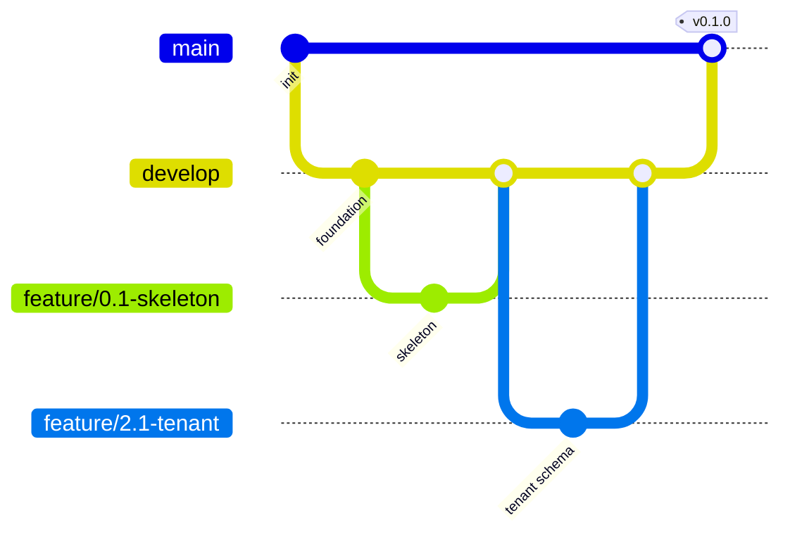
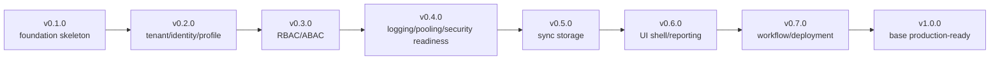
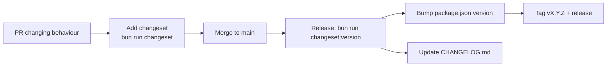

🇬🇧 English (source) · 🇮🇩 [Bahasa Indonesia](09_roadmap_repository_commit.id.md)

# Part 9 — Repository Technical Roadmap and Commit Order

## Purpose

This document is the technical guide for implementing the AWCMS repository: folder structure, branches, atomic commits, migration order, API/UI/testing order, release versioning, merge/deploy checklist, and the implementation report template.

## Repository principles

1. Every change is atomic.
2. Do not mix unrelated changes.
3. A database change must be a migration.
4. An API change must be in OpenAPI.
5. An event change must be in AsyncAPI.
6. A high-risk mutation must be idempotent.
7. A high-risk action must be audited.
8. Deletable resources use soft delete; posted/append-only entities are not deleted.
9. Do not commit `.env`, tokens, backups, DB dumps, or real customer data.

## Final repository structure

```text
awcms/
├── AGENTS.md
├── README.md
├── CHANGELOG.md         # generated by Changesets
├── .changeset/          # config + changeset entries
├── .claude/skills/      # Claude Code project skills
├── package.json
├── bun.lock
├── astro.config.mjs
├── tsconfig.json
├── .env.example
├── .gitignore
├── docker-compose.yml
├── src/
├── sql/
├── scripts/
├── openapi/
├── asyncapi/
├── docs/
├── deploy/
├── tests/
├── fixtures/
└── public/
```

## Source structure

```text
src/
├── lib/
│   ├── db.ts
│   ├── database/
│   ├── logging/
│   ├── auth/
│   ├── files/
│   └── errors/
├── modules/
│   ├── _shared/
│   ├── tenant-admin/
│   ├── identity-access/
│   ├── profile-identity/
│   ├── sync-storage/
│   ├── localization-ui/
│   ├── observability-logging/
│   ├── database-connectivity/
│   ├── workflow-approval/
│   ├── management-reporting/
│   ├── ui-experience/
│   └── production-security-readiness/
└── pages/
    ├── api/v1/
    └── admin/
```

Domain modules (e.g. `catalog-inventory`, `sales-pos`, `warehouse-management`, `accounting-tax`, `crm-communication`, `ai-analyst`, plus website/e-commerce modules) are added **directly in `src/modules/`** of this template ([ADR-0034](../adr/0034-awcms-family-direct-use-templates-and-derived-pathway-removal.md)/[ADR-0035](../adr/0035-awcms-online-first-erp-saas-superset-repositioning.md)) as modules of type `domain`, not in a separate derived repository.

## Standard module structure

```text
src/modules/<module>/
├── module.ts
├── domain/
├── application/
├── infrastructure/
├── api/
└── README.md
```

## Branch strategy



| Branch                   | Function                |
| ------------------------ | ----------------------- |
| `main`                   | Stable/production-ready |
| `develop`                | Feature integration     |
| `feature/<issue>-<name>` | Atomic feature          |
| `fix/<issue>-<name>`     | Bug fix                 |
| `release/vX.Y.Z`         | Release prep            |
| `hotfix/vX.Y.Z-<name>`   | Production hotfix       |

## GitHub issue snapshot

Atomic issues are created or recreated from `docs/awcms/06_github_issues_detail.md`, which remains the planned backlog rather than evidence of active issues.

> **Not adopted here.** The committed snapshot this section describes —
> `docs/awcms/github/` — does not exist in this repo and never has. Read the
> rules below as the shape a snapshot would take if one were adopted; for the
> actual tracker state, query `gh` (see the `awcms-github-snapshot` skill).

Rules (target shape):

1. Issue snapshots are split by state: `issues-open-NNN.md` and `issues-closed-NNN.md`.
2. Each snapshot file contains at most 100 issues.
3. A snapshot carries issue metadata, body, labels, milestone, assignee, timestamps, URL, and comments.
4. Labels and milestones are recorded in `docs/awcms/github/labels-milestones.md`.
5. A snapshot refresh is done after a mass issue change, before a sprint audit, and before a release report.

## Commit convention

Format:

```text
<type>(<scope>): <summary>
```

Examples:

```text
feat(profile): add central profile schema
feat(sync): add offline sync outbox and inbox
fix(access): prevent privilege escalation on role assignment
docs(security): add production readiness checklist
test(access): add ABAC default deny tests
```

Types: `feat`, `fix`, `docs`, `test`, `refactor`, `chore`, `security`, `perf`, `ci`, `build`.

Scopes: `foundation`, `db`, `api`, `auth`, `access`, `profile`, `tenant`, `sync`, `ui`, `logging`, `pooling`, `workflow`, `reporting`, `security`, `docs`. A domain module adds its own domain scope (e.g. `pos`, `inventory`, `warehouse`, `tax`, `crm`, `web`, `commerce`).

## Main atomic commit order

### Sprint 1

1. `feat(foundation): initialize Bun Astro modular monolith skeleton`
2. `feat(db): add SQL migration runner`
3. `feat(api): add OpenAPI and AsyncAPI baseline contracts`
4. `feat(shared): add soft delete repository conventions`
5. `chore(deploy): add local PostgreSQL Docker Compose profile`

### Sprint 2

1. `feat(tenant): add tenant office and physical location schema`
2. `feat(profile): add central profile management schema`
3. `feat(profile): add profile resolver and entity linking service`
4. `feat(auth): add identity login and tenant user membership`

### Sprint 3

1. `feat(access): add RBAC ABAC schema and activity registry`
2. `feat(access): implement ABAC evaluator with deny by default`
3. `feat(access): add access assignment API and audit trail`

### Sprint 4

1. `feat(logging): add structured logger and request correlation`
2. `feat(logging): add cross-module audit event helper`
3. `feat(pooling): add database pool gate and backpressure`
4. `security(production): add production security readiness checklist`

### Sprint 5

1. `feat(sync): add offline sync outbox inbox and signed API`
2. `feat(sync): add sync conflict tracking and resolution`
3. `feat(sync): add R2 object sync queue`

### Sprint 6

1. `feat(ui): add UI persona screen and navigation registry`
2. `feat(ui): build admin shell with modular navigation`
3. `feat(reporting): add management reporting views and dashboard API`

### Sprint 7

1. `feat(workflow): add cross-module approval workflow engine`
2. `chore(deploy): add offline LAN and production deployment profiles`
3. `docs(handover): add operational SOP and handover manual`

Domain modules add their own domain sprints/commits in `src/modules/` of this template once the base foundation is ready.

## Final recommended migration order

> **The table below is a historical plan, already superseded — it is not the migration order that was actually applied.** The prose below this table itself (starting at "Reality diverged from the plan above") documents how reality diverged from this plan as the 18 backlog issues were worked (file names, slot numbers, and even the existence of several migrations changed). For the migration order/names that **actually exist** in this repo today, run `ls sql/` or see [`repo-inventory.md`](repo-inventory.md) — do not use the file-name list below as a reference for `sql/NNN` you can cite.

```text
001_awcms_foundation_schema.sql
002_awcms_tenant_office_schema.sql
003_awcms_central_profile_management_schema.sql
004_awcms_identity_login_schema.sql
005_awcms_abac_access_control_schema.sql
006_awcms_setup_wizard_schema.sql
007_awcms_sync_storage_outbox_inbox_schema.sql
008_awcms_sync_storage_conflict_schema.sql
009_awcms_object_sync_queue_schema.sql
010_awcms_management_reporting_permission_schema.sql
011_awcms_audit_logging_schema.sql
012_awcms_workflow_approval_schema.sql
013_awcms_i18n_po_schema.sql
014_awcms_theme_mode_schema.sql
015_awcms_ui_ux_persona_experience_schema.sql
016_awcms_modular_monolith_contracts_schema.sql
017_awcms_dashboard_materialized_views.sql
```

Note: after production, a migration must not be renamed carelessly. A correction must be a new migration. Domain modules continue their own migration numbering starting from the number after the last migration above (a single sequential numbering in this template, with no separate namespace).

**REVOKED by [ADR-0034](../adr/0034-awcms-family-direct-use-templates-and-derived-pathway-removal.md) (which supersedes ADR-0014).** The entire derived-application pathway mechanism this old paragraph described — `src/modules/application-registry.ts`, `composeModuleRegistry()`, the reserved migration namespaces `1-899` vs `900+` (`BASE_MODULE_MIGRATION_NAMESPACE`), and `ApplicationModuleRegistry.migrationNamespace` — is **removed**. The AWCMS family is now a **used-directly** template: domain/website modules are added directly to `src/modules/` of this template, and their migrations continue the base sequential numbering with no separate reserved namespace (see the "starting from the number after the last migration" rule in the previous paragraph, which becomes the only rule that applies again). Correction note: `src/modules/application-registry.ts` indeed **does not exist** in this repo (and deliberately never will), but **`bun run modules:compose:check` NOW EXISTS** in `package.json` — its role today is to validate the base registry composition directly (`scripts/validate-module-composition.ts`), not to enforce the revoked derived-pathway namespace.

`002` was originally named `tenant_identity_schema` (merging Issue 2.1 and 2.3); it was split so that one migration = one issue: `002` scopes Issue 2.1 (tenant/office), `004` scopes Issue 2.3 (identity/login). `006` (setup wizard, Issue 12.1) was implemented earlier than originally planned (slot `015`) as soon as Issue 2.1–2.4 finished — per `docs/awcms/06_github_issues_detail.md` §Sprint order correction, which places 12.1 right after 2.4. `007` (Issue 6.1 — sync nodes/outbox/inbox), `008` (Issue 6.2 — sync conflict tracking), and `009` (Issue 6.3 — R2 object sync queue) were split out of the combined `sync_storage_r2` plan, completing epic M5 (Sync Storage) in full; `008` also adds an `ALTER TABLE` on the `sync_push_batches` table owned by `007` (a correction via a new migration, not by editing `007`), and `008`/`009` each insert new permissions into the `awcms_permissions` catalogue (`005`). `009` does not call a real R2/Cloudflare SDK — only a local queue plus a `requires_upload` column driven by the `R2_ENABLED` env; the real upload dispatcher remained backlog at that time (later built by Issue #436, migration `018` — see `src/modules/sync-storage/README.md` §Dispatcher), same as `awcms_sync_outbox` (local cross-node events) which also had no live dispatcher when `007`/`009` were written. `010` (Issue 9.1 — management reporting) was implemented earlier than originally planned (slot `016`) because 9.1 depends only on M2 (finished) and follows right after 8.1 in the actual sprint, not after M8; this migration only inserts one new permission (`reporting.dashboard.read`) into the `005` catalogue — its four report views (tenant activity, access/audit, sync health, module usage) are pure read aggregations over already-existing tables (`002`-`009`), no new tables. The old `016` slot (`management_dashboard_reporting_schema`) was dropped from the plan because it had already materialised as `010`; the remaining migrations `011`-`019` shift down one slot to follow. `011` (Issue 10.1 — structured logging & audit trail) stays at the same number as planned, only the file name was changed from `logging_observability_schema` to `audit_logging_schema` so it reflects the real scope (the generic `awcms_audit_events` table + 2 new permissions — `logging.audit_trail.read` and `profile_identity.profile_management.purge`; `profile_identity.profile_management.delete`/`.restore` had been seeded since `005`); Issue 10.2 (connection pooling & backpressure) turned out to need no migration at all — pool config, the work-class gate, and the circuit breaker are all pure application infrastructure (`src/lib/database/`) in front of an already-existing connection, not new schema. The old `012` slot (`database_connection_pooling_schema`) was dropped from the plan; the remaining migrations `013`-`019` shift down one slot to become `012`-`018`. Issue 10.3 (production security readiness checklist) also needs no migration — its deliverable is three CLI scripts (`bun run db:pool:health`, `bun run security:readiness`, `bun run production:preflight`) that verify already-existing controls (RLS, ABAC default-deny, audit trail, pool health), not new schema. The old `012` slot (`production_security_readiness_schema`) was dropped from the plan; the remaining migrations `013`-`018` shift down one slot to become `012`-`017`. Issue 11.1 (workflow approval engine) landed earlier than originally planned (slot `015`, named `workflow_approval_audit_schema`) because it follows right after 10.3, which needs no migration; it occupies the newly vacated `012` slot, with the file name adjusted to `workflow_approval_schema` (4 generic tables — definitions/instances/tasks/decisions — plus the generic idempotency table `awcms_idempotency_keys` shared by any future high-risk mutation endpoint). The old `012`-`014` slots (`i18n_po_schema`, `theme_mode_schema`, `ui_ux_persona_experience_schema`) shift down one to become `013`-`015`. The numbering `013` onwards above is a plan; the final numbers are decided when each issue is actually implemented in order.

**Reality diverged from the plan above (2026-07-06)**: all 18 backlog issues in doc 06 were completed without ever implementing the planned slots `013`-`017` (`i18n_po_schema`, `theme_mode_schema`, `ui_ux_persona_experience_schema`, `modular_monolith_contracts_schema`, `dashboard_materialized_views` — never filed as GitHub issues, they remain aspirational sketches for the base v2/derived-application roadmap, not part of the 18 backlog issues actually worked). Migrations `013`-`015` that actually exist in `sql/` are **post-backlog maintenance** entirely unrelated to the plan above — not the realisation/renumbering of any slot: `013_awcms_enforce_rls_least_privilege.sql` (RLS `FORCE` enforcement + least-privilege application role), `014_awcms_sync_node_management_permission_schema.sql` (seed permissions for sync node admin), and `015_awcms_tenant_settings_management_permission_schema.sql` (seed permissions for Settings admin) — all three are recorded in full in `AUDIT_STANDAR_PENGEMBANGAN_2026-07-04.md` §Post-backlog maintenance, not here, because they are not part of the planned backlog issues.

## API implementation order

1. Shared response/error helper.
2. Tenant context middleware.
3. Auth middleware.
4. ABAC middleware.
5. Idempotency middleware.
6. Soft delete query/repository helper.
7. Audit helper.
8. Logging middleware.
9. `/setup/status` and `/setup/initialize`.
10. `/auth/login` and `/auth/me`.
11. `/access/evaluate`.
12. `/profiles/resolve`.
13. Soft delete/restore endpoints for deletable master data.
14. `/sync/push` and `/sync/pull`.
15. `/reports/*` (generic views: tenant activity, access/audit summary, sync health).
16. `/security/go-live-gates/evaluate`.

Domain modules add their own domain endpoints (e.g. catalogue, transactions, warehouse, tax) in `src/modules/` after this base order.

## UI implementation order

1. Design tokens.
2. Base layout.
3. Button/input/select/dialog/table/status components.
4. Login.
5. Setup wizard.
6. Admin shell.
7. Dashboard.
8. User/access management.
9. Generic reports (tenant activity, sync health, audit).
10. Logs/security readiness.

Domain modules add their own domain screens (e.g. operational screens, portals) in `src/modules/` after this base order.

## Versioning



| Version  | Contents                                                                            |
| -------- | ----------------------------------------------------------------------------------- |
| `v0.1.0` | Foundation skeleton (SSR, module contract, migration runner, API contract baseline) |
| `v0.2.0` | Tenant, identity, profile                                                           |
| `v0.3.0` | RBAC/ABAC evaluator + assignment                                                    |
| `v0.4.0` | Logging, pooling, security readiness                                                |
| `v0.5.0` | Sync storage (outbox/inbox, conflict, R2 queue)                                     |
| `v0.6.0` | UI shell, management reporting                                                      |
| `v0.7.0` | Workflow approval, deployment profile                                               |
| `v1.0.0` | Base production-ready (doc 07 gates)                                                |

Domain modules use this template's version baseline (a single versioning scheme; there is no separate derived-application baseline).

Version numbers rise progressively per Changesets release, not only when one slot above is fully finished — a single merged issue can trigger a minor/patch release straight away even if other issues in the same slot are unfinished. `CHANGELOG.md` records the real contents of each release; this table is only a target map.

### SemVer

- **MAJOR** — incompatible (breaking) change to the public API/contract/schema.
- **MINOR** — new backwards-compatible feature.
- **PATCH** — compatible bug fix.
- Pre-1.0.0: a minor change may carry adjustments that are not yet stable.

### Versioning with Changesets

Versions & `CHANGELOG.md` are managed with [Changesets](../../.changeset/README.md). The flow:



Rules:

- **Every PR** that changes behaviour (feature, fix, schema/API/event) **must include one changeset** with the SemVer bump level + a summary.
- **Docs-only/chore** changes may go without a changeset.
- The current baseline is `0.0.0` (no code released yet); the first tagged release = `0.1.0` (Foundation).
- `CHANGELOG.md` follows the Keep a Changelog format; version entries are generated from changesets.
- The release process is automated via the `awcms-release` skill (status → version → tag → GitHub release).

## PR checklist

- Scope matches the issue.
- No unrelated changes.
- No secrets/customer data.
- Build passes.
- Relevant tests pass.
- Migration if the schema changed.
- OpenAPI if the API changed.
- AsyncAPI if events changed.
- Security notes satisfied.
- Soft delete policy satisfied for deletable resources.
- Docs updated.
- A changeset was added if the change affects behaviour.

## Pre-deploy checklist

```bash
bun install
bun run db:migrate
bun run api:spec:check
bun test
bun run build
bun run db:pool:health
bun run security:readiness
```

## Implementation report template

```text
Summary:
Files changed:
Commands run:
Test results:
Security notes:
Documentation updates:
Remaining limitations:
Next recommended step:
```
