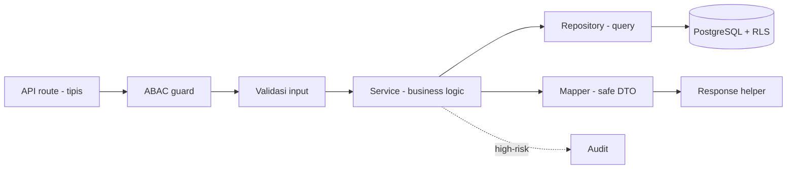
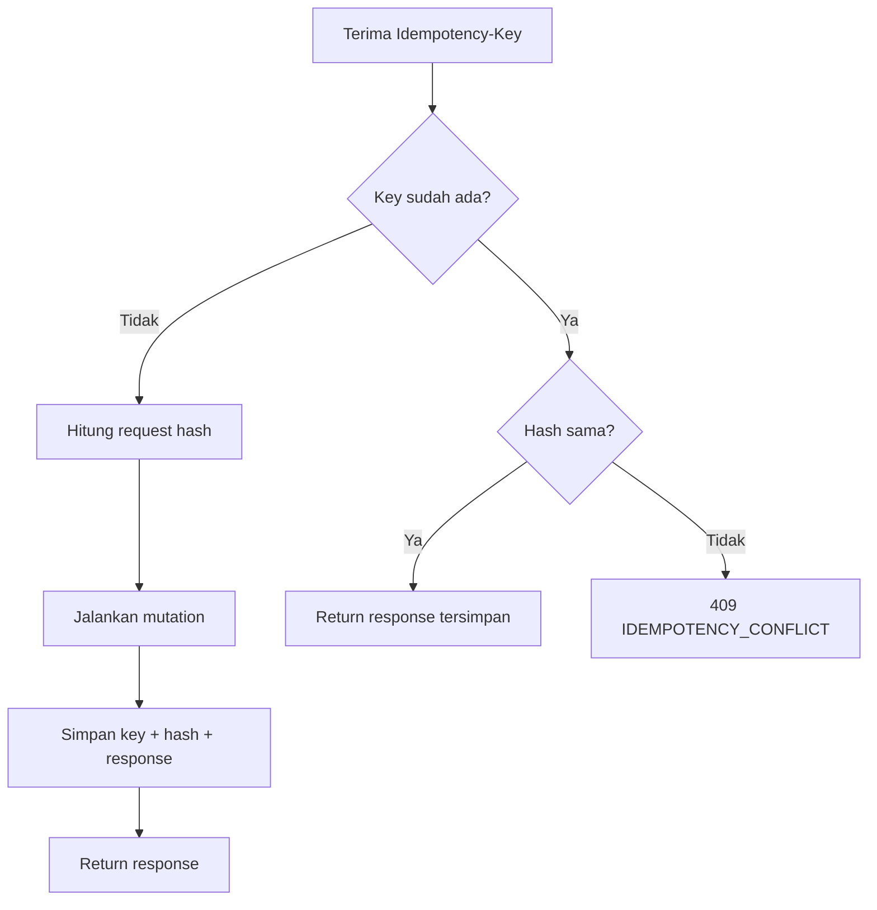

🇮🇩 Bahasa Indonesia · 🇬🇧 [English (source)](10_template_kode_coding_standard.md)

<!-- i18n-source-hash: sha256:27d8692fb672a4afe1ce27baad6a3cb39bb7b24659bf0507033b36cee308b864 -->

# Bagian 10 — Template Implementasi Kode dan Coding Standard

> **Status implementasi (2026-07-14).** Dokumen ini diadaptasi dari standar dasar `docs/awcms-mini/10_template_kode_coding_standard.md`. Repo `awcms` adalah **template ERP/back-office keluarga AWCMS yang dipakai langsung** ([ADR-0035](../adr/0035-awcms-online-first-erp-saas-superset-repositioning.md), [ADR-0034](../adr/0034-awcms-family-direct-use-templates-and-derived-pathway-removal.md)): base sudah menyertakan **modul fondasi + modul website/konten** dan sedang **menyerap** klaster website/e-commerce awcms-micro langsung ke `src/modules/` (status kode aktual: [`docs/ARCHITECTURE.md`](../ARCHITECTURE.md)). Standar di bawah **mengikat** baik untuk modul base maupun modul domain (ERP, website/e-commerce, konten) yang ditambahkan langsung ke `src/modules/` template ini. Skill proyek yang dirujuk (`.claude/skills/awcms-*`) menandai pola implementasi yang mengikat untuk modul terkait.
>
> **Standar base + contoh domain.** Dokumen ini adalah **standar/pola reusable**. Contoh yang dipakai memakai domain **ERP (finance/accounting, inventory/warehouse)** sebagai ilustrasi — ganti detail domainnya sesuai kebutuhan modul yang sedang dibangun. Lihat [README paket dokumen](README.md).

## Tujuan

Dokumen ini menetapkan standar coding AWCMS untuk TypeScript/Bun/Astro/PostgreSQL agar implementasi konsisten, aman, testable, dan maintainable.

## Prinsip coding

1. TypeScript strict.
2. API route tipis; business logic di service.
3. Query database di repository/infrastructure.
4. Semua input user divalidasi.
5. Semua mutation high-risk idempotent.
6. Semua operasi multi-table memakai transaction.
7. Semua akses tenant-scoped memakai tenant context, ABAC, dan RLS.
8. Semua high-risk action audit log.
9. Semua sensitive data dimasking/redacted.
10. Resource deletable memakai soft delete; query default menyaring `deleted_at IS NULL`.
11. Error response standard dan tidak expose stack trace.
12. Backend dan semua tooling repository berjalan dengan **Bun**. Jangan menambah Node.js runtime/tooling (`node`, `npm`, `npx`, `pnpm`, `yarn`, adapter server Node.js) kecuali Bun belum mendukung kebutuhan teknis tersebut dan pengecualian sudah disetujui serta dicatat di docs.

## Standar platform backend

- Runtime backend wajib **Bun**.
- Package manager wajib **Bun** (`packageManager` di `package.json` mengunci versi Bun).
- Script repository wajib dipanggil melalui `bun` atau `bun run`.
- Prefer API/runtime Bun (`Bun.serve`, `Bun.sql` bila dipakai, `bun test`) selama sesuai kebutuhan.
- Jangan menambahkan Node.js sebagai runtime server utama, npm-family package manager, atau adapter yang mengharuskan proses backend berjalan di Node.js.
- Jika Bun belum mendukung kebutuhan teknis tertentu, buka pengecualian kecil dan sementara: minta izin maintainer, catat alasan dan alternatif Bun yang sudah dicoba, cantumkan file/package terdampak, tentukan rencana migrasi kembali ke Bun, dan update audit/docs sebelum merge.

### Yang DIIZINKAN (bukan pelanggaran Bun-only)

- **Import `node:*`** (`node:crypto`, `node:fs/promises`, `node:path`, `node:os`, dst.) adalah **API bawaan Bun** — Bun mengimplementasikan permukaan API Node, jadi ini **tidak** menarik runtime Node.js. Gunakan bebas; jangan dilarang. (Hindari mengandalkan modul Node yang belum diimplementasikan Bun.)
- **`@types/*` (mis. `@types/bun`)** hanya tipe di `devDependencies`; tidak menarik runtime Node.js. Prefer `@types/bun` (sudah mencakup global mirip Node) daripada `@types/node`.
- Package **pure-JS** yang berjalan di atas Bun tanpa memaksa proses Node.

### Yang DILARANG (tanpa pengecualian tertulis)

- Binary/tooling `node`, `npm`, `npx`, `pnpm`, `yarn` di script `package.json`, CI, atau `deploy/`.
- Adapter/server yang **mengharuskan** proses backend berjalan di runtime Node.js.
- Menjalankan test dengan runner Node (`node --test`); test runner wajib `bun test`.

### Aturan konkret

- **Server HTTP**: `Bun.serve` native. Framework di atasnya (mis. Hono) harus dijalankan lewat `Bun.serve`, bukan adapter Node.
- **Database**: `Bun.sql` (klien Postgres native Bun) atau `postgres` (postgres.js, pure-JS). Hindari `pg` yang lebih berat/berorientasi Node.
- **Bin dengan shebang `#!/usr/bin/env node`** (mis. `astro`, `vite`): panggil lewat **`bun --bun`** (mis. `bun --bun astro build`, `bun --bun astro dev`) agar Bun yang mengeksekusi, bukan binary `node` yang mungkin terpasang di mesin. Tanpa `--bun`, `bun run` mengikuti shebang dan bisa jatuh ke Node.
- **SSR Astro**: Astro belum punya adapter Bun first-party. Dua opsi tersanksi:
  1. **Rekomendasi** — pisahkan seam: API/backend di `Bun.serve` (+Hono) native; Astro hanya untuk frontend/SSR.
  2. Pakai `@astrojs/node` (standalone) **dijalankan di atas Bun** (`bun ./dist/standalone-entry.mjs`) dan build via `bun --bun astro build`. Ini satu-satunya pemakaian paket ber-nama "node" yang diizinkan (runtime tetap Bun); catat sebagai pengecualian di dokumen audit standar pengembangan bila dipakai.

     Entry yang dijalankan adalah **`dist/standalone-entry.mjs`** (dibangun dari `src/lib/server/standalone-entry.ts`), bukan `dist/server/entry.mjs` bawaan adapter — Issue #464. Adapter menyusun handler-nya sebagai `staticHandler(req, res, () => appHandler(req, res))`, sehingga berkas yang ada di `dist/client/` dijawab **sebelum** `src/middleware.ts` pernah jalan dan keluar tanpa satu pun header keamanan. Wrapper itu memasang `buildSecurityHeaders()` yang sama sebagai **lantai** (`setHeader` sebelum delegasi; `writeHead` milik handler tetap menang pada nama yang bentrok) lalu menyerahkan request ke handler adapter apa adanya — penyajian statisnya tidak ditulis ulang.

## Aliran request antar layer



Route tipis → guard → validasi → service → repository → DB. Data sensitif lewat mapper sebelum keluar.

## Skill pendukung (target — belum dibuat)

Standar di dokumen ini **akan** ditegakkan oleh skill proyek di `.claude/skills/` begitu modul pertama mulai dikerjakan, mengikuti pola yang sama dengan repo `awcms-mini`. Tabel berikut adalah **rencana penamaan**, bukan skill yang sudah ada hari ini.

| Bagian standar                      | Skill (rencana)        |
| ----------------------------------- | ---------------------- |
| Struktur modul & descriptor         | `awcms-new-module`     |
| SQL migration standard              | `awcms-new-migration`  |
| API handler rules & response helper | `awcms-new-endpoint`   |
| Domain event envelope               | `awcms-new-event`      |
| Idempotency wrapper rules           | `awcms-idempotency`    |
| ABAC guard                          | `awcms-abac-guard`     |
| Audit helper & redaction            | `awcms-audit-log`      |
| Masking/redaction data sensitif     | `awcms-sensitive-data` |
| Sync HMAC standard                  | `awcms-sync-hmac`      |
| Pull request checklist              | `awcms-pr-review`      |
| UI/komponen                         | `awcms-ui-screen`      |
| Rilis & CHANGELOG                   | `awcms-release`        |

## Struktur modul

```text
src/modules/<module>/
├── module.ts
├── domain/
│   ├── entities.ts
│   ├── value-objects.ts
│   └── events.ts
├── application/
│   ├── services.ts
│   ├── commands.ts
│   └── queries.ts
├── infrastructure/
│   ├── repository.ts
│   └── mappers.ts
├── api/
│   ├── routes.ts
│   ├── schemas.ts
│   └── handlers.ts
└── README.md
```

## Template Module Descriptor

Contoh ilustratif memakai domain **inventory/warehouse** (bukan retail/POS):

```ts
import type { ModuleDescriptor } from "../_shared/module-contract";

export const warehouseManagementModule: ModuleDescriptor = {
  key: "warehouse_management",
  name: "Warehouse Management",
  version: "0.1.0",
  status: "active",
  description:
    "Multi warehouse, zone, bin, lot, transfer, in-transit, cycle count, and warehouse stock operations.",
  dependencies: [
    "tenant_admin",
    "identity_access",
    "inventory_catalog",
    "workflow_approval",
    "observability_logging"
  ],
  api: {
    openApiPath: "openapi/modules/warehouse-management.openapi.yaml",
    basePath: "/api/v1"
  },
  events: {
    asyncApiPath: "asyncapi/modules/warehouse-events.asyncapi.yaml",
    publishes: [
      "warehouse.transfer.created",
      "warehouse.transfer.shipped",
      "warehouse.transfer.received",
      "warehouse.cycle_count.variance_detected"
    ],
    subscribes: [
      "inventory.stock.adjustment.posted",
      "finance.ledger_entry.posted"
    ]
  }
};
```

## Module contract

Sumber kebenaran kontrak `ModuleDescriptor` akan berada di `src/modules/_shared/module-contract.ts` begitu fondasi modul mulai diimplementasikan. Bentuk awal (target minimal, akan diperluas seiring kebutuhan ERP nyata — mis. capability port lintas modul finance/inventory/procurement):

```ts
export type ModuleType = "base" | "system" | "domain" | "integration";

// `disabled` = dimatikan global oleh code/deployment — BUKAN toggle per-tenant.
export type ModuleLifecycleStatus =
  "active" | "experimental" | "deprecated" | "maintenance" | "disabled";

export type ModulePermissionDescriptor = {
  activityCode: string;
  action: string;
  description: string;
};

export type ModuleNavigationEntry = {
  labelKey: string;
  path: string;
  icon?: string;
  order?: number;
  group?: string;
  requiredPermission?: string;
};

// Non-secret defaults saja — jangan pernah taruh default berbentuk secret di sini.
export type ModuleSettingsContract = {
  schemaVersion?: number;
  defaults?: Record<string, unknown>;
};

export type ModuleJobDescriptor = {
  command: string;
  purpose: string;
  recommendedSchedule?: string;
  environmentNotes?: string;
  safeInOfflineLan?: boolean;
};

export type ModuleHealthContract = {
  hasHealthCheck?: boolean;
  hasReadinessCheck?: boolean;
};

export type ModuleCompatibilityContract = {
  minAppVersion?: string;
};

export type ModuleDescriptor = {
  key: string;
  name: string;
  version: string;
  status: ModuleLifecycleStatus;
  description: string;
  dependencies: string[];
  api?: {
    openApiPath: string;
    basePath: string;
  };
  events?: {
    asyncApiPath?: string;
    publishes?: string[];
    subscribes?: string[];
  };
  type?: ModuleType;
  isCore?: boolean;
  permissions?: ModulePermissionDescriptor[];
  navigation?: ModuleNavigationEntry[];
  settings?: ModuleSettingsContract;
  jobs?: ModuleJobDescriptor[];
  health?: ModuleHealthContract;
  compatibility?: ModuleCompatibilityContract;
  maintainers?: string[];
};
```

Aturan authoring: deklarasikan sebuah field (`navigation`/`jobs`/`health`/`api`/`events`) hanya setelah fitur sungguhan yang bersangkutan ada — descriptor tidak boleh mengklaim kapabilitas yang belum diimplementasi. Tambahkan field baru secara **aditif** (SemVer kontrak `ModuleDescriptor`, catat versi kontrak di ADR terpisah begitu modul pertama berjalan) — jangan menghapus/mengganti nama field tanpa bump MAJOR.

## API response helper

```ts
export type ApiMeta = {
  correlationId?: string;
  requestId?: string;
};

export type ApiSuccess<T> = {
  success: true;
  data: T;
  meta?: ApiMeta;
};

export type ApiErrorResponse = {
  success: false;
  error: {
    code: string;
    message: string;
    details?: Array<{ field?: string; message: string; code?: string }>;
    correlationId?: string;
  };
};

export function ok<T>(data: T, meta?: ApiMeta): Response {
  return Response.json({ success: true, data, meta } satisfies ApiSuccess<T>);
}

export function created<T>(data: T, meta?: ApiMeta): Response {
  return Response.json({ success: true, data, meta } satisfies ApiSuccess<T>, {
    status: 201
  });
}

export function fail(
  status: number,
  code: string,
  message: string,
  options?: {
    details?: Array<{ field?: string; message: string; code?: string }>;
    correlationId?: string;
  }
): Response {
  return Response.json(
    {
      success: false,
      error: {
        code,
        message,
        details: options?.details,
        correlationId: options?.correlationId
      }
    } satisfies ApiErrorResponse,
    { status }
  );
}
```

## ApiError

```ts
export class ApiError extends Error {
  public readonly status: number;
  public readonly code: string;
  public readonly details?: Array<{
    field?: string;
    message: string;
    code?: string;
  }>;

  constructor(params: {
    status: number;
    code: string;
    message: string;
    details?: Array<{ field?: string; message: string; code?: string }>;
  }) {
    super(params.message);
    this.status = params.status;
    this.code = params.code;
    this.details = params.details;
  }
}
```

## Tenant context

```ts
export type TenantContext = {
  tenantId: string;
  tenantUserId: string;
  identityId: string;
  profileId?: string;
  defaultOfficeId?: string;
  roles: string[];
  correlationId?: string;
  requestId?: string;
};
```

Catatan: pada production, `tenantUserId` dan `identityId` tidak boleh dipercaya langsung dari public header. Nilai harus berasal dari auth middleware yang memvalidasi token.

## ABAC guard

```ts
export type AccessRequest = {
  moduleKey: string;
  activityCode: string;
  action:
    | "read"
    | "create"
    | "update"
    | "delete"
    | "post"
    | "cancel"
    | "approve"
    | "export"
    | "send"
    | "configure"
    | "analyze"
    | "assign"
    | "restore"
    | "purge"
    | "retry"
    | "sync"
    | "enable"
    | "disable"
    | "check"
    | "publish"
    | "schedule"
    | "archive"
    | "verify"
    | "set_primary"
    | "connect"
    | "disconnect"
    | "preview";
  resourceType?: string;
  resourceId?: string;
  resourceAttributes?: Record<string, unknown>;
  environmentAttributes?: Record<string, unknown>;
};

export type AccessDecision = {
  allowed: boolean;
  reason: string;
  decisionId?: string;
  matchedPolicy?: string;
};
```

Aturan:

- Semua endpoint non-public wajib guard.
- Default deny.
- Deny overrides allow.
- RLS tetap wajib.
- Access denied high-risk masuk decision log.
- Untuk resource soft-deletable, action `delete` berarti soft delete. Tambahkan action `restore` dan `purge` pada kontrak modul yang membutuhkan pemulihan atau purge retention; keduanya default deny sampai permission/ABAC eksplisit tersedia.
- `retry` — retry manual entri antrian (sync/object queue, mis. retry pengiriman batch pajak/Coretax yang gagal), bukan aksi destruktif; tidak masuk `HIGH_RISK_ACTIONS`.
- `sync` — sinkronisasi descriptor code → registry database, idempoten/non-destruktif; tidak masuk `HIGH_RISK_ACTIONS`.
- `enable`/`disable` — toggle ketersediaan modul per-tenant, reversibel dan tidak menghapus data; tidak masuk `HIGH_RISK_ACTIONS`. Guard bersama (`authorizeInTransaction`) juga wajib menolak `403 MODULE_DISABLED` untuk permintaan apa pun ke modul yang dinonaktifkan tenant tsb, terlepas dari action-nya.
- `check` — memicu health check eksplisit (read-mostly, bounded); tidak masuk `HIGH_RISK_ACTIONS`.

## Audit helper

```ts
export type AuditEventInput = {
  tenantId: string;
  actorTenantUserId?: string;
  moduleKey: string;
  action: string;
  resourceType: string;
  resourceId?: string;
  severity?: "info" | "warning" | "critical";
  message: string;
  attributes?: Record<string, unknown>;
  correlationId?: string;
};
```

Aturan audit:

- Jangan memasukkan password/token/API key/NPWP/NIK penuh/phone/email penuh/nomor rekening bank penuh.
- Gunakan redaction sebelum audit attributes.
- Audit tenant-scoped.
- Soft delete, restore, dan purge high-risk wajib audit dengan reason dan resource identity yang sudah aman.
- Posting/approval finansial (jurnal, invoice, payroll run, purchase order) wajib audit dengan actor dan reason.

## Soft delete helper

```ts
export type SoftDeleteColumns = {
  deletedAt?: string | null;
  deletedBy?: string | null;
  deleteReason?: string | null;
  restoredAt?: string | null;
  restoredBy?: string | null;
};

export type ListOptions = {
  includeDeleted?: boolean;
  onlyDeleted?: boolean;
};
```

Aturan repository:

- `list` dan `getById` default menambahkan `deleted_at IS NULL`.
- `includeDeleted`/`onlyDeleted` hanya boleh dipakai setelah ABAC archive permission.
- Soft delete mengisi `deleted_at`, `deleted_by`, `delete_reason`, dan menaikkan `sync_version`.
- Restore mengosongkan `deleted_at`, `deleted_by`, `delete_reason`, mengisi `restored_at`/`restored_by`, lalu validasi ulang unique business key.
- Purge memakai jalur terpisah dengan retention/legal check; jangan memutus FK transaksi/audit.
- DTO publik memakai status `deleted`/`archived` seperlunya tanpa membuka PII mentah.
- Entity yang sudah **posted** (jurnal, invoice, payroll run yang sudah dibayar) **tidak boleh** dihapus meski soft delete — koreksi lewat reversal/adjustment, bukan delete.

## Domain event envelope

```ts
export type DomainEventEnvelope<TPayload> = {
  eventId: string;
  eventType: string;
  eventVersion: string;
  tenantId: string;
  nodeId?: string;
  aggregateType: string;
  aggregateId: string;
  occurredAt: string;
  actor?: { tenantUserId?: string; profileId?: string };
  correlationId?: string;
  causationId?: string;
  payload: TPayload;
  metadata: {
    sourceModule: string;
    schemaVersion: string;
  };
};
```

## Idempotency wrapper rules



Mutation high-risk harus:

1. Membaca header `Idempotency-Key`.
2. Menghitung request hash stabil.
3. Jika key sama dan hash sama, return response tersimpan.
4. Jika key sama dan hash berbeda, return `IDEMPOTENCY_CONFLICT`.
5. Menyimpan status/resource hasil mutation.

Contoh endpoint yang wajib idempotency di platform ERP (target, akan konkret begitu modul terkait dibangun):

- Ledger posting (general ledger, jurnal).
- Invoice generate/post/cancel.
- Payment gateway callback/settlement.
- Purchase order approve/receive.
- Warehouse transfer approve/ship/receive.
- Cycle count submit.
- Stock adjustment.
- Payroll run generate/post.
- VAT invoice generate / Coretax batch submit.
- Marketplace/logistics webhook ingestion.
- Sync push.
- Workflow decision.

## Transaction wrapper rules

1. Gunakan transaction untuk mutation multi-table.
2. Set RLS context pada awal transaction.
3. Jangan buka transaction terlalu lama.
4. Jangan call provider eksternal di dalam transaction.
5. Gunakan `SELECT ... FOR UPDATE` untuk stok/saldo yang berubah.
6. Gunakan timeout.

## Repository rules

1. Repository hanya query database.
2. Tidak ada business logic kompleks.
3. Gunakan parameterized query.
4. Jangan string interpolation input user.
5. Query tenant-scoped wajib filter `tenant_id`.
6. Jangan return row mentah yang mengandung data sensitif langsung ke API.

## Service rules

1. Business validation di service.
2. Service menerima `TenantContext`.
3. Service tidak membaca `Request` langsung.
4. Service mengembalikan DTO aman.
5. Service menulis audit untuk high-risk.
6. Service mudah diuji unit test.

## API handler rules

1. Route tipis.
2. Ambil tenant/auth context.
3. Cek ABAC.
4. Validasi body/query.
5. Gunakan transaction jika mutation.
6. Gunakan response helper.
7. Gunakan error handler standar.

## Validation standard

- Semua input divalidasi.
- UUID divalidasi.
- Enum divalidasi.
- String length dibatasi.
- Numeric finite dan range checked (termasuk nilai moneter — jangan `float` untuk uang).
- Unknown field ditangani.

## Stock/balance locking standard

- Lock row balance (stok, saldo kas/kas kecil, saldo akun) dengan `FOR UPDATE`.
- Urutkan lock berdasarkan ID entity (produk/akun) untuk mengurangi deadlock.
- Jangan call provider saat lock aktif.
- Deadlock retry harus aman dengan idempotency.

## Sync HMAC standard

Signature berdasarkan:

```text
<timestamp>.<body>
```

Validasi:

- Signature wajib ada.
- Timestamp valid.
- Max skew default 300 detik.
- Timing-safe compare.

## Logger redaction

Redact key yang mengandung:

- password
- passwordHash
- token
- accessToken
- refreshToken
- apiKey
- secret
- authorization
- npwp
- nik
- phone
- whatsapp
- email
- bankAccountNumber
- payrollAmount (nilai gaji individual di log non-audit)

## SQL migration standard

Format nama:

```text
NNN_awcms_<area>_<description>.sql
```

Aturan:

- `CREATE TABLE IF NOT EXISTS` jika aman.
- `CREATE INDEX IF NOT EXISTS`.
- Tenant-scoped table wajib `tenant_id`.
- RLS wajib.
- FK child index wajib.
- CHECK constraint untuk status enum-like.
- `timestamptz`, bukan timestamp polos.
- `numeric` untuk uang/quantity — jangan `float`/`double precision`.
- Tidak menyimpan password/API key plaintext.

## TypeScript standard

| Item              | Standard         |
| ----------------- | ---------------- |
| File              | kebab-case       |
| Type/interface    | PascalCase       |
| Function/variable | camelCase        |
| Global constant   | UPPER_SNAKE_CASE |
| Module key        | snake_case       |
| DB table/column   | snake_case       |

Aturan:

- Hindari `any`.
- Gunakan `unknown` untuk input belum valid.
- Gunakan type eksplisit untuk command/result.
- Jangan expose DB row mentah.
- Gunakan mapper untuk data sensitif.

## Pull request checklist

- Scope sesuai issue.
- Tidak ada unrelated change.
- No secret/data customer/data finansial.
- Migration jika schema berubah.
- OpenAPI jika API berubah.
- AsyncAPI jika event berubah.
- Input validation.
- Auth/ABAC/RLS.
- Audit high-risk.
- Sensitive data masked.
- Test pass.
- Docs updated.

## Implementation report template

```text
Summary:
Files changed:
Commands run:
Test results:
Security notes:
Documentation updates:
Remaining limitations:
Next recommended step:
```
