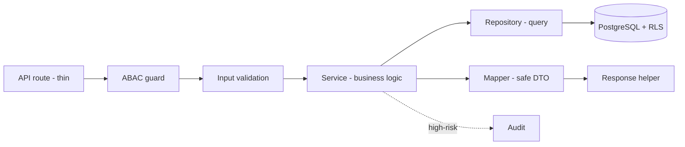
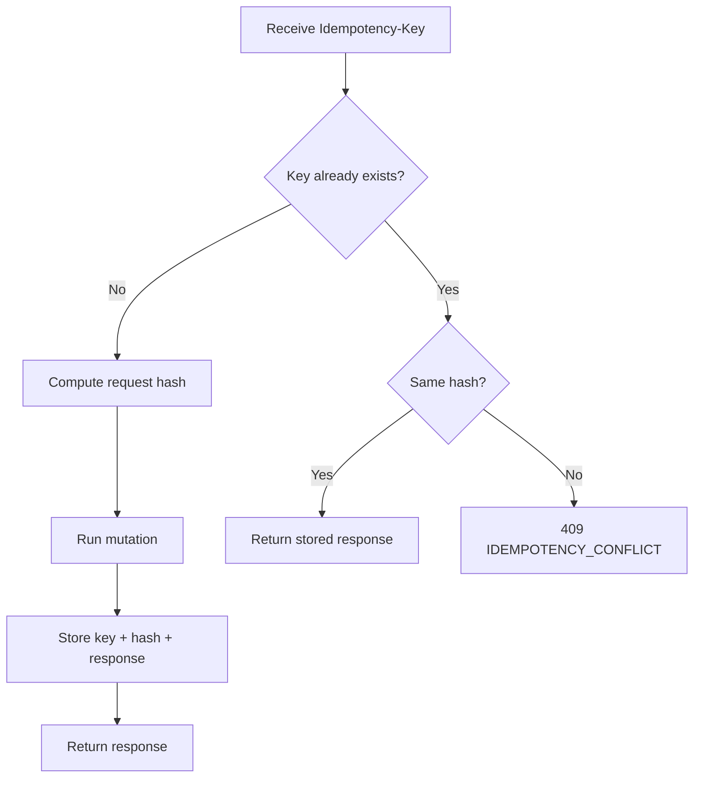

🇬🇧 English (source) · 🇮🇩 [Bahasa Indonesia](10_template_kode_coding_standard.id.md)

# Part 10 — Code Implementation Template and Coding Standard

> **Implementation status (2026-07-14).** This document is adapted from the base standard `docs/awcms-mini/10_template_kode_coding_standard.md`. The `awcms` repo is the **used-directly ERP/back-office template of the AWCMS family** ([ADR-0035](../adr/0035-awcms-online-first-erp-saas-superset-repositioning.md), [ADR-0034](../adr/0034-awcms-family-direct-use-templates-and-derived-pathway-removal.md)): the base already ships **foundation modules + website/content modules** and is **absorbing** the awcms-micro website/e-commerce cluster directly into `src/modules/` (actual code status: [`docs/ARCHITECTURE.md`](../ARCHITECTURE.md)). The standards below are **binding** both for base modules and for domain modules (ERP, website/e-commerce, content) added directly to this template's `src/modules/`. The project skills referenced (`.claude/skills/awcms-*`) mark the implementation patterns that are binding for the related module.
>
> **Base standard + domain examples.** This document is a **reusable standard/pattern**. The examples used take the **ERP (finance/accounting, inventory/warehouse)** domain as an illustration — swap the domain details for whatever the module being built needs. See the [document package README](README.md).

## Purpose

This document sets the AWCMS coding standard for TypeScript/Bun/Astro/PostgreSQL so that implementation is consistent, secure, testable, and maintainable.

## Coding principles

1. TypeScript strict.
2. Thin API routes; business logic in the service.
3. Database queries in the repository/infrastructure.
4. All user input is validated.
5. All high-risk mutations are idempotent.
6. All multi-table operations use a transaction.
7. All tenant-scoped access uses tenant context, ABAC, and RLS.
8. All high-risk actions are audit logged.
9. All sensitive data is masked/redacted.
10. Deletable resources use soft delete; queries filter `deleted_at IS NULL` by default.
11. Error responses are standard and do not expose a stack trace.
12. The backend and all repository tooling run on **Bun**. Do not add Node.js runtime/tooling (`node`, `npm`, `npx`, `pnpm`, `yarn`, Node.js server adapters) unless Bun does not yet support that technical need and the exception has been approved and recorded in the docs.

## Backend platform standard

- The backend runtime must be **Bun**.
- The package manager must be **Bun** (`packageManager` in `package.json` pins the Bun version).
- Repository scripts must be invoked through `bun` or `bun run`.
- Prefer Bun APIs/runtime (`Bun.serve`, `Bun.sql` where used, `bun test`) as long as they fit the need.
- Do not add Node.js as the primary server runtime, an npm-family package manager, or an adapter that requires the backend process to run on Node.js.
- If Bun does not yet support a particular technical need, open a small and temporary exception: ask the maintainer for permission, record the reason and the Bun alternatives already tried, list the affected files/packages, define a plan to migrate back to Bun, and update the audit/docs before merging.

### What is ALLOWED (not a Bun-only violation)

- **`node:*` imports** (`node:crypto`, `node:fs/promises`, `node:path`, `node:os`, etc.) are **built-in Bun APIs** — Bun implements the Node API surface, so this does **not** pull in the Node.js runtime. Use them freely; do not ban them. (Avoid relying on Node modules Bun has not implemented yet.)
- **`@types/*` (e.g. `@types/bun`)** are types only, in `devDependencies`; they do not pull in the Node.js runtime. Prefer `@types/bun` (which already covers the Node-like globals) over `@types/node`.
- **Pure-JS** packages that run on top of Bun without forcing a Node process.

### What is FORBIDDEN (without a written exception)

- The `node`, `npm`, `npx`, `pnpm`, `yarn` binaries/tooling in `package.json` scripts, CI, or `deploy/`.
- Adapters/servers that **require** the backend process to run on the Node.js runtime.
- Running tests with the Node runner (`node --test`); the test runner must be `bun test`.

### Concrete rules

- **HTTP server**: native `Bun.serve`. A framework on top of it (e.g. Hono) must be run through `Bun.serve`, not a Node adapter.
- **Database**: `Bun.sql` (Bun's native Postgres client) or `postgres` (postgres.js, pure-JS). Avoid `pg`, which is heavier and Node-oriented.
- **Bins with the shebang `#!/usr/bin/env node`** (e.g. `astro`, `vite`): call them through **`bun --bun`** (e.g. `bun --bun astro build`, `bun --bun astro dev`) so that Bun is what executes them, not the `node` binary that may happen to be installed on the machine. Without `--bun`, `bun run` follows the shebang and can fall through to Node.
- **Astro SSR**: Astro has no first-party Bun adapter yet. Two sanctioned options:
  1. **Recommended** — split the seam: API/backend on native `Bun.serve` (+Hono); Astro only for frontend/SSR.
  2. Use `@astrojs/node` (standalone) **run on top of Bun** (`bun ./dist/standalone-entry.mjs`) and build via `bun --bun astro build`. This is the only allowed use of a package with "node" in its name (the runtime is still Bun); record it as an exception in the development standards audit document if used.

     The entry that is run is **`dist/standalone-entry.mjs`** (built from `src/lib/server/standalone-entry.ts`), not the adapter's own `dist/server/entry.mjs` — Issue #464. The adapter composes its handler as `staticHandler(req, res, () => appHandler(req, res))`, so files present in `dist/client/` are answered **before** `src/middleware.ts` ever runs, and go out without a single security header. That wrapper installs the same `buildSecurityHeaders()` as a **floor** (`setHeader` before delegating; the handler's own `writeHead` still wins on clashing names) and then hands the request to the adapter handler as-is — its static serving is not rewritten.

## Request flow across layers



Thin route → guard → validation → service → repository → DB. Sensitive data passes through a mapper before it leaves.

## Supporting skills (target — not built yet)

The standards in this document **will** be enforced by project skills in `.claude/skills/` once the first module starts being worked on, following the same pattern as the `awcms-mini` repo. The table below is a **naming plan**, not skills that exist today.

| Standard section                    | Skill (planned)        |
| ----------------------------------- | ---------------------- |
| Module structure & descriptor       | `awcms-new-module`     |
| SQL migration standard              | `awcms-new-migration`  |
| API handler rules & response helper | `awcms-new-endpoint`   |
| Domain event envelope               | `awcms-new-event`      |
| Idempotency wrapper rules           | `awcms-idempotency`    |
| ABAC guard                          | `awcms-abac-guard`     |
| Audit helper & redaction            | `awcms-audit-log`      |
| Sensitive data masking/redaction    | `awcms-sensitive-data` |
| Sync HMAC standard                  | `awcms-sync-hmac`      |
| Pull request checklist              | `awcms-pr-review`      |
| UI/components                       | `awcms-ui-screen`      |
| Release & CHANGELOG                 | `awcms-release`        |

## Module structure

```text
src/modules/<module>/
├── module.ts
├── domain/
│   ├── entities.ts
│   ├── value-objects.ts
│   └── events.ts
├── application/
│   ├── services.ts
│   ├── commands.ts
│   └── queries.ts
├── infrastructure/
│   ├── repository.ts
│   └── mappers.ts
├── api/
│   ├── routes.ts
│   ├── schemas.ts
│   └── handlers.ts
└── README.md
```

## Module Descriptor template

An illustrative example using the **inventory/warehouse** domain (not retail/POS):

```ts
import type { ModuleDescriptor } from "../_shared/module-contract";

export const warehouseManagementModule: ModuleDescriptor = {
  key: "warehouse_management",
  name: "Warehouse Management",
  version: "0.1.0",
  status: "active",
  description:
    "Multi warehouse, zone, bin, lot, transfer, in-transit, cycle count, and warehouse stock operations.",
  dependencies: [
    "tenant_admin",
    "identity_access",
    "inventory_catalog",
    "workflow_approval",
    "observability_logging"
  ],
  api: {
    openApiPath: "openapi/modules/warehouse-management.openapi.yaml",
    basePath: "/api/v1"
  },
  events: {
    asyncApiPath: "asyncapi/modules/warehouse-events.asyncapi.yaml",
    publishes: [
      "warehouse.transfer.created",
      "warehouse.transfer.shipped",
      "warehouse.transfer.received",
      "warehouse.cycle_count.variance_detected"
    ],
    subscribes: [
      "inventory.stock.adjustment.posted",
      "finance.ledger_entry.posted"
    ]
  }
};
```

## Module contract

The source of truth for the `ModuleDescriptor` contract will live in `src/modules/_shared/module-contract.ts` once the module foundation starts being implemented. The initial shape (minimal target, to be extended as real ERP needs arrive — e.g. capability ports across the finance/inventory/procurement modules):

```ts
export type ModuleType = "base" | "system" | "domain" | "integration";

// `disabled` = switched off globally by code/deployment — NOT a per-tenant toggle.
export type ModuleLifecycleStatus =
  "active" | "experimental" | "deprecated" | "maintenance" | "disabled";

export type ModulePermissionDescriptor = {
  activityCode: string;
  action: string;
  description: string;
};

export type ModuleNavigationEntry = {
  labelKey: string;
  path: string;
  icon?: string;
  order?: number;
  group?: string;
  requiredPermission?: string;
};

// Non-secret defaults only — never put a secret-shaped default here.
export type ModuleSettingsContract = {
  schemaVersion?: number;
  defaults?: Record<string, unknown>;
};

export type ModuleJobDescriptor = {
  command: string;
  purpose: string;
  recommendedSchedule?: string;
  environmentNotes?: string;
  safeInOfflineLan?: boolean;
};

export type ModuleHealthContract = {
  hasHealthCheck?: boolean;
  hasReadinessCheck?: boolean;
};

export type ModuleCompatibilityContract = {
  minAppVersion?: string;
};

export type ModuleDescriptor = {
  key: string;
  name: string;
  version: string;
  status: ModuleLifecycleStatus;
  description: string;
  dependencies: string[];
  api?: {
    openApiPath: string;
    basePath: string;
  };
  events?: {
    asyncApiPath?: string;
    publishes?: string[];
    subscribes?: string[];
  };
  type?: ModuleType;
  isCore?: boolean;
  permissions?: ModulePermissionDescriptor[];
  navigation?: ModuleNavigationEntry[];
  settings?: ModuleSettingsContract;
  jobs?: ModuleJobDescriptor[];
  health?: ModuleHealthContract;
  compatibility?: ModuleCompatibilityContract;
  maintainers?: string[];
};
```

Authoring rule: declare a field (`navigation`/`jobs`/`health`/`api`/`events`) only after the real feature it refers to exists — a descriptor must not claim a capability that has not been implemented. Add new fields **additively** (SemVer on the `ModuleDescriptor` contract; record the contract version in a separate ADR once the first module is running) — do not remove/rename a field without a MAJOR bump.

## API response helper

```ts
export type ApiMeta = {
  correlationId?: string;
  requestId?: string;
};

export type ApiSuccess<T> = {
  success: true;
  data: T;
  meta?: ApiMeta;
};

export type ApiErrorResponse = {
  success: false;
  error: {
    code: string;
    message: string;
    details?: Array<{ field?: string; message: string; code?: string }>;
    correlationId?: string;
  };
};

export function ok<T>(data: T, meta?: ApiMeta): Response {
  return Response.json({ success: true, data, meta } satisfies ApiSuccess<T>);
}

export function created<T>(data: T, meta?: ApiMeta): Response {
  return Response.json({ success: true, data, meta } satisfies ApiSuccess<T>, {
    status: 201
  });
}

export function fail(
  status: number,
  code: string,
  message: string,
  options?: {
    details?: Array<{ field?: string; message: string; code?: string }>;
    correlationId?: string;
  }
): Response {
  return Response.json(
    {
      success: false,
      error: {
        code,
        message,
        details: options?.details,
        correlationId: options?.correlationId
      }
    } satisfies ApiErrorResponse,
    { status }
  );
}
```

## ApiError

```ts
export class ApiError extends Error {
  public readonly status: number;
  public readonly code: string;
  public readonly details?: Array<{
    field?: string;
    message: string;
    code?: string;
  }>;

  constructor(params: {
    status: number;
    code: string;
    message: string;
    details?: Array<{ field?: string; message: string; code?: string }>;
  }) {
    super(params.message);
    this.status = params.status;
    this.code = params.code;
    this.details = params.details;
  }
}
```

## Tenant context

```ts
export type TenantContext = {
  tenantId: string;
  tenantUserId: string;
  identityId: string;
  profileId?: string;
  defaultOfficeId?: string;
  roles: string[];
  correlationId?: string;
  requestId?: string;
};
```

Note: in production, `tenantUserId` and `identityId` must not be trusted directly from a public header. The values must come from auth middleware that validates the token.

## ABAC guard

```ts
export type AccessRequest = {
  moduleKey: string;
  activityCode: string;
  action:
    | "read"
    | "create"
    | "update"
    | "delete"
    | "post"
    | "cancel"
    | "approve"
    | "export"
    | "send"
    | "configure"
    | "analyze"
    | "assign"
    | "restore"
    | "purge"
    | "retry"
    | "sync"
    | "enable"
    | "disable"
    | "check"
    | "publish"
    | "schedule"
    | "archive"
    | "verify"
    | "set_primary"
    | "connect"
    | "disconnect"
    | "preview";
  resourceType?: string;
  resourceId?: string;
  resourceAttributes?: Record<string, unknown>;
  environmentAttributes?: Record<string, unknown>;
};

export type AccessDecision = {
  allowed: boolean;
  reason: string;
  decisionId?: string;
  matchedPolicy?: string;
};
```

Rules:

- Every non-public endpoint must have a guard.
- Default deny.
- Deny overrides allow.
- RLS is still mandatory.
- A high-risk access denial goes into the decision log.
- For soft-deletable resources, the `delete` action means soft delete. Add the `restore` and `purge` actions to the contract of modules that need recovery or retention purge; both default to deny until an explicit permission/ABAC entry exists.
- `retry` — manual retry of a queue entry (sync/object queue, e.g. retrying a failed tax/Coretax batch submission), not a destructive action; not in `HIGH_RISK_ACTIONS`.
- `sync` — synchronising the code descriptor → database registry, idempotent/non-destructive; not in `HIGH_RISK_ACTIONS`.
- `enable`/`disable` — toggling per-tenant module availability, reversible and does not delete data; not in `HIGH_RISK_ACTIONS`. The shared guard (`authorizeInTransaction`) must also reject with `403 MODULE_DISABLED` for any request to a module that tenant has disabled, whatever the action is.
- `check` — triggers an explicit health check (read-mostly, bounded); not in `HIGH_RISK_ACTIONS`.

## Audit helper

```ts
export type AuditEventInput = {
  tenantId: string;
  actorTenantUserId?: string;
  moduleKey: string;
  action: string;
  resourceType: string;
  resourceId?: string;
  severity?: "info" | "warning" | "critical";
  message: string;
  attributes?: Record<string, unknown>;
  correlationId?: string;
};
```

Audit rules:

- Do not include passwords/tokens/API keys/NPWP/full NIK/phone/full email/full bank account numbers.
- Apply redaction before the audit attributes.
- Audit is tenant-scoped.
- High-risk soft delete, restore, and purge must be audited with a reason and an already-safe resource identity.
- Financial posting/approval (journal, invoice, payroll run, purchase order) must be audited with actor and reason.

## Soft delete helper

```ts
export type SoftDeleteColumns = {
  deletedAt?: string | null;
  deletedBy?: string | null;
  deleteReason?: string | null;
  restoredAt?: string | null;
  restoredBy?: string | null;
};

export type ListOptions = {
  includeDeleted?: boolean;
  onlyDeleted?: boolean;
};
```

Repository rules:

- `list` and `getById` add `deleted_at IS NULL` by default.
- `includeDeleted`/`onlyDeleted` may only be used after the ABAC archive permission.
- Soft delete fills `deleted_at`, `deleted_by`, `delete_reason`, and increments `sync_version`.
- Restore clears `deleted_at`, `deleted_by`, `delete_reason`, fills `restored_at`/`restored_by`, then re-validates the unique business key.
- Purge uses a separate path with a retention/legal check; do not break transaction/audit FKs.
- Public DTOs use a `deleted`/`archived` status as needed without exposing raw PII.
- An entity that has been **posted** (a journal, an invoice, a payroll run that has been paid) **must not** be deleted, not even soft-deleted — correct it through a reversal/adjustment, not a delete.

## Domain event envelope

```ts
export type DomainEventEnvelope<TPayload> = {
  eventId: string;
  eventType: string;
  eventVersion: string;
  tenantId: string;
  nodeId?: string;
  aggregateType: string;
  aggregateId: string;
  occurredAt: string;
  actor?: { tenantUserId?: string; profileId?: string };
  correlationId?: string;
  causationId?: string;
  payload: TPayload;
  metadata: {
    sourceModule: string;
    schemaVersion: string;
  };
};
```

## Idempotency wrapper rules



A high-risk mutation must:

1. Read the `Idempotency-Key` header.
2. Compute a stable request hash.
3. If the key is the same and the hash is the same, return the stored response.
4. If the key is the same and the hash differs, return `IDEMPOTENCY_CONFLICT`.
5. Store the status/resource resulting from the mutation.

Examples of endpoints that must be idempotent on the ERP platform (target; these become concrete once the related modules are built):

- Ledger posting (general ledger, journal).
- Invoice generate/post/cancel.
- Payment gateway callback/settlement.
- Purchase order approve/receive.
- Warehouse transfer approve/ship/receive.
- Cycle count submit.
- Stock adjustment.
- Payroll run generate/post.
- VAT invoice generate / Coretax batch submit.
- Marketplace/logistics webhook ingestion.
- Sync push.
- Workflow decision.

## Transaction wrapper rules

1. Use a transaction for multi-table mutations.
2. Set the RLS context at the start of the transaction.
3. Do not hold a transaction open too long.
4. Do not call an external provider inside a transaction.
5. Use `SELECT ... FOR UPDATE` for stock/balances that change.
6. Use a timeout.

## Repository rules

1. A repository only queries the database.
2. No complex business logic.
3. Use parameterized queries.
4. Do not string-interpolate user input.
5. Tenant-scoped queries must filter on `tenant_id`.
6. Do not return raw rows containing sensitive data straight to the API.

## Service rules

1. Business validation lives in the service.
2. The service receives a `TenantContext`.
3. The service does not read the `Request` directly.
4. The service returns a safe DTO.
5. The service writes the audit entry for high-risk actions.
6. The service is easy to unit test.

## API handler rules

1. Thin route.
2. Take the tenant/auth context.
3. Check ABAC.
4. Validate body/query.
5. Use a transaction if it is a mutation.
6. Use the response helper.
7. Use the standard error handler.

## Validation standard

- All input is validated.
- UUIDs are validated.
- Enums are validated.
- String length is bounded.
- Numerics are finite and range checked (including monetary values — do not use `float` for money).
- Unknown fields are handled.

## Stock/balance locking standard

- Lock the balance row (stock, cash/petty cash balance, account balance) with `FOR UPDATE`.
- Order locks by entity ID (product/account) to reduce deadlocks.
- Do not call a provider while a lock is held.
- Deadlock retry must be safe thanks to idempotency.

## Sync HMAC standard

The signature is based on:

```text
<timestamp>.<body>
```

Validation:

- The signature must be present.
- The timestamp is valid.
- Max skew defaults to 300 seconds.
- Timing-safe compare.

## Logger redaction

Redact keys containing:

- password
- passwordHash
- token
- accessToken
- refreshToken
- apiKey
- secret
- authorization
- npwp
- nik
- phone
- whatsapp
- email
- bankAccountNumber
- payrollAmount (individual salary values in non-audit logs)

## SQL migration standard

Name format:

```text
NNN_awcms_<area>_<description>.sql
```

Rules:

- `CREATE TABLE IF NOT EXISTS` where it is safe.
- `CREATE INDEX IF NOT EXISTS`.
- Tenant-scoped tables must have `tenant_id`.
- RLS is mandatory.
- An index on the FK child is mandatory.
- CHECK constraints for enum-like statuses.
- `timestamptz`, not bare timestamp.
- `numeric` for money/quantity — do not use `float`/`double precision`.
- Do not store plaintext passwords/API keys.

## TypeScript standard

| Item              | Standard         |
| ----------------- | ---------------- |
| File              | kebab-case       |
| Type/interface    | PascalCase       |
| Function/variable | camelCase        |
| Global constant   | UPPER_SNAKE_CASE |
| Module key        | snake_case       |
| DB table/column   | snake_case       |

Rules:

- Avoid `any`.
- Use `unknown` for input that is not yet validated.
- Use explicit types for commands/results.
- Do not expose raw DB rows.
- Use a mapper for sensitive data.

## Pull request checklist

- Scope matches the issue.
- No unrelated changes.
- No secrets/customer data/financial data.
- A migration if the schema changed.
- OpenAPI if the API changed.
- AsyncAPI if an event changed.
- Input validation.
- Auth/ABAC/RLS.
- Audit for high-risk actions.
- Sensitive data masked.
- Tests pass.
- Docs updated.

## Implementation report template

```text
Summary:
Files changed:
Commands run:
Test results:
Security notes:
Documentation updates:
Remaining limitations:
Next recommended step:
```
