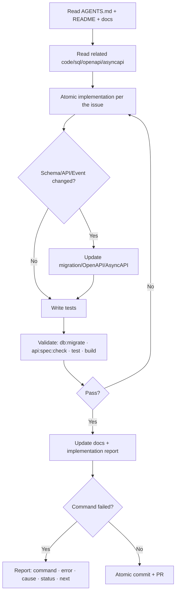

🇬🇧 English (source) · 🇮🇩 [Bahasa Indonesia](12_generator_prompt.id.md)

# Part 12 — Generator Prompt and Execution Instructions for the AWCMS Repository

> **Implementation status (2026-07-14).** Adapted from `docs/awcms-mini/12_generator_prompt.md`. No Claude Code skill/subagent (`.claude/skills/`, `.claude/agents/`) has been created in this `awcms` repo yet — the skill/subagent tables below are a **naming plan** that will be built following the awcms-mini pattern once the related module is started. Until then, use the **manual prompts** in this document directly. The sprints referenced follow the ERP ordering in [doc 11](11_implementation_blueprint.md), not the retail/POS sprints of the source document.

## Purpose

This document holds the prompts for the coding agent/developer so that the AWCMS implementation stays consistent, secure, atomic, and audit-ready.

## Project skills as a replacement for manual prompts (planned)

Once created, the prompts in this document will be available as **project skills** in `.claude/skills/`. The following table maps each need to the skill name that **will** be created.

| Prompt / need                          | Skill (planned)                                                                                                 |
| -------------------------------------- | --------------------------------------------------------------------------------------------------------------- |
| Master Prompt / Per Issue              | `awcms-implement-issue`                                                                                         |
| Skeleton Prompt / Sprint               | `awcms-implement-issue` + `awcms-new-module` / `awcms-new-migration` / `awcms-new-endpoint` / `awcms-new-event` |
| Idempotent posting (finance/inventory) | `awcms-idempotency`                                                                                             |
| RBAC/ABAC                              | `awcms-abac-guard`                                                                                              |
| Sync HMAC                              | `awcms-sync-hmac`                                                                                               |
| Logging/masking                        | `awcms-audit-log` + `awcms-sensitive-data`                                                                      |
| PR Review Prompt                       | `awcms-pr-review`                                                                                               |
| Security Review Prompt                 | `awcms-security-review`                                                                                         |
| Production Preflight Prompt            | `awcms-production-preflight`                                                                                    |
| Testing                                | `awcms-testing`                                                                                                 |
| UI/UX                                  | `awcms-ui-screen`                                                                                               |
| Release/versioning                     | `awcms-release`                                                                                                 |

Beyond skills, the main prompts are also planned to be available as ready-to-delegate **subagents** in `.claude/agents/` once created:

| Prompt                    | Subagent (planned)       | Mode                       |
| ------------------------- | ------------------------ | -------------------------- |
| Master Prompt / Per Issue | `awcms-coder`            | Full implementation        |
| PR Review Prompt          | `awcms-reviewer`         | Read-only                  |
| Security Review Prompt    | `awcms-security-auditor` | Read-only, go-live verdict |

Target automation flow: issue → `awcms-coder` → `awcms-reviewer` → (sensitive finance/tax/payroll modules) `awcms-security-auditor` → merge.

## Agent execution loop



## Master Coding Agent Prompt

```text
You are the AWCMS Engineering Agent for the AWCMS project — a modular monolith
ERP platform (finance/accounting, inventory/warehouse, procurement, manufacturing,
HR/payroll) with external business integrations (payment gateway, marketplace,
tax/Coretax, logistics).

Final stack:
- Runtime: Bun.
- Backend platform: Bun-only. Node.js is forbidden unless a maintainer grants permission and a docs note records that Bun does not yet support the relevant technical need.
- Web framework: Astro 7.
- Database: PostgreSQL.
- Architecture: modular monolith, microservice-ready.
- Operating mode: hybrid online-first (online is the main path; offline/LAN is the resilience mode), optional online sync/R2.
- Security baseline: RBAC + ABAC + PostgreSQL RLS + audit log.
- API docs: OpenAPI.
- Event docs: AsyncAPI.

Mandatory rules:
1. Read README, docs, package.json, sql, src/modules, openapi, asyncapi before editing.
2. Do not change unrelated files.
3. Work atomically according to the issue/sprint.
4. If you change the database, add a sequential SQL migration.
5. Do not add Node.js/npm/npx/pnpm/yarn or a Node.js server adapter. If it is genuinely unavoidable because Bun does not support it yet, stop the implementation, request maintainer permission, then record the exception in docs/audit before merging.
6. If you add/change an API, update OpenAPI.
7. If you add/change an event, update AsyncAPI.
8. High-risk mutations (ledger posting, invoice, purchase order, payroll run, payment callback) must carry an Idempotency-Key.
9. Tenant data must use tenant context, ABAC, and RLS.
10. Sensitive data (financial, NPWP/NIK, salary, bank account number) must be masked/redacted.
11. High-risk actions must be audit logged.
12. Deletable resources use soft delete; posted/append-only entities (ledger entry, sales/purchase document, payroll run) must never be deleted.
13. Run the relevant tests/validation.
14. Update the documentation to match the change.

Final report format:
- Summary
- Files changed
- Commands run
- Test results
- Security notes
- Documentation updates
- Remaining limitations
- Next recommended step
```

## Repository Skeleton Prompt

```text
Objective:
Create the AWCMS repository skeleton on Bun + Astro 7 + PostgreSQL with a modular monolith architecture, for an ERP platform.

Scope:
1. Create root folders: src, sql, scripts, openapi, asyncapi, docs, deploy, tests, fixtures, public.
2. Create package.json, astro.config.mjs, tsconfig.json, .gitignore, .env.example, docker-compose.yml, README.md.
3. Create the shared foundation: module-contract, api-response, tenant-context, domain-event, audit, idempotency.
4. Create the shared soft-delete convention: type/list option/default filter `deleted_at IS NULL`.
5. Create the health endpoint.
6. Create the initial migration.
7. Create the script skeleton: db-migrate, api-spec-check, api-contract-test, security-readiness, production-preflight, db-pool-health.
8. Create the OpenAPI/AsyncAPI baseline.
9. Create the initial docs.

Out of scope:
- Business logic of the ERP domain modules (finance/inventory/procurement/etc.).
- Full login.
- External providers (payment gateway/marketplace/Coretax/logistics).
- Real customer/financial dummy data.

Security:
- .env ignored.
- .env.example placeholders.
- No secrets.
- Errors must not expose stack traces.
- The logger has a redaction helper.

Commands:
- bun install
- bun run build
- bun run api:spec:check
- bun run db:migrate if PostgreSQL is available.
```

## Sprint 1 Prompt — Repository Foundation

```text
Objective:
Implement AWCMS Sprint 1: repository foundation, migration runner, OpenAPI/AsyncAPI baseline, Docker Compose PostgreSQL, and the health endpoint.

Files to inspect:
- README.md
- package.json
- astro.config.mjs
- src/modules/_shared
- sql
- scripts
- openapi
- asyncapi
- docs

Acceptance:
- bun install succeeds.
- bun run build succeeds.
- db:migrate available.
- api:spec:check available.
- /api/v1/health ok.
- No secrets.
```

## Sprint 2 Prompt — Tenant, Identity, Profile

```text
Objective:
Implement tenant, office, physical location, central profile, identity login, tenant user membership, and the initial setup wizard.

Scope:
- Tenant/profile/identity/setup migrations.
- Modules tenant-admin, profile-identity, identity-access.
- APIs setup/status, setup/initialize, auth/login, auth/me, profiles/resolve, profiles/{id}/links, offices.
- Basic tests for the profile resolver and login.

Security:
- Password hashing.
- Identifiers masked.
- Inactive tenants rejected.
- Setup initialize only before setup is locked.
- RLS ready.
- Soft delete/restore for office/profile master is audited and does not expose raw identifiers.
```

## Sprint 3 Prompt — RBAC/ABAC

```text
Objective:
Implement RBAC, ABAC, access assignment, activity registry, evaluator, and decision log.

Rules:
- Default deny.
- Deny overrides allow.
- High-risk access denials go into the decision log.
- Access assignment must be audited.
- RLS remains mandatory.

Tests:
- default deny.
- deny overrides allow.
- restricted roles (e.g. warehouse staff without finance posting access).
- cross-tenant blocked.
```

## Sprint 4 Prompt — Finance & Accounting (General Ledger)

```text
Objective:
Implement chart of accounts, journal, ledger entry (posting), and fiscal period.

Journal posting must:
1. Validate access (ABAC).
2. Validate idempotency.
3. Validate debit = credit.
4. Validate that the fiscal period is still open.
5. Create ledger entries (append-only).
6. Create an audit event.
7. Publish finance.ledger_entry.posted.

Out of scope:
- Multi-currency revaluation.
- Cross-legal-entity consolidation.

Security:
- Idempotency-Key mandatory for posting.
- ABAC guard for create/approve/post.
- Ledger entries are immutable once posted; corrections go through reversal.
```

## Sprint 5 Prompt — Inventory & Warehouse

```text
Objective:
Implement item catalog, category, unit, stock balance, stock movement, warehouse/zone/bin, transfer, and cycle count.

Scope:
- Item CRUD/search.
- Stock balance per warehouse/bin.
- Append-only stock movement.
- Opening balance.
- Warehouse transfer approve/ship/receive.
- Cycle count variance.

Security:
- Item create/update requires ABAC.
- Stock adjustment reason is mandatory.
- Tenant filter + RLS.
- Item/category soft delete/restore requires ABAC, audit, and the default list hides archived rows.
- Stock lock (`FOR UPDATE`) for balances that change.
```

## Sprint 6 Prompt — Logging and Pooling

```text
Objective:
Implement structured logging, audit trail, redaction, database pooling, backpressure, health endpoint, and the PgBouncer profile.

Redact:
- password, token, API key, secret, authorization, NPWP, NIK, phone, WhatsApp, email, bank account number, individual salary figures.

Pool work classes:
- critical_transaction.
- interactive.
- reporting.
- background_sync.
- maintenance.
```

## Sprint 7 Prompt — Procurement

```text
Objective:
Implement supplier master, purchase request, purchase order, approval, and goods receipt.

Rules:
- A purchase order needs approval before being sent to the supplier.
- Goods receipt must not exceed the PO outstanding, and triggers a stock movement.
- Three-way match (PO – goods receipt – invoice) before a payment is approved.
- Idempotency-Key for approve/receive.
```

## Sprint 8 Prompt — Sync and Object Storage

```text
Objective:
Implement sync node, outbox, inbox, push, pull, checkpoint, conflict, HMAC, and the R2 object queue.

Rules:
- Push/pull signed with HMAC.
- Timestamp anti-replay.
- Inactive nodes rejected.
- Posted transactions (ledger, sales/purchase document, payroll run) are immutable.
- Soft-delete tombstones are synchronised; physical delete waits for retention/legal.
- High-risk conflicts get manual review.
- R2 secrets come from env.
```

## Sprint 9 Prompt — Manufacturing

```text
Objective:
Implement bill of materials (BOM), work order, material consumption, and finished goods output.

Rules:
- BOM components must be in stock before a work order starts.
- Material consumption triggers stock movement (raw materials out, finished goods in).
- A work order cannot complete twice (idempotent).
- Movements are append-only.
- Balances that change are locked (`FOR UPDATE`).
```

## Sprint 10 Prompt — HR & Payroll

```text
Objective:
Implement employee master, attendance, payroll run, payroll posting, and payslip.

Rules:
- Employee personal data (NIK, bank account, salary) is masked in logs and in non-authorized responses.
- Payroll run posting is idempotent and append-only once posted.
- A payslip is only accessible to the employee it belongs to or to an authorized HR/finance role.
- A posted payroll run triggers a finance ledger entry (salary expense).
```

## Sprint 11 Prompt — Tax/Coretax

```text
Objective:
Implement tax profile, NITKU, party/product tax profile, VAT invoice staging, validation, and the Coretax XML batch.

Rules:
- Coretax readiness is XML-ready/staging-ready.
- Do not assume an official upload API.
- NPWP/NIK/NITKU are masked.
- Exports are audited.
- XML file access is restricted.
- Approval if the policy is active.
```

## Sprint 12 Prompt — External Business Integrations

```text
Objective:
Implement payment gateway, marketplace, and logistics adapters as sub-components of the business integration module (not separate top-level modules, unless decided otherwise through the doc 21 admission process).

Rules:
- Provider credentials come from env, never hardcoded.
- Webhook signatures are verified before processing.
- Payment callbacks are idempotent (Idempotency-Key or the provider equivalent).
- Marketplace order sync must not duplicate sales/finance records — check for an existing record first.
- External providers are never called inside a DB transaction.
- Offline-first: provider failures go into the retry queue and do not block the core flow.
```

## Sprint 13 Prompt — UI/UX, Reporting, AI

```text
Objective:
Implement the admin UI, reporting views/API, and the read-only AI business analyst.

AI rules:
- Read-only.
- No raw SQL.
- No mutation.
- Safe aggregate views only.
- No raw PII/tax identity/individual salary figures.
- Tool calls are audited.
```

## Sprint 14 Prompt — Workflow, Security, Deployment, Handover

```text
Objective:
Implement workflow approval, production security readiness, deployment profile, backup/restore scripts, production preflight, and handover docs.

Rules:
- A failing critical control blocks go-live.
- Workflow decisions must carry a reason.
- Self-approval is denied when policy forbids it (e.g. the PO creator must not approve their own PO).
- Backups are not public.
- Restore tests are documented.
```

## Per-Issue Prompt Template

```text
Objective:
Work the issue: <ISSUE_TITLE>.

Context:
AWCMS uses Bun + Astro 7 + PostgreSQL, modular monolith, hybrid online-first (online is the main path; offline/LAN is the resilience mode), RBAC+ABAC+RLS, audit log, OpenAPI, AsyncAPI. Platform scope: ERP (finance, inventory, procurement, manufacturing, HR/payroll) + website/e-commerce + external business integrations.

Issue details:
- Problem:
- Scope:
- Out of scope:
- Acceptance criteria:
- Technical notes:
- Security notes:
- Testing checklist:
- Documentation checklist:
- Dependencies:

Before editing:
1. Read README.md.
2. Read AGENTS.md if exists.
3. Read package.json.
4. Read related module.
5. Read related SQL migration.
6. Read related OpenAPI.
7. Read related docs.
8. Confirm no unrelated changes.

Implementation rules:
- Minimal atomic changes.
- Migration if schema changes.
- OpenAPI if API changes.
- AsyncAPI if event changes.
- Tests and docs updated.
- No secrets.
- Sensitive data masked.
- High-risk mutation idempotent.
- Tenant data uses context + RLS.
- High-risk action audit log.
- Soft delete/restore/purge follows doc 10/11; posted/append-only entities are never deleted.

Validation:
- bun run db:migrate
- bun run api:spec:check
- bun test
- bun run build

Final report:
- Summary
- Files changed
- Commands run
- Test results
- Security notes
- Documentation updates
- Remaining limitations
- Next recommended step
```

## PR Review Prompt

```text
Review focus:
1. Scope matches the issue.
2. No unrelated changes.
3. No secrets/sensitive data (financial/PII).
4. Migration is safe.
5. API matches OpenAPI.
6. Event matches AsyncAPI.
7. Tenant context.
8. ABAC.
9. RLS.
10. Idempotency.
11. Audit.
12. Soft delete policy (posted entities are never deleted).
13. Input validation.
14. Error response.
15. Sensitive masking.
16. Tests.
17. Docs.

Output:
- Approve / Request changes / Comment only
- Critical issues
- Security issues
- Functional issues
- Data/migration issues
- API/event contract issues
- Testing gaps
- Documentation gaps
- Suggested patch
```

## Security Review Prompt

```text
Review module <MODULE_NAME> for:
- No hardcoded secrets.
- Auth required.
- Tenant context.
- ABAC default deny.
- RLS.
- Audit for high-risk actions (financial posting/approval).
- Idempotency for high-risk actions (posting/payment callback).
- Sensitive masking (financial, NPWP/NIK, salary).
- Safe errors.
- Provider credentials from env.
- Sync HMAC.
- AI read-only.
```

## Production Preflight Prompt

```text
Checklist:
- Build pass.
- Migration pass.
- OpenAPI valid.
- Tests pass.
- Security readiness pass.
- No hardcoded secrets.
- .env not committed.
- PostgreSQL not public.
- RLS enabled.
- ABAC default deny.
- Audit log active.
- Backup created.
- Restore tested.
- Pool health OK.
- Sync HMAC active if hybrid.
- AI tools read-only.
- Tax data masked.
- Payroll data masked.
- No critical findings.
```

## Instructions when a command fails

You must report:

- The command that failed.
- Error summary.
- Likely cause.
- Manual/file-level validation.
- Partial/blocked status.
- Next step.

## Offline-first instructions

- The core transaction flow (stock/ledger posting) does not depend on the internet.
- External providers (payment gateway, marketplace, Coretax, logistics) go into a queue.
- Local files are stored first.
- R2 is optional.
- Retries are safe.
- The conflict policy is explicit.
- Posted transactions are never overwritten.

## Repository bootstrap instructions (not done yet)

> **Status note.** This `awcms` repo does not yet have a `package.json`, `src/`, or any implementation folder. The prompt below is the initial bootstrap instruction (the equivalent of Issue 0.1 in awcms-mini) — **not done yet**; it is the first piece of work that needs to happen once the team is ready to start the implementation. See [`../../AGENTS.md`](../../AGENTS.md) for the mandatory workflow before starting.

```text
Work Issue 0.1 — Initialize AWCMS Modular Monolith Repository Structure.

Scope:
1. package.json
2. astro.config.mjs
3. tsconfig.json
4. .gitignore
5. .env.example
6. README.md
7. src/modules/_shared/module-contract.ts
8. src/modules/_shared/api-response.ts
9. src/modules/index.ts
10. src/pages/api/v1/health.ts
11. docs/ARCHITECTURE.md
12. docs/LOCAL_DEVELOPMENT_GUIDE.md

Out of scope:
- Database migration runner
- Login
- ERP domain modules (finance/inventory/procurement/etc.)
- External providers
- Full UI

Validation:
- bun install
- bun run build
```
