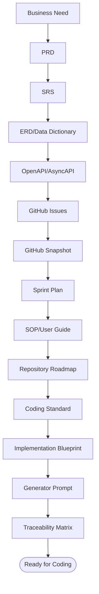

🇬🇧 English (source) · 🇮🇩 [Bahasa Indonesia](13_final_master_index_traceability.id.md)

# Part 13 — Final Master Index and Traceability Matrix

> **Example domain (illustrative).** This document uses the retail/POS domain as a running example. Its **patterns & standards** are reusable for the AWCMS template; the **entities, endpoints, screens, and domain terms** (product, POS, warehouse, tax, CRM, AI, etc.) are illustrations. Real domain modules (ERP, website/e-commerce, content) are added **directly in `src/modules/`** of this template ([ADR-0034](../adr/0034-awcms-family-direct-use-templates-and-derived-pathway-removal.md)/[ADR-0035](../adr/0035-awcms-online-first-erp-saas-superset-repositioning.md)). See the [document package README](README.md).

## Purpose

This document is the final master index for the whole AWCMS document package, and at the same time the traceability matrix from business need down to implementation, test, security, SOP, and production readiness.

## Document master index

|   Part | File                                                                                                                | Function                                                                                                                                                                                                                                                                                                                                                                                                                                                                                                                                                                                                                                                                                                                                                                                                                                                                                                                                                                                                                                                                                                                                                                                                                                                                               |
| -----: | ------------------------------------------------------------------------------------------------------------------- | -------------------------------------------------------------------------------------------------------------------------------------------------------------------------------------------------------------------------------------------------------------------------------------------------------------------------------------------------------------------------------------------------------------------------------------------------------------------------------------------------------------------------------------------------------------------------------------------------------------------------------------------------------------------------------------------------------------------------------------------------------------------------------------------------------------------------------------------------------------------------------------------------------------------------------------------------------------------------------------------------------------------------------------------------------------------------------------------------------------------------------------------------------------------------------------------------------------------------------------------------------------------------------------- |
|      1 | `01_canvas_induk.md`                                                                                                | Architecture canvas and development phases                                                                                                                                                                                                                                                                                                                                                                                                                                                                                                                                                                                                                                                                                                                                                                                                                                                                                                                                                                                                                                                                                                                                                                                                                                             |
|      2 | `02_prd_detail_per_modul.md`                                                                                        | Product requirements per module                                                                                                                                                                                                                                                                                                                                                                                                                                                                                                                                                                                                                                                                                                                                                                                                                                                                                                                                                                                                                                                                                                                                                                                                                                                        |
|      3 | `03_srs_detail_per_modul.md`                                                                                        | Technical specification per module                                                                                                                                                                                                                                                                                                                                                                                                                                                                                                                                                                                                                                                                                                                                                                                                                                                                                                                                                                                                                                                                                                                                                                                                                                                     |
|      4 | `04_erd_data_dictionary.md`                                                                                         | ERD, data dictionary, RLS, indexes                                                                                                                                                                                                                                                                                                                                                                                                                                                                                                                                                                                                                                                                                                                                                                                                                                                                                                                                                                                                                                                                                                                                                                                                                                                     |
|      5 | `05_openapi_asyncapi_detail.md`                                                                                     | API contract and event contract                                                                                                                                                                                                                                                                                                                                                                                                                                                                                                                                                                                                                                                                                                                                                                                                                                                                                                                                                                                                                                                                                                                                                                                                                                                        |
|      6 | `06_github_issues_detail.md`                                                                                        | Atomic issues ready to copy-paste                                                                                                                                                                                                                                                                                                                                                                                                                                                                                                                                                                                                                                                                                                                                                                                                                                                                                                                                                                                                                                                                                                                                                                                                                                                      |
|      7 | `07_sprint_testing_production_readiness.md`                                                                         | Sprint, testing, go-live                                                                                                                                                                                                                                                                                                                                                                                                                                                                                                                                                                                                                                                                                                                                                                                                                                                                                                                                                                                                                                                                                                                                                                                                                                                               |
|      8 | `08_sop_operasional_user_guide.md`                                                                                  | Operational SOP and user guide                                                                                                                                                                                                                                                                                                                                                                                                                                                                                                                                                                                                                                                                                                                                                                                                                                                                                                                                                                                                                                                                                                                                                                                                                                                         |
|      9 | `09_roadmap_repository_commit.md`                                                                                   | Repo roadmap, branch, commit, release                                                                                                                                                                                                                                                                                                                                                                                                                                                                                                                                                                                                                                                                                                                                                                                                                                                                                                                                                                                                                                                                                                                                                                                                                                                  |
|     10 | `10_template_kode_coding_standard.md`                                                                               | Code templates and coding standard                                                                                                                                                                                                                                                                                                                                                                                                                                                                                                                                                                                                                                                                                                                                                                                                                                                                                                                                                                                                                                                                                                                                                                                                                                                     |
|     11 | `11_implementation_blueprint.md`                                                                                    | Skeleton and blueprint per sprint                                                                                                                                                                                                                                                                                                                                                                                                                                                                                                                                                                                                                                                                                                                                                                                                                                                                                                                                                                                                                                                                                                                                                                                                                                                      |
|     12 | `12_generator_prompt.md`                                                                                            | Coding agent execution prompt                                                                                                                                                                                                                                                                                                                                                                                                                                                                                                                                                                                                                                                                                                                                                                                                                                                                                                                                                                                                                                                                                                                                                                                                                                                          |
|     13 | `13_final_master_index_traceability.md`                                                                             | Master index and traceability                                                                                                                                                                                                                                                                                                                                                                                                                                                                                                                                                                                                                                                                                                                                                                                                                                                                                                                                                                                                                                                                                                                                                                                                                                                          |
|     14 | `14_ui_ux_design_system.md`                                                                                         | Design system, tokens, components, screens, a11y, i18n                                                                                                                                                                                                                                                                                                                                                                                                                                                                                                                                                                                                                                                                                                                                                                                                                                                                                                                                                                                                                                                                                                                                                                                                                                 |
|     15 | `15_frontend_architecture_integration.md`                                                                           | Frontend architecture, API client, auth, hybrid online-first                                                                                                                                                                                                                                                                                                                                                                                                                                                                                                                                                                                                                                                                                                                                                                                                                                                                                                                                                                                                                                                                                                                                                                                                                           |
|     16 | `16_backend_data_access_integration.md`                                                                             | Data access, pooling, RLS, transaction, outbox                                                                                                                                                                                                                                                                                                                                                                                                                                                                                                                                                                                                                                                                                                                                                                                                                                                                                                                                                                                                                                                                                                                                                                                                                                         |
|     17 | `17_default_seed_rbac_abac.md`                                                                                      | Default roles, permission matrix, ABAC policy, seed                                                                                                                                                                                                                                                                                                                                                                                                                                                                                                                                                                                                                                                                                                                                                                                                                                                                                                                                                                                                                                                                                                                                                                                                                                    |
|     18 | `18_configuration_env_reference.md`                                                                                 | Env reference, feature flags, deployment topology                                                                                                                                                                                                                                                                                                                                                                                                                                                                                                                                                                                                                                                                                                                                                                                                                                                                                                                                                                                                                                                                                                                                                                                                                                      |
|     19 | `19_glossary_terminology.md`                                                                                        | Glossary & terminology across documents                                                                                                                                                                                                                                                                                                                                                                                                                                                                                                                                                                                                                                                                                                                                                                                                                                                                                                                                                                                                                                                                                                                                                                                                                                                |
|     20 | `20_threat_model_security_architecture.md`                                                                          | Threat model (STRIDE), trust boundaries, layered security controls (base document)                                                                                                                                                                                                                                                                                                                                                                                                                                                                                                                                                                                                                                                                                                                                                                                                                                                                                                                                                                                                                                                                                                                                                                                                     |
|     21 | `21_module_admission_governance.md`                                                                                 | Module categories, admission decision tree, registry mapping, trusted registry policy                                                                                                                                                                                                                                                                                                                                                                                                                                                                                                                                                                                                                                                                                                                                                                                                                                                                                                                                                                                                                                                                                                                                                                                                  |
|    ADR | `../adr/README.md`                                                                                                  | Architecture Decision Records (base decisions + rationale) — including `../adr/0013-extension-layers-and-boundary-model.md` (Issue #739, epic #738 `platform-evolution`): the Core/System Foundation/Official Optional Business Foundation/SaaS Control Plane/ERP Extension/Derived Application extension layers (the _ERP Extension_/_Derived Application_ layers are now **historical/superseded** by [ADR-0034](../adr/0034-awcms-family-direct-use-templates-and-derived-pathway-removal.md)/[ADR-0035](../adr/0035-awcms-online-first-erp-saas-superset-repositioning.md) — domain modules live directly in `src/modules/`), the tenant vs legal entity vs organization unit boundaries, the data-ownership matrix, and the evidence-based criteria for extracting a service; `../adr/0014-deterministic-build-time-module-composition.md` (Issue #740, epic #738): the `application-registry.ts` extension point, the composition failure taxonomy, and the migration namespace convention; and `../adr/0020-erp-extension-readiness-contracts.md` (Issue #755, epic #738 Wave 4): the business transaction/posting/period-lock/item/currency/UoM/inventory-movement/reconciliation/report-projection contracts for ERP extensions, without any new ERP module/table in the base |
|   Gov. | `../../GOVERNANCE.md`, `../../CONTRIBUTING.md`, `../../SECURITY.md`, `../../CODE_OF_CONDUCT.md`, `../../SUPPORT.md` | Governance, contribution, security, community                                                                                                                                                                                                                                                                                                                                                                                                                                                                                                                                                                                                                                                                                                                                                                                                                                                                                                                                                                                                                                                                                                                                                                                                                                          |
|     CI | `../../.github/workflows/`                                                                                          | CodeQL + CI: lint, docs-check, typecheck, unit test, hygiene (Bun-only, no-`.env`)                                                                                                                                                                                                                                                                                                                                                                                                                                                                                                                                                                                                                                                                                                                                                                                                                                                                                                                                                                                                                                                                                                                                                                                                     |
|  Tools | `../../scripts/`, `../../tests/`                                                                                    | Bun-native docs checker (`scripts/lib/docs-checks.mjs`) + unit/integration tests (`bun test`)                                                                                                                                                                                                                                                                                                                                                                                                                                                                                                                                                                                                                                                                                                                                                                                                                                                                                                                                                                                                                                                                                                                                                                                          |
| GitHub | `github/README.md`                                                                                                  | Snapshot of the actual issues, labels, milestones, and the refresh process                                                                                                                                                                                                                                                                                                                                                                                                                                                                                                                                                                                                                                                                                                                                                                                                                                                                                                                                                                                                                                                                                                                                                                                                             |

## Final executive summary

AWCMS is a modular monolith standard based on AWCMS with this final stack:

```text
Bun-only backend + Astro 7 + PostgreSQL + Modular Monolith + Hybrid online-first (offline/LAN as a resilience mode)
```

Technical decisions:

1. PostgreSQL as the primary database.
2. Bun as the runtime and backend platform; Node.js is only allowed through a written exception when Bun does not yet support a required capability.
3. Astro 7 as the web framework.
4. Modular monolith, microservice-ready.
5. Hybrid online + offline, online-first priority (offline/LAN = resilience mode).
6. Optional online sync.
7. Optional Cloudflare R2.
8. Optional StarSender/Mailketing.
9. Optional AI analyst via safe views.
10. RBAC + ABAC + RLS + Audit Log.
11. Coretax-ready via staging/XML/checksum/approval/audit.
12. Tenant-safe soft delete for master/config/draft; posted/append-only entities stay immutable.

## Traceability chain


## Traceability — Business Need to Module

| Business Need              | Module                | Output                             |
| -------------------------- | --------------------- | ---------------------------------- |
| Multi-tenant store/branch  | Tenant Admin          | Tenant, office, physical location  |
| User login and role        | Identity & Access     | Identity, tenant user, role        |
| Flexible access rights     | Identity & Access     | RBAC, ABAC, decision log           |
| Centralised profile        | Central Profile       | Profile, identifier, entity link   |
| Product master             | Catalog Inventory     | Product, category, unit, price     |
| Safe master data archiving | All master modules    | Soft delete, restore, purge policy |
| Store/warehouse stock      | Catalog Inventory     | Balance, movement                  |
| Operational transaction    | Sales POS             | Checkout, payment, sales document  |
| Safe posting               | Sales POS + Inventory | Idempotency, stock lock, audit     |
| Shared stock               | Shared Stock Routing  | Pool, routing rule, decision       |
| Multi-warehouse            | Warehouse             | Warehouse, bin, lot, transfer      |
| Digital receipt            | CRM                   | PDF, WA/email outbox, portal       |
| Offline sync               | Sync Storage          | Outbox, inbox, conflict            |
| Tax data                   | Accounting Tax        | Tax profile, NITKU, VAT invoice    |
| Coretax-ready              | Accounting Tax        | XML batch, checksum, approval      |
| Dashboard                  | Reporting             | Sales/stock/tax/sync reports       |
| AI insight                 | AI Analyst            | Safe read-only tools               |
| Admin/operator UI          | UI Experience         | Admin shell, POS screen            |
| Audit/troubleshooting      | Observability         | Logs, audit, security events       |
| DB reliability             | DB Connectivity       | Pool, queue, circuit breaker       |
| High-risk approval         | Workflow              | Workflow instance/task/decision    |
| Safe go-live               | Production Security   | Readiness, findings, gates         |

## Traceability — PRD → SRS → ERD → API → Issue → Sprint → Test

| Need               | SRS Area               | Table                                    | API                                | Issue            | Sprint | Test                 |
| ------------------ | ---------------------- | ---------------------------------------- | ---------------------------------- | ---------------- | -----: | -------------------- |
| Tenant setup       | Tenant Admin           | `awcms_tenants`, `awcms_offices`         | `/setup/initialize`                | 12.1             |    1–2 | setup test           |
| Login              | Identity               | `awcms_identities`, `awcms_tenant_users` | `/auth/login`                      | 2.3              |      2 | login test           |
| Access control     | ABAC                   | `awcms_roles`, `awcms_abac_policies`     | `/access/evaluate`                 | 2.4              |      3 | default deny         |
| Customer profile   | Profile                | `awcms_profiles`, identifiers            | `/profiles/resolve`                | 2.2              |      2 | resolver             |
| Product            | Inventory              | `awcms_products`                         | `/inventory/products`              | 3.1              |      4 | CRUD/search          |
| Soft delete master | Shared + domain module | `deleted_at`, `deleted_by`               | `DELETE/restore/includeDeleted`    | 0.1/0.3 + domain |    1–4 | archive/restore      |
| Stock              | Inventory              | `awcms_stock_balances`, movements        | `/inventory/stock-balances`        | 3.2              |      4 | movement             |
| Checkout           | Sales                  | `awcms_checkout_sessions`                | `/sales/checkout-sessions`         | 3.3              |      5 | checkout             |
| Posting            | Sales                  | `awcms_sales_documents`, idempotency     | `/sales/.../post`                  | 3.4              |      5 | idempotency/rollback |
| Receipt            | CRM                    | `awcms_receipt_pdfs`                     | `/crm/receipts/{id}/send`          | 5.1              |      7 | PDF                  |
| WA/email           | CRM                    | `awcms_message_outbox`                   | `/crm/receipts/{id}/send`          | 5.2/5.3          |      7 | provider mock        |
| Sync               | Sync                   | `awcms_sync_outbox`, inbox               | `/sync/push`                       | 6.1              |      8 | HMAC                 |
| Conflict           | Sync                   | `awcms_sync_conflicts`                   | `/sync/conflicts/{id}/resolve`     | 6.2              |      8 | conflict             |
| Warehouse          | WMS                    | `awcms_warehouses`, bins                 | `/warehouses`                      | 4.1              |      9 | location             |
| Transfer           | WMS                    | transfer tables                          | `/warehouse-transfers`             | 4.3              |      9 | transfer             |
| Cycle count        | WMS                    | cycle count tables                       | `/cycle-counts`                    | 4.4              |      9 | variance             |
| VAT invoice        | Tax                    | `awcms_vat_invoices`                     | `/tax/vat-invoices/generate`       | 7.3              |     10 | validation           |
| Coretax            | Tax                    | `awcms_coretax_batches`                  | `/tax/coretax/batches`             | 7.4              |     10 | XML/checksum         |
| UI                 | UI                     | UI registry                              | `/ui/navigation`                   | 8.1/8.2          |     11 | render               |
| Reports            | Reporting              | report views                             | `/reports/sales/daily`             | 9.1              |     11 | tenant-aware         |
| AI                 | AI                     | `awcms_ai_tool_calls`                    | `/ai/business-analyst/chat`        | 9.2              |     11 | no PII/SQL           |
| Logs               | Observability          | `awcms_log_events`                       | `/logs/recent`                     | 10.1             |      6 | redaction            |
| Pooling            | DB                     | `awcms_db_pool_*`                        | `/database/pool/health`            | 10.2             |      6 | health/load          |
| Workflow           | Workflow               | `awcms_workflow_*`                       | `/workflow/tasks/{id}/decision`    | 11.1             |     12 | approval             |
| Security           | Security               | `awcms_security_*`                       | `/security/go-live-gates/evaluate` | 10.3             |     12 | go-live gate         |

## Module vs Migration Matrix

Source: `docs/awcms/repo-inventory.md` §Migrations and
`src/modules/index.ts`, both re-read while writing this table.
`repo-inventory.md` is now **genuinely generated**: the table between its markers
is produced by `bun run repo:inventory:generate` (`scripts/repo-inventory.ts`) from
the module registry, `sql/`, `tests/`, `src/pages/`, and `docs/adr/`, and
`bun run repo:inventory:check` is in the `bun run check` chain. **79 real migration files** in
`sql/` (`001`..`081`), mapped onto **24 registered modules** (order of
`src/modules/index.ts`: `logging`, `tenant-admin`, `profile-identity`,
`identity-access`, `module-management`, `domain-event-runtime`,
`sync-storage`, `workflow-approval`, `email`, `reporting`, `theming`,
`media-library`, `blog-content`, `tenant-domain`, `visitor-analytics`,
`data-lifecycle`, `seo-distribution`, `form-drafts`, `site-search`,
`comments` — **24 modules**; `news-portal` was merged into `blog-content` by
[ADR-0044](../adr/0044-merge-news-portal-into-blog-content.md)). This table
replaces the previous version, which quoted fictional file names (e.g.
`003_awcms_catalog_inventory_schema.sql`,
`004_awcms_sales_pos_schema.sql`) from a POS/retail system that was
never built in this base repo — unlike the other tables in this
document, which deliberately use the **illustrative** retail/POS domain (see the
banner at the top of the document), this table specifically documents the
REAL repo structure, so it follows real data, not an illustration.

| Module (`key`)                   | Migration                                                                                                                                                                                                                                                                                                                                                                                                                               |
| -------------------------------- | --------------------------------------------------------------------------------------------------------------------------------------------------------------------------------------------------------------------------------------------------------------------------------------------------------------------------------------------------------------------------------------------------------------------------------------- |
| _(Foundation, cross-module)_     | `001_awcms_foundation_schema.sql`, `017_awcms_enforce_rls_force.sql`, `019_awcms_db_role_separation.sql`, `021_awcms_db_role_grants_narrow.sql`                                                                                                                                                                                                                                                                                         |
| `tenant_admin`                   | `002_awcms_tenant_office_schema.sql`, `006_awcms_setup_wizard_schema.sql`, `015_awcms_tenant_settings_management_permission_schema.sql`, `016_awcms_tenant_default_locale_english_schema.sql`                                                                                                                                                                                                                                           |
| `profile_identity`               | `003_awcms_central_profile_management_schema.sql`                                                                                                                                                                                                                                                                                                                                                                                       |
| `identity_access`                | `004_awcms_identity_login_schema.sql`, `005_awcms_abac_access_control_schema.sql`, `022_awcms_password_reset_schema.sql`, `034_awcms_mfa_totp_schema.sql`, `035_awcms_google_oidc_schema.sql`, `036_awcms_tenant_oidc_sso_schema.sql`, `037_awcms_tenant_oidc_sso_permissions.sql`                                                                                                                                                      |
| `sync_storage`                   | `007_awcms_sync_storage_outbox_inbox_schema.sql`, `008_awcms_sync_storage_conflict_schema.sql`, `009_awcms_object_sync_queue_schema.sql`, `014_awcms_sync_node_management_permission_schema.sql`, `017_awcms_sync_queue_conflict_performance_indexes.sql`, `018_awcms_object_sync_queue_dispatcher_schema.sql`                                                                                                                          |
| `reporting`                      | `010_awcms_management_reporting_permission_schema.sql`                                                                                                                                                                                                                                                                                                                                                                                  |
| `logging`                        | `011_awcms_audit_logging_schema.sql`, `047_awcms_observability_metrics_permission.sql`                                                                                                                                                                                                                                                                                                                                                  |
| `workflow`                       | `012_awcms_workflow_approval_schema.sql`                                                                                                                                                                                                                                                                                                                                                                                                |
| `form_drafts`                    | `019_awcms_form_drafts_schema.sql`                                                                                                                                                                                                                                                                                                                                                                                                      |
| `email`                          | `020_awcms_email_schema.sql`, `021_awcms_email_template_i18n_schema.sql`, `023_awcms_email_announcement_permission_schema.sql`, `024_awcms_email_message_cancel_permission_schema.sql`                                                                                                                                                                                                                                                  |
| `module_management`              | `025_awcms_module_management_schema.sql` (epic #510, Issue #511-#521)                                                                                                                                                                                                                                                                                                                                                                   |
| `blog_content`                   | `026_awcms_blog_content_schema.sql`, `027_awcms_blog_content_permissions.sql`, `028_awcms_blog_content_search_vector.sql`, `029_awcms_blog_content_presentation_schema.sql`, `030_awcms_blog_content_presentation_permissions.sql`, `050_awcms_blog_posts_seo_image.sql`, `051_awcms_blog_content_internal_tag_links_schema.sql`, `052_awcms_blog_content_internal_tag_links_permissions.sql` (epic #536, Issue #537-#543 + follow-ups) |
| `tenant_domain`                  | `031_awcms_tenant_domain_schema.sql`, `032_awcms_tenant_domain_permissions.sql`, `033_awcms_tenant_domain_lookup_function.sql`                                                                                                                                                                                                                                                                                                          |
| `visitor_analytics`              | `038_awcms_visitor_analytics_permissions.sql`, `039_awcms_visitor_analytics_schema.sql`, `040_awcms_visitor_analytics_session_lookup_index.sql`                                                                                                                                                                                                                                                                                         |
| `news_portal` (merged, ADR-0044) | `041_awcms_news_media_object_registry_schema.sql`, `042_awcms_news_media_permissions.sql`, `043_awcms_news_portal_tenant_state_schema.sql`, `044_awcms_news_portal_homepage_sections_schema.sql`, `046_awcms_news_media_orphan_lifecycle.sql`, `049_awcms_news_portal_ad_placements_schema.sql`                                                                                                                                         |
| `idn_admin_regions`              | `048_awcms_idn_admin_regions_permissions.sql`, `054_awcms_idn_admin_regions_schema.sql`                                                                                                                                                                                                                                                                                                                                                 |
| `social_publishing`              | `053_awcms_social_publishing_schema.sql`, `055_awcms_social_publishing_verify_permission.sql`                                                                                                                                                                                                                                                                                                                                           |

The three migrations in the "Foundation, cross-module" row are not mapped to
a single module because they really are cross-module: `001` is a
pure bootstrap (migration ledger + Postgres extensions, before any
module is registered); `017`, `019`, and `021` are cross-table security
hardening (RLS `FORCE` on 23 tables, then the least-privilege `awcms_app`
runtime role + a fail-closed default GUC, then narrowing the `awcms_app` grants
on RLS-free global tables — Issue #160) which touch tables of many
modules at once rather than one module's schema — see
`docs/awcms/20_threat_model_security_architecture.md` and
`docs/awcms/18_configuration_env_reference.md` §Database role model.

> **Accuracy warning (Issue #155).** The `001`/`017`/`019`/`021` rows above have already been
> reconciled with the real `sql/`. **The other module rows in this table have not**:
> most still use awcms-mini numbering/naming (e.g.
> `045_awcms_db_role_separation.sql`, which used to be listed in the Foundation row,
> never existed in this repo — `sql/` currently stops at `023`), so the numbers
> listed in the other rows may point at files that do not exist. The source of
> truth for migrations is the contents of the `sql/` directory and
> `docs/awcms/repo-inventory.md`, not this table, until a full
> reconciliation is done.

## Module vs Security Control Matrix

| Control               | Module                                                         |
| --------------------- | -------------------------------------------------------------- |
| No hardcoded secrets  | All                                                            |
| Password hashing      | Identity                                                       |
| Tenant isolation      | All tenant-scoped                                              |
| RBAC/ABAC             | Identity Access                                                |
| RLS                   | All tenant-scoped                                              |
| Audit log             | Observability + all high-risk                                  |
| Idempotency           | POS, Warehouse, Tax, CRM, Sync, Workflow                       |
| Soft delete           | Tenant-scoped master/config/draft; restore/purge by permission |
| Input validation      | All APIs                                                       |
| Sensitive masking     | Profile, CRM, Tax, Logs, AI                                    |
| Stock lock            | Inventory, POS, Warehouse                                      |
| Immutable transaction | Sales POS                                                      |
| Sync HMAC             | Sync                                                           |
| File checksum         | Sync/R2, Tax export                                            |
| Consent               | CRM                                                            |
| AI read-only          | AI Analyst                                                     |
| Tax export approval   | Tax + Workflow                                                 |
| Go-live gate          | Production Security                                            |
| Backup/restore        | Deployment/Ops                                                 |

## Security Control vs Skill Matrix

| Control                                      | Enforcing skill                                                                    |
| -------------------------------------------- | ---------------------------------------------------------------------------------- |
| Tenant isolation + RBAC/ABAC + RLS           | `awcms-abac-guard`                                                                 |
| High-risk idempotency                        | `awcms-idempotency`                                                                |
| High-risk audit log                          | `awcms-audit-log`                                                                  |
| Sensitive masking                            | `awcms-sensitive-data`                                                             |
| Sync HMAC + file checksum                    | `awcms-sync-hmac`                                                                  |
| Safe migration (RLS/index)                   | `awcms-new-migration`                                                              |
| Soft delete policy                           | `awcms-new-migration`, `awcms-new-endpoint`, `awcms-abac-guard`, `awcms-audit-log` |
| API/event contract                           | `awcms-new-endpoint`, `awcms-new-event`                                            |
| Layered testing                              | `awcms-testing`                                                                    |
| Security review                              | `awcms-security-review` + the `awcms-security-auditor` agent                       |
| CodeQL code scanning triage                  | `awcms-codeql-triage`                                                              |
| PR / DoD review                              | `awcms-pr-review` + the `awcms-reviewer` agent                                     |
| Go-live gate                                 | `awcms-production-preflight`                                                       |
| Deployment profile (LAN-first/Coolify)       | `awcms-deploy`                                                                     |
| UI/design system/a11y                        | `awcms-ui-screen`                                                                  |
| Multi-step form (wizard)                     | `awcms-wizard-form`                                                                |
| Server-side draft persistence                | `awcms-form-drafts`                                                                |
| Send transactional email                     | `awcms-email`                                                                      |
| Manage the Module Management system          | `awcms-module-management` (+ `awcms-new-module` to scaffold descriptor fields)     |
| Work the blog_content epic (Issue #537-#543) | `awcms-blog-content`                                                               |
| Release/CHANGELOG                            | `awcms-release`                                                                    |
| Legacy migration                             | `awcms-legacy-migration`                                                           |
| Issue implementation                         | the `awcms-implement-issue` skill + the `awcms-coder` agent                        |
| GitHub docs snapshot                         | `awcms-github-snapshot`                                                            |

## Module vs SOP Matrix

| SOP                     | Main module                    |
| ----------------------- | ------------------------------ |
| Initial installation    | Deployment/Foundation          |
| Tenant setup            | Tenant Admin                   |
| Add user/role           | Identity + Profile             |
| Product entry           | Inventory                      |
| Opening stock entry     | Inventory/Warehouse            |
| Operational transaction | Sales POS                      |
| Cancel/return           | Sales POS + Workflow           |
| Warehouse transfer      | Warehouse                      |
| Cycle count             | Warehouse                      |
| Stock adjustment        | Inventory/Warehouse + Workflow |
| WA/email receipt        | CRM                            |
| Customer portal         | CRM/UI                         |
| Offline sync            | Sync                           |
| Tax/Coretax             | Accounting Tax                 |
| Reporting               | Reporting                      |
| AI Analyst              | AI                             |
| Backup/restore          | Deployment/Database            |
| Troubleshooting         | Observability/DB               |
| Module management       | Module Management (epic #510)  |
| Blog/content            | Blog Content (epic #536)       |
| Handover                | All                            |

## Implementation readiness matrix

Document completeness per implementation need. "Design/spec ready" = enough to start coding; the full DDL & full OpenAPI schemas are deliberately produced per-migration/per-endpoint at implementation time (not pre-written).

| Need                                             | Document          | Status                                    |
| ------------------------------------------------ | ----------------- | ----------------------------------------- |
| Architecture & phases                            | 01                | Ready                                     |
| Product & technical requirements                 | 02, 03            | Ready                                     |
| ERD & data dictionary                            | 04                | Ready (condensed; full DDL per-migration) |
| API/event contract                               | 05                | Ready (list; full schema per-endpoint)    |
| Issues, sprint, testing                          | 06, 07            | Ready                                     |
| Operational SOP                                  | 08                | Ready                                     |
| Roadmap, coding standard, blueprint, prompt      | 09–12             | Ready                                     |
| **UI/UX design system & screens**                | 14                | Ready                                     |
| **Frontend & integration (hybrid online-first)** | 15                | Ready                                     |
| **Backend data access & DB integration**         | 16                | Ready                                     |
| **Seed, RBAC, ABAC policy**                      | 17                | Ready                                     |
| **Configuration & environment**                  | 18                | Ready                                     |
| Project skills                                   | `.claude/skills/` | Ready                                     |

Produced at implementation time (not pre-written): the complete DDL of every table (via migration), the full request/response schema of every endpoint (via OpenAPI), the actual i18n strings, and the final UI assets.

## Implementation start recommendation

The safest coding order:

1. Issue 0.1 — Repository skeleton.
2. Issue 0.2 — SQL migration runner.
3. Issue 0.3 — OpenAPI/AsyncAPI baseline.
4. Issue 12.1 — Initial setup wizard API.
5. Issue 2.1 — Tenant and office schema.
6. Issue 2.2 — Central profile schema.
7. Issue 2.3 — Identity login.
8. Issue 2.4 — RBAC/ABAC.
9. Issue 3.1 — Product catalog.
10. Issue 3.2 — Stock balance/movement.
11. Issue 3.3 — Checkout/cart.
12. Issue 3.4 — Atomic transaction posting.

Rationale:

- A domain application is not safe without tenant/auth/profile/access.
- Transactions must not come before idempotency and stock lock.
- External providers must not be prioritised first.
- AI waits for the reporting safe views.
- Coretax waits for posted sales and the tax profile.

## Minimal MVP Boundary

| Area               | Minimum                                        |
| ------------------ | ---------------------------------------------- |
| Tenant             | tenant, office, setup locked                   |
| Auth               | owner/admin/operator login                     |
| Access             | basic roles, ABAC default deny                 |
| Profile            | customer profile resolver                      |
| Product            | create/list/search product                     |
| Stock              | balance, movement                              |
| POS                | checkout, cart, payment, post                  |
| Transaction safety | idempotency, stock lock, rollback              |
| Receipt            | local PDF                                      |
| Audit              | transaction audit                              |
| Backup             | pg_dump + restore tested                       |
| Docs               | basic admin/operator SOP                       |
| Soft delete        | master data hidden by default, restore audited |

## Production-ready Boundary

- Usable MVP finished.
- RLS active and tested.
- ABAC default deny tested.
- High-risk audit active.
- Soft delete/restore/purge policy active for deletable resources.
- No critical security finding.
- Backup restore tested.
- Pool health OK.
- POS concurrent test OK.
- Receipt token safe.
- Sync conflict policy tested if hybrid.
- Tax masking active if the tax module is active.
- CRM opt-out respected if CRM is active.
- AI read-only if AI is active.
- SOP and handover finished.

## Repository artifact checklist

### Root

- `AGENTS.md`
- `README.md`
- `CHANGELOG.md` + `.changeset/` (versioning via Changesets)
- `.claude/skills/` (39 project skills + a catalogue README)
- `.claude/agents/` (3 subagents: coder, reviewer, security-auditor)
- `package.json`
- `astro.config.mjs`
- `tsconfig.json`
- `.env.example`
- `.gitignore`
- `docker-compose.yml`

### Standard folders

Every standard folder ships a `README.md` as the contract for its contents/rules:

- `src/lib/README.md` — cross-module helpers (`auth/`, `database/`, `errors/`, `files/`, `logging/`).
- `src/modules/_shared/README.md` — module contract, API response envelope, soft delete conventions.
- `openapi/README.md` — the public OpenAPI contract and the `api:spec:check` obligation.
- `asyncapi/README.md` — the AsyncAPI domain-event contract and the channel registration obligation.
- `deploy/README.md` — deployment profiles (systemd, container, PgBouncer, backup) — Bun-only.
- `fixtures/README.md` — synthetic test data; real customer data/dumps/secrets forbidden.

### Source modules

20 real registered modules in `src/modules/index.ts` (`ls -d src/modules/*/`,
confirmed by `bun run modules:dag:check`),
replacing the previous fictional list (`catalog-inventory`, `sales-pos`,
`warehouse-management`, `accounting-tax`, `crm-communication`,
`ai-analyst`, `observability-logging`, `database-connectivity`,
`ui-experience`, `production-security-readiness` — not one of these
folders ever existed in the base repo):

- `_shared` (not a registered module — cross-module contracts/helpers)
- blog-content
- data-exchange
- data-lifecycle
- document-infrastructure
- domain-event-runtime
- email
- form-drafts
- identity-access
- idn-admin-regions
- integration-hub
- logging
- module-management
- news-portal (merged into blog-content — ADR-0044)
- organization-structure
- profile-identity
- reference-data
- reporting
- social-publishing
- sync-storage
- tenant-admin
- tenant-domain
- visitor-analytics
- workflow-approval

### Docs

All files from `docs/awcms/01` to `19` must be the reference before coding. Documents `14`–`18` (UI/UX, frontend, backend/DB, seed/RBAC/ABAC, configuration) complete the implementation readiness; `19` is the glossary for term lookups. The snapshot of the actual GitHub issues is in `docs/awcms/github/` and must be refreshed whenever issue state changes.

## Final coding instruction

> **Status note (base complete, v0.23.5).** The bootstrap order below is the original plan for building the generic base from zero, and it is entirely finished (18 backlog issues from doc 06 + the M9 improvements) — an archive, not new work. For new contributions see [`../../AGENTS.md`](../../AGENTS.md) §Start here and [`README.md`](README.md) §Next steps.

```text
Start from Issue 0.1.
Do not jump to POS before foundation, tenant, profile, auth, and ABAC are finished.
Do not integrate external providers before the core POS is safe.
Do not integrate AI before the reporting safe views are ready.
Do not enable production before security readiness passes.
Do not commit secrets, database dumps, real customer data, or .env.
```

## Closing

The complete AWCMS implementation chain:

```text
Business Need
→ PRD
→ SRS
→ ERD/Data Dictionary
→ OpenAPI/AsyncAPI
→ GitHub Issues
→ GitHub Snapshot
→ Sprint Plan
→ SOP/User Guide
→ Repository Roadmap
→ Coding Standard
→ Implementation Blueprint
→ Generator Prompt
→ Traceability Matrix
→ Ready for Coding
```


