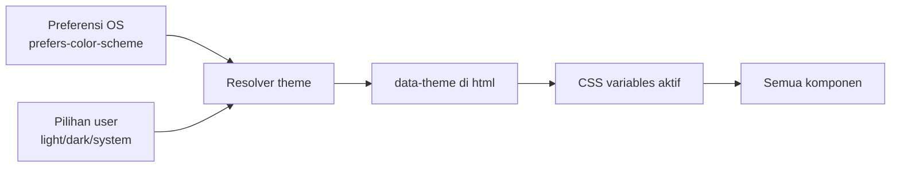
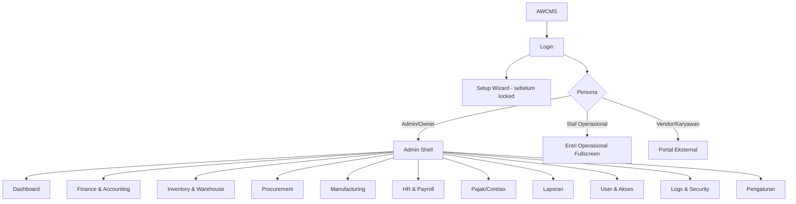
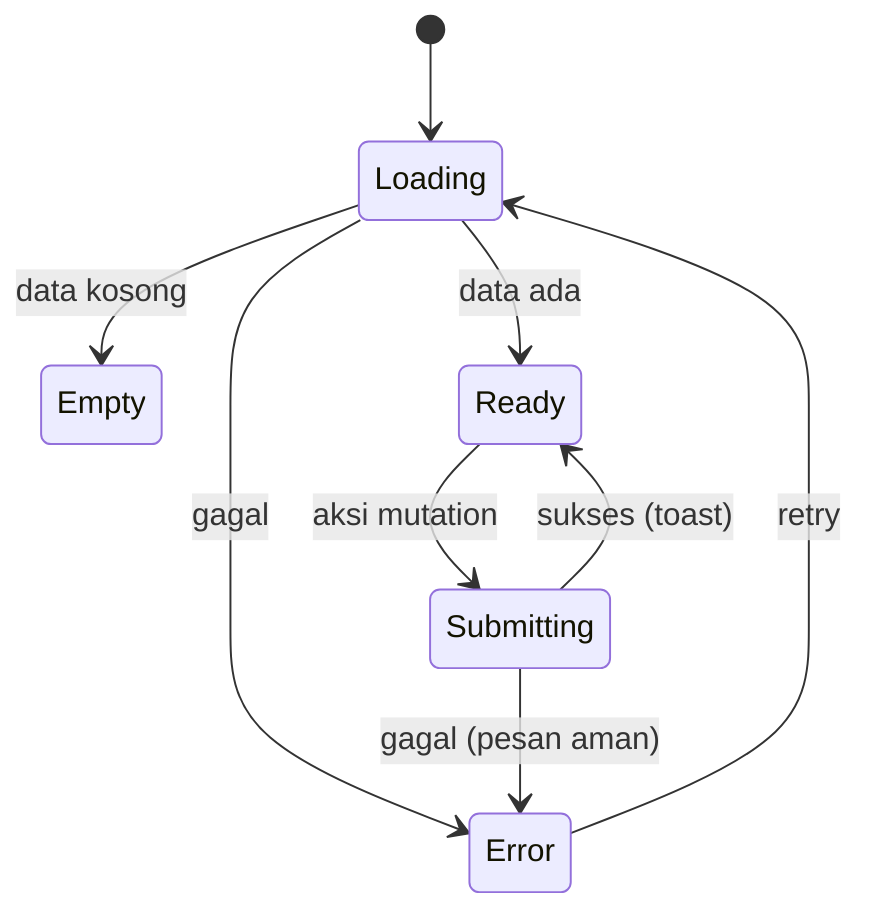
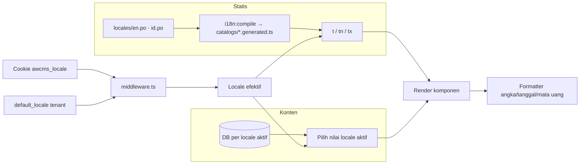

🇮🇩 Bahasa Indonesia · 🇬🇧 [English (source)](14_ui_ux_design_system.md)

<!-- i18n-source-hash: sha256:b92bbb62fff35d20342b911957133372d8a5ac4b592111e92a8152f1ed9fa34c -->

# Bagian 14 — UI/UX Design System dan Spesifikasi Layar

> **Status dokumen (2026-09-02):** **Belum ada kode modul ERP yang diimplementasikan** ([ADR-0001](../adr/0001-rebuild-on-awcms-foundation-erp-scope.md)) — layar ledger/purchase-order/payroll di bawah tetap arsitektur target. Segala yang bukan khusus-ERP **hidup di repo ini dan menjelaskan kode yang berjalan**: design token, admin shell dan pita header-nya, kelima layar auth, state pattern, theming, dan i18n. Dua bagian ditandai di tempat mereka menyimpang — masih belum ada component library `src/components/ui` (layar memakai kelas CSS bersama), dan peta error-code klien yang dijelaskan di bagian i18n tidak ada. Bagian yang menulis "rencana" memang berarti rencana; yang tidak, tidak.

## Tujuan

Dokumen ini menetapkan kebutuhan **desain UI/UX** AWCMS yang akan melengkapi SOP operasional dan blueprint modul saat ditulis. Berisi design principle, design token, component library, information architecture, spesifikasi layar (wireframe), state pattern, aksesibilitas, i18n, dan theming — agar frontend ERP dapat diimplementasikan konsisten sejak modul pertama dibangun.

Terkait: `15_frontend_architecture_integration.md` (arsitektur & wiring), dokumen SOP operasional (menyusul). Skill penegaknya: **`awcms-ui-screen`** (membangun layar) dan **`awcms-ux-review`** (mengauditnya), keduanya di `.claude/skills/`.

## Prinsip desain UI/UX

1. **Offline-first terlihat** — status koneksi & sync selalu jelas; aksi tetap bisa saat offline (mis. input stok gudang tanpa koneksi LAN).
2. **Keyboard-first untuk operator entri tinggi-volume** — semua aksi entri jurnal/kasir gudang/hitung stok dapat tanpa mouse.
3. **Role-aware** — navigasi & aksi menyesuaikan permission (bukan kontrol utama; backend tetap validasi RBAC/ABAC).
4. **State eksplisit** — setiap layar punya loading, empty, error, dan success state.
5. **Aman** — tidak menampilkan data sensitif penuh (gaji, rekening, NPWP); mengikuti aturan masking data.
6. **Aksesibel** — target WCAG 2.1 AA, kontras cukup, fokus terlihat, navigasi keyboard.
7. **Responsif** — admin/back-office desktop-first, entri lapangan (gudang/produksi) fullscreen-tablet, portal vendor/karyawan mobile-first.
8. **Konsisten** — semua layar memakai token & komponen yang sama lintas modul ERP (finance, inventory, procurement, manufacturing, HR/payroll).

## Design tokens

Token diimplementasikan sebagai CSS custom properties, di-scope ke `:root` dan override via `:root[data-theme="dark"]`. Nilai berikut adalah **placeholder brand-neutral** yang boleh diganti brand tenant.

### Warna semantik

| Token                      | Terang    | Gelap     | Fungsi                                     |
| -------------------------- | --------- | --------- | ------------------------------------------ |
| `--color-bg`               | `#f5f7fa` | `#0d1117` | Latar aplikasi                             |
| `--color-surface`          | `#ffffff` | `#151b23` | Kartu/panel                                |
| `--color-surface-2`        | `#eef1f5` | `#1c232c` | Panel sekunder, chip                       |
| `--color-surface-3`        | `#f7f9fc` | `#11171e` | Permukaan recessed: `<thead>`, isian input |
| `--color-border`           | `#dde3ea` | `#2a323c` | Garis/pemisah dekoratif                    |
| `--color-border-soft`      | `#e8edf3` | `#232a33` | Garis internal (baris tabel/panel)         |
| `--color-border-strong`    | `#858b92` | `#656d77` | Batas kontrol (WCAG 1.4.11)                |
| `--color-text`             | `#141a21` | `#e6edf3` | Teks utama                                 |
| `--color-text-muted`       | `#5b6672` | `#9aa7b2` | Teks sekunder                              |
| `--color-text-faint`       | `#646f7a` | `#808a95` | Label kolom, timestamp, hint               |
| `--color-primary`          | `#2563eb` | `#3b82f6` | Aksi utama                                 |
| `--color-primary-contrast` | `#ffffff` | `#ffffff` | Teks di atas primary                       |
| `--color-success`          | `#12873d` | `#3fbf6b` | Sukses/posted                              |
| `--color-warning`          | `#b45309` | `#e0a13a` | Peringatan/ditahan/menunggu approval       |
| `--color-danger`           | `#dc2626` | `#f26a6a` | Error/saldo tidak cukup                    |
| `--color-info`             | `#0e7490` | `#3cb8cf` | Info/sinkronisasi                          |
| `--color-focus`            | `#2563eb` | `#60a5fa` | Cincin fokus                               |
| `--color-primary-strong`   | `#2563eb` | `#3472d8` | Fill solid + teks putih                    |
| `--color-success-strong`   | `#12873d` | `#178841` | Fill solid + teks putih                    |
| `--color-danger-strong`    | `#dc2626` | `#d73d3d` | Fill solid + teks putih                    |
| `--color-info-strong`      | `#0e7490` | `#0e7490` | Fill solid + teks putih                    |
| `--color-primary-soft`     | `#e8effc` | `#16233b` | Latar bertint untuk sebuah state           |
| `--color-success-soft`     | `#e4f5ea` | `#12301d` | Latar bertint untuk sebuah state           |
| `--color-warning-soft`     | `#fdf1de` | `#2e2312` | Latar bertint untuk sebuah state           |
| `--color-danger-soft`      | `#fdeaea` | `#331818` | Latar bertint untuk sebuah state           |
| `--color-info-soft`        | `#e0f2f6` | `#0f2a30` | Latar bertint untuk sebuah state           |
| `--color-primary-on-soft`  | `#1d4ed8` | `#60a5fa` | Teks di atas `--color-primary-soft`        |
| `--color-success-on-soft`  | `#0f7434` | `#3fbf6b` | Teks di atas `--color-success-soft`        |
| `--color-warning-on-soft`  | `#9a4507` | `#e0a13a` | Teks di atas `--color-warning-soft`        |
| `--color-danger-on-soft`   | `#c81e1e` | `#f26a6a` | Teks di atas `--color-danger-soft`         |
| `--color-info-on-soft`     | `#0b6076` | `#3cb8cf` | Teks di atas `--color-info-soft`           |

> **Satu hue, tiga peran ([ADR-0120](../adr/0120-the-admin-redesign-splits-one-hue-into-three-roles.id.md)).** Sebuah warna semantik memikul sampai tiga nilai, karena aritmetika kontrasnya berbeda menurut latar yang memuatnya:
>
> | Keluarga    | Pekerjaan                                      | Dipakai oleh                       |
> | ----------- | ---------------------------------------------- | ---------------------------------- |
> | `--color-X` | teks/ikon/border di atas `--color-surface`     | tautan; `.btn-danger` bergaris     |
> | `-strong`   | fill solid di bawah `--color-primary-contrast` | `.btn-primary`; disk avatar topbar |
> | `-on-soft`  | teks di atas `--color-X-soft`                  | chip status; tautan sidebar aktif  |
>
> Memakai satu dari tiga yang salah adalah cacat UI paling berulang dalam sejarah repo ini — Issue #434, PR #720, dan dua kali lagi selama redesign ADR-0120. **Ia bukan lagi soal mengingat.** `bun run design:token-contrast:check` (bagian dari `bun run check`) mengukur registry berisi 33 pasangan di kedua tema dan gagal di bawah WCAG 2.1 AA. Menambah pasangan di CSS berarti menambah baris di registry itu.
>
> `--color-border` vs `--color-border-strong` adalah pembelahan yang sama diterapkan pada garis. WCAG 2.1 **1.4.11 Non-text Contrast** menuntut 3:1 untuk batas yang mengidentifikasi komponen yang bisa dioperasikan; `--color-border` mengukur 1.29:1 dan sengaja tetap begitu, sebab 1.4.11 mengatur kontrol, bukan pemisah dekoratif. Input, select, textarea, dan shell pencarian memakai `--color-border-strong`; tepi kartu dan garis tabel memakai `--color-border`.

### Token sidebar (selalu gelap — awcms-one#170)

Rel sidebar admin adalah keluarga warna KEEMPAT, `--color-sidebar-*`, sengaja independen dari `data-theme`: ia merender satu permukaan navigasi gelap baik admin sedang bertema terang maupun gelap, sehingga tidak berpindah antara `:root` dan `:root[data-theme="dark"]` seperti setiap token di atas (kedua blok mendeklarasikan nilai yang SAMA — lihat komentar `tokens.css` sendiri untuk alasan ini dinyatakan eksplisit, bukan dibiarkan mewarisi).

| Token                         | Nilai     | Fungsi                                                            |
| ----------------------------- | --------- | ----------------------------------------------------------------- |
| `--color-sidebar-bg`          | `#101722` | Latar rel                                                         |
| `--color-sidebar-surface`     | `#1a222e` | Blok terangkat di rel (kartu status)                              |
| `--color-sidebar-border`      | `#1f2733` | Garis batas luar rel                                              |
| `--color-sidebar-card-border` | `#2a323c` | Batas blok terangkat di rel                                       |
| `--color-sidebar-text`        | `#9aa7b2` | Teks item navigasi di atas `--color-sidebar-bg`                   |
| `--color-sidebar-text-strong` | `#f0f4f9` | Wordmark brand, teks item navigasi aktif                          |
| `--color-sidebar-text-faint`  | `#838d99` | Label grup — lihat di bawah alasan ini bukan nilai literal mockup |
| `--color-sidebar-active`      | `#1e2836` | Latar item navigasi aktif                                         |
| `--color-sidebar-badge`       | `#2b3444` | Latar badge hitungan                                              |

`--color-sidebar-text-faint` **bukan** nilai literal referensi redesign `#6b7581`: diukur terhadap kedua permukaan yang benar-benar memuatnya, nilai itu 3.84:1 di `--color-sidebar-bg` dan 3.42:1 di `--color-sidebar-surface`, di bawah ambang 4.5:1 WCAG 2.1 AA yang sudah dijanjikan halaman ini — label grup uppercase yang diwarnainya membawa informasi, bukan dekorasi. `#838d99` mempertahankan hue biru-abu yang sama dan lolos keduanya (5.34:1 / 4.75:1), koreksi yang sama yang sudah dilakukan sistem desain ini untuk keluarga token yang sadar-tema di atas.

### Skala lain

| Kategori    | Token                                  | Nilai                                                |
| ----------- | -------------------------------------- | ---------------------------------------------------- |
| Font family | `--font-sans`                          | Public Sans (di-host sendiri), system-ui, sans-serif |
| Font mono   | `--font-mono`                          | JetBrains Mono (di-host sendiri), ui-monospace       |
| Font size   | `--fs-2xs..3xl`                        | 11 · 12 · 14 · 16 · 18 · 20 · 24 · 32 · 40 px        |
| Spacing     | `--sp-1..8`                            | 4 · 8 · 12 · 16 · 24 · 32 · 48 · 64 px               |
| Radius      | `--radius-sm/md/lg/full`               | 4 · 8 · 12 · 9999 px                                 |
| Shadow      | `--shadow-sm/md/lg`                    | elevasi kartu/dialog                                 |
| Z-index     | `--z-nav/drawer/dropdown/dialog/toast` | 100 · 150 · 200 · 300 · 400                          |
| Breakpoint  | `sm/md/lg/xl`                          | 640 · 768 · 1024 · 1280 px                           |

> **Typeface-nya di-host sendiri, dan itu tuntutan CSP, bukan preferensi.** Kebijakan `default-src 'self'` repo ini tidak menyebut `font-src` maupun `style-src`, jadi keduanya jatuh ke sana dan `fonts.googleapis.com`/`fonts.gstatic.com` diblokir tanpa error yang terlihat di halaman. Lima subset `woff2` latin/latin-ext hidup di `public/fonts/` (104.004 B), ber-`unicode-range`, dan diukur terhadap `FONT_BUDGET_BYTES` sendiri di `scripts/client-asset-budget.ts`. Halaman konten publik tidak memuat satu pun — `css/public-content.css` tidak mendeklarasikan `@font-face`. Stack sistem tetap di belakangnya dan itulah yang merender selama `font-display: swap` dan pada deployment LAN/offline yang berkas font-nya gagal.

### Theming



Aturan yang direncanakan: default `system`; pilihan personal per-browser disimpan di localStorage (selalu menang bila ada) dengan fallback ke preferensi tenant `awcms_tenants.default_theme` (dapat diubah admin di `/admin/settings`) untuk browser yang belum pernah memilih; `data-theme` di-set pada `<html>` sebelum paint untuk mencegah flash.

### Motion & animasi

Sistem motion ada di `src/styles/motion.css` (di-import global): token durasi `--motion-instant/fast/base/slow` (80/140/240/400ms) + easing `--ease-standard/out/in/spring`, keyframe berprefiks `awcms-` (`awcms-fade-in`, `awcms-fade-in-up`, `awcms-scale-in`, `awcms-slide-in-left`, dst.), dan utility class pasangannya (`.fade-in-up`, `.scale-in`, `.hover-lift`, `.transition-base`, `.skeleton`). Animasi = micro-interaction: halus, cepat, memperjelas perubahan state — bukan pertunjukan.

Aturan:

- **`prefers-reduced-motion: reduce` WAJIB dihormati** — `motion.css` sudah menetralkan utility motion-nya di blok reduced-motion. Blok itu menyasar utility class-nya (bukan `*`), jadi animasi baru yang **scoped** ke satu halaman/komponen harus menyertakan guard reduced-motion lokal sendiri.
- **Tanpa layout shift** — animasikan hanya `opacity`/`transform`/warna/`box-shadow`, bukan `width`/`height`/`top`/`left`.
- **Entrance konten utama yang sudah tampil saat SSR sebaiknya `transform`-saja (mis. `translateY`), bukan dari `opacity: 0`.** Scan axe-core dapat membaca teks setengah-transparan di tengah animasi sebagai pelanggaran kontras bila kebetulan men-scan sebelum animasi selesai. Kartu login (`login.astro`) memakai `@keyframes auth-card-rise` (translateY-only) sebagai contoh kanonis. Fade `opacity:0` (mis. utility `.fade-in-up`) tetap pas untuk elemen yang di-reveal **setelah** load (banner/dialog pasca-aksi) atau elemen sekunder — hindari hanya untuk konten teks utama layar auth/entry.

## Component library

Komponen dasar direncanakan di `src/components/ui`, dipakai lintas persona dan lintas modul ERP.

| Komponen                                  | Catatan penting                                                                                                                                                                                                                                                                                                                                                                                                                                                                                                                                                                                                                                                                                                                                                                                                                                                                                                                                                                                                                                                                                                                                                                                                                                                                                                                                                                                                                                                                                                                                                                                                                                                                                                                                                                                                                                                                                                                                                                                                                                                                                                                                                                                                                                                                                                                                                                                                                                                                                                                                                                                          |
| ----------------------------------------- | -------------------------------------------------------------------------------------------------------------------------------------------------------------------------------------------------------------------------------------------------------------------------------------------------------------------------------------------------------------------------------------------------------------------------------------------------------------------------------------------------------------------------------------------------------------------------------------------------------------------------------------------------------------------------------------------------------------------------------------------------------------------------------------------------------------------------------------------------------------------------------------------------------------------------------------------------------------------------------------------------------------------------------------------------------------------------------------------------------------------------------------------------------------------------------------------------------------------------------------------------------------------------------------------------------------------------------------------------------------------------------------------------------------------------------------------------------------------------------------------------------------------------------------------------------------------------------------------------------------------------------------------------------------------------------------------------------------------------------------------------------------------------------------------------------------------------------------------------------------------------------------------------------------------------------------------------------------------------------------------------------------------------------------------------------------------------------------------------------------------------------------------------------------------------------------------------------------------------------------------------------------------------------------------------------------------------------------------------------------------------------------------------------------------------------------------------------------------------------------------------------------------------------------------------------------------------------------------------------- |
| Button                                    | varian primary/secondary/ghost/danger; state loading & disabled                                                                                                                                                                                                                                                                                                                                                                                                                                                                                                                                                                                                                                                                                                                                                                                                                                                                                                                                                                                                                                                                                                                                                                                                                                                                                                                                                                                                                                                                                                                                                                                                                                                                                                                                                                                                                                                                                                                                                                                                                                                                                                                                                                                                                                                                                                                                                                                                                                                                                                                                          |
| Input / NumberInput                       | label, hint, error; NumberInput untuk qty/harga/nominal jurnal (mono)                                                                                                                                                                                                                                                                                                                                                                                                                                                                                                                                                                                                                                                                                                                                                                                                                                                                                                                                                                                                                                                                                                                                                                                                                                                                                                                                                                                                                                                                                                                                                                                                                                                                                                                                                                                                                                                                                                                                                                                                                                                                                                                                                                                                                                                                                                                                                                                                                                                                                                                                    |
| Select / Combobox                         | Combobox mendukung search akun/produk/vendor/karyawan                                                                                                                                                                                                                                                                                                                                                                                                                                                                                                                                                                                                                                                                                                                                                                                                                                                                                                                                                                                                                                                                                                                                                                                                                                                                                                                                                                                                                                                                                                                                                                                                                                                                                                                                                                                                                                                                                                                                                                                                                                                                                                                                                                                                                                                                                                                                                                                                                                                                                                                                                    |
| Checkbox / Radio / Switch                 | switch untuk consent & feature toggle                                                                                                                                                                                                                                                                                                                                                                                                                                                                                                                                                                                                                                                                                                                                                                                                                                                                                                                                                                                                                                                                                                                                                                                                                                                                                                                                                                                                                                                                                                                                                                                                                                                                                                                                                                                                                                                                                                                                                                                                                                                                                                                                                                                                                                                                                                                                                                                                                                                                                                                                                                    |
| Dialog / Drawer                           | fokus terperangkap, `Esc` menutup — `<dialog>` native yang dibuka `showModal()`, yang memasok focus trap, Esc-to-close, inert-nya halaman, backdrop, dan pengembalian fokus tanpa satu baris script pun. **Command palette** (`src/lib/ui/admin-command-palette.ts`, ADR-0120) adalah contoh kerja pertama; `ConfirmDialog` dan `ReasonPanel` (ADR-0125, §Dialog konfirmasi / panel alasan / save bar pengaturan di bawah) adalah contoh kedua dan ketiga, menggantikan `window.confirm()`/`window.prompt()` di setiap layar admin yang cocok dengan bentuknya. Sidebar admin sendiri (drawer mobile) BUKAN `<dialog>` — tetap `<nav>` statis di desktop, focus trap-nya ditulis manual.                                                                                                                                                                                                                                                                                                                                                                                                                                                                                                                                                                                                                                                                                                                                                                                                                                                                                                                                                                                                                                                                                                                                                                                                                                                                                                                                                                                                                                                                                                                                                                                                                                                                                                                                                                                                                                                                                                                 |
| Toast                                     | sukses/error/info; non-blocking                                                                                                                                                                                                                                                                                                                                                                                                                                                                                                                                                                                                                                                                                                                                                                                                                                                                                                                                                                                                                                                                                                                                                                                                                                                                                                                                                                                                                                                                                                                                                                                                                                                                                                                                                                                                                                                                                                                                                                                                                                                                                                                                                                                                                                                                                                                                                                                                                                                                                                                                                                          |
| Table / DataGrid                          | sort, pagination keyset, kolom sticky, row density — dipakai untuk daftar entri jurnal, purchase order, stock adjustment, payroll run; shell scroll-container + `<caption>` aksesibel + empty-row standar; row rendering (badge, form, tombol per baris) tetap tanggung jawab pemanggil                                                                                                                                                                                                                                                                                                                                                                                                                                                                                                                                                                                                                                                                                                                                                                                                                                                                                                                                                                                                                                                                                                                                                                                                                                                                                                                                                                                                                                                                                                                                                                                                                                                                                                                                                                                                                                                                                                                                                                                                                                                                                                                                                                                                                                                                                                                  |
| Badge / StatusPill                        | status lifecycle (draft/pending approval/posted/rejected/void/quarantine) berkode warna — tone `success/warning/danger/info/neutral/primary`. Sejak [ADR-0120](../adr/0120-the-admin-redesign-splits-one-hue-into-three-roles.id.md) class-nya adalah badge **tint**: isian `--color-X-soft` dengan teks `--color-X-on-soft`. Pakai `-strong` + teks putih hanya bila badge-nya isian solid. `.admin-status-pill` (ditambahkan PR #813) adalah SATU-SATUNYA class status-pill di codebase — pasangan lama `.status-badge`/`.status-dot` yang digantikannya dipensiunkan di seluruh repo oleh Issue #866 (`admin-ui-parity-matrix.md` §7 wave 7); setiap layar admin dengan status lifecycle merender `<span class="admin-status-pill" data-tone="…">` + `<span class="admin-status-pill-dot" aria-hidden="true" />`, `data-tone` bukan `data-variant`. `/admin/media` (kedua kolom status), `/admin/account` (status SSO tersambung/sesi-saat-ini/dua-faktor) dan `/admin/access-policies` (verdict Allow/Deny simulator, dibangun di sisi klien dari atribut `data-verdict-*` yang sudah diterjemahkan) bermigrasi ke sana pada Issue #864, wave 5                                                                                                                                                                                                                                                                                                                                                                                                                                                                                                                                                                                                                                                                                                                                                                                                                                                                                                                                                                                                                                                                                                                                                                                                                                                                                                                                                                                                                                                      |
| SegmentedControl                          | `.admin-segmented` (ditambahkan PR #813; konsumen nyata pertama Issue #862): `.admin-segmented-option` di dalamnya. Untuk filter benar-benar saling eksklusif yang merupakan NAVIGASI halaman nyata (`<a href>` biasa per opsi, bukan pergantian panel JS), render `<nav class="admin-segmented" aria-label=…>` dan tandai opsi aktif dengan `aria-current="page"` (filter status `comments.astro`) — jangan pernah `role="tablist"`/`role="tab"` pada tautan, karena itu menjanjikan fokus bergulir tombol panah dan panel tab yang tidak dimiliki tautan halaman. `aria-selected="true"` juga diberi gaya, untuk grup tab/radio dalam halaman yang benar-benar berperilaku demikian. Filternya tetap bekerja tanpa JavaScript. Jangan pakai ini bila kontrolnya berbasis `<select>` (tanpa semantik tab) — lihat pembedaan `.filter-bar`/`.admin-filter-form` §4 [`admin-ui-parity-matrix.md`](admin-ui-parity-matrix.md)                                                                                                                                                                                                                                                                                                                                                                                                                                                                                                                                                                                                                                                                                                                                                                                                                                                                                                                                                                                                                                                                                                                                                                                                                                                                                                                                                                                                                                                                                                                                                                                                                                                                              |
| BulkActionBar                             | `.admin-bulk-bar` (ditambahkan PR #813; konsumen nyata pertama Issue #862, `comments.astro`): muncul di atas tabel begitu `.admin-bulk-bar-count` (region `aria-live="polite"`) melaporkan minimal satu baris terpilih lewat checkbox pilih-semua di header + checkbox per baris, dengan `.admin-bulk-bar-actions` menampung tombol aksi. Hanya adopsi ini bila endpoint bulk yang sudah ABAC-guarded dan ber-`Idempotency-Key` benar-benar ada dan terbatas (ADR-0041) — jangan pernah membangun satu hanya untuk membenarkan bar-nya (`admin-ui-parity-matrix.md` §5). Setiap string yang ditampilkan skrip klien bar dibaca dari atribut `data-*` yang di-render server sudah diterjemahkan, tak pernah literal dalam skrip, karena skrip klien tak bisa mengimpor katalog i18n (modul server-only) — lihat `src/lib/ui/admin-bulk-bar-client.ts`                                                                                                                                                                                                                                                                                                                                                                                                                                                                                                                                                                                                                                                                                                                                                                                                                                                                                                                                                                                                                                                                                                                                                                                                                                                                                                                                                                                                                                                                                                                                                                                                                                                                                                                                                     |
| StatCard / KPI tile                       | `.admin-stat-card` (ditambahkan PR #813): `.admin-stat-card-label`/`-value`/`-caption`, ditambah pembungkus responsif opsional `.admin-stat-card-grid` (berbagi breakpoint dengan `.kpi-grid`/`.dashboard-grid`), modifier `.admin-stat-card-value--mono` untuk nilai bertipe identifier, baris `.admin-stat-card-head` untuk ikon `.admin-tile`, dan modifier delta bertanda `.admin-stat-card-delta[data-tone="positive"\|"negative"]`. `.admin-stat-card` adalah SATU-SATUNYA class KPI tile di codebase — keluarga lama `.stat-card`/`.stat-grid`/`.stat-label`/`.stat-value`/`.stat-hint`/`.stat-head`/`.stat-delta` yang digantikannya dipensiunkan di seluruh repo oleh Issue #866 (`admin-ui-parity-matrix.md` §7 wave 7). Modifier delta hanya membawa warna; **konsumen** wajib menulis karakter awalan "+"/"-"/"±" ke dalam teks nilainya sendiri dan memasangkan kata terjemahan tersembunyi-visual, sehingga tanda tidak pernah disampaikan lewat warna saja (WCAG 1.4.1). Setiap layar admin dengan tile KPI — `/admin`, `/admin/analytics`, `/admin/reporting`, `/admin/omes/*`, `/admin/media`, `/admin/data-lifecycle`, `/admin/site-search`, `/admin/idn-regions`, `/admin/tenants`, `/admin/sync`, `/admin/push-notifications`, `/admin/domain-events` — merender `.admin-stat-card` saja, per [`admin-ui-parity-matrix.md`](admin-ui-parity-matrix.md) §4/§7 wave 2–7                                                                                                                                                                                                                                                                                                                                                                                                                                                                                                                                                                                                                                                                                                                                                                                                                                                                                                                                                                                                                                                                                                                                                                                                                |
| Timeline                                  | `.admin-timeline` (ditambahkan PR #813, pertama kali DIKONSUMSI oleh Issue #863, gelombang 4 admin-ui-parity-matrix): `<ol class="admin-timeline">` semantik sungguhan berisi `<li class="admin-timeline-item">`, masing-masing memuat `.admin-timeline-label` + `.admin-timeline-meta` — tidak pernah berupa list `<div>` yang hanya untuk styling, sehingga assistive tech melaporkan "N item" dan posisi masing-masing. Cadangkan untuk data event/history yang benar-benar TERURUT (log keputusan sebuah instance, history sebuah legal hold sendiri, run rebuild sebuah projection) — tabel "satu baris terbaru per entitas" (mis. ringkasan tenant-wide OMES health) bukan history dan tetap `.data-table`. Baris meta tiap item membawa `<time datetime>` sungguhan (string ISO, tidak pernah placeholder "—" milik halaman), dan status apa pun di dalam item memakai `.admin-status-pill`, bukan warna/posisi saja. `.admin-timeline` sendiri hanya mereset `list-style`/margin/padding untuk `<ol>`-nya — ia tidak membawa penomoran atau bullet sendiri; garis penghubung dan dot berasal dari border-kiri + `::before` milik `.admin-timeline-item` sendiri. Lihat [`admin-ui-parity-matrix.md`](admin-ui-parity-matrix.md) §6.4/§7 gelombang 4 untuk layar yang sudah dikerjakan.                                                                                                                                                                                                                                                                                                                                                                                                                                                                                                                                                                                                                                                                                                                                                                                                                                                                                                                                                                                                                                                                                                                                                                                                                                                                                                           |
| MediaGrid                                 | `.admin-media-grid` (ditambahkan PR #813): pembungkus `grid-template-columns: repeat(auto-fill, minmax(150px, 1fr))` di sekitar tile persegi `.admin-media-grid-tile[data-selected]`, masing-masing diharapkan berisi `` yang mengisi tile lewat `object-fit: cover`. **Aturan pemakaian (Issue #864):** hanya adopsi bila layar itu sudah menampilkan grid thumbnail sungguhan — jangan pernah menambahkan `` ke tabel data hanya demi memakai class ini. Registri objek `/admin/media` dengan sengaja tidak merender `` sama sekali (sebuah baris bisa berstatus `pending_upload`/`failed`, dan menampilkan ulang gambar yang melanggar kebijakan kepada operator yang sedang menghapusnya adalah hasil yang salah — lihat komentar header berkas itu sendiri), sehingga ia tetap `.data-table` dengan `.admin-stat-card`/`.admin-status-pill` saja; memaksakan grid di sana akan membalikkan keputusan keamanan yang sudah terdokumentasi, bukan mendandaninya ulang. **Konsumen nyatanya (Issue #872, tindak lanjut #864):** pemilih media bersama (`src/lib/ui/media-picker-client.ts`), dirender dari `/admin/blog`, `/admin/blog-ads` dan `/admin/site-profile` — `/admin/blog-homepage` hanya menyebut pemilih ini dalam komentar dokumentasi yang menjelaskan mengapa layar itu SENGAJA tidak memakainya (field `gallery_block`-nya adalah daftar id berurutan, bukan kontrol pilih-satu). Setiap `.media-picker-panel` kini membawa `admin-media-grid`, dan setiap thumbnail yang dibangun `wireMediaPickers` adalah `.admin-media-grid-tile` sungguhan — `aria-pressed`/`data-selected` menandai tile yang cocok dengan nilai field saat ini (tidak pernah warna/outline saja, WCAG 1.4.1). Karena `` tile mengisi penuh tile itu, label yang dapat dibaca manusia dari pemilih (`describePickableMedia`: alt text, lalu caption, lalu nama berkas) berpindah menjadi overlay `.media-option-caption` (`src/styles/admin-screens.css`) alih-alih baris di bawah gambar, dan teks yang sama itu menjadi nama aksesibel tombol tile — tanpa `aria-label` terpisah. CSS grid/box duplikat milik pemilih sendiri (`display: grid` + `grid-template-columns` pada `.media-picker-panel`, gaya kotak/warna yang dulu diulang `.media-option`) sudah dihapus dari `admin-screens.css` sekarang primitive-nya yang menyediakan keduanya. Keterangan duduk di atas `--color-media-scrim` dengan teks `--color-on-media-scrim` — token yang tidak bergantung tema (bukan `--color-overlay`, yang nilai tema terangnya terlalu tembus pandang untuk teks putih di atas gambar putih) |
| ArchiveFilter                             | toggle/filter `aktif`, `arsip`, `semua` untuk role berizin                                                                                                                                                                                                                                                                                                                                                                                                                                                                                                                                                                                                                                                                                                                                                                                                                                                                                                                                                                                                                                                                                                                                                                                                                                                                                                                                                                                                                                                                                                                                                                                                                                                                                                                                                                                                                                                                                                                                                                                                                                                                                                                                                                                                                                                                                                                                                                                                                                                                                                                                               |
| Card / Panel                              | kontainer konten                                                                                                                                                                                                                                                                                                                                                                                                                                                                                                                                                                                                                                                                                                                                                                                                                                                                                                                                                                                                                                                                                                                                                                                                                                                                                                                                                                                                                                                                                                                                                                                                                                                                                                                                                                                                                                                                                                                                                                                                                                                                                                                                                                                                                                                                                                                                                                                                                                                                                                                                                                                         |
| FormField                                 | membungkus label+input+error konsisten — wrapper label/hint/error dengan slot default untuk kontrol asli (caller tetap mengatur `type`/`name`/`required`)                                                                                                                                                                                                                                                                                                                                                                                                                                                                                                                                                                                                                                                                                                                                                                                                                                                                                                                                                                                                                                                                                                                                                                                                                                                                                                                                                                                                                                                                                                                                                                                                                                                                                                                                                                                                                                                                                                                                                                                                                                                                                                                                                                                                                                                                                                                                                                                                                                                |
| Tabs                                      | detail entity (akun, purchase order, produk, karyawan)                                                                                                                                                                                                                                                                                                                                                                                                                                                                                                                                                                                                                                                                                                                                                                                                                                                                                                                                                                                                                                                                                                                                                                                                                                                                                                                                                                                                                                                                                                                                                                                                                                                                                                                                                                                                                                                                                                                                                                                                                                                                                                                                                                                                                                                                                                                                                                                                                                                                                                                                                   |
| Pagination                                | keyset (next/prev), bukan offset besar — dua tombol prev/next yang men-dispatch `CustomEvent("awcms:paginate")`                                                                                                                                                                                                                                                                                                                                                                                                                                                                                                                                                                                                                                                                                                                                                                                                                                                                                                                                                                                                                                                                                                                                                                                                                                                                                                                                                                                                                                                                                                                                                                                                                                                                                                                                                                                                                                                                                                                                                                                                                                                                                                                                                                                                                                                                                                                                                                                                                                                                                          |
| `FilterBar`                               | toolbar kontainer untuk kontrol filter list (`role="search"` + label wajib); tidak menangani logic filter itu sendiri — tetap tanggung jawab halaman, sama seperti `DataTable`                                                                                                                                                                                                                                                                                                                                                                                                                                                                                                                                                                                                                                                                                                                                                                                                                                                                                                                                                                                                                                                                                                                                                                                                                                                                                                                                                                                                                                                                                                                                                                                                                                                                                                                                                                                                                                                                                                                                                                                                                                                                                                                                                                                                                                                                                                                                                                                                                           |
| `ActionBanner`                            | banner feedback sukses/error pasca-mutation (`role="alert"`); dipakai konsisten oleh `showBanner()` di helper klien admin (lihat doc 15) tanpa duplikasi manual per layar                                                                                                                                                                                                                                                                                                                                                                                                                                                                                                                                                                                                                                                                                                                                                                                                                                                                                                                                                                                                                                                                                                                                                                                                                                                                                                                                                                                                                                                                                                                                                                                                                                                                                                                                                                                                                                                                                                                                                                                                                                                                                                                                                                                                                                                                                                                                                                                                                                |
| SearchBar                                 | debounce, hasil cepat (target <300ms)                                                                                                                                                                                                                                                                                                                                                                                                                                                                                                                                                                                                                                                                                                                                                                                                                                                                                                                                                                                                                                                                                                                                                                                                                                                                                                                                                                                                                                                                                                                                                                                                                                                                                                                                                                                                                                                                                                                                                                                                                                                                                                                                                                                                                                                                                                                                                                                                                                                                                                                                                                    |
| EmptyState / ErrorState / LoadingSkeleton | wajib untuk tiap list/detail                                                                                                                                                                                                                                                                                                                                                                                                                                                                                                                                                                                                                                                                                                                                                                                                                                                                                                                                                                                                                                                                                                                                                                                                                                                                                                                                                                                                                                                                                                                                                                                                                                                                                                                                                                                                                                                                                                                                                                                                                                                                                                                                                                                                                                                                                                                                                                                                                                                                                                                                                                             |
| KeyboardHint                              | menampilkan shortcut aktif di layar entri tinggi-volume (jurnal, penerimaan barang, stock opname)                                                                                                                                                                                                                                                                                                                                                                                                                                                                                                                                                                                                                                                                                                                                                                                                                                                                                                                                                                                                                                                                                                                                                                                                                                                                                                                                                                                                                                                                                                                                                                                                                                                                                                                                                                                                                                                                                                                                                                                                                                                                                                                                                                                                                                                                                                                                                                                                                                                                                                        |
| SyncIndicator / OfflineBanner             | status koneksi & antrean sync                                                                                                                                                                                                                                                                                                                                                                                                                                                                                                                                                                                                                                                                                                                                                                                                                                                                                                                                                                                                                                                                                                                                                                                                                                                                                                                                                                                                                                                                                                                                                                                                                                                                                                                                                                                                                                                                                                                                                                                                                                                                                                                                                                                                                                                                                                                                                                                                                                                                                                                                                                            |
| MoneyText / MaskedText                    | format IDR & masking data sensitif (gaji, rekening bank, NPWP)                                                                                                                                                                                                                                                                                                                                                                                                                                                                                                                                                                                                                                                                                                                                                                                                                                                                                                                                                                                                                                                                                                                                                                                                                                                                                                                                                                                                                                                                                                                                                                                                                                                                                                                                                                                                                                                                                                                                                                                                                                                                                                                                                                                                                                                                                                                                                                                                                                                                                                                                           |
| `StateNotice`                             | denied/error banner bersama; `kind="error"` menutup cabang Error state pattern di layar SSR (lihat §State pattern wajib)                                                                                                                                                                                                                                                                                                                                                                                                                                                                                                                                                                                                                                                                                                                                                                                                                                                                                                                                                                                                                                                                                                                                                                                                                                                                                                                                                                                                                                                                                                                                                                                                                                                                                                                                                                                                                                                                                                                                                                                                                                                                                                                                                                                                                                                                                                                                                                                                                                                                                 |

Helper klien non-visual `src/lib/ui/admin-form-client.ts` **ADA dan dipakai bersama oleh `<script>` tiap layar admin** untuk fetch + pesan + anti-double-submit. Permukaan sesungguhnya: `onSubmit`/`onSubmitAll`/`onAction`/`mutateAndReload` (perangkaian), `sendJson`/`sendJsonRequest`/`sendJsonForData` (permintaan), `lockElement` + `messageBox` (umpan balik), dan pembaca field `field`/`inputValue`/`blankToNull`/`checkboxChecked`/`integerValue`/`localDateTimeToInstant`. **Baca daftar ekspornya sebelum menulis kodenya** — `grep -n "^export" src/lib/ui/admin-form-client.ts` — karena revisi terdahulu dokumen ini menyebut pasangan `submitJson`/`showBanner` yang tidak pernah ada, dan beberapa skill masih menyuruh memanggil `postJson`, yang **dihapus 22 Agustus 2026** (PROJECT_STATE D12 — nol pemanggil, dengan docblock yang mengklaim sebaliknya).

Import dari modul ini wajib, bukan sekadar DRY: di bawah `default-src 'self'` Astro meng-inline `<script>` tanpa import lalu CSP memblokirnya diam-diam, sedangkan script yang meng-import dari modul ini dibundel ke `/_astro/*.js` eksternal yang diizinkan `'self'`.

### Migrasi bertahap layar besar (pola, bukan status)

Saat layar admin ERP besar (mis. entri jurnal, form purchase order multi-baris) diimplementasikan, ikuti pola atomic-per-issue yang terbukti di awcms-mini: bangun langsung dengan primitive di atas (`DataTable`, `StatusBadge`, `ActionBanner`, `FormField`, `ConfirmDialog`) alih-alih markup ad-hoc, dan migrasikan layar lama satu per satu bila ada — jangan redesign penuh sekaligus. Pola SSR-read-langsung/mutation-lewat-API (doc 15) tidak berubah oleh migrasi markup/CSS/script client.

### Dialog konfirmasi / panel alasan / save bar pengaturan (ADR-0125)

Tiga primitif admin v2, di-port dari build lokal `ahliweb/media-lenterakalteng`
sehingga setiap konsumen template ini mendapatkannya (Issue #854 bagian 1 dari
2 — PR terpisah menangani sapuan i18n raw-enum/`data-label` yang jadi bagian
2).

- **`ConfirmDialog`** (`src/components/ConfirmDialog.astro` +
  `src/lib/ui/confirm-dialog-client.ts`) menggantikan `window.confirm()`.
  Satu `<dialog id="confirm-dialog" role="alertdialog">`, dirender SEKALI
  oleh `AdminLayout.astro` — bukan per halaman. Skrip layar mengonversi satu
  titik panggil dalam satu baris:

  ```diff
  - if (!window.confirm(message)) return;
  + if (!(await confirmAction(message))) return;
  ```

  `confirmAction` (diimpor dari `../../lib/ui/confirm-dialog-client`) secara
  lazy menemukan dan menghubungkan dialog milik layout pada pemanggilan
  pertama lalu meng-cache hasilnya, sehingga tidak perlu panggilan setup.
  `showModal()` memasok focus trap, Escape, `::backdrop`, dan pengembalian
  fokus.

- **`SettingsSaveBar`** (`src/components/SettingsSaveBar.astro` +
  `src/lib/ui/settings-save-bar-client.ts`) adalah bar sticky untuk layar
  dengan tepat satu `<form>` pengaturan, dirender per halaman tepat setelah
  tag penutup form itu. Tombol Save/Reset-nya memakai
  `type="submit"/"reset" form="<id>"` dan bekerja **tanpa JavaScript sama
  sekali** — `initSettingsSaveBars()` hanya menambah toggle kelas dirty-state
  dan, opsional, penukaran teks status. Diadopsi di `/admin/site-profile`,
  `/admin/blog-settings`, dan `/admin/theming`. Karena tombol submit kini
  sengaja hidup DI LUAR `<form>`, `onSubmit()`/`submitContext()` di
  `admin-form-client.ts` mendapat fallback pencarian
  (`button[type="submit"][form="<id>"]`) di samping query keturunan-form
  aslinya.

- **`ReasonPanel`** (`src/components/ReasonPanel.astro` +
  `src/lib/ui/reason-panel-client.ts`) menggantikan `window.prompt()` untuk
  aksi yang endpoint-nya mencatat alasan (disable modul, suppress
  newsletter, hapus objek media, dan lainnya — lihat ADR-0125 untuk daftar
  lengkap, dan untuk titik yang sengaja dibiarkan sebagai `window.prompt()`
  karena tidak cocok dengan bentuk satu-endpoint/satu-field-wajib/reload-
  (atau submit-form-yang-ada-) saat-sukses milik ReasonPanel). Deklaratif:
  `data-reason-title`/`-action`/`-form`/`-field`/`-min-length`/`-max-length`/
  `-label`/`-danger`/`-idempotent` pada `<button type="button">` pembuka
  mana pun, dihubungkan dengan satu panggilan `initReasonPanel()` — tidak
  perlu handler khusus halaman.

Ketiganya hanya memakai token yang sudah ada (`src/styles/tokens.css`) —
fill gelap save bar memakai ulang
`--color-sidebar-bg`/`--color-sidebar-surface` alih-alih warna baru, karena
perannya sama seperti topbar/sidebar: "chrome gelap di atas kanvas terang".

## Information architecture (navigasi role-aware)



Item menu difilter oleh permission efektif user (RBAC/ABAC). Menu tanpa akses disembunyikan, tetapi endpoint tetap dilindungi ABAC.

## Layout shell

### Auth screen (login) — split panel, mobile-first

`src/pages/login.astro` adalah pola layar auth publik **kanonis** (UI/UX overhaul, Issue #166/#215; split panel ditambahkan [ADR-0120](../adr/0120-the-admin-redesign-splits-one-hue-into-three-roles.id.md)). **Kelima** layar auth publik — `login`, `register`, `forgot-password`, `reset-password`, `accept-invitation` — memakainya bersama: `<main class="auth">` adalah grid dua kolom pada ≥900px yang memuat `AuthBrandPanel.astro` dan `.auth-form-panel` yang membungkus `.auth-card`.

```text
┌──────────────────────────┬────────────────────────────┐
│ [A] AWCMS                │  [A]  AWCMS                │ ← .auth-brand
│                          │  Sign in                   │ ← .auth-title (h1)
│ Headline                 │  Welcome back. Sign in…    │ ← .auth-subtitle
│ Subline                  │  ┌───────────────────────┐ │
│ · chip · chip · chip     │  │ SIGNING IN TO         │ │ ← .auth-tenant-context
│                          │  │ <Tenant name>         │ │   (mode single-tenant)
│                          │  └───────────────────────┘ │
│                          │  Login identifier  [_____] │
│                          │  Password     [____] [Show]│ ← + toggle show/hide
│ host.example             │  [      Sign in         ]  │ ← .auth-submit (primary)
│                          │  Secured workspace access  │ ← .auth-foot
│  AuthBrandPanel          │                            │
│  aria-hidden="true"      │                            │
└──────────────────────────┴────────────────────────────┘
        ↑ hilang sepenuhnya di bawah 900px
```

Paruh brand itu **`aria-hidden="true"` dan tidak memuat informasi yang tidak ada juga di paruh form.** Ia dekorasi yang kebetulan besar; pembaca layar yang membacanya akan mengumumkan nama produk dua kali sebelum sampai ke field pertama. Di bawah 900px ia tidak dirender sama sekali alih-alih ditumpuk di atas kartu, karena orang yang datang untuk masuk lewat ponsel semestinya mencapai field pertama tanpa menggulir. Footer-nya mencetak `Astro.url.host`, jadi sebuah deployment mengidentifikasi dirinya sendiri tanpa nilai konfigurasi yang bisa melenceng dari URL yang benar-benar diketik orang.

Gradiennya memakai **warna literal, bukan token surface**, dengan sengaja: itu permukaan brand, bukan permukaan UI, dan ia harus tampak sama di kedua tema. Token `--color-*` berbalik mengikuti `data-theme`; panel brand yang ikut terbalik mengikuti preferensi OS akan menjadi brand yang berbeda saat malam.

Aturan pola (sudah diimplementasikan — ikuti, jangan regresi):

- **Kontrak DOM stabil** (jangan rename — script client + spec E2E `tests/e2e/login.e2e.ts` bergantung padanya): `#login-form`, `#tenant-id`, `#login-identifier`, `#password`, `#login-submit`, `#login-error`. Field tenant SELALU `id="tenant-id"` + `name="tenantId"` di ketiga bentuknya sehingga submit (`FormData`) tetap jalan dan header `X-AWCMS-Tenant-ID` tetap terkirim.
- **Field tenant adaptif** (`awcms_tenants` = tabel root RLS-free, dibaca SSR read-only tanpa konteks tenant, dibatasi `TENANT_PICKER_LIMIT`): 0 baris / error DB / > limit → input teks manual (kompatibel-mundur + hindari enumerasi tenant massal); tepat 1 → readout read-only "Signing in to <name>" (`.auth-tenant-context`) + `#tenant-id` hidden; 2..limit → `<select>` nama tenant (value = UUID). Merender nama tenant ke pengunjung tak terautentikasi saat count > 1 adalah keputusan produk yang diterima untuk base repo (query dibatasi + read-only).
- **Toggle show/hide password** di-wire di script MODUL yang di-bundle (bukan `onclick` inline — CSP `default-src 'self'` tanpa `'unsafe-inline'`), `aria-pressed` + `aria-label` yang berubah saat state berubah.
- **Select kustom**: caret digambar via CSS (`.auth-select::after`, trik border), bukan `data:` URI SVG — tetap CSP-safe; native `<select>` tetap dipakai.
- **Entrance kartu** `@keyframes auth-card-rise` = `transform`-saja (translateY), BUKAN utility `.fade-in-up` yang dari `opacity:0` (lihat §Motion — hindari flag kontras axe pada teks utama). Sertakan guard reduced-motion lokal.
- **CSP ketat (single-owner)**: `tokens.css`/`motion.css` + `<style>` scoped semua di-emit sebagai `<link>` eksternal same-origin (`build.inlineStylesheets: "never"`, `astro.config.mjs`); script login = modul yang di-bundle (bukan `is:inline`); satu-satunya `is:inline` `<script src>` adalah loader Cloudflare Turnstile, dan hanya saat `isTurnstileRequired()` (`src/lib/security/turnstile.ts`).
- **i18n**: string di kelima layar ini masih bahasa Inggris literal. Itu celah nyata yang tersisa, bukan rencana yang menunggu tooling — katalognya sudah ada (§Internationalization) dan `i18n:screens:check` mencakup `/admin/*`, bukan halaman auth publik, jadi tak ada yang mengukurnya. Menerjemahkannya berarti menambahkan kalimat-kalimatnya ke `locales/*.po` lalu membungkusnya; kerjakan sekali jalan per halaman, dan sebaiknya kelimanya sekaligus agar pilihan katanya konsisten.

### Admin shell (desktop-first, responsive drawer di bawah `--bp-md`)

```text
┌────────────────────────────────────────────────────────────────────┐
│ [☰] [A] AWCMS │ [🔍 Cari…          Ctrl K] │ [Tenant] [🌐] [◐] [👤] │
├──────────────────┬─────────────────────────────────────────────────┤
│ ▾ SECTION        │  AWCMS › Section › Layar         ← .admin-       │
│   Modul          │  Judul layar               [Aksi utama]          │
│   ▪ Layar        │  Satu baris deskripsi          ← page-actions    │
│   ▪ Layar ◄──────┼────────────────────────────────── satu garis ────│
│ ▾ SECTION        │  ┌───────────────────────────────────────────┐   │
│   ▪ Layar        │  │ Konten (list/detail/form)                 │   │
│                  │  │ LoadingSkeleton / EmptyState / StateNotice│   │
│ ─────────────    │  └───────────────────────────────────────────┘   │
│ [→] Keluar       │                                                  │
│ Versi v10.x      │                                                  │
└──────────────────┴─────────────────────────────────────────────────┘
```

**Shell yang memiliki judul halaman** ([ADR-0120](../adr/0120-the-admin-redesign-splits-one-hue-into-three-roles.id.md)). `AdminLayout.astro` merender seluruh pita `.admin-page-head` — breadcrumb, `<h1>`, deskripsi, dan slot `page-actions` untuk tombol utama milik layar. **Sebuah layar tidak boleh merender `<h1>`-nya sendiri atau `<header class="page-header">`-nya sendiri.** Sebelum ini, ke-45 layar semacam itu mencetak namanya dua kali, sekali dari prop `title` layout dan sekali dari headingnya sendiri — dan pada 20 di antaranya keduanya berbeda bahasa, karena prop-nya bahasa Inggris literal sementara heading-nya lewat `t()`.

- `title` (wajib) menjadi `<h1>` dan crumb terakhir.
- `description` (opsional) atau slot `page-description` mengisi baris di bawahnya; slot itu ada untuk layar yang deskripsinya memuat tautan atau `<code>`.
- `breadcrumb` (opsional) menimpa crumb tengah, yang selain itu **diturunkan** dari sidebar terkomposisi — `composeSidebarSections` sudah tahu entri mana yang aktif, dan meminta 45 halaman menyebut section-nya sendiri akan mengulang persis drift yang dulu disebabkan prop `active` yang sudah dihapus.

**Section sidebar bisa dilipat** lewat `<details open>`/`<summary>` — tanpa script, yang di bawah CSP ini jelas lebih baik, dan `<details>` membawa `aria-expanded` implisit, perilaku keyboard, dan semantik disclosure secara cuma-cuma. Status terbukanya sengaja **tidak** diingat: section yang kembali terlipat akan menyembunyikan layar dari orang yang tidak tahu ia bisa terlipat. Tiap tautan membawa ikon yang diresolusi dari `ModuleDescriptor.navigation[].icon`, dengan fallback tabel default berkunci `labelKey` (`sidebar-menu.ts`); data path-nya peta beku di `src/lib/ui/admin-icons.ts` dan nama tak dikenal merender titik netral alih-alih digemakan ke dalam atribut SVG.

**Command palette** (`Ctrl`/`⌘`+`K`, atau shell pencarian di topbar) adalah `<dialog>` native yang dibuka `showModal()`. Ia memfilter **entri nav yang sudah dirender ke dalam halaman** — sehingga secara struktural ia tidak bisa memunculkan layar yang tidak akan ditampilkan sidebar, alih-alih bergantung pada pemeriksaan izin kedua yang harus tetap sinkron dengan yang pertama. Tanpa fetch, 1.369 B.

**Pelipatan di desktop**: pada ≥1024px checkbox `#admin-nav-toggle` yang sama yang menggerakkan drawer mobile justru melipat sidebar ke lebar nol, sehingga tabel padat bisa memakai seluruh viewport. Satu kontrol, dua perilaku, tanpa script.

**Responsif**: di bawah `--bp-md` (768px), sidebar berubah jadi off-canvas drawer — **CSS-only**, digerakkan checkbox yang tersembunyi secara visual tetapi tetap bisa difokus keyboard (`#admin-nav-toggle`) yang `<label>`-nya adalah hamburger topbar; `<label>` kedua adalah scrim yang menutupnya saat disentuh. Tak ada yang bisa diblokir CSP, dan tak ada yang gagal bila sebuah bundle tidak termuat. Drawer tertutup memakai `visibility: hidden`, dan itulah yang mengeluarkan tautannya dari urutan tab — `transform` saja akan meninggalkannya tetap bisa difokus di balik halaman.

**Lebar yang diverifikasi (Issue #884)**: `tests/e2e/responsive-360.e2e.ts` memuat setiap layar `/admin/*` statis pada **360px** (lebar ponsel tersempit), **640×360** (desktop 1280×720 pada zoom browser 200% — WCAG 2.1 SC 1.4.10 mengukur reflow dalam piksel CSS, dan Playwright tak punya API zoom sungguhan, jadi viewport CSS yang setara dipakai sebagai gantinya), **768px** (tablet potret), dan **1024px** (tempat kontrol topbar saling tumpang), lalu menegaskan dokumen tak pernah bisa digulir menyamping di semuanya.

Ongkos memilih CSS dinyatakan terus terang: drawer ini **tidak punya `Esc`-untuk-menutup dan tidak punya focus trap**, karena keduanya butuh script. Itu dapat diterima untuk drawer navigasi yang semua tautannya tetap terjangkau dan scrim-nya target sentuh besar; ia tidak akan dapat diterima untuk modal penerima input — itulah sebabnya command palette memakai `<dialog>` sungguhan. Skip-link (`.skip-link`) dan `aria-current="page"` pada link aktif konsisten di kedua breakpoint. Di `--bp-md` ke atas sidebar bersifat statis, dan toggle yang sama mengambil makna pelipatan-desktop pada ≥1024px.

**Tenant badge, bukan tenant switcher**: topbar menampilkan `TenantBadge.astro` — badge non-interaktif (`<div role="status">`) pada deployment single-tenant, BUKAN kontrol dropdown yang seolah aktif tapi `disabled`. Alasan: kontrol switcher SUNGGUHAN hanya boleh dirender bila `availableTenants` (prop komponen) berisi daftar yang dihitung SERVER-side dari data otorisasi nyata — menampilkan kontrol interaktif (walau disabled) tanpa kapabilitas switch tenant yang sungguhan akan menyiratkan kapabilitas keamanan yang tidak ada dan tidak diperiksa di manapun, melanggar acceptance criterion "No authorization decision relies on hidden/disabled UI alone".

### Entri operasional fullscreen (keyboard-first) — contoh: penerimaan barang gudang

```text
┌───────────────────────────────────────────────────────────┐
│ Petugas: <nama> · Gudang: <lokasi> · Sync● · [F1 Bantuan]  │
├──────────────────────────────┬────────────────────────────┤
│ [F2] Cari/scan SKU/PO....... │  Baris penerimaan           │
│ ┌──────────────────────────┐ │  1. SKU-A     x20   diterima│
│ │ Hasil pencarian          │ │  2. SKU-B     x5    diterima│
│ └──────────────────────────┘ │  ------------------------- │
│                              │  Total baris        25     │
│                              │  Selisih vs PO        0    │
├──────────────────────────────┴────────────────────────────┤
│ [F4] Qty  [F6] Catatan  [F8] Simpan draft  [F10] Posting   │
└───────────────────────────────────────────────────────────┘
```

### Portal vendor/karyawan (mobile-first)

```text
┌─────────────────────┐
│  Slip Gaji #PR-000123│
│  Periode · Juli 2026 │
├─────────────────────┤
│  Komponen ........   │
│  Total netto  8.850  │
│  [⬇ Download PDF]    │
│  Consent WA  [switch]│
│  Consent Email[switch]│
└─────────────────────┘
```

## Screen inventory

> **Rencana**, bukan implementasi. Route, komponen, dan endpoint di bawah adalah target arsitektur untuk modul ERP yang belum dibangun — akan diperbarui/diperinci saat modul terkait masuk sprint implementasi (lihat doc `06_github_issues_detail.md`, saat ditulis).

| Route                           | Persona         | Tujuan                                            | Komponen utama                  | API utama (rencana)                                           |
| ------------------------------- | --------------- | ------------------------------------------------- | ------------------------------- | ------------------------------------------------------------- |
| `/login`                        | Semua           | Autentikasi                                       | FormField, Button               | `POST /auth/login`                                            |
| `/setup`                        | Owner awal      | Setup wizard                                      | Stepper, FormField              | `GET/POST /setup/*`                                           |
| `/admin`                        | Admin/Owner     | Dashboard                                         | Card, Chart, Table              | `GET /reports/*`                                              |
| `/admin/finance/ledger`         | Finance staff   | Data table entri jurnal (buku besar)              | DataGrid, SearchBar, Dialog     | `/finance/journal-entries`                                    |
| `/admin/finance/coa`            | Finance staff   | Chart of accounts                                 | Tabs, DataGrid                  | `/finance/accounts`                                           |
| `/admin/inventory/products`     | Admin/Inventory | List/CRUD produk & bahan baku                     | DataGrid, SearchBar, Dialog     | `/inventory/products`                                         |
| `/admin/inventory/stock`        | Admin/Inventory | Stock adjustment & opening balance                | DataGrid, NumberInput           | `/inventory/stock-adjustment-requests`                        |
| `/admin/warehouse`              | Gudang          | Transfer, bin, cycle count                        | Tabs, StatusPill                | `/warehouses`, `/warehouse-transfers`                         |
| `/admin/procurement/po`         | Purchasing      | Purchase order form (multi-baris) & approval      | FormField, DataGrid, StatusPill | `/procurement/purchase-orders`                                |
| `/admin/manufacturing`          | Produksi        | Work order, BOM, konsumsi bahan                   | Tabs, DataGrid                  | `/manufacturing/work-orders`                                  |
| `/admin/hr/payroll`             | HR/Payroll      | Payroll run wizard                                | Stepper, DataGrid, StatusPill   | `/hr/payroll-runs`                                            |
| `/admin/tax`                    | Tax Officer     | Faktur pajak, Coretax                             | DataGrid, MaskedText            | `/tax/*`                                                      |
| `/admin/reports`                | Analyst/Owner   | Laporan keuangan & operasional                    | Chart, Table                    | `/reports/*`                                                  |
| `/admin/users` + `/admin/roles` | Admin/Owner     | User & akses (dua layar terpisah, bukan digabung) | Table, FormField                | `/users/*`, `/roles/*`, `/permissions`, `/access/assignments` |
| `/admin/sync`                   | Admin/Owner     | Node, konflik, antrean sync                       | Table, StatusPill, FormField    | `/sync/nodes`, `/sync/conflicts/*`, `/sync/object-queue/*`    |
| `/admin/logs`                   | Auditor/Admin   | Logs & security                                   | DataGrid, Badge                 | `/logs/*`, `/security/*`                                      |
| `/admin/modules`                | Admin/Owner     | List, filter modul + health                       | DataGrid, StatusPill            | `/modules`, `/modules/{moduleKey}/health`                     |
| `/portal/vendor/{token}`        | Vendor          | Status PO & pembayaran                            | Card, Table                     | `/procurement/vendor-portal/*`                                |
| `/portal/employee/{token}`      | Karyawan        | Slip gaji & consent                               | Card, Switch                    | `/hr/payslips/*`                                              |

## State pattern wajib



- **Loading**: skeleton, bukan spinner kosong untuk list.
- **Empty**: pesan + call-to-action (mis. "Belum ada purchase order. Buat PO baru").
- **Error**: pesan user-friendly (petakan error code standar), tanpa detail teknis.
- **Optimistic**: baris entri operasional (mis. penerimaan barang) update instan; rollback bila server menolak.
- **Offline**: banner + antrean; aksi tetap tersimpan lokal (doc 15).
- **Archived/deleted**: list default menyembunyikan item; role berizin dapat membuka filter arsip, melihat badge `Diarsipkan`, dan menjalankan restore.

## Aksesibilitas (WCAG 2.1 AA)

- **1.4.3 Kontras (teks)** — minimal 4.5:1. Jangan memeriksanya dengan mata atau dengan menalar tokennya: jalankan `bun run design:token-contrast:check`, yang mengukur registry 25 pasangan di kedua tema dan merupakan bagian dari `bun run check`. Salah memilih satu dari `--color-X` / `-strong` / `-on-soft` adalah cacat UI paling berulang dalam sejarah repo ini (Issue #434, PR #720, dan dua kali lagi di ADR-0120), dan keempatnya ditulis orang yang sudah membaca baris ini.
- **1.4.11 Non-text Contrast (kontrol)** — 3:1 untuk batas yang mengidentifikasi komponen yang bisa dioperasikan. Input, select, textarea, dan shell pencarian memakai `--color-border-strong`; isian sebuah input hanya berbeda 1,03:1 dari kartu di belakangnya, jadi border itulah satu-satunya yang menyatakan di mana field-nya. `--color-border` (1.29:1) hanya untuk pemisah dekoratif — tepi kartu dan garis tabel — dan sengaja tetap setipis itu.
- Semua kontrol dapat difokus & dioperasikan keyboard; urutan tab logis.
- Cincin fokus terlihat (`--color-focus`), jangan `outline:none` tanpa pengganti.
- Label eksplisit untuk setiap input; error diumumkan (`aria-live`).
- Dialog memerangkap fokus; `Esc` menutup; fokus kembali ke pemicu. Utamakan `<dialog>` native + `showModal()`, yang memberi ketiganya plus inert-nya halaman dan backdrop tanpa script.
- **Ukuran target.** Target sentuh ≥ 44px di portal mobile dan pada kontrol yang memang touch-first (toggle nav, tautan drawer), yang menyatakannya di tempat mereka didefinisikan. Kontrol form admin **38px** sejak ADR-0120: WCAG 2.2 AA (2.5.8) minta 24px, ini back-office pointer-first, dan input 44px di samping tombol 36px membuat setiap filter bar tampak tak sejajar. Itu pertukaran yang disengaja, bukan kelalaian — jangan "mengembalikannya" ke 44 tanpa mengubah tombolnya juga.
- Jangan mengandalkan warna saja untuk status (tambah ikon/teks).
- Toggle show/hide password: `aria-pressed` + `aria-label` yang mengikuti state, di-wire via `addEventListener` (bukan `onclick` inline — CSP `default-src 'self'`). Contoh: `login.astro` `#password-toggle`.
- Kontrol kustom yang menyembunyikan native (mis. `<select>` bergaya): gambar afordansi (caret) via CSS `::after`, bukan `data:` URI; native `<select>` tetap dipakai agar keyboard + a11y bawaan tetap ada.
- **Penegakan otomatis (Issue #877).** `bun run design:token-contrast:check` mengukur token yang dideklarasikan oleh sebuah aturan terdaftar sebagai yang dirender — perlu tapi tak cukup: pasangan yang tak terdaftar, animasi di tengah transisi, atau aturan component-scoped yang menaungi pasangan token tak terlihat oleh pemeriksaan CSS murni. `tests/e2e/a11y-axe.e2e.ts` menutup celah itu dengan `@axe-core/playwright` terhadap browser sungguhan yang dirender: rute admin representatif, dalam tema terang dan gelap, pada 360px dan desktop, plus `ConfirmDialog`/`ReasonPanel` ADR-0125 dibuka, gagal pada pelanggaran WCAG 2.0/2.1 A+AA `critical`/`serious` apa pun. Ia READ_WAVE (`tests/e2e/support/e2e-waves.ts`) dan berjalan di job `e2e-smoke` CI berdampingan dengan `responsive-360.e2e.ts`/`admin-screens-render.e2e.ts`. Ditulis terhadap markup gelombang 1–7 sungguhan, ia menemukan dan repo ini memperbaiki lima cacat `critical`/`serious` yang tak terlihat oleh registry token-contrast: wordmark `.admin-brand` kehilangan nama aksesibelnya di bawah 768px (`display: none` menghapus elemen dari komputasi nama aksesibel, bukan cuma tata letak), label alasan `ReasonPanel` yang berupa `<span>` polos tanpa asosiasi programatik ke textarea-nya, `.reason-panel { display: flex }` yang berlaku tanpa syarat alih-alih di-scope ke `[open]` (CSS asal-penulis mengalahkan `dialog:not([open]) { display: none }` bawaan user-agent terlepas dari `!important`, sehingga panel yang tertutup tetap tampil di layar), `.admin-logout` memakai token theme-aware pada latar sidebar yang selalu gelap alih-alih `--color-sidebar-text`, dan `.dd-alert` dashboard menggunakan `--color-danger-strong` sebagai teks pada `--color-surface` (`color-contrast`, serious, tema gelap saja: 3.81:1 terhadap 4.5:1), diperbaiki dengan bertukar ke `--color-danger` (5.81:1 gelap; terang tidak berubah di 4.83:1 karena kedua token adalah `#dc2626` di sana). Lihat komentar header spec itu untuk detail penuh, termasuk alasan ia berjalan di bawah `reducedMotion: "reduce"` (penurunan kontras sesaat yang genuine selama animasi masuk `.fade-in-up` bukan subjek smoke ini).

## Internationalization (i18n)

> **Status: sudah diimplementasikan** ([ADR-0095](../adr/0095-the-interface-speaks-the-readers-language.id.md)) — parser `.po` murni tanpa dependency, katalog terkompilasi, `t()`/`tn()`/`tx()`, resolusi locale di middleware, dan formatter sadar-locale. Banner ini sebelumnya berbunyi "belum diimplementasikan di repo ini" dan menyebut direktori `i18n/` yang tidak pernah ada; ia menua ke arah yang berlawanan cukup lama sehingga paragraf-paragraf di bawah masih menjelaskan pipeline yang dirancang lalu dibangun secara berbeda. **Percayai nama skrip di `package.json` di atas prosa mana pun di sini.**

i18n memakai **dua lapisan terpisah** sesuai sumber teksnya:

**1. String UI statis** (chrome aplikasi: label, tombol, judul, pesan error, navigasi) → **berkas katalog `.po` gettext di `locales/`**, di-bundle bersama aplikasi, bukan di database. Satu berkas per locale (`en.po`, `id.po`); **tidak ada template `.pot`** dan tidak ada langkah ekstraksi. **msgid-nya adalah string sumber bahasa Inggris itu sendiri** (`t("Skip to main content")`), bukan `namespace.key` — sehingga locale yang belum diterjemahkan turun ke bahasa Inggris yang terbaca alih-alih ke `auth.login.submit`, dan reviewer membaca kalimatnya di dalam diff. Semua string UI lewat `t()` / `tn()` (jamak) / `tx()` (konteks).

**2. Data input pengguna** (konten yang diketik user dan perlu tampil multi-bahasa, mis. deskripsi produk/catatan approval) → disimpan **di database untuk setiap locale aktif** (satu nilai per bahasa aktif), **bukan** di `.po`. Pola penyimpanan per-bahasa akan didokumentasikan di `docs/awcms/04_erd_data_dictionary.md` §Konten multi-bahasa (saat ditulis). `.po` hanya untuk teks statis pengembang, DB untuk konten dinamis pengguna.

- **Locale minimal**: **en** dan **id** (arsitektur siap ms/ar — kolom `default_locale` tetap `text` bebas, bukan `enum`/`CHECK`, agar ms/ar bisa ditambah tanpa migration schema; UI hanya menampilkan locale yang benar-benar punya katalog). **Default = `en`** (`awcms_tenants.default_locale`).
- **Resolusi locale**: cookie `awcms_locale` (diset language switcher) → `default_locale` tenant → fallback `en`. Diresolusi di `src/middleware.ts` **sebelum** halaman `/admin/*` mana pun dirender — bukan di dalam layout, karena frontmatter halaman berjalan lebih dulu daripada frontmatter layout yang membungkusnya.
- **Cookie, bukan localStorage**: berbeda dari toggle tema (CSS murni, bisa "diperbaiki" di klien sebelum paint), locale mengubah teks yang sudah di-render SSR — server harus tahu locale **sebelum** merender, dan hanya cookie yang ikut terkirim bersama request.
- **Language switcher** (`LanguageSwitcher.astro`) menampilkan **ikon bendera** per bahasa + nama asli bahasa itu sendiri, bukan diterjemahkan ke locale aktif (mis. 🇬🇧 English, 🇮🇩 Bahasa Indonesia); memilih men-set cookie lalu reload penuh (bukan swap instan seperti tema).
- **Pesan error, dan celah yang masih terbuka.** Tidak ada `src/lib/i18n/error-messages.ts` dan tidak ada peta `{code: pesan}` yang di-inject — revisi terdahulu dokumen ini menjelaskan keduanya seolah ada. Yang sebenarnya dilakukan layar adalah memetakan `errorCode` ke teks **per layar**, inline (`blog-ads.astro`, `blog-homepage.astro`), yang berarti kode yang sama bisa berbunyi berbeda di dua layar dan kode baru mudah terlewat. Katalognya memang modul server, jadi kode klien betul-betul tidak bisa mencapainya; pola yang berjalan hari ini adalah pola yang dipakai `AdminLayout` untuk script-nya sendiri — kirim string yang sudah diterjemahkan sebagai atribut `data-*`. Peta terpusat layak dibangun; jangan menuliskannya seolah sudah dibangun.
- **Format lokal**: angka/mata uang (IDR + pemisah ribuan sesuai locale) dan tanggal (`Asia/Jakarta`, `Intl.DateTimeFormat`/`NumberFormat`) sadar-locale — `src/lib/i18n/format.ts`.

### Kompilasi, cakupan, dan dua gerbangnya

Katalognya **dirawat tangan dan diverifikasi mesin** — kebalikan dari pipeline ekstraksi yang dulu dijelaskan bagian ini. `bun run i18n:compile` mengubah setiap `locales/*.po` menjadi `src/lib/i18n/catalogs/*.generated.ts` yang di-import server; tak ada yang mem-parse `.po` saat request.

**Menambah string UI baru:**

1. Pakai `t("Kalimat Inggrisnya")` — atau `tn()` untuk jumlah, `tx()` bila satu kata Inggris butuh dua terjemahan menurut konteks.
2. Tambahkan pasangan `msgid`/`msgstr` ke `locales/en.po` **dan** `locales/id.po`. Tak ada yang perlu diekstrak; gerbang di bawah inilah yang memberitahu kalau kamu lupa.
3. Jalankan `bun run i18n:compile` dan commit `catalogs/*.generated.ts` hasil regenerasi bersama berkas `.po`-nya.

**Dua gerbang, sengaja dipisah** ([ADR-0095](../adr/0095-the-interface-speaks-the-readers-language.id.md)):

- `bun run i18n:catalog:check` — **konsistensi.** Mengompilasi ulang setiap `.po` dan membandingkan byte (sehingga `.generated.ts` tak bisa melenceng dari sumbernya); memastikan setiap msgid yang diminta kode sudah dideklarasikan; mencocokkan `nplurals` tiap katalog dengan tabel jamak di kode; memeriksa paritas placeholder antara msgid dan msgstr; dan melaporkan jumlah `id` yang belum diterjemahkan terhadap ledger yang **hanya boleh mengecil**.
- `bun run i18n:screens:check` — **cakupan.** Mencari layar admin yang masih merender teks Inggris literal, terhadap ledger-nya sendiri berisi nama-nama layar yang juga hanya boleh mengecil. Layar baru tak bisa bergabung ke daftar yang tidak pernah bertambah.

Menyatukan keduanya akan menghasilkan gerbang yang hijau sementara semua jawabannya salah; header kedua skrip itu menjelaskannya panjang lebar.

Yang sengaja **tidak** dipindai gerbang cakupan: atribut. `aria-label="Close"` sama butuhnya diterjemahkan, tetapi `class="admin-card"` terlihat identik bagi pemindai, dan gerbang yang melaporkan nama kelas melatih pembacanya untuk mengabaikannya. Jadi layar yang lolos masih bisa punya `placeholder` atau `aria-label` yang belum diterjemahkan — periksa itu dengan tangan.

### Tidak ada enum mentah, dan `data-label` diterjemahkan (Issue #861, item 4 dari #854)

Nilai enum/status tertutup (`request.status`, `post.visibility`, opsi
`<select>` yang dibangun dari himpunan nilai literal) **tidak pernah**
dirender sebagai teks mentah — `<td>{request.status}</td>` terbaca sebagai
fallback tak-diterjemahkan di setiap locale non-Inggris, karena nilai DB
(`pending_approval`) bukan prosa Inggris yang bisa diterjemahkan `t()`.
Render label terjemahan lewat `t()`, dan simpan nilai mentah di atribut
`data-*` (`data-status={request.status}`) supaya test/CSS/JS tetap punya
hook stabil yang tidak berubah mengikuti locale:

```astro
<td data-label={t("Status")} data-status={request.status}>
  {REQUEST_STATUS_LABEL[request.status]}
</td>
```

**Tempat peta label hidup** adalah keputusan yang dibuat sekali, bukan per
layar:

- Enum yang **sama dirender di 2+ layar admin** mendapat **satu helper
  bersama**, ditempatkan di modul pemiliknya atau di
  `src/lib/i18n/labels/<domain>.ts` (mis. `src/lib/i18n/labels/blog-content.ts`
  untuk `BlogContentStatus`, dipakai bersama `blog.astro` dan
  `blog-pages.astro`; `audit-severity.ts` untuk severity
  `info`/`warning`/`critical` yang dipakai bersama `audit-trail.astro` dan
  `omes/audit.astro`). Berbagi di sini bukan sekadar DRY — ini yang mencegah
  label kedua layar melenceng satu sama lain seperti helper warna badge
  `STATUS_VARIANT`/`severityVariant`-nya yang sudah lebih dulu melenceng
  menjadi duplikat.
- Enum **satu-off** (dirender di tepat satu layar) mendapat **peta lokal di
  titik render**, di frontmatter halaman itu.
- Bagaimanapun, petanya adalah `Record<Enum, string>` TypeScript **ekshaustif
  atas tipe enum** — anggota enum baru gagal typecheck sampai diberi label,
  jaminan yang tidak pernah dimiliki peta warna badge bergaya
  `STATUS_VARIANT`. Ketika kolom dasarnya adalah `text` polos tanpa union TS
  yang di-export (kebanyakan kolom status repo ini lebih tua dari itu),
  deklarasikan union-nya secara lokal di modul/helper label alih-alih
  melebar ke `Record<string, string>` — lihat
  `src/lib/i18n/labels/audit-severity.ts` dan
  `src/lib/i18n/labels/omes-enrollment.ts` untuk polanya.
- **Nilai tak dikenal wajib jatuh-balik ke nilai mentah** — tidak pernah
  crash, tidak pernah kosong. Peta label dibaca dengan `??`/type guard, tidak
  diindeks tanpa cek.
- `<script>` klien yang me-render ulang teks status ke DOM setelah fetch
  (mis. activity stream yang polling) butuh label terjemahan yang SAMA
  dengan render SSR-nya (lihat `src/pages/admin/omes/orkestrasi-langsung.astro`
  dengan atribut `data-state-labels`-nya), bukan membiarkan salinan hasil
  render klien tak diterjemahkan sementara salinan SSR-nya diterjemahkan.

**`data-label` pada tabel stacked** (`.data-table--stack td::before { content:
attr(data-label); }` milik `admin.css`, yang menampilkan nama kolom di ponsel)
mengikuti aturan yang sama: tidak pernah string Inggris literal, selalu
`data-label={t("…")}` memakai kembali msgid persis dari `<th>` kolom itu —
tidak perlu msgid baru ketika header-nya sudah diterjemahkan. Ini berlaku
untuk sel `<td>` dan `<th>` secara spesifik (mekanisme yang benar-benar
diimplementasikan CSS-nya); `data-label` juga muncul, tak terkait, pada
beberapa `<button>` media-picker sebagai atribut generik "id elemen yang
diperbarui" yang dikonsumsi `src/lib/ui/media-picker-client.ts` — itu atribut
berbeda yang kebetulan sama nama, bukan label tampilan, dan di luar cakupan
aturan ini.

`tests/admin-i18n-labels.test.ts` menggerbangi kedua babak: ia gagal pada
`data-label="…"` literal apa pun pada `<td`/`<th` di `src/pages/admin/**`, dan
ia mematok ekshaustivitas helper label bersama (setiap nilai enum yang
dikenal harus diterjemahkan menjauh dari bentuk mentahnya; nilai tak dikenal
harus jatuh-balik ke situ).

**Bentuk jamak sudah diimplementasikan**, bukan ditunda: `tn()` plus tabel `PLURAL_FORM_COUNT` di `src/lib/i18n/locales.ts`. Bahasa Indonesia mendeklarasikan `nplurals=1` karena tidak berinfleksi untuk jumlah; ekspresi `plural=` di header `.po` dibaca untuk **DIVERIFIKASI, tidak pernah dievaluasi**.



## Peta keyboard entri operasional (contoh: penerimaan barang gudang)

| Shortcut | Fungsi                        |
| -------- | ----------------------------- |
| F1       | Bantuan/shortcut              |
| F2       | Fokus search/scan SKU/PO      |
| F4       | Ubah quantity baris terpilih  |
| F6       | Catatan/selisih (sesuai izin) |
| F8       | Simpan draft                  |
| F10      | Posting                       |
| Enter    | Tambah baris terpilih         |
| ↑/↓      | Navigasi hasil/daftar baris   |
| Esc      | Tutup dialog                  |

## Acceptance criteria UI/UX

- Design token terpasang & theming light/dark/system tanpa flash.
- Komponen dasar tersedia dengan state loading/disabled/error.
- Admin shell, layar entri operasional fullscreen, dan portal eksternal render sesuai layout.
- Setiap list/detail memiliki loading/empty/error state.
- Navigasi difilter permission; endpoint tetap dilindungi ABAC.
- Layar entri operasional dapat dioperasikan penuh via keyboard.
- Kontras & fokus memenuhi AA — **dibuktikan dengan lolosnya `bun run design:token-contrast:check`**, ditambah pass axe di browser sungguhan untuk apa pun yang tak bisa dilihat registry token (opacity, gradien, gambar di balik teks). Pasangan yang ditambahkan ke CSS tanpa baris di registry itu tidak terukur; menambahkan barisnya adalah bagian dari menambahkan aturannya.
- Tak ada layar yang merender `<h1>`-nya sendiri; judul, deskripsi, dan aksi utama lewat pita header `AdminLayout` dan slot `page-actions`-nya.
- Semua string melalui i18n; angka/mata uang/tanggal terformat lokal.
- Data sensitif tampil ter-mask sesuai role.
- Soft-deleted resource tidak muncul di list/search default; archive filter dan restore hanya muncul bila permission efektif mengizinkan.
