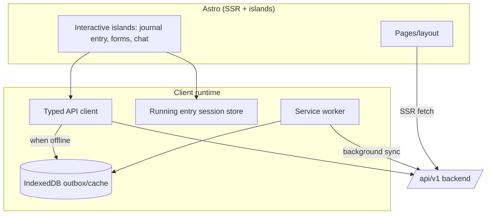
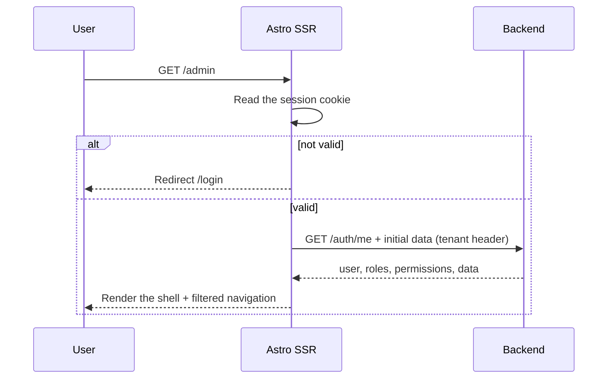
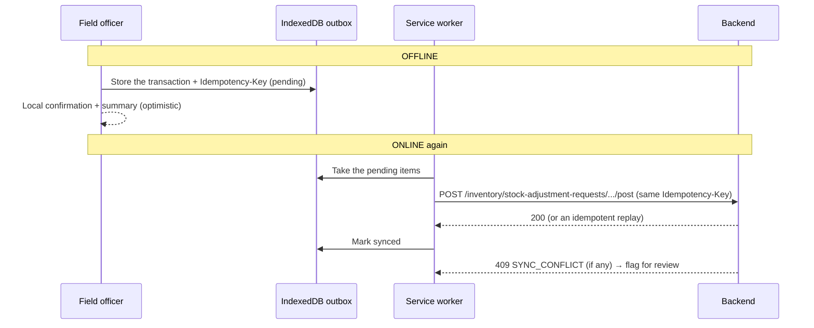

🇬🇧 English (source) · 🇮🇩 [Bahasa Indonesia](15_frontend_architecture_integration.id.md)

# Part 15 — Frontend Architecture and Frontend–Backend Integration

> **Document status (2026-07-14):** The `awcms` repo is the **directly-used ERP/back-office template of the AWCMS family** ([ADR-0035](../adr/0035-awcms-online-first-erp-saas-superset-repositioning.md)/[ADR-0034](../adr/0034-awcms-family-direct-use-templates-and-derived-pathway-removal.md)) — the base already includes **admin SSR + website/content modules** and is currently **absorbing** the awcms-micro website/e-commerce cluster into `src/modules/` (actual code status: [`docs/ARCHITECTURE.md`](../ARCHITECTURE.md)). This document adapts the frontend architecture of the base [awcms-mini](https://github.com/ahliweb/awcms-mini) (Astro SSR on Bun, islands, offline-first) into an architecture for the **hybrid online-first** AWCMS platform: the main path is online, with offline/LAN resilience as a complement. Claims of "already live"/"verified" in the source still need to be verified against `docs/ARCHITECTURE.md`. The domain route/endpoint examples cover ERP (finance, inventory, procurement, manufacturing, HR/payroll) and website/e-commerce.

## Purpose

This document defines the **frontend architecture** and the **frontend ↔ backend integration** of AWCMS: the Astro rendering strategy, the API client, authentication/session, the **offline resilience mechanism (service worker + IndexedDB + outbox)** as a complement to the online-first path, state, forms/validation, and the screen→endpoint→event contract — as a binding baseline for base modules as well as domain modules (ERP, website/e-commerce, content).

Related: `14_ui_ux_design_system.md` (design), `16_backend_data_access_integration.md` (backend/DB side), the API/event contract documents (to follow, following the `05_openapi_asyncapi_detail.md` pattern in awcms-mini). Planned enforcing skill: **`awcms-ui-screen`** (`.claude/skills/`).

## Frontend architecture decisions

| Aspect        | Decision                                                                                                                                  |
| ------------- | ----------------------------------------------------------------------------------------------------------------------------------------- |
| Framework     | Astro 7, output **server (SSR)** run on the Bun runtime                                                                                   |
| Interactivity | **Astro islands** + TypeScript; an optional framework island (e.g. Preact) only for complex islands (fast journal entry, AI analyst chat) |
| Styling       | CSS variables (design tokens, doc 14), scoped styles                                                                                      |
| Rendering     | Authed pages = SSR; vendor/employee portal = SSR; static assets cached by the SW                                                          |
| Data fetching | SSR initial load + client mutation via the API client                                                                                     |
| Offline       | PWA: service worker + IndexedDB outbox for field operational entry (warehouse, stock count)                                               |
| State         | Local per-island + a lightweight store for the running entry session; avoid a large global SPA                                            |

Rationale: SSR keeps load times fast on a LAN, is safe for httpOnly cookies, and stays lightweight; islands limit JS to interactive areas only. Backend/SSR runs on **Bun** as the runtime platform; Node.js is not the primary server platform target.

## Astro SSR on the Bun runtime

Astro **runs fully on Bun** for every phase: `bun install`, dev, build, and runtime. Call the Astro/Vite bins via `bun --bun astro …` (dev/build/preview) so that Bun executes them, not the `node` binary (the default bin shebang is `#!/usr/bin/env node`).

The one nuance: Astro **does not yet have a first-party Bun SSR adapter** (the official ones: `@astrojs/node`, Cloudflare, Vercel, Netlify — verify the versions at implementation time). Two sanctioned options, both still on the Bun runtime:

| Option                               | How                                                                                                                         | When                                                                                |
| ------------------------------------ | --------------------------------------------------------------------------------------------------------------------------- | ----------------------------------------------------------------------------------- |
| **A. Split the seam (recommended)**  | API/backend on native `Bun.serve` (+Hono); Astro is frontend/SSR only                                                       | Base default — the most "pure Bun", fits the online-first path + offline resilience |
| **B. `@astrojs/node` on top of Bun** | `output: "server"` + the standalone node adapter; run `bun ./dist/standalone-entry.mjs`; build with `bun --bun astro build` | When you want unified Astro SSR without a separate server                           |

Option B uses a package named "node" but **the `node` binary is not used** — its output runs on Bun's Node-compat layer. This is the only permitted use of a "node" package; record it as an exception in the development standards audit document if it is chosen (see doc 10 §Backend platform standard, once written; doc 18 §Runtime & tooling, once written). `static` output (without SSR) needs no adapter and can be served directly by `Bun.serve`.

## Frontend layers



## API client

**A plan, not a contract that has already been built.** This section sets the
target contract for the typed fetch wrapper `src/lib/ui/admin-form-client.ts`
(following the `submitJson`/`fetchJson` pattern proven in awcms-mini), to be used by
the inline scripts of admin pages (`login.astro`, `admin/access-users.astro`,
`admin/finance/*.astro`, and other admin pages). The behaviour that is fixed:

1. **Auth**: `credentials: "same-origin"` — relying on the httpOnly session
   cookie that the browser sends automatically. There is NO `Authorization`
   header injected manually by this client.
2. **Tenant/correlation header**: there is NO automatic injection of
   `X-AWCMS-Tenant-ID`/`X-Correlation-ID` from the client. The tenant is always
   resolved server-side from the session (`src/middleware.ts`) — never a
   client-supplied value, which closes the cross-tenant risk; the correlation ID
   is read-or-created server-side too (`src/middleware.ts`,
   `CORRELATION_ID_HEADER`).
3. **Idempotency**: **not automatic** — the caller creates it itself via
   `newIdempotencyKey()` (`crypto.randomUUID()`) and sends it manually
   per-call through the `extraHeaders` parameter to `submitJson(url,
method, body, strings, extraHeaders)` (the pattern used for high-risk
   mutation lifecycle actions, e.g. posting a journal, approving a PO).
4. **Retry**: there is **no** automatic retry at all (neither GET nor
   mutation) — a single attempt; a network failure is mapped to `{ ok:
false, message: strings.networkError }`.
5. **Offline outbox**: there is **no** IndexedDB/service-worker outbox
   integration in this base client — the offline outbox is a separate layer
   (see §Offline-first).
6. **Response envelope**: `submitJson`/`fetchJson` parse the standard
   envelope `{ success, data }` / `{ success: false, error }`
   (`modules/_shared/api-response.ts`) and map `error.code` through
   `strings.errorMessages` (i18n) — never leaking an internal stack/detail
   to the UI (doc 10, once written).
7. **Supporting UX**: `lockElement` disables the button + sets `aria-busy` while
   the request is in flight (preventing double-submit from a double click/Enter);
   `showBanner`/`reloadAfterDelay` for success/failure feedback.

```ts
// src/lib/ui/admin-form-client.ts — target contract (not implemented yet)
async function submitJson(
  url: string,
  method: string,
  body: unknown,
  strings: ClientErrorStrings,
  extraHeaders?: Record<string, string> // e.g. { "Idempotency-Key": newIdempotencyKey() }
): Promise<{ ok: boolean; code?: string; message: string }> {
  /* same-origin fetch, parse the envelope, never throws */
}

async function fetchJson<TData = unknown>(
  url: string,
  strings: ClientErrorStrings
): Promise<{
  ok: boolean;
  status: number;
  code?: string;
  message: string;
  data: TData | null;
}> {
  /* same-origin GET, parse the envelope, never throws */
}
```

**Not built yet, a future aspiration.** A generic cross-module typed API client
with broader responsibilities — a centralised `/api/v1` base URL,
automatic Authorization/tenant/correlation header injection, safe retry
for GET, timeout + offline detection with an outbox fallback — is a
**legitimate future target** once client-side complexity
grows (e.g. a field-entry island that needs real retry/offline),
but it is not an early-phase priority. Do not assume such a generic
client already exists when writing new code or guidance — refer to the
`admin-form-client.ts` contract above as the base pattern that must be built
first.

## Authentication and session

- Login `POST /auth/login` → the server sets an **httpOnly + SameSite=Lax cookie** (access token) and provides the user context.
- The active tenant is chosen after login (if the user is multi-tenant) → sent as `X-AWCMS-Tenant-ID` and stored in the session.
- SSR reads the cookie to render protected pages; 401 → redirect to `/login`.
- `GET /auth/me` to hydrate the context (roles, default entity/warehouse, permissions for filtering navigation).
- Logout `POST /auth/logout` → invalidate the session + delete the cookie.
- Tokens/secrets are **never** stored in localStorage, which third-party scripts can access.
- The `/login` page (`src/pages/login.astro`) = a mobile-first **split panel** (doc 14 §Auth screen): an `aria-hidden` `AuthBrandPanel.astro` beside the form card at ≥900px and absent below it, then brand + title/subtitle, an adaptive tenant field (single-tenant readout / `<select>` / manual, read server-side from the root table `awcms_tenants`), a CSP-safe show/hide password toggle, and an anti-double-submit submit (`lockElement` + `sendJson`). Its script is a bundled module (not inline — it complies with the CSP `default-src 'self'`); `tokens.css`/`motion.css`/scoped `<style>` are all emitted as external `<link>`s (`build.inlineStylesheets: "never"`).



## Public tenant-scoped routes (without a session)

Different from `/admin/*` (cookie session) and the authenticated API client
(the `X-AWCMS-Tenant-ID` header) above — both assume the
caller already knows its tenant. Public routes for anonymous visitors
(e.g. a public delivery tracking status page, a vendor portal without a
full login) **have no implementation example in this repo yet**; the related
ADR (following the `ADR-0009-public-tenant-scoped-routes.md` pattern in
awcms-mini, to be written as a separate ADR in this repo's `docs/adr/`
if needed) sets the pattern: the tenant is resolved from an explicit path
segment carrying `tenantCode` (`/<prefix>/{tenantCode}/...`, looked
up against the RLS-free `awcms_tenants`), **not** a subdomain — a subdomain
needs wildcard DNS/TLS, which conflicts with the default LAN topology (resilience
mode). A `tenantCode` that is not found / a tenant that is not active → `404`, not
leaking the existence of the tenant.

## Offline-first (resilience mode)

Field operational entry (e.g. warehouse goods receipt, stock count, cashier journal entry at a location without a stable connection) **must** work without internet. The planned mechanism:

1. **App shell + assets** cached by the service worker (cache-first) so the operational entry UI opens offline.
2. **Master data** (products, accounts, prices, last known stock, relevant vendors/employees) cached into IndexedDB while online (stale-while-revalidate) for offline search/scan.
3. **Transactions** posted while offline are written to an **IndexedDB outbox** with a client-generated `Idempotency-Key` + status `pending`.
4. **Background sync** (or a retry once online) sends the outbox to the backend; the idempotent server (doc 10, once written) prevents duplication.
5. **SyncIndicator** shows the queue count & status; high-risk conflicts are flagged for manual resolution.



Offline rules:

- Only operations that are safe offline are supported (stock/draft journal entry, field notes). Operations that need an authoritative server (multi-level approval, tax/Coretax export, final posting to the general ledger) are **not** run offline.
- The stock/balance shown offline is a snapshot; the server remains authoritative and may reject (e.g. `STOCK_NOT_AVAILABLE`) at sync time.
- External providers (WA/email/R2/payment gateway) always go through the server outbox, never from the client.
- A soft delete that happens offline is stored as a mutation/tombstone with an `Idempotency-Key`; the local UI hides the resource until the server accepts or rejects it at sync time.

## State management

- **Running entry session store**: a lightweight store (signals/nanostores) per operational entry session (e.g. a goods receipt draft); the total source of truth remains the server at posting time.
- **Server state**: fetched per page (SSR) + refetched on mutation; avoid a stale global cache.
- **Form state**: local to the island; submit → API client.

## Forms and validation

- A shared validation schema (e.g. Zod) is defined in `_shared` and used by **client & server** so they stay consistent.
- The client validates for fast UX; **the server remains authoritative** (all input is validated by the backend).
- Field errors from `VALIDATION_ERROR.details` are mapped to FormField.

## Screen → endpoint → event integration contract

> The contract below is a **target plan** per ERP module; it will be detailed further per module in the OpenAPI/AsyncAPI documents once written.

| Screen                   | Action              | Endpoint                                                                   | Event produced                            |
| ------------------------ | ------------------- | -------------------------------------------------------------------------- | ----------------------------------------- |
| Setup wizard             | Initialisation      | `POST /setup/initialize`                                                   | `tenant.created`                          |
| Login                    | Sign in             | `POST /auth/login`                                                         | `identity.login.succeeded`                |
| Products & raw materials | CRUD                | `/inventory/products`                                                      | `inventory.product.created`               |
| Products & raw materials | Soft delete/restore | `DELETE /inventory/products/{id}`, `POST /inventory/products/{id}/restore` | `inventory.product.soft_deleted/restored` |
| Stock adjustment         | Opening balance     | `/inventory/stock-adjustment-requests`                                     | `inventory.stock.adjustment.posted`       |
| Purchase order           | Approval & posting  | `POST /procurement/purchase-orders/{id}/approve`                           | `procurement.purchase_order.approved`     |
| Finance journal          | Posting             | `POST /finance/journal-entries/{id}/post`                                  | `finance.journal_entry.posted`            |
| Payroll                  | Run a payroll run   | `POST /hr/payroll-runs/{id}/execute`                                       | `hr.payroll_run.executed`                 |
| Warehouse                | Transfer            | `/warehouse-transfers/*`                                                   | `warehouse.transfer.shipped/received`     |
| Tax                      | VAT/Coretax         | `/tax/*`                                                                   | `tax.vat_invoice.generated`               |
| Sync                     | Push/pull           | `/sync/push`, `/sync/pull`                                                 | `sync.conflict.detected`                  |

## Frontend security

- No provider secret/API key in the client (doc 10/18, once written).
- Strict CSP; sanitise input; avoid unsafe `innerHTML` (XSS).
- httpOnly + SameSite cookie for the token; a CSRF token for cookie-based mutations.
- Navigation/actions are hidden according to permissions, which is **not** the primary control — backend ABAC is still mandatory.
- Sensitive data is shown masked (e.g. salary, bank account, NPWP); do not cache raw PII in IndexedDB.
- The archive view must not become a tenant/ABAC bypass; soft-deleted PII stays masked and is not stored raw in IndexedDB.

## Acceptance criteria

- Astro SSR renders authed pages; islands only in interactive areas.
- The API client injects the mandatory headers & idempotency; errors are mapped to the UI.
- httpOnly cookie-based login; 401 redirects; navigation filtered by permission.
- Field operational entry opens & posts transactions **offline**, then syncs without duplication.
- SyncIndicator shows the queue & status; conflicts are flagged.
- Client validation follows the shared schema; the server remains authoritative.
- No secrets in the client; raw PII is not cached.
- The archive/list restore flow uses effective permissions, `includeDeleted`, and clear UI state.
