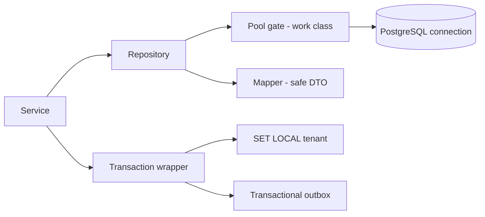
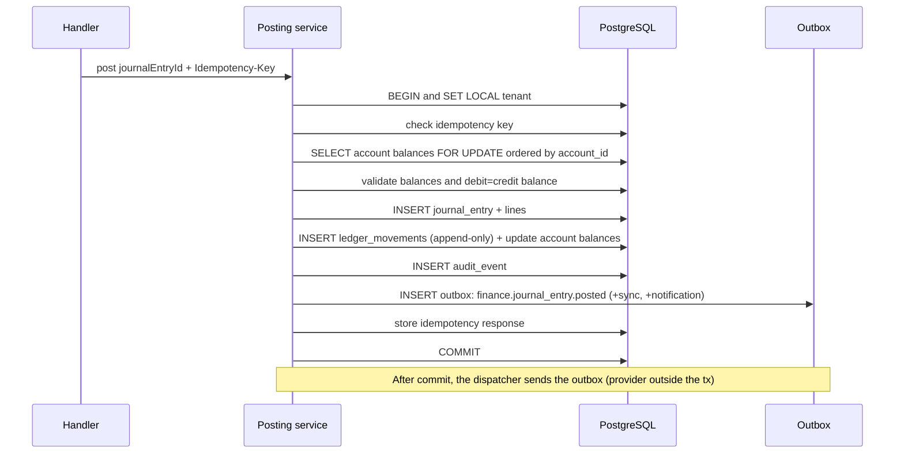
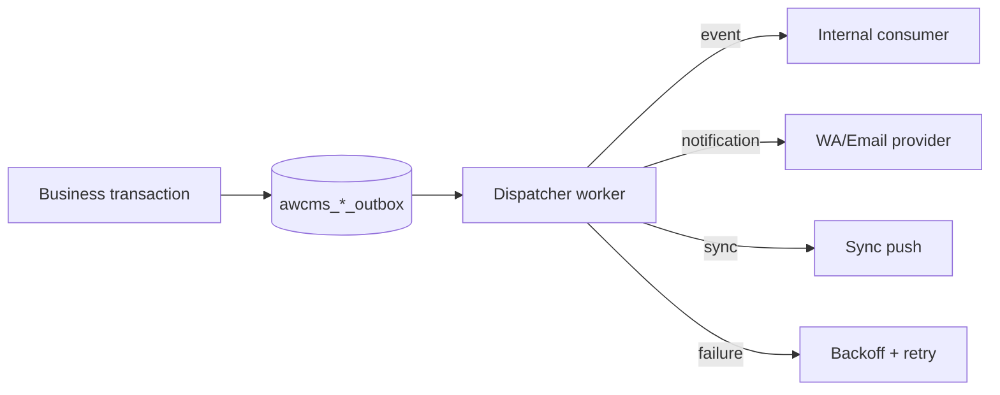
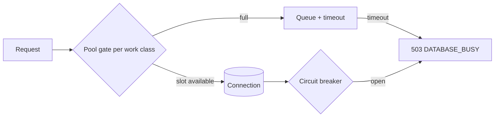
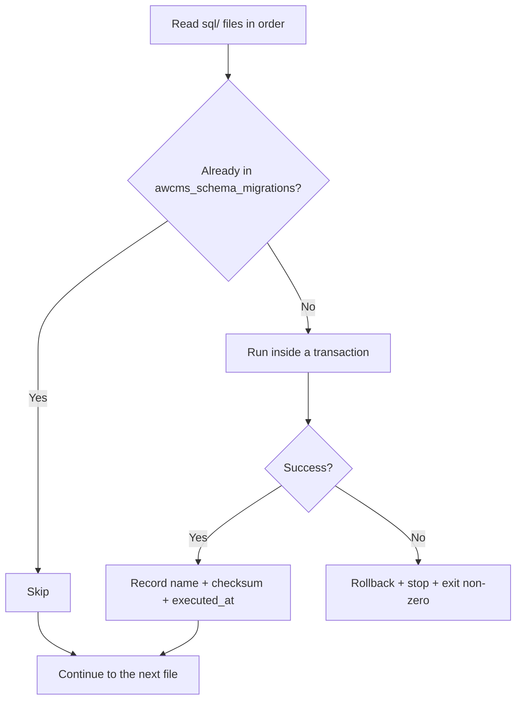

🇬🇧 English (source) · 🇮🇩 [Bahasa Indonesia](16_backend_data_access_integration.id.md)

# Part 16 — Backend Data Access and Database Integration

> **Document status (2026-07-14):** The `awcms` repo is still at the re-foundation stage ([ADR-0001](../adr/0001-rebuild-on-awcms-foundation-erp-scope.md)) — **no ERP module code, repository, or migration has been implemented yet**. This document adapts the data access patterns of the base [awcms-mini](https://github.com/ahliweb/awcms-mini) (repository per module, RLS via `SET LOCAL`, transactional outbox, idempotency store) into a binding **target architecture** for the AWCMS ERP platform. Concrete Issue/PR examples from the source (e.g. Issue #494, #599) are awcms-mini implementation history and are kept as pattern references, not as a claim that the same thing has already happened in this repo. Sample domain tables/entities have been changed to ERP ones (journal, purchase order, stock adjustment, payroll), replacing the retail/POS examples from the source.

## Purpose

This document sets the AWCMS **backend ↔ database integration**: the concrete driver & query layer, connection pooling & backpressure, the RLS context mechanism (`SET LOCAL`), the transaction wrapper & locking, the transactional outbox, the migration runner, and the idempotency store — as a binding baseline before the first ERP module is built.

Related: the coding standard document (following the `10_template_kode_coding_standard.md` pattern, to be written in `docs/awcms/`), the ERD/data dictionary document (following the `04_erd_data_dictionary.md` pattern, to be written), `15_frontend_architecture_integration.md` (the frontend side).

## Technical decisions

| Aspect           | Decision                                                                           |
| ---------------- | ---------------------------------------------------------------------------------- |
| Backend platform | **Bun runtime**; every backend script is run with `bun`                            |
| Driver           | `postgres` (postgres.js) or `Bun.sql` — parameterized, supports pooling            |
| Access pattern   | Repository per module (`infrastructure/repository.ts`)                             |
| RLS context      | `SET LOCAL app.current_tenant_id` inside the transaction                           |
| Transaction      | Explicit wrapper; `FOR UPDATE` for stock/balances; timeout                         |
| Event/provider   | **Transactional outbox** (events, CRM/notification messages, sync)                 |
| Soft delete      | Repository filters `deleted_at IS NULL` by default; restore/purge are permissioned |
| Migration        | Sequential runner + checksum (`awcms_schema_migrations`)                           |
| Pool             | Work class + queue + circuit breaker; PgBouncer optional                           |

## Data access layers



The rule: the service calls the repository; the repository does nothing but parameterized queries + the mapper; there is no business logic in the repository. Backend processes must run on the Bun runtime; Node.js is not the primary server platform.

## Bun-only policy and Node.js exceptions

The AWCMS backend is **Bun-only**:

- Run the backend, migrations, tests, build, preflight, and operational scripts through `bun` or `bun run`.
- Use `bun.lock` as the lockfile and `packageManager: "bun@..."` as the package manager declaration.
- It is forbidden to add `node`, `npm`, `npx`, `pnpm`, `yarn`, a Node.js server adapter, or any dependency that forces the backend process to run on Node.js.
- Bun-compatible libraries may be used even when they come from the npm ecosystem, as long as they do not require the Node.js runtime as their server platform.
- **HTTP server** = native `Bun.serve`; **database driver** = `Bun.sql` or `postgres` (postgres.js), not `pg`. Importing `node:*` (e.g. `node:crypto`) is a Bun built-in API and is **allowed**. Full details are planned for the coding standard document §Backend platform standard (once written); Astro SSR on Bun: doc 15 §Astro SSR on the Bun runtime.

A Node.js exception is only permitted when all of the following conditions are met:

1. Bun does not yet support the required capability, or no Bun-compatible library exists yet.
2. A maintainer gives explicit permission before the dependency/tooling is added.
3. The relevant document records the reason, the Bun alternatives already tried, the file/package scope, the deadline or conditions for revoking the exception, and the plan for migrating back to Bun.
4. The development standards audit is updated with an exception entry.
5. CI/preflight flags that exception so it does not become the default pattern.

Without those five conditions, a change that adds a Node.js runtime/tooling is considered not to meet the Definition of Done.

## RLS context (critical for multi-tenant/multi-entity)

Every tenant-scoped transaction **must** set the tenant at the start, after which all queries follow the RLS policy (the ERD document, once written).

```sql
BEGIN;
SET LOCAL app.current_tenant_id = $1;   -- $1 = active tenant from auth
-- ... queries run with RLS active ...
COMMIT;
```

Important notes:

- Use **`SET LOCAL`** (not a session `SET`) so it is safe with **PgBouncer transaction pooling** — the context does not leak between transactions/connections.
- The value comes from the auth middleware, **not** from a raw public header. For public routes without a session (see doc 15 §Tenant-scoped public routes), the value must still pass through a verified lookup (`tenantCode → tenant_id` from `awcms_tenants`) — not accept a raw `tenant_id` from the path/query as truth, exactly the same principle.
- RLS is the second line of defence; queries still filter `tenant_id` explicitly.

```ts
async function withTenant<T>(
  tenantId: string,
  fn: (tx: Tx) => Promise<T>
): Promise<T> {
  return transaction(async (tx) => {
    await tx.unsafe(
      `SET LOCAL app.current_tenant_id = '${assertUuid(tenantId)}'`
    );
    return fn(tx);
  });
}
```

The sketch above is deliberately minimal (no work class/circuit breaker). What may
**not** be simplified away from the real implementation (`src/lib/database/tenant-context.ts`):
the pool gate can **reject before `fn` runs at all**, and that rejection is not a
value that may masquerade as a result. Hence there are two forms:

- **`withTenant(...)` → `Promise<T | Response>`** for the request path. The
  rejection arrives as a `503 DATABASE_BUSY` + `Retry-After` that you simply pass
  through (`if (result instanceof Response) return result;`).
- **`withTenantOrThrow<T>(...)` → `Promise<T>`** for everything that is not an
  HTTP handler — workers, scheduled jobs, SSR frontmatter, tenant resolvers, test
  fixtures. It throws `DatabaseBusyError` (carrying an identical `503` response),
  which the job runner classifies as `retryable`.

The rule is not style: a worker that accepts a `Response` as its "result" reads it
as zero rows and reports success. `db:tenant-context:check` enforces the two
leftovers the compiler cannot see — a discarded `withTenant` result, and calls
from `.astro` (never read by `tsc --noEmit`).

## Transaction wrapper and locking

1. A transaction for every multi-table mutation.
2. Set the RLS context at the start of the transaction.
3. `SELECT ... FOR UPDATE` for the stock/account balance/bin balance rows being changed.
4. **Order locks by `product_id`/`account_id`** to reduce deadlocks.
5. **Do not** call an external provider inside the transaction (WA/email/R2/AI/payment gateway).
6. A statement timeout to prevent hanging transactions.
7. Deadlock retry is safe because of idempotency.

### Posting a financial journal (end-to-end integration)



## Transactional outbox

Domain events, notification messages, and sync are **written in the same transaction** as the data change, then sent by a separate worker. This guarantees consistency without calling a provider inside the transaction.



Related tables (planned naming, following the `awcms_` prefix pattern): `awcms_sync_outbox`, `awcms_message_outbox`, `awcms_object_sync_queue`, `awcms_email_messages`. Status: `pending → sent/failed`, with `next_retry_at`.

### Claim-lease dispatcher (email, sync object queue)

The concrete pattern behind the "separate worker" in the diagram above — following the pattern proven in awcms-mini for `email/application/email-dispatch.ts` (`bun run email:dispatch`) and `sync-storage/application/object-dispatch.ts` (`bun run sync:objects:dispatch`), which will be adapted for ERP needs (e.g. a PO approval notification dispatcher, a payslip dispatcher):

1. **CLAIM** — one short transaction moves the eligible rows
   (`queued`/`retry_wait` for email; `pending` for the object queue) to the
   transient status `sending`, with `UPDATE ... WHERE ... FOR UPDATE SKIP LOCKED`
   so that concurrent invocations (two overlapping cron ticks) are safe without
   duplication. `next_attempt_at`/`next_retry_at` are reused as the lease expiry
   while the status is `sending` — there is no separate lease column.
2. **SEND** — the provider (e.g. the email provider/R2/payment gateway) is called
   **outside** any transaction, once per claimed row.
3. **FINALIZE** — one short transaction per row moves `sending` to a final
   status: `sent` (success), `retry_wait` with exponential backoff (failed, retries
   remaining), or `failed` (retries exhausted or a non-retryable failure). Every
   attempt — success or failure — is recorded in an attempt history table (e.g.
   `awcms_email_delivery_attempts` or its per-domain analogue).

A per-provider circuit breaker (`src/lib/database/circuit-breaker.ts`) is planned
to wrap the SEND phase: after a number of consecutive failures, an `open` breaker
temporarily stops further provider calls (preventing a retry loop from hammering a
provider that is in an outage) — the notification dispatcher even stops claiming
rows at all while the breaker is `open`, while other dispatchers that do not need
that provider can still claim unaffected rows while the breaker is open.

### Generic multi-consumer outbox — `domain_event_runtime`

The pattern above (`sync_storage`/`email`/other dispatchers) is in each case a
single-purpose queue with one implicit consumer (its own dispatcher, calling one
external provider). `domain_event_runtime` (following the `platform-evolution`
epic pattern in awcms-mini) is the planned generic, provider-neutral,
MULTI-consumer complement: one event can fan out to many registered consumers at
once, with explicit ordering per aggregate/order-key (not a global total order
across unrelated aggregates) — relevant for ERP because one domain event (e.g.
`procurement.purchase_order.approved`) often needs to be consumed by more than one
module at once (finance for the accrual, inventory for the expected receipt,
notification for the vendor). See
`src/modules/domain-event-runtime/README.md` (once written) for the full design.
Producers call `appendDomainEvent(tx, tenantId, ...)` INSIDE their own business
transaction (the same as the outbox pattern above); the static consumer registry
(`infrastructure/consumer-registry.ts`) decides the fan-out at publish time, not at
dispatch time.

**The important difference from the 3-phase CLAIM/SEND/FINALIZE above**: this
module's reference consumer is same-process, DB-only, with NO external calls — so
the claim check + handler execution + success finalize run in ONE transaction (not
three separate phases), which is precisely what makes crash/restart recovery
correct by construction (a transaction that crashes mid-handler rolls back
entirely and automatically, with no transient "claimed" status that can get stuck)
— the 3-phase lease pattern is still needed for future
out-of-transaction/broker-backed consumers
(`infrastructure/broker-adapter-port.ts`, not implemented yet).

## Connection pooling and backpressure

Work classes cap concurrency per kind of load so that operational transactions keep priority.

| Work class             | Example                                        | Priority  |
| ---------------------- | ---------------------------------------------- | --------- |
| `critical_transaction` | Journal posting, PO approval, transfer receive | Highest   |
| `interactive`          | Admin CRUD, search                             | High      |
| `reporting`            | Financial reports, dashboard                   | Medium    |
| `background_sync`      | Sync push/pull, outbox, payroll batch          | Low       |
| `maintenance`          | Migration, backup                              | Scheduled |



- The health endpoint `GET /database/pool/health` reports saturation (the API contract document, once written).
- Saturation triggers the `database.pool.saturated` event and `503 DATABASE_BUSY`.
- PgBouncer is optional (transaction mode): avoid problematic prepared statements; use `SET LOCAL`.

## Migration runner

Follow the naming standard `NNN_awcms_<area>_<desc>.sql` (following the awcms-mini pattern) — the enforcing skill is planned: **`awcms-new-migration`**.



- The checksum detects a file changed after it was applied (warn/reject).
- No double-run; an error halts the process.

## Idempotency store

- The `awcms_idempotency_keys` table stores the `key`, request hash, status, response/resource.
- The flow is planned to follow the `awcms-idempotency` skill (the coding standard document, once written). Retention 7–30 days (the ERD document, once written).
- The concurrent-request race with the SAME `Idempotency-Key` (two parallel requests passing the initial check together under READ COMMITTED) is handled at a single point: `saveIdempotencyRecord` (`src/modules/_shared/idempotency.ts`) uses `INSERT ... ON CONFLICT (tenant_id, request_scope, idempotency_key) DO NOTHING RETURNING id`. If it loses the race, it re-`SELECT`s the winner's row (guaranteed already committed) and compares its `request_hash` — same hash (identical payload) → it throws `IdempotencyRaceLostError` carrying the winner's response to be replayed; different hash (a genuine conflict) → without a replay payload. `withTenant` (`src/lib/database/tenant-context.ts`) catches it at a single point: it rolls back the loser's transaction (its mutation never persists), skips the circuit breaker (this is not an infra failure), logs `idempotency.race_lost` (the key hashed SHA-256, not raw), then **replays the winner's response** if the hash matches — enforcing the "same hash → replay" rule even when losing the race — or a clean `409 IDEMPOTENCY_CONFLICT` if the hash differs, not a raw constraint error. This applies automatically to every idempotent endpoint without having to change each route.
- The generalisation principle that must be preserved from the start (learned from the awcms-mini experience): `withTenant` skips `circuitBreaker.recordFailure()` for **all** `Bun.SQL.PostgresError` SQLSTATE class `23` (integrity constraint violation — FK/unique/check violation), not only the idempotency race case. Any `INSERT`/`UPDATE` that fails because of an FK/unique constraint (e.g. an invalid caller-supplied `tenantId`) must not count as an infra failure and open an application-wide circuit breaker from a handful of requests with invalid input alone. The same exception applies to SQLSTATE class `22` (data exception, e.g. `22P02`, a non-UUID string compared against a `uuid` column) — the same class of structural bug, which must be closed at design time, not retrofitted after a production incident.

## Repository and mapper

1. Parameterized queries; **no** string interpolation of user input.
2. Tenant-scoped queries filter `tenant_id` explicitly.
3. The mapper turns a row → a safe DTO (masking, dropping sensitive columns such as salary/bank account) before it reaches the service/API.
4. **Keyset** pagination (`WHERE (tenant_id, created_at, id) < ...`) for large data sets, not a large offset.
5. Avoid N+1: use joins/batching.
6. For soft-deletable tables, repository list/detail adds `deleted_at IS NULL` by default; `includeDeleted`/`onlyDeleted` only after ABAC.

## Multi-table example: the module registry (a pattern from awcms-mini, planned to be adapted)

The module registry (`src/modules/module-management/`) will use two contrasting classes of data access, a concrete illustration of the RLS rules above:

- **Global registry, RLS-free** — `awcms_modules`/`_dependencies`/`_navigation`/`_jobs`/`_health_checks`. Code-derived metadata, identical for every tenant (synchronised from `listModules()` through `syncModuleDescriptors`, the same reason `awcms_permissions` is RLS-free) — it runs on the ordinary app connection and does **not** need `withTenant`/`SET LOCAL app.current_tenant_id`.
- **Tenant-writable state, RLS FORCE** — `awcms_tenant_modules` (enabling/disabling an ERP module per tenant/entity) and `awcms_module_settings` (non-secret per-tenant settings). Every access **must** go through `withTenant`, exactly like every other tenant-scoped table.
- **"Sync first" before a tenant-scoped write**: `enableTenantModule`/`disableTenantModule`/`updateModuleSettings`/`runModuleHealthCheck` all call `syncModuleDescriptors(tx)` first — the two tables above have an FK to `awcms_modules.module_key`, so the registry row must exist before a tenant-scoped row is inserted. The pattern is generic: whenever a tenant-scoped table has an FK to a code-derived registry table (e.g. the finance/inventory/procurement/manufacturing/hr-payroll modules when they are registered), make sure the registry is synced inside the same transaction before writing; do not assume the operator has already run a manual sync.

## Soft delete data access

Soft delete is a data status update, not an SQL `DELETE` on the operational path.

```sql
UPDATE awcms_products
SET deleted_at = now(),
    deleted_by = $actor_tenant_user_id,
    delete_reason = $reason,
    updated_at = now(),
    sync_version = sync_version + 1
WHERE tenant_id = $tenant_id
  AND id = $product_id
  AND deleted_at IS NULL;
```

Rules:

- Run it in a transaction with `SET LOCAL app.current_tenant_id`.
- Validate the ABAC action `delete`, then audit `*.soft_deleted`.
- Restore clears the delete columns, fills `restored_at/restored_by`, validates the partial unique index, then audits `*.restored`.
- Purge/anonymize uses a separate workflow for retention/legal (e.g. tax/finance document retention per regulation) and must not break the FKs of transactions, audit, or tax records.
- For sync, write a tombstone to the outbox in the same transaction.

## Data types & conventions

| Domain                | PostgreSQL type                             |
| --------------------- | ------------------------------------------- |
| ID                    | `uuid` (default `gen_random_uuid()`)        |
| Time                  | `timestamptz`                               |
| Money/quantity        | `numeric`                                   |
| Flexible payload      | `jsonb`                                     |
| Enum-like             | `text` + `CHECK`                            |
| Soft delete timestamp | `timestamptz` (`deleted_at`, `restored_at`) |

Table/column names are `snake_case`, prefixed `awcms_` (the ERD/coding standard document, once written).

## Acceptance criteria

- All tenant-scoped access uses `withTenant`/`SET LOCAL` + a `tenant_id` filter; RLS is active.
- Journal/PO/payroll posting is atomic, locks balances/stock, and writes the outbox in one transaction.
- External providers are not called inside the transaction.
- The work-class pool + backpressure are active; the health endpoint reports saturation; `503` when full.
- Migrations run in order, do not double-run, checksums are recorded, an error halts the process.
- The idempotency store prevents duplicated high-risk mutations.
- Repositories are parameterized; the mapper emits a safe DTO; keyset pagination for large data sets.
- The soft delete default filter is active; restore/purge use ABAC, audit, and an outbox tombstone when sync is active.
