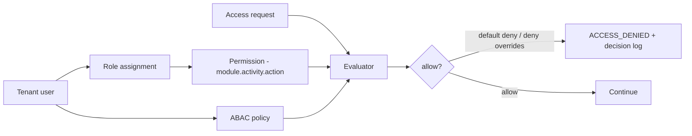
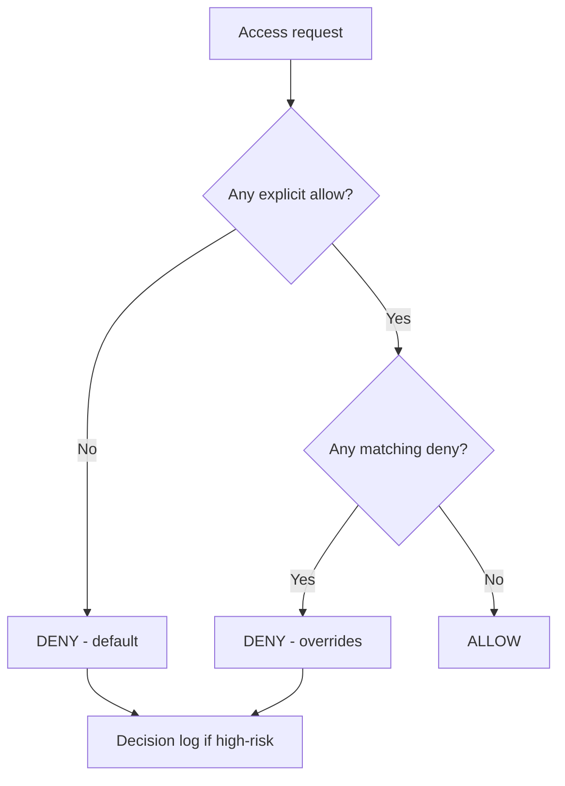
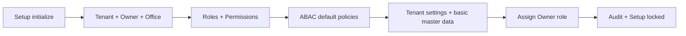

🇬🇧 English (source) · 🇮🇩 [Bahasa Indonesia](17_default_seed_rbac_abac.id.md)

# Part 17 — Default Seed, RBAC, and ABAC Policy

> **Document status.** The `awcms` repo is only at the foundation-rebuild stage ([ADR-0001](../adr/0001-rebuild-on-awcms-foundation-erp-scope.md)) — no ERP module has been implemented yet. This document is the **target design** for the RBAC/ABAC mechanism and the default seed that will be built here (ADR-0055 §1); the `awcms-mini` code may be read as historical reference, not as the standard, adapted for the **ERP + business integration** scope (finance/accounting, inventory/warehouse, procurement, manufacturing, HR/payroll, plus payment gateway, marketplace, tax/Coretax and logistics integrations). There is not yet a single line of code/migration implementing the roles, permissions, or policies below — everything here is a **plan to be verified when the relevant module is actually built**, not a claim about a running status.

## Purpose

This document supplies the initial data needed so that the **Setup Wizard** and **RBAC/ABAC** can be implemented in awcms: the module/activity registry, the permission list, the role → permission matrix, the ABAC default policy, and the default seed. Without it, access cannot be evaluated concretely once the ERP modules start being built.

Related: `03_srs_detail_per_modul.md` (access rules, not written yet — to be added incrementally as modules are built), `10_template_kode_coding_standard.md` (ABAC guard, not written yet).

## Access model

- **RBAC** gives the baseline permission set per role.
- **ABAC** filters further on attributes (office/plant scope, resource ownership, environment) with **default deny** and **deny overrides allow**.

This evaluator mechanism (default deny, deny overrides allow, `module_key.activity_code.action`) is a generic pattern inherited directly from the awcms-mini base — reusable as is. What changes for the ERP scope is the **module/activity list** and the **role list**, because the business domain is finance/inventory/procurement/manufacturing/HR instead of retail/POS.

## Module & activity registry (planned, ERP scope)

`module_key.activity_code` identifies a capability. An initial example set that needs seeding once the relevant module starts being built (it will be extended/revised alongside the real implementation — this is not a final list):

| Module key                      | Activity code          | Available actions                     |
| ------------------------------- | ---------------------- | ------------------------------------- |
| `tenant_admin`                  | `office_management`    | read, create, update                  |
| `identity_access`               | `user_management`      | read, create, update, assign          |
| `identity_access`               | `access_control`       | read, assign, configure               |
| `profile_identity`              | `profile_management`   | read, create, update, delete, restore |
| `profile_identity`              | `profile_merge`        | read, approve                         |
| `finance_accounting`            | `general_ledger`       | read, create, update, post            |
| `finance_accounting`            | `journal_posting`      | post, reverse                         |
| `finance_accounting`            | `approval_matrix`      | read, configure, approve              |
| `finance_accounting`            | `bank_reconciliation`  | read, create, approve                 |
| `procurement`                   | `purchase_requisition` | read, create, update, approve         |
| `procurement`                   | `purchase_order`       | read, create, update, approve, cancel |
| `procurement`                   | `vendor_management`    | read, create, update, delete, restore |
| `inventory_warehouse`           | `stock_management`     | read, update, adjust                  |
| `inventory_warehouse`           | `transfer`             | read, create, approve, send, receive  |
| `inventory_warehouse`           | `cycle_count`          | read, create, approve                 |
| `manufacturing`                 | `production_order`     | read, create, update, approve, close  |
| `manufacturing`                 | `bom_routing`          | read, create, update, approve         |
| `hr_payroll`                    | `employee_management`  | read, create, update, delete, restore |
| `hr_payroll`                    | `payroll_run`          | read, create, approve, post           |
| `hr_payroll`                    | `payslip`              | read, export                          |
| `accounting_tax`                | `tax_profile`          | read, configure                       |
| `accounting_tax`                | `vat_invoice`          | read, create                          |
| `accounting_tax`                | `coretax_export`       | export, approve                       |
| `integration_gateway`           | `payment_gateway`      | read, configure, reconcile            |
| `integration_gateway`           | `marketplace_sync`     | read, configure, sync                 |
| `integration_gateway`           | `logistics_provider`   | read, configure, sync                 |
| `integration_gateway`           | `webhook_inbound`      | read, verify                          |
| `sync_storage`                  | `sync`                 | read, configure                       |
| `sync_storage`                  | `conflict_resolution`  | read, approve                         |
| `management_reporting`          | `reports`              | read                                  |
| `workflow_approval`             | `approval`             | read, approve                         |
| `observability_logging`         | `logs`                 | read                                  |
| `production_security_readiness` | `go_live`              | read, approve                         |
| `module_management`             | `modules`              | read, sync                            |
| `module_management`             | `tenant_modules`       | read, enable, disable                 |
| `module_management`             | `settings`             | read, update                          |
| `module_management`             | `permissions`          | read                                  |
| `module_management`             | `navigation`           | read                                  |
| `module_management`             | `jobs`                 | read                                  |
| `module_management`             | `health`               | read, check                           |

## Default roles (planned)

The generic base (`tenant_admin`, `identity_access`, etc.) is kept exactly as it is from awcms-mini. The business roles are swapped from the retail domain to the ERP domain:

| Role                 | Access summary                                                                               |
| -------------------- | -------------------------------------------------------------------------------------------- |
| Owner                | Every module, including approval & go-live                                                   |
| Admin                | Setup, users, master data, reports, configuration (not certain financial approvals)          |
| Finance Approver     | Journal approval, bank reconciliation, financial approval matrix; **without** direct posting |
| Finance Staff        | Journal entry, reconciliation drafts; **without** final approval/post                        |
| Procurement Officer  | PR/PO, vendor management; PO approval above the threshold needs a Finance Approver           |
| Warehouse Supervisor | Stock transfer & cycle count approval, receiving                                             |
| Warehouse Staff      | Transfer, receiving, operational cycle count                                                 |
| Production Planner   | Production order & BOM/routing                                                               |
| Payroll Admin        | Payroll run, payslip, employee management (sensitive PII access)                             |
| Tax Officer          | Tax & Coretax                                                                                |
| Integration Operator | Payment gateway/marketplace/logistics/webhook configuration (not financial approval)         |
| Business Analyst     | Reports (read-only)                                                                          |
| Auditor              | Audit trail & logs read-only                                                                 |

## Role → permission matrix (condensed, planned)

Action legend: R=read, C=create, U=update, P=post, X=cancel/reverse, A=approve, E=export, S=send/sync, G=assign, F=configure, Y=sync, I=enable, D=disable, K=health check.

The `delete`, `restore`, and `purge` permissions for soft delete are not implied by `U`; the seed must grant them explicitly per resource and ABAC stays default deny for archive/restore/purge — this pattern is kept identical to the awcms-mini base.

| Module.activity                | Owner | Admin | Fin. Approver | Fin. Staff | Procurement | Wh. Supervisor | Wh. Staff | Production | Payroll | Tax | Integration | Analyst | Auditor |
| ------------------------------ | ----- | ----- | ------------- | ---------- | ----------- | -------------- | --------- | ---------- | ------- | --- | ----------- | ------- | ------- |
| tenant_admin.office            | RCU   | RCU   | –             | –          | –           | –              | –         | –          | –       | –   | –           | –       | R       |
| identity_access.user           | RCUG  | RCUG  | –             | –          | –           | –              | –         | –          | –       | –   | –           | –       | R       |
| finance.general_ledger         | RCUP  | R     | R             | RCU        | –           | –              | –         | –          | –       | –   | –           | R       | R       |
| finance.journal_posting        | PX    | –     | PX            | –          | –           | –              | –         | –          | –       | –   | –           | –       | R       |
| finance.approval_matrix        | RFA   | RF    | RFA           | –          | –           | –              | –         | –          | –       | –   | –           | –       | R       |
| finance.bank_reconciliation    | RCA   | RC    | RCA           | RC         | –           | –              | –         | –          | –       | –   | –           | R       | R       |
| procurement.requisition        | RCUA  | RCU   | –             | –          | RCU         | –              | –         | –          | –       | –   | –           | R       | R       |
| procurement.purchase_order     | RCUAX | RCU   | A*            | –          | RCUX        | –              | –         | –          | –       | –   | –           | R       | R       |
| procurement.vendor             | RCU   | RCU   | –             | –          | RCU         | –              | –         | –          | –       | –   | –           | R       | R       |
| inventory.stock                | RUadj | RUadj | –             | –          | R           | RUadj          | RUadj     | R          | –       | –   | –           | R       | R       |
| inventory.transfer             | RCASR | RC    | –             | –          | –           | RCASR          | RC        | –          | –       | –   | –           | –       | R       |
| inventory.cycle_count          | RCA   | RC    | –             | –          | –           | RCA            | RC        | –          | –       | –   | –           | –       | R       |
| manufacturing.production_order | RCUA  | RCU   | –             | –          | –           | –              | –         | RCUA       | –       | –   | –           | R       | R       |
| manufacturing.bom_routing      | RCUA  | RCU   | –             | –          | –           | –              | –         | RCUA       | –       | –   | –           | R       | R       |
| hr_payroll.employee            | RCU   | RCU   | –             | –          | –           | –              | –         | –          | RCU     | –   | –           | –       | R       |
| hr_payroll.payroll_run         | RCA   | –     | –             | –          | –           | –              | –         | –          | RCAP    | –   | –           | –       | R       |
| hr_payroll.payslip             | RE    | –     | –             | –          | –           | –              | –         | –          | RE      | –   | –           | –       | R       |
| accounting_tax.tax_profile     | RF    | RF    | –             | –          | –           | –              | –         | –          | –       | RF  | –           | –       | R       |
| accounting_tax.vat_invoice     | RC    | R     | –             | –          | –           | –              | –         | –          | –       | RC  | –           | –       | R       |
| accounting_tax.coretax_export  | EA    | –     | A             | –          | –           | –              | –         | –          | –       | E   | –           | –       | R       |
| integration.payment_gateway    | RF    | RF    | –             | –          | –           | –              | –         | –          | –       | –   | RF          | –       | R       |
| integration.marketplace_sync   | RFS   | RFS   | –             | –          | –           | –              | –         | –          | –       | –   | RFS         | –       | R       |
| integration.logistics_provider | RFS   | RFS   | –             | –          | –           | –              | –         | –          | –       | –   | RFS         | –       | R       |
| integration.webhook_inbound    | R     | R     | –             | –          | –           | –              | –         | –          | –       | –   | RV          | –       | R       |
| reporting.reports              | R     | R     | R             | R          | R           | R              | R         | R          | R       | R   | R           | R       | R       |
| workflow.approval              | RA    | R     | RA            | –          | RA          | RA             | –         | RA         | RA      | –   | –           | –       | R       |
| logs.logs                      | R     | R     | –             | –          | –           | –              | –         | –          | –       | –   | –           | –       | R       |

`*` PO approval by a Finance Approver applies only above the nominal threshold configured in ABAC (see policy #6 below).

## ABAC default policy (planned)

Principle: **default deny**, **deny overrides allow**, RLS still mandatory — kept identical to the awcms-mini base.

| #   | Policy                      | Effect                                                                                                                                  |
| --- | --------------------------- | --------------------------------------------------------------------------------------------------------------------------------------- |
| 1   | Default                     | **Deny** everything not explicitly allowed                                                                                              |
| 2   | Role allow                  | Allow per the role → permission matrix                                                                                                  |
| 3   | Tenant isolation            | Deny when `resource.tenant_id != context.tenant_id`                                                                                     |
| 4   | Office/plant scope          | Deny when the resource's office/plant is outside the user's scope (except cross-office roles)                                           |
| 5   | Segregation of duties (SoD) | Deny when the actor who created the journal/PO is also its approver (create vs approve separation is mandatory for finance/procurement) |
| 6   | Approval threshold          | Deny PO/journal approval above the nominal threshold without the matching approval role                                                 |
| 7   | Self-approval               | Deny when `approver == requester` in any workflow                                                                                       |
| 8   | Tax/PII masking             | Deny showing the full tax identity/payroll data (NPWP, NIK, salary) to non-tax/non-payroll roles                                        |
| 9   | AI safety                   | Deny the AI access to raw SQL/mutation/PII/raw financial data                                                                           |
| 10  | Export approval             | Deny Coretax export or payroll export without approval when the policy is active                                                        |
| 11  | Soft delete archive         | Deny `includeDeleted`, `restore`, or `purge` without an explicit permission; deny delete for posted/append-only entities                |
| 12  | Webhook integrity           | Deny processing an inbound webhook (payment/marketplace/tax/logistics) without a valid signature/HMAC verification                      |
| 13  | Double-posting guard        | Deny duplicate journal/payment posting (an idempotency key is mandatory for every high-risk financial mutation)                         |

Policies #5, #6, #12, #13 are new for the ERP scope (SoD, approval threshold, webhook integrity, double-posting guard) — they extend the generic "self-approval is denied" and "high-risk mutation needs idempotency" principles from the awcms-mini base to the financial risks whose consequences are higher in an ERP.

Every **high-risk deny** is recorded in a tenant-scoped decision log (following the `*_abac_decision_logs` pattern from the base, with the table name adjusted when the awcms schema is built).

## Default seed during the Setup Wizard (planned)

The setup wizard will create the following initial data (idempotent, once before it is locked) — following the awcms-mini base pattern:

1. **Tenant** + owner **identity** + owner **tenant_user**.
2. First **office/plant** (`head_office`).
3. **Default roles** (the roles above) + **permission** + **role_permission**.
4. **ABAC default policy** (the policies above).
5. **Tenant settings**: `default_locale`, `default_theme=system`, timezone, default chart of accounts (ERP-specific, detailed in the finance/accounting document that has not been written yet).
6. **Basic master data**: units of measure, base currency, a minimal COA account set.
7. **Assignment**: owner → Owner role.
8. **Audit**: initial `tenant.created`, `access.assignment`.

## Acceptance criteria (target, not yet verified against code)

- The setup wizard produces the tenant, owner, office, default roles, permissions, and ABAC defaults; then locks itself.
- The evaluator enforces default deny & deny overrides allow per the matrix & policies.
- SoD is enforced: the creator of a journal/PO cannot also be the approver; self-approval is denied.
- Approval above the nominal threshold is denied without the matching approval role; Coretax/payroll export needs approval when the policy is active.
- Cross-tenant & cross-office/plant is denied.
- An inbound webhook (payment/marketplace/tax/logistics) is denied without valid signature verification.
- Soft delete/restore only for authorized roles; the archive view is default deny for operational roles.
- High-risk denies are recorded in the decision log.
- The seed is idempotent; it cannot be re-run once locked.

All the criteria above **will be verified again concretely** (automated tests + live verification) when the RBAC/ABAC module and the related ERP modules are actually implemented in awcms — this document is a design, not a test report.
