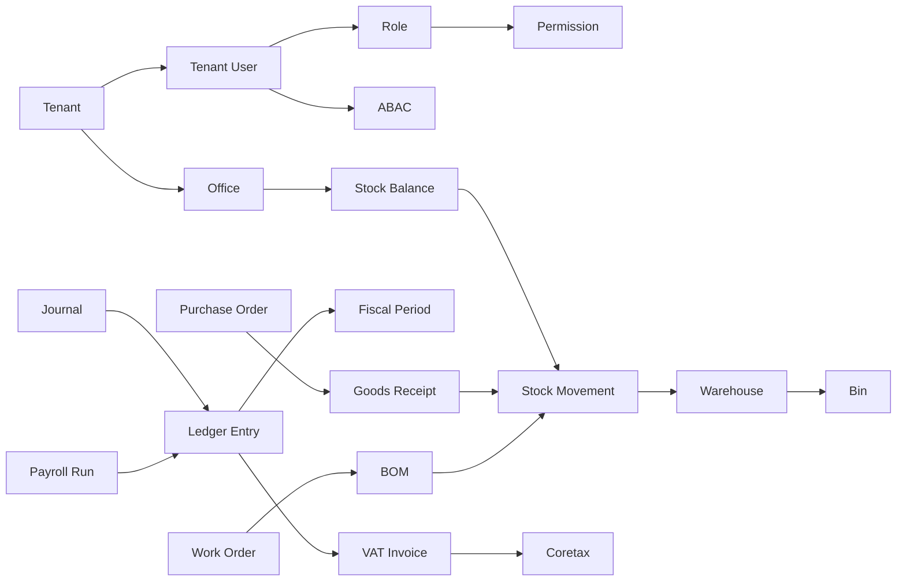

🇬🇧 English (source) · 🇮🇩 [Bahasa Indonesia](19_glossary_terminology.id.md)

# Part 19 — Glossary and Terminology

> **Implementation status (2026-07-14).** Adapted from `docs/awcms-mini/19_glossary_terminology.md`. Generic architecture/security terms are kept as they are (already proven in the originating base). CMS/retail-POS domain terms (blog, article, news portal, visitor analytics, POS checkout) are **removed/replaced** with ERP domain terms (general ledger, SKU, purchase order, BOM, payroll run) that are the scope of the `awcms` platform. Not a single module below is implemented yet — the tables in this document are a terminology reference for future work, not a reflection of code that is already running.

## Purpose

This document is the AWCMS term reference so that the whole document package and the implementation use the same definitions. Terms are grouped into: architecture, security/access, finance & accounting, inventory & warehouse, procurement, manufacturing, HR & payroll, tax/Coretax, external business integration, sync/offline, database, and frontend/UI.

## Core concept map

## Architecture

| Term                              | Definition                                                                                                                                                          |
| --------------------------------- | ------------------------------------------------------------------------------------------------------------------------------------------------------------------- |
| **AWCMS**                         | The modular monolith ERP platform (finance, inventory, procurement, manufacturing, HR/payroll) + external business integrations that this document package designs. |
| **Modular monolith**              | One application split into modules with clear boundaries, ready to be broken out into microservices if needed, but not separated from the start.                    |
| **Module descriptor**             | Module metadata (`module.ts`): key, version, dependencies, OpenAPI/AsyncAPI paths, published/subscribed events.                                                     |
| **Offline-first / LAN-first**     | The principle that the system runs fully on the local network without internet; internet is only for sync/optional providers.                                       |
| **Domain event**                  | A business fact that has already happened (e.g. `finance.ledger_entry.posted`), delivered via the AsyncAPI envelope.                                                |
| **Envelope**                      | The standard event wrapper structure (eventId, eventType, tenantId, payload, metadata).                                                                             |
| **OpenAPI**                       | The REST API contract. **AsyncAPI**                                                                                                                                 | The domain event contract. |
| **Correlation ID / Causation ID** | The ID used to trace one request across logs/events; causation links an event to the event that triggered it.                                                       |

## Extension architecture

> The extension layer concept (Core/System/Official Optional/SaaS Control Plane/ERP Extension/Derived Application) follows the same pattern as the `awcms-mini` base. Because `awcms` **itself** is an ERP platform (not a derived application on top of another base), the "ERP Extension" and "Derived Application" concepts here refer to ERP domain modules and business integrations inside this repo itself, not an external repo. See doc 21 §Five module categories for the definitive mapping.

| Term                            | Definition                                                                                                                                                                                                                                              |
| ------------------------------- | ------------------------------------------------------------------------------------------------------------------------------------------------------------------------------------------------------------------------------------------------------- |
| **Tenant**                      | The data isolation & platform subscription unit (`awcms_tenants`) — the **security boundary (RLS)**, one tenant = one isolated dataset. Never weakened by a legal entity/organization unit.                                                             |
| **Legal entity**                | A legal/business body **inside** one tenant (e.g. one PT/CV within a business group) — a business/accounting boundary, not a security boundary. Relevant for multi-entity finance consolidation.                                                        |
| **Organization unit**           | A business subdivision (department/branch/cost center) inside a legal entity/tenant — a business/accounting/workflow boundary, different from `awcms_offices` (the physical location register).                                                         |
| **Profile / Party**             | The canonical entity (person/organisation — employee, supplier, customer) known to the platform, owned by `profile_identity` (Core) — other layers reference it through `profile_entity_links`/a capability port, they do not build their own registry. |
| **Business-role**               | The functional capacity of a profile/party inside a legal entity/organization unit (e.g. PO approver, payroll approver) for segregation-of-duties/workflow — different from the RBAC **Role** (system permissions).                                     |
| **Extension layer**             | One of the categories Core, System Foundation, Official Optional Business Foundation, ERP domain module, Integration — the dependency direction is always a DAG toward Core.                                                                            |
| **ERP domain module**           | A core platform domain module: finance-accounting, inventory-warehouse, procurement, manufacturing, hr-payroll. Lives **inside** this repo (not in a separate derived repo).                                                                            |
| **Business integration module** | An external business integration adapter: payment gateway, marketplace, tax/Coretax, logistics.                                                                                                                                                         |
| **Capability port**             | A pure TypeScript interface (`_shared/ports/*.ts`) that separates a capability from the implementation of its owning module — the permitted cross-module collaboration mechanism, replacing direct imports.                                             |
| **Lifecycle dependency**        | `ModuleDescriptor.dependencies` — enable/disable ordering, always required (doc 21).                                                                                                                                                                    |
| **Capability dependency**       | `ModuleDescriptor.capabilities.consumes` — a source-level relationship via port/adapter, `optional` stated explicitly (doc 21).                                                                                                                         |
| **No shared-table write**       | The rule: only the owning module's code may write its own tables; other owners collaborate through a capability port/API/event, never through a shared table.                                                                                           |

## Security and access

| Term                      | Definition                                                                                                                         |
| ------------------------- | ---------------------------------------------------------------------------------------------------------------------------------- |
| **RBAC**                  | Role-Based Access Control — access based on a user's role.                                                                         |
| **ABAC**                  | Attribute-Based Access Control — access based on attributes (module, activity, resource, office, environment).                     |
| **Default deny**          | All access is denied unless explicitly allowed.                                                                                    |
| **Deny overrides allow**  | If a matching deny rule exists, it beats every allow.                                                                              |
| **RLS**                   | PostgreSQL Row-Level Security — per-tenant row filtering at the database level.                                                    |
| **Tenant context**        | The active tenant context set in the transaction (`app.current_tenant_id`) for RLS.                                                |
| **Decision log**          | The record of ABAC decisions (especially high-risk denies).                                                                        |
| **Audit log**             | The record of high-risk actions for accountability (`awcms_audit_events`).                                                         |
| **Masking / Redaction**   | Hiding part/all of sensitive data in the display (mask) and in logs (redact).                                                      |
| **HMAC**                  | Hash-based Message Authentication Code — the integrity signature for sync.                                                         |
| **Idempotency**           | The property of a mutation that produces the same effect even when repeated with the same `Idempotency-Key`.                       |
| **Soft delete**           | Logical deletion with `deleted_at`/actor/reason; the default list hides the data, restore/purge need permission and audit.         |
| **Segregation of duties** | The principle of separating authority (e.g. the person who creates a PO must not also be its approver) to prevent financial fraud. |

## Finance & Accounting

| Term                      | Definition                                                                                                                |
| ------------------------- | ------------------------------------------------------------------------------------------------------------------------- |
| **Chart of accounts**     | The list of general ledger accounts (asset, liability, equity, revenue, expense) per tenant/legal entity.                 |
| **Journal**               | The accounting transaction header before posting (a set of paired debit/credit ledger entries).                           |
| **Ledger entry**          | A general ledger posting row, **append-only** once the journal is posted; corrections go through a reversal, not an edit. |
| **Posting**               | Turning a journal into final ledger entries atomically and immutably.                                                     |
| **Fiscal period**         | An accounting period (month/quarter/year) that can be open/closed; a closed period rejects new postings.                  |
| **General ledger (GL)**   | The collection of all ledger entries — the source of truth for the financial statements.                                  |
| **AR / AP**               | Account Receivable / Account Payable.                                                                                     |
| **Reversal / Adjustment** | The official correction mechanism that does not change an entry that has already been posted.                             |

## Inventory & Warehouse

| Term                       | Definition                                                                                                                |
| -------------------------- | ------------------------------------------------------------------------------------------------------------------------- |
| **Item / SKU**             | The unique code of a good/service per tenant (item master) — the replacement for the term "product" in the retail domain. |
| **Stock balance**          | The stock balance per item per warehouse/bin (on hand, reserved, available).                                              |
| **Stock movement**         | An **append-only** stock mutation (opening, purchase receipt, sale, adjustment, transfer, production consumption/output). |
| **Opening balance**        | The initial stock balance at implementation time.                                                                         |
| **Tracking type**          | How an item is tracked: none / lot / serial / lot_serial.                                                                 |
| **Warehouse / Zone / Bin** | The physical warehouse location hierarchy; a bin = the smallest shelf location.                                           |
| **Bin balance**            | The detailed stock balance per bin/lot/serial.                                                                            |
| **Lot / Batch**            | A group of stock with the same attributes (e.g. production/expiry date).                                                  |
| **Serial**                 | The identity of a single unit tracked individually.                                                                       |
| **Transfer order**         | The order to move stock between warehouses (draft→...→received).                                                          |
| **In-transit**             | Stock that has been shipped but not yet received.                                                                         |
| **Partial receipt**        | Receiving part of what was shipped.                                                                                       |
| **Quarantine**             | The quarantine location for damaged/expired goods.                                                                        |
| **Cycle count**            | Periodic stock counting to find variance.                                                                                 |
| **Variance**               | The difference between system stock and the physical count result.                                                        |
| **FEFO**                   | First Expired First Out — outbound priority for stock that expires sooner.                                                |

## Procurement

| Term                      | Definition                                                                                 |
| ------------------------- | ------------------------------------------------------------------------------------------ |
| **Supplier / Vendor**     | The external party supplying goods/services.                                               |
| **Purchase request (PR)** | An internal purchase request before it becomes a purchase order.                           |
| **Purchase order (PO)**   | The official order to the supplier after the PR is approved.                               |
| **Goods receipt**         | Receiving goods from a PO, triggering an inbound stock movement.                           |
| **Three-way match**       | Verifying that the PO – goods receipt – supplier invoice match before payment is approved. |

## Manufacturing

| Term                        | Definition                                                                                |
| --------------------------- | ----------------------------------------------------------------------------------------- |
| **Bill of materials (BOM)** | The list of components/raw materials needed to produce one unit of a finished item.       |
| **Work order**              | The production order that consumes raw materials per the BOM and produces finished goods. |
| **Material consumption**    | The outbound stock mutation of raw materials while a work order runs (append-only).       |
| **Finished goods output**   | The inbound stock mutation of finished goods produced.                                    |

## HR & Payroll

| Term            | Definition                                                                                                      |
| --------------- | --------------------------------------------------------------------------------------------------------------- |
| **Employee**    | An employee profile (a subset of Profile/Party) with employment data.                                           |
| **Attendance**  | The employee attendance record, the basis for payroll calculation.                                              |
| **Payroll run** | The batch process of calculating & posting salaries for a given period; append-only once posted.                |
| **Payslip**     | The salary detail document per employee per payroll run; restricted access (the employee concerned/HR/finance). |

## Tax / Coretax

| Term                            | Definition                                                                                                                  |
| ------------------------------- | --------------------------------------------------------------------------------------------------------------------------- |
| **Coretax**                     | The Indonesian DJP tax administration system; AWCMS is **Coretax-ready** (XML/staging), not an official upload integration. |
| **NPWP**                        | Nomor Pokok Wajib Pajak (taxpayer identification number). **NIK**                                                           | Nomor Induk Kependudukan (national identity number). |
| **NITKU / ID TKU**              | Nomor Identitas Tempat Kegiatan Usaha — the identity of a business activity location for tax purposes.                      |
| **PPN / VAT**                   | Pajak Pertambahan Nilai / Value Added Tax.                                                                                  |
| **DPP**                         | Dasar Pengenaan Pajak — the value basis for calculating VAT.                                                                |
| **VAT invoice (faktur)**        | The tax invoice staged from a posted finance/sales transaction.                                                             |
| **Coretax batch**               | A set of validated VAT invoices exported as XML + checksum.                                                                 |
| **Party / Product tax profile** | The tax configuration for a party (customer/supplier) / an item.                                                            |
| **Checksum**                    | The integrity verification value of an export file.                                                                         |

## External business integration

| Term                    | Definition                                                                                                   |
| ----------------------- | ------------------------------------------------------------------------------------------------------------ |
| **Payment gateway**     | An online payment provider (e.g. Midtrans/Xendit style) — an adapter inside the business integration module. |
| **Marketplace channel** | An integration adapter to a marketplace (e.g. Tokopedia/Shopee style) for order/product synchronisation.     |
| **Logistics provider**  | An integration adapter to a logistics/shipping provider for delivery tracking.                               |
| **Webhook**             | An HTTP callback from an external provider; its signature must be verified before processing.                |
| **Idempotent callback** | A callback that is safe to reprocess without a double effect (e.g. payment settlement).                      |

## Sync and offline

| Term                       | Definition                                                                                                                        |
| -------------------------- | --------------------------------------------------------------------------------------------------------------------------------- |
| **Sync node**              | An offline/LAN instance that synchronises with the central server.                                                                |
| **Outbox / Inbox**         | The outbound / inbound event queue for synchronisation.                                                                           |
| **Transactional outbox**   | The pattern of writing the event in the same transaction as the data, then delivering it with a separate worker.                  |
| **Push / Pull**            | Sending / pulling events between node and server.                                                                                 |
| **Checkpoint**             | The marker of the last synchronisation position.                                                                                  |
| **Conflict**               | A data difference between nodes that needs resolving (high-risk = manual + audit).                                                |
| **Anti-replay / Skew**     | Protection against re-sending; skew = the tolerated time difference (default 300 seconds).                                        |
| **Object sync queue / R2** | The queue for uploading files to object storage (Cloudflare R2, optional).                                                        |
| **Tombstone**              | An event/marker that a resource was soft-deleted so that other sync nodes hide the data too without an immediate physical delete. |
| **Immutable**              | Cannot be changed/deleted; corrections go through cancel/return/reversal/adjustment.                                              |

## Database and performance

| Term                        | Definition                                                                                                                              |
| --------------------------- | --------------------------------------------------------------------------------------------------------------------------------------- |
| **Migration**               | A sequential schema change (`NNN_awcms_<area>_<desc>.sql`) that is recorded & audit-ready.                                              |
| **Partial unique index**    | A unique index with a condition, e.g. `WHERE deleted_at IS NULL`, so that active business codes stay unique while old data is archived. |
| **Schema migrations table** | `awcms_schema_migrations` — the record of migrations already run + checksums.                                                           |
| **`SET LOCAL`**             | Setting a variable only for the running transaction (safe with PgBouncer transaction pooling).                                          |
| **`FOR UPDATE`**            | Locking the selected rows until the transaction finishes (preventing races on stock/balances).                                          |
| **Connection pool**         | The set of reused DB connections.                                                                                                       |
| **Work class**              | The load category (critical_transaction, interactive, reporting, background_sync, maintenance) for pool priority.                       |
| **Backpressure**            | Holding back/rejecting load when the pool is saturated (`503 DATABASE_BUSY`).                                                           |
| **Circuit breaker**         | Temporarily cutting off access when the DB is unhealthy.                                                                                |
| **PgBouncer**               | An optional external connection pooler (transaction mode).                                                                              |
| **Keyset pagination**       | Key-based pagination (not a large offset) for large datasets.                                                                           |
| **Idempotency store**       | `awcms_idempotency_keys` — where high-risk mutation results are stored.                                                                 |

## Frontend and UI

| Term                     | Definition                                                                                                                                      |
| ------------------------ | ----------------------------------------------------------------------------------------------------------------------------------------------- |
| **SSR**                  | Server-Side Rendering — the page is rendered on the server (Astro server output).                                                               |
| **Island**               | An interactive part hydrated on the client (Astro islands).                                                                                     |
| **PWA / Service worker** | Progressive Web App; the service worker caches the app shell & manages background sync.                                                         |
| **IndexedDB**            | Client storage for the offline transaction outbox & the master data cache.                                                                      |
| **Design token**         | A design variable (colour, typography, spacing) as a CSS custom property.                                                                       |
| **State pattern**        | Loading / empty / error / success, mandatory on every screen.                                                                                   |
| **Optimistic UI**        | Showing the result before server confirmation, rolling back if rejected.                                                                        |
| **i18n / locale**        | Internationalisation; min en+id (default **en**). Static UI strings via `.po` gettext; multi-language content data in the DB per active locale. |
| **WCAG 2.1 AA**          | The accessibility standard AWCMS targets.                                                                                                       |
| **Sync indicator**       | The UI component showing connection status & the sync queue.                                                                                    |

## Roles (personas)

| Role                   | Summary                                         |
| ---------------------- | ----------------------------------------------- |
| **Owner**              | Full access & primary approval.                 |
| **Admin**              | Manage the system, users, master data, reports. |
| **Finance/Accounting** | Post journals, close periods, reconcile.        |
| **Procurement Staff**  | PR/PO, goods receipt.                           |
| **Inventory Staff**    | Items, stock, limited adjustments.              |
| **Warehouse Staff**    | Transfer, receiving, cycle count.               |
| **Production Staff**   | Work order, material consumption.               |
| **HR/Payroll Staff**   | Employee master, attendance, payroll run.       |
| **Tax Officer**        | Tax & Coretax.                                  |
| **Manager**            | Transaction/stock/operational/PO approval.      |
| **Business Analyst**   | Aggregate reports & AI analyst.                 |
| **Auditor**            | Read-only audit trail.                          |

## Quick abbreviations

`ABAC` · `RBAC` · `RLS` · `GL` · `AR` · `AP` · `PO` · `BOM` · `WMS` · `PPN/VAT` · `DPP` · `NPWP` · `NIK` · `NITKU` · `HMAC` · `FEFO` · `SSR` · `PWA` · `R2` · `SKU` · `DTO` · `SOP` · `PRD` · `SRS` · `ERD` · `DoD`.
