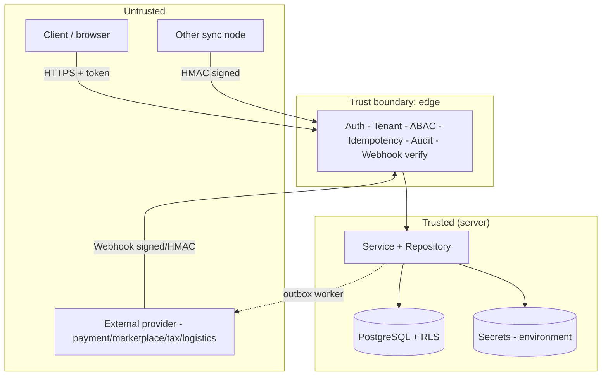
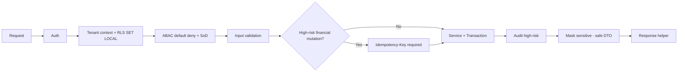

🇬🇧 English (source) · 🇮🇩 [Bahasa Indonesia](20_threat_model_security_architecture.id.md)

# Part 20 — Threat Model and Security Architecture

> **Design-era snapshot (written before the first module existed; the repo now
> holds 21 modules).** The status of the **live and verified** controls lives in
> [`standar-performa-dan-keamanan.md`](standar-performa-dan-keamanan.md) —
> read that document for the current state; this document remains useful as the
> threat model and the reasoning behind the design.

> **Document status — IMPORTANT.** The `awcms` repo is only at the re-foundation
> stage ([ADR-0001](../adr/0001-rebuild-on-awcms-foundation-erp-scope.md)) —
> **not a single ERP module has been implemented**, there is no
> SQL migration, there is no endpoint. The source document (awcms-mini) describes
> controls that are **actually implemented and verified live** in that
> base (compliance audit 2026-07-06, with concrete
> file/function/query path references). This document **adapts the same mechanisms and
> architecture patterns** as a **target design/plan** for
> awcms — every "✅ satisfied" claim in the source document is downgraded
> here to **"planned, to be re-verified"** once the relevant module
> is actually built. The file/function paths mentioned are the
> **planned locations** following the base's pattern, not code that already exists.
> Sections in the source document that are purely CMS-specific (e.g. the web visitor
> analytics epic) are **removed** because they are not relevant to the
> ERP scope; in their place, this document **adds** ERP-specific
> threat surfaces (financial data integrity, payroll PII, double-posting/
> double-payment, and forged external integration webhooks) — see
> §ERP-specific threats below.

This document summarises the **threat model** and the **security architecture** of AWCMS as an ERP base. The vulnerability reporting policy is in [`SECURITY.md`](../../SECURITY.md); the underlying decisions are in [`docs/adr/`](../adr/README.md).

## Protected assets

| Asset                            | Example                                                              | Sensitivity          |
| -------------------------------- | -------------------------------------------------------------------- | -------------------- |
| Authentication credentials       | password hash, session token, JWT secret                             | Critical             |
| Sensitive identifiers            | NPWP, NIK, email, phone number (hash + mask)                         | High                 |
| Payroll data & employee PII      | salary, wage components, civil registry data, employee bank accounts | Critical             |
| Financial data                   | journals, general ledger, account balances, bank reconciliation      | Critical (integrity) |
| Cross-tenant data                | every tenant-scoped row                                              | High                 |
| External integration credentials | payment gateway/marketplace/Coretax/logistics API keys               | Critical             |
| Audit trail & security events    | audit log, decision log, posting/approval trail                      | High (integrity)     |
| Provider/infra secrets           | object storage keys, sync HMAC, DB URL, webhook secret               | Critical             |
| Contracts & standards            | OpenAPI/AsyncAPI, migrations                                         | Medium (integrity)   |

## Trust boundaries

Principle: **all input from the untrusted zone is validated and not trusted**; the tenant/identity values come from the auth middleware, not from raw public headers. For ERP this explicitly includes **webhook payloads from payment gateways/marketplaces/Coretax/logistics** — those payloads are untrusted input until their signature/HMAC is verified, exactly like a request from a browser.

## Threat model (STRIDE, condensed)

| Threat                     | Example                                                    | Planned mitigation                                                                                      |
| -------------------------- | ---------------------------------------------------------- | ------------------------------------------------------------------------------------------------------- |
| **Spoofing**               | Impersonating a user/tenant/node/provider                  | Validated auth token; sync HMAC + anti-replay; webhook signature verify; tenant context from middleware |
| **Tampering**              | Changing data/retroactive corrections, ledger manipulation | Immutability of posted data (journals/financial transactions); append-only audit; RLS `FORCE`           |
| **Repudiation**            | Denying an action (e.g. PO/payment approval)               | High-risk audit + decision log with correlation ID                                                      |
| **Information disclosure** | Cross-tenant / payroll data / financial data leak          | Layered RLS + `tenant_id` filter; PII & salary data masking/redaction; errors without stack traces      |
| **Denial of service**      | Saturating the DB/pool, flooding with fake webhooks        | Work-class pool + backpressure → `503 DATABASE_BUSY`; statement timeout; inbound webhook rate limit     |
| **Elevation of privilege** | Escalating access rights, approval without SoD             | ABAC default-deny, deny overrides allow; non-superuser DB role; self-approval & SoD rejected            |

## Layered security controls

1. **Transport & session** — HTTPS in production, `HttpOnly`/`Secure`/`SameSite` cookies, session TTL, login lockout.
2. **Authorization** — RBAC + ABAC default-deny + segregation of duties (SoD) for financial flows, plus RLS.
3. **Data integrity** — transactions, idempotency (mandatory for journal posting/payment/PO), immutability, soft delete.
4. **Confidentiality** — hash+mask identifiers & payroll data, log/audit redaction, secrets only from the environment.
5. **Availability** — pooling/backpressure, offline-first outbox, per-provider circuit breaker for external integrations.
6. **Supply chain** — Bun-only, Dependabot, CodeQL, locked lockfile.
7. **External integration integrity** — signature/HMAC verification on every inbound webhook, idempotency on every callback that can trigger a financial effect (see §ERP-specific threats).

## Secret handling

- Secrets only from the **environment**; `.env` is ignored, `.env.example` holds placeholders only.
- External integration credentials (payment gateway, marketplace, Coretax, logistics) follow the same pattern: only from the environment/a tenant-scoped secret store, never hardcoded and never returned raw in a response DTO.
- Boot validates the configuration (fail-fast); a flag that is active without credentials → start fails.
- Redaction is mandatory for sensitive keys (including integration API keys, payroll data) before anything enters the log/audit.
- CI rejects committed `.env` files and non-Bun tooling.

## Sensitive data & privacy

- Sensitive identifiers (NPWP/NIK/email/phone) are stored as `value_hash` (lookup/dedup) + `masked_value` (display); raw values are not stored raw beyond an explicit operational need.
- Payroll data (salary, wage components, employee bank accounts) is treated as the highest sensitivity class alongside credentials: access is restricted to the `hr_payroll`/`payroll_admin` roles, masking on cross-role reports is mandatory, and auditing read access to individual payroll data is being considered as an additional control (not just auditing mutations).
- Data classification & retention will be documented in `04_erd_data_dictionary.md` (not written yet) once the ERP data schema is designed.
- Soft-deleted data is still tenant-scoped, is still subject to RLS, and is still covered by retention/legal hold — including archived financial and payroll data.

## Repository security automation

| Control                                                             | Location (planned)             |
| ------------------------------------------------------------------- | ------------------------------ |
| Secret scanning + push protection                                   | GitHub (repo settings)         |
| Dependabot alerts + updates                                         | `.github/dependabot.yml`       |
| CodeQL code scanning                                                | `.github/workflows/codeql.yml` |
| Lint + docs-check + typecheck + unit test + Bun-only/no-`.env` gate | `.github/workflows/ci.yml`     |
| Private vulnerability reporting                                     | `SECURITY.md`                  |

## Limitations (what is not covered yet)

The controls in this document are a **design, not an implementation status** — not a single module had been built in awcms when this document was written. Every control must be re-verified concretely (automated tests + live verification, the same pattern as `security-readiness.ts` in the awcms-mini base) when the relevant module is built. What stays out of scope for this base by design (the responsibility of the deployment layer/derived application): WAF, rate limiting at the edge/proxy, centralised secret management (vault), host hardening, real TLS certificate provisioning, and centralised monitoring/SIEM.

## OWASP / ASVS / ISO 27001 compliance matrix — target, not yet verified

The matrix structure below follows the awcms-mini base compliance audit pattern (mapping project controls onto industry standard frameworks for external audit readiness). **Unlike the source document, the "Evidence" column here holds planned mechanisms, not existing file/function paths** — because there is no code yet. Status legend: 🎯 planned (no code to verify yet) · ⚠ known gap that will need closing · ➖ outside the scope of this generic base.

### OWASP Top 10 (2021)

| #   | Category                           | Status | Planned mitigation                                                                                                                                                                                                                                                                                                                                          |
| --- | ---------------------------------- | ------ | ----------------------------------------------------------------------------------------------------------------------------------------------------------------------------------------------------------------------------------------------------------------------------------------------------------------------------------------------------------- |
| A01 | Broken Access Control              | 🎯     | ABAC default-deny + deny-overrides + SoD for financial flows (doc 17); RLS `ENABLE`+`FORCE` on every tenant-scoped table; non-superuser/non-BYPASSRLS DB app role; every tenant-scoped query goes through an equivalent `withTenant()` helper.                                                                                                              |
| A02 | Cryptographic Failures             | 🎯     | argon2id passwords; opaque session tokens (hash-only at rest); sensitive identifiers & payroll data as `value_hash`+`masked_value`; `HttpOnly`+`SameSite`+`Secure` cookies.                                                                                                                                                                                 |
| A03 | Injection                          | 🎯     | Every query goes through a parameterised tagged template; no SQL string concatenation; HTML output escaped automatically by Astro.                                                                                                                                                                                                                          |
| A04 | Insecure Design                    | 🎯     | This threat model itself (STRIDE); immutability of posted data (journals/financial transactions); idempotency on high-risk mutations; self-approval & SoD workflow rejected; fail-closed default tenant context.                                                                                                                                            |
| A05 | Security Misconfiguration          | 🎯     | Secrets only from `process.env`; CI rejects a committed `.env`; errors without stack traces; security response headers (CSP/HSTS/X-Frame-Options/etc.) planned from the start, not patched on afterwards the way the gap finding in the base was.                                                                                                           |
| A06 | Vulnerable/Outdated Components     | 🎯     | Bun-only, minimal dependencies; Dependabot + CodeQL active from the start.                                                                                                                                                                                                                                                                                  |
| A07 | Identification & Auth Failures     | 🎯     | **Per-principal** lockout — one counter per human, across every tenant ([ADR-0086](../adr/0086-the-lockout-counter-is-global.md), closing #430) — + source+tenant rate limit from the start (not patched in after an incident like in the base); anti-enumeration on login/forgot-password; session TTL + explicit revoke on logout.                        |
| A08 | Software & Data Integrity Failures | 🎯     | Sync/upload object checksums; append-only audit; migration checksum in the runner; CodeQL.                                                                                                                                                                                                                                                                  |
| A09 | Logging & Monitoring Failures      | 🎯     | High-risk audit + decision log + correlation ID; mandatory redaction (including payroll/financial data) before log/audit.                                                                                                                                                                                                                                   |
| A10 | SSRF                               | 🎯     | External provider URLs (payment gateway/marketplace/Coretax/logistics) always come from validated tenant/env configuration; per-provider circuit breaker; the tenant-configured URL case (e.g. OIDC issuer, custom webhook endpoint) is treated as an explicitly documented accepted risk, not silently assumed safe — following decision #603 in the base. |

### OWASP ASVS (relevant L1/L2)

| Area                            | Status | Planned mitigation                                                                                                                                                                                                     |
| ------------------------------- | ------ | ---------------------------------------------------------------------------------------------------------------------------------------------------------------------------------------------------------------------- |
| V2 Auth                         | 🎯     | Modern hashing (argon2id), lockout + rate limit, a new session token on every login, logout revokes the session (deletes the DB row).                                                                                  |
| V3 Session                      | 🎯     | `HttpOnly`+`SameSite`+`Secure` cookies (prod); server-side opaque token; session TTL.                                                                                                                                  |
| V4 Access Control               | 🎯     | Default deny, checked per request; RLS defense-in-depth; IDOR prevented via a consistent tenant-context helper; SoD for financial flows (ERP-specific, see doc 17).                                                    |
| V5 Validation/Encoding          | 🎯     | Input validation on every endpoint; automatic Astro output encoding; CSRF via the built-in `checkOrigin`.                                                                                                              |
| V7 Error/Logging                | 🎯     | Errors without internal detail; logs without sensitive data (redaction mandatory).                                                                                                                                     |
| V9 Communications               | 🎯/➖  | TLS in production (deploy template, certificate provisioning is the operator's responsibility); HMAC for machine-to-machine sync and inbound webhooks.                                                                 |
| V12 Files                       | 🎯     | Checksum verified before upload; the path/object never comes from untrusted input.                                                                                                                                     |
| V14 HTTP Security Configuration | 🎯     | CSP, `X-Content-Type-Options`, `X-Frame-Options`, `Referrer-Policy`, `Permissions-Policy`, HSTS — planned from the first module built, scheduled into the CI/readiness gate, not patched reactively after an incident. |

### ISO/IEC 27001:2022 Annex A (code-relevant)

| Control                           | Status | Planned mitigation                                                                                                                                                        |
| --------------------------------- | ------ | ------------------------------------------------------------------------------------------------------------------------------------------------------------------------- |
| A.5.15 Access control             | 🎯     | ABAC default-deny + RLS FORCE + financial SoD.                                                                                                                            |
| A.5.17 Authentication information | 🎯     | argon2id password hash; hash-only session token.                                                                                                                          |
| A.8.2 Privileged access rights    | 🎯     | Separate DB roles (app/worker/setup/migration), least-privilege, none of them superuser.                                                                                  |
| A.8.5 Secure authentication       | 🎯     | Lockout + rate limit + modern hashing + CSRF checkOrigin.                                                                                                                 |
| A.8.12 Data leakage prevention    | 🎯     | Masking/redaction of sensitive identifiers & payroll data.                                                                                                                |
| A.8.15 Logging                    | 🎯     | Append-only audit trail + decision log + correlation ID; explicit retention + scheduled purge.                                                                            |
| A.8.16 Monitoring                 | ⚠      | Structured logs are planned; centralised aggregation/alerting (SIEM) is the responsibility of the derived operational/deployment layer.                                   |
| A.8.24 Cryptography               | 🎯     | Argon2id (passwords), SHA-256 (tokens, checksums, CSP hashes), HMAC (sync & webhooks).                                                                                    |
| A.8.28 Secure coding              | 🎯     | The coding standard guardrail (not written yet, doc 10) will enforce tagged-template queries, standard response helpers, ABAC/RLS/audit/idempotency per endpoint; CodeQL. |
| A.8.31 Separation of environments | 🎯     | `APP_ENV` gates sensitive behaviour; separate app vs migration DB roles.                                                                                                  |

The matrix above **will be re-audited factually** (with concrete file/function path evidence, exactly like the source document) every time a group of modules is finished — not claimed satisfied up front.

## ERP-specific threats

This section is **new** compared with the source document — awcms-mini is CMS/POS-oriented and does not cover the following finance-heavy threat surface. The ERP scope (finance/accounting, inventory, procurement, manufacturing, payroll, plus payment gateway/marketplace/tax/logistics integrations) introduces a class of risk with higher and more direct consequences (real financial loss, tax compliance, employee PII leakage) than a generic CMS threat model.

### Financial data integrity (ledger manipulation)

| Risk                                                  | Planned mitigation                                                                                                                                                                                          |
| ----------------------------------------------------- | ----------------------------------------------------------------------------------------------------------------------------------------------------------------------------------------------------------- |
| Journals/transactions changed retroactively           | A **posted** journal entry is append-only/immutable; corrections happen only through a reversing entry recorded as a new transaction, never an `UPDATE`/`DELETE` on a posted row.                           |
| Account balances manipulated through direct DB access | RLS `FORCE` + a non-superuser DB role prevent bypassing the application; a checksum/hash chain over posting batches is being considered as an additional control (tamper detection) for the general ledger. |
| Approval matrix bypassed for high-value posting       | ABAC policy #6 (doc 17: approval threshold) + SoD (policy #5) — the journal creator must not also be the approver; approvals above the value threshold require an explicit approval role.                   |
| Financial audit trail forged/deleted                  | Append-only audit with a correlation ID; every financial posting/approval/reversal falls into the high-risk category that must be recorded in the decision log.                                             |

### Double-posting and double-payment

| Risk                                                                        | Planned mitigation                                                                                                                                                                                                                                                       |
| --------------------------------------------------------------------------- | ------------------------------------------------------------------------------------------------------------------------------------------------------------------------------------------------------------------------------------------------------------------------ |
| A client retry triggers a duplicate journal posting/payment                 | An `Idempotency-Key` is mandatory for every high-risk financial mutation (journal posting, payment, cash receipt/disbursement) — the same pattern the base requires for any high-risk mutation, with the coverage explicitly widened in ERP to every financial endpoint. |
| A payment gateway webhook callback is re-delivered (at-least-once delivery) | Idempotency on the webhook consumer side (dedup by `provider_event_id`, not just a client-side `Idempotency-Key`) — the payment status is updated idempotently rather than adding a financial effect every time the callback is received again.                          |
| Race condition between two concurrent PO/payment approval requests          | Row-level lock (`SELECT ... FOR UPDATE`) or compare-and-swap on the financial state transition, following the MFA/TOTP regression fix pattern in the awcms-mini base (a separate SELECT-then-UPDATE under READ COMMITTED proved race-prone).                             |

### Payroll & PII leakage/misuse

| Risk                                                                   | Planned mitigation                                                                                                                                                                                       |
| ---------------------------------------------------------------------- | -------------------------------------------------------------------------------------------------------------------------------------------------------------------------------------------------------- |
| Salary/employee bank account data leaks across roles                   | ABAC policy #8 (doc 17: tax/PII masking) — only the `payroll_admin`/`hr_payroll` roles see full salary data; other roles see a masked/aggregate version.                                                 |
| Payroll export without approval                                        | ABAC policy #10 (doc 17: export approval) extended to payroll export, not only Coretax.                                                                                                                  |
| Bulk read access to individual payroll data is abused (insider threat) | Under consideration: auditing read access (not only mutations) to individual payroll data, given that its sensitivity is on a par with authentication credentials.                                       |
| Payroll data written to the log/audit without redaction                | Mandatory redaction (sensitive payroll keys added to the generic redaction key list: salary, `bank_account`, NIK, etc.) before it enters the log/audit — extending the base's generic redaction pattern. |

### Forged integration/webhooks from external providers

| Risk                                                                                                                             | Planned mitigation                                                                                                                                                                                                                                                                |
| -------------------------------------------------------------------------------------------------------------------------------- | --------------------------------------------------------------------------------------------------------------------------------------------------------------------------------------------------------------------------------------------------------------------------------- |
| A payment gateway/marketplace/Coretax/logistics webhook is spoofed                                                               | Every inbound webhook must have its signature/HMAC verified according to the provider's scheme **before** the payload is trusted or triggers any financial effect — ABAC policy #12 (doc 17: webhook integrity) enforces default-deny for a webhook without a valid signature.    |
| A webhook is replayed to trigger a repeated financial effect                                                                     | Dedup by `provider_event_id`/provider nonce, plus idempotency on the consumer side (see §Double-posting).                                                                                                                                                                         |
| An external provider outage/slowdown locks up other business transactions                                                        | Provider calls always happen outside the DB transaction; a per-provider circuit breaker (payment gateway, marketplace, Coretax, logistics each independent) — one provider's outage must not lock up an unrelated business process.                                               |
| Integration credentials (payment/marketplace/Coretax API keys) leak                                                              | Credentials only from the environment/a tenant-scoped secret store; never returned raw in a response DTO; redaction mandatory in the log.                                                                                                                                         |
| SSRF via a tenant-configured callback/webhook URL                                                                                | A tenant-configured custom callback/webhook URL is treated as a documented accepted-risk case (following the OIDC issuer_url decision pattern in the base) — not silently assumed safe; hostname validation/allow-listing is recommended where the integration scheme permits it. |
| A marketplace/tax/logistics provider returns data that drives the wrong financial state (e.g. an incorrect order/payment status) | State transition validation on the application side (e.g. a payment status must not move backwards from `paid` to `pending` without an explicit path); a scheduled reconciliation job to detect drift between local state and provider state.                                     |

### Business-scope hierarchy (Issue #180)

A generic organisational authorization scope layer (ADR-0030). The generic `(scope_type, scope_id)` reference is resolved through a `BusinessScopeHierarchyPort` supplied by the derived application; the base ships a no-op resolver.

| Risk                                                                                                        | Mitigation                                                                                                                                                                                                                                                                                                                                                                                                               |
| ----------------------------------------------------------------------------------------------------------- | ------------------------------------------------------------------------------------------------------------------------------------------------------------------------------------------------------------------------------------------------------------------------------------------------------------------------------------------------------------------------------------------------------------------------ |
| **Privilege expansion** — an actor raises their own access coverage by assigning themselves a higher scope  | Self-grant (grantor == subject) is rejected in the application layer. Descendant/ancestor coverage comes only from the server-side resolved hierarchy, never the client's `scopeId`. Assignment is high-risk (audit `warning`/`critical`), requires the default-deny `business_scope_assignments.create`/`.revoke` permission. A cross-tenant subject/role is rejected by the composite FK `(tenant_id, …)` + RLS FORCE. |
| **Stale cache / stale hierarchy** — a scope is deleted/moved but an old assignment still permits the action | There is no long-lived authz cache: scope facts are resolved fresh on every decision (`resolveBusinessScopeFacts` + effective dating evaluated against `now`). `resolved: false` (the scope no longer resolves) → descendant/ancestor coverage disappears, and exact-match high-risk actions are rejected (fail-closed). Revocation/expiry takes effect immediately without waiting for a job.                           |
| **Hierarchy cycle / depth-bomb** — a cyclic or very deep graph hangs the resolver or blows up the cost      | The port contract requires every adapter to be bounded (node/depth limit) + cycle-safe (visited set); the dummy fixture resolver proves it (cycle/depth tests). `resolved: false` from an adapter is never treated as "no restriction".                                                                                                                                                                                  |
| **Scope spoofing** — the client sends a fake `scopeId` as an authorization fact                             | A `scopeId` from the request is **never** trusted as an authorization fact: it is validated server-side through the capability port (tenant-scoped) at create time; coverage in `evaluateAccess` only compares the required scope against already-resolved subject facts. An unknown scope type/unresolved → default-deny.                                                                                               |

### Segregation of duties (Issue #181)

A generic SoD boundary layer (ADR-0031) — conflict detection + exception/override, on top of the #180 business-scope hierarchy. Generic rules are code-only from the derived application (the base does not hardcode domain rules); enforcement happens at two points (assignment-time + action-time fail-closed).

| Risk                                                                                                                    | Mitigation                                                                                                                                                                                                                                                                                                                                                                                       |
| ----------------------------------------------------------------------------------------------------------------------- | ------------------------------------------------------------------------------------------------------------------------------------------------------------------------------------------------------------------------------------------------------------------------------------------------------------------------------------------------------------------------------------------------ |
| **Privilege accumulation** — one subject accumulates both sides of a conflict over time/roles until they own the cycle  | The conflict facts merge TWO sources (business-scope assignments + ordinary RBAC grants), so it is not blind to a role that holds both sides. Rejected with `sod_conflict` at assignment time AND `SOD_CONFLICT` (403) when the high-risk action is executed (fail-closed, deny-overrides-allow). Every deny goes into the append-only decision log + a counter.                                 |
| **Collusion** — the maker & the checker conspire to bypass the separation                                               | The generic maker/checker rule separates create from approve. Overrides only happen via an exception that: requires a **dedicated** approve permission (≠ create), **must not be self-approved** (approver ≠ requester, re-checked from the DB row), audit `critical`. A rule can forbid exceptions entirely (`allowed: false`) — e.g. over the override mechanism itself (recursion prevented). |
| **Stale exception** — an expired/revoked override is still used to bypass a conflict                                    | The authoritative gate is `effective_to` vs `now` (status is only a cache): an `approved` exception that is past its validity **or** has been revoked immediately stops applying on the next decision, without waiting for an expiry job. There is no long-lived authz cache; facts are resolved fresh on every decision.                                                                        |
| **Self-approval** — the requester approves their own exception                                                          | `approveSoDConflictException` rejects when `requested_by == actor` (read from the row, not the body). The CAS `WHERE status='pending'` makes approve/revoke race-safe (concurrency test: exactly one succeeds).                                                                                                                                                                                  |
| **Cross-tenant exception** — a tenant A exception is used to close a conflict in tenant B                               | Composite FK `(tenant_id, …)` (RI checks bypass RLS — GHSA-r7cx-c4jh-cvvw) + RLS `FORCE`; lookup queries are tenant-filtered. Proven under the non-superuser `awcms_app` role (tenant B: 0 rows from tenant A).                                                                                                                                                                                  |
| **DoS via expensive evaluation** — a subject with hundreds of permissions/assignments blows up the conflict check (N+1) | Evaluation is bounded: facts are resolved with a fixed number of SELECTs (two), exception lookup is a single batched query, detection is in-memory and indexed. The query count does not grow with the size of the subject (query-count test: small == large). A cheap short-circuit when the requested key is not referenced by any rule.                                                       |

## Generic architecture patterns inherited from the base (condensed)

The following patterns from awcms-mini are generic and directly reusable for awcms; the full detail (function/file names, issue numbers) is not reproduced here because it is specific to the awcms-mini implementation, whose structure will not necessarily be identical in awcms — it will be re-documented with concrete evidence when the relevant module is built:

- **DB role separation** (app/worker/setup/migration), each least-privilege according to the code path it actually uses, including global (non-RLS) tables that must be explicitly narrowed from the over-broad `ALTER DEFAULT PRIVILEGES` default.
- **Online auth hardening** (rate limit + lockout, MFA/TOTP, SSO/OIDC with mandatory break-glass, a per-provider circuit breaker that does not equate a valid 4xx with a transport failure) — the same applies to awcms if/when a similar online-auth feature is built.
- **Request smuggling/Content-Length defenses** on upload/large-object endpoints.
- **Observability**: structured audit trail, correlation ID, retention + scheduled purge, mounting points for an external log/audit sink (no-op by default) for derived applications.
- **Domain event archive/replay integrity**: checksums on archive artifacts, idempotent UPSERT on rollup/aggregation jobs, prevention of SQL injection through dynamic table/column names (registry-validated allowlist, not from request input).

Every pattern above will be adapted and re-verified concretely (real function/file/test) once the module that needs it is actually built in awcms.

## Additional standards triggered by the dynamic ABAC policy evaluator (Issue #179, epic #177)

Connecting the stored `awcms_abac_policies` policies to the `authorizeInTransaction` chokepoint (default-deny, [ADR-0033](../adr/0033-abac-dynamic-policy-evaluator.md)) widens the authorization surface from "code + role permissions" to "code + role permissions + **policy data an admin can author**". The new threats that are acknowledged, and their controls:

| Threat (STRIDE)                                                                                | Control                                                                                                                                                                                                                                                                                                                                                                                                                                                                                                                                                                                                                                                                                                                                                                                                                        |
| ---------------------------------------------------------------------------------------------- | ------------------------------------------------------------------------------------------------------------------------------------------------------------------------------------------------------------------------------------------------------------------------------------------------------------------------------------------------------------------------------------------------------------------------------------------------------------------------------------------------------------------------------------------------------------------------------------------------------------------------------------------------------------------------------------------------------------------------------------------------------------------------------------------------------------------------------ |
| **Elevation of Privilege** — an `allow` policy is used to grant a permission the subject lacks | The precedence model (ADR-0033): the RBAC permission **is still required**; an `allow` policy only **narrows** (constrains) a permission that is already held, it never creates one. Tested in `evaluateAccess`: allow-policy + an empty granted-set → `default_deny`.                                                                                                                                                                                                                                                                                                                                                                                                                                                                                                                                                         |
| **Tampering** — code/SQL injection through a policy condition                                  | The evaluator is a **pure interpreter** over a restricted AST — no `eval`/`new Function`/dynamic import/templated SQL. Attributes come from a closed allow-list (own-property, anti prototype-chain); operators from a fixed set. No policy string is ever executed or interpolated into SQL.                                                                                                                                                                                                                                                                                                                                                                                                                                                                                                                                  |
| **Tampering** — subject attributes are forged through the request body                         | `subject.*` is resolved **only** from the authenticated `TenantContext`, never from the body. `resource.*` must be filled in by the endpoint from a verified resource (ownership checked against the real row). `env.*` is server-derived; `env.ipTrusted` defaults to `false` (fail-closed).                                                                                                                                                                                                                                                                                                                                                                                                                                                                                                                                  |
| **Information Disclosure** — cross-tenant policies/decisions                                   | The evaluator never reads across tenants: policy loading always happens inside `withTenant` (RLS + the non-superuser `awcms_app` role, FORCE RLS), and the cache is **tenant-keyed**. Cross-tenant integration test.                                                                                                                                                                                                                                                                                                                                                                                                                                                                                                                                                                                                           |
| **Information Disclosure** — foreign subjects enumerated via simulation                        | Simulating a hypothetical subject = the `analyze` capability; simulating a **different existing** tenant user resolves real grants → it **also** requires `identity_access.access_control.read` (AWCMS has no `user_management` module), otherwise → `403`. The probed subject id is recorded in the audit. Integration test.                                                                                                                                                                                                                                                                                                                                                                                                                                                                                                  |
| **Information Disclosure** — PII leaking into the decision log / preview                       | The decision log only records the policy code + version + a static reason; resource/subject attribute values are never written. Simulation only returns a structural boolean per policy. Integration test ("decision log without PII").                                                                                                                                                                                                                                                                                                                                                                                                                                                                                                                                                                                        |
| **Denial of Service** — pathological conditions (deep nesting / many nodes)                    | The parser bounds the AST depth (`MAX_DEPTH=32`) and the node count (`MAX_NODES=512`); beyond the limits → invalid. The request body size is bounded.                                                                                                                                                                                                                                                                                                                                                                                                                                                                                                                                                                                                                                                                          |
| **Bypass** — an invalid/erroring policy silently allows                                        | Fail-closed in two layers: (1) authoring — only a valid DSL is stored/activated; (2) evaluation — an active but invalid policy, a DSL version that is too new, or any evaluation error → DENY. A **mutation test** proves it: flipping the "unknown → deny" default to "allow" turns the tests red (+17 prototype-key tests).                                                                                                                                                                                                                                                                                                                                                                                                                                                                                                  |
| **Bypass** — changing a policy through the flat #171 CRUD with no effect                       | The flat `/api/v1/abac/policies` surface (#171) writes the same table and still calls `invalidatePolicyCache` after commit (now a defensive no-op) — it is not a way to bypass the evaluator.                                                                                                                                                                                                                                                                                                                                                                                                                                                                                                                                                                                                                                  |
| **Denial of Service** — a flat #171 `deny` bricks an entire tenant (lockout with no recovery)  | **Mitigated (structurally).** The flat surface cannot scope or condition a policy, so a flat `deny` used to be wildcard + always-true = denying EVERY request (including the operator's own `access_control.configure` → no in-band recovery). The `is_dsl_managed` discriminator (`sql/031`, default `false`) means a flat row is **never consumed** by the evaluator (`policy-cache.ts` filters on `is_dsl_managed`); **only** the DSL surface sets it to `true`. The migration is deploy-safe (inert flat rows are not activated). Part B (the DSL validator) rejects an unscoped+unconditional `deny`. Residual: a scoped/conditional `deny` is a deliberate admin capability (self-inflicted DoS), recoverable via another admin. Tested: the "flat deny INERT" integration regression + Part B unit tests (ADR-0033 §3). |

### Limitations recorded, not ignored (ABAC evaluator)

- **Per-process cache invalidation.** Deterministic within a single instance; a multi-instance deployment needs a cross-instance signal (LISTEN/NOTIFY or a short TTL) — recorded, not assumed away.
- **`env.ipTrusted` defaults to `false`.** Until a deployment installs a trusted-network resolver, policies that depend on it behave fail-closed.
- **`resource.*` is only correct if the endpoint fills it from the real resource.** An endpoint that echoes client input back without verification weakens the ownership check — this convention is enforced through review + the DSL header, not by a runtime mechanism in the base.
- **Business-scope hierarchy (#180) & SoD (#181)** remain separate child issues; this evaluator does not weaken the existing SoD/business-scope guards.
