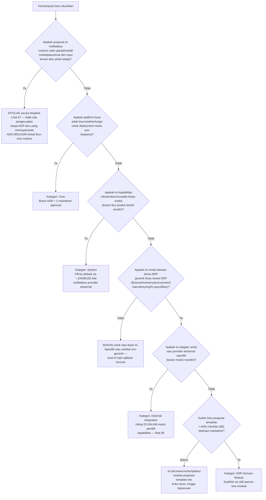

🇮🇩 Bahasa Indonesia · 🇬🇧 [English (source)](21_module_admission_governance.md)

<!-- i18n-source-hash: sha256:4b17148a89952614fd1e27f684b198b9f9a00df1594bd8d98f3f5c104500a2c8 -->

# Bagian 21 — Module Admission, Lifecycle, dan Registry Governance

> **Status:** Diadaptasi dari `docs/awcms-mini/21_module_admission_governance.md`. Mekanisme admission (lima kategori modul, pohon keputusan, trusted static registry policy) bersifat **generik dan langsung berlaku** untuk repo `awcms` ini. **Yang TIDAK berlaku langsung**: peta modul konkret di dokumen asal (16 modul terdaftar, isu/ADR spesifik repo asal) — karena `awcms` **belum memiliki satu pun modul terimplementasi** (lihat [ADR-0001](../adr/0001-rebuild-on-awcms-foundation-erp-scope.md)). Bagian §8 dokumen ini karena itu berisi **peta target ilustratif** untuk modul ERP yang direncanakan (doc 11), bukan pemetaan modul yang sudah ada di `src/modules/index.ts` — registry nyata masih kosong.
> **Terkait:** ADR-0001 (rebuild sebagai platform ERP). ADR pendukung governance modul lain (admission Core/System, extension layer, composisi registry) akan dicatat sebagai ADR terpisah begitu diperlukan, mengikuti pola `docs/adr/0012`–`0014` di repo asal.

## 1. Konteks dan tujuan

Repo ini dimulai ulang sebagai platform **ERP + integrasi bisnis** tanpa satu pun
modul domain diimplementasikan. `src/modules/index.ts` belum ada (folder `src/`
belum dibuat). Sebelum modul pertama ditulis, admission dan ownership rules
harus eksplisit sejak awal — itulah tujuan dokumen ini, diwariskan dari standar
yang sudah terbukti di base `awcms-mini`.

Dokumen ini mendefinisikan:

1. Lima kategori modul dan pohon keputusan admission.
2. Kriteria admission, status lifecycle, aturan dependency, security review,
   ownership, dan kebijakan deprecation/removal per kategori.
3. Ekspektasi kompatibilitas offline/LAN vs full-online-only.
4. Kebijakan trusted static registry dan larangan eksplisit terhadap
   runtime code upload/install/marketplace.
5. Proposal template ringan + architecture decision checklist (akan dibuat
   di `docs/awcms/templates/` begitu modul pertama diajukan).
6. Peta target modul ERP + integrasi bisnis yang direncanakan (§8) — **bukan**
   pemetaan modul yang sudah ada, karena belum ada modul apa pun di registry.

**Yang menjadi guardrail keras** (tidak dilonggarkan oleh dokumen ini):
registry modul tetap **statis, tepercaya, hanya lewat kode yang di-review lewat
PR normal** — lihat §7. Tidak ada infrastruktur marketplace atau runtime
install yang dibangun oleh dokumen ini.

## 2. Lima kategori modul

| Kategori                           | Definisi                                                                                                                                                                                                                                                                                                                                              | Siapa yang memelihara                                    | Bisa dinonaktifkan per tenant?                                                                                                                                                                                         |
| ---------------------------------- | ----------------------------------------------------------------------------------------------------------------------------------------------------------------------------------------------------------------------------------------------------------------------------------------------------------------------------------------------------- | -------------------------------------------------------- | ---------------------------------------------------------------------------------------------------------------------------------------------------------------------------------------------------------------------- |
| **Core**                           | Fondasi wajib: tanpanya platform tidak bisa boot/berfungsi untuk deployment mana pun (tenant, identitas, RLS/ABAC dasar). Selalu aktif di semua profil deployment.                                                                                                                                                                                    | Maintainer base (`@ahliweb`, lihat `.github/CODEOWNERS`) | Tidak — tidak pernah `disabled` secara global; per-tenant enable/disable (`awcms_tenant_modules`) tidak berlaku bermakna karena modul lain bergantung padanya secara transitif.                                        |
| **System**                         | Kapabilitas platform lintas-modul (observability, sync/offline infra, email generik, reporting generik, workflow generik, module management itu sendiri). Bersifat infrastruktur/reusable, bukan fitur produk end-user yang berdiri sendiri. Bisa off secara default (feature flag) tanpa menghentikan Core.                                          | Maintainer base                                          | Sebagian besar ya, lewat `*_ENABLED` env flag (default off) — bukan status modul, karena modul-modul ini sendiri harus tetap terdaftar (statusnya `active`) supaya `bun run db:migrate`/registry sync tetap konsisten. |
| **ERP Domain Module**              | Modul domain bisnis inti platform ERP ini sendiri: finance-accounting, inventory-warehouse, procurement, manufacturing, hr-payroll, tax-coretax. Bernilai bisnis langsung, opt-in per tenant sesuai paket/kebutuhan tenant. **Berbeda dari awcms-mini**: di repo ini modul domain ERP HIDUP di repo base ini sendiri, bukan di repo aplikasi turunan. | Maintainer platform                                      | Ya — `awcms_tenant_modules` per tenant (mis. tenant yang tidak butuh manufacturing bisa menonaktifkannya).                                                                                                             |
| **Derived Application (vertikal)** | Modul spesifik vertikal bisnis non-generik di atas platform ERP ini (mis. kustomisasi industri tertentu yang tidak generik untuk semua tenant ERP) — bila suatu hari perlu, hidup di repo/branch aplikasi turunan terpisah, bukan di repo ini.                                                                                                        | Tim aplikasi turunan masing-masing                       | N/A — di luar registry base sepenuhnya.                                                                                                                                                                                |
| **External Integration**           | Adapter provider eksternal (payment gateway, marketplace, tax/Coretax upload, logistik, Cloudflare R2, OIDC, dsb.) — **bukan** modul top-level terpisah secara default, melainkan sub-komponen di dalam modul System/ERP Domain yang memilikinya (mis. `finance-accounting` → payment gateway, `sync-storage` → R2, `tax-coretax` → Coretax XML).     | Modul pemilik kapabilitas                                | Ya — selalu opt-in via `*_ENABLED`, default off.                                                                                                                                                                       |

Field `ModuleType` (`src/modules/_shared/module-contract.ts`, akan dibuat di
Sprint 1 — lihat doc 11) direncanakan punya lima nilai —
`"base" | "system" | "domain" | "integration" | "derived"` — yang dipetakan ke
kategori di atas: `base`→Core, `system`→System, `domain`→ERP Domain Module,
`integration`→External Integration (bila suatu hari perlu jadi modul
top-level tersendiri, bukan sub-komponen), `derived`→Derived Application
(nilai ini tidak akan dipakai oleh modul apa pun di repo `awcms` ini sendiri —
hanya relevan bila suatu hari ada repo aplikasi turunan yang mem-vendor tipe
yang sama).

## 3. Pohon keputusan admission

Gunakan pohon ini untuk memutuskan **di repo mana** dan **kategori apa**
sebuah kemampuan baru harus masuk, sebelum menulis kode apa pun.

`Q5` sengaja ditempatkan **sebelum** `Q1` (bukan hanya di satu cabang) — setiap
kategori (Core/System/Derived/External Integration/ERP Domain Module)
melewati gate ini terlebih dahulu, tanpa jalur pintas mana pun.

Ringkasan tekstual (bila mermaid tidak dirender):

1. **Melibatkan runtime code upload/install/marketplace/eval dari input
   tenant/pihak ketiga apa pun?** → **Ditolak eksplisit**, tanpa pengecualian
   (§7) — gate ini berlaku untuk SEMUA kategori di bawah, bukan hanya ERP
   Domain Module.
2. **Wajib untuk boot di semua profil deployment?** → **Core**.
3. **Bukan Core, tapi infrastruktur reusable lintas-modul (bukan fitur produk
   berdiri sendiri)?** → **System**.
4. **Bukan infrastruktur, tapi juga bukan domain bisnis ERP generik lintas
   tenant (spesifik satu vertikal non-generik)?** → **bukan untuk repo ini**,
   arahkan ke aplikasi turunan.
5. **Domain bisnis ERP generik**, tapi hanya berupa adapter satu provider
   eksternal (payment gateway/marketplace/Coretax/logistik)? → **External
   Integration** di dalam modul pemilik kapabilitas.
6. Sisanya (modul domain ERP generik, opt-in, bukan infrastruktur murni) →
   **ERP Domain Module**, lewat proposal template + ADR checklist (§9)
   sebelum scaffold.

## 4. Kriteria admission per kategori

### 4.1 Core

- Harus punya ADR yang menjelaskan mengapa platform tidak bisa berfungsi
  tanpanya.
- Disetujui minimal dua maintainer bila tersedia (GOVERNANCE.md §Perubahan
  standar).
- Tidak boleh punya dependency ke modul System/ERP Domain Module/External
  Integration manapun (arah dependency selalu dari System/Domain → Core,
  tidak pernah sebaliknya) — akan dijaga otomatis oleh validator dependency
  graph begitu diimplementasikan (lihat doc 11 Sprint 3).
- Tidak boleh memanggil provider eksternal apa pun secara langsung di jalur
  kritikal (harus tetap berfungsi 100% offline/LAN).

Contoh kandidat Core (target, belum diimplementasikan): `tenant_admin`,
`identity_access`, `profile_identity`.

### 4.2 System

- Boleh punya dependency ke Core, tidak boleh ke ERP Domain Module atau modul
  System lain yang menciptakan cycle (dicek otomatis oleh validator dependency
  graph yang sama).
- Bila membungkus provider eksternal (email, sync/R2, DNS): wajib
  off-by-default (`*_ENABLED=false`), wajib lolos checklist §6.
- Wajib punya `jobs`/`health` descriptor bila mengoperasikan proses terjadwal
  (pola `ModuleJobDescriptor`/`ModuleHealthContract`, lihat doc 10).

Contoh kandidat System (target): `module_management`, `observability_logging`,
`sync_storage`, `email`, `reporting`, `workflow`, `database_connectivity`.

### 4.3 ERP Domain Module

- Harus generik untuk **semua** tenant ERP potensial, bukan spesifik satu
  vertikal non-generik (lihat pohon keputusan §3, node Q3). Finance,
  inventory, procurement, manufacturing, hr-payroll, dan tax-coretax lolos
  kriteria ini karena kebutuhan lintas industri (manufaktur, jasa, dagang,
  dst.), bukan spesifik satu vertikal.
- Wajib bisa dinonaktifkan per tenant tanpa merusak Core/System manapun
  (`awcms_tenant_modules`, dicek oleh validator dependency cycle + lifecycle).
- Wajib melalui proposal template + ADR checklist (§9) sebelum scaffold kode
  dimulai.
- Wajib mendeklarasikan `type: "domain"` di `module.ts`-nya sendiri.

Contoh kandidat ERP Domain Module (target, lihat doc 11): `finance-accounting`,
`inventory-warehouse`, `procurement`, `manufacturing`, `hr-payroll`,
`tax-coretax`.

### 4.4 Derived Application (vertikal)

- **Tidak pernah** diajukan sebagai PR ke repo base ini bila sifatnya spesifik
  satu vertikal non-generik (mis. kustomisasi industri retail/manufaktur
  tertentu yang tidak relevan untuk tenant ERP lain).
- Bila sebuah modul vertikal terbukti benar-benar generik lintas banyak tenant
  ERP sehingga layak naik jadi ERP Domain Module base, itu **keputusan
  maintainer eksplisit** lewat proses §9 — tidak otomatis.

### 4.5 External Integration

- Selalu hidup di dalam modul System/ERP Domain Module pemilik kapabilitas —
  tidak pernah jadi entri top-level baru di `src/modules/index.ts` kecuali
  sebuah proposal eksplisit mengubah ini (butuh ADR baru).
- Wajib lolos checklist §6 secara penuh sebelum merge.

Contoh kandidat External Integration (target): payment gateway (di dalam
`finance-accounting` atau modul integrasi bisnis tersendiri), marketplace
channel, logistics provider, Coretax XML upload (di dalam `tax-coretax`).

## 5. Dependency rules — required vs optional

Ada **dua graf independen** yang akan ada di kode begitu module-contract
diimplementasikan (lihat doc 10 §Module contract) — dokumen ini hanya
menamai kapan masing-masing "required" vs "optional" secara eksplisit:

1. **Lifecycle dependency** (`ModuleDescriptor.dependencies: string[]`) —
   urutan enable/disable per tenant. Sebuah entri di sini **selalu
   diperlakukan sebagai required**: modul pemilik tidak boleh diaktifkan
   sebelum semua dependency-nya aktif, dan tidak boleh dinonaktifkan selama
   ada modul lain yang masih bergantung padanya. Tidak ada konsep "optional
   lifecycle dependency" — bila sebuah hubungan boleh hilang tanpa merusak
   fungsi, itu bukan lifecycle dependency, itu capability dependency (poin 2).
   Contoh: `manufacturing` bergantung pada `inventory-warehouse` (lifecycle
   required, karena work order tidak bermakna tanpa stock movement).
2. **Capability dependency** (`ModuleDescriptor.capabilities.consumes`) —
   hubungan level-source lewat port/adapter, terpisah dari urutan
   enable/disable. Setiap entri wajib menyatakan `optional: true` atau tidak:
   - **Required capability** (`optional` tidak diset/`false`): fitur pemanggil
     tidak bermakna sama sekali tanpa kapabilitas ini.
   - **Optional capability** (`optional: true`): fitur pemanggil terdegradasi
     dengan aman (didokumentasikan per call site) ketika kapabilitas "tidak
     berlaku" untuk tenant/request tertentu — contoh target: `hr-payroll`
     mengonsumsi `finance-accounting` (posting beban gaji) secara **optional**
     bila tenant belum mengaktifkan modul finance (payroll tetap bisa jalan,
     hanya tidak memposting ledger entry otomatis).

**Aturan admission**: modul baru kategori System/ERP Domain Module yang
mengonsumsi kapabilitas modul lain WAJIB mengklasifikasikan setiap `consumes`
entry sebagai required/optional secara eksplisit di `module.ts`-nya, dan
mendokumentasikan di README modul apa yang terjadi saat kapabilitas itu tidak
tersedia (tenant belum enable modul penyedia, atau provider eksternal off).

## 6. Kompatibilitas offline/LAN vs full-online-only

AWCMS defaultnya **offline-first/LAN-first** — perilaku full-online-provider
harus selalu **explicit opt-in**, tidak pernah default. Ini akan ditegakkan
secara mekanis oleh field `profiles` di config registry (`src/lib/config/
registry.ts`, akan dibuat) begitu diimplementasikan: setiap variabel
konfigurasi menyatakan profil deployment mana yang relevan.

| Kelas kompatibilitas                                                         | Definisi                                                                                                                                           | Enforcement mekanis (target)                                                                                                             | Contoh                                                                                                                                                                           |
| ---------------------------------------------------------------------------- | -------------------------------------------------------------------------------------------------------------------------------------------------- | ---------------------------------------------------------------------------------------------------------------------------------------- | -------------------------------------------------------------------------------------------------------------------------------------------------------------------------------- |
| **offline-lan-safe** (wajib untuk Core, direkomendasikan untuk System)       | Modul/fitur berfungsi penuh dengan semua provider eksternal off, tanpa koneksi internet.                                                           | `profiles: ALL_PROFILES` di config registry; default value setiap `*_ENABLED` flag adalah `false`/off.                                   | `tenant_admin`, `identity_access`, `profile_identity`, `observability_logging`, `sync_storage` (mode lokal), `finance-accounting` (posting ledger lokal), `inventory-warehouse`. |
| **full-online-only** (hanya boleh untuk System/External Integration, opt-in) | Fitur hanya bermakna pada profil `production` dengan konektivitas internet — TIDAK BOLEH memblokir/mendegradasi deployment offline-lan ketika off. | `profiles: ONLINE_PROFILES` di config registry; validator config menolak boot bila flag `*_ENABLED=true` tapi kredensial terkait kosong. | Payment gateway callback, marketplace sync, Coretax XML upload resmi (bila suatu hari ada), Cloudflare DNS adapter, Google/SSO login.                                            |

**Kriteria admission wajib**: proposal modul baru harus menyatakan kelas
kompatibilitas di atas untuk setiap kapabilitas yang diusulkan, dan bila
`full-online-only`, harus membuktikan (di proposal atau PR) bahwa profil
`offline-lan` tetap 100% fungsional dengan flag tersebut `false` (test
regresi, bukan klaim naratif).

## 7. Trusted static registry policy — larangan eksplisit

Ini adalah **guardrail keras yang tidak dilonggarkan** oleh dokumen ini
(diwariskan dari kebijakan yang sama di base `awcms-mini`):

1. `src/modules/index.ts` (akan menjadi) **satu-satunya** registry modul.
   Setiap entrinya adalah kode TypeScript yang di-compile ke binary monolith
   yang sama, direview lewat proses PR normal (CODEOWNERS, CI, `bun run
check`), dan di-deploy sebagai satu artefak — **tidak pernah** dimuat
   secara dinamis dari file/URL/paket yang disuplai tenant saat runtime.
2. `awcms_tenant_modules` (DB) **hanya** menyimpan status enable/disable
   boolean untuk modul yang KODENYA SUDAH ADA di binary yang sedang berjalan.
   Mengaktifkan sebuah baris tidak pernah mengambil/mengeksekusi kode baru —
   hanya mengubah cabang runtime yang sudah dikompilasi.
3. **Dilarang eksplisit, tanpa pengecualian** di repo ini: marketplace modul,
   upload plugin/tema/skrip dari tenant, dynamic `import()` dari path/URL yang
   berasal dari input tenant/user, `eval`/`new Function()` yang mengeksekusi
   teks dari luar kode yang di-commit, atau mekanisme apa pun yang
   memungkinkan kode pihak ketiga tereksekusi di proses aplikasi tanpa melalui
   review PR + CI penuh. Ini berlaku ketat untuk modul finance/payroll/tax —
   eksekusi kode tak terverifikasi pada data finansial adalah risiko yang
   tidak dapat diterima.
4. Satu-satunya jalan sebuah kemampuan baru masuk adalah proses admission di
   dokumen ini (§3-§4) yang berujung pada PR normal ke repo ini (untuk
   Core/System/ERP Domain Module) atau ke repo aplikasi turunan (untuk
   Derived Application) — tidak pernah lewat jalur runtime.
5. Bila suatu hari ada kebutuhan bisnis nyata yang tampak membutuhkan
   pelonggaran ini (mis. "tenant ingin upload skrip kustom sendiri untuk
   custom pricing rule"), proposal itu **wajib** melalui ADR baru yang secara
   eksplisit mensupersede ADR-0001 (rebuild sebagai platform ERP) dan/atau ADR
   Bun-only runtime tanpa sandbox eksekusi kode asing — bar yang sangat
   tinggi, dan sampai ADR itu ada serta di-Accept oleh maintainer, proposal
   semacam ini **ditolak di tahap pohon keputusan §3** (node Q5), tanpa
   pengecualian implementasi apa pun.

## 8. Peta target modul ERP → kategori (belum ada modul terimplementasi)

> **USANG per 2026-07-25 — judul dan tabel §8 ini adalah artefak perencanaan
> awal.** Klaim "belum ada modul terimplementasi" / "registry itu belum ada sama
> sekali" **tidak lagi benar**: `src/modules/index.ts` kini punya **20 modul
> aktif** (`news_portal` dilebur ke `blog_content` — [ADR-0044](../adr/0044-merge-news-portal-into-blog-content.md)) dan kolom "Belum diimplementasikan" di bawah salah untuk
> `tenant_admin`, `identity_access`, `profile_identity`, `module_management`,
> `sync_storage`, `reporting`, dan `workflow_approval` — ketujuhnya **sudah
> hidup**. Yang masih akurat: seluruh baris **ERP Domain Module** (finance,
> inventory, procurement, manufacturing, hr-payroll, tax-coretax,
> business-integrations) memang belum ada. Sumber kebenaran registry adalah
> [`../ARCHITECTURE.md`](../ARCHITECTURE.md) + `src/modules/index.ts`, bukan
> tabel ini. Pohon keputusan §3 dan kriteria admission §4 **tetap berlaku** —
> hanya §8 yang basi.

> **Perbedaan penting dari dokumen asal**: tabel di bawah **bukan** pemetaan
> modul yang sudah ada di `src/modules/index.ts` (saat tabel ini ditulis,
> registry itu belum ada sama sekali). Ini adalah **peta target** hasil penerapan pohon keputusan §3 pada
> rencana sprint doc 11, ditulis lebih awal agar admission tiap modul sudah
> jelas kategorinya **sebelum** scaffold pertama dimulai — bukan retrospektif
> seperti di awcms-mini yang menganalisis registry yang sudah berjalan.

| Modul (`key`, rencana)  | Kategori (dokumen ini)   | Sprint (doc 11) | Catatan                                                                                     |
| ----------------------- | ------------------------ | --------------- | ------------------------------------------------------------------------------------------- |
| `tenant_admin`          | Core                     | S2              | Belum diimplementasikan.                                                                    |
| `identity_access`       | Core                     | S2/S3           | Belum diimplementasikan.                                                                    |
| `profile_identity`      | Core                     | S2              | Belum diimplementasikan; dasar untuk employee/supplier/customer profile.                    |
| `module_management`     | System                   | S1              | Belum diimplementasikan.                                                                    |
| `observability_logging` | System                   | S6              | Belum diimplementasikan.                                                                    |
| `database_connectivity` | System                   | S6              | Belum diimplementasikan.                                                                    |
| `sync_storage`          | System                   | S8              | Belum diimplementasikan.                                                                    |
| `reporting`             | System                   | S13             | Belum diimplementasikan.                                                                    |
| `workflow_approval`     | System                   | S14             | Belum diimplementasikan.                                                                    |
| `finance-accounting`    | ERP Domain Module        | S4              | Belum diimplementasikan; general ledger, jurnal, fiscal period.                             |
| `inventory-warehouse`   | ERP Domain Module        | S5              | Belum diimplementasikan; item, stock, warehouse.                                            |
| `procurement`           | ERP Domain Module        | S7              | Belum diimplementasikan; PR/PO, goods receipt.                                              |
| `manufacturing`         | ERP Domain Module        | S9              | Belum diimplementasikan; BOM, work order.                                                   |
| `hr-payroll`            | ERP Domain Module        | S10             | Belum diimplementasikan; employee, attendance, payroll run.                                 |
| `tax-coretax`           | ERP Domain Module        | S11             | Belum diimplementasikan; VAT invoice, Coretax batch.                                        |
| `business-integrations` | ERP Domain Module (host) | S12             | Host untuk sub-komponen External Integration (§2) — payment gateway, marketplace, logistik. |

Total target: 3 Core + 6 System + 7 ERP Domain Module (termasuk host
integrasi) = 16 modul rencana. Ini **bukan komitmen final** — jumlah dan
urutan dapat berubah lewat proses admission §3-§4 begitu proposal nyata
diajukan; tabel ini hanya baseline perencanaan awal.

### Catatan remediasi awal (dicatat sebagai pengingat, bukan temuan retrospektif)

Karena repo dimulai dari nol, remediasi yang di awcms-mini muncul belakangan
(field `type`/`isCore`/`maintainers` tidak konsisten diisi) bisa **dicegah
sejak awal**: setiap module descriptor baru wajib mengisi `type` sesuai
kategori §2 saat scaffold pertama kali dibuat (bukan dibiarkan `undefined`
dan diperbaiki lewat follow-up issue seperti di repo asal).

## 9. Proposal template ringan + architecture decision checklist

Akan dibuat begitu modul pertama diajukan (mengikuti pola awcms-mini):

- `docs/awcms/templates/module-proposal-template.md` — diisi di body issue
  GitHub sebelum modul System/ERP Domain Module baru di-scaffold (lightweight,
  bukan RFC panjang).
- `docs/awcms/templates/module-admission-decision-checklist.md` — checklist
  yang dipakai reviewer PR (manusia atau skill `awcms-pr-review`, lihat doc 12) untuk memverifikasi sebuah proposal/PR modul baru benar-benar lolos
  §3-§7 sebelum merge, plus pertanyaan review external-provider/data-
  governance (superset dari §6 doc ini, format checklist siap-pakai).

Kedua file itu **tidak menggantikan** ADR (`docs/adr/0000-template.md`) —
proposal modul baru kategori Core atau perubahan struktural (mis. modul
System baru yang memperkenalkan provider eksternal baru) tetap butuh ADR
terpisah bila keputusannya mengikat lintas dokumen. Proposal template adalah
**triase awal** sebelum menulis ADR penuh.

## 10. Referensi

- [`docs/adr/0001-rebuild-on-awcms-foundation-erp-scope.md`](../adr/0001-rebuild-on-awcms-foundation-erp-scope.md) —
  keputusan rebuild sebagai platform ERP di atas standar modular monolith.
- [`10_template_kode_coding_standard.md`](10_template_kode_coding_standard.md) —
  standar coding, module contract, module descriptor.
- [`11_implementation_blueprint.md`](11_implementation_blueprint.md) —
  urutan sprint dan modul target yang dirujuk §8.
- [`12_generator_prompt.md`](12_generator_prompt.md) — prompt implementasi
  per sprint/modul.
- [`19_glossary_terminology.md`](19_glossary_terminology.md) — istilah
  arsitektur ekstensi dan domain ERP yang dirujuk §2/§5.
- ADR lanjutan tentang lapisan ekstensi lintas-repo, batas tenant/legal
  entity/organization unit, dan mekanisme komposisi registry build-time akan
  dicatat sebagai ADR terpisah begitu kebutuhan itu muncul nyata (analog
  `docs/adr/0013`/`0014` di repo asal) — belum dibuat hari ini karena belum
  ada modul yang membutuhkannya.
